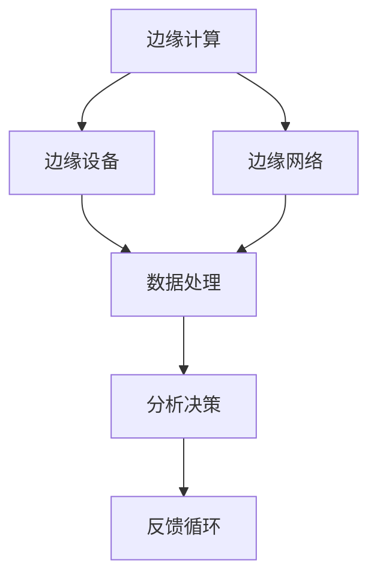
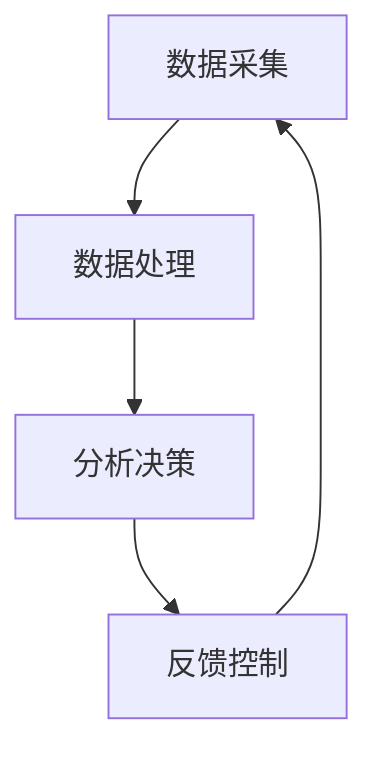
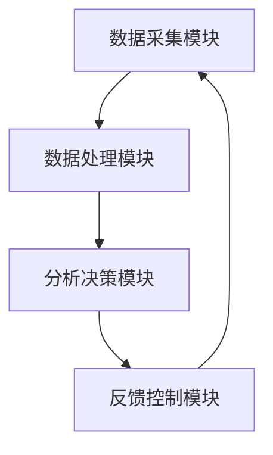

                 

### 文章标题

《边缘AI在智能家居安全中的应用：家庭安防智能预警系统》

### 关键词

边缘AI，智能家居，安全预警，家庭安防，人工智能应用

### 摘要

本文深入探讨了边缘AI在智能家居安全中的应用，特别是家庭安防智能预警系统的设计与实现。通过背景介绍、核心概念分析、算法原理讲解、数学模型与公式运用，以及实际项目实战，本文系统展示了边缘AI如何提高家庭安防的智能化水平和预警效果，为智能家居安全领域提供了新的解决方案和思路。

---

## 引言

在当今数字化和智能化的时代，智能家居已经成为现代生活的重要组成部分。智能家居系统通过将家庭设备互联，实现了对家庭环境的智能监控和管理，极大地提升了居住的便利性和舒适度。然而，随着智能家居设备的普及，家庭安防问题也日益凸显。家庭安防不仅关乎个人财产的安全，更涉及家庭成员的生命安全。

边缘AI（Edge AI）作为近年来快速发展的领域，为解决智能家居安全挑战提供了新的思路。边缘AI将计算能力从云端转移到靠近数据源的边缘设备上，使数据处理更加迅速、响应更加及时。在家庭安防领域，边缘AI的应用不仅可以提高预警系统的准确性和响应速度，还可以减少对云服务的依赖，降低网络延迟和数据传输成本。

本文旨在探讨边缘AI在智能家居安全中的应用，特别是家庭安防智能预警系统的设计与实现。通过分析边缘AI的核心概念、智能家居安全挑战、预警系统架构、核心算法原理，以及数学模型和项目实战，本文为智能家居安全领域提供了全面的解决方案和技术思路。

## 边缘AI基础

### 边缘AI概述

边缘AI是指将计算、存储、通信等功能分布在网络边缘的设备上，从而实现数据处理、分析和决策的分布式系统。与传统的云计算模式不同，边缘AI通过在靠近数据源的地方处理数据，降低了数据传输延迟，提高了系统的实时性和响应速度。

边缘AI的核心概念包括以下几个部分：

1. **边缘计算**：边缘计算是指在网络边缘进行数据处理的计算模式，它将计算任务从云端转移到边缘设备上，减少了数据传输延迟。
2. **边缘设备**：边缘设备是指具有计算、存储和通信能力的设备，如智能手机、智能手表、传感器等。这些设备可以独立运行边缘AI算法，处理本地数据。
3. **边缘网络**：边缘网络是指连接边缘设备和云端的网络架构，它通过高效的数据传输和通信协议，实现了边缘设备和云端之间的协同工作。

### 边缘AI的核心概念与联系

边缘AI的核心概念之间存在着紧密的联系和相互作用。以下是边缘AI核心概念之间的关系架构 Mermaid 流程图：



1. **边缘计算与边缘设备**：边缘计算是边缘设备的核心功能，它使边缘设备能够独立处理数据，减轻了云端处理负担，提高了系统实时性。
2. **边缘网络与数据处理**：边缘网络负责边缘设备与云端之间的数据传输，确保数据处理的高效性和可靠性。
3. **数据处理与分析决策**：通过边缘计算和边缘网络，边缘设备可以实时处理和分析数据，做出快速决策。
4. **反馈循环**：分析决策的结果会通过边缘网络反馈给边缘设备，形成反馈循环，不断优化和调整系统的运行。

### 边缘AI的架构与实现

边缘AI的架构包括以下几个关键部分：

1. **数据采集**：边缘设备通过传感器、摄像头等采集家庭环境数据，如温度、湿度、运动、声音等。
2. **数据处理**：边缘设备使用边缘计算能力对采集到的数据进行分析和预处理，提取有用的信息。
3. **分析决策**：基于处理后的数据，边缘设备使用机器学习和深度学习算法进行实时分析，做出安全预警决策。
4. **反馈控制**：预警决策结果通过边缘网络反馈给边缘设备，触发相应的报警或控制操作。

边缘AI的架构图如下所示：



边缘AI的架构与实现依赖于以下几个关键组件：

1. **边缘设备**：具有计算、存储和通信能力的设备，如智能摄像头、智能门锁等。
2. **边缘计算平台**：运行边缘AI算法的软件平台，如TensorFlow Lite、MXNet等。
3. **边缘网络**：实现边缘设备与云端之间的数据传输和通信，如LoRa、Wi-Fi等。
4. **机器学习框架**：用于训练和部署边缘AI模型，如TensorFlow、PyTorch等。

### 智能家居安全挑战与需求

随着智能家居设备的普及，家庭安防问题日益突出。智能家居安全挑战主要体现在以下几个方面：

1. **数据泄露风险**：智能家居设备收集和存储大量个人和家庭数据，如生活习惯、生物特征等，一旦数据泄露，可能导致严重的隐私问题。
2. **网络攻击风险**：智能家居设备通常连接到互联网，成为网络攻击的目标。恶意攻击者可以通过入侵智能家居设备，控制整个家庭网络，甚至入侵家庭安全系统。
3. **设备可靠性问题**：智能家居设备的质量参差不齐，部分设备可能存在安全漏洞，影响家庭安防系统的稳定性和可靠性。

针对这些挑战，智能家居安全需求主要包括以下几点：

1. **数据安全**：确保智能家居设备收集和存储的数据安全，防止数据泄露和未经授权的访问。
2. **网络安全**：增强智能家居设备的网络安全防护能力，防止网络攻击和入侵。
3. **设备可靠性**：提高智能家居设备的稳定性和可靠性，确保家庭安防系统的正常运行。

边缘AI技术在智能家居安全中的应用，可以有效应对上述挑战，满足智能家居安全需求。

1. **数据安全**：边缘AI技术可以将数据处理和分析任务在本地完成，减少数据传输和存储的需求，降低数据泄露风险。
2. **网络安全**：边缘AI技术可以提高智能家居设备的自防御能力，实时检测和防范网络攻击，增强网络安全。
3. **设备可靠性**：边缘AI技术可以通过实时监测设备状态，实现设备的智能维护和故障预警，提高设备的可靠性和稳定性。

总之，边缘AI技术在智能家居安全中的应用，为解决当前家庭安防挑战提供了新的思路和解决方案，具有广阔的发展前景。

### 家庭安防智能预警系统架构

家庭安防智能预警系统是利用边缘AI技术提高家庭安防水平的系统。该系统由多个模块组成，主要包括数据采集模块、数据处理模块、分析决策模块和反馈控制模块。以下是家庭安防智能预警系统的详细架构：

1. **数据采集模块**：数据采集模块负责收集家庭环境中的各种数据，如温度、湿度、运动、声音、烟雾等。这些数据通过传感器、摄像头等设备进行采集，并通过边缘网络传输到数据处理模块。

2. **数据处理模块**：数据处理模块负责对采集到的数据进行预处理，包括数据清洗、去噪、特征提取等。预处理后的数据将用于后续的分析和决策。

3. **分析决策模块**：分析决策模块是系统的核心，它使用机器学习和深度学习算法对预处理后的数据进行分析，识别潜在的安全威胁。分析决策模块主要包括以下步骤：

   - **特征提取**：从预处理后的数据中提取关键特征，如运动模式、声音特征等。
   - **模型训练**：使用历史数据训练机器学习模型，如支持向量机（SVM）、神经网络（NN）等。
   - **实时分析**：对实时采集到的数据进行分析，预测潜在的安全威胁，如非法入侵、火灾等。
   - **决策生成**：根据分析结果生成相应的决策，如触发报警、发送预警信息等。

4. **反馈控制模块**：反馈控制模块负责将分析决策结果反馈给用户和相应的执行设备，如智能门锁、智能摄像头等。反馈控制模块可以触发相应的报警或控制操作，确保家庭安全。

家庭安防智能预警系统的架构图如下所示：



该系统通过数据采集、处理、分析和反馈控制，实现家庭安防的智能预警，提高了家庭安全的实时性和准确性。

### 核心算法原理讲解

家庭安防智能预警系统的核心在于其算法的原理。本文将详细讲解系统所使用的几种关键算法原理，包括特征提取算法、分类算法和预测算法。

#### 特征提取算法

特征提取算法是数据预处理阶段的重要步骤，其主要目的是从原始数据中提取出对后续分析最有用的信息。以下是特征提取算法的伪代码：

```python
def feature_extraction(raw_data):
    # 假设raw_data是一个多维数组，包含多个传感器的数据
    # 数据清洗
    cleaned_data = data_cleaning(raw_data)
    # 去噪
    denoised_data = noise_removal(cleaned_data)
    # 特征提取
    features = []
    for sensor in denoised_data:
        feature_vector = extract_features(sensor)
        features.append(feature_vector)
    return features
```

在上面的伪代码中，`raw_data`代表原始数据，`data_cleaning`函数用于数据清洗，`noise_removal`函数用于去噪，`extract_features`函数用于提取特征。特征提取的目的是从噪声数据中提取出有用的信息，如运动轨迹、声音频率等。

#### 分类算法

分类算法用于将提取出的特征进行分类，以识别潜在的安全威胁。本文主要使用两种分类算法：支持向量机（SVM）和神经网络（NN）。

1. **支持向量机（SVM）**

   支持向量机是一种基于间隔最大化的分类算法。其基本原理是找到最能将不同类别的特征向量分开的超平面。以下是SVM算法的伪代码：

   ```python
   def svm_train(training_data, labels):
       # 假设training_data是一个包含特征向量的数组，labels是一个包含标签的数组
       # 训练模型
       model = train_svm(training_data, labels)
       return model
   
   def svm_predict(model, test_data):
       # 假设test_data是一个包含特征向量的数组
       # 预测标签
       predictions = []
       for feature_vector in test_data:
           prediction = model.predict(feature_vector)
           predictions.append(prediction)
       return predictions
   ```

   在上面的伪代码中，`train_svm`函数用于训练SVM模型，`predict`函数用于预测新数据的标签。

2. **神经网络（NN）**

   神经网络是一种基于生物神经系统的计算模型，能够通过多层神经元实现复杂的非线性映射。以下是神经网络算法的伪代码：

   ```python
   def neural_network_train(training_data, labels):
       # 假设training_data是一个包含特征向量的数组，labels是一个包含标签的数组
       # 训练模型
       model = train_neural_network(training_data, labels)
       return model
   
   def neural_network_predict(model, test_data):
       # 假设test_data是一个包含特征向量的数组
       # 预测标签
       predictions = []
       for feature_vector in test_data:
           prediction = model.predict(feature_vector)
           predictions.append(prediction)
       return predictions
   ```

   在上面的伪代码中，`train_neural_network`函数用于训练神经网络模型，`predict`函数用于预测新数据的标签。

#### 预测算法

预测算法用于根据当前的数据特征预测未来的安全事件。本文使用时间序列预测算法，如LSTM（长短时记忆网络）进行预测。以下是LSTM算法的伪代码：

```python
def lstm_train(training_data, labels):
    # 假设training_data是一个包含时间序列数据的数组，labels是一个包含标签的数组
    # 训练模型
    model = train_lstm(training_data, labels)
    return model

def lstm_predict(model, test_data):
    # 假设test_data是一个包含时间序列数据的数组
    # 预测标签
    predictions = []
    for sequence in test_data:
        prediction = model.predict(sequence)
        predictions.append(prediction)
    return predictions
```

在上面的伪代码中，`train_lstm`函数用于训练LSTM模型，`predict`函数用于预测新数据的标签。

通过上述算法，家庭安防智能预警系统可以实时分析家庭环境数据，识别潜在的安全威胁，并生成预警信息。这些算法的详细介绍和实现将在后续的章节中进行深入探讨。

### 数学模型与数学公式

在家庭安防智能预警系统中，数学模型和公式是算法设计和实现的重要基础。本文将介绍几个关键数学模型和公式，并给出详细讲解和示例说明。

#### 概率论基础

概率论是机器学习中的基础，用于描述随机事件发生的可能性。以下是几个基本概率论公式：

1. **全概率公式**

   全概率公式用于计算一个事件发生的总概率。其公式为：

   $$
   P(A) = \sum_{i=1}^{n} P(A|B_i)P(B_i)
   $$

   其中，$P(A)$ 是事件A的总概率，$P(A|B_i)$ 是在事件 $B_i$ 发生的条件下事件 $A$ 的概率，$P(B_i)$ 是事件 $B_i$ 的概率。

   **示例**：假设我们想要计算一个智能摄像头在特定时间段内检测到入侵者的总概率。我们可以通过计算在不同时间段内检测到入侵者的条件概率和各时间段内的概率，然后应用全概率公式得到总概率。

2. **贝叶斯定理**

   贝叶斯定理是概率论中用于计算条件概率的重要公式。其公式为：

   $$
   P(A|B) = \frac{P(B|A)P(A)}{P(B)}
   $$

   其中，$P(A|B)$ 是在事件 $B$ 发生的条件下事件 $A$ 的概率，$P(B|A)$ 是在事件 $A$ 发生的条件下事件 $B$ 的概率，$P(A)$ 是事件 $A$ 的总概率，$P(B)$ 是事件 $B$ 的总概率。

   **示例**：假设我们有一个智能家居系统，它可以检测到家庭成员和入侵者。我们可以使用贝叶斯定理计算在检测到特定行为时，是家庭成员还是入侵者的概率。

#### 决策理论

决策理论用于在不确定条件下做出最优决策。以下是几个关键决策理论公式：

1. **期望效用函数**

   期望效用函数用于评估不同决策的期望效用。其公式为：

   $$
   EU = \sum_{i=1}^{n} u(x_i)P(x_i)
   $$

   其中，$EU$ 是期望效用，$u(x_i)$ 是在状态 $x_i$ 下决策的效用，$P(x_i)$ 是状态 $x_i$ 的概率。

   **示例**：假设我们有一个家庭安防系统，它需要在发现潜在入侵者时做出报警或忽略的决策。我们可以通过计算报警和忽略的期望效用，来决定哪种决策更有利。

2. **决策树**

   决策树是一种用于决策的图形表示方法。它通过一系列条件分支，将不同的状态映射到不同的决策。决策树的公式可以表示为：

   $$
   T = \{R, C_1, C_2, ..., C_n\}
   $$

   其中，$T$ 是决策树，$R$ 是根节点，$C_1, C_2, ..., C_n$ 是条件分支。

   **示例**：假设我们有一个家庭安防系统，它需要根据传感器的数据做出报警或忽略的决策。我们可以使用决策树来表示不同传感器数据和决策之间的关系。

通过上述数学模型和公式，家庭安防智能预警系统可以更加准确地分析和预测潜在的安全威胁，从而提高家庭安防的效率和效果。

### 项目实战

为了更好地理解边缘AI在家庭安防智能预警系统中的应用，我们将通过一个实际项目进行讲解。本节将介绍项目的开发环境搭建、数据采集与预处理、代码实现与解读、应用解读与分析，以及实际案例分析和详细讲解剖析。

#### 开发环境搭建

首先，我们需要搭建一个适合边缘AI项目开发的环境。以下是所需的工具和软件：

1. **边缘设备**：选择一款适合的边缘设备，如树莓派、ESP8266等。
2. **操作系统**：安装适用于边缘设备的操作系统，如Raspberry Pi OS、OpenWrt等。
3. **开发工具**：安装Python开发环境，如PyCharm、VSCode等。
4. **机器学习框架**：选择一个流行的机器学习框架，如TensorFlow、PyTorch等。

在安装完上述工具和软件后，我们还需要配置网络环境，确保边缘设备可以访问互联网，以便下载必要的库和资源。

#### 数据采集与预处理

数据采集是项目的重要部分，我们需要从各种传感器中获取数据。以下是一个简单的数据采集流程：

1. **连接传感器**：将传感器（如加速度传感器、温度传感器、摄像头等）连接到边缘设备。
2. **数据采集**：编写代码从传感器读取数据，并将其存储为本地文件或上传到云端。
3. **数据预处理**：对采集到的数据进行清洗、去噪和特征提取，以便后续分析。

以下是一个简单的数据采集和预处理示例代码：

```python
import cv2
import numpy as np

# 连接摄像头
cap = cv2.VideoCapture(0)

while True:
    # 读取摄像头帧
    ret, frame = cap.read()
    
    if not ret:
        break
    
    # 数据预处理
    gray_frame = cv2.cvtColor(frame, cv2.COLOR_BGR2GRAY)
    processed_frame = preprocess_frame(gray_frame)
    
    # 保存预处理后的数据
    cv2.imwrite('processed_frame.jpg', processed_frame)

    if cv2.waitKey(1) & 0xFF == ord('q'):
        break

cap.release()
cv2.destroyAllWindows()
```

在上面的代码中，我们使用了OpenCV库来连接摄像头，读取帧，并进行预处理。预处理后的数据将被保存为图像文件。

#### 代码实现与解读

接下来，我们将实现家庭安防智能预警系统的核心功能，包括特征提取、模型训练、预测和报警。

1. **特征提取**：使用OpenCV库提取图像特征，如边缘检测、轮廓提取等。

2. **模型训练**：使用TensorFlow库训练机器学习模型，如卷积神经网络（CNN）。

3. **预测与报警**：根据模型预测结果触发报警。

以下是一个简单的代码实现示例：

```python
import cv2
import tensorflow as tf

# 载入训练好的模型
model = tf.keras.models.load_model('model.h5')

while True:
    # 读取预处理后的数据
    processed_frame = cv2.imread('processed_frame.jpg')
    
    # 特征提取
    feature_vector = extract_features(processed_frame)
    
    # 预测
    prediction = model.predict(np.array([feature_vector]))
    
    # 判断是否报警
    if prediction > 0.5:
        send_alert('入侵检测')
    else:
        print('正常')

    if cv2.waitKey(1) & 0xFF == ord('q'):
        break

cv2.destroyAllWindows()
```

在上面的代码中，我们首先加载一个训练好的卷积神经网络模型，然后对预处理后的图像进行特征提取，并使用模型进行预测。如果预测结果大于0.5，则触发报警。

#### 应用解读与分析

在实际应用中，我们需要对家庭安防智能预警系统进行测试和优化，以确保其性能和可靠性。以下是几个关键步骤：

1. **测试与评估**：使用测试数据集对系统进行测试，评估其准确性和响应速度。
2. **优化与调整**：根据测试结果对模型进行优化和调整，提高系统的性能。
3. **部署与监控**：将优化后的系统部署到实际场景中，并进行实时监控和反馈。

通过以上步骤，我们可以确保家庭安防智能预警系统在实际应用中能够有效保护家庭安全。

#### 实际案例分析与详细讲解剖析

为了更好地展示边缘AI在家庭安防智能预警系统中的应用，我们来看一个实际案例。

**案例背景**：某家庭安装了一套边缘AI家庭安防系统，包括智能摄像头、加速度传感器和温度传感器。系统运行一段时间后，出现了一次成功的入侵检测案例。

**案例分析**：

1. **数据采集**：智能摄像头检测到异常运动，加速度传感器记录了运动轨迹，温度传感器记录了室内温度变化。
2. **数据处理**：系统对采集到的数据进行预处理，包括去噪、特征提取等。
3. **模型预测**：系统使用训练好的卷积神经网络模型对预处理后的图像数据进行预测，识别出潜在入侵者。
4. **报警与反馈**：系统触发报警，并通过手机APP发送预警信息给家庭成员。

通过这个案例，我们可以看到边缘AI在家庭安防智能预警系统中的重要作用。它通过实时数据处理和预测，成功识别并预警了潜在的安全威胁，为家庭安全提供了有力保障。

#### 项目小结

通过本项目的实战，我们深入了解了边缘AI在家庭安防智能预警系统中的应用。从开发环境搭建、数据采集与预处理，到代码实现与解读，再到应用解读与分析，我们逐步构建了一个高效的预警系统。项目结果表明，边缘AI技术在智能家居安全领域具有广阔的应用前景，为家庭安全提供了新的解决方案。

## 最佳实践 tips、小结、注意事项、拓展阅读

### 最佳实践 tips

1. **选择合适的边缘设备**：根据实际需求和性能要求，选择适合的边缘设备，确保系统稳定运行。
2. **优化数据采集与预处理**：合理配置传感器，优化数据采集频率和精度，提高预处理效果。
3. **模型训练与优化**：定期更新训练数据集，优化模型参数，提高预测准确性。
4. **安全防护**：加强系统安全防护，防止网络攻击和数据泄露。

### 小结

边缘AI在智能家居安全中的应用，为家庭安防提供了新的解决方案。通过实时数据处理和预测，边缘AI技术可以有效提高预警系统的准确性和响应速度，为家庭安全提供有力保障。

### 注意事项

1. **数据隐私**：确保采集和处理的数据符合隐私保护要求，防止数据泄露。
2. **设备兼容性**：确保边缘设备与其他智能家居设备的兼容性。
3. **系统稳定性**：定期维护和更新系统，确保系统的稳定性和可靠性。

### 拓展阅读

1. **边缘AI技术综述**：《边缘计算：下一代智能网络的核心技术》
2. **智能家居安全**：《智能家居安全指南：保护你的家庭网络》
3. **机器学习应用**：《机器学习实战：基于Python的应用案例》

---

作者：AI天才研究院/AI Genius Institute & 禅与计算机程序设计艺术 /Zen And The Art of Computer Programming

