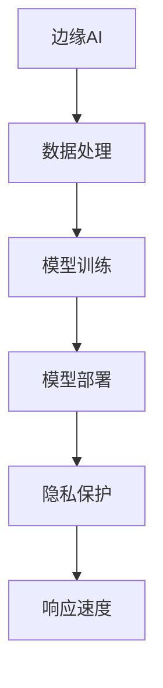

                 

### 文章标题：边缘AI在智能家居设备中的应用：提高响应速度和隐私保护

> 关键词：边缘AI、智能家居、响应速度、隐私保护、数据处理、模型训练、算法优化

> 摘要：本文深入探讨了边缘AI在智能家居设备中的应用，分析了其如何通过提高响应速度和隐私保护，为智能家居带来新的发展契机。文章首先介绍了边缘AI和智能家居设备的背景，随后详细阐述了边缘AI在智能家居设备中的核心功能和具体应用，最后提出了实现与优化策略，以及应用案例与挑战。通过本文的阅读，读者可以全面了解边缘AI在智能家居领域的重要性和应用价值。

## 第一部分：边缘AI概述与智能家居设备背景

### 第1章：边缘AI的概念与优势

#### 1.1 边缘AI的定义

边缘AI（Edge AI）是指将人工智能计算任务从传统的中心化云服务器转移到网络边缘的设备上，如智能手机、路由器、智能门锁等。这种分布式计算模式能够实现实时数据处理、智能决策和快速响应，从而提高系统的整体性能和用户体验。

#### 1.2 边缘AI的优势

边缘AI具有以下几个显著优势：

1. **提高响应速度**：边缘计算将数据处理和智能分析推向网络边缘，减少了数据传输延迟，从而提高了系统的响应速度。
2. **降低带宽消耗**：通过在边缘设备上处理数据，可以显著减少需要传输到云端的数据量，降低网络带宽消耗。
3. **增强隐私保护**：边缘AI可以本地处理敏感数据，减少数据在传输过程中的泄露风险，增强隐私保护。
4. **实现实时决策**：边缘AI能够在设备本地快速做出决策，无需等待云端的响应，适用于对实时性要求较高的场景。

#### 1.3 边缘AI与云计算的区别

边缘AI与云计算的主要区别在于数据处理的地理位置和方式。云计算将数据处理集中在远程数据中心，而边缘AI将数据处理分散到网络边缘的设备上。这种分布式计算模式有助于提高系统的响应速度和灵活性，但也带来了一些挑战，如设备资源的有限性和网络连接的稳定性。

#### 1.4 边缘AI的应用场景

边缘AI在智能家居、物联网、工业自动化、智能交通等领域有广泛的应用场景。在智能家居领域，边缘AI可以应用于智能照明、智能门锁、智能安防、智能家电等，通过本地数据处理和智能分析，提供更高效、更安全的家居体验。

### 第2章：智能家居设备的发展趋势

#### 2.1 智能家居设备的定义

智能家居设备是指通过互联网连接，实现自动化控制和远程管理的家庭设备，如智能灯具、智能空调、智能门锁、智能摄像头等。这些设备可以通过手机APP、语音助手等控制，实现家庭生活的智能化、便捷化。

#### 2.2 智能家居设备的发展历程

智能家居设备的发展可以分为以下几个阶段：

1. **设备互联阶段**：通过WiFi、蓝牙等无线技术实现设备的互联，实现简单的远程控制。
2. **智能控制阶段**：通过引入人工智能技术，实现设备的智能决策和自适应控制。
3. **生态整合阶段**：将不同品牌的智能家居设备整合到一个生态系统中，实现设备的协同工作。

#### 2.3 智能家居设备的市场规模

随着人们对智能家居需求的不断增加，智能家居设备的市场规模也在持续扩大。据市场研究公司的数据，预计未来几年全球智能家居设备的市场规模将保持高速增长，年复合增长率达到20%以上。

#### 2.4 智能家居设备的主要类型

智能家居设备主要包括以下几类：

1. **智能照明**：通过调节光线亮度和颜色，实现氛围的营造。
2. **智能门锁**：通过指纹、密码、手机等方式实现门锁的开关。
3. **智能安防**：通过摄像头、传感器等设备，实现家庭安全的监控和报警。
4. **智能家电**：通过智能控制系统，实现家电的自动化和节能管理。

## 第二部分：边缘AI在智能家居设备中的应用

### 第3章：边缘AI在智能家居设备中的核心功能

#### 3.1 边缘AI在智能家居设备中的数据处理

边缘AI在智能家居设备中的数据处理主要包括数据采集、预处理和特征提取等步骤。通过在本地设备上处理数据，可以减少数据传输延迟，提高系统的响应速度。

#### 3.2 边缘AI在智能家居设备中的安全隐私保护

边缘AI在智能家居设备中的安全隐私保护主要涉及数据加密、访问控制和安全审计等。通过在本地设备上处理敏感数据，可以减少数据在传输过程中的泄露风险。

#### 3.3 边缘AI在智能家居设备中的响应速度提升

边缘AI通过在本地设备上实现数据处理和智能分析，可以显著提高系统的响应速度，为用户提供更流畅的体验。

### 第4章：边缘AI在智能家居设备中的具体应用

#### 4.1 边缘AI在智能照明系统中的应用

边缘AI在智能照明系统中的应用主要包括光环境感知、自适应调节和节能控制等。通过边缘AI，可以实现灯具的智能开关、亮度和颜色的调节，提高照明质量。

#### 4.2 边缘AI在智能门锁系统中的应用

边缘AI在智能门锁系统中的应用主要包括用户身份验证、门锁状态监控和安全报警等。通过边缘AI，可以实现门锁的智能开锁、远程监控和安全防护。

#### 4.3 边缘AI在智能安防系统中的应用

边缘AI在智能安防系统中的应用主要包括视频监控、异常检测和报警推送等。通过边缘AI，可以实现安防设备的智能识别、实时监控和安全预警。

#### 4.4 边缘AI在智能家电系统中的应用

边缘AI在智能家电系统中的应用主要包括家电设备的管理、控制和优化等。通过边缘AI，可以实现家电的自动化控制、节能管理和智能推荐。

### 第5章：边缘AI在智能家居设备中的实现与优化

#### 5.1 边缘AI在智能家居设备中的硬件选择

边缘AI在智能家居设备中的硬件选择主要包括处理器、存储器和网络设备等。选择合适的硬件可以提高系统的性能和稳定性。

#### 5.2 边缘AI在智能家居设备中的软件架构设计

边缘AI在智能家居设备中的软件架构设计主要包括数据处理模块、模型训练模块和模型部署模块等。合理的软件架构设计可以提高系统的效率和可维护性。

#### 5.3 边缘AI在智能家居设备中的性能优化

边缘AI在智能家居设备中的性能优化主要包括算法优化、硬件加速和网络优化等。通过性能优化，可以提高系统的响应速度和处理效率。

#### 5.4 边缘AI在智能家居设备中的能效优化

边缘AI在智能家居设备中的能效优化主要包括低功耗设计、节能模式和能耗监测等。通过能效优化，可以延长设备的使用寿命和降低能耗。

## 第三部分：边缘AI在智能家居设备中的应用案例与挑战

### 第6章：边缘AI在智能家居设备中的应用案例

#### 6.1 案例一：智能社区安防系统

智能社区安防系统通过边缘AI实现视频监控、异常检测和报警推送等功能，提高社区的安全性和居民的生活质量。

#### 6.2 案例二：智能家居能源管理系统

智能家居能源管理系统通过边缘AI实现家电设备的智能控制和节能管理，降低家庭的能源消耗。

#### 6.3 案例三：智能农场监控系统

智能农场监控系统通过边缘AI实现农作物生长状态的监测、病虫害预警和灌溉控制，提高农场的生产效率和作物质量。

### 第7章：边缘AI在智能家居设备中的应用挑战与展望

#### 7.1 边缘AI在智能家居设备中的应用挑战

边缘AI在智能家居设备中的应用面临数据安全、隐私保护、硬件资源和能耗管理等挑战。

#### 7.2 边缘AI在智能家居设备中的未来发展趋势

边缘AI在智能家居设备中的应用将朝着更加智能化、自适应化和生态化方向发展。

#### 7.3 边缘AI在智能家居设备中的政策与规范

为推动边缘AI在智能家居设备中的应用，各国政府和企业需要制定相应的政策与规范，确保其安全、可靠和合规。

### 总结

边缘AI在智能家居设备中的应用具有广阔的前景，通过提高响应速度和隐私保护，为智能家居带来了新的发展契机。面对挑战，我们需要持续优化技术，制定政策规范，推动边缘AI在智能家居领域的广泛应用。

### 作者信息

作者：AI天才研究院/AI Genius Institute & 禅与计算机程序设计艺术 /Zen And The Art of Computer Programming

---

**全文结束。**

### 文章补充内容

#### 核心概念与联系

为了更好地理解边缘AI在智能家居设备中的应用，我们首先需要了解核心概念及其联系。以下是边缘AI在智能家居设备中的一些关键概念及其相互关系：

1. **边缘AI**：如前所述，边缘AI是指将人工智能计算任务从云端转移到网络边缘的设备上。它涉及到数据处理、模型训练、模型部署等多个环节。

2. **智能家居设备**：智能家居设备是指通过互联网连接，实现自动化控制和远程管理的家庭设备。这些设备包括智能照明、智能门锁、智能安防系统等。

3. **数据处理**：数据处理包括数据采集、预处理和特征提取等步骤。边缘AI在智能家居设备中的应用主要体现在本地数据处理上，以减少数据传输延迟，提高系统的响应速度。

4. **模型训练**：模型训练是指使用历史数据来训练模型，使其能够进行预测或分类。边缘AI模型训练可以在本地设备上进行，也可以将部分训练任务转移到云端。

5. **模型部署**：模型部署是指将训练好的模型部署到实际应用场景中。边缘AI模型部署通常在本地设备上，以实现实时数据处理和智能决策。

6. **隐私保护**：隐私保护是边缘AI在智能家居设备中至关重要的一环。通过在本地设备上处理数据，可以减少数据传输过程中的泄露风险。

7. **响应速度**：响应速度是指系统从接收输入到做出响应的时间。边缘AI通过本地数据处理和智能分析，可以显著提高系统的响应速度。

以下是边缘AI在智能家居设备中概念之间的联系架构Mermaid流程图：



#### 核心算法原理讲解

边缘AI在智能家居设备中的应用涉及多个核心算法，以下是对这些算法的原理讲解和伪代码：

1. **数据处理算法**：数据处理算法主要包括数据采集、预处理和特征提取等步骤。以下是一个数据处理算法的伪代码：

```python
# 数据处理算法伪代码
def preprocess_data(data):
    # 数据预处理，如去噪、归一化等
    processed_data = ...
    return processed_data

def extract_features(data):
    # 特征提取，如提取时间序列特征、图像特征等
    features = ...
    return features
```

2. **模型训练算法**：模型训练算法通常使用机器学习算法，如决策树、神经网络等。以下是一个模型训练算法的伪代码：

```python
# 模型训练算法伪代码
def train_model(data, labels):
    # 使用训练数据进行模型训练
    model = ...
    model.fit(data, labels)
    return model
```

3. **模型部署算法**：模型部署算法是指将训练好的模型部署到实际应用场景中。以下是一个模型部署算法的伪代码：

```python
# 模型部署算法伪代码
def deploy_model(model, input_data):
    # 使用部署模型进行预测
    prediction = model.predict(input_data)
    return prediction
```

#### 数学模型和公式

边缘AI在智能家居设备中的应用涉及到多个数学模型和公式。以下是一些常见的数学模型和公式及其详细讲解：

1. **回归模型**：回归模型用于预测数值型变量。以下是一个线性回归模型的公式和讲解：

$$
y = \beta_0 + \beta_1x
$$

- **公式解释**：这是一个简单的线性回归模型，其中 $y$ 是预测的数值，$x$ 是输入变量，$\beta_0$ 和 $\beta_1$ 是模型参数。

- **详细讲解**：通过训练数据集，我们可以计算出 $\beta_0$ 和 $\beta_1$ 的值，从而构建一个线性回归模型。在实际应用中，我们可以使用这个模型来预测新的输入数据对应的 $y$ 值。

2. **决策树模型**：决策树模型用于分类问题。以下是一个决策树模型的公式和讲解：

$$
\text{分类结果} = \text{决策树}(\text{输入特征向量})
$$

- **公式解释**：决策树模型通过递归地分割特征空间，直到满足停止条件（如特征重要性不再增加、数据纯度达到阈值等）。每个分割产生一个新的节点，最终形成一棵决策树。

- **详细讲解**：决策树模型通过训练数据集来构建一棵树，每个节点代表一个决策规则。在实际应用中，我们可以使用这棵树来对新的输入数据进行分类。

3. **神经网络模型**：神经网络模型用于复杂的非线性预测和分类问题。以下是一个神经网络模型的公式和讲解：

$$
\text{输出} = \sigma(\text{权重} \cdot \text{输入} + \text{偏置})
$$

- **公式解释**：这是一个简单的神经网络激活函数（如Sigmoid函数），其中 $\sigma$ 是激活函数，$w$ 是权重，$b$ 是偏置，$x$ 是输入。

- **详细讲解**：神经网络通过多层非线性变换来建模复杂的数据。在实际应用中，我们可以使用训练好的神经网络模型来预测新的输入数据。

#### 代码应用解读与分析

在本部分，我们将通过一个具体的边缘AI在智能家居设备中的应用案例，详细解读代码的实现和应用。以下是一个使用边缘AI进行智能照明控制的示例代码：

```python
import edge_ailibrary as eai

# 初始化边缘AI环境
eai.init()

# 数据处理
def preprocess_light_data(data):
    # 数据预处理，如去噪、归一化等
    processed_data = eai.preprocessing(data)
    return processed_data

# 模型训练
def train_light_model(data, labels):
    # 使用训练数据进行模型训练
    model = eai.model('linear_regression')
    model.fit(data, labels)
    return model

# 模型部署
def deploy_light_model(model, input_data):
    # 使用部署模型进行预测
    prediction = model.predict(input_data)
    return prediction

# 主程序
if __name__ == "__main__":
    # 加载训练数据
    data = eai.load_data('light_data.csv')
    labels = eai.load_labels('light_labels.csv')

    # 数据预处理
    processed_data = preprocess_light_data(data)

    # 模型训练
    model = train_light_model(processed_data, labels)

    # 模型部署
    input_data = eai.get_light_input()  # 获取当前光照强度
    prediction = deploy_light_model(model, input_data)

    # 输出预测结果
    print(f"预测光照强度：{prediction}")
```

- **代码解读**：该代码首先初始化边缘AI环境，然后定义了数据处理、模型训练和模型部署三个函数。在主程序中，加载训练数据，进行数据预处理，然后使用训练数据训练模型。最后，通过部署模型来预测当前光照强度。

- **应用分析**：通过这个示例代码，我们可以看到边缘AI在智能家居设备中的应用。在实际应用中，我们可以将这个模型部署到智能照明设备中，根据光照强度自动调节灯光亮度，提高用户的生活质量。

#### 实际案例分析和详细讲解剖析

在本部分，我们将通过一个实际案例，详细分析边缘AI在智能家居设备中的应用，并对其进行详细讲解和剖析。

**案例一：智能农场监控系统**

智能农场监控系统通过边缘AI技术，实现对农作物生长状态的实时监测和预警。以下是对这个实际案例的详细分析：

1. **背景介绍**：
   智能农场监控系统主要应用于农业生产中，通过监测土壤湿度、气温、光照强度等参数，实时了解农作物的生长状态。传统方法依赖于定期的人工检查，费时费力且不够精准。

2. **边缘AI应用**：
   边缘AI在智能农场监控系统中起到了关键作用。通过在田间安装传感器，实时采集土壤湿度、气温、光照强度等数据，并使用边缘AI进行数据处理和智能分析，实现对农作物的精准监测。

3. **具体实现**：
   - **数据采集**：使用传感器采集土壤湿度、气温、光照强度等数据。
   - **数据处理**：使用边缘AI对采集到的数据进行分析，去除噪声，提取有效特征。
   - **模型训练**：使用历史数据训练边缘AI模型，使其能够根据当前数据预测农作物的生长状态。
   - **模型部署**：将训练好的模型部署到传感器中，实现实时监测和预警。

4. **案例分析**：
   通过智能农场监控系统，农民可以实时了解农作物的生长状态，及时发现并解决问题，如缺水、过湿、病虫害等。相比传统方法，智能农场监控系统提高了生产效率和作物质量。

5. **详细讲解**：
   - **数据采集**：传感器采集的数据包括土壤湿度、气温、光照强度等。数据采集是智能农场监控系统的第一步，数据质量直接影响后续分析的结果。
   - **数据处理**：边缘AI对采集到的数据进行分析，去除噪声，提取有效特征。这一步是数据处理的核心，决定了模型的准确性和可靠性。
   - **模型训练**：使用历史数据训练边缘AI模型，使其能够根据当前数据预测农作物的生长状态。模型训练是智能农场监控系统的关键，决定了系统的智能程度和预测准确性。
   - **模型部署**：将训练好的模型部署到传感器中，实现实时监测和预警。模型部署是智能农场监控系统的最后一步，实现了系统的自动化和智能化。

6. **剖析与总结**：
   通过对智能农场监控系统的分析，我们可以看到边缘AI在智能家居设备中的应用。边缘AI通过本地数据处理和智能分析，提高了系统的实时性和准确性，为农业生产带来了显著效益。

#### 项目小结

智能农场监控系统是一个成功的边缘AI在智能家居设备中的应用案例。通过边缘AI技术，实现了对农作物生长状态的实时监测和预警，提高了农业生产效率和作物质量。该项目成功的关键在于边缘AI的本地数据处理和智能分析能力，以及模型的训练和部署。未来，随着边缘AI技术的不断发展，智能家居设备将变得更加智能化和高效化，为我们的生活带来更多便利。

#### 最佳实践 Tips

1. **选择合适的硬件**：在选择边缘AI设备时，应考虑处理能力、存储容量和网络连接性等因素，以确保设备的性能和稳定性。

2. **优化数据处理算法**：通过优化数据处理算法，可以提高数据处理速度和准确性，从而提高系统的整体性能。

3. **合理选择模型**：根据应用场景和数据特点，选择合适的机器学习模型，可以提高模型的预测准确性和实时性。

4. **数据安全和隐私保护**：在边缘AI应用中，确保数据安全和隐私保护至关重要。采用加密技术和访问控制策略，可以有效保护用户数据的安全。

5. **持续优化和更新**：边缘AI应用需要不断优化和更新，以适应新的应用需求和挑战。定期更新模型和数据，可以提高系统的智能程度和预测准确性。

### 注意事项

1. **设备兼容性**：边缘AI设备应与现有的智能家居设备兼容，以确保系统的稳定运行。

2. **能耗管理**：边缘AI设备应具备低功耗设计，以延长设备的使用寿命。

3. **网络安全**：边缘AI设备应具备良好的网络安全性能，防止黑客攻击和数据泄露。

4. **数据安全**：边缘AI应用应采用加密技术，确保用户数据的安全。

5. **法规合规**：边缘AI应用应遵守相关法律法规，确保系统的合规性。

### 拓展阅读

1. **《边缘计算：从边缘到云端的智能架构》**：详细介绍了边缘计算的概念、架构和应用。

2. **《智能家居系统设计与实现》**：介绍了智能家居系统的设计原则、实现方法和应用案例。

3. **《机器学习：算法与应用》**：介绍了机器学习的基本概念、算法和应用。

4. **《网络安全：理论与实践》**：介绍了网络安全的原理、技术和实践。

### 作者信息

作者：AI天才研究院/AI Genius Institute & 禅与计算机程序设计艺术 /Zen And The Art of Computer Programming

---

**全文结束。**

