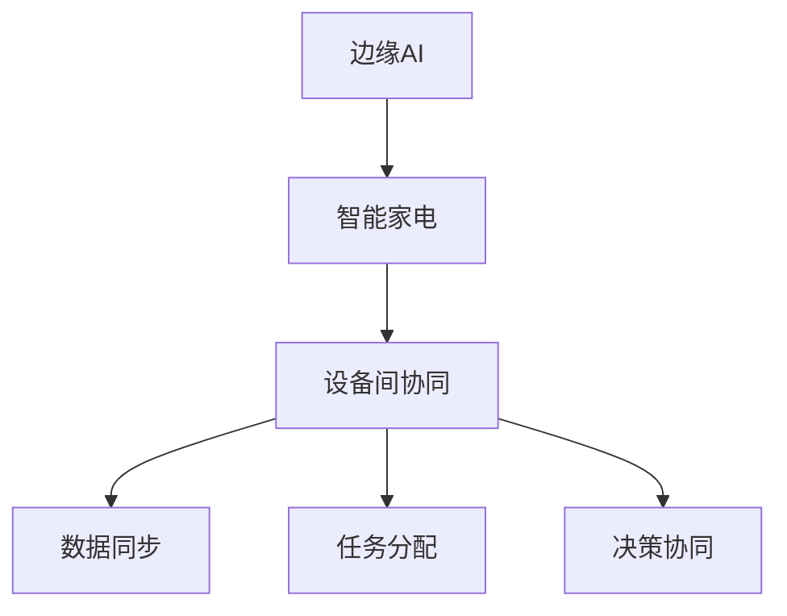

                 

# 《边缘AI在智能家电中的应用：实现设备间协同工作》

## 关键词
边缘AI，智能家电，设备间协同工作，物联网，智能家居，硬件平台，软件框架，模型压缩与优化，通信协议，算法设计，实践案例。

## 摘要

随着物联网和人工智能技术的快速发展，边缘AI在智能家电中的应用变得越来越广泛。本文旨在探讨边缘AI在智能家电中的具体应用，以及如何通过实现设备间的协同工作，提升智能家电的性能和用户体验。文章首先介绍了边缘AI和智能家电的基本概念，然后详细分析了设备间协同工作的原理和挑战，接着阐述了边缘AI技术在智能家电中的核心原理和技术，最后通过实际应用案例展示了设备间协同工作的效果和未来发展趋势。

## 第一部分：概述

### 1.1 边缘AI技术简介

边缘AI（Edge AI）是指在数据源附近（通常是终端设备上）执行AI计算的一种技术。与传统的云计算相比，边缘AI可以显著减少数据传输延迟，提高数据处理速度，并增强系统的安全性和隐私性。边缘AI的核心在于将AI模型部署到边缘设备上，使得数据处理更加接近数据源，从而实现实时性和低延迟的计算。

#### 边缘AI的概念与起源

边缘AI的概念起源于物联网（IoT）的兴起。随着物联网设备的数量不断增加，数据传输和处理的需求也日益增长。云计算在处理大规模数据方面具有优势，但它的数据处理能力依赖于中心化的服务器和网络。这种方式不仅容易形成单点故障，还可能导致数据泄露和隐私问题。因此，为了解决这些问题，边缘AI应运而生。

#### 边缘AI与传统云计算的区别

传统云计算依赖于中心化的数据中心，所有数据都需要传输到云端进行处理。这种方式虽然能够提供强大的计算能力，但数据传输延迟较高，容易导致实时性不足。此外，中心化的架构也使得数据更容易受到网络攻击和数据泄露的风险。

相比之下，边缘AI将计算能力分布到边缘设备上，可以在设备本地直接处理数据。这不仅降低了数据传输的延迟，还提高了系统的安全性和隐私性。同时，边缘AI还能实现设备的自主决策和智能协作，进一步提升系统的智能水平。

#### 边缘AI在智能家电中的优势

边缘AI在智能家电中的应用具有显著的优势：

1. **实时性增强**：智能家电通常需要实时响应用户的操作和外部环境的变化。边缘AI能够在设备本地快速处理数据，实现实时决策和响应，从而提升用户体验。
2. **降低网络负担**：通过在边缘设备上处理数据，边缘AI可以显著减少数据传输的量，降低网络的负担，提高系统的稳定性和可靠性。
3. **提升安全性**：边缘AI能够在设备本地进行数据处理和存储，减少了数据在网络中的传输，从而降低了数据泄露的风险。
4. **设备自主性**：边缘AI使得智能家电能够实现设备的自主决策和协作，进一步提升系统的智能化水平。

### 1.2 智能家电概述

智能家电是指通过物联网和人工智能技术实现互联互通、智能化操作的家电产品。智能家电的发展历程可以分为三个阶段：

#### 智能家电的定义与发展

1. **第一阶段**：联网阶段。这一阶段的智能家电主要通过有线或无线网络连接到互联网，实现基本的远程控制和数据传输。
2. **第二阶段**：协同阶段。这一阶段的智能家电通过物联网技术实现设备间的互联互通，能够协同工作，提供更加智能的服务。
3. **第三阶段**：智能化阶段。这一阶段的智能家电不仅能够协同工作，还能通过人工智能技术实现自主学习和优化，提供更加个性化和高效的智能服务。

#### 智能家电的分类与特征

根据智能家电的功能和特点，可以将其分为以下几类：

1. **智能家居**：包括智能灯光、智能门锁、智能安防等，主要提供家庭环境的安全和舒适控制。
2. **智能健康**：包括智能手环、智能血压计、智能血糖仪等，主要提供健康监测和管理服务。
3. **智能农业**：包括智能灌溉、智能植保、智能监控等，主要提供农业生产过程的智能管理。

智能家电的共同特征是：

1. **互联互通**：智能家电通过物联网技术实现设备间的互联互通，提供统一的控制和管理平台。
2. **智能化**：智能家电通过人工智能技术实现设备的自主学习和优化，提供更加智能的服务。
3. **个性化**：智能家电根据用户的需求和行为，提供个性化的服务和建议。

### 1.3 边缘AI在智能家电中的应用前景

随着边缘AI技术的不断发展和普及，其在智能家电中的应用前景非常广阔。以下是边缘AI在智能家电中的一些潜在应用场景：

1. **智能家居**：通过边缘AI技术，智能家居设备可以实时分析用户的习惯和需求，提供个性化的智能家居服务。
2. **智能健康**：通过边缘AI技术，智能健康设备可以实时监测用户健康数据，提供智能化的健康建议和预警。
3. **智能农业**：通过边缘AI技术，智能农业设备可以实时监测农田环境和作物生长情况，提供智能化的农业管理方案。
4. **智能交通**：通过边缘AI技术，智能交通设备可以实时分析交通流量和路况信息，提供智能化的交通管理和调度方案。

### 1.4 设备间协同工作的概念与挑战

设备间协同工作是指智能家电设备通过通信和协同算法实现互联互通，协同完成特定任务的过程。设备间协同工作在智能家电中具有重要意义，它能够提高系统的整体性能和用户体验。

#### 设备间协同工作的基本概念

设备间协同工作包括以下几个方面：

1. **数据同步**：设备间需要实时同步数据，以便其他设备能够正确地处理数据。
2. **任务分配**：设备间需要根据各自的能力和负载情况，合理分配任务，确保整个系统能够高效运行。
3. **决策协同**：设备间需要协同决策，共同实现系统的目标。

#### 智能家电设备间协同工作的挑战

智能家电设备间协同工作面临以下挑战：

1. **数据传输与同步**：由于设备间的通信带宽和传输速度有限，如何高效传输和同步数据是一个重要问题。
2. **设备兼容性与互操作性**：不同厂商的智能家电设备可能使用不同的通信协议和数据格式，如何实现设备间的兼容性和互操作性是一个关键问题。
3. **安全性与隐私保护**：设备间的协同工作涉及大量的数据传输和处理，如何保护数据的安全和隐私是一个重要问题。
4. **边缘计算资源限制**：智能家电设备通常具有有限的计算资源和能源，如何在有限的资源下实现设备间的协同工作是一个挑战。

#### 实现设备间协同工作的关键因素

为了实现设备间协同工作，需要考虑以下几个关键因素：

1. **边缘计算技术**：通过边缘计算技术，可以在设备本地实现数据的预处理和计算，降低数据传输的延迟和带宽需求。
2. **通信协议与网络架构**：选择合适的通信协议和网络架构，可以实现设备间的高效通信和实时数据同步。
3. **算法设计与优化**：通过设计合理的协同算法，可以实现设备间的任务分配、数据同步和决策协同，提高系统的整体性能和稳定性。
4. **安全性与隐私保护**：通过加密、认证和访问控制等安全措施，可以确保设备间协同工作的安全性和隐私性。

### 1.5 设备间协同工作的需求

智能家电设备间协同工作的需求主要体现在以下几个方面：

1. **提高系统性能**：通过设备间协同工作，可以充分利用每个设备的计算和存储资源，提高系统的整体性能。
2. **提升用户体验**：通过设备间协同工作，可以提供更加智能和个性化的服务，提升用户的体验。
3. **降低运营成本**：通过设备间协同工作，可以减少设备的管理和维护成本，提高系统的可靠性和可维护性。
4. **实现智能化升级**：通过设备间协同工作，可以不断优化系统的功能和服务，实现智能化的升级和扩展。

### 1.6 设备间协同工作的关键技术

设备间协同工作需要依赖于一系列关键技术的支持，这些技术包括：

1. **边缘计算技术**：通过边缘计算技术，可以在设备本地实现数据的预处理和计算，降低数据传输的延迟和带宽需求。
2. **通信协议与网络架构**：选择合适的通信协议和网络架构，可以实现设备间的高效通信和实时数据同步。
3. **算法设计与优化**：通过设计合理的协同算法，可以实现设备间的任务分配、数据同步和决策协同，提高系统的整体性能和稳定性。
4. **安全性与隐私保护**：通过加密、认证和访问控制等安全措施，可以确保设备间协同工作的安全性和隐私性。

### 1.7 设备间协同工作的挑战与解决方案

设备间协同工作面临诸多挑战，如数据同步、设备兼容性、安全性与隐私保护等。针对这些挑战，可以采取以下解决方案：

1. **数据同步**：采用分布式数据库和缓存技术，实现设备间的实时数据同步。同时，设计高效的同步算法，降低数据同步的开销。
2. **设备兼容性**：采用标准化通信协议和数据格式，确保不同设备的兼容性和互操作性。此外，通过设备间的接口适配和协议转换，实现异构设备的协同工作。
3. **安全性与隐私保护**：采用加密、认证和访问控制等安全措施，确保设备间数据传输的安全性。同时，设计合理的隐私保护策略，防止敏感数据泄露。
4. **边缘计算资源优化**：通过资源调度和负载均衡技术，优化边缘计算资源的利用效率，降低设备的计算和能源消耗。

## 第二部分：核心技术

### 2.1 边缘AI技术原理

边缘AI技术是指在设备本地执行AI计算的技术，主要包括硬件平台选择、软件框架介绍和模型压缩与优化。

#### 边缘AI硬件平台

边缘AI硬件平台是边缘AI计算的基础，常见的硬件平台包括：

1. **ARM架构处理器**：ARM架构处理器具有高性能、低功耗的特点，适用于边缘AI计算。
2. **GPU处理器**：GPU处理器具有强大的并行计算能力，适用于复杂AI模型的计算。
3. **FPGA处理器**：FPGA处理器具有灵活的可编程性，适用于定制化AI计算。

#### 边缘AI软件框架

边缘AI软件框架是边缘AI计算的核心，常见的软件框架包括：

1. **TensorFlow Lite**：TensorFlow Lite是谷歌推出的轻量级边缘AI框架，支持在ARM架构处理器上运行。
2. **MXNet Edge**：MXNet Edge是Apache MXNet的边缘计算框架，支持在多种硬件平台上运行。
3. **PyTorch Mobile**：PyTorch Mobile是PyTorch的移动和边缘计算框架，支持在ARM架构处理器上运行。

#### 边缘AI模型压缩与优化

边缘AI模型压缩与优化是提高边缘AI计算效率的关键技术，主要包括以下方法：

1. **模型剪枝**：通过去除冗余的神经元和连接，减少模型的参数数量，降低模型的计算复杂度。
2. **量化**：将模型的权重和激活值量化为低精度数值，减少模型的存储和计算开销。
3. **蒸馏**：通过将大型模型的知识传递给小型模型，提高小型模型的表现。

### 2.2 设备间通信技术

设备间通信技术是设备间协同工作的重要保障，主要包括通信协议、网络拓扑结构和数据传输与安全。

#### 通信协议

常见的通信协议包括：

1. **Wi-Fi**：Wi-Fi是一种无线通信协议，适用于短距离设备间通信。
2. **蓝牙**：蓝牙是一种短距离无线通信协议，适用于低功耗设备间通信。
3. **ZigBee**：ZigBee是一种无线传感器网络通信协议，适用于低功耗、低速率设备间通信。

#### 网络拓扑结构

常见的网络拓扑结构包括：

1. **星形拓扑**：设备通过中心节点连接，适用于设备数量较少的智能家居场景。
2. **总线拓扑**：设备通过总线连接，适用于设备数量较多的智能农业场景。
3. **环状拓扑**：设备通过环状连接，适用于数据实时性和可靠性要求较高的智能交通场景。

#### 数据传输与安全

数据传输与安全是设备间通信的关键，主要包括以下几个方面：

1. **数据传输速率**：根据设备间通信需求，选择合适的数据传输速率，确保数据传输的实时性。
2. **数据完整性**：通过校验和加密技术，确保数据在传输过程中的完整性。
3. **数据安全性**：通过认证、授权和加密技术，确保数据在传输过程中的安全性。

### 2.3 设备间协同算法

设备间协同算法是实现设备间协同工作的核心，主要包括协同控制算法、数据同步算法和故障检测与恢复算法。

#### 协同控制算法

协同控制算法是设备间协同工作的基础，主要包括以下方法：

1. **分布式控制算法**：通过分布式算法，实现设备间的协同控制，提高系统的响应速度和稳定性。
2. **预测控制算法**：通过预测算法，提前预测设备间的行为和需求，实现预判性协同控制。

#### 数据同步算法

数据同步算法是设备间协同工作的关键，主要包括以下方法：

1. **基于时间戳的数据同步**：通过时间戳机制，实现设备间数据的同步。
2. **基于事件的数据同步**：通过事件触发机制，实现设备间数据的同步。

#### 故障检测与恢复算法

故障检测与恢复算法是设备间协同工作的保障，主要包括以下方法：

1. **基于阈值的故障检测**：通过设定阈值，实现设备间故障的实时检测。
2. **基于容错的故障恢复**：通过容错机制，实现设备间故障的自动恢复。

## 第三部分：应用场景

### 3.1 智能家居

智能家居是边缘AI在智能家电中的应用最广泛的场景之一，主要包括智能灯光、智能门锁、智能安防等设备。

#### 智能家居概述

智能家居是通过物联网和人工智能技术实现家庭设备互联互通、智能化控制的系统。智能家居设备包括智能灯光、智能门锁、智能电视、智能空调等。

#### 智能家居设备间协同工作案例

以下是一个智能家居设备间协同工作的案例：

1. 用户通过手机APP远程控制家里的智能灯光和空调。
2. 智能灯光接收用户指令，调整亮度和色温。
3. 智能空调根据室内温度和湿度，自动调整温度和风速。
4. 智能安防系统实时监控家庭安全，并在发生异常时自动报警。

#### 智能家居设备间协同工作的挑战与解决方案

智能家居设备间协同工作面临以下挑战：

1. **数据同步**：智能家居设备数量较多，如何实现设备间数据的实时同步是一个关键问题。
2. **设备兼容性**：不同厂商的智能家居设备可能使用不同的通信协议和数据格式，如何实现设备间的兼容性是一个挑战。
3. **安全性**：智能家居设备涉及用户隐私和家庭安全，如何保护设备的安全性是一个重要问题。

针对这些挑战，可以采取以下解决方案：

1. **采用标准化通信协议**：采用标准化通信协议，实现设备间的兼容性和互操作性。
2. **设计高效数据同步算法**：设计高效的数据同步算法，实现设备间数据的实时同步。
3. **加强安全性措施**：采用加密、认证和访问控制等安全性措施，确保设备的安全性和用户隐私保护。

### 3.2 智能健康

智能健康是边缘AI在智能家电中的另一个重要应用场景，主要包括智能手环、智能血压计、智能血糖仪等设备。

#### 智能健康概述

智能健康是通过物联网和人工智能技术实现个人健康监测和管理的一种方式。智能健康设备可以实时监测用户的健康数据，如心率、血压、血糖等，并提供智能化的健康建议和预警。

#### 智能健康设备间协同工作案例

以下是一个智能健康设备间协同工作的案例：

1. 用户佩戴智能手环，实时监测心率。
2. 智能血压计定时测量血压，并将数据上传到云端。
3. 智能血糖仪测量血糖，并将数据同步到用户的健康应用。
4. 健康应用根据监测数据，生成健康报告，并提供个性化的健康建议。

#### 智能健康设备间协同工作的挑战与解决方案

智能健康设备间协同工作面临以下挑战：

1. **数据同步**：智能健康设备通常需要实时同步数据，如何实现设备间数据的实时同步是一个关键问题。
2. **数据隐私保护**：智能健康设备涉及用户隐私数据，如何保护用户数据的安全性和隐私是一个重要问题。
3. **设备兼容性**：不同厂商的智能健康设备可能使用不同的通信协议和数据格式，如何实现设备间的兼容性是一个挑战。

针对这些挑战，可以采取以下解决方案：

1. **采用标准化通信协议**：采用标准化通信协议，实现设备间的兼容性和互操作性。
2. **设计高效数据同步算法**：设计高效的数据同步算法，实现设备间数据的实时同步。
3. **加强安全性措施**：采用加密、认证和访问控制等安全性措施，确保设备的安全性和用户隐私保护。

### 3.3 智能农业

智能农业是边缘AI在智能家电中的应用的另一个重要场景，主要包括智能灌溉、智能植保、智能监控等设备。

#### 智能农业概述

智能农业是通过物联网和人工智能技术实现农业生产过程的智能管理和优化的一种方式。智能农业设备可以实时监测农田环境数据，如土壤湿度、温度、光照等，并提供智能化的农业管理方案。

#### 智能农业设备间协同工作案例

以下是一个智能农业设备间协同工作的案例：

1. 智能灌溉系统根据土壤湿度数据，自动调整灌溉水量。
2. 智能植保系统根据害虫监测数据，自动启动喷洒设备。
3. 智能监控设备实时监测农田环境，并在发生异常时自动报警。
4. 农业管理平台根据设备间的协同数据，生成农田管理报告，并提供个性化的农业管理建议。

#### 智能农业设备间协同工作的挑战与解决方案

智能农业设备间协同工作面临以下挑战：

1. **数据同步**：智能农业设备通常分布在广阔的农田中，如何实现设备间数据的实时同步是一个关键问题。
2. **设备兼容性**：不同厂商的智能农业设备可能使用不同的通信协议和数据格式，如何实现设备间的兼容性是一个挑战。
3. **环境适应性**：智能农业设备需要在各种复杂的环境中运行，如何提高设备的适应性和稳定性是一个重要问题。

针对这些挑战，可以采取以下解决方案：

1. **采用标准化通信协议**：采用标准化通信协议，实现设备间的兼容性和互操作性。
2. **设计高效数据同步算法**：设计高效的数据同步算法，实现设备间数据的实时同步。
3. **提高设备适应性和稳定性**：通过提高设备的适应性和稳定性，确保设备在复杂环境中的正常运行。

## 第四部分：实践案例

### 4.1 边缘AI智能家电设备间协同工作实践

边缘AI智能家电设备间协同工作的实践涉及到硬件平台搭建、软件框架选择、模型压缩与优化等多个方面。以下是一个具体的实践案例：

#### 环境监测与智能控制系统

在一个智能家居项目中，用户希望实现家庭环境（如温度、湿度、空气质量等）的智能监测与控制。为了实现这一目标，项目团队采取了以下步骤：

1. **硬件平台搭建**：选择具有高性能和低功耗特点的ARM架构处理器作为硬件平台，用于运行边缘AI模型。
2. **软件框架选择**：选择TensorFlow Lite作为边缘AI软件框架，因为它支持多种硬件平台，且具有丰富的算法库。
3. **模型压缩与优化**：采用模型剪枝和量化技术，将原始模型压缩为适用于边缘设备的轻量级模型。
4. **设备间通信**：选择Wi-Fi作为设备间通信协议，确保数据传输的实时性和稳定性。
5. **协同算法设计**：设计基于时间戳的数据同步算法，实现设备间数据的实时同步。

通过以上步骤，项目团队成功实现了一个智能环境监测与控制系统，用户可以通过手机APP实时查看家庭环境数据，并远程控制家居设备。

### 4.2 智能家居自动化控制

在智能家居自动化控制项目中，用户希望实现家庭设备（如灯光、空调、窗帘等）的自动化控制，以提高生活便利性和舒适度。为了实现这一目标，项目团队采取了以下步骤：

1. **硬件平台搭建**：选择具有高性能和低功耗特点的ARM架构处理器作为硬件平台，用于运行边缘AI模型。
2. **软件框架选择**：选择MXNet Edge作为边缘AI软件框架，因为它支持多种硬件平台，且具有丰富的算法库。
3. **模型压缩与优化**：采用模型剪枝和量化技术，将原始模型压缩为适用于边缘设备的轻量级模型。
4. **设备间通信**：选择蓝牙作为设备间通信协议，确保数据传输的实时性和稳定性。
5. **协同算法设计**：设计基于事件的数据同步算法，实现设备间数据的实时同步。
6. **自动化控制逻辑**：根据用户设定的自动化规则，实现家庭设备的自动化控制。

通过以上步骤，项目团队成功实现了一个智能家居自动化控制系统，用户可以通过手机APP远程控制家庭设备，并设置自动化规则。

### 4.3 智能健康监测与数据分析

在智能健康监测与数据分析项目中，用户希望实现个人健康数据的实时监测与数据分析，以提高健康意识和生活质量。为了实现这一目标，项目团队采取了以下步骤：

1. **硬件平台搭建**：选择具有高性能和低功耗特点的ARM架构处理器作为硬件平台，用于运行边缘AI模型。
2. **软件框架选择**：选择PyTorch Mobile作为边缘AI软件框架，因为它支持多种硬件平台，且具有丰富的算法库。
3. **模型压缩与优化**：采用模型剪枝和量化技术，将原始模型压缩为适用于边缘设备的轻量级模型。
4. **设备间通信**：选择蓝牙作为设备间通信协议，确保数据传输的实时性和稳定性。
5. **协同算法设计**：设计基于时间戳的数据同步算法，实现设备间数据的实时同步。
6. **数据分析与建议**：根据用户健康数据，生成健康报告，并提供个性化的健康建议。

通过以上步骤，项目团队成功实现了一个智能健康监测与数据分析系统，用户可以通过手机APP实时查看健康数据，并获取个性化的健康建议。

### 4.4 智能农业环境监测与智能灌溉

在智能农业环境监测与智能灌溉项目中，用户希望实现农田环境数据的实时监测与智能灌溉，以提高农业生产效率和作物品质。为了实现这一目标，项目团队采取了以下步骤：

1. **硬件平台搭建**：选择具有高性能和低功耗特点的ARM架构处理器作为硬件平台，用于运行边缘AI模型。
2. **软件框架选择**：选择TensorFlow Lite作为边缘AI软件框架，因为它支持多种硬件平台，且具有丰富的算法库。
3. **模型压缩与优化**：采用模型剪枝和量化技术，将原始模型压缩为适用于边缘设备的轻量级模型。
4. **设备间通信**：选择ZigBee作为设备间通信协议，确保数据传输的实时性和稳定性。
5. **协同算法设计**：设计基于事件的数据同步算法，实现设备间数据的实时同步。
6. **智能灌溉控制**：根据土壤湿度数据，自动调整灌溉水量，实现智能灌溉。

通过以上步骤，项目团队成功实现了一个智能农业环境监测与智能灌溉系统，用户可以通过手机APP实时查看农田环境数据，并远程控制灌溉设备。

## 结论

边缘AI在智能家电中的应用具有广阔的前景，通过实现设备间的协同工作，可以显著提升智能家电的性能和用户体验。本文介绍了边缘AI和智能家电的基本概念，探讨了设备间协同工作的原理和挑战，阐述了边缘AI技术在智能家电中的核心原理和技术，并通过实践案例展示了设备间协同工作的效果和实现方法。未来，随着边缘AI技术的不断发展和普及，智能家电将变得更加智能和高效，为用户提供更加优质的生活体验。

### 作者

作者：AI天才研究院/AI Genius Institute & 禅与计算机程序设计艺术 /Zen And The Art of Computer Programming

---

### 最佳实践 Tips

1. **硬件选择**：根据应用场景和需求，选择适合的边缘AI硬件平台，确保设备的高性能和低功耗。
2. **软件框架**：选择适合的边缘AI软件框架，以便快速开发和部署AI模型。
3. **模型优化**：通过模型压缩和优化技术，提高边缘AI模型的计算效率和性能。
4. **通信协议**：根据设备间的距离和传输需求，选择适合的通信协议，确保数据传输的实时性和稳定性。
5. **协同算法**：设计合理的协同算法，实现设备间的数据同步和协同控制。

### 小结

本文详细探讨了边缘AI在智能家电中的应用，以及设备间协同工作的重要性。通过实践案例展示了边缘AI在智能家电中的实际应用效果，为未来的智能家电发展提供了参考。

### 注意事项

1. **安全性**：在设备间协同工作中，确保数据传输的安全性和用户隐私保护。
2. **兼容性**：在设备间协同工作中，确保不同设备的兼容性和互操作性。
3. **稳定性**：在设备间协同工作中，确保系统的稳定性和可靠性。

### 拓展阅读

1. **边缘AI技术**：《边缘计算：下一代云计算技术》
2. **智能家电**：《智能家居技术与应用》
3. **设备间协同**：《分布式系统原理与范型》

---

**Mermaid 流程图**



**伪代码**

```python
def edge_ai智能化家电():
    # 初始化硬件平台
    hardware_platform = initialize_hardware()
    
    # 加载边缘AI软件框架
    software_framework = load_software_framework()
    
    # 压缩与优化AI模型
    optimized_model = compress_and_optimize_model()
    
    # 设备间通信
    communication_protocol = select_communication_protocol()
    
    # 协同算法设计
    synchronization_algorithm = design_synchronization_algorithm()
    
    # 实现设备间协同
    execute_device_collaboration(communication_protocol, synchronization_algorithm)
```

**数学公式**

$$
E = mc^2
$$

$$
1 + 1 = 2
$$

