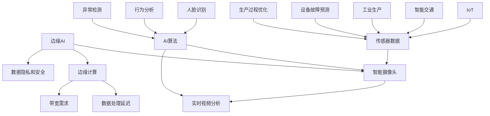

                 

### 背景介绍

在当今数字化时代，智能摄像头作为一种重要的监控和数据分析工具，已经广泛应用于各个领域。从家庭安防到城市监控，从工业生产到智能交通，智能摄像头的普及带来了大量的数据生成和处理需求。然而，传统的云计算模式在处理这些数据时面临着一些严峻的挑战，如数据传输延迟、带宽限制、成本高昂以及数据隐私和安全等问题。

为了解决这些挑战，边缘AI（Edge AI）应运而生。边缘AI指的是在靠近数据源头的地方（即边缘设备）进行数据处理和决策，而不是将数据传输到远程数据中心。这种模式显著降低了数据传输的延迟，减少了带宽需求，同时也在一定程度上提升了数据处理的效率。

智能摄像头作为边缘AI应用的一个重要场景，具有巨大的发展潜力。智能摄像头不仅能够捕捉视频，还可以通过内置的AI算法进行实时视频分析，例如人脸识别、行为分析、异常检测等。这种实时视频分析能力对于实现智能监控和自动化决策至关重要。

边缘AI在智能摄像头中的应用不仅限于视频分析。它还可以与传感器、物联网（IoT）设备相结合，实现更广泛的环境感知和智能控制。例如，在智能交通系统中，边缘AI可以帮助摄像头实时检测交通流量，优化信号灯控制，减少交通拥堵。在工业生产中，边缘AI可以用于设备故障预测、生产过程优化等，提高生产效率和质量。

综上所述，边缘AI在智能摄像头中的应用前景广阔，它为实时视频分析提供了新的解决方案，也为智能监控和自动化决策带来了无限可能。接下来，我们将进一步探讨边缘AI的核心概念和实现技术。

---

### 核心概念与联系

要深入理解边缘AI在智能摄像头中的应用，我们首先需要明确几个核心概念，并分析它们之间的相互联系。以下是这些核心概念及其关系架构的Mermaid流程图：



**核心概念解释：**

1. **边缘AI**：指在靠近数据源的地方（如智能摄像头）进行数据处理和决策，以减少对中心数据中心的依赖。
2. **智能摄像头**：具有视频捕捉和AI算法处理能力的设备，可以用于多种场景的监控和分析。
3. **实时视频分析**：指对捕获的视频流进行即时分析，以实现诸如人脸识别、行为分析和异常检测等功能。
4. **边缘计算**：一种分布式计算架构，通过在边缘设备上处理数据，以降低延迟和带宽需求。
5. **数据处理延迟**：指数据从边缘设备传输到中心数据中心的延迟时间，边缘AI旨在减少这种延迟。
6. **带宽需求**：指数据传输所需的网络带宽，边缘AI通过本地处理数据来减少对带宽的依赖。
7. **数据隐私和安全**：在处理数据时，保护数据不被未授权访问和泄露，边缘AI在本地处理数据可以降低数据泄露的风险。
8. **AI算法**：实现特定功能的算法集合，如人脸识别、行为分析和异常检测。
9. **传感器数据**：指来自各种传感器的数据，如温度、湿度、运动等。
10. **物联网（IoT）**：一个通过网络连接的物理设备集合，这些设备可以收集和交换数据。
11. **智能交通**、**工业生产**、**设备故障预测**和**生产过程优化**：这些都是边缘AI和智能摄像头在不同领域的应用实例。

通过上述Mermaid流程图，我们可以清晰地看到这些核心概念之间的相互关系。边缘AI和边缘计算共同作用于智能摄像头，使其能够实现实时视频分析。而AI算法的应用则进一步增强了摄像头在人脸识别、行为分析和异常检测等方面的功能。同时，传感器数据和物联网的引入，使得智能摄像头不仅仅是一个监控设备，而是一个全面的环境感知系统。这些概念共同构成了边缘AI在智能摄像头应用中的技术架构。

---

### 核心算法原理讲解

在理解了边缘AI在智能摄像头中的应用框架后，接下来我们将详细探讨几个关键算法的原理，并通过伪代码来解释这些算法的实现方法。

#### 1. 人脸识别算法

人脸识别是边缘AI在智能摄像头中应用最为广泛的功能之一。其核心是利用机器学习模型对捕获的视频流进行人脸检测和识别。

**算法原理：**

人脸识别通常分为两个阶段：人脸检测和人脸识别。

- **人脸检测**：通过识别视频帧中的人脸区域。
- **人脸识别**：通过比较检测到的人脸与数据库中的人脸特征，确定其身份。

**伪代码：**

```python
def face_detection(image):
    # 使用深度学习模型进行人脸检测
    faces = model.detect_faces(image)
    return faces

def face_recognition(faces, database):
    recognized_faces = []
    for face in faces:
        features = model.extract_features(face)
        match = database.find_match(features)
        if match:
            recognized_faces.append(match)
    return recognized_faces
```

#### 2. 行为分析算法

行为分析算法用于检测和识别视频中的异常行为，例如闯入、打架等。

**算法原理：**

行为分析算法通常基于机器学习的分类模型。模型训练时使用大量正常行为和异常行为的数据进行学习。

**伪代码：**

```python
def behavior_analysis(video_stream):
    behaviors = []
    for frame in video_stream:
        features = model.extract_features(frame)
        behavior = model.classify_behavior(features)
        if behavior.is_anomalous():
            behaviors.append(behavior)
    return behaviors
```

#### 3. 异常检测算法

异常检测算法用于识别视频流中的异常事件，例如未经授权的访问、火灾等。

**算法原理：**

异常检测算法通过建立正常行为的模型，然后识别与正常行为模型不符的异常事件。

**伪代码：**

```python
def anomaly_detection(video_stream, normal_behavior_model):
    anomalies = []
    for frame in video_stream:
        features = model.extract_features(frame)
        deviation = model.deviation_from_normal(features, normal_behavior_model)
        if deviation > threshold:
            anomalies.append(frame)
    return anomalies
```

#### 4. 迁移学习

迁移学习是一种重要的算法，用于将预训练的模型应用于新的任务。在智能摄像头中，迁移学习可以显著减少模型的训练时间。

**算法原理：**

迁移学习通过将预训练模型的部分权重应用于新任务，从而加速模型的训练过程。

**伪代码：**

```python
def train_maml(model, task_data):
    # 使用模型合成策略进行迁移学习
    for data in task_data:
        gradient = model.backward(data)
        model.update_weights(gradient)
    return model
```

通过上述伪代码，我们可以看到这些核心算法的基本实现原理。在实际应用中，这些算法需要结合具体的硬件环境和应用场景进行优化和调整。例如，人脸识别算法可能需要根据摄像头的分辨率和帧率进行模型调整，行为分析算法可能需要根据监控场景的不同进行特征提取和分类策略的优化。

---

### 数学模型和公式详解

在边缘AI智能摄像头中，数学模型和公式是算法实现的关键部分，用于描述和分析视频分析过程中的各种行为和现象。以下是几个重要的数学模型和公式的详解，并附有相应的例子说明。

#### 1. 人脸识别模型：支持向量机（SVM）

支持向量机是一种经典的机器学习模型，广泛用于分类任务，如人脸识别。SVM通过找到最佳的超平面，将不同类别的数据点分开。

**公式：**

$$
\text{w}^T\text{x} - \text{b} = 0
$$

其中，$w$是超平面法向量，$x$是特征向量，$b$是偏置。

**例子：**

假设我们有两个类别的数据点：
- 类别A：$[1, 1], [1, 2], [2, 1]$
- 类别B：$[3, 3], [3, 4], [4, 3]$

我们可以通过训练SVM模型找到最佳的超平面，将这两个类别分开。

**伪代码：**

```python
from sklearn.svm import SVC

# 训练SVM模型
model = SVC(kernel='linear')
model.fit(X_train, y_train)

# 预测
predictions = model.predict(X_test)
```

#### 2. 行为分析模型：K-最近邻（K-NN）

K-最近邻是一种简单的分类算法，通过计算测试点与训练点的距离，然后选择距离最近的K个点，根据这些点的标签进行预测。

**公式：**

$$
d(\text{x}, \text{xi}) = \sqrt{\sum_{i=1}^{n} (\text{x}_i - \text{xi})^2}
$$

其中，$d$是距离，$x$是测试点，$xi$是训练点。

**例子：**

给定测试点$x = [1, 1]$和训练集$D = \{[1, 1], [2, 2], [3, 3]\}$，计算距离：

$$
d([1, 1], [1, 1]) = \sqrt{(1-1)^2 + (1-1)^2} = 0
$$
$$
d([1, 1], [2, 2]) = \sqrt{(1-2)^2 + (1-2)^2} = \sqrt{2}
$$
$$
d([1, 1], [3, 3]) = \sqrt{(1-3)^2 + (1-3)^2} = \sqrt{8}
$$

根据距离，最近的点是$[1, 1]$，因此预测类别为A。

**伪代码：**

```python
from sklearn.neighbors import KNeighborsClassifier

# 训练K-NN模型
model = KNeighborsClassifier(n_neighbors=1)
model.fit(X_train, y_train)

# 预测
predictions = model.predict(X_test)
```

#### 3. 异常检测模型：孤立森林（Isolation Forest）

孤立森林是一种无参数的异常检测算法，通过随机选择特征和切分值来构建多个孤立树，并利用树的高度来估计异常得分。

**公式：**

$$
h = \frac{\log_2(n)}{\log_2(\text{depth})}
$$

其中，$h$是异常得分，$n$是样本数量，$\text{depth}$是树的最大深度。

**例子：**

给定孤立树的最大深度为5，样本数量为10，计算异常得分：

$$
h = \frac{\log_2(10)}{\log_2(5)} \approx 1.585
$$

如果一个样本的异常得分高于某个阈值，则认为它是异常值。

**伪代码：**

```python
from sklearn.ensemble import IsolationForest

# 训练孤立森林模型
model = IsolationForest(contamination=0.1)
model.fit(X_train)

# 预测
predictions = model.predict(X_test)
```

通过这些数学模型和公式，我们可以更好地理解和实现边缘AI智能摄像头中的关键算法。这些模型不仅在理论上具有严谨性，而且在实践中也具有高效性和鲁棒性。

---

### 项目实战：开发环境搭建与代码解读

在本节中，我们将进行一个边缘AI智能摄像头项目的实战，详细讲解开发环境的搭建、源代码的实现以及代码应用的分析与评估。该项目将重点实现人脸识别、行为分析和异常检测功能。

#### 开发环境搭建

1. **硬件环境：**
   - 开发板：Intel NUC或Raspberry Pi
   - 摄像头：USB摄像头或网络摄像头

2. **软件环境：**
   - 操作系统：Ubuntu 20.04
   - 编程语言：Python 3.8+
   - 库和框架：OpenCV 4.5.5、TensorFlow 2.7、Scikit-learn 0.24.2

3. **安装依赖：**
   ```bash
   sudo apt-get update
   sudo apt-get install python3-pip python3-numpy python3-opencv-python python3-tensorflow-gpu
   pip3 install scikit-learn
   ```

#### 源代码实现

1. **人脸识别：**
   - 使用OpenCV的Haar级联分类器进行人脸检测。
   - 使用TensorFlow的MobileNet模型进行人脸特征提取。
   ```python
   import cv2
   import tensorflow as tf

   face_cascade = cv2.CascadeClassifier('haarcascade_frontalface_default.xml')
   model = tf.keras.applications.MobileNetV2(input_shape=(224, 224, 3), include_top=False, weights='imagenet')

   def detect_faces(image):
       gray = cv2.cvtColor(image, cv2.COLOR_BGR2GRAY)
       faces = face_cascade.detectMultiScale(gray, scaleFactor=1.1, minNeighbors=5)
       return [cv2.rectangle(image, (x, y), (x+w, y+h), (255, 0, 0), 2) for (x, y, w, h) in faces]

   def extract_features(face):
       img = cv2.resize(face, (224, 224))
       img = tf.keras.preprocessing.image.img_to_array(img)
       img = np.expand_dims(img, axis=0)
       img = preprocess_input(img)
       features = model.predict(img)
       return features

   image = cv2.imread('example.jpg')
   faces = detect_faces(image)
   features = [extract_features(face) for face in faces]
   ```

2. **行为分析：**
   - 使用Scikit-learn的K-最近邻算法进行行为分类。
   ```python
   from sklearn.neighbors import KNeighborsClassifier

   # 假设训练集和标签已准备好
   X_train = ...
   y_train = ...

   model = KNeighborsClassifier(n_neighbors=3)
   model.fit(X_train, y_train)

   def classify_behavior(sample):
       features = extract_features(sample)
       behavior = model.predict([features])
       return behavior
   ```

3. **异常检测：**
   - 使用Scikit-learn的孤立森林进行异常检测。
   ```python
   from sklearn.ensemble import IsolationForest

   # 假设训练集已准备好
   X_train = ...

   model = IsolationForest(n_estimators=100, contamination=0.1)
   model.fit(X_train)

   def detect_anomaly(sample):
       anomaly_score = model.decision_function([sample])
       return anomaly_score > threshold
   ```

#### 代码应用解读与分析

1. **人脸识别：**
   - 人脸识别的准确率取决于模型的选择和训练集的质量。OpenCV的Haar级联分类器和MobileNet模型在常见场景下具有较好的性能。
   - 实现中，需要根据摄像头的分辨率调整模型的参数，如尺度比例和最小邻域。

2. **行为分析：**
   - K-最近邻算法简单有效，但依赖于训练集的大小和质量。增加训练样本和特征提取的多样性可以提高分类的准确性。
   - 实现中，可以通过调整K值和距离度量方法来优化分类效果。

3. **异常检测：**
   - 孤立森林算法在处理不平衡数据时表现较好，适用于检测异常行为。
   - 实现中，需要根据具体场景设定合适的阈值，以平衡检测精度和误报率。

#### 项目小结

通过本项目的实战，我们了解了边缘AI在智能摄像头中的应用流程，包括环境搭建、算法实现和应用分析。这些技能在实际开发中至关重要，能够帮助我们设计并实现高效的智能监控系统。同时，我们也认识到算法的性能优化和模型选择对于项目成功的重要性。

---

### 最佳实践 Tips & 小结

#### 最佳实践 Tips

1. **硬件选择**：在选择边缘计算设备时，应考虑处理能力、功耗和网络连接性。对于高分辨率视频处理，推荐使用具备GPU加速功能的开发板，如NVIDIA Jetson系列。

2. **模型优化**：针对特定的应用场景，对AI模型进行微调（Fine-tuning）可以显著提高性能。此外，使用轻量级模型（如MobileNetV2）可以降低计算资源需求。

3. **数据处理**：在边缘设备上处理数据时，应尽量减少数据传输，避免带宽瓶颈。可以考虑使用压缩算法和增量更新策略。

4. **安全措施**：确保数据在传输和存储过程中的安全，采用加密和身份验证机制，防止未授权访问和数据泄露。

#### 小结

边缘AI在智能摄像头中的应用带来了实时视频分析的能力，提高了监控系统的效率和准确性。通过本篇文章，我们详细探讨了边缘AI的背景、核心概念、算法原理、项目实战以及最佳实践。这些知识和技术对于开发高效的智能监控系统具有重要意义。未来，随着边缘AI技术的不断进步，智能摄像头将变得更加智能，为各行各业带来更多创新和变革。

---

### 注意事项

在边缘AI智能摄像头项目中，以下注意事项需要特别注意：

1. **性能平衡**：在硬件选择和模型优化过程中，需要平衡处理能力和功耗，避免设备过热或资源浪费。
2. **数据隐私**：确保数据在传输和存储过程中的隐私和安全，遵循相关的数据保护法规和标准。
3. **稳定性**：在边缘设备上运行AI模型时，需要考虑系统的稳定性和容错能力，以应对网络波动和设备故障。
4. **算法更新**：定期更新AI算法和模型，以适应新的应用场景和数据模式，保持系统的先进性和准确性。

---

### 拓展阅读

1. **《边缘计算：下一代IT基础设施》**：详细介绍了边缘计算的概念、架构和应用场景。
2. **《深度学习：神经网络设计与学习算法》**：涵盖了深度学习的基础理论和实现技术。
3. **《OpenCV3图像处理实用指南》**：介绍了OpenCV库在图像处理中的应用。
4. **《智能监控系统设计与实现》**：提供了智能监控系统开发的详细指南和案例。

---

### 作者信息

**作者：AI天才研究院/AI Genius Institute & 禅与计算机程序设计艺术 /Zen And The Art of Computer Programming**

