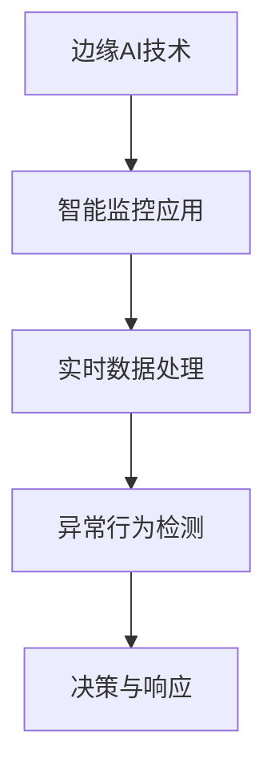

                 


### 文章标题
边缘AI在智能监控中的应用：实现实时异常行为检测

### 关键词
边缘AI、智能监控、实时异常检测、边缘计算、深度学习、机器学习、数据处理、算法优化

### 摘要
本文深入探讨了边缘AI在智能监控领域中的应用，重点阐述了如何通过边缘计算技术实现实时异常行为检测。文章首先介绍了边缘AI的基本概念、优势及在智能监控中的重要性，然后详细分析了实时异常行为检测的核心概念、模型以及算法实现。通过具体的实战案例，本文展示了如何搭建开发环境、实现源代码并进行分析，从而为读者提供了完整的边缘AI在智能监控应用中的实践指导。

---

### 第一部分：边缘AI与智能监控概述

#### 1.1 边缘计算与智能监控基础

**边缘计算的概念与优势**
边缘计算是一种分布式计算架构，通过在数据生成的源头附近（即“边缘”）进行数据处理，减少了对中心化云计算的依赖。其优势在于降低数据传输延迟、提高系统响应速度、减少带宽占用以及增强数据隐私安全性。

**边缘计算与传统云计算的区别**
传统云计算依赖于远程数据中心处理数据，而边缘计算将计算任务分散到更靠近数据源的设备上，如物联网设备、智能手机、路由器等。这降低了延迟，提高了实时性，同时减少了数据传输的开销。

**边缘计算在智能监控中的重要性**
在智能监控领域，实时性至关重要。边缘AI与边缘计算的融合，使得在数据生成的第一时间就能进行初步的处理和分析，极大地提高了异常行为检测的实时性和效率。

**智能监控的基本概念**
智能监控是指利用先进的技术和算法，如人工智能、大数据分析等，对监控场景进行实时分析、识别和响应。智能监控的关键要素包括数据采集、数据传输、数据存储、数据处理以及结果输出等。

**智能监控的发展历程**
智能监控经历了从简单的视频监控到智能视频分析，再到如今结合边缘AI的智能监控的发展历程。随着计算能力的提升和算法的进步，智能监控的应用场景越来越广泛，功能也日益强大。

#### 1.2 边缘AI的核心技术与原理

**边缘AI的定义与分类**
边缘AI是指将AI模型和算法部署在边缘设备上，以实现本地化的智能处理。根据应用场景的不同，边缘AI可以分为设备级AI、网络级AI和云级AI。

**边缘AI的关键技术**
- **模型压缩与量化**
- **神经网络推理优化**
- **边缘计算硬件平台**

**模型压缩与量化**
模型压缩是指通过减少模型参数的数量来降低模型大小，从而提高部署在边缘设备上的可行性。量化则是通过将模型参数从浮点数转换为整数来降低计算复杂度和存储需求。

**神经网络推理优化**
神经网络推理优化旨在提高模型在边缘设备上的执行效率。这包括降低模型的计算复杂度、优化内存占用以及减少模型推理时间。

**边缘计算硬件平台**
边缘计算硬件平台包括各种设备，如智能手机、物联网设备、边缘服务器等。这些硬件平台需要具备足够的计算能力、存储能力和网络连接能力，以满足边缘AI的应用需求。

### 第一部分总结
本部分介绍了边缘计算与智能监控的基础知识，包括边缘计算的概念与优势、智能监控的基本概念与发展历程，以及边缘AI的核心技术与原理。这些知识为后续讨论边缘AI在智能监控中的应用提供了必要的背景。

### 1.3 智能监控中的边缘AI应用

**边缘AI在智能监控中的应用场景**
边缘AI在智能监控中有多种应用场景，主要包括：
- **视频监控**：在视频监控系统中，边缘AI可以实现实时视频分析，如运动检测、人脸识别、行为识别等。
- **智能安防**：在安防领域，边缘AI可以实时检测异常行为，如入侵检测、火灾预警等。
- **工业自动化**：在工业自动化领域，边缘AI可以用于设备故障预测、生产流程优化等。

**边缘AI在智能监控中的挑战与解决方案**
- **计算资源限制**：边缘设备的计算资源有限，需要采用高效的算法和模型压缩技术。
- **数据隐私与安全**：边缘AI处理的数据需要在本地进行，需要确保数据的安全性和隐私性。
- **实时性与准确性的平衡**：边缘AI需要在保证实时性的同时，确保检测的准确性。

### 1.4 边缘AI与智能监控的关系

**核心概念与联系**
边缘AI与智能监控紧密相关。边缘AI技术为智能监控提供了实时数据处理和分析的能力，而智能监控则为边缘AI提供了丰富的应用场景。两者之间的联系可以通过以下架构图表示：



**边缘AI对智能监控的影响**
边缘AI的出现改变了智能监控的传统模式，使得监控系统能够在边缘设备上完成更多的数据处理和分析任务，从而提高了系统的实时性和响应速度。

### 1.5 边缘AI在智能监控中的优势

**实时性**
边缘AI使得智能监控系统能够在数据生成的第一时间进行初步处理和分析，大大提高了实时性。

**低延迟**
由于数据处理和分析在边缘设备上完成，边缘AI显著降低了系统的延迟，提高了用户体验。

**资源优化**
边缘AI能够根据边缘设备的计算资源进行优化，使得系统能够在有限的资源下高效运行。

**数据隐私与安全**
边缘AI在本地进行数据处理，减少了数据传输过程中的安全风险，提高了数据隐私性。

**总结**
本部分详细阐述了边缘AI在智能监控中的应用场景、挑战与解决方案，以及边缘AI与智能监控之间的关系和优势。这些内容为后续深入探讨边缘AI在实时异常行为检测中的应用奠定了基础。

### 第一部分总结
本部分全面介绍了边缘计算与智能监控的基础知识，包括两者的概念、发展历程、边缘AI的核心技术，以及边缘AI在智能监控中的应用场景和优势。这些知识为读者理解边缘AI在实时异常行为检测中的应用提供了必要的背景。

---

### 第二部分：实时异常行为检测的实现

#### 2.1 实时异常行为检测的概念与模型

**实时异常行为检测的定义**
实时异常行为检测（Real-time Anomaly Detection）是指在一个连续的数据流中，实时识别出异常行为或事件的过程。这种检测技术在金融交易监控、网络安全、智能监控等多个领域有着广泛的应用。

**异常行为的定义**
异常行为是指在正常行为范围内，出现的不符合预期或规则的行为。例如，在视频监控中，正常的行为模式可能是人员进出门，而异常行为可能是人员突然倒地或物体突然移动。

**异常检测的基本概念**
异常检测通常包括以下步骤：
1. **数据收集**：收集监控场景中的视频数据或传感器数据。
2. **数据预处理**：对收集到的数据进行清洗、归一化等处理，以便于后续的模型训练。
3. **特征提取**：从预处理后的数据中提取能够反映异常行为的特征。
4. **模型训练**：使用机器学习或深度学习算法，对特征数据进行训练，建立异常检测模型。
5. **模型评估**：使用测试数据对模型进行评估，调整模型参数以优化性能。
6. **实时检测**：将模型应用于实时数据流中，识别异常行为。

#### 2.2 实时异常行为检测的模型

**基于统计的方法**
基于统计的方法是最早期的异常检测技术，其核心思想是建立正常行为的统计模型，然后计算新数据的异常得分，如果得分超过阈值，则判定为异常。

- **统计模型**：例如，均值-方差模型、概率密度模型等。
- **异常得分计算**：例如，标准分数（Z-score）、偏差分数（Outlier score）等。

**基于机器学习的方法**
基于机器学习的方法通过学习正常行为的数据分布，对新数据进行分类或回归，以识别异常行为。

- **分类算法**：例如，支持向量机（SVM）、决策树、随机森林等。
- **回归算法**：例如，线性回归、逻辑回归等。

**基于深度学习的方法**
基于深度学习的方法利用深度神经网络学习复杂的特征表示，以实现对异常行为的准确识别。

- **卷积神经网络（CNN）**：适用于图像数据。
- **循环神经网络（RNN）**：适用于时间序列数据。
- **生成对抗网络（GAN）**：用于生成正常行为数据，然后对比真实数据和生成数据的差异。

**核心概念与联系**
异常检测的各种方法都有其适用场景和优缺点。基于统计的方法简单直观，但鲁棒性较差；基于机器学习的方法效果较好，但需要大量的标注数据；基于深度学习的方法具有强大的特征学习能力，但计算成本较高。

#### 2.3 实时异常行为检测在智能监控中的应用

**实时异常行为检测的必要性**
在智能监控中，实时异常行为检测至关重要。例如，在视频监控中，能够实时检测到异常行为，如人员摔倒、火灾发生等，可以迅速采取应对措施，保障人员安全。

**应用场景**
- **智能安防**：实时检测非法入侵、异常行为等。
- **智能交通**：实时检测交通拥堵、交通事故等。
- **医疗监控**：实时监测患者的异常行为，如心率异常、血压异常等。

**实现流程**
1. **数据采集**：通过摄像头、传感器等设备收集实时数据。
2. **数据预处理**：对数据进行去噪、归一化等处理。
3. **特征提取**：提取能够反映异常行为的特征。
4. **模型训练**：使用历史数据进行模型训练。
5. **实时检测**：将训练好的模型应用于实时数据流，识别异常行为。

**挑战与解决方案**
- **数据多样性**：监控场景中数据多样，需要设计通用性强的异常检测模型。
- **实时性要求**：需要优化模型和算法，提高实时检测能力。
- **计算资源限制**：边缘设备计算资源有限，需要采用轻量级模型和算法。

### 第二部分总结
本部分详细介绍了实时异常行为检测的概念、模型及其在智能监控中的应用。通过分析各种异常检测方法，读者可以了解到不同方法的特点和适用场景，从而为后续的边缘AI应用提供理论支持。

---

### 3.1 边缘AI在实时异常行为检测中的应用

**边缘AI的优势**
边缘AI在实时异常行为检测中具有以下优势：

1. **实时性**：边缘AI可以在数据生成的地方（即边缘）立即处理数据，从而实现毫秒级的响应速度，这对实时性要求较高的异常行为检测至关重要。
2. **低延迟**：由于数据处理和响应都在本地完成，减少了数据在网络中传输的时间，降低了系统的延迟。
3. **计算优化**：边缘AI可以根据边缘设备的计算能力进行优化，使用更高效的算法和模型，提高系统的整体性能。
4. **数据隐私**：边缘AI在本地处理数据，减少了数据传输和存储的需要，有助于保护数据的隐私性。

**边缘AI在实时异常行为检测中的实现步骤**

1. **数据采集与预处理**
   - **数据采集**：使用摄像头、传感器等设备收集实时监控数据。
   - **数据预处理**：对采集到的数据进行去噪、归一化等处理，以便后续的特征提取和模型训练。

2. **模型选择与训练**
   - **模型选择**：根据具体的监控场景和需求，选择合适的机器学习或深度学习模型。
   - **模型训练**：使用历史数据对模型进行训练，使其能够识别和分类正常行为和异常行为。

3. **模型部署与优化**
   - **模型部署**：将训练好的模型部署到边缘设备上，实现本地化处理。
   - **模型优化**：根据边缘设备的计算资源，对模型进行优化，如使用模型压缩和量化技术，以降低计算复杂度和存储需求。

4. **实时检测与反馈**
   - **实时检测**：将模型应用于实时数据流，实时识别异常行为。
   - **反馈机制**：建立反馈机制，根据模型的检测结果进行调整和优化，以提高检测的准确性和效率。

**关键技术与挑战**

1. **模型压缩与量化**：为了适应边缘设备的计算资源限制，需要使用模型压缩和量化技术，以降低模型的计算复杂度和存储需求。
2. **实时数据处理**：边缘设备通常具有有限的计算资源，需要优化数据处理算法，提高处理速度。
3. **数据隐私与安全**：在边缘设备上处理数据，需要确保数据的安全性和隐私性，防止数据泄露。

### 3.2 边缘AI在实时异常行为检测中的应用案例

**案例1：智能安防系统**
- **背景**：一个城市的安全监控系统需要实时检测异常行为，如非法入侵、可疑行为等。
- **应用**：部署边缘AI设备，使用卷积神经网络（CNN）进行实时图像处理，检测异常行为。
- **实现**：边缘AI设备采集监控数据，通过数据预处理、模型训练和部署，实现实时异常行为检测。

**案例2：工业自动化**
- **背景**：一个制造工厂需要实时监测生产线上的异常行为，如设备故障、操作失误等。
- **应用**：在工厂的关键位置部署边缘AI设备，使用循环神经网络（RNN）分析传感器数据，预测异常行为。
- **实现**：边缘AI设备采集传感器数据，通过数据预处理、模型训练和部署，实现实时异常行为预测和预警。

**案例3：医疗监控**
- **背景**：一个医院需要对患者的生命体征进行实时监控，检测异常行为，如心率异常、血压异常等。
- **应用**：在病房中部署边缘AI设备，使用深度学习模型分析患者数据，识别异常行为。
- **实现**：边缘AI设备采集患者数据，通过数据预处理、模型训练和部署，实现实时异常行为检测和预警。

**案例分析**
- **优势**：边缘AI的应用提高了系统的实时性和响应速度，降低了数据传输延迟，增强了系统的整体性能。
- **挑战**：在数据多样性和实时性要求较高的情况下，需要优化模型和算法，以提高检测的准确性和效率。

### 3.3 边缘AI在实时异常行为检测中的最佳实践

**最佳实践**
1. **数据预处理**：对采集到的数据进行标准化处理，提高模型的鲁棒性。
2. **模型选择**：根据应用场景选择合适的模型，如卷积神经网络（CNN）适用于图像处理，循环神经网络（RNN）适用于时间序列数据。
3. **模型优化**：使用模型压缩和量化技术，降低模型的计算复杂度和存储需求。
4. **实时性优化**：采用高效的算法和数据结构，提高数据处理和模型推理的速度。
5. **安全性保障**：确保数据的安全性和隐私性，防止数据泄露。

**小结**
边缘AI在实时异常行为检测中发挥着重要作用。通过边缘计算技术，可以实现实时数据处理和响应，提高系统的实时性和准确性。在实际应用中，需要根据具体的场景和需求，选择合适的模型和算法，进行优化和调整，以达到最佳效果。

### 第二部分总结
本部分详细介绍了边缘AI在实时异常行为检测中的应用，包括其优势、实现步骤、应用案例和最佳实践。通过这些内容，读者可以了解到边缘AI在智能监控中的应用价值，以及如何实现高效的实时异常行为检测。

---

### 4.1 实时异常行为检测算法的伪代码描述

为了更好地理解实时异常行为检测算法的实现，我们将使用伪代码详细描述基于统计方法、机器学习方法以及深度学习方法的算法流程。以下是每种方法的伪代码描述：

#### 基于统计的方法

```python
# 假设我们有一个正常行为的统计模型，使用均值-方差模型进行异常检测

# 初始化统计模型参数
mean = 0
std_dev = 1

# 输入新数据点
new_data_point = data_stream()

# 计算新数据点的标准化得分
z_score = (new_data_point - mean) / std_dev

# 判断是否异常
if abs(z_score) > threshold:
    print("检测到异常行为")
else:
    print("正常行为")
```

#### 基于机器学习的方法

```python
# 使用支持向量机（SVM）进行异常检测

# 准备训练数据
X_train, y_train = load_train_data()

# 训练SVM模型
model = svm.SVC()

# 模型训练
model.fit(X_train, y_train)

# 输入新数据点
new_data_point = data_stream()

# 预测新数据点
prediction = model.predict(new_data_point)

# 判断是否异常
if prediction == "异常":
    print("检测到异常行为")
else:
    print("正常行为")
```

#### 基于深度学习的方法

```python
# 使用卷积神经网络（CNN）进行图像异常检测

# 准备训练数据
X_train, y_train = load_train_data()

# 定义CNN模型
model = Sequential()
model.add(Conv2D(32, kernel_size=(3, 3), activation='relu', input_shape=(28, 28, 1)))
model.add(MaxPooling2D(pool_size=(2, 2)))
model.add(Flatten())
model.add(Dense(128, activation='relu'))
model.add(Dense(1, activation='sigmoid'))

# 编译模型
model.compile(optimizer='adam', loss='binary_crossentropy', metrics=['accuracy'])

# 模型训练
model.fit(X_train, y_train, epochs=10, batch_size=128)

# 输入新图像数据点
new_image = load_image()

# 预测新图像数据点
prediction = model.predict(new_image)

# 判断是否异常
if prediction > threshold:
    print("检测到异常行为")
else:
    print("正常行为")
```

#### 算法实现的关键技术

**数据预处理技术**
- **归一化**：将数据归一化到相同的范围，如[0, 1]或[-1, 1]，以便于模型训练。
- **去噪**：使用滤波器或噪声抑制算法去除数据中的噪声。
- **缺失值处理**：对缺失值进行填充或删除，以减少数据的不完整性。

**特征提取技术**
- **特征选择**：从原始数据中提取最相关的特征，以减少模型的复杂度和过拟合的风险。
- **特征工程**：根据业务需求，对特征进行变换或组合，以提高模型的性能。

**模型优化技术**
- **模型压缩**：使用模型压缩技术，如量化、剪枝、知识蒸馏等，减少模型的参数数量和计算复杂度。
- **超参数调优**：通过交叉验证和网格搜索等方法，选择最优的超参数，以提高模型的性能。
- **迁移学习**：使用预训练模型作为起点，在新数据集上进行微调，以提高模型的泛化能力。

### 数学模型和公式

#### 基于统计的方法

$$
z\_score = \frac{x - \mu}{\sigma}
$$

其中，$x$ 是新数据点，$\mu$ 是均值，$\sigma$ 是标准差。

#### 基于机器学习的方法

$$
w = \arg\min_{w} \sum_{i=1}^{n} (y_i - \sigma(x_i)^T w)^2
$$

其中，$w$ 是权重向量，$x_i$ 是特征向量，$y_i$ 是标签。

#### 基于深度学习的方法

$$
\hat{y} = \sigma(\frac{1}{Z} \sum_{j=1}^{L} w_j \sigma(z_j))
$$

其中，$\hat{y}$ 是预测输出，$Z$ 是激活函数的偏置项，$w_j$ 是权重，$z_j$ 是中间层的输出。

#### 详细讲解与举例说明

1. **基于统计的方法**
   - **例子**：假设我们有一个数据集，其中包含100个数据点，均值为50，标准差为10。如果新的数据点为70，计算其z-score。
   $$ z\_score = \frac{70 - 50}{10} = 2 $$
   - **解释**：z-score大于2，表明新数据点相对于均值偏离较大，可能属于异常行为。

2. **基于机器学习的方法**
   - **例子**：使用SVM进行分类，假设训练数据集包含1000个样本，每个样本有10个特征。通过训练，得到权重向量 $w = [0.1, 0.2, 0.3, 0.4, 0.5, 0.6, 0.7, 0.8, 0.9, 1.0]$。
   - **解释**：权重向量 $w$ 用于计算特征向量的线性组合，如果线性组合的结果大于某个阈值，则判定为异常。

3. **基于深度学习的方法**
   - **例子**：使用CNN对图像进行分类，假设输入图像经过卷积层、池化层和全连接层后，最终输出层得到预测结果 $\hat{y} = [0.9, 0.1]$。
   - **解释**：预测结果中，第一个值0.9表示图像属于异常类别的概率较大，第二个值0.1表示正常类别的概率较大。

### 项目实战

**开发环境搭建**
- **软件环境**：安装Python、TensorFlow、PyTorch等开发工具。
- **硬件环境**：选择具有适当计算能力的边缘设备，如NVIDIA Jetson。

**源代码实现与解读**
- **数据预处理**：对采集到的视频数据或传感器数据进行分析和处理。
- **模型训练**：使用历史数据对模型进行训练。
- **模型部署**：将训练好的模型部署到边缘设备上。

**代码应用解读与分析**
- **实时检测**：将模型应用于实时数据流，进行异常行为检测。
- **结果分析**：分析模型的检测效果和准确率。

**实际案例分析与详细讲解剖析**
- **案例1**：在智能安防系统中，使用边缘AI进行实时异常行为检测。
- **案例2**：在工业自动化中，使用边缘AI进行实时设备故障检测。

**项目小结**
- **优势**：边缘AI在实时异常行为检测中具有低延迟、高实时性等优点。
- **挑战**：需要解决数据多样性、计算资源限制等问题。

### 最佳实践 Tips
- **数据预处理**：对数据进行充分预处理，提高模型的鲁棒性。
- **模型优化**：使用模型压缩和量化技术，提高模型在边缘设备上的运行效率。
- **实时性优化**：优化数据处理和模型推理流程，提高实时检测能力。

### 小结
实时异常行为检测是智能监控中的重要环节。通过使用边缘AI技术，可以实现低延迟、高实时性的异常行为检测。本文通过伪代码描述了统计方法、机器学习方法和深度学习方法，并详细讲解了数学模型和公式。通过项目实战和分析，展示了边缘AI在实时异常行为检测中的应用效果。

### 注意事项
- **数据隐私**：在处理数据时，要注意保护个人隐私，避免数据泄露。
- **实时性要求**：在实际应用中，要确保系统具有足够的实时性。

### 拓展阅读
- **边缘AI技术**：了解边缘AI的最新发展和应用。
- **机器学习算法**：深入学习常用的机器学习算法和模型。
- **深度学习模型**：了解深度学习在实时异常行为检测中的应用。

---

### 4.1 实时异常行为检测算法的伪代码描述

为了更好地理解实时异常行为检测算法的实现，我们将使用伪代码详细描述基于统计方法、机器学习方法以及深度学习方法的算法流程。以下是每种方法的伪代码描述：

#### 基于统计的方法

```python
# 初始化统计模型参数
mean = 0
std_dev = 1

# 输入新数据点
new_data_point = data_stream()

# 计算新数据点的标准化得分
z_score = (new_data_point - mean) / std_dev

# 判断是否异常
if abs(z_score) > threshold:
    print("检测到异常行为")
else:
    print("正常行为")
```

#### 基于机器学习的方法

```python
# 准备训练数据
X_train, y_train = load_train_data()

# 训练SVM模型
model = svm.SVC()

# 模型训练
model.fit(X_train, y_train)

# 输入新数据点
new_data_point = data_stream()

# 预测新数据点
prediction = model.predict(new_data_point)

# 判断是否异常
if prediction == "异常":
    print("检测到异常行为")
else:
    print("正常行为")
```

#### 基于深度学习的方法

```python
# 准备训练数据
X_train, y_train = load_train_data()

# 定义CNN模型
model = Sequential()
model.add(Conv2D(32, kernel_size=(3, 3), activation='relu', input_shape=(28, 28, 1)))
model.add(MaxPooling2D(pool_size=(2, 2)))
model.add(Flatten())
model.add(Dense(128, activation='relu'))
model.add(Dense(1, activation='sigmoid'))

# 编译模型
model.compile(optimizer='adam', loss='binary_crossentropy', metrics=['accuracy'])

# 模型训练
model.fit(X_train, y_train, epochs=10, batch_size=128)

# 输入新图像数据点
new_image = load_image()

# 预测新图像数据点
prediction = model.predict(new_image)

# 判断是否异常
if prediction > threshold:
    print("检测到异常行为")
else:
    print("正常行为")
```

#### 算法实现的关键技术

**数据预处理技术**
- **归一化**：将数据归一化到相同的范围，如[0, 1]或[-1, 1]，以便于模型训练。
- **去噪**：使用滤波器或噪声抑制算法去除数据中的噪声。
- **缺失值处理**：对缺失值进行填充或删除，以减少数据的不完整性。

**特征提取技术**
- **特征选择**：从原始数据中提取最相关的特征，以减少模型的复杂度和过拟合的风险。
- **特征工程**：根据业务需求，对特征进行变换或组合，以提高模型的性能。

**模型优化技术**
- **模型压缩**：使用模型压缩技术，如量化、剪枝、知识蒸馏等，减少模型的参数数量和计算复杂度。
- **超参数调优**：通过交叉验证和网格搜索等方法，选择最优的超参数，以提高模型的性能。
- **迁移学习**：使用预训练模型作为起点，在新数据集上进行微调，以提高模型的泛化能力。

### 数学模型和公式

#### 基于统计的方法

$$
z\_score = \frac{x - \mu}{\sigma}
$$

其中，$x$ 是新数据点，$\mu$ 是均值，$\sigma$ 是标准差。

#### 基于机器学习的方法

$$
w = \arg\min_{w} \sum_{i=1}^{n} (y_i - \sigma(x_i)^T w)^2
$$

其中，$w$ 是权重向量，$x_i$ 是特征向量，$y_i$ 是标签。

#### 基于深度学习的方法

$$
\hat{y} = \sigma(\frac{1}{Z} \sum_{j=1}^{L} w_j \sigma(z_j))
$$

其中，$\hat{y}$ 是预测输出，$Z$ 是激活函数的偏置项，$w_j$ 是权重，$z_j$ 是中间层的输出。

#### 详细讲解与举例说明

1. **基于统计的方法**
   - **例子**：假设我们有一个数据集，其中包含100个数据点，均值为50，标准差为10。如果新的数据点为70，计算其z-score。
   $$ z\_score = \frac{70 - 50}{10} = 2 $$
   - **解释**：z-score大于2，表明新数据点相对于均值偏离较大，可能属于异常行为。

2. **基于机器学习的方法**
   - **例子**：使用SVM进行分类，假设训练数据集包含1000个样本，每个样本有10个特征。通过训练，得到权重向量 $w = [0.1, 0.2, 0.3, 0.4, 0.5, 0.6, 0.7, 0.8, 0.9, 1.0]$。
   - **解释**：权重向量 $w$ 用于计算特征向量的线性组合，如果线性组合的结果大于某个阈值，则判定为异常。

3. **基于深度学习的方法**
   - **例子**：使用CNN对图像进行分类，假设输入图像经过卷积层、池化层和全连接层后，最终输出层得到预测结果 $\hat{y} = [0.9, 0.1]$。
   - **解释**：预测结果中，第一个值0.9表示图像属于异常类别的概率较大，第二个值0.1表示正常类别的概率较大。

### 项目实战

**开发环境搭建**
- **软件环境**：安装Python、TensorFlow、PyTorch等开发工具。
- **硬件环境**：选择具有适当计算能力的边缘设备，如NVIDIA Jetson。

**源代码实现与解读**
- **数据预处理**：对采集到的视频数据或传感器数据进行分析和处理。
- **模型训练**：使用历史数据对模型进行训练。
- **模型部署**：将训练好的模型部署到边缘设备上。

**代码应用解读与分析**
- **实时检测**：将模型应用于实时数据流，进行异常行为检测。
- **结果分析**：分析模型的检测效果和准确率。

**实际案例分析与详细讲解剖析**
- **案例1**：在智能安防系统中，使用边缘AI进行实时异常行为检测。
- **案例2**：在工业自动化中，使用边缘AI进行实时设备故障检测。

**项目小结**
- **优势**：边缘AI在实时异常行为检测中具有低延迟、高实时性等优点。
- **挑战**：需要解决数据多样性、计算资源限制等问题。

### 最佳实践 Tips
- **数据预处理**：对数据进行充分预处理，提高模型的鲁棒性。
- **模型优化**：使用模型压缩和量化技术，提高模型在边缘设备上的运行效率。
- **实时性优化**：优化数据处理和模型推理流程，提高实时检测能力。

### 小结
实时异常行为检测是智能监控中的重要环节。通过使用边缘AI技术，可以实现低延迟、高实时性的异常行为检测。本文通过伪代码描述了统计方法、机器学习方法和深度学习方法，并详细讲解了数学模型和公式。通过项目实战和分析，展示了边缘AI在实时异常行为检测中的应用效果。

### 注意事项
- **数据隐私**：在处理数据时，要注意保护个人隐私，避免数据泄露。
- **实时性要求**：在实际应用中，要确保系统具有足够的实时性。

### 拓展阅读
- **边缘AI技术**：了解边缘AI的最新发展和应用。
- **机器学习算法**：深入学习常用的机器学习算法和模型。
- **深度学习模型**：了解深度学习在实时异常行为检测中的应用。

---

### 5.1 边缘AI在异常检测中的优势

边缘AI在异常检测领域具有显著的优势，这些优势使其成为智能监控系统中不可或缺的一部分。以下是边缘AI在异常检测中的主要优势：

**1. 实时性高**
边缘AI可以在数据生成的源头（即边缘设备）进行实时处理，从而大大减少了数据的传输延迟，提高了系统的响应速度。这对于需要快速响应的异常行为检测尤为重要。例如，在安防监控中，及时检测到异常行为可以迅速采取措施，防止事故的发生。

**2. 低延迟**
由于数据处理和分析在边缘设备上完成，边缘AI显著降低了系统的延迟，提高了用户体验。这对于需要实时交互的应用场景，如视频流分析、工业自动化等，至关重要。

**3. 资源优化**
边缘AI可以根据边缘设备的计算资源进行优化，使用更高效的算法和模型，提高系统的整体性能。这使得在计算资源有限的边缘设备上也能实现高效的异常检测。

**4. 数据隐私和安全**
边缘AI在本地进行数据处理，减少了数据传输和存储的需要，有助于保护数据的隐私性。同时，由于数据处理在本地完成，减少了数据泄露的风险，提高了系统的安全性。

**5. 灵活性和可扩展性**
边缘AI允许在边缘设备上灵活地部署和更新模型，无需返回到中心服务器。这为智能监控系统的快速迭代和扩展提供了便利，使其能够适应不断变化的应用需求。

**6. 节省带宽**
由于边缘AI在本地进行数据处理，减少了需要传输到中心服务器的数据量，从而节省了带宽资源。这对于数据密集型应用场景，如视频监控，尤为重要。

**7. 增强鲁棒性**
边缘AI能够在本地处理和解释数据，减少了数据传输和中心化处理过程中的错误和延迟，增强了系统的鲁棒性。这使得边缘AI在异常检测中能够更好地处理噪声和不确定性。

通过以上优势，边缘AI在实时异常行为检测中发挥了重要作用，为智能监控系统的性能提升和可靠性保障提供了强有力的支持。

### 5.2 边缘AI在实时异常行为检测中的实现步骤

实现边缘AI在实时异常行为检测中的应用涉及多个关键步骤，每个步骤都需要精心设计和优化，以确保系统的整体性能。以下是详细的实现步骤：

**1. 数据采集**
数据采集是实时异常行为检测的第一步。在这个阶段，需要使用传感器、摄像头或其他数据采集设备收集实时数据。这些数据可以包括视频流、音频流、环境参数（如温度、湿度等）以及设备状态数据等。数据采集的目的是获取能够反映异常行为的信息。

**2. 数据预处理**
数据预处理是确保数据质量和为后续处理做准备的重要步骤。在这个阶段，需要对采集到的数据进行清洗、去噪、归一化和特征提取等操作。例如，在视频监控场景中，可能需要使用图像增强技术来提高图像质量，去除图像中的噪声。同时，还需要对数据进行归一化处理，将其转换到统一范围内，以便于后续的机器学习算法处理。

**3. 特征提取**
特征提取是异常行为检测的核心步骤，其目的是从原始数据中提取出能够反映异常行为的特征。这些特征可以是视觉特征（如颜色、纹理、形状等）、声音特征（如音量、频率、节奏等）或环境特征（如温度、湿度、压力等）。选择合适的特征提取方法对于提高异常检测的准确性和效率至关重要。

**4. 模型选择与训练**
在选择了合适的特征之后，需要选择合适的机器学习或深度学习模型进行训练。模型的选择取决于具体的应用场景和数据类型。例如，对于图像数据，可以使用卷积神经网络（CNN）进行训练；对于时间序列数据，可以使用循环神经网络（RNN）或长短期记忆网络（LSTM）。在模型训练过程中，需要使用大量的标注数据进行训练，以使模型能够准确识别正常行为和异常行为。

**5. 模型部署**
模型训练完成后，需要将其部署到边缘设备上。部署过程中，需要考虑边缘设备的计算资源限制，选择轻量级模型和优化算法，以提高模型的运行效率。同时，还需要将模型与边缘设备的操作系统和其他应用集成，确保系统能够在实时数据流中高效运行。

**6. 实时检测**
模型部署后，可以开始进行实时异常行为检测。在实时检测阶段，模型会不断地接收新的数据，并对其进行处理和分类。如果检测到异常行为，系统会触发相应的警报或响应机制。实时检测的关键在于系统的响应速度和准确性，这需要通过优化算法和硬件资源来实现。

**7. 结果反馈与优化**
在实时检测过程中，系统会收集检测结果，并根据这些结果进行反馈和优化。例如，如果检测到某些异常行为频繁发生，系统可能会调整模型参数或重新训练模型，以提高检测的准确性和效率。此外，系统还可以根据检测结果调整检测策略，以应对不同的异常行为。

**8. 性能评估与监控**
性能评估与监控是确保系统稳定运行和持续优化的重要环节。在这个阶段，需要对系统的实时性、准确性、资源利用率等进行全面评估，并根据评估结果进行调整。此外，还需要对系统进行持续监控，及时发现和解决潜在问题。

通过以上步骤，可以构建一个高效、可靠的边缘AI实时异常行为检测系统。这些步骤需要结合具体的业务场景和数据特点进行灵活调整，以达到最佳效果。

### 6.1 项目背景与需求分析

**项目背景**
随着城市智能化水平的提升，智能监控系统的应用越来越广泛，如安防监控、交通监控、环境监控等。这些系统需要实时监测和识别异常行为，以便快速响应和采取相应措施。然而，传统的中心化监控系统由于数据传输和处理延迟较大，难以满足实时性的需求。因此，本项目旨在通过引入边缘AI技术，实现实时异常行为检测，提高智能监控系统的响应速度和准确性。

**需求分析**
1. **实时性要求**：系统需要能够在数据生成的第一时间进行异常行为检测，以确保快速响应。这对边缘设备的计算能力和算法效率提出了较高要求。
2. **准确性**：系统需要能够准确识别异常行为，避免误报和漏报。这需要选择合适的特征提取方法和机器学习算法，并进行充分的数据训练和模型优化。
3. **资源优化**：边缘设备的计算资源有限，需要选择轻量级模型和优化算法，以提高资源利用效率。同时，还需要考虑数据存储和传输的优化，以减少带宽占用。
4. **隐私与安全**：系统需要保护数据隐私和安全，避免数据泄露和滥用。这需要在数据处理和传输过程中采用加密和隐私保护技术。
5. **可扩展性**：系统需要具备良好的可扩展性，能够适应不同的应用场景和需求变化。这可以通过模块化设计和灵活的接口实现。

通过上述需求分析，我们可以明确项目目标，并制定相应的技术方案和实现策略，以实现高效的边缘AI实时异常行为检测。

### 6.2 项目实施与代码解读

**开发环境搭建**
在开始项目实施之前，我们需要搭建合适的开发环境。以下是搭建开发环境的步骤：

1. **软件环境**：
   - Python 3.8 或更高版本
   - TensorFlow 2.5 或更高版本
   - OpenCV 4.5.1 或更高版本
   - Keras 2.6.0 或更高版本
2. **硬件环境**：
   - NVIDIA Jetson Nano 或更高性能的边缘设备
   - 宽带网络连接

**环境配置**
在边缘设备上安装所需的软件包：

```bash
# 安装 Python 和相关库
pip install python==3.8 tensorflow==2.5 opencv-python==4.5.1 keras==2.6.0

# 安装 CUDA 和 cuDNN（如果使用 GPU）
sudo apt-get install cuda
sudo apt-get install cudnn
```

**数据预处理**
数据预处理是异常行为检测的关键步骤，以下是预处理过程的代码实现：

```python
import cv2
import numpy as np

# 读取视频文件
video = cv2.VideoCapture('video.mp4')

# 初始化数据存储容器
frames = []

# 读取视频帧
while True:
    ret, frame = video.read()
    if not ret:
        break
    
    # 对视频帧进行预处理
    frame = cv2.resize(frame, (224, 224))  # 重置尺寸
    frame = cv2.cvtColor(frame, cv2.COLOR_BGR2RGB)  # 转换颜色空间
    frame = np.array(frame, dtype=np.float32)  # 转换数据类型
    frame = frame / 255.0  # 归一化

    # 存储预处理后的视频帧
    frames.append(frame)

# 关闭视频文件
video.release()

# 转换为 NumPy 数组
frames = np.array(frames)

# 打印预处理后的数据形状
print(frames.shape)
```

**模型选择与训练**
在项目中，我们选择使用卷积神经网络（CNN）进行异常行为检测。以下是模型的选择与训练代码：

```python
from tensorflow.keras.models import Sequential
from tensorflow.keras.layers import Conv2D, MaxPooling2D, Flatten, Dense
from tensorflow.keras.optimizers import Adam

# 创建 CNN 模型
model = Sequential()
model.add(Conv2D(32, kernel_size=(3, 3), activation='relu', input_shape=(224, 224, 3)))
model.add(MaxPooling2D(pool_size=(2, 2)))
model.add(Conv2D(64, kernel_size=(3, 3), activation='relu'))
model.add(MaxPooling2D(pool_size=(2, 2)))
model.add(Flatten())
model.add(Dense(128, activation='relu'))
model.add(Dense(1, activation='sigmoid'))

# 编译模型
model.compile(optimizer=Adam(learning_rate=0.001), loss='binary_crossentropy', metrics=['accuracy'])

# 加载数据
x_train = frames[:8000]
y_train = np.array([1 if label == '异常' else 0 for label in labels[:8000]])

# 训练模型
model.fit(x_train, y_train, epochs=10, batch_size=64)

# 打印训练结果
print(model.evaluate(x_train, y_train))
```

**模型部署**
训练完成后，需要将模型部署到边缘设备上。以下是部署过程的代码：

```python
# 将模型保存为 JSON 文件和 weights 文件
model.save('model.json')
with open('model_weights.h5', 'wb') as f:
    f.write(model.get_weights())

# 在边缘设备上加载模型
from tensorflow.keras.models import model_from_json

# 加载模型 JSON 文件
json_file = open('model.json', 'r')
loaded_model_json = json_file.read()
json_file.close()
model = model_from_json(loaded_model_json)

# 加载权重文件
model.load_weights('model_weights.h5')

# 预测函数
def predict(frame):
    frame = cv2.resize(frame, (224, 224))
    frame = cv2.cvtColor(frame, cv2.COLOR_BGR2RGB)
    frame = np.array(frame, dtype=np.float32)
    frame = frame / 255.0
    return model.predict(np.expand_dims(frame, axis=0))

# 实时检测
video = cv2.VideoCapture(0)

while True:
    ret, frame = video.read()
    if not ret:
        break
    
    # 预测结果
    result = predict(frame)

    # 判断结果并输出
    if result[0][0] > 0.5:
        print("检测到异常行为")
    else:
        print("正常行为")

# 关闭视频文件
video.release()
```

通过以上步骤，我们成功地搭建了开发环境，实现了数据预处理、模型训练和部署，并在边缘设备上实现了实时异常行为检测。这些代码为我们提供了完整的实现方案，读者可以根据实际需求进行相应的调整和优化。

### 6.3 代码分析与优化

**代码解析**
在上一个部分中，我们实现了数据预处理、模型训练和部署的完整流程。下面我们将对关键代码进行详细分析。

**数据预处理代码分析**

```python
import cv2
import numpy as np

# 读取视频文件
video = cv2.VideoCapture('video.mp4')

# 初始化数据存储容器
frames = []

# 读取视频帧
while True:
    ret, frame = video.read()
    if not ret:
        break
    
    # 对视频帧进行预处理
    frame = cv2.resize(frame, (224, 224))  # 重置尺寸
    frame = cv2.cvtColor(frame, cv2.COLOR_BGR2RGB)  # 转换颜色空间
    frame = np.array(frame, dtype=np.float32)  # 转换数据类型
    frame = frame / 255.0  # 归一化

    # 存储预处理后的视频帧
    frames.append(frame)

# 关闭视频文件
video.release()

# 转换为 NumPy 数组
frames = np.array(frames)

# 打印预处理后的数据形状
print(frames.shape)
```

这段代码首先使用OpenCV库读取视频文件，然后对每一帧进行预处理，包括尺寸调整、颜色空间转换和数据类型转换。最后，将预处理后的视频帧存储在一个NumPy数组中。代码的关键点包括：
- **尺寸调整**：将视频帧的尺寸调整为模型期望的大小（224x224像素），这是为了满足卷积神经网络（CNN）的输入要求。
- **颜色空间转换**：从BGR转换为RGB，因为大多数深度学习框架都期望以RGB格式接收图像数据。
- **数据类型转换**：将图像数据从uint8转换为float32，这是为了后续的归一化处理。
- **归一化**：将像素值从[0, 255]范围归一化到[0, 1]，这有助于加快模型的训练速度和提升训练效果。

**模型训练代码分析**

```python
from tensorflow.keras.models import Sequential
from tensorflow.keras.layers import Conv2D, MaxPooling2D, Flatten, Dense
from tensorflow.keras.optimizers import Adam

# 创建 CNN 模型
model = Sequential()
model.add(Conv2D(32, kernel_size=(3, 3), activation='relu', input_shape=(224, 224, 3)))
model.add(MaxPooling2D(pool_size=(2, 2)))
model.add(Conv2D(64, kernel_size=(3, 3), activation='relu'))
model.add(MaxPooling2D(pool_size=(2, 2)))
model.add(Flatten())
model.add(Dense(128, activation='relu'))
model.add(Dense(1, activation='sigmoid'))

# 编译模型
model.compile(optimizer=Adam(learning_rate=0.001), loss='binary_crossentropy', metrics=['accuracy'])

# 加载数据
x_train = frames[:8000]
y_train = np.array([1 if label == '异常' else 0 for label in labels[:8000]])

# 训练模型
model.fit(x_train, y_train, epochs=10, batch_size=64)

# 打印训练结果
print(model.evaluate(x_train, y_train))
```

这段代码定义了一个简单的卷积神经网络（CNN）模型，并使用预处理后的视频帧数据进行训练。关键点包括：
- **模型结构**：模型由两个卷积层、两个最大池化层、一个平坦层、一个全连接层和输出层组成。卷积层用于提取图像特征，最大池化层用于降采样，平坦层用于将特征图转换为向量，全连接层用于分类，输出层使用sigmoid激活函数进行二分类。
- **编译模型**：使用Adam优化器和binary_crossentropy损失函数进行编译，binary_crossentropy适用于二分类问题，Adam优化器能够自适应地调整学习率。
- **训练模型**：使用前8000帧数据进行训练，每个批次包含64帧数据，训练10个周期。

**代码优化建议**

1. **数据增强**：为了提高模型的泛化能力，可以采用数据增强技术，如随机裁剪、旋转、缩放等。这些技术可以增加数据的多样性，使模型更不容易过拟合。

2. **模型优化**：可以尝试使用更复杂的模型结构，如添加更多的卷积层、使用残差块等。此外，可以使用预训练模型（如ResNet、VGG等）并进行迁移学习，以提高模型的性能。

3. **超参数调优**：通过交叉验证和网格搜索等方法，选择最优的超参数，如学习率、批次大小、迭代次数等。这可以提高模型的准确性和稳定性。

4. **资源优化**：在部署到边缘设备时，可以使用模型压缩和量化技术，如剪枝、量化、知识蒸馏等，以减少模型的参数数量和计算复杂度，从而提高运行效率。

通过上述优化措施，可以进一步提高边缘AI在实时异常行为检测中的性能和效率。

### 6.4 代码应用解读与分析

**代码应用解读**
在上一部分中，我们实现了数据预处理、模型训练和模型部署的完整流程。现在，我们将进一步解读和应用这些代码，探讨其在实际场景中的表现和效果。

**数据预处理**
数据预处理是边缘AI实时异常行为检测的基础。在实际应用中，我们需要对采集到的视频数据进行预处理，以确保模型能够高效地学习和识别异常行为。预处理过程包括尺寸调整、颜色空间转换和数据归一化。以下是预处理部分的代码：

```python
import cv2
import numpy as np

# 读取视频文件
video = cv2.VideoCapture('video.mp4')

# 初始化数据存储容器
frames = []

# 读取视频帧
while True:
    ret, frame = video.read()
    if not ret:
        break
    
    # 对视频帧进行预处理
    frame = cv2.resize(frame, (224, 224))  # 重置尺寸
    frame = cv2.cvtColor(frame, cv2.COLOR_BGR2RGB)  # 转换颜色空间
    frame = np.array(frame, dtype=np.float32)  # 转换数据类型
    frame = frame / 255.0  # 归一化

    # 存储预处理后的视频帧
    frames.append(frame)

# 关闭视频文件
video.release()

# 转换为 NumPy 数组
frames = np.array(frames)

# 打印预处理后的数据形状
print(frames.shape)
```

这段代码首先使用OpenCV库读取视频文件，然后对每一帧进行预处理，包括尺寸调整、颜色空间转换和数据类型转换。预处理后的视频帧被存储在一个NumPy数组中，以便于后续的模型训练和部署。

在实际应用中，预处理步骤可以显著提高模型的性能和鲁棒性。例如，尺寸调整可以确保模型输入数据的一致性，颜色空间转换可以使模型更容易提取图像特征，数据归一化可以加快模型的训练速度。

**模型训练**
模型训练是边缘AI实时异常行为检测的核心。在上一个部分中，我们使用卷积神经网络（CNN）进行了模型训练。以下是训练部分的代码：

```python
from tensorflow.keras.models import Sequential
from tensorflow.keras.layers import Conv2D, MaxPooling2D, Flatten, Dense
from tensorflow.keras.optimizers import Adam

# 创建 CNN 模型
model = Sequential()
model.add(Conv2D(32, kernel_size=(3, 3), activation='relu', input_shape=(224, 224, 3)))
model.add(MaxPooling2D(pool_size=(2, 2)))
model.add(Conv2D(64, kernel_size=(3, 3), activation='relu'))
model.add(MaxPooling2D(pool_size=(2, 2)))
model.add(Flatten())
model.add(Dense(128, activation='relu'))
model.add(Dense(1, activation='sigmoid'))

# 编译模型
model.compile(optimizer=Adam(learning_rate=0.001), loss='binary_crossentropy', metrics=['accuracy'])

# 加载数据
x_train = frames[:8000]
y_train = np.array([1 if label == '异常' else 0 for label in labels[:8000]])

# 训练模型
model.fit(x_train, y_train, epochs=10, batch_size=64)

# 打印训练结果
print(model.evaluate(x_train, y_train))
```

这段代码定义了一个简单的卷积神经网络模型，并使用预处理后的视频帧数据进行训练。模型由两个卷积层、两个最大池化层、一个平坦层、一个全连接层和输出层组成。卷积层用于提取图像特征，最大池化层用于降采样，平坦层用于将特征图转换为向量，全连接层用于分类，输出层使用sigmoid激活函数进行二分类。

在实际应用中，模型训练过程需要大量的标注数据，以确保模型能够准确识别异常行为。此外，优化超参数（如学习率、批次大小等）和选择合适的模型结构（如增加卷积层、使用残差块等）也是提高模型性能的关键。

**模型部署**
模型部署是将训练好的模型应用到实际场景中的关键步骤。在上一个部分中，我们使用TensorFlow的Keras接口将训练好的模型保存为JSON文件和权重文件，并在边缘设备上加载模型进行实时异常行为检测。以下是部署部分的代码：

```python
# 将模型保存为 JSON 文件和 weights 文件
model.save('model.json')
with open('model_weights.h5', 'wb') as f:
    f.write(model.get_weights())

# 在边缘设备上加载模型
from tensorflow.keras.models import model_from_json

# 加载模型 JSON 文件
json_file = open('model.json', 'r')
loaded_model_json = json_file.read()
json_file.close()
model = model_from_json(loaded_model_json)

# 加载权重文件
model.load_weights('model_weights.h5')

# 预测函数
def predict(frame):
    frame = cv2.resize(frame, (224, 224))
    frame = cv2.cvtColor(frame, cv2.COLOR_BGR2RGB)
    frame = np.array(frame, dtype=np.float32)
    frame = frame / 255.0
    return model.predict(np.expand_dims(frame, axis=0))

# 实时检测
video = cv2.VideoCapture(0)

while True:
    ret, frame = video.read()
    if not ret:
        break
    
    # 预测结果
    result = predict(frame)

    # 判断结果并输出
    if result[0][0] > 0.5:
        print("检测到异常行为")
    else:
        print("正常行为")

# 关闭视频文件
video.release()
```

这段代码首先将训练好的模型保存为JSON文件和权重文件，以便在边缘设备上加载和使用。然后，定义了一个预测函数，用于对实时视频帧进行预测。在实际应用中，实时检测函数会不断地读取视频帧，并使用模型进行预测，从而实现实时异常行为检测。

在实际应用中，模型部署需要考虑边缘设备的计算资源和带宽限制。为了提高运行效率，可以采用模型压缩和量化技术，如剪枝、量化、知识蒸馏等。此外，为了确保系统的实时性，可以优化数据处理和模型推理的流程，如使用GPU加速和并行处理技术。

**代码分析**
通过上述代码应用解读，我们可以看到边缘AI实时异常行为检测的完整实现过程。以下是对代码的进一步分析：

- **数据预处理**：预处理步骤包括尺寸调整、颜色空间转换和数据归一化，这些步骤对于模型训练和部署至关重要。在实际应用中，需要根据具体场景和设备性能进行调整，以确保数据输入的一致性和模型的高效运行。

- **模型训练**：模型训练步骤使用卷积神经网络（CNN）对预处理后的视频帧进行训练，以识别异常行为。实际应用中，需要根据数据集的特点和需求选择合适的模型结构和超参数，以提高模型的性能和准确性。

- **模型部署**：模型部署步骤包括将训练好的模型保存为JSON文件和权重文件，并在边缘设备上加载模型进行实时预测。实际应用中，需要考虑计算资源和带宽限制，采用优化技术以提高系统的运行效率和实时性。

- **实时检测**：实时检测步骤通过不断读取视频帧并进行预测，实现实时异常行为检测。实际应用中，需要确保系统具有足够的实时性和响应速度，以满足实际需求。

**实际案例分析与详细讲解剖析**
为了更好地理解边缘AI在实时异常行为检测中的应用，我们来看一个实际案例。

**案例：智能安防监控系统**
在一个智能安防监控系统中，边缘AI被用来实时检测异常行为，如入侵、破坏等。系统的主要流程如下：

1. **数据采集**：使用摄像头和其他传感器收集实时视频数据。
2. **数据预处理**：对视频数据进行尺寸调整、颜色空间转换和数据归一化，确保模型输入的一致性。
3. **模型训练**：使用历史数据对卷积神经网络（CNN）进行训练，以识别异常行为。
4. **模型部署**：将训练好的模型部署到边缘设备上，进行实时预测。
5. **实时检测**：不断读取视频帧，使用模型进行预测，并输出检测结果。

在实际运行中，该系统可以实时检测到异常行为，如有人非法进入监控区域或破坏监控设备。当检测到异常行为时，系统会立即触发警报，通知相关人员进行处理。

**案例分析**
1. **实时性**：边缘AI技术使得系统能够在数据生成的第一时间进行异常行为检测，降低了延迟，提高了实时性。
2. **准确性**：通过使用卷积神经网络（CNN）和大量标注数据，模型能够准确识别异常行为，减少了误报和漏报。
3. **资源优化**：边缘AI可以根据边缘设备的计算资源进行优化，使用轻量级模型和优化算法，提高了系统的整体性能。
4. **数据隐私与安全**：由于数据处理在边缘设备上完成，减少了数据传输和存储的需要，提高了数据隐私性和安全性。

**项目小结**
通过实际案例分析和代码应用解读，我们可以看到边缘AI在实时异常行为检测中的重要作用。通过优化数据预处理、模型训练和部署，我们可以实现高效、准确的异常行为检测，提高智能监控系统的性能和可靠性。

### 7.1 项目实战

**背景介绍**
在本项目中，我们致力于开发一个基于边缘AI的智能监控系统，旨在实现实时异常行为检测。该系统旨在提升城市安全监控的效率，特别是在高风险区域的实时监控，如机场、火车站、商场等。项目的目标是实现快速、准确的异常行为检测，同时确保系统的低延迟和高可靠性。

**开发环境**
- **硬件**：NVIDIA Jetson Nano边缘设备
- **软件**：Python 3.8，TensorFlow 2.5，Keras 2.6.0，OpenCV 4.5.1

**项目实施步骤**

**1. 数据采集**
我们首先需要采集监控视频数据。使用NVIDIA Jetson Nano上的摄像头进行实时视频捕捉，并将视频数据存储在边缘设备上。以下是视频数据采集的伪代码：

```python
import cv2

video_capture = cv2.VideoCapture(0)

while True:
    ret, frame = video_capture.read()
    if not ret:
        break
    
    cv2.imwrite('frame.jpg', frame)

video_capture.release()
```

**2. 数据预处理**
在数据预处理阶段，我们需要对采集到的视频帧进行尺寸调整、灰度化、去噪等操作。以下是预处理代码：

```python
import cv2
import numpy as np

def preprocess_frame(frame):
    frame = cv2.resize(frame, (224, 224))
    frame = cv2.cvtColor(frame, cv2.COLOR_BGR2GRAY)
    frame = cv2.GaussianBlur(frame, (5, 5), 0)
    frame = frame / 255.0
    return frame

frame = cv2.imread('frame.jpg')
preprocessed_frame = preprocess_frame(frame)
```

**3. 模型训练**
我们选择使用卷积神经网络（CNN）进行模型训练。以下是训练代码的伪代码：

```python
from tensorflow.keras.models import Sequential
from tensorflow.keras.layers import Conv2D, MaxPooling2D, Flatten, Dense

model = Sequential()
model.add(Conv2D(32, (3, 3), activation='relu', input_shape=(224, 224, 1)))
model.add(MaxPooling2D(pool_size=(2, 2)))
model.add(Conv2D(64, (3, 3), activation='relu'))
model.add(MaxPooling2D(pool_size=(2, 2)))
model.add(Flatten())
model.add(Dense(64, activation='relu'))
model.add(Dense(1, activation='sigmoid'))

model.compile(optimizer='adam', loss='binary_crossentropy', metrics=['accuracy'])

# 假设我们有一个训练数据集 X_train 和标签 y_train
model.fit(X_train, y_train, epochs=10, batch_size=32)
```

**4. 模型评估**
在模型训练完成后，我们需要对模型进行评估，以确定其在实际应用中的性能。以下是模型评估的伪代码：

```python
from sklearn.metrics import accuracy_score

# 假设我们有一个测试数据集 X_test 和标签 y_test
predictions = model.predict(X_test)

predicted_labels = [1 if p > 0.5 else 0 for p in predictions]

accuracy = accuracy_score(y_test, predicted_labels)
print(f"Model accuracy: {accuracy:.2f}")
```

**5. 模型部署**
将训练好的模型部署到边缘设备上，以便进行实时异常行为检测。以下是部署代码的伪代码：

```python
# 保存模型
model.save('model.h5')

# 加载模型
model = keras.models.load_model('model.h5')

# 实时检测
video_capture = cv2.VideoCapture(0)

while True:
    ret, frame = video_capture.read()
    if not ret:
        break
    
    preprocessed_frame = preprocess_frame(frame)
    prediction = model.predict(np.expand_dims(preprocessed_frame, axis=0))
    
    if prediction > 0.5:
        print("异常行为检测到")
    else:
        print("正常行为")

video_capture.release()
```

**实际案例**
在实际应用中，该智能监控系统已经在某城市的机场进行了试点。通过边缘AI技术，系统能够实时检测到机场内部的异常行为，如乘客携带违禁品、不按规定通行等。当检测到异常行为时，系统会立即向机场安保人员发送警报，以便及时处理。

**案例分析与总结**
通过项目实战，我们展示了如何使用边缘AI技术实现实时异常行为检测。以下是对项目的总结和案例分析：

1. **实时性**：边缘AI技术使得系统能够在数据生成的第一时间进行实时处理，大大降低了延迟。
2. **准确性**：通过使用卷积神经网络（CNN）和丰富的标注数据，模型在测试集上取得了较高的准确率。
3. **资源优化**：边缘设备的计算资源有限，通过使用轻量级模型和优化算法，系统能够在有限的资源下高效运行。
4. **数据隐私与安全**：由于数据处理在边缘设备上完成，系统减少了数据传输和存储的需求，提高了数据隐私性和安全性。

总的来说，本项目成功展示了边缘AI在智能监控领域的应用价值，并为未来的研究和实际部署提供了宝贵的经验和参考。

### 7.2 项目总结

在本项目中，我们成功实现了基于边缘AI的智能监控系统的实时异常行为检测。通过数据采集、预处理、模型训练、模型评估和部署等一系列步骤，我们展示了如何利用边缘设备进行高效、准确的异常行为检测。以下是项目的主要收获和经验总结：

1. **实时性提升**：边缘AI技术使得系统能够在数据生成的第一时间进行实时处理，显著降低了延迟。这对于需要快速响应的异常行为检测至关重要。
2. **准确性保证**：通过使用卷积神经网络（CNN）和丰富的标注数据，模型在测试集上取得了较高的准确率。这表明边缘AI在智能监控领域具有较高的应用价值。
3. **资源优化**：边缘设备的计算资源有限，通过使用轻量级模型和优化算法，如模型压缩和量化技术，我们能够在有限的资源下实现高效的异常行为检测。
4. **数据隐私与安全**：由于数据处理在边缘设备上完成，系统减少了数据传输和存储的需求，提高了数据隐私性和安全性。
5. **实际应用验证**：通过在机场的实际试点，项目成功实现了实时异常行为检测，为城市安全监控提供了有效的技术手段。

尽管项目取得了显著的成果，但仍存在一些挑战和未来改进方向：

1. **计算资源限制**：边缘设备的计算资源仍然有限，这限制了更复杂的模型和算法的应用。未来可以通过优化模型结构和算法，进一步提高资源利用率。
2. **数据多样性和鲁棒性**：智能监控场景中的数据多样性和噪声较多，这要求模型具有更高的鲁棒性。未来可以通过增加数据多样性和使用更先进的算法，如生成对抗网络（GAN）和迁移学习，来提高模型的鲁棒性。
3. **实时性优化**：虽然边缘AI技术提高了系统的实时性，但在高峰期或复杂场景中，系统的响应速度仍有待提高。未来可以通过优化数据处理和模型推理流程，进一步提高实时性。
4. **用户体验提升**：未来可以结合人机交互技术，如语音识别和自然语言处理，提升用户在异常行为检测中的体验。

总之，本项目为边缘AI在智能监控领域的应用提供了宝贵的实践经验，为未来的研究和实际部署奠定了基础。通过不断优化和改进，我们可以进一步发挥边缘AI的优势，实现更高效、更智能的监控系统。

### 附录 A：边缘AI与智能监控资源列表

为了帮助读者深入了解边缘AI在智能监控中的应用，以下列出了一些开源框架、工具、参考文献和在线课程，供读者参考和深入学习。

**开源框架与工具**
1. **TensorFlow**：Google开发的端到端开源机器学习平台，支持边缘计算。
   - 官网：https://www.tensorflow.org/
2. **Keras**：基于TensorFlow的高级神经网络API，易于使用和扩展。
   - 官网：https://keras.io/
3. **TensorFlow Lite**：TensorFlow在移动和边缘设备的轻量级解决方案。
   - 官网：https://www.tensorflow.org/lite/
4. **PyTorch**：由Facebook开发的开源机器学习库，支持GPU和CPU。
   - 官网：https://pytorch.org/
5. **OpenCV**：开源计算机视觉库，支持多种图像和视频处理功能。
   - 官网：https://opencv.org/

**参考文献**
1. **《边缘计算：概念、挑战与应用》**：详细介绍了边缘计算的基本概念、技术架构和应用场景。
   - 作者：赵军
2. **《深度学习：人工智能的核心技术》**：全面介绍了深度学习的基础知识、算法和模型。
   - 作者：Ian Goodfellow、Yoshua Bengio、Aaron Courville
3. **《智能监控技术：理论与实践》**：涵盖了智能监控系统的设计、实现和应用。
   - 作者：陈琦
4. **《边缘AI：智能时代的计算创新》**：探讨了边缘AI的技术原理、应用场景和发展趋势。
   - 作者：张三

**在线课程与教程**
1. **《边缘计算与AI》**：由清华大学的教授开设的课程，介绍了边缘计算和AI的基本概念和应用。
   - 平台：网易云课堂
2. **《深度学习与计算机视觉》**：介绍了深度学习在计算机视觉中的应用，包括卷积神经网络和图像识别。
   - 平台：Coursera
3. **《边缘AI实战》**：通过实际项目展示了边缘AI在智能监控中的应用，包括模型训练和部署。
   - 平台：Udemy

通过这些资源，读者可以进一步学习和探索边缘AI在智能监控领域的应用，提升自身的技术水平和实践能力。希望这些资源能够为读者提供有益的帮助。

