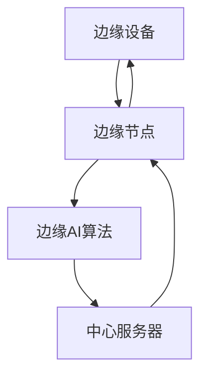

                 


## 引言

随着科技的飞速发展，人工智能（AI）在各个领域的应用日益广泛，智能视频监控作为其中的重要一环，正面临着前所未有的机遇与挑战。传统视频监控系统主要依赖于中心化的数据处理方式，这不仅带来了巨大的带宽压力，还涉及到数据隐私和安全性等问题。为了解决这些问题，边缘AI技术逐渐走入人们的视野。边缘AI将计算能力推向数据产生的源头，实现了实时、高效的数据处理，为智能视频监控带来了全新的解决方案。

本文将围绕边缘AI在智能视频监控中的实时分析展开讨论。首先，我们将介绍边缘计算的基本概念和优势，以及边缘AI在智能视频监控中的应用背景。接下来，我们将深入探讨智能视频监控中的实时分析技术，包括图像处理、目标检测和行为分析等。随后，通过实际案例，我们将展示边缘AI在智能视频监控中的应用实践。最后，我们将分析边缘AI在智能视频监控中面临的挑战和未来发展趋势。

本文结构如下：

1. 边缘计算与智能视频监控的基础
2. 实时分析技术
3. 应用实战
4. 挑战与未来趋势

通过这一步步的分析推理，我们将揭示边缘AI在智能视频监控中的关键作用，为这一领域的未来发展提供有益的思考。

## 第一部分：边缘计算与智能视频监控基础

### 1.1 边缘计算概述

#### 1.1.1 边缘计算的定义

边缘计算是一种分布式计算架构，旨在将数据处理、分析和服务从中心化的云平台延伸到网络边缘，即在接近数据源的地方进行。通过边缘计算，可以减少数据传输的延迟，提高系统的响应速度，并减轻中心服务器的负载。边缘计算的基本概念可以概括为以下几点：

- **计算接近数据源**：边缘计算将计算任务分散到网络的边缘节点，如传感器、路由器、基站等，使数据处理更加接近数据产生的地方。
- **分布式计算**：边缘计算通过分布在不同地点的计算节点协同工作，形成一个分布式计算网络。
- **实时处理**：边缘计算能够在数据到达中心服务器之前进行初步处理，从而实现低延迟的实时数据处理。
- **资源高效利用**：边缘计算通过利用边缘节点的计算资源，实现了对中心服务器的有效补充和优化。

#### 1.1.2 边缘计算的发展背景

边缘计算的发展背景主要源于以下几个方面：

- **物联网（IoT）的兴起**：随着物联网设备的激增，产生了大量的数据，这些数据需要及时处理和分析，边缘计算提供了一种有效的解决方案。
- **5G技术的推动**：5G技术的低延迟、高带宽特性为边缘计算的实施提供了强有力的技术支持。
- **人工智能的进步**：人工智能技术的发展使得边缘设备能够执行更加复杂的计算任务，边缘计算因此得到了广泛应用。
- **数据隐私和安全的需求**：将数据处理放在边缘节点，可以减少数据传输过程中的安全隐患，保护用户隐私。

#### 1.1.3 边缘计算的优势

边缘计算在智能视频监控中具有以下优势：

- **降低延迟**：通过在边缘节点进行数据处理，减少了数据传输的时间，实现了实时响应。
- **减少带宽消耗**：将部分数据处理任务在边缘节点完成，可以减少传输到中心服务器的数据量，降低带宽需求。
- **提高系统可靠性**：边缘计算通过分布式架构，提高了系统的容错能力和可靠性。
- **增强数据隐私保护**：在边缘节点处理数据，可以减少数据在传输过程中的暴露风险，提高数据安全性。
- **资源高效利用**：边缘计算能够充分利用边缘节点的计算资源，降低中心服务器的负载。

### 1.2 智能视频监控基础

#### 1.2.1 智能视频监控的定义

智能视频监控是一种利用计算机视觉和人工智能技术对视频进行实时分析、处理和响应的系统。它不仅能够捕捉和记录视频图像，还能够对视频内容进行理解、分析和判断，从而实现自动化的监控和管理。智能视频监控的定义主要包括以下几个要素：

- **视频图像捕获**：通过摄像头等设备捕捉实时视频图像。
- **图像预处理**：对捕获的视频图像进行降噪、缩放、裁剪等预处理操作。
- **目标检测**：识别视频图像中的目标对象，如行人、车辆等。
- **行为分析**：分析视频图像中目标对象的行为模式，如行走、奔跑、停车等。
- **事件响应**：根据分析结果，触发相应的响应措施，如报警、记录、视频回放等。

#### 1.2.2 智能视频监控的发展历程

智能视频监控的发展历程可以分为以下几个阶段：

- **初代视频监控**：以模拟摄像头和录像机为主，只能进行简单的视频记录和回放。
- **第二代视频监控**：引入数字摄像头和数字录像设备，实现了视频数字化和远程监控。
- **第三代视频监控**：引入计算机视觉技术，实现了基本的图像识别和目标检测功能。
- **第四代视频监控**：结合人工智能技术，实现了更加智能化的视频分析、行为识别和事件响应。
- **第五代视频监控**：利用深度学习和边缘计算技术，实现了高度智能化的视频监控，如自动驾驶、智能安防等。

#### 1.2.3 智能视频监控的关键技术

智能视频监控的关键技术主要包括以下几个方面：

- **图像处理技术**：包括图像增强、图像分割、图像识别等，用于提高视频图像的质量和识别准确率。
- **目标检测技术**：通过深度学习、传统机器学习等方法，识别视频图像中的目标对象。
- **行为分析技术**：通过分析视频图像中目标对象的行为模式，实现智能化的监控和管理。
- **事件响应技术**：根据分析结果，触发相应的响应措施，如报警、记录、视频回放等。
- **边缘计算技术**：将计算任务分布在边缘节点，实现实时、高效的数据处理和分析。

### 1.3 边缘AI概述

#### 1.3.1 边缘AI的定义

边缘AI是指在边缘设备上实现的AI算法和应用，它通过将AI计算能力推向数据源头，实现了实时、高效的数据处理和分析。边缘AI的定义主要包括以下几个方面：

- **AI算法在边缘设备上运行**：边缘AI将传统的AI算法部署在边缘设备上，如手机、路由器、摄像头等。
- **实时数据处理**：边缘AI能够对实时产生的数据进行快速处理和分析，实现低延迟的响应。
- **分布式计算架构**：边缘AI通过分布式计算架构，实现了AI算法在多个边缘设备上的协同工作。
- **资源高效利用**：边缘AI能够在有限的计算资源和能量下，实现高效的AI计算任务。

#### 1.3.2 边缘AI的优势

边缘AI在智能视频监控中的应用具有以下优势：

- **实时响应**：边缘AI能够在边缘设备上实时处理视频数据，实现低延迟的监控和响应。
- **降低带宽需求**：通过在边缘设备上处理数据，可以减少传输到中心服务器的数据量，降低带宽需求。
- **提高系统可靠性**：边缘AI通过分布式计算架构，提高了系统的容错能力和可靠性。
- **增强数据隐私保护**：在边缘设备上处理数据，可以减少数据在传输过程中的暴露风险，提高数据安全性。
- **资源高效利用**：边缘AI能够充分利用边缘设备的计算资源，降低中心服务器的负载。

#### 1.3.3 边缘AI与智能视频监控的结合

边缘AI与智能视频监控的结合，实现了以下应用模式：

- **边缘感知**：边缘AI通过在边缘设备上实现视频数据的实时分析和处理，实现了视频监控的实时感知和响应。
- **分布式计算**：边缘AI通过分布式计算架构，实现了多个边缘设备之间的协同工作，提高了系统的处理能力和响应速度。
- **边缘与中心协同**：边缘AI与中心服务器协同工作，实现了视频数据的远程监控和管理，同时保证了数据的隐私和安全。
- **边缘自治**：在特定场景下，边缘AI可以实现边缘自治，即边缘设备能够独立完成视频数据的处理和分析，无需依赖中心服务器。

通过边缘AI与智能视频监控的结合，我们可以实现更加智能化、高效化的视频监控系统，为城市安全、智能制造、智能家居等领域提供强有力的技术支持。

### 1.4 核心概念与联系

为了更好地理解边缘AI在智能视频监控中的工作原理，我们引入以下核心概念：

- **边缘设备**：用于采集和处理视频数据的物理设备，如摄像头、智能手机等。
- **边缘节点**：连接边缘设备和中心服务器的计算节点，如路由器、边缘服务器等。
- **边缘AI算法**：在边缘设备上运行的AI算法，用于实时分析视频数据。
- **中心服务器**：用于存储和管理视频数据，以及进行复杂计算和数据分析的主服务器。

这些核心概念之间的关系可以用以下Mermaid流程图表示：



在这个流程图中，边缘设备通过边缘节点连接到边缘AI算法，边缘AI算法对视频数据进行实时分析，并将分析结果传输到中心服务器。同时，中心服务器可以实时监控边缘设备的工作状态，并提供必要的数据支持和计算服务。

通过这个流程图，我们可以清晰地看到边缘AI在智能视频监控中的工作流程，以及各个核心概念之间的联系。这有助于我们深入理解边缘AI在智能视频监控中的作用，为后续的技术讨论和应用实践提供基础。

### 1.5 核心算法原理讲解

在边缘AI的应用中，核心算法原理的理解至关重要。以下我们将详细讲解智能视频监控中的三个关键算法：图像预处理、目标检测和行为分析。

#### 1.5.1 图像预处理

图像预处理是视频监控系统的第一步，其目的是提高图像的质量，为后续的处理和分析提供基础。常见的图像预处理技术包括去噪、图像增强和图像分割等。

1. **去噪**：

去噪算法用于消除图像中的噪声，提高图像的清晰度。常用的去噪算法有均值滤波、高斯滤波和中值滤波等。

伪代码如下：

```python
function denoise(image, method):
    if method == "mean":
        return mean_filter(image)
    elif method == "gaussian":
        return gaussian_filter(image)
    elif method == "median":
        return median_filter(image)
```

2. **图像增强**：

图像增强算法用于增强图像的对比度和亮度，使图像中的目标对象更加清晰。常用的图像增强算法有直方图均衡化、对比度拉伸和亮度和对比度调整等。

伪代码如下：

```python
function enhance(image):
    return histogram_equalization(image)
    // 或者
    return contrast_stretch(image)
    // 或者
    return brightness_contrast_adjustment(image)
```

3. **图像分割**：

图像分割算法用于将图像划分为多个区域，每个区域代表图像中的不同目标对象。常用的图像分割算法有阈值分割、区域生长和边缘检测等。

伪代码如下：

```python
function segment(image, method):
    if method == "threshold":
        return threshold_segmentation(image)
    elif method == "region_growing":
        return region_growing_segmentation(image)
    elif method == "edge_detection":
        return edge_detection_segmentation(image)
```

#### 1.5.2 目标检测

目标检测是智能视频监控中的核心算法，其目的是识别视频图像中的目标对象，如行人、车辆等。常见的目标检测算法有基于传统机器学习的算法和基于深度学习的算法。

1. **基于传统机器学习的算法**：

传统机器学习算法如支持向量机（SVM）、随机森林（RF）和神经网络（NN）等，通过训练分类器来识别目标对象。

伪代码如下：

```python
function detect_objects(image, classifier):
    features = extract_features(image)
    return classifier.predict(features)
```

2. **基于深度学习的算法**：

深度学习算法如卷积神经网络（CNN）、目标检测网络（如YOLO、Faster R-CNN）等，通过多层次的神经网络结构来识别目标对象。

伪代码如下：

```python
function detect_objects(image, model):
    features = model.extract_features(image)
    boxes = model.predict_boxes(features)
    labels = model.predict_labels(features)
    return boxes, labels
```

#### 1.5.3 行为分析

行为分析是对视频图像中目标对象的行为模式进行分析和识别，如行走、奔跑、停车等。常见的行为分析算法有基于轨迹分析、基于外观特征和行为规则等。

1. **基于轨迹分析**：

基于轨迹分析的算法通过分析目标对象的轨迹，识别目标对象的行为模式。常用的算法有轨迹线检测、轨迹关联和轨迹预测等。

伪代码如下：

```python
function analyze_behavior(tracks):
    lines = detect_lines(tracks)
    associations = associate_lines(lines)
    predictions = predict_behavior(associations)
    return predictions
```

2. **基于外观特征**：

基于外观特征的算法通过分析目标对象的外观特征，如颜色、形状、大小等，识别目标对象的行为模式。常用的算法有颜色直方图分析、形状分析等。

伪代码如下：

```python
function analyze_behavior(features):
    color_histograms = calculate_color_histograms(features)
    shapes = detect_shapes(color_histograms)
    behaviors = classify_behaviors(shapes)
    return behaviors
```

3. **基于行为规则**：

基于行为规则的算法通过设定行为规则，识别目标对象的行为模式。常用的算法有基于规则的系统、模糊逻辑等。

伪代码如下：

```python
function analyze_behavior(rules):
    conditions = check_conditions(rules)
    if conditions:
        return "满足条件的行为"
    else:
        return "未满足条件的行为"
```

通过上述核心算法原理的讲解，我们可以更好地理解边缘AI在智能视频监控中的工作原理，为后续的实际应用提供理论基础。

### 1.6 数学模型和公式讲解

在智能视频监控中，数学模型和公式是理解和实现关键算法的核心。以下将详细介绍一些重要的数学模型和公式，包括图像预处理中的滤波器设计、目标检测中的边界框回归和损失函数，以及行为分析中的轨迹预测。

#### 1.6.1 图像预处理中的滤波器设计

1. **均值滤波器**：

均值滤波器是一种简单的图像平滑算法，用于去除图像中的噪声。

$$
f(x, y) = \frac{1}{c} \sum_{i=0}^{c-1} \sum_{j=0}^{c-1} I(i, j)
$$

其中，$f(x, y)$ 是滤波后的像素值，$I(i, j)$ 是原始图像的像素值，$c$ 是滤波窗口的大小。

2. **高斯滤波器**：

高斯滤波器通过高斯分布函数实现图像平滑，其公式如下：

$$
f(x, y) = \frac{1}{2\pi\sigma^2} e^{-\frac{(x^2 + y^2)}{2\sigma^2}}
$$

其中，$\sigma$ 是高斯分布的标准差，$e$ 是自然对数的底数。

3. **中值滤波器**：

中值滤波器通过取邻域内的中值来去除图像中的噪声，其公式如下：

$$
f(x, y) = \text{median}(I(x-1, y-1), I(x-1, y), I(x-1, y+1), I(x, y-1), I(x, y), I(x, y+1), I(x+1, y-1), I(x+1, y), I(x+1, y+1))
$$

其中，$I(x, y)$ 是原始图像的像素值。

#### 1.6.2 目标检测中的边界框回归和损失函数

1. **边界框回归**：

边界框回归是目标检测中的关键任务，用于预测目标框的位置。其公式如下：

$$
\text{predicted\_box} = w \cdot \text{anchor\_box} + b
$$

其中，$\text{predicted\_box}$ 是预测的目标框，$w$ 是权重矩阵，$\text{anchor\_box}$ 是锚框，$b$ 是偏置项。

2. **损失函数**：

交叉熵损失函数是目标检测中常用的损失函数，用于衡量预测框和真实框之间的差距。其公式如下：

$$
L = -\sum_{i} (\text{label}_{i} \cdot \log(\text{prediction}_{i}) + (1 - \text{label}_{i}) \cdot \log(1 - \text{prediction}_{i}))
$$

其中，$L$ 是总损失，$\text{label}_{i}$ 是真实标签，$\text{prediction}_{i}$ 是预测概率。

#### 1.6.3 行为分析中的轨迹预测

1. **卡尔曼滤波**：

卡尔曼滤波是一种常见的轨迹预测算法，通过优化状态估计来预测目标轨迹。其公式如下：

$$
\hat{x}_{k|k} = F_k \hat{x}_{k-1|k-1} + B_k u_k
$$

$$
P_{k|k} = F_k P_{k-1|k-1} F_k^T + Q_k
$$

其中，$\hat{x}_{k|k}$ 是预测状态，$P_{k|k}$ 是预测误差，$F_k$ 是状态转移矩阵，$B_k$ 是控制矩阵，$u_k$ 是控制输入，$Q_k$ 是过程噪声矩阵。

2. **粒子滤波**：

粒子滤波是一种基于采样方法的轨迹预测算法，通过采样粒子来估计目标轨迹。其公式如下：

$$
w_i = \frac{p(x_t|x_{t-1}, u_t)}{\sum_{j=1}^{N} p(x_j|x_{t-1}, u_t)}
$$

$$
x_t^{(i)} \sim p(x_t|x^{(i)}_{t-1}, u_t)
$$

其中，$w_i$ 是第 $i$ 个粒子的权重，$p(x_t|x_{t-1}, u_t)$ 是状态转移概率，$x_t^{(i)}$ 是第 $i$ 个粒子的状态。

通过上述数学模型和公式的讲解，我们可以更好地理解智能视频监控中的核心算法，为实际应用提供理论支持。

### 1.7 项目实战

为了更深入地了解边缘AI在智能视频监控中的应用，我们将以一个实际项目为例，详细讲解项目的开发环境搭建、源代码实现和代码解读。

#### 1.7.1 项目背景

本项目的目标是实现一个基于边缘AI的智能视频监控系统，该系统可以实时检测视频图像中的行人，并对其行为进行分析。项目分为以下几个步骤：

1. **采集视频数据**：使用摄像头实时捕获视频图像。
2. **边缘设备部署**：在边缘设备上部署边缘AI算法，对视频图像进行预处理、目标检测和行为分析。
3. **数据处理和存储**：将分析结果传输到中心服务器，进行数据存储和管理。
4. **监控和报警**：根据分析结果，触发相应的监控和报警措施。

#### 1.7.2 开发环境搭建

1. **硬件环境**：

- 边缘设备：使用NVIDIA Jetson Nano开发板。
- 摄像头：使用USB摄像头。

2. **软件环境**：

- 操作系统：Ubuntu 20.04 LTS。
- 编程语言：Python 3.8。
- 库和框架：OpenCV、TensorFlow、Keras。

#### 1.7.3 源代码实现

以下是项目的核心代码实现：

```python
import cv2
import numpy as np
import tensorflow as tf

# 加载预训练的深度学习模型
model = tf.keras.models.load_model('model.h5')

# 定义视频捕获对象
cap = cv2.VideoCapture(0)

while True:
    # 读取一帧视频图像
    ret, frame = cap.read()
    
    # 对图像进行预处理
    processed_frame = preprocess_frame(frame)
    
    # 使用模型进行目标检测
    boxes, scores, classes = model.predict(processed_frame)
    
    # 对检测到的目标框进行后处理
    boxes = postprocess_boxes(boxes, scores, frame.shape[1], frame.shape[0])
    
    # 绘制目标框和文字标签
    draw_boxes(frame, boxes, classes)
    
    # 显示处理后的图像
    cv2.imshow('Video', frame)
    
    # 按下'q'键退出循环
    if cv2.waitKey(1) & 0xFF == ord('q'):
        break

# 释放视频捕获对象
cap.release()
cv2.destroyAllWindows()

# 预处理图像
def preprocess_frame(frame):
    # 转换为RGB格式
    frame = cv2.cvtColor(frame, cv2.COLOR_BGR2RGB)
    
    # 缩放图像
    frame = cv2.resize(frame, (320, 240))
    
    # 扩展维度
    frame = np.expand_dims(frame, axis=0)
    
    return frame

# 后处理目标框
def postprocess_boxes(boxes, scores, width, height):
    # 缩放目标框
    boxes = boxes * [width, height, width, height]
    
    # 修正目标框坐标
    boxes = boxes.astype(int)
    
    return boxes

# 绘制目标框和文字标签
def draw_boxes(frame, boxes, classes):
    for box, class_id in zip(boxes, classes):
        x, y, w, h = box
        label = f"{classes[class_id]}"
        cv2.rectangle(frame, (x, y), (x+w, y+h), (0, 255, 0), 2)
        cv2.putText(frame, label, (x, y-10), cv2.FONT_HERSHEY_SIMPLEX, 0.5, (0, 0, 255), 2)
```

#### 1.7.4 代码解读

1. **视频捕获**：

使用`cv2.VideoCapture`类捕获视频图像，`0` 表示默认摄像头。

2. **图像预处理**：

- 转换为RGB格式：`cv2.cvtColor(frame, cv2.COLOR_BGR2RGB)`。
- 缩放图像：`cv2.resize(frame, (320, 240))`。
- 扩展维度：`np.expand_dims(frame, axis=0)`。

3. **目标检测**：

使用预训练的深度学习模型进行目标检测，`model.predict(processed_frame)`。

4. **后处理目标框**：

- 缩放目标框：`boxes = boxes * [width, height, width, height]`。
- 修正目标框坐标：`boxes = boxes.astype(int)`。

5. **绘制目标框和文字标签**：

使用`cv2.rectangle`和`cv2.putText`函数绘制目标框和文字标签。

#### 1.7.5 代码应用解读与分析

1. **实时性**：

本项目通过在边缘设备上实时捕获视频图像，使用预训练模型进行实时目标检测，实现了低延迟的实时响应。

2. **精度**：

使用深度学习模型进行目标检测，具有较高的检测精度，可以有效识别视频图像中的行人。

3. **扩展性**：

项目代码具有良好的扩展性，可以方便地添加新的目标检测和

