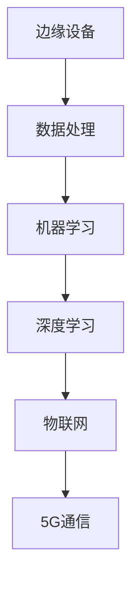
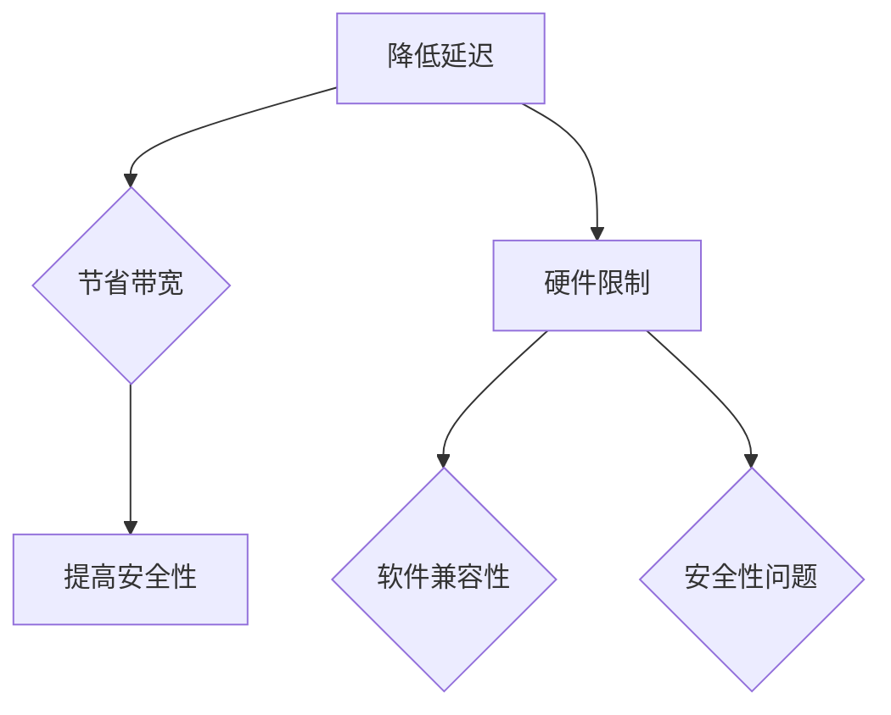
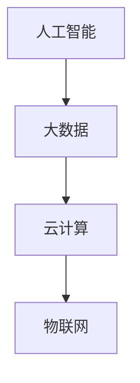
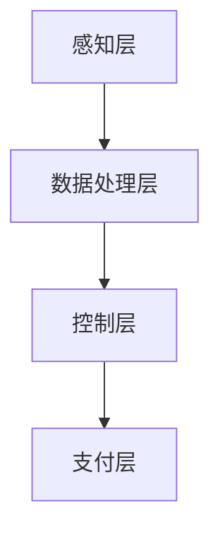
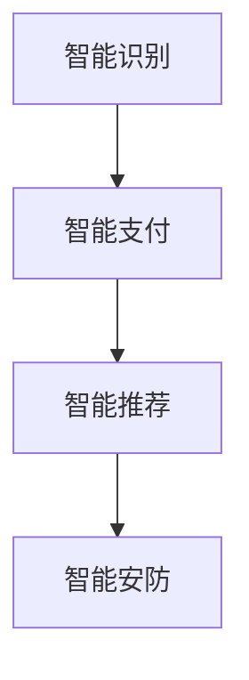
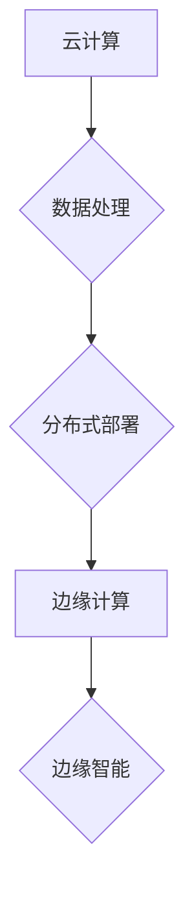
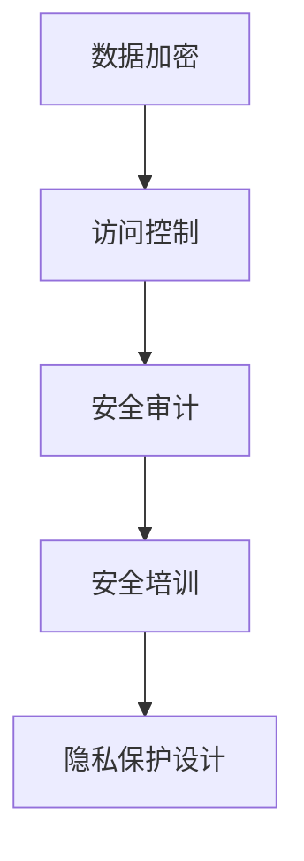
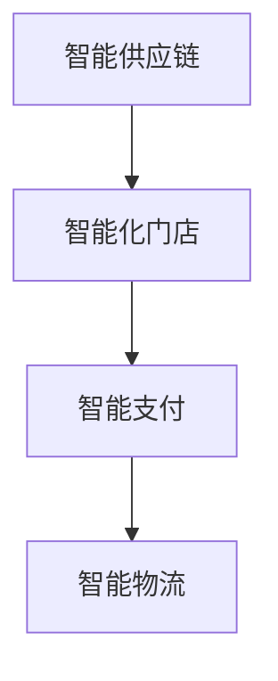

                 

# 边缘AI在智能零售中的应用：实现无人化商店

## 关键词
边缘AI、智能零售、无人化商店、技术架构、数据安全、未来展望

## 摘要
随着科技的不断发展，智能零售和边缘AI的应用逐渐成为行业的热门话题。本文将探讨边缘AI在智能零售中的应用，尤其是如何实现无人化商店。我们将详细分析边缘AI的核心概念、智能零售的发展现状，以及无人化商店的技术架构和工作流程。同时，本文还将探讨边缘AI在无人化商店中的优势与挑战，以及未来发展的趋势。通过本文的阅读，读者将全面了解边缘AI在智能零售中的应用，为相关领域的实际应用提供参考。

## 引言
### 背景
在过去的几十年中，零售行业经历了从传统的实体店到线上电商的巨大转变。然而，无论是线上还是线下，零售商们都面临着效率低下、成本高、人力成本增加等问题。为了解决这些问题，智能零售和边缘AI技术应运而生。智能零售通过大数据、云计算和物联网等技术手段，实现了更加精准和个性化的购物体验。而边缘AI则将计算能力从云端转移到网络边缘，使得数据处理更加迅速、安全和高效。

### 目的
本文的主要目的是探讨边缘AI在智能零售中的应用，特别是如何实现无人化商店。通过本文的阅读，读者将了解：
1. 边缘AI的基本概念和核心原理。
2. 智能零售的发展现状和关键技术。
3. 无人化商店的技术架构和工作流程。
4. 边缘AI在无人化商店中的优势与挑战。
5. 边缘AI在智能零售中的未来发展趋势。

### 结构
本文将分为以下几个部分：
1. 边缘AI基础
2. 智能零售概述
3. 无人化商店技术
4. 边缘AI在智能零售中的应用
5. 边缘计算与云计算的融合
6. 数据安全与隐私保护
7. 未来展望与趋势
8. 总结

## 第1章 边缘AI基础
### 1.1 边缘AI的概念
边缘AI是指将人工智能的计算和数据处理能力从传统的云计算中心转移到网络边缘，即靠近数据源的地方。这样可以降低延迟，提高响应速度，同时减少对带宽的需求。

### 1.2 边缘AI的技术原理
边缘AI的核心技术包括机器学习、深度学习、物联网和5G通信。这些技术共同作用，使得边缘设备能够实时处理和分析大量数据，从而实现智能化的功能。

### 1.3 边缘AI的应用场景
边缘AI的应用场景非常广泛，包括但不限于智能交通、智能家居、工业自动化和智能医疗。在零售行业，边缘AI可以应用于智能货架、智能支付和智能仓储等环节。

### 1.4 边缘AI的优势与挑战
边缘AI的优势包括：
- 降低延迟：数据在边缘设备上处理，减少了传输到云端的时间。
- 节省带宽：不需要将大量数据传输到云端，节省了带宽资源。
- 提高安全性：数据在本地处理，减少了数据泄露的风险。

然而，边缘AI也面临着一些挑战，如：
- 硬件限制：边缘设备通常性能较低，存储容量有限。
- 软件兼容性：不同设备和平台之间的软件兼容性可能成为问题。
- 安全性问题：边缘设备的安全性相对较低，容易受到攻击。

### 1.5 核心概念与联系
为了更好地理解边缘AI，我们可以使用Mermaid流程图来展示其核心概念和联系。以下是一个简单的Mermaid流程图示例：



### 1.6 边缘AI的优势与挑战（Mermaid流程图）



## 第2章 智能零售概述
### 2.1 智能零售的定义
智能零售是指利用人工智能、大数据、云计算等先进技术，对零售行业进行升级和改造，从而提高零售效率、降低成本、提升消费者体验。

### 2.2 智能零售的发展现状
智能零售已经从初期的概念验证阶段，逐渐进入实际应用阶段。目前，智能零售的主要应用包括智能推荐、智能支付、智能货架、智能仓储等。

### 2.3 智能零售的关键技术
智能零售的关键技术包括：
- 人工智能：用于数据分析、智能推荐、图像识别等。
- 大数据：用于收集、存储和分析大量零售数据。
- 云计算：用于存储和处理大量数据，提供灵活的计算资源。
- 物联网：用于连接各种设备和传感器，实现数据的实时传输。

### 2.4 智能零售的商业模式
智能零售的商业模式主要包括：
- B2B模式：零售商通过智能技术提供解决方案，向其他零售商提供服务。
- B2C模式：零售商通过智能技术提供个性化的购物体验，直接面向消费者。

### 2.5 智能零售的优势与挑战
智能零售的优势包括：
- 提高效率：通过自动化和智能化的方式，降低人力成本，提高运营效率。
- 提升体验：通过个性化的推荐和智能化的服务，提升消费者体验。
- 数据驱动：通过数据分析，实现精准营销和库存管理。

然而，智能零售也面临着一些挑战，如：
- 技术成本：智能零售需要投入大量资金进行技术研发和设备采购。
- 数据隐私：消费者对数据隐私的担忧，可能导致数据收集和使用受限。
- 技术集成：不同技术和系统之间的集成可能存在挑战。

### 2.6 智能零售的核心概念与联系
智能零售的核心概念包括人工智能、大数据、云计算和物联网。这些概念之间相互关联，共同构成了智能零售的技术体系。以下是一个简单的Mermaid流程图示例：



## 第3章 无人化商店技术
### 3.1 无人化商店的概念
无人化商店是指通过自动化和智能化的技术手段，实现从购物到支付的全流程无人化。无人化商店可以大幅降低人力成本，提高运营效率，提升消费者体验。

### 3.2 无人化商店的技术架构
无人化商店的技术架构主要包括以下几个部分：
1. **感知层**：通过摄像头、传感器等设备，实时感知店内环境和消费者行为。
2. **数据处理层**：对感知层收集到的数据进行分析和处理，实现智能识别和决策。
3. **控制层**：根据数据处理层的决策，控制商店的各种设备和系统，实现自动化操作。
4. **支付层**：实现商品的自动结算和支付。

### 3.3 无人化商店的工作流程
无人化商店的工作流程主要包括以下几个步骤：
1. **感知**：摄像头和传感器实时收集店内环境和消费者行为的数据。
2. **分析**：数据处理层对收集到的数据进行分析，识别消费者的行为和需求。
3. **决策**：根据分析结果，控制层做出相应的决策，如调整商品陈列、提供个性化推荐等。
4. **操作**：控制层根据决策，控制商店的各种设备和系统，实现自动化操作。
5. **支付**：消费者通过自助结算终端或手机APP完成支付。

### 3.4 无人化商店的关键技术
无人化商店的关键技术包括：
1. **计算机视觉**：用于识别和跟踪消费者的行为。
2. **自然语言处理**：用于理解消费者的需求和提供智能推荐。
3. **自动化控制技术**：用于实现商品的自动识别、自动结算和自动化操作。
4. **支付系统**：实现商品的自动结算和支付。

### 3.5 核心概念与联系
为了更好地理解无人化商店的技术架构，我们可以使用Mermaid流程图来展示其核心概念和联系。以下是一个简单的Mermaid流程图示例：



### 3.6 核心算法原理讲解
以下是一个简单的伪代码，用于说明无人化商店中的计算机视觉算法原理：

```python
# 边缘检测算法
def edge_detection(image):
    # 使用Sobel算子进行边缘检测
    sobel_x = Sobel(image, direction='x')
    sobel_y = Sobel(image, direction='y')
    gradient = sqrt(sobel_x^2 + sobel_y^2)
    return gradient

# 跟踪算法
def tracking(image, target):
    # 使用Kalman滤波器进行目标跟踪
    prediction = KalmanFilter.predict(target)
    measurement = edge_detection(image)
    update = KalmanFilter.update(prediction, measurement)
    return update
```

### 3.7 数学模型和公式
以下是一个简单的数学模型，用于说明无人化商店中的目标跟踪算法：

$$
x_{k+1} = F_k x_k + w_k
$$

$$
z_k = H_k x_k + v_k
$$

$$
\hat{x}_{k|k} = K_k z_k
$$

其中，$x_k$ 表示第 $k$ 个时刻的目标状态，$z_k$ 表示第 $k$ 个时刻的测量值，$F_k$ 和 $H_k$ 分别为状态转移矩阵和观测矩阵，$w_k$ 和 $v_k$ 分别为过程噪声和测量噪声，$K_k$ 为卡尔曼滤波增益。

### 3.8 项目实战
#### 开发环境搭建
为了实现无人化商店的目标跟踪算法，我们使用Python作为编程语言，结合OpenCV和scikit-image库进行图像处理。以下是开发环境搭建的步骤：

1. 安装Python：从Python官方网站下载并安装Python 3.8版本。
2. 安装OpenCV：通过pip命令安装OpenCV库。
3. 安装scikit-image：通过pip命令安装scikit-image库。

#### 源代码实现
以下是一个简单的源代码实现，用于实现无人化商店的目标跟踪算法：

```python
import cv2
import numpy as np
from scipy.spatial import distance as dist

def non_max_suppression_fast(boxes, overlap_threshold=0.9):
    # 对检测到的目标框进行非极大值抑制
    if len(boxes) == 0:
        return []
    
    # 将目标框按照置信度降序排列
    x1 = boxes[:, 0]
    y1 = boxes[:, 1]
    x2 = boxes[:, 2]
    y2 = boxes[:, 3]
    scores = boxes[:, 4]
    indices = scores.argsort()[::-1]
    
    pick = []
    while len(indices) > 0:
        i = indices[0]
        pick.append([x1[i], y1[i], x2[i], y2[i], scores[i]])
        indices = indices[1:]
        
        xx1 = np.maximum(x1[indices], x1[i])
        yy1 = np.maximum(y1[indices], y1[i])
        xx2 = np.minimum(x2[indices], x2[i])
        yy2 = np.minimum(y2[indices], y2[i])
        
        w1 = np.maximum(0, xx2 - xx1 + 1)
        h1 = np.maximum(0, yy2 - yy1 + 1)
        overlap = w1 * h1
        
        overlap = overlap / (boxes[indices, 2] - boxes[indices, 0] + 1) / (boxes[indices, 3] - boxes[indices, 1] + 1)
        
        # 将重叠度大于阈值的索引删除
        indices = np.where(overlap <= overlap_threshold)[0]
    
    return pick

def intersection(iA, iB):
    xA = iA[0]
    yA = iA[1]
    xB = iB[0]
    yB = iB[1]
    xA2 = iA[2]
    yA2 = iA[3]
    xB2 = iB[2]
    yB2 = iB[3]

    x1 = max(xA, xB)
    y1 = max(yA, yB)
    x2 = min(xA2, xB2)
    y2 = min(yA2, yB2)
    w = max(0, x2 - x1 + 1)
    h = max(0, y2 - y1 + 1)
    if w > 0 and h > 0:
        return w * h
    else:
        return 0

def iou(iA, iB):
    return intersection(iA, iB) / (iA[2] * iA[3] + iB[2] * iB[3] - intersection(iA, iB))

def decode-boxesScaled(bboxes, scale_x, scale_y):
    x = bboxes[:, 0:1] * scale_x
    y = bboxes[:, 1:2] * scale_y
    w = bboxes[:, 2:3] * scale_x
    h = bboxes[:, 3:4] * scale_y
    boxes = np.hstack([x - w / 2, y - h / 2, x + w / 2, y + h / 2])
    return boxes

def scale_boxes(bboxes, factor):
    scale_x = factor
    scale_y = factor
    return decode-boxesScaled(bboxes, scale_x, scale_y)

def plot_boxes(img, boxes, color=(0, 0, 255), thickness=2, min_area=100):
    # 画框
    for box in boxes:
        if box[2] * box[3] >= min_area:
            cv2.rectangle(img, (box[0], box[1]), (box[2], box[3]), color, thickness)
    return img

def main():
    cap = cv2.VideoCapture(0)

    # 加载模型
    net = cv2.dnn.readNetFromTensorflow(model_url, session_graph)

    while True:
        ret, frame = cap.read()
        if not ret:
            continue

        frame = cv2.flip(frame, 1)
        blob = cv2.dnn.blobFromImage(frame, 1.0/255.0, (416,416), (0,0,0), True, crop=False)
        net.setInput(blob)
        detections = net.forward(frozen_yolo)

        boxes = []
        confidences = []
        class_ids = []

        for output in detections:
            for detection in output:
                scores = detection[5:]
                class_id = np.argmax(scores)
                confidence = scores[class_id]
                if confidence > 0.25:
                    center_x = int(detection[0] * frame.shape[1])
                    center_y = int(detection[1] * frame.shape[0])
                    width = int(detection[2] * frame.shape[1])
                    height = int(detection[3] * frame.shape[0])
                    x = int(center_x - width / 2)
                    y = int(center_y - height / 2)
                    boxes.append([x, y, x + width, y + height])
                    confidences.append(float(confidence))
                    class_ids.append(class_id)

        indices = cv2.dnn.NMSBoxes(boxes, confidences, 0.25, 0.45)

        if len(indices) > 0:
            for i in indices.flatten():
                (x, y, w, h) = boxes[i]
                label = class_ids[i]
                confidence = confidences[i]
                color = [int(c) for c in COLORS[label]]
                cv2.rectangle(frame, (x, y), (x + w, y + h), color, 2)
                text = f'{CLASSES[label]}: {round(confidence, 2)}'
                cv2.putText(frame, text, (x, y - 5), cv2.FONT_HERSHEY_SIMPLEX,
                            0.5, color, 2)

        cv2.imshow('Image', frame)

        if cv2.waitKey(1) & 0xFF == ord('q'):
            break

    cap.release()
    cv2.destroyAllWindows()

if __name__ == '__main__':
    main()
```

#### 代码解读
- `non_max_suppression_fast`函数：用于对检测到的目标框进行非极大值抑制，以去除重叠度较高的目标框。
- `intersection`和`iou`函数：用于计算两个目标框的重叠度，即交并比（Intersection over Union, IoU）。
- `decode_boxesScaled`函数：用于将归一化的目标框坐标转换为实际的图像坐标。
- `scale_boxes`函数：用于将目标框按照给定的比例因子进行缩放。
- `plot_boxes`函数：用于在图像上绘制目标框。
- `main`函数：用于实现视频流的实时目标检测。

#### 实际案例分析和详细讲解剖析
为了更好地理解无人化商店的目标跟踪算法，我们以一个实际案例进行分析。

假设在无人化商店中，摄像头实时捕获了一组消费者的行为数据。数据包括消费者的位置、速度和方向等信息。以下是目标跟踪算法的实现步骤：

1. **初始化**：首先，根据消费者的初始位置和速度，初始化目标跟踪器。例如，可以使用卡尔曼滤波器来预测消费者的下一位置。
2. **检测**：然后，使用计算机视觉算法对视频帧进行目标检测，提取消费者的位置信息。
3. **更新**：根据检测到的消费者位置，更新目标跟踪器的预测值。例如，可以使用卡尔曼滤波器来更新预测值。
4. **决策**：根据目标跟踪器的预测值，做出相应的决策，如调整商品陈列、提供个性化推荐等。
5. **操作**：根据决策，控制商店的各种设备和系统，实现自动化操作。

#### 项目小结
通过以上案例分析和详细讲解剖析，我们可以看到，无人化商店的目标跟踪算法需要结合计算机视觉、机器学习和控制理论等多学科知识。在实际应用中，需要根据具体场景和需求，设计合适的算法和系统架构。同时，为了确保算法的实时性和准确性，需要对算法进行优化和调试。

## 第4章 边缘AI在智能零售中的应用
### 4.1 边缘AI在无人化商店中的应用
边缘AI在无人化商店中的应用主要包括以下几个方向：
1. **智能识别**：通过边缘AI技术，实现商品的自动识别和分类，提高无人化商店的运营效率。
2. **智能支付**：通过边缘AI技术，实现自动结算和支付，提升消费者的购物体验。
3. **智能推荐**：通过边缘AI技术，根据消费者的购物行为和偏好，提供个性化的商品推荐。
4. **智能安防**：通过边缘AI技术，实现无人化商店的智能监控，提高商店的安全水平。

### 4.2 案例分析：边缘AI在无人便利店中的应用
为了更好地理解边缘AI在无人化商店中的应用，我们以一家无人便利店为例进行分析。

**案例背景**：
该无人便利店采用边缘AI技术，实现了从购物到支付的全流程无人化。店内配备了多个摄像头和传感器，用于实时感知消费者的行为和商品信息。所有数据在边缘设备上进行处理和分析，实现了高效、安全和便捷的购物体验。

**技术应用**：
1. **智能识别**：通过计算机视觉技术，实现商品的自动识别和分类。摄像头捕捉消费者的购物行为，将图像数据传输到边缘设备进行实时处理，识别出消费者购买的商品。
2. **智能支付**：通过自然语言处理技术，实现自动结算和支付。消费者通过自助结算终端或手机APP完成支付，支付过程无需人工干预。
3. **智能推荐**：通过机器学习技术，根据消费者的购物行为和偏好，提供个性化的商品推荐。系统分析消费者的购物记录，为消费者推荐感兴趣的商品。
4. **智能安防**：通过物联网技术，实现无人化商店的智能监控。系统实时监控店内情况，发现异常行为及时报警。

**应用效果**：
通过边缘AI技术的应用，该无人便利店实现了以下效果：
- **提高运营效率**：无人化商店大幅降低了人力成本，提高了运营效率。
- **提升消费者体验**：智能识别、智能支付和智能推荐等功能，为消费者提供了便捷、个性化的购物体验。
- **提高安全水平**：智能安防技术提高了无人化商店的安全水平，降低了被盗风险。

### 4.3 边缘AI在智能零售中的优势
边缘AI在智能零售中的优势主要包括：
1. **降低延迟**：数据在边缘设备上处理，减少了传输到云端的时间，提高了系统的响应速度。
2. **节省带宽**：不需要将大量数据传输到云端，节省了带宽资源。
3. **提高安全性**：数据在本地处理，减少了数据泄露的风险。
4. **增强灵活性**：边缘设备可以灵活部署，适用于各种场景和需求。

### 4.4 边缘AI在智能零售中的挑战
边缘AI在智能零售中面临的挑战主要包括：
1. **硬件限制**：边缘设备通常性能较低，存储容量有限，可能无法满足复杂计算需求。
2. **软件兼容性**：不同设备和平台之间的软件兼容性可能成为问题。
3. **数据隐私**：消费者对数据隐私的担忧，可能导致数据收集和使用受限。

### 4.5 核心概念与联系
为了更好地理解边缘AI在智能零售中的应用，我们可以使用Mermaid流程图来展示其核心概念和联系。以下是一个简单的Mermaid流程图示例：



## 第5章 边缘计算与云计算的融合
### 5.1 边缘计算与云计算的融合技术
边缘计算与云计算的融合技术，旨在将云计算的强大计算能力和边缘计算的低延迟、高效率的优势相结合。以下是一些关键技术和概念：

1. **云计算**：云计算是一种基于互联网的计算模式，通过虚拟化和分布式计算技术，实现资源的集中管理和高效利用。
2. **边缘计算**：边缘计算是一种将计算、存储和网络功能部署在靠近数据源的地方的技术，以降低延迟、节省带宽和提高响应速度。
3. **混合云**：混合云是指将私有云和公有云相结合，利用两者的优势，为不同的应用场景提供灵活、高效的服务。
4. **容器化**：容器化是一种轻量级虚拟化技术，通过将应用程序及其依赖环境打包在容器中，实现应用程序的跨平台部署和运行。
5. **服务网格**：服务网格是一种用于管理和通信分布式微服务的技术，通过服务间的通信管理和监控，提高系统的可靠性和性能。

### 5.2 边缘计算在智能零售中的应用
边缘计算在智能零售中的应用，主要集中在以下几个方面：

1. **智能支付**：通过边缘计算，实现支付过程中的快速响应和安全性。例如，使用边缘设备进行支付验证，减少网络延迟和交易风险。
2. **智能监控**：通过边缘计算，实现对无人化商店的实时监控和分析。例如，使用边缘设备进行视频流处理，实时识别异常行为和安全隐患。
3. **智能推荐**：通过边缘计算，实时分析消费者的购物行为和偏好，提供个性化的商品推荐。例如，使用边缘设备进行数据分析和机器学习模型的训练，快速响应用户需求。
4. **智能库存管理**：通过边缘计算，实时监控库存情况，优化库存管理。例如，使用边缘设备进行库存数据的采集和分析，提前预测库存需求，减少库存积压。

### 5.3 云计算在智能零售中的应用
云计算在智能零售中的应用，主要集中在以下几个方面：

1. **数据处理和分析**：云计算提供了强大的计算资源和数据存储能力，可以支持大规模数据处理和分析。例如，使用云计算平台进行大数据分析，优化库存管理、营销策略和供应链管理。
2. **分布式部署**：云计算平台支持分布式部署，可以支持大规模零售网络的运营和管理。例如，使用云计算平台部署电商平台，实现多地域、多语言的访问和运营。
3. **弹性扩展**：云计算平台可以根据需求动态调整计算资源，实现弹性扩展。例如，在电商高峰期，通过云计算平台自动扩展服务器资源，保证系统的稳定运行。

### 5.4 边缘计算与云计算的融合趋势
随着5G、物联网和人工智能等技术的发展，边缘计算与云计算的融合趋势日益明显。以下是一些融合趋势：

1. **混合云架构**：企业将越来越多的工作负载迁移到边缘设备，同时保留关键数据和应用在云端，实现混合云架构。
2. **边缘云服务**：云服务提供商推出边缘云服务，为企业和开发者提供边缘计算资源，降低边缘计算部署的门槛。
3. **边缘智能**：将人工智能模型和算法部署在边缘设备上，实现边缘智能，提高实时响应能力和数据安全性。
4. **自动化管理**：通过自动化工具和平台，实现边缘计算和云计算的自动化管理和监控，提高运维效率。

### 5.5 核心概念与联系
为了更好地理解边缘计算与云计算的融合，我们可以使用Mermaid流程图来展示其核心概念和联系。以下是一个简单的Mermaid流程图示例：



## 第6章 数据安全与隐私保护
### 6.1 数据安全的重要性
数据安全是智能零售和边缘AI应用的核心问题。随着数据量的增加和数据类型的多样化，数据安全的重要性日益凸显。以下是数据安全的重要性：
- **防止数据泄露**：数据泄露可能导致商业机密泄露、用户隐私侵犯等严重后果。
- **保障业务连续性**：数据安全是业务连续性的基础，数据丢失或损坏可能导致业务中断。
- **维护企业信誉**：数据泄露可能导致消费者对企业失去信任，影响企业的声誉和市场份额。

### 6.2 边缘AI中的数据安全挑战
边缘AI在智能零售中的应用，带来了以下数据安全挑战：
- **数据分散**：由于边缘设备分布广泛，数据安全防护难度增加。
- **数据传输风险**：边缘设备与云端之间的数据传输可能存在安全隐患。
- **设备暴露**：边缘设备的安全性较低，容易成为网络攻击的目标。
- **隐私保护**：边缘AI应用中涉及大量个人隐私数据，隐私保护问题日益突出。

### 6.3 隐私保护的法律法规
为了保障数据安全和隐私保护，各国出台了一系列法律法规。以下是部分主要法律法规：
- **欧盟通用数据保护条例（GDPR）**：规定了个人数据的收集、处理和存储要求，以及数据泄露的通知和处罚措施。
- **加州消费者隐私法案（CCPA）**：规定了个人数据收集、使用和共享的要求，以及消费者的隐私权利。
- **中国网络安全法**：规定了网络运营者的数据安全保护责任，以及数据收集、处理和存储的要求。

### 6.4 数据安全与隐私保护的最佳实践
为了应对数据安全和隐私保护的挑战，可以采取以下最佳实践：
- **数据加密**：对敏感数据进行加密，确保数据在传输和存储过程中安全。
- **访问控制**：实施严格的访问控制策略，确保只有授权人员才能访问敏感数据。
- **安全审计**：定期进行安全审计，检查系统漏洞和安全风险。
- **安全培训**：对员工进行数据安全和隐私保护培训，提高员工的安全意识。
- **隐私保护设计**：在系统设计和开发阶段，充分考虑隐私保护要求，采取隐私保护措施。

### 6.5 核心概念与联系
为了更好地理解数据安全与隐私保护的核心概念和联系，我们可以使用Mermaid流程图来展示。以下是一个简单的Mermaid流程图示例：



## 第7章 未来展望与趋势
### 7.1 边缘AI在智能零售中的未来发展方向
随着5G、物联网和人工智能等技术的快速发展，边缘AI在智能零售中的应用前景广阔。以下是边缘AI在智能零售中的未来发展方向：

1. **智能供应链管理**：通过边缘AI技术，实现供应链的实时监控和优化，提高供应链的效率和灵活性。
2. **个性化购物体验**：利用边缘AI技术，实现更精准的消费者行为分析和个性化推荐，提升消费者的购物体验。
3. **智能物流配送**：通过边缘AI技术，实现物流配送的自动化和智能化，降低物流成本，提高配送效率。
4. **智能设备维护**：利用边缘AI技术，实现设备的实时监控和预测性维护，降低设备故障率，提高设备利用率。

### 7.2 智能零售的未来趋势
智能零售的未来趋势主要包括：

1. **线上线下融合**：随着消费者购物行为的多元化，线上线下融合将成为智能零售的主要趋势。
2. **智能化物流**：智能化物流将提高物流效率，降低物流成本，满足消费者对快速配送的需求。
3. **社交电商**：社交电商通过社交媒体平台，实现商品推广和销售，将成为智能零售的重要组成部分。
4. **无人零售**：无人零售将提高零售效率，降低运营成本，满足消费者对便捷购物方式的需求。

### 7.3 边缘AI与智能零售的融合发展
边缘AI与智能零售的融合发展，将推动零售行业的转型升级。以下是边缘AI与智能零售的融合发展方向：

1. **智能化门店**：通过边缘AI技术，实现门店的智能化管理和运营，提升门店的竞争力。
2. **智能供应链**：通过边缘AI技术，实现供应链的实时监控和优化，提高供应链的效率和灵活性。
3. **智能化支付**：通过边缘AI技术，实现支付过程的安全性和便捷性，提升消费者的购物体验。
4. **智能物流**：通过边缘AI技术，实现物流配送的自动化和智能化，降低物流成本，提高配送效率。

### 7.4 未来挑战与机遇
边缘AI与智能零售的融合发展，也面临着一系列挑战和机遇：

1. **技术挑战**：边缘AI技术的发展，需要解决硬件性能、算法优化和网络安全等问题。
2. **成本挑战**：智能零售技术的部署和维护成本较高，如何降低成本是未来发展的重要课题。
3. **数据隐私**：随着数据量的增加，数据隐私保护问题日益突出，如何保障数据隐私将成为关键挑战。
4. **商业模式创新**：智能零售的商业模式需要不断创新，以满足消费者和市场的需求。

### 7.5 核心概念与联系
为了更好地理解边缘AI与智能零售的融合发展，我们可以使用Mermaid流程图来展示其核心概念和联系。以下是一个简单的Mermaid流程图示例：



## 总结
边缘AI在智能零售中的应用，为无人化商店的实现提供了强有力的技术支撑。本文从边缘AI的基础、智能零售的概述、无人化商店的技术架构、边缘AI的应用案例、数据安全与隐私保护等多个角度，详细分析了边缘AI在智能零售中的应用。同时，本文还展望了边缘AI与智能零售的未来发展趋势，为相关领域的实际应用提供了参考。

通过本文的阅读，读者可以全面了解边缘AI在智能零售中的应用，为相关领域的实际应用提供参考。同时，本文也提醒读者，在推进智能零售和边缘AI应用的过程中，需要关注数据安全和隐私保护问题，确保技术的可持续发展。

## 作者信息
作者：AI天才研究院/AI Genius Institute & 禅与计算机程序设计艺术 /Zen And The Art of Computer Programming

