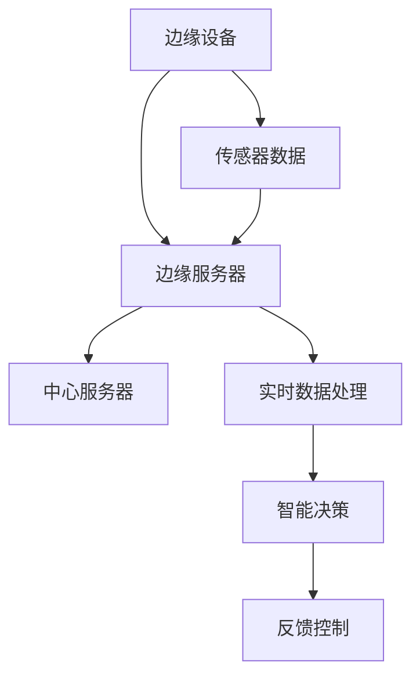
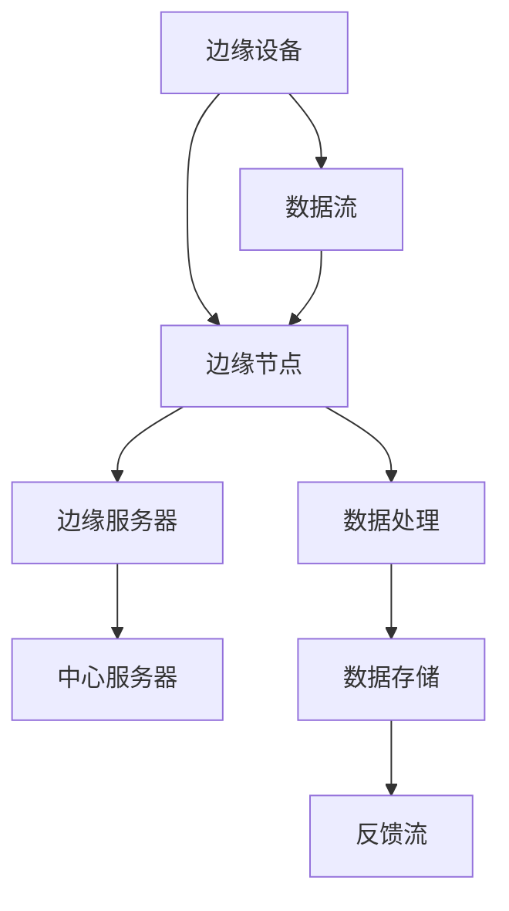
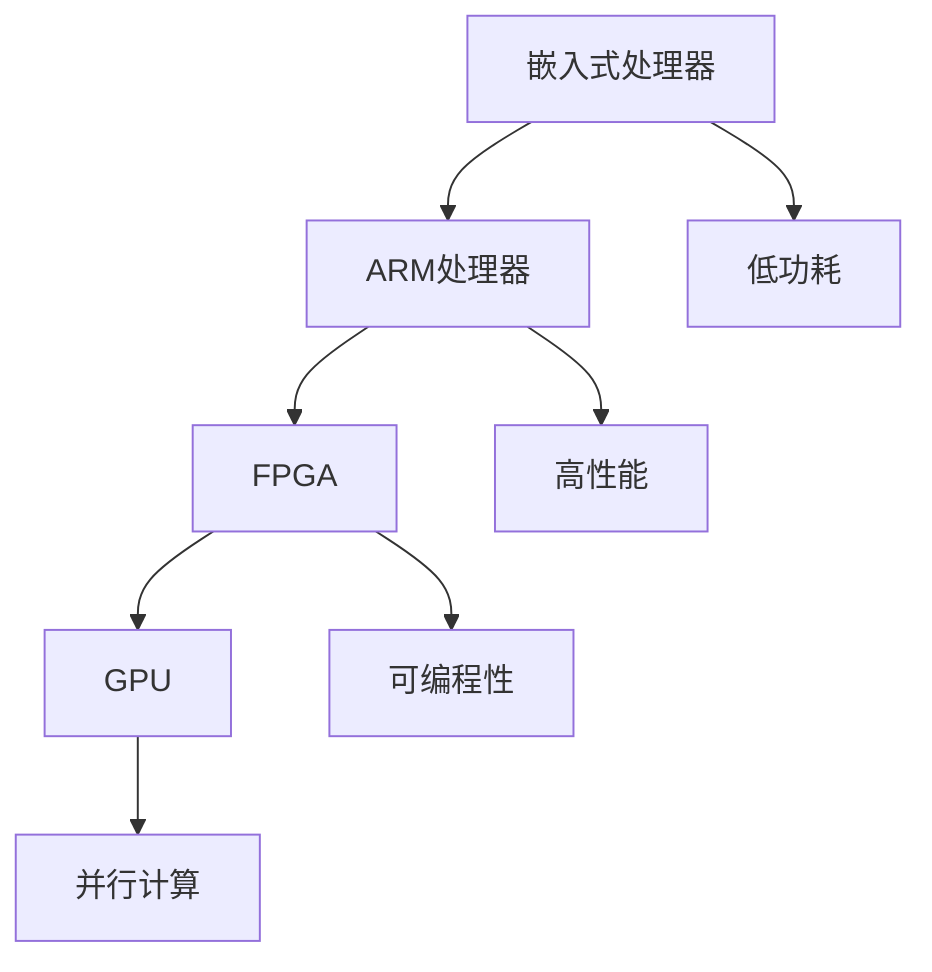
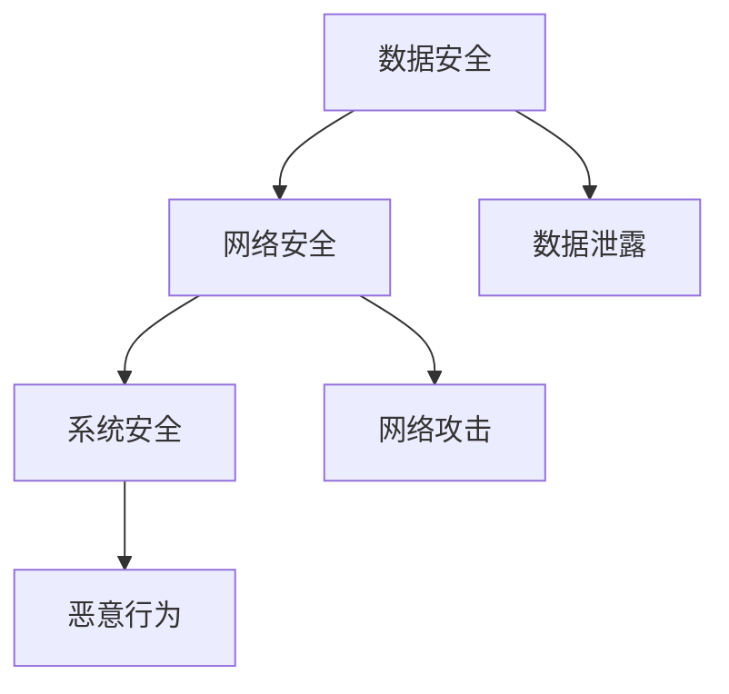
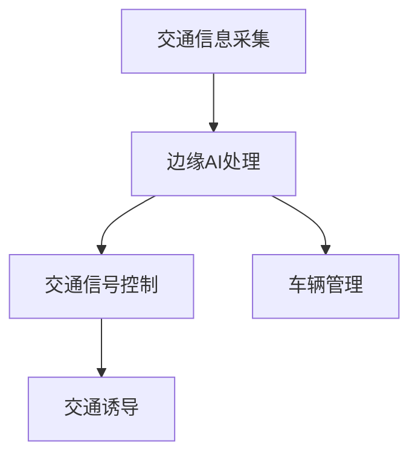
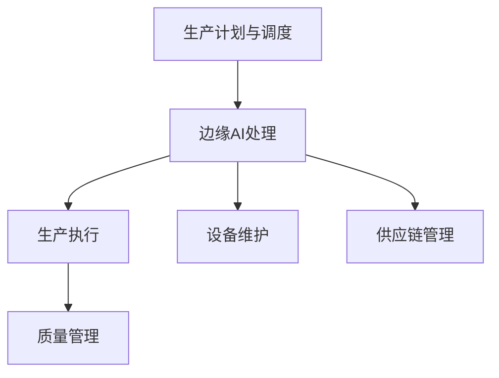
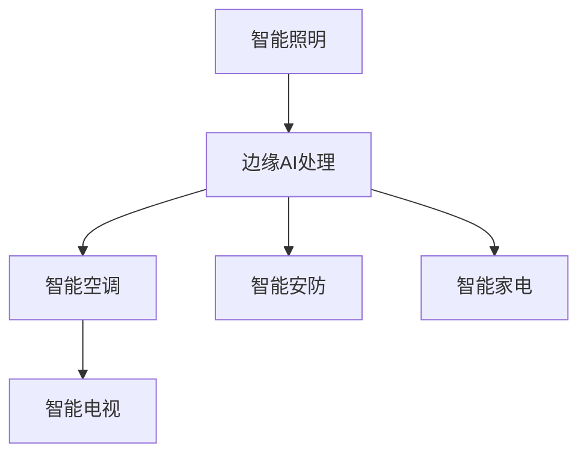
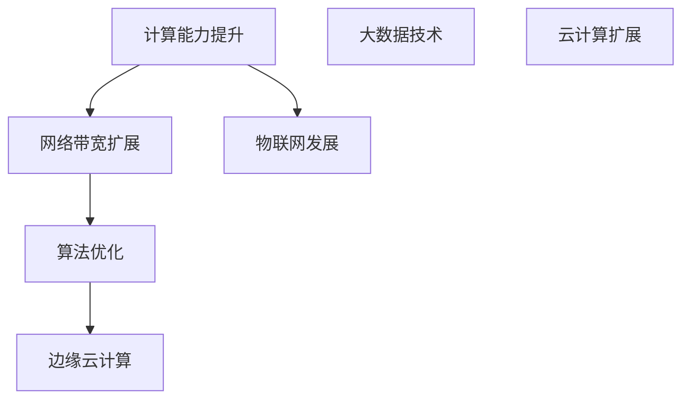

                 

### 边缘AI：实现实时智能决策的关键

#### 关键词：
- 边缘AI
- 实时智能决策
- 边缘计算
- 机器学习
- 深度学习
- 边缘设备

#### 摘要：
边缘AI通过在网络的边缘部署智能计算资源，实现了快速响应和高效数据处理，成为实时智能决策的关键。本文将探讨边缘AI的定义、核心概念、技术架构、算法原理以及其在不同领域的应用和实践，为读者提供全面的技术视角和未来展望。

---

### 目录

#### 第一部分：边缘AI基础与核心概念

**第1章 边缘AI概述**

- 1.1 边缘AI的定义与重要性
- 1.2 边缘AI与传统云计算的对比
- 1.3 边缘AI的技术栈

**第2章 边缘计算网络架构**

- 2.1 边缘计算网络的基本概念
- 2.2 边缘节点与中心节点的交互
- 2.3 边缘计算网络架构设计原则

**第3章 边缘AI的核心技术**

- 3.1 边缘计算硬件
- 3.2 边缘AI算法与模型
- 3.3 模型压缩与量化

**第4章 边缘AI的安全与隐私保护**

- 4.1 边缘AI安全挑战
- 4.2 隐私保护技术

#### 第二部分：边缘AI应用案例与实践

**第5章 边缘AI在智能交通中的应用**

- 5.1 智能交通系统概述
- 5.2 边缘AI在交通监控中的运用
- 5.3 实际案例解析

**第6章 边缘AI在智能制造中的应用**

- 6.1 智能制造概述
- 6.2 边缘AI在生产线监控与优化中的应用
- 6.3 智能制造案例研究

**第7章 边缘AI在智能家居中的应用**

- 7.1 智能家居概述
- 7.2 边缘AI在智能家居设备中的功能
- 7.3 智能家居系统案例分析

**第8章 边缘AI发展趋势与未来展望**

- 8.1 边缘AI的发展趋势
- 8.2 技术挑战与解决方案
- 8.3 边缘AI的未来前景

---

### 第1章 边缘AI概述

#### 1.1 边缘AI的定义与重要性

边缘AI，顾名思义，是将人工智能（AI）的计算和处理能力部署在网络的边缘。这意味着数据处理和分析任务不再仅仅依赖于集中的数据中心或云服务器，而是分布到接近数据源的边缘设备上。这种模式的根本目的是通过缩短数据传输路径，实现更快的数据处理速度和更低的数据延迟。

**背景介绍**

随着物联网（IoT）的快速发展，越来越多的设备和传感器被连接到互联网上，产生了海量的数据。传统的云计算架构很难满足这些实时性要求高的应用需求。边缘AI的出现正是为了解决这一问题，它允许在靠近数据源的地方进行实时数据处理，从而实现高效、低延迟的智能决策。

**核心概念与联系**

边缘AI的核心在于“边缘计算”这个概念。边缘计算指的是在网络的边缘（如路由器、交换机、智能手机、嵌入式系统等）进行数据处理和存储。边缘计算与云计算的核心联系在于它们都是分布式计算的一部分，但边缘计算更侧重于本地处理，而云计算则更侧重于远程处理。

以下是一个简单的Mermaid流程图，展示了边缘AI的核心架构：



**核心算法原理讲解**

边缘AI的算法原理主要包括机器学习和深度学习。在边缘设备上，这些算法被优化以适应有限的计算资源和实时数据处理需求。以下是一个简单的伪代码示例，展示了如何在边缘设备上使用机器学习算法：

```python
# 边缘设备上的机器学习算法伪代码
def edge_learning(model, data_stream):
    while data_stream.has_data():
        data = data_stream.read_data()
        model.train(data)
        prediction = model.predict(data)
        # 输出预测结果
        print(prediction)
```

**数学模型和数学公式**

在边缘AI中，常用的数学模型包括神经网络、支持向量机（SVM）和决策树等。以下是一个简单的LaTeX格式数学公式，展示了神经网络的输出计算：

```latex
$$
\hat{y} = \sigma(\mathbf{W} \cdot \mathbf{a} + b)
$$

其中，\(\sigma\) 是激活函数，\(\mathbf{W}\) 是权重矩阵，\(\mathbf{a}\) 是激活向量，\(b\) 是偏置。
```

**详细讲解与举例说明**

边缘AI在医疗诊断、自动驾驶、智能家居等领域有着广泛的应用。以下是一个简单的案例，展示了边缘AI在医疗诊断中的应用：

**案例：边缘AI在医疗诊断中的应用**

假设一个智能医疗诊断系统需要在边缘设备上对病人的生命体征进行实时监测和诊断。边缘设备接收到来自传感器的数据后，使用机器学习算法进行实时分析，并根据分析结果给出诊断建议。

```python
# 边缘设备上的医疗诊断算法伪代码
def medical_diagnosis(sensor_data):
    # 使用机器学习模型对传感器数据进行实时分析
    analysis_results = machine_learning_model.analyze(sensor_data)
    # 根据分析结果给出诊断建议
    if analysis_results['heart_rate'] > 100:
        print("建议立即就医，心率过高。")
    elif analysis_results['temperature'] > 38:
        print("建议休息，体温过高。")
    else:
        print("身体状况正常。")
```

**小结**

边缘AI通过将AI计算资源部署在网络的边缘，实现了实时智能决策。它在医疗诊断、自动驾驶、智能家居等领域有着广泛的应用前景。本章介绍了边缘AI的定义、核心概念、技术架构和算法原理，为后续章节的内容奠定了基础。

---

### 第2章 边缘计算网络架构

#### 2.1 边缘计算网络的基本概念

边缘计算网络是指在网络的边缘部署计算资源，以实现分布式数据处理和存储。边缘计算网络的基本概念包括边缘节点、边缘服务器和边缘设备等。

**背景介绍**

随着物联网和5G技术的快速发展，数据生成和传输的速度显著提升。传统的云计算架构已经无法满足这些实时性要求高的应用需求。边缘计算网络的出现，正是为了解决这一问题，它允许在网络的边缘进行数据处理和存储，从而实现更快的数据响应和更低的延迟。

**核心概念与联系**

边缘节点是指在网络的边缘部署的计算设备，如路由器、交换机、物联网设备等。边缘服务器是用于处理和存储数据的强大计算设备，通常位于网络的边缘位置。边缘设备是指直接连接到网络，用于生成和收集数据的设备，如传感器、智能手机等。

以下是一个简单的Mermaid流程图，展示了边缘计算网络的基本架构：



**核心算法原理讲解**

边缘计算网络的核心算法原理主要包括数据流处理、机器学习和深度学习等。数据流处理算法用于实时处理和分析大量数据，而机器学习和深度学习算法则用于从数据中提取知识和模式。

以下是一个简单的伪代码示例，展示了边缘计算网络中的数据流处理算法：

```python
# 边缘计算网络中的数据流处理算法伪代码
def edge_data_processing(data_stream):
    while data_stream.has_data():
        data = data_stream.read_data()
        processed_data = data_stream.process_data(data)
        # 输出处理后的数据
        print(processed_data)
```

**数学模型和数学公式**

边缘计算网络中的数学模型包括神经网络、支持向量机（SVM）和决策树等。以下是一个简单的LaTeX格式数学公式，展示了神经网络的输出计算：

```latex
$$
\hat{y} = \sigma(\mathbf{W} \cdot \mathbf{a} + b)
$$

其中，\(\sigma\) 是激活函数，\(\mathbf{W}\) 是权重矩阵，\(\mathbf{a}\) 是激活向量，\(b\) 是偏置。
```

**详细讲解与举例说明**

边缘计算网络在智能交通、智能制造和智能家居等领域有着广泛的应用。以下是一个简单的案例，展示了边缘计算网络在智能交通中的应用：

**案例：边缘计算网络在智能交通中的应用**

假设一个智能交通系统需要在边缘节点上实时处理和分析交通数据，以优化交通信号和减少交通拥堵。边缘节点接收到来自传感器和车辆的数据后，使用机器学习算法进行实时分析，并根据分析结果调整交通信号。

```python
# 边缘节点上的智能交通算法伪代码
def smart_traffic_system(data_stream):
    while data_stream.has_data():
        traffic_data = data_stream.read_traffic_data()
        analyzed_data = machine_learning_model.analyze(traffic_data)
        optimized_signal = traffic_signal_optimizer.optimize(analyzed_data)
        # 输出优化的交通信号
        print(optimized_signal)
```

**小结**

边缘计算网络通过在网络的边缘部署计算资源，实现了分布式数据处理和存储。它在智能交通、智能制造和智能家居等领域有着广泛的应用前景。本章介绍了边缘计算网络的基本概念、核心算法原理和具体应用案例，为后续章节的内容奠定了基础。

---

### 第3章 边缘AI的核心技术

#### 3.1 边缘计算硬件

边缘计算硬件是指用于边缘设备的计算资源，包括处理器、内存、存储和网络接口等。边缘计算硬件的选择和优化对于边缘AI的应用至关重要。

**背景介绍**

边缘计算硬件的选择直接影响到边缘AI的性能和响应速度。随着边缘AI的应用越来越广泛，对边缘计算硬件的要求也越来越高。如何选择适合的边缘计算硬件，以及如何对其进行优化，是边缘AI实现高效性能的关键。

**核心概念与联系**

边缘计算硬件主要包括嵌入式处理器、ARM处理器、FPGA和GPU等。这些硬件各有优缺点，适用于不同的应用场景。例如，嵌入式处理器适用于低功耗、低成本的应用，而GPU适用于高性能计算和深度学习应用。

以下是一个简单的Mermaid流程图，展示了边缘计算硬件的选择和优化过程：



**核心算法原理讲解**

边缘计算硬件的核心算法原理包括处理器优化、内存管理和存储优化等。处理器优化包括指令调度、流水线和缓存等；内存管理包括虚拟内存和内存分页等；存储优化包括固态存储和分布式存储等。

以下是一个简单的伪代码示例，展示了边缘计算硬件中的处理器优化：

```python
# 边缘计算硬件中的处理器优化算法伪代码
def processor_optimization(task_queue):
    while not task_queue.is_empty():
        task = task_queue.dequeue()
        # 根据任务特性选择最佳处理器
        optimal_processor = select_processor(task)
        # 在最优处理器上执行任务
        optimal_processor.execute(task)
```

**数学模型和数学公式**

边缘计算硬件的数学模型包括处理器性能模型、内存访问模型和存储延迟模型等。以下是一个简单的LaTeX格式数学公式，展示了处理器性能模型：

```latex
$$
P = C \cdot \frac{1}{\lambda}
$$

其中，\(P\) 是处理器性能，\(C\) 是处理器周期，\(\lambda\) 是处理器负载。
```

**详细讲解与举例说明**

边缘计算硬件在智能交通、智能制造和智能家居等领域有着广泛的应用。以下是一个简单的案例，展示了边缘计算硬件在智能交通中的应用：

**案例：边缘计算硬件在智能交通中的应用**

假设一个智能交通系统需要在边缘设备上实时处理和分析交通数据，以优化交通信号和减少交通拥堵。边缘设备选择适合的处理器和存储设备，以实现高效的实时数据处理。

```python
# 边缘设备上的智能交通算法伪代码
def smart_traffic_system(edge_device):
    # 选择合适的处理器和存储设备
    processor = edge_device.select_processor()
    storage = edge_device.select_storage()
    while edge_device.has_traffic_data():
        traffic_data = edge_device.read_traffic_data()
        # 在处理器上执行机器学习算法
        analysis_results = machine_learning_model.analyze(traffic_data, processor)
        # 在存储设备上存储分析结果
        storage.save(analysis_results)
```

**小结**

边缘计算硬件是边缘AI的核心技术之一，包括嵌入式处理器、ARM处理器、FPGA和GPU等。边缘计算硬件的选择和优化直接影响到边缘AI的性能和响应速度。本章介绍了边缘计算硬件的基本概念、核心算法原理和具体应用案例，为后续章节的内容奠定了基础。

---

### 第4章 边缘AI的安全与隐私保护

#### 4.1 边缘AI安全挑战

边缘AI在带来巨大效益的同时，也面临着诸多安全挑战。这些挑战主要包括数据安全、网络安全和系统安全等方面。

**背景介绍**

随着边缘AI在各个领域的广泛应用，数据的数量和种类急剧增加，数据泄露、篡改和滥用等风险也随之上升。边缘AI的安全挑战不仅涉及到数据的保护，还包括网络的稳定性和系统的完整性。

**核心概念与联系**

数据安全是指保护数据免受未经授权的访问、泄露和篡改。网络安全是指保护网络设备和数据免受网络攻击和恶意软件的侵害。系统安全是指确保边缘AI系统的稳定运行和防止恶意行为。

以下是一个简单的Mermaid流程图，展示了边缘AI安全挑战的核心概念和联系：



**核心算法原理讲解**

边缘AI安全挑战的解决需要多种技术手段。以下是一些核心算法原理：

- 数据加密与去识别化：通过加密技术保护数据隐私，通过去识别化技术保护个人隐私。
- 安全多方计算：允许多个参与方在不泄露各自数据的情况下进行联合计算。
- 零知识证明：证明某个陈述是真实的，而不泄露任何其他信息。

以下是一个简单的伪代码示例，展示了数据加密与去识别化的应用：

```python
# 数据加密与去识别化算法伪代码
def secure_data_processing(data, encryption_key, deidentification_key):
    # 加密数据
    encrypted_data = encrypt(data, encryption_key)
    # 去识别化数据
    deidentified_data = deidentify(encrypted_data, deidentification_key)
    # 返回去识别化后的数据
    return deidentified_data
```

**数学模型和数学公式**

边缘AI安全挑战的数学模型包括密码学模型、网络攻击模型和安全协议模型等。以下是一个简单的LaTeX格式数学公式，展示了密码学模型中的对称加密算法：

```latex
$$
C = E_K(P)
$$

其中，\(C\) 是加密后的数据，\(E_K\) 是加密函数，\(P\) 是原始数据，\(K\) 是密钥。
```

**详细讲解与举例说明**

边缘AI安全挑战在智能交通、智能制造和智能家居等领域有着广泛的应用。以下是一个简单的案例，展示了边缘AI安全挑战在智能交通中的应用：

**案例：边缘AI安全挑战在智能交通中的应用**

假设一个智能交通系统需要保护交通数据的安全和隐私。系统使用数据加密与去识别化技术保护数据，同时使用安全多方计算确保数据的保密性和完整性。

```python
# 边缘AI安全挑战在智能交通中的应用伪代码
def secure_traffic_system(data_stream, encryption_key, deidentification_key):
    while data_stream.has_data():
        traffic_data = data_stream.read_traffic_data()
        # 加密交通数据
        encrypted_data = encrypt(traffic_data, encryption_key)
        # 去识别化交通数据
        deidentified_data = deidentify(encrypted_data, deidentification_key)
        # 使用安全多方计算分析交通数据
        analyzed_data = secure_computing.analyze(deidentified_data)
        # 输出分析结果
        print(analyzed_data)
```

**小结**

边缘AI的安全与隐私保护是确保其可靠性和信任度的关键。本章介绍了边缘AI安全挑战的核心概念、核心算法原理和具体应用案例，为后续章节的内容奠定了基础。

---

### 第5章 边缘AI在智能交通中的应用

#### 5.1 智能交通系统概述

智能交通系统（Intelligent Transportation System，ITS）利用先进的信息通信技术、电子技术和控制技术，实现交通管理、交通控制和交通服务的智能化。边缘AI在智能交通系统中扮演着关键角色，通过实时数据处理和智能分析，优化交通信号、减少交通拥堵和提高交通安全。

**背景介绍**

随着城市化进程的加速，交通拥堵和事故频发成为许多城市面临的严峻问题。传统的交通管理系统依赖于中心化的数据处理和决策，难以应对海量数据和实时性的要求。边缘AI的出现，使得在交通网络的边缘进行数据处理和分析成为可能，从而实现更高效、更智能的交通管理。

**核心概念与联系**

智能交通系统主要包括交通信息采集、交通信号控制、交通诱导和车辆管理等功能。边缘AI与这些功能的联系在于，它能够实时处理来自交通传感器和车辆的庞大数据量，并提供快速、准确的决策支持。

以下是一个简单的Mermaid流程图，展示了智能交通系统中的边缘AI应用：



**核心算法原理讲解**

边缘AI在智能交通系统中的应用涉及多种算法原理，包括数据流处理、机器学习和深度学习等。以下是一个简单的伪代码示例，展示了边缘AI在交通信号控制中的应用：

```python
# 边缘AI在交通信号控制中的应用伪代码
def traffic_signal_control(data_stream):
    while data_stream.has_data():
        traffic_data = data_stream.read_traffic_data()
        # 使用机器学习算法分析交通数据
        analyzed_data = machine_learning_model.analyze(traffic_data)
        # 根据分析结果调整交通信号
        optimized_signal = traffic_signal_optimizer.optimize(analyzed_data)
        # 输出优化的交通信号
        print(optimized_signal)
```

**数学模型和数学公式**

边缘AI在智能交通系统中的应用需要多种数学模型，包括交通流量模型、信号控制模型和路径规划模型等。以下是一个简单的LaTeX格式数学公式，展示了交通流量模型：

```latex
$$
Q = \frac{K \cdot V \cdot (1 - \rho)}{1 - \rho^2}
$$

其中，\(Q\) 是交通流量，\(K\) 是车道容量，\(V\) 是车辆速度，\(\rho\) 是交通密度。
```

**详细讲解与举例说明**

智能交通系统中的边缘AI应用可以大大提高交通效率。以下是一个简单的案例，展示了边缘AI在交通信号控制中的应用：

**案例：边缘AI在交通信号控制中的应用**

假设一个城市交通系统使用了边缘AI技术来优化交通信号。边缘设备接收到来自交通传感器的数据后，使用机器学习算法分析交通流量，并根据分析结果实时调整交通信号。

```python
# 边缘AI在交通信号控制中的实现伪代码
def optimize_traffic_signals(sensor_data):
    # 使用机器学习模型分析交通流量
    traffic_analysis = machine_learning_model.analyze(sensor_data)
    # 根据分析结果调整交通信号
    optimized_signals = traffic_signal_optimizer.optimize(traffic_analysis)
    # 输出优化的交通信号
    print(optimized_signals)
```

**小结**

边缘AI在智能交通系统中的应用，通过实时数据处理和智能分析，实现了更高效、更智能的交通管理。本章介绍了智能交通系统的概述、核心概念、算法原理和应用案例，为后续章节的内容奠定了基础。

---

### 第6章 边缘AI在智能制造中的应用

#### 6.1 智能制造概述

智能制造（Intelligent Manufacturing）是指利用信息技术、人工智能和自动化技术，实现制造过程的智能化和自动化。边缘AI在智能制造中扮演着关键角色，通过实时数据处理和智能分析，优化生产流程、提高生产效率和产品质量。

**背景介绍**

随着工业4.0和智能制造的兴起，制造业正朝着智能化、自动化和数字化的方向发展。传统的制造模式已经无法满足现代制造业对高效、灵活和可靠性的要求。边缘AI的出现，使得在制造现场进行实时数据处理和智能分析成为可能，从而实现更高效、更智能的制造过程。

**核心概念与联系**

智能制造主要包括生产计划与调度、生产执行、质量管理、设备维护和供应链管理等功能。边缘AI与这些功能的联系在于，它能够实时处理来自传感器和设备的庞大数据量，并提供快速、准确的决策支持。

以下是一个简单的Mermaid流程图，展示了智能制造中的边缘AI应用：



**核心算法原理讲解**

边缘AI在智能制造中的应用涉及多种算法原理，包括数据流处理、机器学习和深度学习等。以下是一个简单的伪代码示例，展示了边缘AI在设备维护中的应用：

```python
# 边缘AI在设备维护中的应用伪代码
def equipment_maintenance(data_stream):
    while data_stream.has_data():
        sensor_data = data_stream.read_sensor_data()
        # 使用机器学习算法分析设备状态
        equipment_state = machine_learning_model.analyze(sensor_data)
        # 根据设备状态进行维护决策
        maintenance_plan = maintenance_optimizer.optimize(equipment_state)
        # 输出维护计划
        print(maintenance_plan)
```

**数学模型和数学公式**

边缘AI在智能制造中的应用需要多种数学模型，包括生产调度模型、设备维护模型和质量管理模型等。以下是一个简单的LaTeX格式数学公式，展示了生产调度模型：

```latex
$$
\min \sum_{i=1}^{n} C_i \cdot x_i
$$

其中，\(C_i\) 是第\(i\)个任务的成本，\(x_i\) 是第\(i\)个任务是否执行。
```

**详细讲解与举例说明**

智能制造中的边缘AI应用可以大大提高生产效率和产品质量。以下是一个简单的案例，展示了边缘AI在设备维护中的应用：

**案例：边缘AI在设备维护中的应用**

假设一个制造工厂使用了边缘AI技术来优化设备维护。边缘设备接收到来自传感器的大量数据后，使用机器学习算法分析设备状态，并根据分析结果制定维护计划。

```python
# 边缘AI在设备维护中的实现伪代码
def optimize_equipment_maintenance(sensor_data):
    # 使用机器学习模型分析设备状态
    equipment_state = machine_learning_model.analyze(sensor_data)
    # 根据设备状态制定维护计划
    maintenance_plan = maintenance_optimizer.optimize(equipment_state)
    # 输出维护计划
    print(maintenance_plan)
```

**小结**

边缘AI在智能制造中的应用，通过实时数据处理和智能分析，实现了更高效、更智能的制造过程。本章介绍了智能制造的概述、核心概念、算法原理和应用案例，为后续章节的内容奠定了基础。

---

### 第7章 边缘AI在智能家居中的应用

#### 7.1 智能家居概述

智能家居（Smart Home）是指利用物联网技术、人工智能和自动化技术，实现家庭设备的智能互联和智能控制。边缘AI在智能家居中扮演着关键角色，通过实时数据处理和智能分析，提供个性化的家居体验、提高生活便利性和安全性。

**背景介绍**

随着物联网技术的普及和人工智能的快速发展，智能家居已经成为现代家庭生活的一部分。传统的家居设备如灯具、空调、电视等逐渐被智能设备所取代，这些智能设备可以通过手机、平板电脑或其他智能设备进行远程控制。边缘AI的出现，使得智能家居系统能够在本地进行实时数据处理和智能分析，从而实现更高效、更智能的家居管理。

**核心概念与联系**

智能家居主要包括智能照明、智能空调、智能电视、智能安防、智能家电等功能。边缘AI与这些功能的联系在于，它能够实时处理来自家居设备的庞大数据量，并提供快速、准确的决策支持。

以下是一个简单的Mermaid流程图，展示了智能家居中的边缘AI应用：



**核心算法原理讲解**

边缘AI在智能家居中的应用涉及多种算法原理，包括数据流处理、机器学习和深度学习等。以下是一个简单的伪代码示例，展示了边缘AI在智能照明中的应用：

```python
# 边缘AI在智能照明中的应用伪代码
def smart_lighting(data_stream):
    while data_stream.has_data():
        sensor_data = data_stream.read_sensor_data()
        # 使用机器学习算法分析环境光线
        lighting_state = machine_learning_model.analyze(sensor_data)
        # 根据分析结果调整照明状态
        optimized_lighting = lighting_optimizer.optimize(lighting_state)
        # 输出优化的照明状态
        print(optimized_lighting)
```

**数学模型和数学公式**

边缘AI在智能家居中的应用需要多种数学模型，包括环境光线模型、温度控制模型和安防报警模型等。以下是一个简单的LaTeX格式数学公式，展示了环境光线模型：

```latex
$$
L = k \cdot I
$$

其中，\(L\) 是照明亮度，\(k\) 是常数，\(I\) 是环境光线强度。
```

**详细讲解与举例说明**

智能家居中的边缘AI应用可以大大提高生活便利性和安全性。以下是一个简单的案例，展示了边缘AI在智能照明中的应用：

**案例：边缘AI在智能照明中的应用**

假设一个智能家居系统使用了边缘AI技术来优化照明。边缘设备接收到来自环境传感器的光线数据后，使用机器学习算法分析环境光线，并根据分析结果调整照明状态。

```python
# 边缘AI在智能照明中的实现伪代码
def optimize_lighting(sensor_data):
    # 使用机器学习模型分析环境光线
    lighting_state = machine_learning_model.analyze(sensor_data)
    # 根据分析结果调整照明状态
    optimized_lighting = lighting_optimizer.optimize(lighting_state)
    # 输出优化的照明状态
    print(optimized_lighting)
```

**小结**

边缘AI在智能家居中的应用，通过实时数据处理和智能分析，实现了更高效、更智能的家居管理。本章介绍了智能家居的概述、核心概念、算法原理和应用案例，为后续章节的内容奠定了基础。

---

### 第8章 边缘AI发展趋势与未来展望

#### 8.1 边缘AI的发展趋势

边缘AI作为新一代计算模式，正面临着前所未有的发展机遇。随着5G、物联网、大数据和云计算等技术的融合与发展，边缘AI正逐渐成为实现实时智能决策的关键技术。

**背景介绍**

随着物联网设备的普及，数据生成和传输的速度急剧增加，传统的中心化数据处理模式已经无法满足实时性和低延迟的要求。边缘AI的出现，使得在数据生成的源头进行实时处理和智能分析成为可能，从而解决了数据传输瓶颈和延迟问题。

**核心概念与联系**

边缘AI的发展趋势主要包括以下几个方面：

1. **计算能力的提升**：随着处理器、存储和网络技术的不断发展，边缘设备的计算能力不断提升，为边缘AI的应用提供了坚实的基础。
2. **网络带宽的扩展**：5G网络的部署和扩展，为边缘AI提供了更高的网络带宽和更低的延迟，使得实时数据处理成为可能。
3. **数据处理算法的优化**：机器学习和深度学习算法在边缘设备上的优化和应用，使得边缘AI能够处理更复杂的任务。
4. **边缘云计算的兴起**：边缘云计算将云计算的能力扩展到网络的边缘，为边缘AI提供了更强大的计算和存储支持。

以下是一个简单的Mermaid流程图，展示了边缘AI的发展趋势：



**核心算法原理讲解**

边缘AI的发展趋势涉及到多种算法原理，包括分布式计算、联邦学习、区块链等。以下是一个简单的伪代码示例，展示了边缘AI在分布式计算中的应用：

```python
# 边缘AI在分布式计算中的应用伪代码
def distributed_computing(task, edge_devices):
    for device in edge_devices:
        device.execute(task)
    # 合并各个设备的结果
    result = merge_results(edge_devices)
    return result
```

**数学模型和数学公式**

边缘AI的发展趋势需要多种数学模型，包括分布式计算模型、联邦学习模型和区块链模型等。以下是一个简单的LaTeX格式数学公式，展示了分布式计算模型：

```latex
$$
\sum_{i=1}^{n} f_i(x_i) = g(x)
$$

其中，\(f_i\) 是第\(i\)个设备的计算结果，\(x_i\) 是第\(i\)个设备的数据，\(g(x)\) 是最终的计算结果。
```

**详细讲解与举例说明**

边缘AI的发展趋势在各个领域都有广泛的应用。以下是一个简单的案例，展示了边缘AI在智慧城市中的应用：

**案例：边缘AI在智慧城市中的应用**

假设一个智慧城市项目需要利用边缘AI技术进行环境监测和城市管理。边缘设备分布在城市各个角落，实时收集环境数据，并通过分布式计算和联邦学习算法进行数据处理和智能分析，为城市管理提供决策支持。

```python
# 边缘AI在智慧城市中的实现伪代码
def smart_city_monitoring(sensor_data, edge_devices):
    # 分布式计算环境监测数据
    distributed_results = distributed_computing(sensor_data, edge_devices)
    # 联邦学习分析城市管理问题
    city_analysis = federated_learning.analyze(distributed_results)
    # 输出城市管理决策
    print(city_analysis)
```

**小结**

边缘AI的发展趋势为实时智能决策提供了强大的技术支持。本章介绍了边缘AI的发展趋势、核心算法原理和具体应用案例，为边缘AI的未来发展奠定了基础。

---

### 最佳实践 Tips、小结、注意事项、拓展阅读

**最佳实践 Tips**

1. **硬件选型**：在选择边缘计算硬件时，需要考虑处理能力、功耗、存储容量和网络性能等因素，以确保设备能够满足应用需求。
2. **数据流处理**：优化数据流处理流程，减少数据传输过程中的延迟和带宽消耗，提高边缘AI的响应速度。
3. **算法优化**：针对边缘设备的计算资源有限，需要对机器学习和深度学习算法进行优化，减少计算复杂度和存储需求。

**小结**

边缘AI通过将计算和存储资源部署在网络的边缘，实现了实时智能决策。本章回顾了边缘AI的发展趋势、核心概念、技术架构和应用案例，为读者提供了全面的技术视角和未来展望。

**注意事项**

1. **安全与隐私保护**：在应用边缘AI时，需要重视数据安全和隐私保护，采用加密、去识别化和安全多方计算等技术手段。
2. **系统稳定性**：边缘AI系统需要具备高可用性和容错性，以应对各种异常情况。

**拓展阅读**

1. 《边缘计算：从概念到实践》
2. 《边缘AI：智能边缘计算应用指南》
3. 《深度学习在边缘计算中的应用》

---

### 作者信息

**作者：AI天才研究院/AI Genius Institute & 禅与计算机程序设计艺术 /Zen And The Art of Computer Programming**

