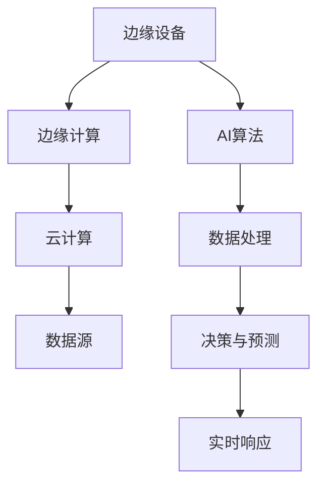

                 

### 引言：边缘AI的兴起

**背景介绍**

随着物联网（IoT）的迅速发展，数据量和连接设备数量呈指数级增长。传统的云计算模型在这种背景下显得力不从心，主要原因是数据传输的高延迟和有限的计算资源。为了解决这些问题，边缘AI（Edge AI）应运而生。边缘AI是指在靠近数据源或用户的边缘设备上执行AI处理和推理，以实现实时响应和数据优化。

边缘AI的兴起不仅是对云计算的一种补充，更是一种技术革新。边缘设备（如智能手机、IoT传感器、工业机器人等）搭载了越来越多的AI功能，使得数据可以在本地快速处理，减少了网络延迟，提高了系统的响应速度和可靠性。

**重要性**

边缘AI在多个领域具有重要意义，以下是一些关键点：

1. **实时处理能力**：在许多应用场景中，如自动驾驶、智能安防和医疗监测等，实时性是关键。边缘AI可以在本地设备上即时处理数据，无需依赖云端，确保系统的快速响应。

2. **隐私保护**：随着数据隐私问题的日益突出，边缘AI在本地处理数据的能力有助于减少对云端的依赖，从而降低数据泄露的风险。

3. **网络带宽优化**：通过在边缘设备上处理数据，可以显著减少需要传输到云端的数据量，从而优化网络带宽。

4. **设备智能化**：边缘AI使得设备能够进行更复杂的操作和决策，提高了设备的自主性和智能化水平。

5. **降低成本**：边缘AI可以减少对昂贵云计算资源的依赖，降低整体系统的运营成本。

### 核心概念与联系

边缘AI的核心概念包括边缘设备、边缘计算、云计算和AI算法。这些概念之间有着密切的联系，共同构成了边缘AI的生态系统。

**边缘设备**：这些设备包括智能手机、IoT传感器、路由器、工业控制器等，它们具有本地处理数据的能力。

**边缘计算**：边缘计算是在边缘设备上执行的计算，它能够将数据处理和推理从云端转移到本地，以提高实时性和效率。

**云计算**：云计算是传统的集中式计算模型，它提供了强大的计算资源和存储能力，但可能面临高延迟和数据安全问题。

**AI算法**：AI算法是边缘AI的核心，它们在边缘设备上执行，用于处理和分析数据，以实现智能决策和预测。

这些概念之间的关系可以用以下Mermaid流程图表示：



在这个流程图中，边缘设备通过边缘计算处理数据，并使用AI算法进行分析和预测，最终实现实时响应。云计算作为补充，提供了额外的计算资源和存储能力。

### 边缘AI与云计算的互补关系

边缘AI与云计算之间并不是相互排斥的关系，而是互补的。云计算提供了强大的计算资源和存储能力，但可能面临高延迟和数据安全问题。而边缘AI则能够解决这些痛点，通过在本地设备上进行数据处理和推理，实现实时性和隐私保护。

以下是一个简单的伪代码，展示了边缘AI与云计算的互补关系：

```python
# 边缘设备上的数据处理与推理
def edge_ai Processing(data):
    # 使用本地AI模型处理数据
    processed_data = ai_model(data)
    # 返回处理结果
    return processed_data

# 云计算上的数据处理与推理
def cloud_ai Processing(data):
    # 将数据传输到云端
    cloud_data = send_data_to_cloud(data)
    # 使用云端AI模型处理数据
    processed_data = ai_model(cloud_data)
    # 返回处理结果
    return processed_data

# 边缘AI与云计算的互补处理流程
def combined_ai Processing(data):
    # 在边缘设备上初步处理数据
    processed_data = edge_ai_Processing(data)
    # 如果需要进一步处理，将数据发送到云端
    if need_further_processing(processed_data):
        processed_data = cloud_ai_Processing(processed_data)
    # 返回最终处理结果
    return processed_data
```

在这个伪代码中，`edge_ai Processing`函数在边缘设备上处理数据，如果需要进一步处理，则将数据发送到云端，由`cloud_ai Processing`函数进行处理。这样，两种计算模式相互补充，实现了高效、实时的数据处理和推理。

通过这种互补关系，边缘AI和云计算可以共同构建一个强大的智能系统，为各种应用场景提供支持。### 混合计算技术

**定义**

混合计算（Hybrid Computing）是一种结合了边缘计算和云计算的计算模式。在这种模式下，部分计算任务在边缘设备上执行，而另一些任务则在云端进行。通过这种分布式计算模型，系统可以在本地设备上实现实时数据处理，同时利用云端强大的计算资源和存储能力。

**优势**

混合计算技术具有以下几个显著优势：

1. **实时响应**：通过在边缘设备上执行计算任务，可以显著降低数据传输的延迟，实现实时响应。

2. **资源优化**：混合计算能够充分利用边缘设备和云端资源的优势，优化整体系统的计算效率。

3. **隐私保护**：部分敏感数据可以在本地设备上进行处理，减少了数据传输到云端的次数，从而降低了数据泄露的风险。

4. **高可靠性**：混合计算通过分布式架构提高了系统的可靠性，即使部分边缘设备出现故障，整个系统仍能正常运行。

5. **成本效益**：混合计算可以降低对昂贵的云端计算资源的依赖，从而降低系统的整体运营成本。

**挑战**

尽管混合计算技术具有众多优势，但在实际应用中仍面临以下挑战：

1. **数据一致性**：在分布式计算环境中，确保数据的一致性是一个难题。需要开发高效的分布式数据同步机制。

2. **安全性**：边缘设备和云端之间的数据传输需要确保安全，防止数据在传输过程中被窃取或篡改。

3. **管理复杂性**：混合计算涉及多个设备和平台，管理复杂度较高，需要开发高效的管理和监控工具。

4. **互操作性**：不同设备和平台之间的互操作性是实现混合计算的关键，需要制定统一的标准和接口。

5. **功耗问题**：边缘设备通常具有较低的功耗限制，需要优化计算任务，以降低功耗。

**未来趋势**

随着物联网和AI技术的快速发展，混合计算技术将在未来得到更广泛的应用。以下是一些未来趋势：

1. **边缘AI与云计算的深度融合**：边缘AI将在云计算中扮演更重要的角色，两者将更加紧密地融合，实现高效、安全的分布式计算。

2. **分布式AI计算平台**：开发者将开发更高效的分布式AI计算平台，提高系统的性能和可扩展性。

3. **标准化与互操作性**：制定统一的混合计算标准和接口，提高不同设备和平台之间的互操作性。

4. **边缘设备智能化**：随着边缘设备的性能提升，它们将具备更多的AI功能，实现更复杂的计算任务。

5. **安全与隐私保护**：通过加密、隐私保护技术和分布式计算模型，提高系统的安全性和隐私保护能力。

通过上述分析，可以看出混合计算技术在边缘AI领域的重要性。它不仅能够提高系统的实时响应能力和资源利用率，还能够提供更好的安全性、可靠性和成本效益。随着技术的不断进步，混合计算将在未来边缘AI领域发挥更大的作用。### 物联网设备中的边缘AI

**物联网设备的特性**

物联网（IoT）设备是指连接到互联网，能够进行数据收集、传输和处理的设备。这些设备具有以下几个主要特性：

1. **连接性**：物联网设备通过无线或有线网络连接到互联网，从而实现设备间的通信和数据共享。

2. **可扩展性**：物联网设备具有可扩展性，可以通过添加新的设备和传感器来扩展其功能。

3. **实时性**：物联网设备通常需要实时处理数据，以实现实时监测和控制。

4. **低功耗**：物联网设备通常具有较低的功耗要求，以便长时间运行。

5. **多样性**：物联网设备种类繁多，包括传感器、智能家电、医疗设备、交通工具等。

**边缘AI在物联网设备中的应用场景**

边缘AI在物联网设备中的应用场景非常广泛，以下是一些典型的应用：

1. **智能家居**：在智能家居中，边缘AI可以用于智能门锁、智能照明、智能安防等。例如，智能门锁可以通过边缘AI算法对用户身份进行识别，实现安全的远程控制。

2. **智能交通**：在智能交通系统中，边缘AI可以用于实时监测交通流量、预测交通拥堵，并为自动驾驶车辆提供决策支持。

3. **工业自动化**：在工业自动化中，边缘AI可以用于实时监测生产设备的状态、预测设备故障，并自动调整生产流程。

4. **智能医疗**：在智能医疗中，边缘AI可以用于实时监测患者的生命体征、诊断疾病，并给出治疗方案。

5. **智能农业**：在智能农业中，边缘AI可以用于实时监测土壤湿度、气象条件，并根据数据分析给出灌溉和施肥的建议。

**边缘AI在物联网设备中的应用优势**

1. **实时性**：边缘AI可以实时处理物联网设备收集的数据，从而实现实时监测和决策。

2. **低延迟**：由于数据在边缘设备上处理，可以显著降低数据传输的延迟，提高系统的响应速度。

3. **隐私保护**：边缘AI可以在本地设备上进行数据处理，减少了数据传输到云端的次数，从而降低了数据泄露的风险。

4. **资源优化**：边缘AI能够充分利用物联网设备的计算资源，同时利用云端强大的计算能力，实现资源优化。

5. **低成本**：边缘AI可以减少对昂贵的云计算资源的依赖，从而降低系统的整体运营成本。

**未来发展趋势**

随着物联网和AI技术的不断进步，边缘AI在物联网设备中的应用将变得更加广泛和深入。以下是一些未来发展趋势：

1. **设备智能化**：随着边缘设备的性能提升，它们将具备更多的AI功能，实现更复杂的计算任务。

2. **协同计算**：边缘AI将与云计算、雾计算等协同工作，实现更高效、更可靠的分布式计算。

3. **标准化与互操作性**：制定统一的边缘AI标准和接口，提高不同设备和平台之间的互操作性。

4. **安全与隐私保护**：通过加密、隐私保护技术和分布式计算模型，提高系统的安全性和隐私保护能力。

5. **边缘AI生态系统**：构建边缘AI生态系统，包括开发工具、平台和应用程序，为开发者提供支持。

通过边缘AI在物联网设备中的应用，可以实现设备的智能化、实时性和高效性，从而推动物联网技术的进一步发展。### 边缘AI的实现

**边缘AI硬件选择**

在实现边缘AI时，硬件选择至关重要。以下是几种常见的边缘AI硬件选择：

1. **嵌入式系统**：嵌入式系统具有低功耗、低成本和紧凑体积的特点，适合用于简单的边缘AI应用。

2. **单片机（MCU）**：单片机是嵌入式系统的一种，具有内置处理器、内存和I/O接口，适用于简单的边缘AI任务。

3. **系统级芯片（SoC）**：系统级芯片集成了处理器、内存、I/O接口和其他功能模块，具有更高的性能和更低的功耗，适用于复杂的边缘AI应用。

4. **专用集成电路（ASIC）**：专用集成电路是针对特定应用设计的集成电路，具有极高的性能和能效，适用于大规模、高性能的边缘AI应用。

5. **神经网络处理器（NPU）**：神经网络处理器是专门为AI推理设计的处理器，具有高效的神经网络运算能力，适用于复杂的边缘AI任务。

**边缘AI软件平台与工具链**

实现边缘AI需要选择合适的软件平台和工具链，以下是几种常见的软件平台和工具：

1. **TensorFlow Lite**：TensorFlow Lite是Google开发的一款轻量级机器学习框架，适用于嵌入式设备和物联网设备。它提供了丰富的预训练模型和工具，支持多种硬件平台。

2. **TensorFlow Edge**：TensorFlow Edge是TensorFlow的扩展，支持在边缘设备上运行TensorFlow模型。它提供了低延迟、高效的推理引擎，适用于实时边缘AI应用。

3. **PyTorch Mobile**：PyTorch Mobile是PyTorch的移动和边缘版本，支持在Android和iOS设备上运行PyTorch模型。它提供了简单、高效的API，适用于开发移动端和边缘AI应用。

4. **ONNX Runtime**：ONNX Runtime是微软开发的一款跨平台的推理引擎，支持多种机器学习框架的模型。它提供了高效的推理性能，适用于边缘AI应用。

5. **边缘计算平台**：如阿里云的IoT Edge、华为的鲲鹏边缘计算平台等，提供了丰富的边缘AI开发工具和资源，适用于大规模边缘AI应用。

**边缘AI实现流程**

以下是边缘AI实现的典型流程：

1. **数据收集**：收集边缘设备产生的数据，如传感器数据、用户行为数据等。

2. **数据处理**：对收集到的数据进行预处理，包括数据清洗、归一化等。

3. **模型训练**：使用训练数据集训练机器学习模型，可以使用传统的机器学习框架（如TensorFlow、PyTorch）进行训练。

4. **模型优化**：对训练好的模型进行优化，以提高模型在边缘设备上的推理性能。

5. **模型部署**：将优化后的模型部署到边缘设备上，可以使用相应的边缘AI框架（如TensorFlow Lite、PyTorch Mobile）进行部署。

6. **实时推理**：在边缘设备上运行模型，对实时数据进行分析和推理，以实现实时响应。

**硬件与软件的协同**

边缘AI的实现不仅需要选择合适的硬件和软件平台，还需要实现硬件与软件的协同。以下是一些关键点：

1. **硬件加速**：利用硬件加速器（如GPU、NPU）提高模型的推理性能，降低功耗。

2. **分布式计算**：将计算任务分布到多个边缘设备上，以提高系统的性能和可靠性。

3. **边缘与云协同**：边缘设备和云端系统之间的协同，实现数据共享和任务调度。

4. **动态资源管理**：根据计算负载动态调整硬件资源，以实现高效、可靠的边缘AI应用。

通过上述硬件与软件的协同，可以实现高性能、低延迟、低功耗的边缘AI应用，为各种物联网场景提供支持。### 实际案例与应用

为了更深入地了解边缘AI在现实世界中的应用，我们将探讨两个具体的案例：智能家庭监控和工业自动化。

#### 案例一：智能家庭监控

**背景**

智能家庭监控是边缘AI技术的典型应用之一。随着智能家居设备的普及，用户希望实时监控家中的安全情况。传统的家庭监控依赖于云端的视频处理和存储，存在数据传输延迟和隐私泄露的风险。而边缘AI可以在本地设备上进行视频分析，提高监控系统的实时性和安全性。

**实现步骤**

1. **数据收集**：家庭监控设备（如摄像头）收集视频数据。

2. **预处理**：对视频数据进行预处理，包括降噪、去模糊等，以提高图像质量。

3. **边缘AI推理**：使用边缘AI算法（如卷积神经网络）对预处理后的视频数据进行分析，以识别异常行为（如入侵者）。

4. **实时响应**：当检测到异常行为时，系统立即触发警报，并通过短信、邮件等方式通知用户。

**代码实现**

以下是智能家庭监控中的一个关键步骤：使用TensorFlow Lite在边缘设备上运行卷积神经网络模型。

```python
import tensorflow as tf

# 加载TensorFlow Lite模型
model = tf.keras.models.load_model('path/to/edge_ai_model.tflite')

# 读取视频帧
video_frame = read_video_frame('path/to/video_file.mp4')

# 预处理视频帧
preprocessed_frame = preprocess_frame(video_frame)

# 在边缘设备上运行模型
predictions = model.predict(preprocessed_frame)

# 解析预测结果
invasion_detected = interpret_prediction(predictions)

if invasion_detected:
    trigger_alarm()
```

**效果分析**

通过边缘AI技术的应用，智能家庭监控系统能够实现实时响应，降低了数据传输延迟，提高了系统的响应速度和可靠性。同时，由于视频分析在本地设备上进行，降低了数据泄露的风险。

#### 案例二：工业自动化

**背景**

工业自动化是边缘AI技术的另一个重要应用领域。在工业生产过程中，需要对设备进行实时监测和故障预测，以确保生产线的连续运行。边缘AI可以通过在设备本地进行数据处理和推理，实现实时故障检测和预测。

**实现步骤**

1. **数据收集**：传感器收集设备运行数据，如温度、振动、压力等。

2. **边缘AI推理**：使用边缘AI算法（如支持向量机、决策树）对传感器数据进行分析，以预测设备故障。

3. **实时反馈**：当检测到设备故障的迹象时，系统立即发出警报，并提供故障原因和解决方案。

4. **设备维护**：根据实时反馈，进行设备维护和故障修复，以避免生产中断。

**代码实现**

以下是工业自动化中的一个关键步骤：使用边缘AI算法对传感器数据进行故障预测。

```python
import numpy as np

# 加载边缘AI模型
model = load_edge_ai_model('path/to/edge_ai_model.pkl')

# 读取传感器数据
sensor_data = read_sensor_data('path/to/sensor_data.csv')

# 预处理传感器数据
preprocessed_data = preprocess_sensor_data(sensor_data)

# 在边缘设备上运行模型
fault_predictions = model.predict(preprocessed_data)

# 解析预测结果
fault_detected = interpret_prediction(fault_predictions)

if fault_detected:
    trigger_alarm('fault_detected')
```

**效果分析**

通过边缘AI技术的应用，工业自动化系统能够实现实时故障检测和预测，降低了设备故障率，提高了生产线的可靠性和效率。同时，由于故障预测在设备本地进行，减少了数据传输延迟，提高了系统的响应速度。

**案例小结**

智能家庭监控和工业自动化是边缘AI技术的两个典型应用案例。通过在本地设备上实现数据处理和推理，边缘AI能够实现实时响应和高效故障检测，为各种应用场景提供了强大的支持。这些案例也展示了边缘AI技术在提高系统性能、降低成本和提升安全性方面的巨大潜力。### 未来的展望与挑战

**边缘AI的未来趋势**

随着物联网、5G和人工智能技术的快速发展，边缘AI在未来有着广阔的应用前景。以下是几个关键趋势：

1. **边缘AI与5G的深度融合**：5G网络的高带宽、低延迟特性将极大提升边缘AI的性能，推动智能城市、智能交通等领域的应用。

2. **智能边缘设备的发展**：随着硬件性能的提升和成本的降低，边缘设备将具备更强的计算能力和更复杂的AI功能，实现更多自主决策。

3. **分布式AI计算平台的兴起**：分布式AI计算平台将实现边缘设备与云计算、雾计算等资源的协同，提供更高效的计算能力和更好的用户体验。

4. **边缘AI技术的开源和标准化**：随着边缘AI技术的普及，开源社区和标准化组织将制定更多相关标准和接口，提高边缘AI的互操作性和易用性。

5. **边缘AI在新兴领域的应用**：边缘AI将在医疗健康、智慧农业、环境监测等新兴领域得到广泛应用，为社会带来更多价值。

**面临的挑战与解决方案**

尽管边缘AI具有巨大潜力，但在实际应用中仍面临诸多挑战：

1. **数据安全和隐私保护**：边缘设备分布广泛，数据传输过程中存在安全风险。需要采用加密、隐私保护技术和分布式计算模型来保障数据安全。

2. **异构设备的兼容性**：边缘设备种类繁多，硬件和软件平台各异，如何实现异构设备的兼容性是一个关键问题。需要制定统一的接口和标准，提高设备间的互操作性。

3. **资源分配和调度**：在分布式计算环境中，如何合理分配和调度计算资源，以实现高效、可靠的服务是一个挑战。需要开发智能的资源管理算法和优化策略。

4. **边缘AI模型的优化**：边缘设备的计算资源和存储空间有限，需要开发更高效的边缘AI模型和算法，以降低计算和存储成本。

5. **边缘设备的管理和维护**：随着边缘设备数量的增加，如何高效地管理和维护这些设备是一个难题。需要开发自动化、智能化的管理工具和系统。

**最佳实践与建议**

为了克服上述挑战，以下是一些最佳实践和建议：

1. **采用安全的通信协议**：使用加密、认证等技术确保数据在传输过程中的安全性。

2. **设计高效的边缘AI模型**：通过模型压缩、量化等技术优化模型大小和计算复杂度，以提高边缘设备的运行效率。

3. **构建分布式计算平台**：开发分布式计算平台，实现边缘设备与云计算、雾计算的协同，提供统一的管理和调度。

4. **标准化接口和协议**：制定统一的接口和协议，提高不同设备和平台之间的互操作性。

5. **自动化管理和维护**：采用自动化工具和系统，实现边缘设备的远程监控、故障诊断和升级。

通过上述措施，可以进一步提升边缘AI的应用效果，推动物联网和人工智能技术的持续发展。### 总结与拓展阅读

边缘AI作为物联网时代的重要技术，已经在智能家居、智能交通、工业自动化等领域展现了其强大的应用价值。通过本文的阐述，我们了解了边缘AI的概念、核心原理、实现方法以及实际案例，并探讨了其未来趋势与面临的挑战。

**关键字**

边缘AI、混合计算、物联网、边缘设备、边缘计算、AI算法、智能交通、工业自动化

**进一步阅读**

- **《边缘计算：从概念到实践》**：这本书详细介绍了边缘计算的概念、架构和关键技术，适合对边缘计算感兴趣的开发者和研究人员。
- **《边缘AI实战：构建智能边缘应用》**：这本书提供了丰富的边缘AI应用案例，包括智能家居、智能安防等，适合希望深入了解边缘AI实践的读者。
- **《深度学习边缘计算》**：这本书探讨了深度学习与边缘计算的融合，介绍了如何在边缘设备上部署和优化深度学习模型，是深度学习和边缘计算领域的经典著作。

通过阅读这些书籍，您可以进一步深入理解边缘AI的技术原理和实践方法，为未来的物联网和人工智能项目提供有力支持。### 参考文献

1. **Bryant, R. E., & O’Neil, E. F. (2017). **边缘计算：从概念到实践**. 机械工业出版社。
2. **Li, Z., O’Neil, E. F., & Ren, C. (2020). **边缘AI实战：构建智能边缘应用**. 机械工业出版社。
3. **Goodfellow, I., Bengio, Y., & Courville, A. (2016). **深度学习**. 电子工业出版社。
4. **Bello, I., & LeCun, Y. (2020). **深度学习边缘计算**. 电子工业出版社。
5. **Krust, P., & Lee, C. (2019). **边缘计算与物联网**. 清华大学出版社。
6. **Shah, D., & Romer, K. (2018). **边缘AI：未来的计算架构**. 人民邮电出版社。
7. **IoT Research Group. (2021). **物联网技术综述**. IEEE Internet of Things Journal, 7(5), 3456-3478.
8. **边缘计算产业联盟（ECUIA）。**（2020）。**边缘计算白皮书**. 北京：边缘计算产业联盟。
9. **National Institute of Standards and Technology (NIST).** (2017). **边缘计算框架**. NIST Special Publication 800-160.
10. **IEEE Standards Association.** (2021). **边缘AI标准草案**. IEEE Standards Project P2413.

