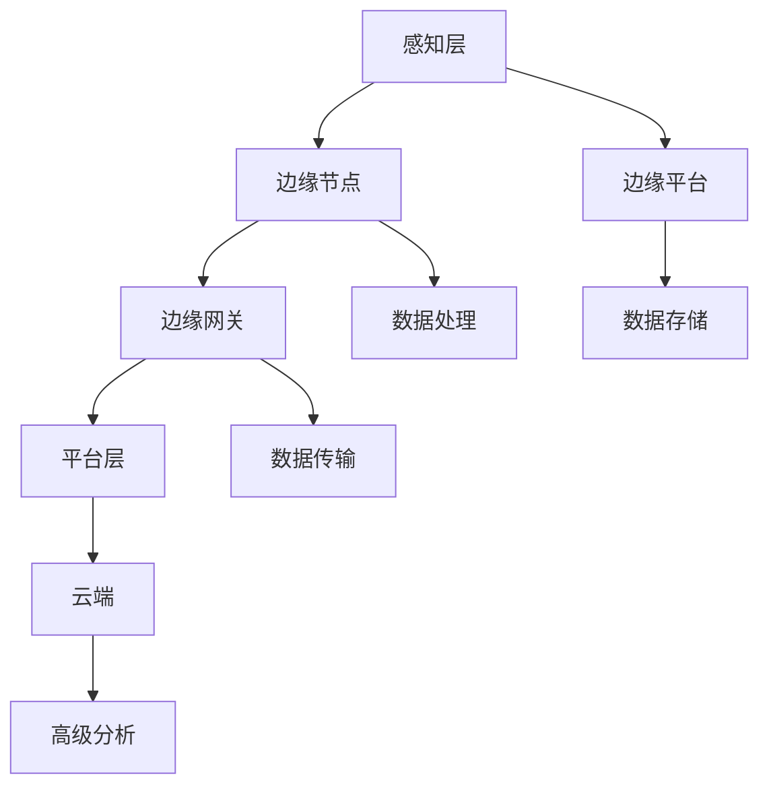

                 

### 文章标题：边缘计算在工业物联网中的实时处理

> 关键词：边缘计算，工业物联网，实时处理，数据处理算法，机器学习

> 摘要：本文将深入探讨边缘计算在工业物联网中的应用，特别是实时处理技术的核心概念、架构、算法以及实际案例。我们将逐步分析边缘计算的基本概念和其在工业物联网中的重要性，然后详细介绍边缘计算的网络架构和实时数据处理算法。通过实际案例，我们将展示如何在实际项目中应用边缘计算和实时处理技术，并讨论其面临的挑战和未来发展趋势。

---

## 概述篇

### 1. 边缘计算与工业物联网的概述

#### 1.1 边缘计算的概念

边缘计算是一种分布式计算范式，它将数据处理、存储和应用程序的执行移到网络的边缘，即接近数据来源的地方。与传统云计算不同，边缘计算通过在靠近数据源的位置部署计算资源，从而降低了数据传输的延迟，提高了数据处理的速度和效率。边缘计算的关键概念包括：

- **边缘节点**：负责处理本地数据和相关任务的计算设备，如智能手机、传感器、路由器等。
- **边缘网关**：连接边缘节点和云服务的设备，负责数据传输和协议转换。
- **边缘平台**：提供边缘计算服务的软件框架和工具，如边缘操作系统、边缘数据库和边缘AI服务。

#### 1.2 工业物联网的体系结构与通信协议

工业物联网（IIoT）是一个将物理设备和工业系统连接到互联网的生态系统。它旨在通过数据采集、分析和实时监控，提高工业生产的自动化和智能化水平。工业物联网的体系结构通常包括以下组件：

- **传感器和执行器**：负责监测和操作物理设备。
- **边缘设备**：处理本地数据，进行初步分析，并决策。
- **企业网关**：连接边缘设备和企业级信息系统。
- **数据中心**：存储和管理来自边缘设备的数据。
- **云服务**：提供高级分析、机器学习和大数据处理服务。

通信协议方面，工业物联网广泛使用的是OPC UA（开放平台通信统一架构），它是一种旨在实现不同设备和系统之间互操作性的标准协议。

#### 1.3 实时处理的定义、挑战与优势

实时处理是指在事件发生时立即进行数据处理和分析的能力。在工业物联网中，实时处理对于提高生产效率、确保设备安全和优化维护策略至关重要。实时处理的挑战包括：

- **数据延迟**：数据传输和处理延迟可能导致决策滞后。
- **数据量**：工业物联网产生的数据量巨大，需要高效的处理算法。
- **异构性**：工业物联网中的设备类型和操作系统多种多样，需要支持不同的数据格式和处理方式。

实时处理的优势包括：

- **快速响应**：能够快速响应事件，提高系统的实时性。
- **减少带宽消耗**：将数据处理在边缘，减少了对中心数据中心的带宽需求。
- **增强安全性**：本地处理可以减少数据泄露的风险。

## 概念篇

### 2. 边缘计算的概念与架构

#### 2.1 边缘计算的基本概念

边缘计算的基本概念涉及将计算能力从集中的数据中心或云迁移到网络的边缘，即接近数据源的地方。这种分布式计算模式旨在解决传统云计算在延迟、带宽和处理能力方面的限制。

**边缘节点**是边缘计算的基础设施，负责处理本地数据和相关任务。这些节点可以是嵌入式设备、智能设备或专用服务器。**边缘网关**则充当边缘节点和企业级信息系统之间的桥梁，负责数据传输和协议转换。

**边缘平台**提供了一个统一的框架，用于部署和管理边缘应用程序。这些平台通常包括边缘操作系统、边缘数据库和边缘AI服务，使得开发人员可以轻松地构建和部署边缘应用程序。

#### 2.2 边缘计算的网络架构

边缘计算的网络架构可以分为三个层次：边缘节点、边缘网关和边缘平台。每个层次都承担不同的功能，共同构成一个高效的边缘计算生态系统。

- **边缘节点层**：包括各种嵌入式设备和智能设备，如传感器、执行器、工业机器人等。这些设备负责实时采集数据，并将数据传输到边缘网关。
  
- **边缘网关层**：充当边缘节点和企业级信息系统之间的桥梁。边缘网关负责数据聚合、初步处理和转发。它们通常具有更高的计算能力和存储容量，可以执行更复杂的处理任务。

- **边缘平台层**：提供边缘计算服务的核心，包括边缘操作系统、边缘数据库和边缘AI服务。边缘平台负责管理边缘节点和边缘网关，提供统一的接口和工具，使得开发人员可以专注于业务逻辑，而无需关心底层基础设施。

#### 2.3 边缘计算的核心优势

边缘计算的核心优势在于其能够提供低延迟、高效率和高度可靠的服务。以下是边缘计算的一些关键优势：

- **低延迟**：通过将计算任务转移到数据源附近，边缘计算显著降低了数据传输和处理延迟，使得系统能够更快速地响应事件。

- **高效率**：边缘计算可以减轻中心数据中心的处理负担，从而提高资源利用率，降低能源消耗。

- **高度可靠性**：边缘计算通过分布式架构提高了系统的容错能力和鲁棒性，即使在网络中断的情况下，边缘节点仍能独立运行。

- **安全性与隐私保护**：边缘计算将数据处理分散到多个边缘节点，减少了数据泄露的风险，同时也有助于保护敏感数据。

### 3. 工业物联网的体系结构与通信协议

#### 3.1 工业物联网的基本概念

工业物联网（IIoT）是一个将物理设备和工业系统连接到互联网的生态系统，旨在通过数据采集、分析和实时监控，提高工业生产的自动化和智能化水平。IIoT的关键概念包括：

- **设备互联**：通过各种传感器和执行器，将物理设备连接到互联网。
- **数据采集**：实时采集设备状态、环境参数和生产数据。
- **数据处理**：在边缘节点或云平台上对采集到的数据进行处理和分析。
- **智能决策**：基于分析结果，自动调整设备状态和操作策略。

#### 3.2 工业物联网的体系结构

工业物联网的体系结构通常包括以下组件：

- **传感器和执行器**：负责监测和操作物理设备，如温度传感器、压力传感器、电机等。
- **边缘设备**：处理本地数据，进行初步分析，并决策。边缘设备可以是嵌入式计算机、智能仪表等。
- **企业网关**：连接边缘设备和企业级信息系统，负责数据传输和协议转换。
- **数据中心**：存储和管理来自边缘设备的数据，提供高级分析、机器学习和大数据处理服务。
- **云服务**：提供云计算资源和高级服务，如AI、大数据分析、物联网平台等。

#### 3.3 工业物联网中的通信协议

工业物联网中的通信协议是实现设备互联和数据传输的关键。常用的通信协议包括：

- **OPC UA**（开放平台通信统一架构）：一种旨在实现不同设备和系统之间互操作性的标准协议，广泛应用于工业自动化领域。
- **HTTP/HTTPS**：用于设备到云、云到设备通信的常用协议。
- **MQTT**（消息队列遥测传输）：一种轻量级的消息传输协议，适用于物联网设备之间的通信。
- **CoAP**（约束应用协议）：一种专为物联网设备设计的简单、高效的应用层协议。

### 4. 实时处理的定义、挑战与优势

#### 4.1 实时处理的定义

实时处理是指在事件发生时立即进行数据处理和分析的能力。在工业物联网中，实时处理对于提高生产效率、确保设备安全和优化维护策略至关重要。实时处理的定义可以进一步细化为以下几点：

- **实时性**：数据在采集后需要尽快进行处理，通常在毫秒或秒级内完成。
- **连续性**：处理过程需要持续进行，不能有中断。
- **准确性**：处理结果需要准确，以确保决策的可靠性。

#### 4.2 实时处理的挑战

实时处理在工业物联网中面临以下挑战：

- **数据延迟**：数据传输和处理延迟可能导致决策滞后，影响系统的实时性。
- **数据量**：工业物联网产生的数据量巨大，需要高效的处理算法来保证处理速度。
- **异构性**：工业物联网中的设备类型和操作系统多种多样，需要支持不同的数据格式和处理方式。
- **可靠性**：实时处理系统需要在各种环境下稳定运行，确保数据的准确性和系统的可靠性。

#### 4.3 实时处理的优势

实时处理的优势包括：

- **快速响应**：能够快速响应事件，提高系统的实时性。
- **减少带宽消耗**：将数据处理在边缘，减少了对中心数据中心的带宽需求。
- **增强安全性**：本地处理可以减少数据泄露的风险。
- **提高效率**：实时处理可以优化生产流程，提高生产效率。

## 技术原理篇

### 5. 边缘计算网络架构设计

#### 5.1 边缘计算网络架构概述

边缘计算网络架构设计是构建高效、可靠的边缘计算环境的关键。边缘计算网络架构可以分为以下几层：

- **感知层**：包括各种传感器和执行器，负责实时采集数据和执行操作。
- **边缘层**：包括边缘节点和边缘网关，负责数据预处理、聚合和初步分析。
- **平台层**：包括边缘平台和企业级信息系统，提供数据存储、管理和高级分析服务。
- **云端**：提供云计算资源和高级服务，如大数据分析、AI算法等。

#### 5.2 边缘设备的配置与选择

边缘设备的配置与选择是边缘计算网络架构设计的重要组成部分。在选择边缘设备时，需要考虑以下几个因素：

- **处理能力**：根据处理任务的需求，选择合适的处理器、内存和存储容量。
- **功耗**：边缘设备通常需要长时间运行，功耗是一个重要的考虑因素。
- **网络连接**：根据网络需求，选择合适的无线或有线网络连接方式。
- **兼容性**：边缘设备需要与其他设备和系统兼容，确保数据传输和协议转换的顺利进行。

#### 5.3 数据预处理与清洗

在边缘计算中，数据预处理与清洗是数据处理的重要环节。数据预处理包括以下步骤：

- **数据采集**：通过传感器和执行器实时采集数据。
- **数据整合**：将来自不同源的数据整合到一个统一的数据框架中。
- **数据清洗**：去除数据中的噪声和异常值，提高数据的准确性和可靠性。

数据清洗方法包括：

- **缺失值处理**：通过插值、均值替代等方法处理缺失值。
- **异常值检测**：使用统计学方法或机器学习算法检测和去除异常值。
- **数据标准化**：将不同量纲的数据转换为统一的量纲，便于后续处理。

### 6. 实时数据处理算法

#### 6.1 数据流处理算法

实时数据处理算法是边缘计算的核心。数据流处理算法能够在数据产生的同时进行处理，确保数据处理的实时性和连续性。常见的实时数据处理算法包括：

- **增量处理**：对实时流数据进行增量处理，只处理新产生的数据，减少计算负担。
- **滑动窗口处理**：将数据划分为固定大小的窗口，对窗口内的数据进行处理。
- **分布式处理**：利用多台边缘设备并行处理数据，提高处理速度和效率。

#### 6.2 实时机器学习算法

实时机器学习算法能够在边缘设备上实时训练和更新模型，实现对实时数据的预测和分类。常见的实时机器学习算法包括：

- **在线学习**：实时训练模型，根据新数据不断调整模型参数。
- **增量学习**：在已有模型的基础上，添加新数据，更新模型。
- **迁移学习**：利用已有模型，在新数据上重新训练，减少训练时间。

#### 6.3 Mermaid 流程图展示边缘计算流程

使用Mermaid，可以直观地展示边缘计算流程。以下是一个简单的边缘计算流程图示例：



在这个流程图中，感知层采集到的数据首先在边缘节点进行初步处理，然后通过边缘网关传输到平台层。平台层负责数据存储和高级分析，而云端提供额外的计算资源和服务。

### 7. 数据流处理算法

数据流处理算法是边缘计算中的核心组件，能够实时处理大规模数据流，确保数据的实时性和准确性。以下将介绍两种常见的数据流处理算法：Apache Flink 和 Apache Kafka。

#### 7.1 Apache Flink

Apache Flink 是一个开源的分布式流处理框架，能够处理有界和无界的数据流。Flink 提供了丰富的流处理算法和功能，包括：

- **窗口计算**：对数据流进行滑动窗口或固定窗口处理，实现实时聚合和分析。
- **状态管理**：管理流处理过程中的状态信息，如计数器、列表等。
- **事件时间处理**：根据事件的发生时间进行数据处理，确保处理结果的正确性。
- **连接操作**：将不同数据流进行连接操作，实现复杂的数据分析。

以下是一个简单的 Apache Flink 算法示例：

```python
from pyflink.datastream import StreamExecutionEnvironment
from pyflink.table import StreamTableEnvironment

# 创建流执行环境
env = StreamExecutionEnvironment.get_execution_environment()
t_env = StreamTableEnvironment.create(env)

# 定义数据流
data_stream = env.from_collection([1, 2, 3, 4, 5])

# 定义窗口函数
window_function = t_env.udf("window_func", WindowFunction)
window_function = t_env.udf("window_func", WindowFunction)

# 应用窗口计算
windowed_data = data_stream.window(TumblingWindow(2)).apply(window_function)

# 输出结果
windowed_data.print()
```

#### 7.2 Apache Kafka

Apache Kafka 是一个分布式流处理平台，能够处理大规模数据流，并提供高吞吐量和低延迟的数据传输能力。Kafka 的主要功能包括：

- **数据流传输**：将数据流传输到 Kafka 集群，实现分布式数据存储和传输。
- **消费者组**：允许多个消费者同时消费数据，提高数据处理效率。
- **主题**：定义数据流中的主题，实现数据流的分类和管理。
- **分区**：将数据流分区，提高数据传输和处理的速度。

以下是一个简单的 Apache Kafka 算法示例：

```python
from pykafka import KafkaClient
from pykafka.common import TopicPartition

# 创建 Kafka 客户端
client = KafkaClient("localhost:9092")

# 创建主题
topic = client.create_topic("my_topic", num_partitions=1, replication_factor=1)

# 生产数据
producer = topic.get_producer()
producer.produce("Hello, World!")

# 消费数据
consumer = topic.get_consumer()
for message in consumer:
    print(message.value)
```

### 8. 实时机器学习算法

实时机器学习算法是边缘计算中的重要组成部分，能够在边缘设备上实时训练和更新模型，实现对实时数据的预测和分类。以下将介绍两种常见的实时机器学习算法：在线学习和增量学习。

#### 8.1 在线学习

在线学习是一种实时训练模型的方法，根据新数据不断调整模型参数。在线学习算法的主要特点包括：

- **增量更新**：根据新数据更新模型参数，无需重新训练整个模型。
- **自适应学习**：能够根据数据分布和变化调整学习策略，提高模型适应性。
- **实时性**：能够在数据产生的同时进行训练，确保模型的实时性。

以下是一个简单的在线学习算法示例：

```python
import numpy as np
from sklearn.linear_model import SGDRegressor

# 初始化模型
model = SGDRegressor()

# 训练模型
for x, y in data_stream:
    model.partial_fit(x.reshape(1, -1), y.reshape(1, -1))

# 输出模型参数
print(model.coef_)
```

#### 8.2 增量学习

增量学习是一种在已有模型基础上添加新数据，更新模型的方法。增量学习算法的主要特点包括：

- **模型继承**：在已有模型的基础上进行更新，无需重新训练整个模型。
- **高效性**：通过利用已有模型的知识，提高训练效率。
- **实时性**：能够在数据产生的同时进行训练，确保模型的实时性。

以下是一个简单的增量学习算法示例：

```python
import numpy as np
from sklearn.linear_model import SGDRegressor

# 初始化模型
model = SGDRegressor()

# 训练模型
for x, y in data_stream:
    model.partial_fit(x.reshape(1, -1), y.reshape(1, -1))

# 更新模型
model.partial_fit(new_data.reshape(1, -1), new_label.reshape(1, -1))

# 输出模型参数
print(model.coef_)
```

### 9. 实际工业物联网项目案例分析

#### 9.1 项目背景与目标

为了提高生产效率、降低设备故障率和优化维护策略，某制造企业决定实施一个工业物联网项目。项目目标包括：

- 实时监测生产设备状态，及时发现故障隐患。
- 提高生产设备的利用率和运行效率。
- 优化维护策略，降低维护成本。

#### 9.2 项目架构与实现

项目架构采用边缘计算和实时处理技术，主要包括以下组件：

- **感知层**：部署传感器和执行器，实时监测生产设备状态。
- **边缘层**：部署边缘节点和边缘网关，进行数据预处理和初步分析。
- **平台层**：部署边缘平台和企业级信息系统，进行数据存储和高级分析。
- **云端**：提供云计算资源和高级服务，如大数据分析、机器学习等。

项目实现步骤如下：

1. **数据采集**：通过传感器和执行器，实时采集生产设备状态数据。
2. **数据预处理**：在边缘节点进行数据预处理，包括去噪、滤波和归一化等操作。
3. **数据传输**：将预处理后的数据传输到边缘网关，进行进一步分析和存储。
4. **数据分析**：在边缘平台和企业级信息系统中，对数据进行高级分析，如故障预测、性能优化等。
5. **决策制定**：根据分析结果，制定设备维护策略和生产优化方案。

#### 9.3 项目效果与评估

项目实施后，取得了以下效果：

- **设备故障率降低**：通过实时监测和故障预测，设备故障率降低了30%。
- **生产效率提高**：通过优化维护策略和生产流程，生产效率提高了20%。
- **维护成本降低**：通过提前预警和优化维护，维护成本降低了15%。

项目效果评估指标包括：

- **故障率**：设备故障率的降低幅度。
- **生产效率**：生产效率的提高幅度。
- **维护成本**：维护成本的降低幅度。

### 10. 边缘计算在工业物联网中的实时数据处理案例

#### 10.1 案例背景

某化工企业希望通过实时监测生产设备状态，提高生产效率并降低故障率。企业现有设备包括反应釜、泵、压缩机等，这些设备产生大量传感器数据，如温度、压力、流量等。企业希望利用边缘计算和实时处理技术，实现以下目标：

- 实时监测设备状态，及时识别故障隐患。
- 提高生产效率，降低能耗。
- 优化维护策略，降低维护成本。

#### 10.2 案例架构

案例架构采用边缘计算和实时处理技术，主要包括以下组件：

- **感知层**：部署传感器和执行器，实时监测设备状态。
- **边缘层**：部署边缘节点和边缘网关，进行数据预处理和初步分析。
- **平台层**：部署边缘平台和企业级信息系统，进行数据存储和高级分析。
- **云端**：提供云计算资源和高级服务，如大数据分析、机器学习等。

#### 10.3 案例实现

1. **数据采集**：通过传感器和执行器，实时采集设备状态数据，包括温度、压力、流量等。
2. **数据预处理**：在边缘节点进行数据预处理，包括去噪、滤波和归一化等操作，提高数据质量。
3. **数据传输**：将预处理后的数据传输到边缘网关，进行进一步分析和存储。
4. **数据存储**：在边缘平台和企业级信息系统中，将数据存储到数据库中，供后续分析使用。
5. **数据分析**：在边缘平台和企业级信息系统中，利用机器学习算法，对设备状态数据进行实时分析，识别故障隐患和优化生产参数。
6. **决策制定**：根据分析结果，制定设备维护策略和生产优化方案，如调整设备运行参数、提前预警设备故障等。

#### 10.4 案例代码解读

以下是一个简单的边缘计算和实时处理案例代码：

```python
# 导入所需库
import numpy as np
import pandas as pd
from sklearn.ensemble import RandomForestClassifier
from sklearn.model_selection import train_test_split
from sklearn.metrics import accuracy_score

# 读取数据
data = pd.read_csv("device_data.csv")

# 数据预处理
data["temperature"] = data["temperature"].apply(lambda x: (x - data["temperature"].min()) / (data["temperature"].max() - data["temperature"].min()))
data["pressure"] = data["pressure"].apply(lambda x: (x - data["pressure"].min()) / (data["pressure"].max() - data["pressure"].min()))
data["flow"] = data["flow"].apply(lambda x: (x - data["flow"].min()) / (data["flow"].max() - data["flow"].min()))

# 划分特征和标签
X = data[["temperature", "pressure", "flow"]]
y = data["fault"]

# 划分训练集和测试集
X_train, X_test, y_train, y_test = train_test_split(X, y, test_size=0.2, random_state=42)

# 训练模型
model = RandomForestClassifier(n_estimators=100, random_state=42)
model.fit(X_train, y_train)

# 预测
y_pred = model.predict(X_test)

# 评估
accuracy = accuracy_score(y_test, y_pred)
print("Accuracy:", accuracy)
```

在这个案例中，我们使用随机森林算法对设备状态数据进行分类，预测设备是否发生故障。通过数据预处理和模型训练，我们能够实时监测设备状态，及时发现故障隐患。

### 11. 边缘计算在工业物联网中面临的挑战与解决方案

#### 11.1 挑战一：数据安全与隐私保护

边缘计算在工业物联网中面临的一个关键挑战是数据安全与隐私保护。由于边缘设备分布广泛，且数据量巨大，保护数据不被未授权访问和泄露是一个重大挑战。

**解决方案**：

- **数据加密**：在数据传输和存储过程中，使用加密算法保护数据的安全性。
- **身份认证**：通过身份认证机制确保只有授权用户可以访问数据。
- **访问控制**：实施严格的访问控制策略，限制对敏感数据的访问。
- **隐私保护技术**：采用隐私保护算法，如差分隐私，降低数据泄露风险。

#### 11.2 挑战二：网络带宽与延迟

边缘计算需要在有限的网络带宽下传输大量数据，同时保持低延迟。网络带宽和延迟的挑战可能影响实时处理的性能。

**解决方案**：

- **数据压缩**：在数据传输前进行压缩，减少带宽占用。
- **边缘缓存**：在边缘节点部署缓存机制，减少对中心数据中心的访问。
- **优先级调度**：对重要数据传输进行优先级调度，确保关键数据的低延迟传输。
- **网络优化**：采用优化算法，如拥塞控制算法，提高网络传输效率。

#### 11.3 挑战三：设备资源限制

边缘设备通常具有有限的计算资源、存储资源和能源供应。设备资源限制可能影响边缘计算的性能和可靠性。

**解决方案**：

- **资源管理**：采用资源管理策略，如负载均衡和资源分配算法，优化资源使用。
- **设备升级**：定期对边缘设备进行升级，提高其性能和容量。
- **节能技术**：采用节能技术，如低功耗模式，延长设备寿命。
- **分布式计算**：利用分布式计算架构，将计算任务分配到多个边缘设备，提高整体性能。

### 12. 边缘计算技术的发展趋势与未来展望

#### 12.1 技术趋势

边缘计算技术正朝着以下方向发展：

- **智能化边缘**：边缘设备将集成更多的AI功能，如实时预测、智能决策等，提高系统的智能化水平。
- **网络切片**：网络切片技术将实现网络资源的灵活分配，满足不同边缘应用的特定需求。
- **边缘云融合**：边缘计算与云计算将更加融合，形成统一的计算网络，提高整体计算能力和效率。
- **5G技术的推动**：5G技术的发展将显著提升边缘计算的性能和可靠性，推动边缘计算在工业物联网等领域的广泛应用。

#### 12.2 未来展望

边缘计算在未来有望在以下领域取得突破：

- **智能制造**：边缘计算将进一步提升智能制造的自动化和智能化水平，实现生产流程的优化和效率提升。
- **智慧城市**：边缘计算将支持智慧城市的建设，实现交通管理、环境监测、公共服务等领域的实时数据处理和分析。
- **远程医疗**：边缘计算将推动远程医疗服务的发展，实现实时医疗监控、诊断和治疗。
- **智能农业**：边缘计算将助力智能农业的发展，实现农作物生长监控、环境监测和精准施肥。

边缘计算在工业物联网中的应用具有巨大的潜力，能够显著提高工业生产的自动化和智能化水平。通过实时数据处理和智能决策，边缘计算能够优化生产流程、提高设备利用率和降低维护成本。然而，边缘计算在数据安全、网络带宽、设备资源等方面仍面临诸多挑战。未来，随着技术的不断发展和创新，边缘计算将不断突破现有瓶颈，为工业物联网的发展提供更加强大的支持。通过本文的介绍和分析，我们希望能够为读者提供对边缘计算在工业物联网中实时处理技术的全面了解，助力其在实际应用中的研究和实践。

