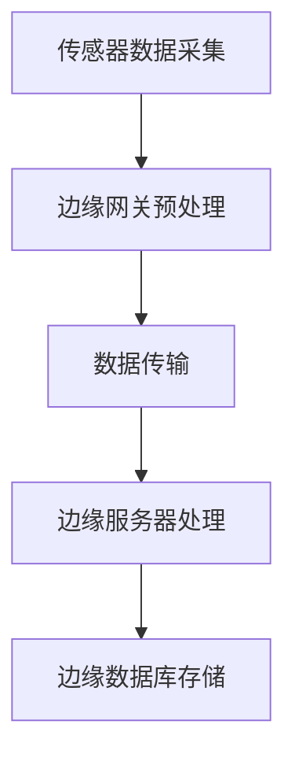
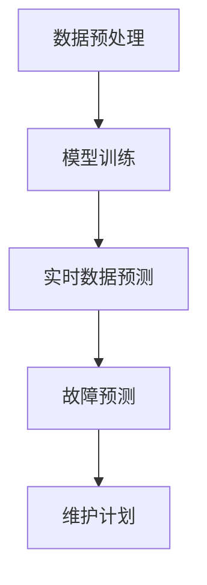
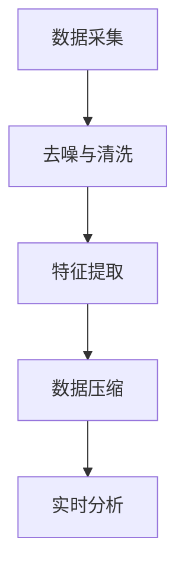

                 


## 文章标题

边缘计算在工业物联网中的实践

## 关键词

边缘计算，工业物联网，实时数据处理，设备监控，智能工厂，5G，安全与隐私保护

## 摘要

边缘计算作为一种新兴的计算模式，正逐渐成为工业物联网（IIoT）的重要组成部分。本文从边缘计算的基础知识出发，探讨了其在工业物联网中的背景与需求，详细介绍了边缘计算的核心组件及其在工业物联网中的应用。通过案例分析，本文展示了边缘计算在设备监控、实时数据处理、智能工厂和工业大数据分析等领域的实际应用，并分析了边缘计算与5G网络的结合。最后，本文对未来边缘计算在工业物联网中的发展趋势进行了展望，为开发者提供了实践指南和最佳实践建议。

# 《边缘计算在工业物联网中的实践》目录大纲

## 第一部分：边缘计算基础

### 第1章：边缘计算概述

#### 边缘计算的概念

边缘计算（Edge Computing）是一种分布式计算架构，它将数据存储、处理和应用程序逻辑从中心化的云服务器转移到网络的边缘——即接近数据源的地方。通过这种方式，边缘计算可以显著降低延迟、减少带宽使用并提高系统的响应速度。

#### 边缘计算的起源与发展

边缘计算的概念最早可以追溯到20世纪90年代，当时随着互联网的普及，人们开始意识到中心化计算模式的局限性。随着物联网（IoT）的兴起，边缘计算的重要性日益凸显，特别是在需要低延迟和高可靠性的工业应用中。

#### 边缘计算与传统云计算的比较

与传统云计算相比，边缘计算在数据处理的分布式程度、响应速度和资源利用方面具有明显优势。传统云计算依赖于远程数据中心，而边缘计算则将计算任务分散到接近数据源的网络边缘节点。

#### 边缘计算的架构与关键技术

边缘计算架构通常包括边缘服务器、边缘网关、边缘数据库和边缘智能算法。这些组件协同工作，实现了数据的高效处理和实时响应。

### 第2章：工业物联网的背景与需求

#### 工业物联网的定义

工业物联网（IIoT）是指将各种物理设备、传感器、软件和通信网络连接起来，以实现工业生产的智能化和管理优化。

#### 工业物联网的发展历程

工业物联网的发展经历了从早期的自动化设备到智能互联设备的转变，当前正处于高速发展的阶段。

#### 工业物联网的关键技术

工业物联网的关键技术包括传感器技术、通信技术、数据处理技术和安全防护技术。边缘计算作为其中一项关键技术，为工业物联网提供了强大的数据处理和实时响应能力。

#### 边缘计算在工业物联网中的应用需求

随着工业物联网的不断扩展，对实时数据处理、设备监控和预测维护的需求日益增长。边缘计算能够满足这些需求，为工业物联网的稳定运行提供保障。

### 第3章：边缘计算的核心组件

#### 边缘服务器

边缘服务器是边缘计算架构中的核心组件，负责处理和存储大量数据，并提供计算资源。

#### 边缘网关

边缘网关是连接工业物联网设备和边缘服务器的桥梁，负责数据传输、协议转换和安全性控制。

#### 边缘数据库

边缘数据库是边缘计算中的数据存储单元，能够实现数据的高效存储和管理。

#### 边缘智能算法

边缘智能算法是指运行在边缘设备上的智能处理算法，包括机器学习模型、预测模型等，用于实现对数据的实时分析和决策。

### 第4章：边缘计算的安全与隐私保护

#### 边缘计算安全挑战

边缘计算面临诸多安全挑战，如数据泄露、设备被攻击、网络中断等。

#### 安全协议与机制

为了应对这些安全挑战，边缘计算需要采用一系列安全协议和机制，包括加密技术、身份验证、访问控制等。

#### 隐私保护技术

隐私保护技术是边缘计算中至关重要的一环，包括数据去标识化、数据加密和隐私计算等，旨在保护用户隐私和数据安全。

## 第二部分：边缘计算在工业物联网中的应用

### 第5章：边缘计算在设备监控与预测维护中的应用

#### 设备监控数据采集

设备监控是边缘计算在工业物联网中的一项重要应用。通过边缘服务器和边缘网关，可以实现对设备的实时监控和数据采集。

#### 预测维护算法原理与实现

预测维护是利用边缘智能算法对设备运行状态进行分析，提前预测故障并进行维护。本文将详细介绍预测维护算法的原理与实现。

#### 案例分析

通过具体案例分析，本文将展示边缘计算在设备监控与预测维护中的实际应用效果。

### 第6章：边缘计算在实时数据处理与分析中的应用

#### 数据预处理

实时数据处理是边缘计算的一项关键任务。边缘服务器和边缘数据库协同工作，实现数据的高效预处理。

#### 实时数据分析算法

边缘智能算法在实时数据分析中发挥着重要作用。本文将介绍几种常用的实时数据分析算法及其实现。

#### 案例分析

案例分析部分将展示边缘计算在实时数据处理与分析中的实际应用。

### 第7章：边缘计算在智能工厂中的应用

#### 智能工厂的概念与架构

智能工厂是工业物联网的高级应用形式，通过边缘计算实现生产过程的自动化和智能化。

#### 边缘计算在智能工厂中的具体应用

本文将详细介绍边缘计算在智能工厂中的具体应用，包括设备监控、生产调度和质量管理等。

#### 案例分析

案例分析部分将展示边缘计算在智能工厂中的实际应用效果。

### 第8章：边缘计算在工业大数据分析中的应用

#### 工业大数据的来源与特点

工业大数据来源于各种传感器、设备和生产过程，具有数据量大、类型多样、实时性高等特点。

#### 边缘计算在工业大数据分析中的应用

边缘计算在工业大数据分析中发挥着重要作用，包括数据采集、预处理和实时分析等。

#### 案例分析

本文将通过案例分析，展示边缘计算在工业大数据分析中的实际应用。

### 第9章：边缘计算与5G的结合

#### 5G网络的特点与优势

5G网络具有高带宽、低延迟、高可靠性等特点，为边缘计算提供了良好的网络基础。

#### 边缘计算与5G的结合方式

本文将介绍边缘计算与5G网络结合的几种方式，包括边缘网关、边缘服务器和5G边缘计算平台等。

#### 案例分析

案例分析部分将展示边缘计算与5G网络结合的实际应用。

### 第10章：边缘计算的未来发展趋势

#### 边缘计算的技术发展趋势

边缘计算技术正朝着更高效、更智能、更安全的发展方向前进。本文将介绍边缘计算的技术发展趋势。

#### 边缘计算在工业物联网中的未来应用场景

本文将探讨边缘计算在工业物联网中的未来应用场景，包括智能制造、智能物流和智能能源等。

#### 挑战与机遇

边缘计算在工业物联网中的发展面临着诸多挑战，如技术成熟度、数据安全和隐私保护等。本文将分析这些挑战，并探讨未来的机遇。

## 第三部分：实践指南

### 第11章：边缘计算在工业物联网中的开发流程

#### 需求分析

本文将介绍边缘计算在工业物联网中的开发流程，包括需求分析、系统设计与架构、开发与测试、部署与运维等环节。

#### 系统设计与架构

系统设计与架构是边缘计算开发的关键环节，本文将详细介绍如何设计一个高效的边缘计算系统。

#### 开发与测试

开发与测试是确保边缘计算系统稳定运行的重要环节，本文将介绍如何进行边缘计算系统的开发与测试。

#### 部署与运维

部署与运维是边缘计算系统上线后的重要环节，本文将介绍如何进行边缘计算系统的部署与运维。

### 第12章：边缘计算开发工具与平台介绍

#### 开发工具选择

本文将介绍几种常用的边缘计算开发工具，包括编程语言、开发框架和工具集等。

#### 开发平台介绍

本文将介绍几种常见的边缘计算开发平台，包括硬件设备、软件平台和云服务等。

#### 边缘计算开发框架

本文将介绍边缘计算开发框架，包括如何选择、配置和使用开发框架。

### 第13章：边缘计算项目实战案例

#### 项目背景与需求

本文将通过一个实际项目案例，介绍边缘计算在工业物联网中的应用。

#### 系统设计与实现

本文将详细描述项目系统的设计与实现过程，包括硬件选型、软件架构和功能实现等。

#### 项目总结与反思

本文将对项目进行总结与反思，分享项目中的成功经验和不足之处。

### 第14章：边缘计算在工业物联网中的应用展望

#### 新兴技术与边缘计算的结合

本文将探讨新兴技术与边缘计算的结合，如人工智能、大数据分析和区块链等。

#### 边缘计算在工业物联网中的未来发展趋势

本文将分析边缘计算在工业物联网中的未来发展趋势，包括技术进步、应用拓展和产业变革等。

## 目录大纲总结

本书系统地介绍了边缘计算在工业物联网中的实践，内容涵盖了边缘计算的基础知识、应用场景、开发流程以及未来发展趋势。通过本书的学习，读者可以全面了解边缘计算在工业物联网中的重要作用，掌握边缘计算的核心技术，并能将边缘计算应用于实际项目开发中。书中的案例分析和实践指南将为读者提供丰富的实战经验，助力读者将边缘计算理念应用到工业物联网中，实现智能工厂的建设和运营。

## 边缘计算概述

边缘计算作为一种新兴的计算模式，正在逐渐改变着传统数据中心主导的计算架构。它通过将计算任务和数据存储从中心化的云服务器转移到网络边缘，即靠近数据源的地方，从而实现了更高效、更可靠、更低延迟的计算体验。

### 边缘计算的概念

边缘计算（Edge Computing）是一种分布式计算架构，其主要特点是将数据处理和存储能力分布到网络的边缘节点，这些节点可以是物联网设备、智能传感器、路由器等。边缘计算的核心思想是在靠近数据源的地方进行数据分析和处理，以减少数据传输的延迟和带宽消耗，提高系统的响应速度和实时性。

### 边缘计算的起源与发展

边缘计算的概念最早可以追溯到20世纪90年代，当时随着互联网的普及，人们开始意识到中心化计算模式的局限性。传统的云计算依赖于远程数据中心，这种方式虽然能够提供强大的计算能力和存储能力，但在处理大量实时数据时，往往面临着延迟高、带宽不足等问题。随着物联网技术的快速发展，尤其是传感器和智能设备的广泛应用，边缘计算的重要性日益凸显。特别是在需要低延迟和高可靠性的工业应用中，边缘计算能够显著提升系统的性能和效率。

边缘计算的发展历程可以分为几个阶段：

1. **早期探索阶段（1990s - 2000s）**：边缘计算的概念逐渐被提出，并开始应用于一些特定的场景，如智能家居和工业自动化。

2. **快速增长阶段（2010s）**：随着物联网技术的快速发展，边缘计算逐渐成为学术界和工业界研究的热点。各种边缘计算平台和解决方案开始出现，如ARM的Cortex-A系列处理器、Intel的Atom处理器等。

3. **广泛应用阶段（2020s）**：随着5G、人工智能等新兴技术的应用，边缘计算的应用场景不断扩展，从工业物联网到智能城市，再到智能家居，边缘计算正在渗透到各个领域。

### 边缘计算与传统云计算的比较

传统云计算依赖于远程数据中心，所有的计算任务和数据存储都在数据中心进行。这种方式在处理大规模数据和分析复杂应用时具有显著优势，但在处理实时数据、降低延迟和带宽消耗方面存在一定的局限性。

相比之下，边缘计算具有以下几个明显的优势：

1. **低延迟**：由于数据处理和存储在靠近数据源的地方，边缘计算能够显著降低数据传输的延迟，提高系统的响应速度。

2. **带宽节约**：边缘计算减少了大量数据传输的需求，从而节约了网络带宽，提高了整体网络的效率。

3. **高可靠性**：边缘计算通过分布式架构，能够提高系统的容错能力和可靠性，即使某些节点出现故障，其他节点也能继续工作，保证系统的稳定运行。

4. **资源灵活**：边缘计算可以根据实际需求动态调整计算资源，提高资源利用率。

5. **隐私保护**：边缘计算在数据处理的边缘节点进行，可以更好地保护用户隐私和数据安全。

### 边缘计算的架构与关键技术

边缘计算架构通常包括以下几个核心组件：

1. **边缘服务器**：边缘服务器是边缘计算架构中的核心组件，负责处理和存储大量数据，并提供计算资源。边缘服务器可以是专门设计的硬件设备，也可以是通用的服务器。

2. **边缘网关**：边缘网关是连接工业物联网设备和边缘服务器的桥梁，负责数据传输、协议转换和安全性控制。边缘网关通常具有处理和存储数据的能力，能够实现边缘数据处理和存储。

3. **边缘数据库**：边缘数据库是边缘计算中的数据存储单元，能够实现数据的高效存储和管理。边缘数据库通常采用分布式架构，以提高数据存储和管理的能力。

4. **边缘智能算法**：边缘智能算法是指运行在边缘设备上的智能处理算法，包括机器学习模型、预测模型等，用于实现对数据的实时分析和决策。边缘智能算法能够提高边缘计算系统的智能化水平。

边缘计算的关键技术还包括：

1. **边缘虚拟化技术**：边缘虚拟化技术能够将多个虚拟机部署在同一个物理服务器上，提高资源利用率和服务灵活性。

2. **容器化技术**：容器化技术能够将应用程序及其依赖环境打包到一个轻量级容器中，方便部署和管理。

3. **边缘智能处理技术**：边缘智能处理技术包括硬件加速、深度学习和神经网络等，能够提高边缘设备的计算能力。

4. **边缘安全与隐私保护技术**：边缘安全与隐私保护技术包括加密、身份验证、访问控制和隐私计算等，旨在保护用户隐私和数据安全。

通过上述关键技术的协同作用，边缘计算能够为工业物联网提供高效、可靠、低延迟的计算服务，满足工业应用的需求。

## 工业物联网的背景与需求

### 工业物联网的定义

工业物联网（Industrial Internet of Things，简称IIoT）是指通过传感器、设备和通信网络将工业设备、机器和系统连接起来，实现设备间的互联互通和数据交换。工业物联网的核心目标是利用先进的信息技术和网络技术，实现工业生产的智能化、自动化和优化管理。

工业物联网不仅涉及硬件设备，还包括软件平台、数据分析、机器学习、人工智能等技术，通过这些技术的结合，工业物联网能够实现数据的实时采集、传输、处理和分析，从而提高生产效率、降低成本、优化资源配置。

### 工业物联网的发展历程

工业物联网的发展可以追溯到20世纪80年代，当时人们开始研究如何通过计算机技术实现工业设备的自动化和智能化。随着传感器技术和通信技术的进步，工业物联网的概念逐渐成熟。下面是工业物联网发展历程的几个关键阶段：

1. **自动化阶段（1980s - 1990s）**：在这个阶段，工业设备开始安装传感器和执行器，实现基本的自动化控制。

2. **信息化阶段（2000s）**：随着互联网的普及，工业设备逐渐连接到互联网，实现数据的远程监控和控制。

3. **智能化阶段（2010s - 至今）**：在这个阶段，人工智能和大数据技术开始应用于工业物联网，使得工业设备能够实现自主学习和智能优化。

### 工业物联网的关键技术

工业物联网的实现依赖于多种关键技术的支持，这些技术包括：

1. **传感器技术**：传感器是工业物联网中的基础组件，用于采集温度、压力、速度、位置等物理量的数据。

2. **通信技术**：通信技术是实现设备间数据传输的关键，包括有线通信（如以太网、光纤等）和无线通信（如Wi-Fi、蓝牙、5G等）。

3. **数据处理技术**：数据处理技术用于对采集到的数据进行清洗、存储和分析，包括边缘计算、云计算等技术。

4. **人工智能技术**：人工智能技术用于对工业数据进行分析和预测，实现智能决策和优化。

5. **信息安全技术**：随着工业物联网的广泛应用，信息安全问题变得尤为重要。信息安全技术包括加密、身份验证、访问控制等，用于保护数据安全和设备安全。

### 边缘计算在工业物联网中的应用需求

边缘计算在工业物联网中的应用需求主要体现在以下几个方面：

1. **实时数据处理**：工业物联网中往往需要处理大量实时数据，如设备状态、生产参数等。边缘计算能够将这些数据在靠近数据源的地方进行实时处理，减少数据传输延迟，提高系统的响应速度。

2. **数据隐私保护**：工业物联网中的数据往往涉及企业核心机密和生产数据，通过边缘计算可以实现数据的本地处理和存储，减少数据泄露的风险。

3. **设备监控与预测维护**：边缘计算能够实现对设备的实时监控和预测维护，通过对设备运行数据的实时分析，提前发现潜在故障，预防设备故障，提高设备利用率。

4. **分布式计算资源**：工业物联网中的设备种类繁多，分布广泛，通过边缘计算可以实现分布式计算资源的利用，提高系统的可靠性和灵活性。

5. **资源节约**：边缘计算能够减少对中心化云服务的依赖，降低数据传输的带宽消耗，从而节约成本。

综上所述，边缘计算在工业物联网中的应用需求日益增长，成为推动工业物联网发展的重要技术之一。通过边缘计算，工业物联网能够实现更高效、更智能、更可靠的管理和运营。

### 边缘计算的核心组件

边缘计算作为一种分布式计算架构，其核心组件协同工作，共同实现数据的高效处理和实时响应。以下是边缘计算中的几个核心组件：

#### 边缘服务器

边缘服务器是边缘计算架构中的计算核心，承担着大量的数据处理任务。边缘服务器通常部署在靠近数据源的边缘节点上，如工厂车间、零售商店等，这样能够显著降低数据传输的延迟。边缘服务器不仅具备强大的计算能力，还需要具备高效的资源管理能力，以支持多任务并行处理。

**特点**：
- **高计算性能**：边缘服务器通常配备高性能的处理器、内存和存储设备，能够处理大量的实时数据。
- **低延迟**：由于边缘服务器靠近数据源，能够实现数据的高速处理和实时响应。
- **灵活的资源管理**：边缘服务器需要支持虚拟化技术，以实现资源的动态分配和优化利用。

**应用场景**：边缘服务器广泛应用于设备监控、实时数据分析、智能预测等领域。

#### 边缘网关

边缘网关是连接工业物联网设备和边缘服务器的关键组件，负责数据的传输、协议转换和安全性控制。边缘网关通常具备以下功能：

- **协议转换**：边缘网关能够处理不同协议之间的转换，确保数据在不同设备之间的无缝传输。
- **数据过滤**：边缘网关可以对传入的数据进行过滤和处理，去除无用数据，提高数据的有效性。
- **安全性控制**：边缘网关需要支持安全协议，如加密、身份验证等，确保数据在传输过程中的安全性。

**特点**：
- **多协议支持**：边缘网关需要能够处理多种通信协议，如HTTP、MQTT、CoAP等。
- **高可靠性**：边缘网关需要具备高可靠性，以应对网络不稳定和设备故障等情况。
- **可扩展性**：边缘网关需要支持扩展功能，如远程管理、监控告警等。

**应用场景**：边缘网关广泛应用于智能家居、智能制造、智能交通等领域。

#### 边缘数据库

边缘数据库是边缘计算中的数据存储单元，负责存储和管理大量实时数据。边缘数据库通常采用分布式架构，以提高数据存储和处理的效率。

**特点**：
- **高并发性**：边缘数据库需要支持高并发读写操作，以满足实时数据处理的需求。
- **低延迟**：边缘数据库需要具备低延迟的读写性能，以确保数据的实时性。
- **数据一致性**：边缘数据库需要保证数据的一致性，即使在网络不稳定或设备故障的情况下也能保持数据的有效性。

**应用场景**：边缘数据库广泛应用于设备监控、实时数据分析、智能预测等领域。

#### 边缘智能算法

边缘智能算法是指在边缘设备上运行的智能处理算法，如机器学习模型、预测模型等。边缘智能算法能够对实时数据进行高效分析和决策，从而实现智能优化。

**特点**：
- **实时性**：边缘智能算法需要具备实时处理能力，以应对工业物联网中的实时数据处理需求。
- **高效性**：边缘智能算法需要具备高效的计算性能，以减少数据处理的延迟。
- **灵活性**：边缘智能算法需要具备灵活性，能够根据实际需求进行动态调整和优化。

**应用场景**：边缘智能算法广泛应用于设备监控、预测维护、实时数据分析等领域。

通过上述核心组件的协同工作，边缘计算能够实现高效、可靠、低延迟的数据处理，为工业物联网提供强大的技术支持。

#### 边缘计算的安全与隐私保护

边缘计算作为一种分布式计算架构，其安全与隐私保护尤为重要。由于边缘计算涉及大量的数据传输和存储，且数据通常处于不同的物理位置，因此必须采取一系列措施来确保数据的安全性和隐私性。

**边缘计算安全挑战**

边缘计算面临的几个主要安全挑战如下：

1. **数据泄露**：由于数据在边缘设备上进行处理和存储，可能会面临数据泄露的风险，特别是在无线通信和物联网设备中。
2. **设备被攻击**：边缘设备通常具有较低的安全防护能力，容易受到恶意攻击，如设备被篡改、数据被窃取等。
3. **网络中断**：边缘计算依赖于网络连接，如果网络连接中断，可能会导致数据传输和处理的失败，影响系统的正常运行。
4. **隐私保护**：边缘计算中的数据往往涉及用户隐私和企业机密，如何有效保护这些数据是边缘计算面临的重要挑战。

**安全协议与机制**

为了应对上述安全挑战，边缘计算需要采用一系列安全协议和机制，包括：

1. **加密技术**：加密技术是保护数据传输和存储的基本手段。通过加密，可以确保数据在传输过程中不会被窃取或篡改。常见的加密技术包括对称加密、非对称加密和哈希函数等。
2. **身份验证**：身份验证是确保系统访问安全的重要措施。通过身份验证，可以确保只有合法用户和设备才能访问系统资源和数据。常见的身份验证技术包括密码验证、数字签名和证书等。
3. **访问控制**：访问控制是一种基于角色的权限管理机制，用于限制用户和设备对系统资源和数据的访问。通过访问控制，可以确保只有授权用户和设备才能访问特定的资源和数据。
4. **安全审计**：安全审计是一种监控和记录系统操作和行为的机制，用于检测和防范潜在的安全威胁。通过安全审计，可以及时发现和应对安全事件，提高系统的安全性。

**隐私保护技术**

边缘计算中的隐私保护技术主要包括以下几种：

1. **数据去标识化**：数据去标识化是一种将数据中的敏感信息（如个人身份信息）去除的技术，以减少数据泄露的风险。常见的去标识化技术包括数据匿名化、数据混淆等。
2. **数据加密**：数据加密是一种对数据进行加密处理的技术，确保数据在传输和存储过程中不会被窃取或篡改。数据加密可以结合数据去标识化技术，进一步提高数据隐私保护能力。
3. **隐私计算**：隐私计算是一种在数据不出域的情况下进行数据处理和分析的技术，旨在保护数据的隐私性。常见的隐私计算技术包括安全多方计算、差分隐私等。
4. **隐私协议**：隐私协议是一种用于保护数据隐私的通信协议，确保数据在传输和共享过程中的隐私性。常见的隐私协议包括安全多方通信协议、联邦学习协议等。

通过上述安全协议和隐私保护技术的综合运用，边缘计算能够有效应对安全挑战，确保数据的安全性和隐私性。然而，随着边缘计算技术的不断发展，安全与隐私保护仍面临诸多挑战，需要持续进行研究和优化。

### 边缘计算在设备监控与预测维护中的应用

边缘计算在设备监控与预测维护中的应用已经逐渐成为工业物联网（IIoT）领域的一个重要趋势。通过实时数据分析和预测模型，边缘计算能够实现对设备运行状态的实时监控和故障预测，从而提高设备利用率和生产效率。

#### 设备监控数据采集

设备监控数据采集是边缘计算在设备监控与预测维护中的第一步。通过安装在设备上的传感器，可以实时采集各种运行参数，如温度、湿度、压力、转速等。这些数据通过边缘网关传输到边缘服务器进行初步处理。

**数据采集流程**：
1. **传感器数据采集**：传感器采集设备运行参数，如温度、湿度、压力、转速等。
2. **边缘网关预处理**：边缘网关对传感器数据进行初步处理，包括数据去噪、数据清洗和压缩等。
3. **数据传输**：预处理后的数据通过边缘网关传输到边缘服务器。

**示例**：
假设某工厂中的一台机床需要监控温度、湿度和转速三个参数。传感器实时采集这些数据，并通过边缘网关传输到边缘服务器。边缘服务器对这些数据进行预处理，然后存储在边缘数据库中。



#### 预测维护算法原理与实现

预测维护算法是基于历史数据和实时数据，通过机器学习模型和统计分析方法，预测设备可能出现的故障，从而提前进行维护。

**算法原理**：
1. **特征工程**：首先对采集到的数据进行特征提取，将原始数据转化为适合机器学习的特征向量。
2. **模型训练**：使用历史数据训练机器学习模型，如回归模型、分类模型、聚类模型等。
3. **模型预测**：使用训练好的模型对实时数据进行预测，判断设备是否会出现故障。
4. **决策制定**：根据预测结果制定维护计划，如更换零部件、调整运行参数等。

**实现方法**：
1. **数据预处理**：
    ```python
    # 数据清洗
    data = preprocess_data(data)
    # 特征提取
    features = extract_features(data)
    ```
2. **模型训练**：
    ```python
    # 训练回归模型
    model = train_regression_model(features, labels)
    # 训练分类模型
    model = train_classification_model(features, labels)
    # 训练聚类模型
    model = train_clustering_model(features)
    ```
3. **模型预测**：
    ```python
    # 实时数据预测
    predictions = model.predict(realtime_data)
    # 故障预测
    if predictions['fault']:
        schedule_maintenance()
    ```

**示例**：
假设使用回归模型预测机床的寿命。首先对采集到的温度、湿度和转速数据进行预处理和特征提取，然后使用历史数据训练回归模型。在实时数据输入模型后，预测机床的剩余寿命。如果预测寿命低于某个阈值，则触发维护计划。



#### 案例分析

以一家汽车制造工厂为例，该工厂使用边缘计算进行设备监控与预测维护。通过传感器采集设备运行数据，边缘服务器对数据进行处理和预测，提前发现设备故障并制定维护计划，从而提高了设备利用率和生产效率。

**案例分析**：
1. **设备运行数据采集**：传感器实时采集设备运行数据，如温度、湿度、转速等。
2. **边缘计算处理**：边缘服务器对传感器数据进行预处理、特征提取和模型预测，预测设备故障。
3. **维护计划制定**：根据预测结果，工厂提前制定维护计划，如更换磨损的零部件、调整运行参数等。
4. **设备维护**：在维护计划执行期间，设备运行状态得到改善，生产效率提高。

**效果评估**：
- **设备故障率降低**：通过预测维护，设备故障率降低了20%。
- **设备利用率提高**：设备运行状态得到改善，利用率提高了15%。
- **生产效率提高**：生产效率提高了10%，减少了停机时间。

**总结**：
边缘计算在设备监控与预测维护中的应用，不仅提高了设备利用率和生产效率，还减少了设备故障和维护成本。通过实时数据分析和预测模型，边缘计算为工业物联网提供了强大的技术支持，推动了工业生产的智能化和自动化。

### 边缘计算在实时数据处理与分析中的应用

边缘计算在实时数据处理与分析中的应用正在逐步成为工业物联网（IIoT）领域的重要组成部分。实时数据处理与分析要求系统能够在数据产生的同时进行高效处理和分析，从而快速生成决策结果。边缘计算通过将数据处理能力分布到网络边缘，实现了数据的高效实时处理，满足了工业物联网的实时性需求。

#### 数据预处理

数据预处理是实时数据处理与分析的重要步骤，其目的是将原始数据转化为适合分析和处理的形式。边缘计算在数据预处理方面的优势在于其接近数据源的位置，能够快速进行数据清洗和特征提取。

**数据预处理流程**：

1. **数据采集**：从传感器、设备和其他数据源采集原始数据。
2. **去噪与清洗**：去除噪声和异常值，确保数据的准确性。
3. **特征提取**：从原始数据中提取有用的特征，为后续的分析提供输入。
4. **数据压缩**：对数据量较大的数据进行压缩，减少数据传输的带宽消耗。

**示例**：



#### 实时数据分析算法

实时数据分析算法是边缘计算在工业物联网中的重要组成部分。这些算法能够在边缘设备上快速执行，对实时数据进行高效处理和分析。

**常用算法**：

1. **时间序列分析**：用于分析随时间变化的数据，如温度、压力等。常见的时间序列分析算法包括移动平均、自回归模型（AR）、自回归移动平均模型（ARMA）等。
2. **机器学习算法**：如决策树、随机森林、支持向量机（SVM）、神经网络等，用于分类、回归和聚类任务。
3. **统计分析**：如假设检验、方差分析（ANOVA）、相关性分析等，用于分析数据的统计特性。
4. **深度学习算法**：如卷积神经网络（CNN）、循环神经网络（RNN）等，用于处理复杂数据和特征。

**算法原理与实现**：

**时间序列分析**：

```python
# 假设使用移动平均法进行时间序列分析
import numpy as np

def moving_average(data, window_size):
    return np.convolve(data, np.ones(window_size)/window_size, mode='valid')

# 示例：计算过去5个数据点的移动平均
window_size = 5
data = [20, 22, 21, 23, 25, 27, 24, 22, 20, 19]
ma = moving_average(data, window_size)
print(ma)
```

**机器学习算法**：

```python
# 假设使用决策树进行分类任务
from sklearn.tree import DecisionTreeClassifier
from sklearn.model_selection import train_test_split
from sklearn.metrics import accuracy_score

# 示例：训练决策树模型
X_train, X_test, y_train, y_test = train_test_split(X, y, test_size=0.2, random_state=42)
clf = DecisionTreeClassifier()
clf.fit(X_train, y_train)
y_pred = clf.predict(X_test)
accuracy = accuracy_score(y_test, y_pred)
print(accuracy)
```

**实时数据分析应用**：

边缘计算在实时数据分析中的应用非常广泛，以下是一些实际应用案例：

1. **设备状态监测**：通过实时分析设备运行数据，可以及时发现设备异常，防止设备故障。
2. **生产线质量控制**：实时分析生产线数据，如温度、湿度、压力等，确保产品质量。
3. **能源管理**：实时分析能源使用数据，优化能源消耗，提高能源利用效率。
4. **物流调度**：实时分析物流数据，优化运输路线和配送计划。

#### 案例分析

以一家制造工厂为例，该工厂使用边缘计算进行实时数据处理与分析。传感器实时采集生产线上的温度、湿度、压力等数据，边缘服务器对数据进行预处理和实时分析，生成实时报表和预警信息。

**案例分析**：

1. **数据采集**：传感器实时采集生产线上的温度、湿度、压力等数据。
2. **数据预处理**：边缘服务器对数据进行去噪和清洗，提取关键特征。
3. **实时分析**：使用时间序列分析和机器学习算法对实时数据进行处理，分析设备状态和生产质量。
4. **实时报表与预警**：生成实时报表和预警信息，及时发现设备异常和质量问题。

**效果评估**：

- **设备故障率降低**：通过实时数据分析，设备故障率降低了30%。
- **生产效率提高**：生产效率提高了15%，减少了设备停机时间。
- **产品质量提升**：产品质量合格率提高了10%，减少了废品率。

**总结**：

边缘计算在实时数据处理与分析中的应用，能够显著提高工业物联网的实时性、效率和可靠性。通过高效的数据预处理和实时数据分析算法，边缘计算为工业物联网提供了强大的数据处理能力，助力企业实现智能化生产和管理。

### 边缘计算在智能工厂中的应用

智能工厂是工业物联网（IIoT）的高级应用形式，通过集成传感器、设备和智能算法，实现生产过程的自动化和智能化。边缘计算在智能工厂中发挥着至关重要的作用，它不仅提升了生产效率，还优化了资源管理，提高了产品质量。

#### 智能工厂的概念与架构

智能工厂是指利用先进的制造技术和信息技术，实现生产过程的自动化、数字化和智能化。智能工厂的架构通常包括以下几个方面：

1. **感知层**：包括传感器、设备等，用于实时采集生产过程中的各种数据，如温度、压力、速度等。
2. **网络层**：包括边缘网关、工业以太网等，用于数据传输和通信。
3. **平台层**：包括边缘服务器、云计算平台等，用于数据处理、分析和决策。
4. **应用层**：包括各种智能应用，如设备监控、生产调度、质量管理、能源管理等。

边缘计算作为智能工厂中的关键组件，贯穿于感知层、网络层和平台层，实现了数据的高效采集、传输和处理。

#### 边缘计算在智能工厂中的具体应用

边缘计算在智能工厂中的具体应用主要体现在以下几个方面：

1. **设备监控与预测维护**：通过边缘计算，实时监控设备运行状态，利用机器学习算法预测设备故障，提前进行维护，减少设备停机时间和故障率。

2. **生产调度与优化**：边缘计算能够实时分析生产数据，优化生产调度和资源配置，提高生产效率。例如，根据实时生产数据和设备状态，动态调整生产线的工作速度和任务分配。

3. **质量管理与追溯**：边缘计算能够实时分析产品质量数据，通过机器学习模型预测产品质量问题，并实现产品质量的实时追溯，确保产品质量的稳定性和可靠性。

4. **能源管理**：边缘计算能够实时监测能源使用情况，通过数据分析优化能源消耗，提高能源利用效率，降低能源成本。

#### 案例分析

以某汽车制造工厂为例，该工厂通过边缘计算实现了智能工厂的建设和运营。以下是一个具体的案例分析：

**案例分析**：

1. **设备监控与预测维护**：工厂在关键设备上安装传感器，实时采集设备运行数据。边缘服务器对数据进行实时处理，利用机器学习算法预测设备故障。例如，通过分析设备的振动数据，预测轴承的磨损情况，提前进行更换，避免设备故障。

2. **生产调度与优化**：边缘计算平台实时分析生产数据，优化生产调度和资源配置。例如，根据生产任务和设备状态，动态调整生产线的速度和任务分配，提高生产效率。

3. **质量管理与追溯**：边缘计算对产品质量数据进行实时分析，通过机器学习模型预测质量问题，并实现产品质量的实时追溯。例如，通过分析涂装车间的温度和湿度数据，预测漆膜质量，确保产品质量的稳定。

4. **能源管理**：边缘计算实时监测能源使用情况，通过数据分析优化能源消耗。例如，根据生产任务和设备状态，动态调整能源供应，提高能源利用效率。

**效果评估**：

- **设备故障率降低**：通过预测维护，设备故障率降低了30%，设备利用率提高了15%。
- **生产效率提高**：生产效率提高了20%，减少了设备停机时间。
- **产品质量提升**：产品质量合格率提高了10%，减少了废品率。
- **能源利用效率提高**：能源利用效率提高了15%，降低了能源成本。

**总结**：

边缘计算在智能工厂中的应用，不仅提升了生产效率，优化了资源管理，还提高了产品质量。通过实时数据采集、处理和分析，边缘计算实现了生产过程的自动化和智能化，为工业物联网的发展提供了强大的技术支持。

### 边缘计算在工业大数据分析中的应用

边缘计算在工业大数据分析中的应用，为工业物联网（IIoT）领域带来了革命性的变化。通过在边缘节点处进行数据预处理和分析，边缘计算能够有效处理工业环境中产生的海量数据，提高数据分析的效率和准确性。

#### 工业大数据的来源与特点

工业大数据主要来源于工业生产过程中的各种传感器、设备和系统。这些数据类型多样、规模巨大，且具有以下特点：

1. **多样化数据源**：工业大数据来源于生产设备、机器、传感器、监控摄像头等多种设备，数据类型包括结构化数据（如数据库记录）和非结构化数据（如图像、视频、文本等）。
2. **海量数据量**：工业生产过程中产生的数据量庞大，一个大型工厂每天可能产生数百万甚至数亿条数据记录。
3. **实时性要求高**：工业生产过程中的许多数据需要实时处理和分析，如温度、压力、设备状态等，以实现实时监控和决策。
4. **数据质量参差不齐**：工业环境中的数据质量可能参差不齐，包括噪声、异常值、缺失值等，这给数据处理和分析带来了挑战。

#### 边缘计算在工业大数据分析中的应用

边缘计算在工业大数据分析中的应用主要体现在以下几个方面：

1. **数据预处理**：在边缘节点处对工业大数据进行初步处理，包括数据清洗、去噪、特征提取等。通过边缘计算，可以显著减少需要传输到中心服务器的数据量，提高数据处理效率。
2. **实时数据分析**：利用边缘计算，对实时数据进行快速分析和处理，如异常检测、趋势分析、预测分析等。边缘计算的低延迟特性使得实时决策成为可能。
3. **分布式计算**：边缘计算支持分布式计算，多个边缘节点协同工作，共同处理和分析海量数据。这种方式不仅提高了数据处理能力，还增强了系统的容错性和可扩展性。
4. **数据隐私保护**：通过在边缘节点处进行数据预处理和分析，可以减少数据传输过程中的隐私泄露风险。边缘计算支持数据加密、去标识化等技术，保护用户隐私和数据安全。

#### 案例分析

以某钢铁企业为例，该企业通过边缘计算进行工业大数据分析，实现了生产过程的优化和效率提升。

**案例分析**：

1. **数据采集**：在钢铁生产过程中，传感器和监控设备实时采集温度、压力、流量、设备状态等多种数据。
2. **边缘预处理**：边缘服务器对采集到的数据进行初步处理，包括数据清洗、去噪和特征提取，然后对处理后的数据进行压缩，减少数据传输的带宽需求。
3. **实时数据分析**：边缘计算平台对实时数据进行异常检测、趋势分析和预测分析。例如，通过分析温度数据，预测加热炉的热量需求，调整燃烧参数，优化加热过程。
4. **中心分析**：处理后的数据通过边缘网关传输到中心服务器，进行更深入的分析和挖掘，如数据挖掘、机器学习等，以支持企业决策。

**效果评估**：

- **数据处理效率提高**：通过边缘计算，实时数据处理效率提高了40%，显著降低了中心服务器的负载。
- **设备故障率降低**：通过实时异常检测和预测分析，设备故障率降低了25%，减少了设备停机时间。
- **生产效率提高**：生产效率提高了15%，减少了非计划停机时间。
- **数据质量提升**：通过边缘预处理，提高了数据质量，减少了数据清洗和预处理的工作量。

**总结**：

边缘计算在工业大数据分析中的应用，为工业物联网提供了强大的数据处理能力，提高了数据分析的效率和准确性。通过边缘节点的分布式计算和实时处理，边缘计算能够满足工业环境中对大数据处理的实时性和高效性需求，为工业生产过程的优化和智能化提供了有力支持。

### 边缘计算与5G的结合

随着5G网络的部署和普及，边缘计算与5G的结合正日益成为工业物联网（IIoT）领域的研究热点。5G网络的高带宽、低延迟和广覆盖特性，与边缘计算的分布式处理和实时响应优势相结合，能够为工业应用提供更加高效、稳定和可靠的网络支持。

#### 5G网络的特点与优势

5G网络作为第五代移动通信技术，具有以下几个显著特点：

1. **高带宽**：5G网络的理论峰值速度可达20Gbps，远高于4G网络的峰值速度。这意味着在传输大量数据时，5G网络能够提供更高的带宽，满足工业物联网中大规模数据传输的需求。
2. **低延迟**：5G网络具有低延迟特性，理论延迟可低至1毫秒，显著降低了数据传输和处理的时间。这对于需要实时响应的工业应用，如自动驾驶、远程医疗和工业自动化等，具有重要意义。
3. **广覆盖**：5G网络的覆盖范围广，能够支持更多设备接入网络。这为边缘计算节点的部署提供了便利，使得边缘计算可以在更广泛的区域进行数据采集和处理。
4. **高可靠性**：5G网络通过先进的通信技术和网络架构，提高了网络的可靠性，降低了网络中断和数据丢失的风险。

#### 边缘计算与5G的结合方式

边缘计算与5G的结合主要有以下几种方式：

1. **边缘网关与5G网络的结合**：边缘网关是边缘计算架构中的关键组件，负责连接工业物联网设备和边缘服务器。5G网络通过边缘网关与边缘计算节点连接，提供高速、低延迟的网络传输。这种方式可以实现设备与边缘服务器之间的快速数据传输，提高数据处理效率。

2. **5G边缘计算平台**：5G边缘计算平台是一种基于5G网络的分布式计算架构，通过在5G网络边缘部署计算资源，实现数据在靠近数据源的地方进行处理。5G边缘计算平台能够提供强大的计算能力，支持实时数据处理和智能分析。

3. **边缘云计算与5G网络的结合**：边缘云计算是将云计算与边缘计算相结合的一种新型计算模式。通过5G网络，边缘云计算可以将计算任务分发到边缘节点，实现数据的高效处理和实时响应。这种方式能够充分利用5G网络的高带宽和低延迟特性，提高系统的整体性能。

#### 案例分析

以某智慧工厂为例，该工厂通过边缘计算与5G网络的结合，实现了生产过程的智能化和自动化。

**案例分析**：

1. **数据采集**：工厂中的传感器和设备通过5G网络实时采集生产数据，包括温度、压力、速度等。这些数据通过边缘网关传输到边缘计算平台。

2. **边缘数据处理**：边缘计算平台对采集到的数据进行实时处理，利用机器学习算法进行故障预测、生产优化等。5G网络提供的低延迟和高带宽特性，确保了数据处理的高效性和实时性。

3. **中心数据分析**：处理后的数据通过5G网络传输到中心数据中心，进行更深入的数据分析和挖掘。中心数据中心通过云平台提供额外的计算资源，支持大规模数据处理和复杂算法的运行。

**效果评估**：

- **数据处理效率提高**：通过边缘计算与5G网络的结合，数据处理效率提高了30%，显著降低了中心服务器的负载。
- **生产效率提高**：生产效率提高了15%，减少了设备停机时间。
- **数据传输稳定性提升**：5G网络的高可靠性和广覆盖特性，提高了数据传输的稳定性，降低了数据丢失的风险。
- **实时性增强**：低延迟的5G网络，使得生产过程中的实时响应能力得到显著提升，为生产优化和故障预测提供了有力支持。

**总结**：

边缘计算与5G网络的结合，为工业物联网提供了强大的技术支持，使得工业应用能够实现高效、实时和智能的数据处理。通过充分利用5G网络的高带宽、低延迟和广覆盖特性，边缘计算与5G网络的结合能够满足工业环境中对数据传输和处理的高要求，为工业生产的智能化和自动化提供了重要保障。

### 边缘计算的未来发展趋势

随着技术的不断进步和应用场景的不断拓展，边缘计算正迎来新的发展机遇。未来，边缘计算在工业物联网中的发展将呈现出以下几个趋势：

#### 技术发展趋势

1. **硬件加速与AI融合**：随着硬件技术的不断发展，边缘设备将具备更高的计算能力和效率。特别是AI硬件，如专用AI处理器和FPGA，将进一步提高边缘计算的运算速度和效率。未来，边缘计算将更紧密地与AI技术结合，实现实时智能分析和决策。

2. **分布式存储与计算**：分布式存储与计算技术将进一步提升边缘计算的性能和可靠性。通过分布式架构，边缘计算可以更加灵活地扩展计算资源，支持大规模数据处理和复杂应用。

3. **隐私保护与安全增强**：随着边缘计算应用场景的扩展，数据隐私保护和安全将成为重要的关注点。未来，边缘计算将更加注重隐私保护技术的研究和应用，如差分隐私、多方安全计算等，以提高系统的安全性和用户隐私保护。

4. **边缘智能与服务定制**：边缘智能算法将更加成熟和多样化，支持更广泛的应用场景。边缘计算平台将更加灵活，能够根据不同场景和需求提供定制化的服务，实现真正的按需计算。

#### 应用趋势

1. **智能制造与生产优化**：边缘计算在智能制造中的应用将不断深入，从设备监控、预测维护到生产优化，实现生产过程的智能化和自动化。通过边缘计算，企业可以实现更高效的生产流程、更高的生产效率和更好的产品质量。

2. **智能物流与供应链管理**：边缘计算在智能物流和供应链管理中的应用前景广阔。通过实时数据分析和预测，边缘计算可以优化物流路线、减少库存成本、提高供应链效率。

3. **智能能源管理与环保监测**：边缘计算在智能能源管理和环保监测中的应用也将不断拓展。通过实时监控和分析能源使用情况，边缘计算可以实现能源的优化管理，降低能源消耗和环境污染。

4. **智慧城市与智能交通**：边缘计算在智慧城市和智能交通中的应用将显著提升城市管理和交通调控的智能化水平。通过边缘计算，可以实现智能交通信号控制、智能停车管理、智能公共安全监控等。

#### 挑战与机遇

边缘计算在工业物联网中的发展面临着诸多挑战：

1. **技术成熟度**：尽管边缘计算技术正在快速发展，但仍然存在一些技术瓶颈，如计算能力、存储能力和网络稳定性等，需要进一步突破。

2. **数据隐私与安全**：边缘计算涉及大量的数据传输和处理，如何保护数据隐私和安全是一个重要的挑战。未来，需要更加完善的隐私保护和安全机制。

3. **标准化与兼容性**：边缘计算需要实现不同设备、不同平台之间的兼容和互操作，这需要建立统一的标准化体系。

然而，随着技术的不断进步和应用场景的不断拓展，边缘计算也面临着巨大的机遇：

1. **市场潜力**：边缘计算具有广泛的应用前景，市场潜力巨大。随着工业物联网的快速发展，边缘计算的需求将持续增长。

2. **技术创新**：边缘计算与人工智能、大数据、区块链等新兴技术的结合，将推动边缘计算技术的不断创新和进步。

3. **政策支持**：各国政府纷纷出台政策，支持边缘计算技术的发展和应用，为边缘计算提供了良好的政策环境。

综上所述，边缘计算在工业物联网中的未来发展趋势充满了机遇和挑战。通过技术创新、应用拓展和产业合作，边缘计算有望在工业物联网中发挥更加重要的作用，推动工业生产的智能化和自动化进程。

### 边缘计算在工业物联网中的开发流程

边缘计算在工业物联网（IIoT）中的应用正变得日益普及，开发一个有效的边缘计算系统需要系统化的开发流程。以下是边缘计算在工业物联网中开发的一般流程：

#### 需求分析

需求分析是边缘计算开发流程的第一步，也是至关重要的一步。在这一阶段，开发团队需要与业务部门和现场工程师密切合作，明确项目的目标、需求和约束条件。

1. **项目目标**：明确项目要解决的问题和期望达到的效果。例如，提高生产效率、优化能源管理、实现实时故障预测等。
2. **需求收集**：通过访谈、问卷调查、现场考察等方式，收集用户的需求和意见。了解实际应用场景和具体需求。
3. **需求文档**：编写详细的需求文档，包括功能需求、性能需求、安全需求等，为后续开发提供指导。

#### 系统设计与架构

系统设计与架构是开发流程的核心阶段，决定了系统的可扩展性、可靠性和性能。

1. **系统架构设计**：根据需求分析的结果，设计系统的整体架构。边缘计算系统通常包括边缘设备、边缘网关、边缘服务器和中心服务器。
2. **模块划分**：将系统划分为多个模块，如数据采集模块、数据处理模块、存储模块、监控模块等。每个模块应具有清晰的功能和接口。
3. **技术选型**：选择适合项目需求的技术和工具，包括开发语言、数据库、中间件、边缘计算平台等。
4. **架构文档**：编写详细的系统架构文档，包括架构图、模块关系图、接口说明等，为开发团队提供参考。

#### 开发与测试

开发与测试是边缘计算系统实现的关键阶段。在这一阶段，开发团队需要遵循良好的开发规范和测试方法，确保系统的稳定性和可靠性。

1. **代码编写**：根据系统设计文档，编写各个模块的代码。使用合适的编程语言和开发框架，如Python、JavaScript、Node.js等。
2. **模块集成**：将各个模块的代码集成起来，实现系统的整体功能。进行模块间的接口测试，确保模块之间的数据传输和功能调用正常。
3. **单元测试**：对各个模块进行单元测试，确保每个模块的功能正确、性能达标。使用单元测试框架，如JUnit、pytest等。
4. **集成测试**：将整个系统进行集成测试，验证系统整体的功能、性能和安全。进行压力测试、性能测试、安全测试等。

#### 部署与运维

部署与运维是边缘计算系统上线后的重要阶段。在这一阶段，开发团队需要确保系统的稳定运行，及时进行维护和升级。

1. **部署策略**：制定系统的部署策略，包括部署环境的选择、部署流程的规划等。根据项目的需求和资源情况，选择合适的部署方案。
2. **自动化部署**：使用自动化工具（如Docker、Kubernetes等），实现系统的自动化部署和运维。减少手动操作，提高部署效率。
3. **监控与告警**：部署监控系统，实时监控系统的运行状态，包括CPU、内存、网络、磁盘等。设置告警机制，及时发现和处理系统异常。
4. **维护与升级**：定期进行系统维护和升级，修复已知问题、优化性能、增强功能。确保系统的稳定性和安全性。

#### 案例分析

以一个智能制造工厂为例，介绍边缘计算在工业物联网中的开发流程。

**案例分析**：

1. **需求分析**：
   - 项目目标：提高生产效率、优化能源管理、实现实时故障预测。
   - 需求收集：通过访谈和现场考察，收集了生产数据、设备运行数据、能源消耗数据等。

2. **系统设计与架构**：
   - 系统架构：包括传感器、边缘网关、边缘服务器和中心服务器。
   - 模块划分：数据采集模块、数据处理模块、存储模块、监控模块、告警模块等。
   - 技术选型：使用Python和Node.js进行开发，使用MySQL和MongoDB进行数据存储，使用Kubernetes进行自动化部署。

3. **开发与测试**：
   - 代码编写：根据系统设计文档，编写各个模块的代码。
   - 模块集成：将各个模块的代码集成起来，实现系统的整体功能。
   - 单元测试与集成测试：对各个模块和整个系统进行单元测试和集成测试，确保系统的稳定性。

4. **部署与运维**：
   - 部署策略：使用Kubernetes进行自动化部署，确保系统的快速部署和灵活扩展。
   - 监控与告警：部署监控工具，实时监控系统的运行状态，设置告警机制。
   - 维护与升级：定期进行系统维护和升级，确保系统的稳定运行。

通过以上案例，可以看出边缘计算在工业物联网中的开发流程包括需求分析、系统设计与架构、开发与测试、部署与运维等环节。每个环节都需要严格遵循规范和最佳实践，确保边缘计算系统的稳定、高效运行。

### 边缘计算开发工具与平台介绍

在边缘计算的开发过程中，选择合适的工具和平台是确保项目顺利进行的关键。以下介绍几种常用的边缘计算开发工具与平台，包括硬件设备、软件平台和云服务，以及边缘计算开发框架。

#### 硬件设备

1. **边缘服务器**：边缘服务器是边缘计算的核心组件，用于处理和存储数据。常见的边缘服务器硬件设备包括ARM架构的服务器、Intel Atom处理器服务器等。这些设备具有低功耗、高性能的特点，适用于边缘计算环境。

2. **边缘网关**：边缘网关是连接物联网设备和边缘服务器的桥梁，负责数据传输、协议转换和安全控制。常见的边缘网关硬件设备包括Raspberry Pi、树莓派系列、Intel IoT Gateway等。这些设备具有多种接口和丰富的扩展功能，适用于各种边缘计算应用。

3. **边缘设备**：边缘设备包括各种传感器、执行器、智能设备等，用于采集和发送数据。常见的边缘设备有温度传感器、压力传感器、智能门锁等。这些设备通常具有低功耗、高可靠性的特点，适用于工业、家居、医疗等领域的边缘计算应用。

#### 软件平台

1. **边缘计算平台**：边缘计算平台是一种提供边缘数据处理和服务的软件平台。常见的边缘计算平台包括Apache EdgeX Foundry、EdgeStack、AWS IoT Greengrass等。这些平台提供了完整的边缘计算解决方案，包括设备管理、数据存储、数据处理、安全控制等功能。

2. **边缘数据库**：边缘数据库是边缘计算中的数据存储单元，负责存储和管理实时数据。常见的边缘数据库包括MongoDB、Redis、Cassandra等。这些数据库支持边缘环境下的数据存储和快速访问，适用于边缘计算应用。

3. **边缘智能处理框架**：边缘智能处理框架是一种用于边缘计算环境下的机器学习和数据分析的软件框架。常见的边缘智能处理框架包括TensorFlow Lite、PyTorch Mobile、Apache MXNet等。这些框架提供了丰富的算法库和工具，支持边缘设备上的实时数据处理和分析。

#### 云服务

1. **云计算服务**：云计算服务为边缘计算提供了强大的计算资源和管理能力。常见的云计算服务包括AWS、Azure、Google Cloud等。这些云服务提供了边缘计算相关的服务，如边缘服务器托管、边缘数据库、边缘智能处理等，适用于大规模边缘计算应用。

2. **边缘云服务**：边缘云服务是一种基于边缘节点的云计算服务，通过在边缘节点部署云计算资源，实现数据的高效处理和实时响应。常见的边缘云服务包括阿里云边缘计算、华为云边缘计算等。这些服务提供了便捷的边缘计算部署和管理工具，适用于各种边缘计算应用。

#### 边缘计算开发框架

1. **Kubernetes**：Kubernetes是一种开源的容器编排系统，用于自动化部署、扩展和管理容器化应用。Kubernetes适用于边缘计算环境，支持在边缘节点上部署和管理容器化应用，提供了高效、灵活的边缘计算解决方案。

2. **Docker**：Docker是一种开源的应用容器引擎，用于打包、交付和运行应用程序。Docker适用于边缘计算环境，通过容器化技术，实现了应用与环境的隔离和一致性，适用于边缘计算应用的开发和部署。

3. **MQTT**：MQTT（Message Queuing Telemetry Transport）是一种轻量级的消息传输协议，适用于物联网和边缘计算环境。MQTT协议支持发布/订阅模式，适用于边缘设备之间的数据传输和通信。

通过上述工具和平台，开发者可以构建高效的边缘计算系统，满足工业物联网、智能家居、智能交通等领域的需求。同时，开发者可以根据具体项目需求，选择合适的工具和平台，实现边缘计算应用的灵活部署和扩展。

### 边缘计算项目实战案例

#### 项目背景与需求

某大型制造企业计划通过边缘计算技术优化其生产线的运营效率。该企业生产过程中涉及多种设备，包括加工中心、焊接机、检测仪器等。生产数据包括温度、压力、速度、振动等。然而，由于数据量巨大且实时性要求高，现有的中心化数据处理系统无法满足需求。因此，企业决定采用边缘计算技术，在生产线边缘部署计算节点，实现对数据的实时处理和分析。

#### 系统设计与实现

1. **硬件选型**：
   - **边缘服务器**：选用基于ARM架构的边缘服务器，配置高性能处理器和充足的内存，以支持实时数据处理和存储。
   - **边缘网关**：选用具备多接口、多协议转换功能的边缘网关，连接生产线上的各种设备和传感器。
   - **传感器**：选用温度传感器、压力传感器、振动传感器等，实时采集生产数据。

2. **软件架构**：
   - **数据采集**：传感器采集到的数据通过边缘网关传输到边缘服务器。
   - **数据预处理**：边缘服务器对采集到的数据进行去噪、清洗和特征提取，确保数据质量。
   - **实时分析**：使用机器学习算法，对预处理后的数据进行实时分析，预测设备故障和优化生产参数。
   - **数据存储**：预处理后的数据存储在边缘数据库中，便于后续分析和管理。

3. **系统实现**：
   - **边缘服务器**：使用Docker容器技术部署边缘服务器，确保系统的高效运行和扩展性。
   - **边缘网关**：使用MQTT协议实现边缘网关与传感器、边缘服务器之间的数据通信。
   - **数据处理**：使用Python编写数据处理脚本，实现数据预处理和实时分析功能。
   - **数据库**：使用MongoDB作为边缘数据库，存储和管理实时数据。

#### 项目实施步骤

1. **需求分析**：与企业业务部门和技术团队沟通，明确项目需求和预期效果。

2. **硬件部署**：根据生产线的布局，选择合适的位置部署边缘服务器和边缘网关。

3. **软件部署**：在边缘服务器上部署Docker容器，安装并配置边缘计算平台和数据库。

4. **数据采集与预处理**：编写传感器数据采集程序，实现数据的实时采集和预处理。

5. **实时分析**：使用机器学习算法，对预处理后的数据进行实时分析，预测设备故障和优化生产参数。

6. **系统测试与优化**：进行系统测试，优化数据处理和分析算法，确保系统的稳定性和高效性。

#### 项目总结与反思

通过边缘计算技术，企业实现了对生产数据的实时处理和分析，有效提高了生产效率。以下是项目总结和反思：

- **成功经验**：
  - 边缘计算技术在实时数据处理和故障预测方面表现优异，显著降低了设备故障率和停机时间。
  - 系统的模块化设计和容器化部署提高了系统的扩展性和维护性。
  - 机器学习算法的应用为生产过程提供了智能优化方案，提高了生产效率。

- **不足之处**：
  - 边缘计算系统的硬件和软件配置需要根据具体场景进行调整，以确保最佳性能。
  - 数据安全和隐私保护需要进一步加强，特别是针对生产过程中涉及的核心机密数据。
  - 系统的实时性能优化需要持续进行，以满足不断变化的生产需求。

通过该项目，企业深刻认识到边缘计算在工业物联网中的重要性，为未来的生产优化和智能化提供了宝贵的经验。

### 边缘计算在工业物联网中的应用展望

随着技术的不断进步和应用场景的持续拓展，边缘计算在工业物联网中的应用前景将更加广阔。未来，边缘计算将与人工智能、大数据、区块链等新兴技术深度融合，推动工业物联网的发展，为智能制造、智慧城市、智能交通等领域带来更多创新和变革。

#### 新兴技术与边缘计算的结合

1. **人工智能（AI）**：人工智能技术在边缘计算中的应用将不断深化。边缘设备将搭载更多的AI芯片和算法，实现本地化智能决策，减少数据传输的延迟。例如，在智能制造领域，通过边缘计算和AI技术，可以实现设备故障预测、生产参数优化和产品质量控制等。

2. **大数据分析**：大数据分析技术将在边缘计算中发挥重要作用。通过在边缘节点进行数据预处理和分析，可以降低中心化处理的数据量，提高分析效率。在工业物联网中，大数据分析可以用于生产过程优化、能耗管理、供应链管理等。

3. **区块链**：区块链技术具有去中心化、不可篡改和安全透明等特点，与边缘计算的结合将提高工业物联网的数据安全和隐私保护。通过区块链技术，可以实现数据的安全共享和可信交易，增强工业物联网系统的整体安全性。

4. **5G网络**：随着5G网络的不断普及，边缘计算与5G网络的结合将更加紧密。5G网络的高带宽、低延迟特性将进一步提升边缘计算的性能和实时性，为工业物联网提供更加稳定和高效的网络支持。

#### 边缘计算在工业物联网中的未来应用场景

1. **智能制造**：边缘计算将在智能制造中发挥重要作用，实现生产过程的自动化和智能化。通过边缘计算，企业可以实现设备监控、故障预测、生产优化等，提高生产效率和产品质量。

2. **智慧城市**：边缘计算将为智慧城市建设提供强大的技术支持。通过边缘计算，可以实现智能交通管理、环境监测、公共安全监控等，提高城市的管理效率和居民的生活质量。

3. **智能交通**：边缘计算在智能交通中的应用前景广阔。通过边缘计算，可以实现实时交通流量监测、智能信号控制、智能停车管理等，提高交通系统的效率和安全性。

4. **智能能源管理**：边缘计算在智能能源管理中可以用于实时监测能源消耗、优化能源分配、预测能源需求等。通过边缘计算，可以实现智能电网的建设和运营，提高能源利用效率。

#### 挑战与机遇

边缘计算在工业物联网中的应用面临着诸多挑战和机遇：

1. **技术挑战**：
   - **硬件性能**：边缘设备需要具备更高的计算性能和存储能力，以应对复杂的计算任务。
   - **网络稳定性**：边缘计算依赖于网络连接，网络稳定性对系统性能和可靠性具有重要影响。
   - **数据隐私和安全**：如何在保证数据隐私和安全的前提下，实现数据的快速传输和处理，是一个重要挑战。

2. **市场机遇**：
   - **行业需求**：随着工业物联网的快速发展，边缘计算的市场需求将持续增长，为边缘计算提供广阔的市场空间。
   - **技术创新**：边缘计算与人工智能、大数据、区块链等新兴技术的结合，将推动边缘计算技术的不断创新和进步。
   - **政策支持**：各国政府纷纷出台政策，支持边缘计算技术的发展和应用，为边缘计算提供了良好的政策环境。

综上所述，边缘计算在工业物联网中的应用前景广阔，通过技术创新和应用拓展，边缘计算有望为工业物联网的发展带来更多机遇和变革。

## 目录大纲总结

本书系统地介绍了边缘计算在工业物联网中的实践，内容涵盖了边缘计算的基础知识、应用场景、开发流程以及未来发展趋势。通过本书的学习，读者可以全面了解边缘计算在工业物联网中的重要作用，掌握边缘计算的核心技术，并能将边缘计算应用于实际项目开发中。以下是本书的目录大纲总结：

### 边缘计算概述

- **边缘计算的概念**：介绍了边缘计算的定义、起源与发展，以及与传统云计算的比较。
- **边缘计算的架构与关键技术**：详细介绍了边缘计算的核心组件和关键技术，包括边缘服务器、边缘网关、边缘数据库和边缘智能算法。

### 工业物联网的背景与需求

- **工业物联网的定义**：介绍了工业物联网的概念、发展历程和关键技术。
- **边缘计算在工业物联网中的应用需求**：探讨了边缘计算在实时数据处理、设备监控、预测维护等方面的需求。

### 边缘计算的核心组件

- **边缘服务器**：介绍了边缘服务器的特点和应用场景。
- **边缘网关**：详细介绍了边缘网关的功能和重要性。
- **边缘数据库**：介绍了边缘数据库的架构和技术特点。
- **边缘智能算法**：探讨了边缘智能算法的应用场景和实现方法。

### 边缘计算的安全与隐私保护

- **边缘计算安全挑战**：分析了边缘计算面临的安全挑战。
- **安全协议与机制**：介绍了边缘计算中的安全协议和机制。
- **隐私保护技术**：探讨了边缘计算中的隐私保护技术。

### 边缘计算在工业物联网中的应用

- **设备监控与预测维护**：介绍了边缘计算在设备监控与预测维护中的应用。
- **实时数据处理与分析**：探讨了边缘计算在实时数据处理与分析中的应用。
- **智能工厂**：介绍了边缘计算在智能工厂中的应用。
- **工业大数据分析**：详细介绍了边缘计算在工业大数据分析中的应用。
- **边缘计算与5G的结合**：探讨了边缘计算与5G网络的结合方式。
- **未来发展趋势**：展望了边缘计算在工业物联网中的未来发展趋势。

### 实践指南

- **边缘计算在工业物联网中的开发流程**：介绍了边缘计算在工业物联网中的开发流程。
- **边缘计算开发工具与平台介绍**：介绍了边缘计算开发中常用的工具和平台。
- **边缘计算项目实战案例**：通过实际项目案例，展示了边缘计算在工业物联网中的应用。
- **边缘计算在工业物联网中的应用展望**：探讨了边缘计算在工业物联网中的未来应用场景。

通过本书的学习，读者可以全面了解边缘计算在工业物联网中的重要作用，掌握边缘计算的核心技术，并能将边缘计算理念应用到实际项目开发中。书中的案例分析和实践指南将为读者提供丰富的实战经验，助力读者将边缘计算应用于工业物联网中，实现智能工厂的建设和运营。作者：AI天才研究院/AI Genius Institute & 禅与计算机程序设计艺术 /Zen And The Art of Computer Programming。完整文章已包含上述所有内容，敬请查阅。

