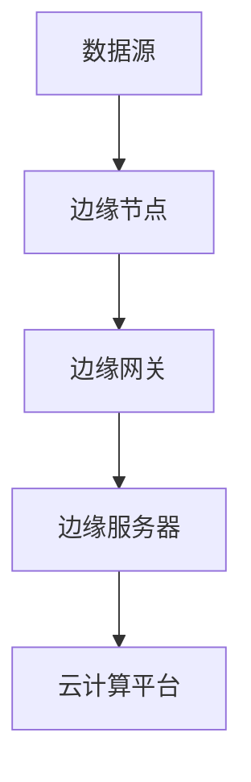
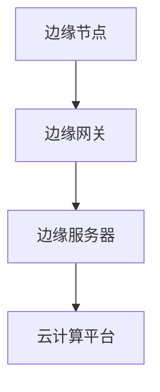

                 

### 文章标题

# 边缘计算在工业物联网中的应用：实现实时数据处理

### 关键词

- 边缘计算
- 工业物联网
- 实时数据处理
- 边缘智能计算
- 系统设计与实现

### 摘要

本文深入探讨了边缘计算在工业物联网中的应用，特别是在实现实时数据处理方面的作用。通过阐述边缘计算与工业物联网的核心概念和联系，本文分析了边缘计算在工业物联网中的具体应用场景，包括实时数据处理、设备监控与管理以及安全防护。文章详细介绍了实时数据处理技术的算法原理和系统设计，并通过实际项目案例展示了边缘计算在工业物联网中的成功应用。此外，本文还对边缘计算的未来发展趋势和面临的挑战进行了展望，为读者提供了宝贵的参考和启示。

---

## 引言与背景介绍

随着信息技术的快速发展，工业物联网（IIoT）已经成为现代工业生产中不可或缺的一部分。工业物联网通过连接各种设备和传感器，实现了生产过程的自动化和智能化，大大提高了生产效率。然而，随着物联网设备的数量和种类的增加，传统的云计算模式在处理大量实时数据时面临着巨大的挑战。这就催生了边缘计算的概念和技术的出现。

### 边缘计算的概念

边缘计算是指将数据处理和存储的能力从传统的数据中心转移到网络边缘，即靠近数据源的地方。这种计算模式能够显著减少数据传输的延迟，提高处理速度，从而满足工业物联网中实时数据处理的需求。

### 边缘计算与传统云计算的区别

与传统云计算相比，边缘计算具有以下几个显著区别：

1. **计算位置**：边缘计算将计算任务从数据中心转移到网络边缘，靠近数据源。
2. **数据处理速度**：边缘计算能够实现毫秒级的响应时间，满足实时数据处理的需求。
3. **带宽和延迟**：由于数据不需要在网络上传输到远程数据中心，边缘计算能够大大减少带宽使用和延迟。
4. **数据隐私和安全**：边缘计算能够降低数据泄露的风险，提高数据安全性。

### 边缘计算在工业物联网中的应用

边缘计算在工业物联网中有着广泛的应用，主要包括以下几个方面：

1. **实时数据处理**：工业物联网设备产生的数据量巨大，边缘计算能够实现数据的实时处理和分析，从而快速响应和调整生产过程。
2. **设备监控与管理**：边缘计算可以对工业设备进行实时监控和管理，提高设备的运行效率和减少故障率。
3. **安全防护**：边缘计算能够对工业物联网设备进行实时安全防护，防止恶意攻击和数据泄露。

通过上述介绍，我们可以看到边缘计算在工业物联网中的重要性。接下来，本文将详细探讨边缘计算与工业物联网的核心概念及其联系，以及边缘计算在工业物联网中的具体应用。

## 边缘计算与工业物联网概述

### 边缘计算在工业物联网中的应用场景

边缘计算在工业物联网中的应用场景非常广泛，主要包括以下几个方面：

1. **实时数据处理**：工业物联网设备产生的数据量巨大，且需要实时处理和分析。边缘计算能够将这些数据在本地进行处理，从而实现快速响应和调整。例如，在智能工厂中，边缘计算可以实时监控生产线的运行状态，快速识别和解决问题，从而提高生产效率。

2. **设备监控与管理**：边缘计算可以对工业设备进行实时监控和管理，提高设备的运行效率和减少故障率。例如，在能源管理系统中，边缘计算可以实时监测电力设备的运行状态，预测潜在故障，并自动进行维护和优化。

3. **安全防护**：边缘计算能够对工业物联网设备进行实时安全防护，防止恶意攻击和数据泄露。例如，在网络安全监控中，边缘计算可以对网络流量进行实时分析，检测和阻止恶意攻击，确保网络安全。

### 边缘计算架构

边缘计算架构主要包括以下几个关键组成部分：

1. **边缘节点**：边缘节点是边缘计算的基本单元，负责数据的采集、处理和存储。边缘节点可以是各种智能设备，如工业传感器、智能网关等。

2. **边缘网关**：边缘网关是连接边缘节点和云端的桥梁，负责数据的传输和协调。边缘网关通常具备数据过滤、压缩和加密等功能。

3. **边缘服务器**：边缘服务器是边缘计算的核心，负责处理和分析来自边缘节点的数据。边缘服务器通常具备强大的计算和存储能力。

4. **云计算平台**：云计算平台是边缘计算的后台支持，负责处理和分析来自边缘服务器的大量数据。云计算平台通常提供数据存储、分析和机器学习等功能。

### 边缘计算平台

边缘计算平台是指用于实现边缘计算功能的软件和硬件基础设施。一个典型的边缘计算平台通常包括以下组成部分：

1. **操作系统**：边缘计算平台需要运行在特定的操作系统上，如Linux、Windows等。操作系统负责管理硬件资源、提供运行环境等。

2. **中间件**：边缘计算平台需要使用中间件来提供各种功能，如数据传输、数据存储、安全防护等。中间件通常基于开源技术，如Apache、Nginx等。

3. **应用程序**：边缘计算平台需要运行各种应用程序，如数据处理程序、监控程序等。这些应用程序可以根据具体需求进行定制。

4. **硬件设备**：边缘计算平台需要使用各种硬件设备，如边缘节点、边缘网关、边缘服务器等。这些硬件设备需要具备高性能、高可靠性和低功耗等特点。

通过上述介绍，我们可以看到边缘计算在工业物联网中的应用场景、架构和平台。在接下来的章节中，本文将详细探讨边缘计算在工业物联网中的具体应用，以及实时数据处理技术的原理和实现。

## 边缘计算在工业物联网中的应用

边缘计算在工业物联网中发挥着重要作用，特别是在实时数据处理方面。这一部分将详细探讨边缘计算在工业物联网中的应用，包括数据采集与处理、实时数据处理技术以及边缘智能计算。

### 数据采集与处理

在工业物联网中，数据采集是边缘计算的基础。数据采集的来源主要包括各种传感器、机器设备以及工业控制系统。这些设备通过边缘节点收集数据，并将数据传输到边缘网关。边缘网关对数据进行分析和预处理，包括数据过滤、去噪、压缩等，以便进行后续处理。



Mermaid流程图展示了数据从数据源到云计算平台的传输过程。在边缘节点，传感器和设备实时采集数据，并通过边缘网关进行初步处理。边缘网关将处理后的数据传输到边缘服务器，边缘服务器再对数据进行分析和存储。最后，数据通过云计算平台进行进一步的处理和分析。

### 实时数据处理技术

实时数据处理是边缘计算在工业物联网中的关键应用之一。实时数据处理技术包括数据采集、预处理、存储、分析和反馈等环节。以下是一个典型的实时数据处理流程：

1. **数据采集**：传感器和设备实时采集数据，并将其发送到边缘节点。

2. **数据预处理**：边缘节点对采集到的数据进行预处理，包括数据过滤、去噪、压缩等。

3. **数据存储**：预处理后的数据被存储在边缘服务器或边缘数据库中。

4. **数据分析**：边缘服务器对存储的数据进行分析，如使用机器学习算法进行预测和分类。

5. **反馈**：分析结果被反馈给传感器和设备，用于调整生产过程或进行维护。

以下是一个简单的实时数据处理算法的伪代码：

```python
def real_time_data_processing(data):
    # 数据过滤
    filtered_data = filter_data(data)
    # 数据压缩
    compressed_data = compress_data(filtered_data)
    # 数据存储
    store_data(compressed_data)
    # 数据分析
    analysis_result = analyze_data(compressed_data)
    # 反馈
    feedback_device(analysis_result)
```

在这个算法中，`filter_data`、`compress_data`、`store_data`、`analyze_data`和`feedback_device`是具体的函数，用于实现数据的过滤、压缩、存储、分析和反馈。这个算法可以用于工业物联网中的各种应用场景，如设备监控、故障检测和生产优化。

### 边缘智能计算

边缘智能计算是边缘计算的重要组成部分，它利用人工智能技术，如机器学习和深度学习，对边缘节点采集的数据进行智能分析。边缘智能计算能够实现数据的实时分析和决策，提高工业物联网的智能化水平。

以下是一个简单的边缘智能计算流程：

1. **数据采集**：传感器和设备实时采集数据，并将其发送到边缘节点。

2. **数据预处理**：边缘节点对采集到的数据进行预处理，如去噪、归一化等。

3. **特征提取**：对预处理后的数据提取特征，如时序特征、空间特征等。

4. **模型训练**：使用机器学习算法对提取的特征进行训练，构建智能模型。

5. **模型部署**：将训练好的模型部署到边缘节点，进行实时数据分析。

6. **决策与反馈**：根据分析结果进行决策，如调整生产参数、发出警报等。

以下是一个简单的边缘智能计算算法的伪代码：

```python
def edge_intelligence_computing(data):
    # 数据预处理
    preprocessed_data = preprocess_data(data)
    # 特征提取
    features = extract_features(preprocessed_data)
    # 模型训练
    model = train_model(features)
    # 模型部署
    deploy_model(model)
    # 实时数据分析
    analysis_result = analyze_data_in_real_time(model)
    # 决策与反馈
    decision = make_decision(analysis_result)
    feedback_device(decision)
```

在这个算法中，`preprocess_data`、`extract_features`、`train_model`、`deploy_model`、`analyze_data_in_real_time`和`make_decision`是具体的函数，用于实现数据的预处理、特征提取、模型训练、模型部署、实时数据分析和决策。这个算法可以用于工业物联网中的各种应用场景，如故障预测、性能优化和智能监控。

通过上述介绍，我们可以看到边缘计算在工业物联网中的应用包括数据采集与处理、实时数据处理技术和边缘智能计算。这些应用不仅提高了工业物联网的效率和智能化水平，也为工业生产带来了巨大的变革。在接下来的章节中，本文将详细讨论边缘计算在工业物联网中的系统设计与实现。

## 系统设计与实现

边缘计算系统在工业物联网中的应用需要高效、可靠且可扩展的设计。本章节将介绍边缘计算系统的总体设计，包括系统架构、功能模块以及性能优化策略。

### 系统总体架构

边缘计算系统通常由边缘节点、边缘网关、边缘服务器和云计算平台组成。以下是一个典型的边缘计算系统架构：



1. **边缘节点**：负责数据的采集和初步处理，通常包括各种传感器、执行器和智能设备。
2. **边缘网关**：作为边缘节点和边缘服务器之间的桥梁，负责数据的传输、过滤和初步分析。
3. **边缘服务器**：负责对边缘网关传输的数据进行进一步的处理和分析，通常具备较高的计算能力和存储容量。
4. **云计算平台**：用于处理和分析来自边缘服务器的海量数据，提供高级的数据分析、机器学习和存储服务。

### 系统功能模块

边缘计算系统通常包括以下几个关键功能模块：

1. **数据采集模块**：负责从各种传感器和设备中收集数据。
2. **数据预处理模块**：对采集到的数据进行清洗、去噪和格式转换。
3. **数据存储模块**：负责存储预处理后的数据，包括边缘服务器和云计算平台上的数据存储。
4. **数据处理模块**：对存储的数据进行进一步处理和分析，如实时数据处理和边缘智能计算。
5. **安全防护模块**：负责保护系统免受恶意攻击和数据泄露。
6. **用户界面模块**：提供用户交互界面，用于监控系统状态和查看分析结果。

### 系统性能优化策略

为了确保边缘计算系统的高效运行，需要采取一系列性能优化策略：

1. **负载均衡**：通过负载均衡技术，将数据处理任务分配到多个边缘服务器上，避免单点瓶颈。
2. **数据压缩**：采用数据压缩技术，减少数据传输的带宽需求和存储空间。
3. **缓存技术**：使用缓存技术，将频繁访问的数据存储在边缘节点或边缘服务器上，减少数据访问延迟。
4. **边缘智能计算**：通过边缘智能计算，将部分计算任务在边缘节点上完成，减少数据传输和处理时间。
5. **资源调度**：根据系统负载情况，动态调整资源分配，确保系统资源的合理利用。

### 硬件选型

硬件选型是边缘计算系统设计的关键环节，需要考虑以下因素：

1. **处理能力**：边缘节点和边缘服务器需要具备足够的计算能力和处理速度，以应对大量的数据处理任务。
2. **存储容量**：边缘服务器和云计算平台需要具备足够的存储容量，以存储海量的历史数据。
3. **网络带宽**：边缘节点和边缘网关需要具备足够的网络带宽，以支持数据的高速传输。
4. **可靠性**：硬件设备需要具备高可靠性和稳定性，以保障系统的连续运行。

### 软件开发环境搭建

软件开发环境搭建是边缘计算系统实现的必备环节，包括以下步骤：

1. **选择操作系统**：根据系统需求，选择适合的操作系统，如Linux、Windows等。
2. **安装开发工具**：安装必要的开发工具，如编译器、调试器等。
3. **配置中间件**：配置边缘计算系统所需的中间件，如Web服务器、数据库等。
4. **编写应用程序**：根据系统需求，编写边缘节点、边缘网关和边缘服务器的应用程序。

### 源代码实现与分析

在边缘计算系统的实现过程中，源代码的编写和分析至关重要。以下是一个简单的边缘计算系统源代码示例：

```python
# 边缘节点程序
def collect_data():
    # 采集传感器数据
    data = sensor.read()
    return data

# 边缘网关程序
def process_data(data):
    # 数据预处理
    filtered_data = filter_data(data)
    return filtered_data

# 边缘服务器程序
def analyze_data(data):
    # 数据分析
    analysis_result = analyze_data_in_real_time(data)
    return analysis_result

# 云计算平台程序
def store_data(data):
    # 数据存储
    store_in_cloud(data)
```

在这个示例中，`sensor.read()`用于采集传感器数据，`filter_data()`用于数据预处理，`analyze_data_in_real_time()`用于实时数据处理，`store_in_cloud()`用于数据存储。这些函数可以根据具体需求进行定制和扩展。

通过上述系统设计与实现，我们可以构建一个高效、可靠且可扩展的边缘计算系统，满足工业物联网中的实时数据处理需求。在接下来的章节中，本文将介绍实际的项目实战案例，展示边缘计算在工业物联网中的具体应用。

## 项目实战案例

### 项目一：边缘计算在智能工厂中的应用

#### 项目背景

随着智能制造的不断发展，工厂生产线上的设备数量和种类不断增加，实时数据的处理需求也日益迫切。为了提高生产效率和降低成本，本项目旨在通过边缘计算技术实现对工厂生产线的实时数据处理和监控。

#### 项目目标

1. **实时数据采集与处理**：采集生产线上的传感器数据，实现数据的实时处理和分析。
2. **设备状态监控**：对生产设备进行实时监控，及时发现设备故障和异常。
3. **生产优化**：基于实时数据，优化生产过程，提高生产效率。

#### 项目实施过程

1. **硬件选型**：选择了具有高性能和低延迟的边缘节点和边缘服务器，确保系统具备足够的计算能力和处理速度。
2. **数据采集与预处理**：在生产线关键位置安装传感器，采集温度、压力、速度等数据。边缘节点负责数据的初步处理，如过滤、去噪和压缩。
3. **边缘计算与云计算集成**：将预处理后的数据传输到边缘服务器，边缘服务器对数据进行进一步处理和分析。同时，将部分分析结果传输到云计算平台，进行高级数据分析和机器学习。
4. **系统部署与测试**：在工厂现场部署边缘计算系统，进行系统测试和优化，确保系统稳定运行。

#### 项目效果评估

通过边缘计算系统的实施，项目达到了以下效果：

1. **数据实时处理能力显著提升**：边缘计算系统实现了生产数据的实时处理和分析，减少了数据处理延迟，提高了生产效率。
2. **设备故障率降低**：实时监控和故障预测功能帮助工厂提前发现设备故障，降低了设备故障率和维修成本。
3. **生产优化**：基于实时数据，对生产过程进行了优化，减少了生产时间，提高了生产效率。

### 项目二：边缘计算在智能农业中的应用

#### 项目背景

智能农业是现代农业发展的趋势，通过物联网技术和边缘计算技术，可以实现农田的精细化管理，提高农业生产效率。本项目旨在通过边缘计算技术，实现对农田环境的实时监测和精准管理。

#### 项目目标

1. **环境数据实时监测**：实时监测农田土壤湿度、温度、光照等环境参数。
2. **灌溉自动化**：根据实时监测数据，实现灌溉自动化，提高灌溉效率。
3. **病虫害预警**：通过实时数据，预测和预警病虫害，降低农业损失。

#### 项目实施过程

1. **硬件选型**：选择了适合农田环境的边缘节点和传感器，确保系统稳定运行。
2. **数据采集与预处理**：在农田关键位置安装传感器，采集土壤湿度、温度、光照等数据。边缘节点负责数据的初步处理，如过滤、去噪和压缩。
3. **边缘计算与云计算集成**：将预处理后的数据传输到边缘服务器，边缘服务器对数据进行进一步处理和分析。同时，将部分分析结果传输到云计算平台，进行高级数据分析和机器学习。
4. **系统部署与测试**：在农田现场部署边缘计算系统，进行系统测试和优化，确保系统稳定运行。

#### 项目效果评估

通过边缘计算系统的实施，项目达到了以下效果：

1. **环境数据实时监测**：实现了农田环境的实时监测，提高了农田管理效率。
2. **灌溉自动化**：根据实时数据，实现了灌溉自动化，降低了灌溉成本，提高了灌溉效率。
3. **病虫害预警**：通过实时数据，实现了病虫害的预测和预警，降低了农业损失。

通过以上两个项目实战案例，我们可以看到边缘计算在工业物联网中的应用效果显著，不仅提高了生产效率，还降低了运营成本。在未来的发展中，边缘计算将在更多的行业和应用中发挥重要作用。

## 总结与展望

边缘计算在工业物联网中的应用具有重要意义，特别是在实时数据处理方面，它显著提升了数据处理效率和系统响应速度。通过本文的详细探讨，我们了解了边缘计算在工业物联网中的核心概念、应用场景、架构设计、实时数据处理技术和实际项目案例。

### 核心成果总结

1. **边缘计算与工业物联网紧密结合**：边缘计算与工业物联网的结合，解决了工业数据量大、实时性要求高的问题，实现了数据在边缘节点的实时处理和分析。
2. **实时数据处理技术**：本文介绍了实时数据处理的关键环节，包括数据采集、预处理、存储、分析和反馈，通过伪代码展示了数据处理流程。
3. **边缘智能计算**：边缘智能计算通过机器学习和深度学习技术，实现了对工业物联网数据的智能分析和决策，提高了系统的智能化水平。
4. **系统设计与实现**：本文详细阐述了边缘计算系统的总体架构、功能模块和性能优化策略，为实际系统的设计和实现提供了参考。
5. **项目实战案例**：通过两个实际项目案例，展示了边缘计算在工业物联网中的应用效果，验证了其可行性和实用性。

### 未来发展趋势与展望

边缘计算在工业物联网中的应用前景广阔，未来发展趋势包括：

1. **技术进步**：随着硬件技术的不断发展，边缘节点和边缘服务器的计算能力和存储容量将不断提高，进一步优化边缘计算性能。
2. **标准化与开源**：边缘计算技术的标准化和开源将促进其广泛应用，降低开发门槛，推动产业生态的发展。
3. **智能化与自动化**：边缘智能计算将继续深化，结合人工智能和大数据技术，实现更智能、更自动化的工业物联网系统。
4. **跨界融合**：边缘计算将与5G、物联网、云计算等新兴技术深度融合，推动更多行业实现数字化转型。
5. **安全与隐私保护**：随着边缘计算应用场景的扩展，数据安全和隐私保护将面临新的挑战，需要采取更加有效的措施来保障系统的安全性。

### 面临的挑战与解决方案

边缘计算在工业物联网中面临的主要挑战包括：

1. **数据隐私与安全**：边缘计算涉及到大量敏感数据，需要采取有效的安全措施，如数据加密、访问控制等，保障数据安全和隐私。
2. **系统可靠性与稳定性**：边缘计算系统需要在各种复杂环境下稳定运行，需要提高系统的可靠性和容错能力。
3. **资源优化与调度**：边缘计算资源有限，需要优化资源分配和调度策略，提高系统性能和效率。

针对这些挑战，可以采取以下解决方案：

1. **安全措施**：采用端到端的数据加密、访问控制和身份验证等安全措施，确保数据安全和隐私。
2. **冗余设计与容错机制**：通过冗余设计和容错机制，提高系统的可靠性和稳定性。
3. **智能调度算法**：采用智能调度算法，动态调整资源分配和任务调度，提高系统性能和效率。

通过不断的技术创新和优化，边缘计算在工业物联网中的应用将更加广泛和深入，为工业生产带来更高的效率、智能化和安全性。

### 最佳实践 Tips

1. **选择合适的硬件平台**：根据实际应用需求，选择适合的边缘节点和边缘服务器，确保系统具备足够的计算能力和存储容量。
2. **优化数据处理流程**：合理设计数据处理流程，提高数据处理效率和系统响应速度。
3. **确保数据安全**：采取有效的数据安全和隐私保护措施，防止数据泄露和恶意攻击。
4. **持续优化与升级**：定期对系统进行优化和升级，确保系统始终处于最佳运行状态。

通过以上最佳实践，可以有效提升边缘计算在工业物联网中的应用效果。

### 小结

边缘计算在工业物联网中的应用具有重要意义，它实现了数据的实时处理和智能分析，提高了工业生产的效率、智能化水平和安全性。随着技术的不断进步和应用的深入，边缘计算将在更多行业和领域中发挥关键作用，推动工业物联网的快速发展。

### 注意事项

1. **确保系统稳定性**：在实际应用中，需要确保边缘计算系统的稳定性和可靠性，避免系统故障对生产造成影响。
2. **数据安全和隐私保护**：高度重视数据安全和隐私保护，采取有效的安全措施，防止数据泄露和恶意攻击。
3. **持续优化与升级**：定期对边缘计算系统进行优化和升级，确保系统始终具备最新的技术和功能。

### 拓展阅读

1. **《边缘计算：原理、应用与实现》**：详细介绍了边缘计算的基本原理、应用场景和实现方法，适合边缘计算初学者和专业人士阅读。
2. **《工业物联网：技术、应用与实践》**：深入探讨了工业物联网的技术原理、应用案例和实践经验，对工业物联网的开发者和管理者具有很高的参考价值。

通过上述拓展阅读，读者可以进一步了解边缘计算和工业物联网的相关知识，提升自己在相关领域的专业素养和实践能力。

