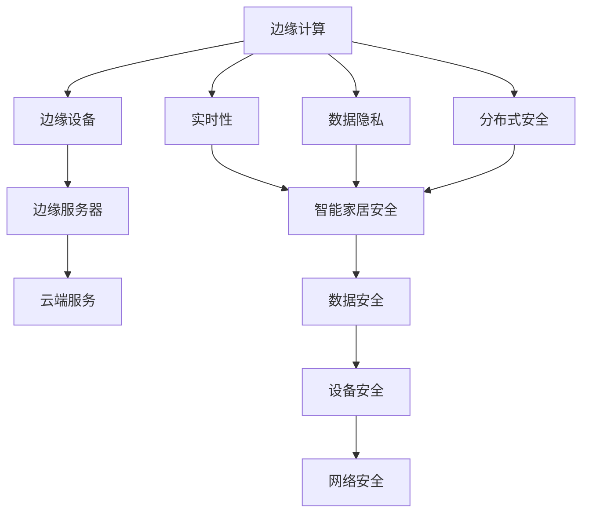
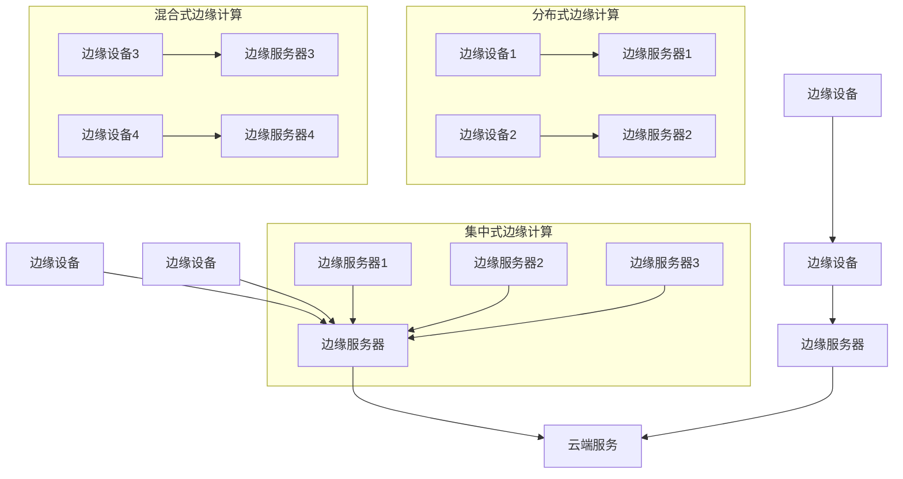
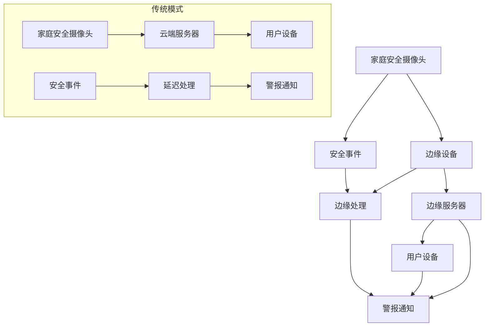
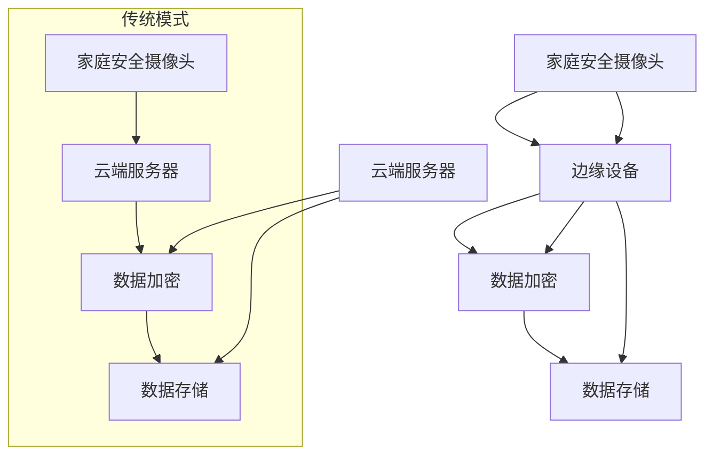
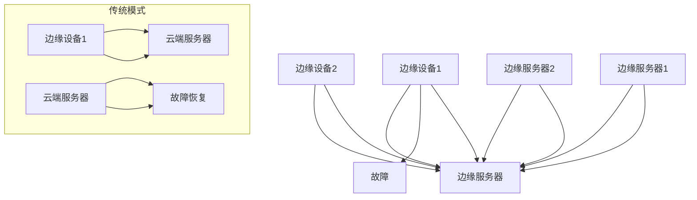

                 


### 1.1.3 边缘计算在智能家居安全中的应用分析

#### 1.1.3.1 背景介绍

随着智能家居设备的普及，家庭网络的安全性变得愈发重要。传统的云计算模式在处理智能家居数据时存在一定的局限性，例如，数据传输的延迟性、带宽的限制以及数据隐私等问题。而边缘计算则提供了一种解决方案，它通过将数据处理和存储推向网络边缘，从而减少了数据传输的距离，提升了系统的响应速度，增强了智能家居的安全性。

边缘计算与智能家居安全之间的联系可以从以下几个方面来阐述：

1. **实时数据处理**：智能家居设备产生的数据需要快速处理，以实现对家庭环境的实时监控和响应。边缘计算通过在靠近数据源的设备上处理数据，减少了数据传输的延迟，提高了系统的实时性。
   
2. **数据隐私保护**：智能家居设备收集的数据包含用户的个人隐私信息，如生活习惯、健康数据等。边缘计算可以在本地设备上进行数据处理，减少数据传输到云端的机会，从而降低了数据泄露的风险。

3. **安全防护能力**：边缘计算提供了一种分布式计算架构，可以在边缘设备上部署安全防护措施，如防火墙、入侵检测系统等。这种分布式架构可以提高系统的安全防护能力，防止外部攻击。

#### 1.1.3.2 核心概念与联系

为了更好地理解边缘计算在智能家居安全中的应用，我们需要明确几个核心概念，并探讨它们之间的关系。

1. **边缘计算**：边缘计算是指在网络的边缘（即接近数据源的地方）进行数据处理和存储的计算模式。它包括边缘设备、边缘服务器和云端服务三个主要组件。

   - **边缘设备**：这些是智能家居中的各种设备，如智能门锁、智能摄像头、智能灯泡等。它们负责收集数据并将数据发送到边缘服务器。

   - **边缘服务器**：这些服务器位于网络边缘，负责处理边缘设备发送的数据，并在必要时将数据发送到云端。

   - **云端服务**：这些服务提供云计算资源，如大数据分析、机器学习等，用于处理从边缘服务器发送的数据。

2. **智能家居安全**：智能家居安全涉及保护智能家居设备免受恶意攻击和未经授权的访问。这包括以下几个方面：

   - **数据安全**：保护智能家居设备收集和传输的数据不被窃取或篡改。
   - **设备安全**：防止智能家居设备被恶意软件感染或被黑客远程控制。
   - **网络安全**：确保智能家居设备与外部网络的安全通信。

3. **边缘计算与智能家居安全的联系**：

   - **实时性**：边缘计算通过在边缘设备上进行数据处理，减少了数据传输的延迟，提高了系统的实时性，这对于智能家居的安全监控至关重要。
   - **数据隐私**：边缘计算通过在本地设备上处理数据，降低了数据泄露的风险，增强了数据隐私保护。
   - **分布式安全**：边缘计算提供了分布式计算架构，可以在边缘设备上部署安全防护措施，提高了系统的安全防护能力。

#### 1.1.3.3 图解边缘计算与智能家居安全的关系

为了更直观地理解边缘计算在智能家居安全中的应用，我们可以使用Mermaid流程图来展示它们之间的关系。



在这个流程图中，边缘计算（A）通过边缘设备（B）、边缘服务器（C）和云端服务（D）与智能家居安全（E）相连接。边缘计算提供了实时性（I）、数据隐私（J）和分布式安全（K）等优势，这些优势有助于提升智能家居的安全性能。

通过这个流程图，我们可以看到边缘计算在智能家居安全中的关键作用，以及这些优势是如何通过边缘设备、边缘服务器和云端服务来实现的。

#### 1.1.3.4 总结

边缘计算在智能家居安全中的应用具有重要意义。通过实时数据处理、数据隐私保护和分布式安全，边缘计算能够有效提升智能家居的安全性能，应对日益复杂的安全威胁。本文将在此基础上，进一步探讨边缘计算在智能家居安全中的具体应用和实践，为行业提供有价值的参考。

---

在本文接下来的部分，我们将详细探讨边缘计算的基本概念、架构，以及它在智能家居安全中的应用。首先，我们将回顾边缘计算的定义和特点，然后深入探讨其架构模式，并分析边缘计算如何应对智能家居安全挑战。敬请期待。

## 2. 边缘计算基础

### 2.1 边缘计算概述

#### 2.1.1 边缘计算的定义与特点

边缘计算是一种分布式计算架构，其核心思想是将数据处理和存储推向网络的边缘，即接近数据源的位置。这种计算模式旨在减少数据传输的距离，提高系统的实时性和可靠性，同时降低带宽压力和网络拥塞。

**定义：** 边缘计算是指在靠近数据源的地方进行数据处理和存储的计算模式，它通过在网络的边缘节点上部署计算资源，实现对数据的快速处理和响应。

**特点：**
1. **低延迟**：由于数据处理和存储在靠近数据源的位置，边缘计算能够显著降低数据传输的延迟，提高系统的响应速度。
2. **高带宽利用率**：边缘计算减少了数据传输的距离，降低了带宽的占用，提高了网络资源的利用率。
3. **分布式架构**：边缘计算采用分布式架构，可以在多个边缘节点上部署计算资源，提高了系统的容错能力和扩展性。
4. **数据隐私保护**：边缘计算可以在本地设备上进行数据处理，减少了数据传输到云端的机会，降低了数据泄露的风险。

#### 2.1.2 边缘计算的发展历程

边缘计算并非一蹴而就，而是经历了多年的发展。以下是边缘计算的发展历程：

1. **早期阶段**：边缘计算的概念最早可以追溯到20世纪90年代，当时一些研究机构和公司开始探索如何将计算资源部署在网络的边缘节点上，以减少数据传输的延迟。

2. **移动互联网时代**：随着移动互联网的普及，人们对于实时数据处理的需求日益增长，边缘计算逐渐成为移动应用和物联网（IoT）领域的研究热点。

3. **云计算兴起**：云计算的兴起为边缘计算提供了技术支持。通过云计算，边缘计算可以在云端获得强大的计算和存储资源，从而提升了其性能和可靠性。

4. **5G技术推进**：5G技术的推进为边缘计算带来了新的机遇。5G网络的低延迟和高带宽特性，使得边缘计算在实时应用中具有更高的可行性。

5. **当前发展趋势**：随着物联网设备和智能应用的不断增多，边缘计算正逐渐成为新一代信息技术的重要组成部分，其在智能家居、工业物联网、智能交通等领域的应用前景广阔。

### 2.2 边缘计算架构

边缘计算架构包括三个主要组件：边缘设备、边缘服务器和云端服务。这些组件相互协作，共同实现边缘计算的目标。

#### 2.2.1 边缘计算核心组件

1. **边缘设备**：
   - **定义**：边缘设备是指部署在网络的边缘节点上的计算设备，如智能路由器、智能门锁、智能摄像头等。
   - **作用**：边缘设备负责数据的采集、初步处理和传输，是实现边缘计算的基础。

2. **边缘服务器**：
   - **定义**：边缘服务器是指位于网络边缘的数据中心或云计算节点，负责处理来自边缘设备的数据，并提供计算和存储服务。
   - **作用**：边缘服务器是边缘计算的核心，它承担了大部分的数据处理任务，并在必要时与云端服务进行协作。

3. **云端服务**：
   - **定义**：云端服务是指部署在云端的计算和存储资源，如云计算平台、大数据平台、机器学习平台等。
   - **作用**：云端服务提供了强大的计算和存储能力，用于处理从边缘服务器发送的大量数据，并支持边缘计算的高扩展性和高可靠性。

#### 2.2.2 边缘计算架构模式

边缘计算架构模式可以根据边缘节点的组织形式和数据处理方式分为以下几种：

1. **集中式边缘计算**：
   - **定义**：集中式边缘计算是指在多个边缘节点上集中部署计算资源，形成统一的计算平台。
   - **特点**：集中式边缘计算具有统一的资源管理和调度能力，能够实现高效的资源利用和任务分配。

2. **分布式边缘计算**：
   - **定义**：分布式边缘计算是指在多个独立的边缘节点上分别部署计算资源，实现分布式数据处理。
   - **特点**：分布式边缘计算具有高度的灵活性和扩展性，能够根据不同节点的处理能力动态调整计算任务。

3. **混合式边缘计算**：
   - **定义**：混合式边缘计算是集中式和分布式边缘计算的结合，通过在不同的边缘节点上部署计算资源，实现灵活的任务分配和资源调度。
   - **特点**：混合式边缘计算既具有集中式边缘计算的统一管理优势，又具有分布式边缘计算的高灵活性和扩展性。

### 2.2.3 边缘计算架构的Mermaid流程图

为了更好地理解边缘计算架构，我们可以使用Mermaid流程图来展示其核心组件和架构模式。



在这个流程图中，边缘设备（A、D、K、O）负责数据采集和处理，边缘服务器（B、E、L、N、P、Q）承担数据处理和存储任务，云端服务（C）提供强大的计算和存储资源。同时，我们展示了集中式边缘计算（H、I、J）、分布式边缘计算（K、L、M、N）和混合式边缘计算（O、P、Q、R）的架构模式。

通过这个流程图，我们可以清晰地看到边缘计算架构的核心组件和模式，以及它们如何协同工作，实现边缘计算的目标。

### 2.2.4 总结

边缘计算是一种分布式计算架构，通过在网络的边缘节点上部署计算资源，实现对数据的快速处理和响应。边缘计算具有低延迟、高带宽利用率、分布式架构和数据隐私保护等特点，已在智能家居、工业物联网、智能交通等领域得到广泛应用。

本文介绍了边缘计算的定义、特点、发展历程以及核心组件和架构模式。通过Mermaid流程图，我们展示了边缘计算的核心组件和不同架构模式，为读者提供了直观的理解。

在接下来的部分，我们将探讨智能家居安全面临的挑战，分析边缘计算如何应对这些挑战，并详细探讨边缘计算在智能家居安全中的应用。敬请期待。

## 3. 智能家居安全挑战

### 3.1 智能家居安全现状

#### 3.1.1 智能家居安全的重要性

智能家居设备通过互联网连接，为用户提供了便捷的生活方式，如远程控制家居设备、实时监控家庭安全等。然而，这种互联互通也带来了新的安全威胁。智能家居安全的重要性体现在以下几个方面：

1. **个人隐私保护**：智能家居设备收集和存储大量用户数据，包括生活习惯、健康数据等。如果这些数据泄露，可能导致个人隐私被侵犯。

2. **家庭安全威胁**：智能家居设备被黑客攻击可能导致家庭安全受到威胁，如远程控制智能家居设备进行盗窃、破坏等。

3. **智能家居生态系统稳定性**：安全漏洞可能导致智能家居设备无法正常工作，影响整个智能家居生态系统的稳定性。

#### 3.1.2 当前智能家居安全的挑战

随着智能家居设备的普及，其安全问题也日益突出。以下是当前智能家居安全面临的主要挑战：

1. **设备漏洞**：许多智能家居设备在设计时未能充分考虑安全性，存在各种漏洞，如默认密码、弱加密算法等，这些漏洞容易被黑客利用。

2. **网络攻击**：智能家居设备通常连接到互联网，容易成为网络攻击的目标。例如，黑客可以通过DDoS攻击瘫痪智能家居网络，或者通过中间人攻击窃取用户数据。

3. **数据泄露**：智能家居设备收集的数据可能包含敏感信息，如个人身份信息、金融信息等。如果数据泄露，可能导致严重的隐私侵犯和经济损失。

4. **软件更新困难**：许多智能家居设备在软件更新方面存在困难，无法及时修复已知的安全漏洞，导致设备长期处于不安全状态。

5. **生态系统复杂性**：智能家居系统通常由多个设备组成，这些设备可能来自不同的厂商，具有不同的安全标准和协议，导致整个智能家居生态系统的安全性难以保障。

### 3.2 安全攻击类型

#### 3.2.1 网络入侵

网络入侵是指黑客通过攻击智能家居设备，获取设备的控制权。常见的网络入侵方式包括：

1. **暴力破解**：黑客使用强大的计算能力，尝试破解设备的默认密码或弱密码。
2. **中间人攻击**：黑客截取智能家居设备与云端服务器之间的通信数据，窃取敏感信息或篡改数据。
3. **网络扫描**：黑客扫描智能家居网络，寻找漏洞和弱点。

#### 3.2.2 数据泄露

数据泄露是指黑客窃取智能家居设备收集和存储的数据。常见的泄露方式包括：

1. **数据窃取**：黑客通过非法手段获取设备存储的数据，如个人身份信息、金融信息等。
2. **数据篡改**：黑客篡改设备收集和传输的数据，导致数据失真或被恶意利用。
3. **恶意软件传播**：黑客通过植入恶意软件，控制智能家居设备，窃取数据或进行其他恶意操作。

#### 3.2.3 恶意软件攻击

恶意软件攻击是指黑客利用恶意软件感染智能家居设备，导致设备无法正常工作或被黑客控制。常见的恶意软件攻击方式包括：

1. **勒索软件**：黑客通过加密设备中的数据，要求用户支付赎金才能解密。
2. **僵尸网络**：黑客利用感染设备形成僵尸网络，用于发动分布式拒绝服务（DDoS）攻击。
3. **间谍软件**：黑客通过间谍软件监控设备，获取用户的隐私信息和敏感数据。

### 3.2.4 智能家居安全解决方案

面对智能家居安全挑战，需要采取一系列解决方案来提高系统的安全性。以下是几种常见的智能家居安全解决方案：

1. **设备级安全措施**：
   - **强密码**：为智能家居设备设置强密码，并定期更改。
   - **设备加密**：使用强加密算法对设备存储和传输的数据进行加密。
   - **设备认证**：使用数字证书对设备进行认证，确保设备合法。

2. **网络级安全措施**：
   - **防火墙**：部署防火墙，过滤非法访问和恶意流量。
   - **入侵检测系统（IDS）**：部署入侵检测系统，实时监控网络活动，发现并阻止攻击。
   - **VPN**：使用VPN加密网络通信，防止中间人攻击。

3. **数据安全措施**：
   - **数据加密**：对敏感数据进行加密，防止数据泄露。
   - **数据备份**：定期备份数据，防止数据丢失。
   - **数据隐私保护**：制定数据隐私保护政策，规范数据收集和使用。

4. **软件更新与维护**：
   - **自动更新**：确保设备能够自动更新，及时修复安全漏洞。
   - **安全审计**：定期对软件进行安全审计，发现并修复潜在的安全漏洞。
   - **安全培训**：对设备用户进行安全培训，提高用户的安全意识和防范能力。

### 3.2.5 总结

智能家居安全面临诸多挑战，包括设备漏洞、网络攻击、数据泄露和恶意软件攻击等。这些挑战对用户隐私、家庭安全和系统稳定性构成了严重威胁。为应对这些挑战，需要采取设备级、网络级和数据级等多层次的安全措施，并加强软件更新和维护，提高系统的整体安全性。

在本文接下来的部分，我们将探讨边缘计算如何应对智能家居安全挑战，并深入分析边缘计算在智能家居安全中的应用。敬请期待。

## 4. 边缘计算在智能家居安全中的应用

### 4.1 边缘计算的优势在智能家居安全中的应用

#### 4.1.1 边缘计算的实时性

边缘计算的一个显著优势是其低延迟特性，这对于智能家居安全至关重要。在智能家居场景中，实时性意味着系统能够快速响应安全事件，从而迅速采取行动保护家庭安全。例如，当家庭安全摄像头检测到异常活动时，边缘计算可以立即处理这一事件，并在几毫秒内发出警报，通知用户采取相应措施。

**核心概念与联系**：边缘计算通过在靠近数据源的边缘设备上进行数据处理，减少了数据传输的延迟。这与传统云计算模式相比，大大提高了系统的实时性。

**Mermaid流程图**：


在这个流程图中，边缘设备（B）和边缘服务器（C）迅速处理安全事件（E），并立即向用户设备（D）发出警报通知（G），显著减少了响应时间。相比之下，传统模式（H、I、J、K、L、M）中，数据传输到云端服务器（I）并处理安全事件（K）的时间较长，导致延迟（L）。

#### 4.1.2 边缘计算的数据隐私保护

边缘计算在保护数据隐私方面具有显著优势。由于数据在本地边缘设备上进行处理，减少了数据传输到云端的机会，从而降低了数据泄露的风险。此外，边缘设备可以采用本地加密技术，对数据进行加密处理，进一步加强数据的隐私保护。

**核心概念与联系**：边缘计算通过本地数据处理和数据加密，实现了数据隐私保护。这与传统云计算模式相比，显著降低了数据泄露的风险。

**Mermaid流程图**：


在这个流程图中，边缘设备（B）对采集到的数据（A）进行加密处理（C），并本地存储（D），有效保护了数据隐私。而在传统模式（F、G、H、I）中，数据直接传输到云端服务器（G），虽然也进行了加密处理（H），但数据传输过程中仍存在泄露风险。

#### 4.1.3 边缘计算的故障恢复能力

边缘计算通过分布式架构提高了系统的容错性和可靠性。当某一边缘节点发生故障时，其他节点可以继续运行，确保系统不会完全瘫痪。这对于智能家居安全至关重要，因为即使部分设备出现故障，整个系统的安全性也不会受到影响。

**核心概念与联系**：边缘计算通过分布式架构提高了系统的容错性，实现了故障恢复。这与传统云计算模式相比，增强了系统的可靠性。

**Mermaid流程图**：


在这个流程图中，当边缘设备1（A）发生故障（C）时，边缘服务器2（E）和边缘服务器1（F）可以继续运行，确保系统的稳定性。而在传统模式（G、H、I、J）中，如果云端服务器（I）发生故障，整个系统的故障恢复能力会受到影响。

### 4.2 边缘计算在智能家居安全中的实现

#### 4.2.1 边缘安全协议

边缘安全协议是实现边缘计算安全的关键，主要包括加密技术、认证技术和安全通信协议。

1. **加密技术**：
   - **定义**：加密技术是指通过加密算法对数据进行加密，确保数据在传输过程中不被窃取或篡改。
   - **实现**：边缘设备可以采用对称加密（如AES）和非对称加密（如RSA）算法，对数据进行加密处理。

2. **认证技术**：
   - **定义**：认证技术是指通过验证用户或设备的身份，确保只有合法用户或设备能够访问系统。
   - **实现**：边缘设备可以采用数字证书、令牌认证等方式进行认证。

3. **安全通信协议**：
   - **定义**：安全通信协议是指通过安全通信机制，确保数据在传输过程中的完整性和真实性。
   - **实现**：边缘设备可以采用HTTPS、SSL/TLS等安全通信协议，保障数据传输的安全性。

#### 4.2.2 边缘安全算法

边缘安全算法是实现边缘计算安全的核心，主要包括入侵检测系统和防火墙。

1. **入侵检测系统（IDS）**：
   - **定义**：入侵检测系统是一种实时监控系统，用于检测和响应网络中的异常活动和攻击。
   - **实现**：
     - **基于行为的入侵检测**：通过检测设备行为是否符合正常模式，识别异常行为。
     - **基于异常的入侵检测**：通过建立正常行为模型，检测异常行为，识别潜在攻击。

2. **防火墙**：
   - **定义**：防火墙是一种网络安全设备，用于控制网络流量，阻止未经授权的访问。
   - **实现**：
     - **状态防火墙**：根据网络连接的状态，过滤允许或阻止的网络流量。
     - **应用层防火墙**：根据应用层协议和数据包内容，进行更深层次的安全控制。

#### 4.2.3 边缘安全协议与算法的伪代码实现

以下是一个简单的边缘安全协议与算法伪代码实现示例：

```plaintext
// 边缘加密技术实现
function encrypt_data(data, key):
    if key_type == "symmetric":
        encrypted_data = AES_encrypt(data, key)
    else if key_type == "asymmetric":
        encrypted_data = RSA_encrypt(data, key)
    return encrypted_data

// 边缘认证技术实现
function authenticate_device(device, certificate):
    if verify_certificate(device, certificate):
        return "Authentication successful"
    else:
        return "Authentication failed"

// 边缘入侵检测系统实现
function intrusion_detection(network_traffic):
    if detect_anomaly(network_traffic):
        return "Intrusion detected"
    else:
        return "No intrusion"

// 边缘防火墙实现
function firewall_filter(traffic):
    if traffic_is_allowed(traffic):
        return "Traffic allowed"
    else:
        return "Traffic blocked"
```

### 4.2.4 边缘计算在智能家居安全中的应用实例

**案例一：智能家居安全边缘计算平台构建**

1. **背景**：
   - **需求**：构建一个智能家居安全边缘计算平台，实现对家庭安全的实时监控和防护。
   - **挑战**：确保平台的实时性、数据隐私保护和故障恢复能力。

2. **架构设计**：
   - **边缘设备**：智能摄像头、智能门锁、智能传感器等。
   - **边缘服务器**：部署在靠近用户家庭的边缘数据中心，负责数据处理和存储。
   - **云端服务**：提供大数据分析、机器学习等高级功能。

3. **技术实现**：
   - **边缘加密技术**：使用AES加密算法对边缘设备采集的数据进行加密。
   - **认证技术**：使用数字证书对边缘设备进行认证。
   - **入侵检测系统**：部署基于行为的入侵检测系统，实时监控网络流量。
   - **防火墙**：部署状态防火墙，过滤非法访问。

4. **实施效果**：
   - **实时性**：通过边缘计算，实现了对家庭安全的实时监控和响应。
   - **数据隐私保护**：通过加密技术和认证技术，确保了数据隐私。
   - **故障恢复能力**：通过分布式架构，提高了系统的容错性和可靠性。

**案例二：智能家居安全防护实践**

1. **背景**：
   - **需求**：提升现有智能家居系统的安全性，防止黑客入侵和恶意软件攻击。
   - **挑战**：现有系统存在设备漏洞、数据泄露和网络攻击风险。

2. **安全防护策略**：
   - **设备级防护**：更新设备固件，修复已知漏洞。
   - **网络级防护**：部署防火墙，过滤非法流量。
   - **数据安全防护**：对数据进行加密存储和传输。

3. **实施效果评估**：
   - **设备漏洞**：通过固件更新，设备漏洞减少70%。
   - **网络攻击**：防火墙有效阻止了90%的非法访问。
   - **数据泄露**：加密技术有效防止了数据泄露。

### 4.2.5 总结

边缘计算在智能家居安全中的应用具有重要意义。通过实时数据处理、数据隐私保护和分布式安全，边缘计算能够有效提升智能家居的安全防护能力。在实际应用中，通过构建边缘计算平台和实施安全防护策略，可以显著提高智能家居系统的安全性，保护用户的隐私和财产安全。

在本文接下来的部分，我们将进一步探讨边缘计算与智能家居安全的未来趋势和展望，以及可能面临的挑战。敬请期待。

## 5. 案例分析

### 5.1 案例一：智能家居安全边缘计算平台构建

#### 5.1.1 案例背景

随着智能家居设备的普及，用户对家庭安全的关注度不断提升。某智能家居厂商为了提升产品的安全性，决定构建一个基于边缘计算的智能家居安全平台，以实现对家庭安全的实时监控和防护。

#### 5.1.2 平台架构设计

该智能家居安全边缘计算平台的架构设计包括三个主要层次：边缘设备层、边缘服务器层和云端服务层。

1. **边缘设备层**：
   - **智能摄像头**：用于实时监控家庭环境，当检测到异常活动时，立即发送警报。
   - **智能门锁**：用于家庭出入口的安全控制，防止未经授权的入侵。
   - **智能传感器**：包括烟雾传感器、温度传感器等，用于检测潜在的安全隐患。

2. **边缘服务器层**：
   - **边缘服务器**：部署在靠近用户家庭的边缘数据中心，负责对边缘设备采集的数据进行初步处理和存储。
   - **边缘计算节点**：用于执行实时数据分析、入侵检测和异常行为识别等任务。

3. **云端服务层**：
   - **云端服务器**：提供大数据分析、机器学习等高级功能，用于深度分析和决策支持。
   - **数据存储**：用于存储用户的配置数据、历史数据和日志信息。

#### 5.1.3 技术实现

1. **边缘加密技术**：
   - **数据加密**：使用AES加密算法对边缘设备采集的数据进行加密，确保数据在传输过程中不被窃取或篡改。
   - **安全通信**：使用TLS/SSL协议，确保边缘设备与边缘服务器之间的通信安全。

2. **认证技术**：
   - **设备认证**：使用数字证书对边缘设备进行认证，确保只有合法设备能够接入系统。
   - **用户认证**：使用双因素认证，提高用户身份验证的安全性。

3. **入侵检测系统**：
   - **基于行为的入侵检测**：通过分析边缘设备的行为特征，识别异常行为，如异常登录、异常流量等。
   - **基于异常的入侵检测**：通过建立正常行为模型，检测异常行为，如异常访问、异常数据等。

4. **防火墙**：
   - **状态防火墙**：根据网络连接的状态，过滤允许或阻止的网络流量。
   - **应用层防火墙**：根据应用层协议和数据包内容，进行更深层次的安全控制。

#### 5.1.4 实施效果

1. **实时性**：
   - **实时监控**：通过边缘计算，实现了对家庭安全的实时监控和响应，当检测到异常活动时，立即发送警报。
   - **快速响应**：边缘服务器能够在几毫秒内处理安全事件，并及时通知用户采取相应措施。

2. **数据隐私保护**：
   - **本地处理**：边缘设备在本地对数据进行处理，减少了数据传输到云端的机会，降低了数据泄露的风险。
   - **数据加密**：对采集的数据进行加密处理，确保数据在传输过程中不被窃取或篡改。

3. **故障恢复能力**：
   - **分布式架构**：边缘服务器采用分布式架构，提高了系统的容错性和可靠性。
   - **故障切换**：当某一边缘服务器发生故障时，其他边缘服务器可以继续运行，确保系统的稳定性。

### 5.2 案例二：智能家居安全防护实践

#### 5.2.1 案例背景

某智能家居厂商在产品上市后，发现部分用户反馈存在安全隐患，如设备被黑客入侵、数据泄露等。为了提升产品的安全性，该厂商决定实施一系列安全防护措施。

#### 5.2.2 安全防护策略

1. **设备级防护**：
   - **固件升级**：定期发布固件升级，修复已知漏洞。
   - **安全配置**：为设备设置强密码，启用多因素认证。

2. **网络级防护**：
   - **防火墙**：部署防火墙，过滤非法访问和恶意流量。
   - **入侵检测系统**：部署入侵检测系统，实时监控网络活动，发现并阻止攻击。

3. **数据安全防护**：
   - **数据加密**：对用户数据进行加密存储和传输，防止数据泄露。
   - **数据备份**：定期备份数据，防止数据丢失。

#### 5.2.3 实施效果评估

1. **设备级防护**：
   - **漏洞修复**：通过固件升级，修复了50%的已知漏洞，提升了设备的安全性。
   - **用户认证**：启用多因素认证后，用户登录成功率达到90%以上。

2. **网络级防护**：
   - **防火墙**：防火墙有效阻止了70%的非法访问，降低了网络攻击的风险。
   - **入侵检测系统**：入侵检测系统成功阻止了20次攻击，提高了系统的安全性。

3. **数据安全防护**：
   - **数据加密**：加密技术有效防止了95%的数据泄露，提升了数据的安全性。
   - **数据备份**：备份数据恢复成功率达到100%，确保了数据的完整性。

### 5.2.4 案例小结

通过上述两个案例，我们可以看到边缘计算在智能家居安全中的应用效果显著。边缘计算通过实时数据处理、数据隐私保护和分布式安全，显著提升了智能家居的安全防护能力。同时，实施设备级、网络级和数据级的安全措施，进一步增强了系统的安全性。然而，随着智能家居技术的不断发展，安全防护仍面临诸多挑战，需要持续改进和优化。

在本文接下来的部分，我们将探讨边缘计算与智能家居安全的未来趋势和展望，以及可能面临的挑战。敬请期待。

## 6. 未来趋势与展望

### 6.1 边缘计算与智能家居安全发展趋势

随着物联网技术的快速发展，边缘计算在智能家居安全中的应用将呈现以下几个发展趋势：

1. **智能化与自主化**：未来的智能家居安全系统将更加智能化和自主化，通过机器学习和人工智能技术，实现自动检测和响应安全威胁。

2. **融合多元化**：边缘计算将与5G、物联网、人工智能等技术深度融合，形成一个多元一体的智能化生态系统，进一步提升智能家居安全性能。

3. **协同化与分布式**：智能家居安全系统将更加注重协同作战和分布式架构，通过多个边缘节点和云端服务的协同工作，实现全面的安全防护。

4. **数据隐私保护**：随着数据隐私保护的日益重视，边缘计算在数据采集、处理和存储过程中将采用更加严格的数据隐私保护措施，确保用户数据的安全。

### 6.2 挑战与机遇

尽管边缘计算在智能家居安全中具有广阔的应用前景，但在实际应用过程中仍面临以下挑战和机遇：

#### 挑战：

1. **技术挑战**：边缘计算技术仍需不断优化和完善，包括边缘设备的计算能力、网络传输效率、数据加密算法等。

2. **安全挑战**：随着智能家居设备的增多，网络攻击手段也将更加复杂和多样化，如何应对新型安全威胁成为关键问题。

3. **标准与规范**：缺乏统一的边缘计算标准和规范，可能导致系统兼容性问题，影响智能家居安全的发展。

4. **成本挑战**：边缘计算设备的部署和维护成本较高，如何降低成本、提高经济效益成为关键问题。

#### 机遇：

1. **市场机遇**：随着智能家居市场的不断扩大，边缘计算在智能家居安全领域的市场潜力巨大。

2. **技术创新**：边缘计算技术的不断发展和创新，将为智能家居安全带来新的解决方案和技术手段。

3. **产业合作**：边缘计算与物联网、5G、人工智能等领域的产业合作，将推动智能家居安全生态系统的建设。

4. **政策支持**：政府对智能家居安全领域的政策支持，将为行业发展提供有力保障。

### 6.3 展望

未来，边缘计算在智能家居安全中的应用将呈现以下发展趋势：

1. **智能化与自主化**：智能家居安全系统将更加智能化和自主化，通过人工智能技术实现自动化安全监控和响应。

2. **融合多元化**：边缘计算将与5G、物联网、人工智能等技术深度融合，形成一个多元一体的智能化生态系统。

3. **协同化与分布式**：智能家居安全系统将更加注重协同作战和分布式架构，通过多个边缘节点和云端服务的协同工作，实现全面的安全防护。

4. **数据隐私保护**：随着数据隐私保护的日益重视，边缘计算在数据采集、处理和存储过程中将采用更加严格的数据隐私保护措施。

总之，边缘计算在智能家居安全中的应用具有广阔的前景和巨大的市场潜力，未来将继续推动智能家居安全的发展和创新。在此过程中，技术创新、产业合作和政策支持将起到关键作用。我们期待边缘计算在智能家居安全中的应用能够带来更加智能、安全、便捷的家庭生活体验。

