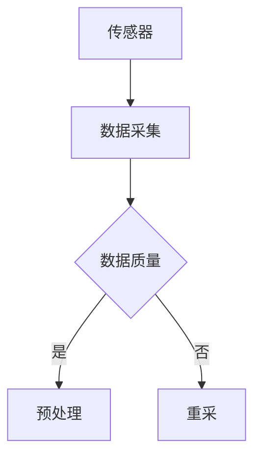
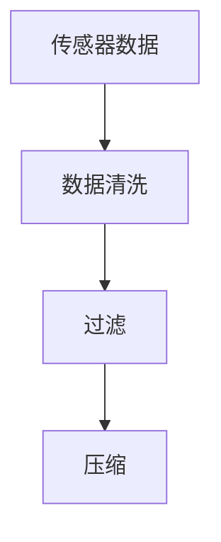
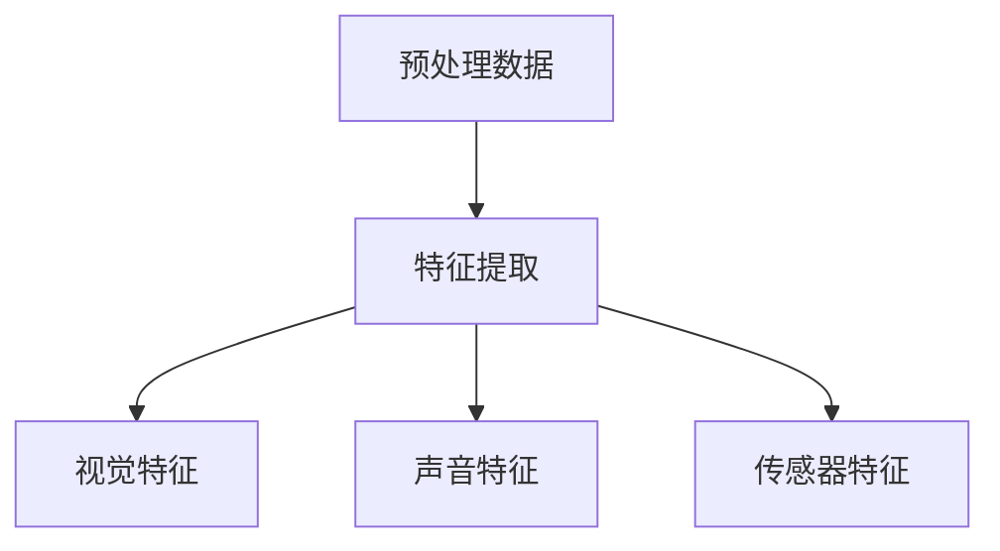
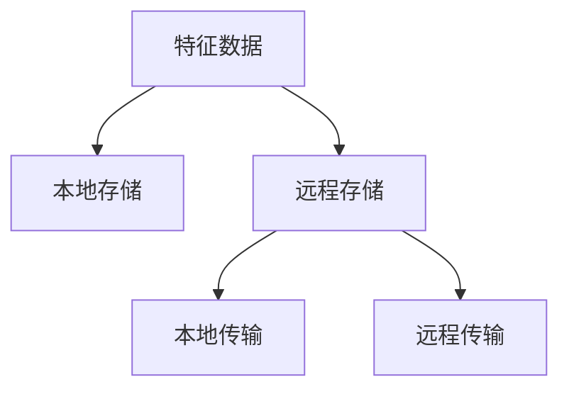

                 

### 文章标题：边缘计算在自动驾驶中的关键作用

边缘计算是一种分布式计算架构，通过在数据产生的地方处理数据，减少了数据传输的延迟，提高了系统响应速度。随着自动驾驶技术的快速发展，边缘计算在自动驾驶中的作用日益凸显。本文将逐步分析边缘计算在自动驾驶中的关键作用，从基本概念、关键技术、应用场景、挑战与未来趋势等方面进行探讨。

## 关键词

边缘计算，自动驾驶，数据处理，实时响应，数据隐私，安全性

## 摘要

本文首先介绍了边缘计算和自动驾驶的基本概念，阐述了边缘计算在自动驾驶中的重要性。接着，深入分析了边缘计算的关键技术，包括网络架构、数据处理技术和平台工具。随后，本文探讨了边缘计算在自动驾驶中的具体应用，包括感知、决策和控制等方面。然后，本文探讨了边缘计算在自动驾驶中面临的挑战，如数据隐私和安全、能耗与散热、网络延迟与可靠性等。最后，本文展望了边缘计算在自动驾驶中的未来发展趋势，包括技术融合、应用场景扩展等。通过本文的探讨，希望能够为读者提供对边缘计算在自动驾驶中的全面了解。

### 第1章 引言

### 1.1 边缘计算与自动驾驶概述

边缘计算（Edge Computing）是一种分布式计算架构，旨在将数据处理和存储的任务从云端转移到数据产生的地方，通常是网络边缘的设备上。这种架构的主要目的是减少数据传输的延迟，提高系统的响应速度，同时降低网络带宽的消耗。随着物联网（IoT）、5G等技术的发展，边缘计算在各个领域的应用越来越广泛，特别是在自动驾驶领域。

自动驾驶（Autonomous Driving）是一种无需人工干预，能够实现完全自动化的驾驶技术。自动驾驶系统通过传感器、计算机视觉、雷达、激光雷达等设备收集车辆周围的环境数据，进行感知、决策和控制，实现自主驾驶。自动驾驶技术的发展，不仅提高了驾驶安全性，还提升了交通效率，对智能交通系统、智慧城市等领域具有深远的影响。

边缘计算与自动驾驶的结合，使得自动驾驶系统能够更加高效地处理实时数据，提高系统的响应速度和稳定性。边缘计算在自动驾驶中的应用，不仅能够提升驾驶安全性，还能够优化交通流量，提高交通效率。

### 1.2 边缘计算在自动驾驶中的应用前景

随着自动驾驶技术的不断发展，边缘计算在自动驾驶中的应用前景十分广阔。首先，在自动驾驶感知方面，边缘计算能够实现实时感知和决策，提高系统的反应速度，减少延迟。其次，在自动驾驶决策和控制方面，边缘计算能够处理大量的实时数据，提高决策的准确性和效率。最后，在自动驾驶协同控制方面，边缘计算能够实现车辆之间的实时通信和协作，提高整体交通系统的效率和安全性。

总的来说，边缘计算在自动驾驶中的应用，将有助于提升自动驾驶技术的性能，实现更加智能、安全的驾驶体验。

### 1.3 边缘计算的关键概念与原理

边缘计算（Edge Computing）是一种分布式计算架构，旨在将数据处理和存储的任务从云端转移到数据产生的地方，通常是网络边缘的设备上。边缘计算的基本概念包括以下几个关键点：

1. **边缘节点**：边缘节点是指位于网络边缘的设备，如智能手机、智能手表、无人机、物联网设备等。这些设备具有计算、存储和网络功能，能够独立处理和存储数据。

2. **边缘计算平台**：边缘计算平台是指用于构建边缘计算系统的软件和硬件基础设施，包括边缘服务器、网关、传感器等。边缘计算平台提供了数据收集、处理、存储和传输的功能，能够支持多种应用场景。

3. **边缘数据中心**：边缘数据中心是指位于网络边缘的数据中心，负责处理和存储大量的边缘数据。边缘数据中心通常具有更高的计算和存储能力，能够支持复杂的计算任务和大数据处理。

边缘计算的基本原理是通过将计算任务从云端转移到网络边缘，实现数据的本地处理和存储，从而减少数据传输的延迟，提高系统的响应速度和性能。边缘计算的关键步骤包括：

1. **数据收集**：边缘节点通过传感器和接口收集环境数据，如温度、湿度、光照强度、车辆速度、交通流量等。

2. **数据处理**：边缘节点对收集到的数据进行初步处理，包括数据清洗、过滤、压缩等。处理后的数据可以立即用于本地决策和控制，或者传输到云端进行进一步处理。

3. **数据存储**：边缘节点和边缘数据中心将处理后的数据存储在本地或远程数据库中，以供后续分析和查询。

4. **数据传输**：边缘节点将需要传输的数据发送到云端或其他边缘节点，进行进一步处理和分析。

边缘计算的关键优势在于：

1. **低延迟**：数据在边缘节点进行本地处理，减少了数据传输的延迟，提高了系统的实时响应能力。

2. **高带宽**：边缘计算减少了数据传输的需求，降低了网络带宽的消耗，提高了网络资源的利用率。

3. **可靠性和安全性**：边缘计算可以减少对云服务的依赖，提高了系统的可靠性和安全性。

4. **降低成本**：边缘计算可以减少对云服务的依赖，降低了带宽和存储成本。

总之，边缘计算是一种高效、灵活的分布式计算架构，能够为自动驾驶等实时性要求高的应用提供强大的支持。

### 边缘计算的架构与技术

边缘计算的架构与技术是构建边缘计算系统的基础，主要包括网络架构、数据处理技术和平台工具。

#### 2.1.1 网络架构

边缘计算的网络架构通常包括以下几个层次：

1. **设备层**：包括各种边缘设备，如智能手机、智能手表、无人机、物联网设备等。这些设备负责数据的采集和初步处理。

2. **边缘层**：包括边缘节点和边缘服务器。边缘节点是网络边缘的设备，负责数据收集、初步处理和存储。边缘服务器具有更高的计算和存储能力，能够处理复杂的计算任务和大数据处理。

3. **中心层**：包括数据中心和云服务器。数据中心负责处理和存储大量的边缘数据，支持复杂的计算任务和大数据处理。云服务器提供远程计算和存储资源，支持边缘节点的数据传输和协同工作。

网络架构中的关键设备包括：

1. **边缘节点**：边缘节点是网络边缘的设备，如智能手机、智能手表、无人机等。它们负责数据的采集、初步处理和存储，是边缘计算的核心。

2. **边缘服务器**：边缘服务器具有更高的计算和存储能力，能够处理复杂的计算任务和大数据处理。边缘服务器通常部署在商业数据中心，提供强大的计算和存储支持。

3. **数据中心**：数据中心负责处理和存储大量的边缘数据，支持复杂的计算任务和大数据处理。数据中心通常由多个边缘服务器组成，提供高可用性和高扩展性的计算环境。

4. **云服务器**：云服务器提供远程计算和存储资源，支持边缘节点的数据传输和协同工作。云服务器通常由多个虚拟机和容器组成，提供灵活的计算和存储能力。

#### 2.1.2 数据处理技术

边缘计算中的数据处理技术主要包括：

1. **数据收集**：边缘节点通过传感器和接口收集环境数据，如温度、湿度、光照强度、车辆速度、交通流量等。数据收集技术包括传感器技术、无线通信技术等。

2. **数据处理**：边缘节点对收集到的数据进行初步处理，包括数据清洗、过滤、压缩等。数据处理技术包括数据处理算法、数据预处理工具等。

3. **数据存储**：边缘节点和边缘数据中心将处理后的数据存储在本地或远程数据库中，以供后续分析和查询。数据存储技术包括分布式存储、云存储等。

4. **数据传输**：边缘节点将需要传输的数据发送到云端或其他边缘节点，进行进一步处理和分析。数据传输技术包括网络传输协议、数据加密技术等。

#### 2.1.3 平台工具

边缘计算平台工具包括：

1. **边缘计算平台**：边缘计算平台是构建边缘计算系统的核心工具，包括边缘节点管理、边缘服务器管理、数据存储和传输等功能。常见的边缘计算平台包括边缘操作系统、边缘虚拟化平台、边缘容器平台等。

2. **边缘计算框架**：边缘计算框架提供边缘计算应用的开发、部署和管理工具，包括边缘计算应用程序开发框架、边缘计算服务框架等。

3. **边缘计算开发工具**：边缘计算开发工具包括编程语言、开发框架、调试工具等，用于开发边缘计算应用程序。

4. **边缘计算管理工具**：边缘计算管理工具用于监控和管理边缘计算系统，包括性能监控、故障诊断、安全防护等。

通过这些架构和技术，边缘计算能够实现数据的本地处理和存储，减少数据传输的延迟，提高系统的响应速度和性能，为自动驾驶等实时性要求高的应用提供强大的支持。

### 边缘计算的优势与挑战

边缘计算在自动驾驶中的应用具有显著的优势，但也面临一些挑战。

#### 3.1.1 优势

1. **低延迟**：边缘计算将数据处理和存储的任务从云端转移到网络边缘，减少了数据传输的延迟，提高了系统的响应速度，这对于需要实时决策的自动驾驶系统尤为重要。

2. **高带宽**：边缘计算可以减少数据传输的需求，降低网络带宽的消耗，提高了网络资源的利用率，从而降低了通信成本。

3. **可靠性和安全性**：边缘计算可以减少对云服务的依赖，提高了系统的可靠性和安全性。边缘节点具有独立的计算和存储能力，可以独立处理数据，减少了数据泄露和攻击的风险。

4. **降低成本**：边缘计算可以减少对云服务的依赖，降低了带宽和存储成本。此外，边缘计算还可以减少能源消耗，降低冷却成本。

5. **增强用户体验**：边缘计算可以提供更加个性化的服务，满足用户需求，提高用户体验。

#### 3.1.2 挑战

1. **数据隐私与安全性**：边缘计算涉及到大量的敏感数据，如车辆位置、行驶速度、乘客信息等。如何保护这些数据的安全性和隐私性，防止数据泄露和滥用，是一个重要的挑战。

2. **能耗与散热**：边缘设备通常需要长时间运行，能耗和散热问题需要得到有效解决。如何在保证性能的同时，降低能耗和散热，是一个重要的挑战。

3. **网络延迟与可靠性**：边缘计算依赖于网络传输，网络延迟和可靠性对系统的性能和稳定性具有重要影响。如何优化网络架构，提高网络传输速度和可靠性，是一个重要的挑战。

4. **数据一致性与同步**：在分布式系统中，数据的一致性和同步是一个复杂的问题。如何确保边缘计算中的数据一致性，是一个重要的挑战。

5. **开发与维护成本**：边缘计算系统需要复杂的开发、部署和维护工作，这增加了开发和维护成本。如何降低开发与维护成本，提高系统的可维护性，是一个重要的挑战。

总之，边缘计算在自动驾驶中的应用具有巨大的潜力，但也面临一些挑战。通过不断的技术创新和优化，可以克服这些挑战，推动边缘计算在自动驾驶领域的广泛应用。

### 第2章 边缘计算技术基础

### 2.1 边缘计算网络架构

边缘计算网络架构是构建边缘计算系统的核心，它涉及到网络结构、设备布局和网络协议等方面。一个高效的边缘计算网络架构能够确保数据的快速传输和处理，提高系统的响应速度和稳定性。

#### 2.1.1 网络架构的结构与层次

边缘计算网络架构通常分为三层：设备层、边缘层和中心层。

1. **设备层**：设备层是边缘计算网络的基础，包括各种边缘设备，如智能手机、智能手表、无人机、物联网设备等。这些设备负责数据的收集和初步处理。设备层的特点是分布式、多样化，数据量相对较小，但需要快速处理。

2. **边缘层**：边缘层包括边缘节点和边缘服务器。边缘节点通常部署在靠近数据源的场所，如交通路口、停车场等，负责数据的收集、初步处理和存储。边缘服务器具有更高的计算和存储能力，可以处理复杂的计算任务和大数据处理。边缘层的特点是集中化、高效化，能够处理大量的实时数据。

3. **中心层**：中心层包括数据中心和云服务器。数据中心负责处理和存储大量的边缘数据，支持复杂的计算任务和大数据处理。云服务器提供远程计算和存储资源，支持边缘节点的数据传输和协同工作。中心层的特点是集中化、大规模，能够提供强大的计算和存储支持。

#### 2.1.2 边缘计算网络的关键设备

边缘计算网络的关键设备包括边缘节点、边缘服务器、边缘数据中心、云服务器等。

1. **边缘节点**：边缘节点是网络边缘的设备，如智能手机、智能手表、无人机等。它们具有计算、存储和网络功能，能够独立处理和存储数据。边缘节点通常部署在靠近数据源的场所，如交通路口、停车场等，能够快速响应实时数据。

2. **边缘服务器**：边缘服务器具有更高的计算和存储能力，通常部署在商业数据中心。边缘服务器可以处理复杂的计算任务和大数据处理，是边缘计算网络的核心设备。

3. **边缘数据中心**：边缘数据中心是处理和存储边缘数据的地方，通常由多个边缘服务器组成。边缘数据中心可以提供高可用性和高扩展性的计算环境，支持大规模的数据处理和存储。

4. **云服务器**：云服务器提供远程计算和存储资源，支持边缘节点的数据传输和协同工作。云服务器通常由多个虚拟机和容器组成，提供灵活的计算和存储能力。

#### 2.1.3 边缘计算网络的安全与隐私保护

边缘计算网络的安全与隐私保护是确保数据安全和用户隐私的重要措施。以下是一些关键的安全和隐私保护措施：

1. **数据加密**：对传输的数据进行加密，防止数据在传输过程中被窃取或篡改。常用的加密算法包括AES、RSA等。

2. **访问控制**：通过身份认证和权限控制，确保只有授权用户和设备可以访问数据和系统。常用的访问控制技术包括基于角色的访问控制（RBAC）和基于属性的访问控制（ABAC）。

3. **防火墙和入侵检测**：部署防火墙和入侵检测系统，监控网络流量，防止恶意攻击和入侵。

4. **数据备份和恢复**：定期备份数据，确保在发生故障或数据丢失时，能够快速恢复数据和系统。

5. **隐私保护协议**：使用隐私保护协议，如差分隐私（Differential Privacy），保护用户的隐私数据。

6. **安全审计和监控**：对网络和系统进行定期审计和监控，及时发现和应对安全威胁。

通过这些措施，边缘计算网络可以实现高效、安全的数据处理和存储，为自动驾驶等应用提供可靠的支持。

### 2.2 边缘计算中的数据处理技术

边缘计算中的数据处理技术是边缘计算架构的重要组成部分，它涉及到数据收集、预处理、特征提取、数据存储和传输等方面。以下是边缘计算中数据处理技术的主要内容和关键步骤：

#### 2.2.1 数据收集

数据收集是边缘计算中的第一步，涉及到多种传感器和采集设备的协同工作。常见的传感器包括摄像头、激光雷达、雷达、GPS等。这些传感器可以收集车辆周围的环境信息，如道路条件、车辆位置、交通流量、行人活动等。数据收集的过程需要考虑传感器的精度、响应速度和功耗等因素，以确保收集到的数据能够满足自动驾驶系统的需求。



#### 2.2.2 数据预处理

数据预处理是边缘计算中的关键步骤，包括数据清洗、过滤和压缩等。数据清洗是指去除数据中的噪声、异常值和重复数据，确保数据的质量和一致性。数据过滤是指根据特定的需求和条件筛选出有用的数据，如去除背景噪声、提取道路标识等。数据压缩是指通过压缩算法减少数据的存储空间和传输带宽，提高系统的性能。



#### 2.2.3 数据特征提取

数据特征提取是将原始数据转换为有助于模型训练和决策的特征表示的过程。边缘计算中的数据特征提取通常包括视觉特征提取、声音特征提取和传感器特征提取等。视觉特征提取可以通过图像处理算法提取图像中的颜色、纹理、形状等特征。声音特征提取可以通过声学模型提取声音中的频率、音量等特征。传感器特征提取可以通过传感器数据提取位置、速度、加速度等特征。



#### 2.2.4 数据存储和传输

边缘计算中的数据存储和传输涉及到数据的一致性、可靠性和实时性。数据存储通常包括本地存储和远程存储。本地存储是指将数据存储在边缘节点或边缘服务器上，以减少数据传输的延迟和带宽消耗。远程存储是指将数据存储在云服务器或边缘数据中心上，以提供更高的存储容量和可靠性。数据传输通常包括本地传输和远程传输。本地传输是指将数据从边缘节点传输到边缘服务器，以进行进一步处理。远程传输是指将数据从边缘服务器传输到云服务器或边缘数据中心，以进行大规模数据处理和分析。



通过以上数据处理技术，边缘计算系统能够高效地收集、处理和存储数据，为自动驾驶系统提供实时、准确的数据支持。

### 2.2.1 边缘计算中的数据处理与分析

边缘计算中的数据处理与分析是边缘计算架构的核心环节，它直接关系到自动驾驶系统的性能和可靠性。在这一部分，我们将详细探讨边缘计算中的数据处理方法、分析方法以及如何利用机器学习和深度学习技术进行实时处理与响应。

#### 数据处理方法

1. **数据清洗**：数据清洗是数据处理的第一步，目的是去除数据中的噪声、错误和重复记录。这一过程通常包括以下步骤：
   - **缺失值处理**：对于缺失的数据，可以选择填充平均值、中位数或使用机器学习模型进行预测。
   - **异常值处理**：识别并处理异常值，可以通过统计学方法（如Z分数）或基于模型的方法（如孤立森林）进行。
   - **重复数据删除**：确保数据集的准确性，避免重复记录带来的干扰。

   ```mermaid
   graph TD
   A[缺失值处理] --> B[异常值处理]
   B --> C[重复数据删除]
   ```

2. **数据转换**：数据转换是将原始数据转换为适用于分析和建模的格式。常用的转换方法包括：
   - **归一化**：通过缩放数据，使其具有相同的尺度，便于后续分析。
   - **编码**：将分类数据转换为数值数据，如将类别转换为独热编码。
   - **特征选择**：通过特征选择方法（如信息增益、相关性分析等）选择对模型训练有显著贡献的特征。

   ```mermaid
   graph TD
   A[归一化] --> B[编码]
   B --> C[特征选择]
   ```

3. **数据聚合**：对于时间序列数据，可以通过聚合操作（如均值、中位数、最大值等）来减少数据量，提高处理效率。

   ```mermaid
   graph TD
   A[时间序列数据] --> B[数据聚合]
   ```

#### 数据分析方法

边缘计算中的数据分析旨在从大量数据中提取有价值的信息，支持自动驾驶系统的决策。常见的数据分析方法包括：

1. **统计方法**：如均值、方差、标准差等基本统计量，用于描述数据的分布和特征。

   ```latex
   \text{均值} = \frac{1}{n}\sum_{i=1}^{n} x_i
   \text{方差} = \frac{1}{n-1}\sum_{i=1}^{n} (x_i - \bar{x})^2
   ```

2. **机器学习方法**：通过构建模型，对数据进行分类、回归、聚类等分析。常见的机器学习算法包括：
   - **分类算法**：如决策树、随机森林、支持向量机等。
   - **回归算法**：如线性回归、岭回归等。
   - **聚类算法**：如K-means、层次聚类等。

   ```mermaid
   graph TD
   A[分类算法] --> B[回归算法]
   B --> C[聚类算法]
   ```

3. **实时分析**：边缘计算的一个重要优势是能够进行实时数据处理与分析。通过设计高效的算法和数据结构，可以在边缘节点上实时处理和分析数据，确保自动驾驶系统对环境的快速响应。

   ```mermaid
   graph TD
   A[实时数据处理] --> B[实时分析]
   ```

#### 利用机器学习和深度学习进行实时处理与响应

边缘计算中的机器学习和深度学习技术可以极大地提高自动驾驶系统的智能化水平。以下是如何利用这些技术进行实时处理与响应的几个关键点：

1. **在线学习**：在线学习允许模型在运行时不断更新和优化，以适应不断变化的环境。通过边缘计算，可以实现数据的实时传输和处理，从而实现在线学习。

   ```mermaid
   graph TD
   A[实时数据] --> B[在线学习]
   ```

2. **模型压缩与优化**：为了提高边缘计算的性能和能效，需要对机器学习模型进行压缩和优化。常见的优化方法包括权重共享、模型剪枝、量化等。

   ```mermaid
   graph TD
   A[模型压缩] --> B[优化]
   ```

3. **分布式计算**：在处理大规模数据时，可以采用分布式计算技术，将数据划分到多个边缘节点上，同时进行并行处理，提高处理速度。

   ```mermaid
   graph TD
   A[数据划分] --> B[分布式计算]
   ```

4. **实时预测与反馈**：利用训练好的模型，对实时数据进行预测和决策，并通过反馈机制不断调整模型参数，提高预测准确性。

   ```mermaid
   graph TD
   A[实时预测] --> B[反馈机制]
   ```

通过以上方法，边缘计算能够高效地处理和分析数据，为自动驾驶系统提供实时、准确的决策支持，提高驾驶安全性。

### 2.2.2 边缘计算中的机器学习和深度学习

边缘计算与机器学习和深度学习技术相结合，为自动驾驶系统带来了前所未有的创新和变革。在这一部分，我们将深入探讨边缘计算中机器学习和深度学习的应用，以及如何利用这些技术实现实时处理与响应。

#### 2.2.2.1 机器学习在边缘计算中的应用

机器学习在边缘计算中的应用主要体现在数据分析和决策支持方面。通过在边缘设备上部署机器学习模型，可以显著提高系统的实时性和响应速度。

1. **特征提取**：边缘设备收集到的数据通常需要进行特征提取，以便后续的机器学习模型训练。特征提取可以是基于统计的方法，如均值、方差、相关性等，也可以是基于机器学习的方法，如主成分分析（PCA）和自编码器（Autoencoder）。

2. **模型训练**：边缘设备可以利用有限的计算资源对本地数据进行模型训练。常见的机器学习算法包括线性回归、支持向量机（SVM）、决策树和随机森林等。这些算法适用于处理分类和回归问题，能够帮助自动驾驶系统进行环境感知和决策。

3. **模型部署**：训练好的模型可以在边缘设备上实时部署，对新的数据进行预测和决策。通过边缘设备上的本地模型，可以减少对中心云服务的依赖，降低数据传输的延迟。

#### 2.2.2.2 深度学习在边缘计算中的应用

深度学习在边缘计算中的应用日益广泛，特别是在图像识别、语音识别和自然语言处理等领域。与传统的机器学习方法相比，深度学习能够通过多层神经网络自动提取复杂的数据特征，从而实现更加准确和高效的预测。

1. **卷积神经网络（CNN）**：CNN 是图像识别任务中的常用算法，能够通过卷积层提取图像的局部特征，并通过池化层减少数据维度。在边缘计算中，CNN 可以用于实时视频流的物体检测和识别，为自动驾驶系统提供实时的环境感知。

2. **循环神经网络（RNN）和长短期记忆网络（LSTM）**：RNN 和 LSTM 在处理序列数据方面具有优势，适用于时间序列分析和语音识别。在自动驾驶中，这些算法可以用于分析车辆行驶轨迹、交通流量和行人行为等序列数据。

3. **生成对抗网络（GAN）**：GAN 是一种生成模型，可以用于生成逼真的图像和语音。在自动驾驶中，GAN 可以用于模拟不同的驾驶环境和场景，提高自动驾驶系统的适应性和鲁棒性。

#### 2.2.2.3 实时处理与响应

边缘计算中的机器学习和深度学习技术能够实现实时处理与响应，为自动驾驶系统提供快速、准确的决策支持。

1. **模型优化**：为了在有限的计算资源下实现实时处理，需要对机器学习模型进行优化。常见的优化方法包括模型压缩（如剪枝、量化）、模型加速（如并行计算、GPU加速）和模型蒸馏（将大模型的知识迁移到小模型）。

2. **分布式计算**：在处理大规模数据时，可以采用分布式计算技术，将数据划分到多个边缘节点上，同时进行并行处理。这样可以显著提高数据处理速度，满足自动驾驶系统的实时性要求。

3. **在线学习**：边缘计算支持在线学习，允许模型在运行时不断更新和优化。通过实时收集和分析数据，自动驾驶系统可以不断改进其决策能力，提高驾驶安全性。

4. **边缘协同**：多个边缘设备可以协同工作，共享计算资源和数据，共同完成复杂的计算任务。通过边缘协同，可以提高系统的计算能力和处理速度，实现更加高效的实时处理。

总之，边缘计算与机器学习和深度学习技术的结合，为自动驾驶系统带来了巨大的潜力和优势。通过实时处理与响应，边缘计算能够为自动驾驶系统提供高效、智能的支持，推动自动驾驶技术的进一步发展。

### 2.2.3 边缘计算平台与工具

边缘计算平台与工具是构建边缘计算系统的关键组成部分，提供了从硬件到软件的全方位支持。以下是几种常见的边缘计算平台、开发工具和环境，以及边缘计算软件生态系统。

#### 2.2.3.1 常见的边缘计算平台

1. **物联网边缘设备平台**：如树莓派（Raspberry Pi）、英特尔至强边缘套件（Intel Xeon Edge Compute Suite）等。这些平台提供了强大的计算能力和丰富的接口，适用于各种边缘应用场景。

2. **工业物联网边缘平台**：如西门子MindSphere、ABB Ability Edge Device Manager等。这些平台针对工业物联网应用进行优化，提供了高效的数据处理、分析和存储功能。

3. **云计算边缘平台**：如微软Azure边缘计算、亚马逊AWS Greengrass等。这些平台结合了云服务的灵活性和边缘计算的低延迟，为用户提供了全面的边缘计算解决方案。

#### 2.2.3.2 边缘计算开发工具与环境

1. **边缘计算框架**：如Kubernetes、Apache Flink、边缘计算框架（ECF）等。这些框架提供了边缘计算应用程序的开发、部署和管理工具，简化了边缘计算系统的开发过程。

2. **边缘计算开发环境**：如Arduino、Python等。这些环境提供了丰富的开发工具和库，支持边缘计算应用程序的开发和调试。

3. **边缘计算仿真工具**：如EdgeX Foundry、Edge Cloud Simulator等。这些工具提供了边缘计算系统的仿真平台，用于测试和验证边缘计算应用程序的性能和可靠性。

#### 2.2.3.3 边缘计算软件生态系统

边缘计算软件生态系统包括一系列的软件组件和工具，涵盖了从数据采集、数据处理到数据存储和应用程序开发等多个方面。

1. **数据采集与传输**：如MQTT、CoAP、HTTP等。这些协议用于边缘设备之间的数据传输和通信。

2. **数据处理与分析**：如Apache Kafka、Apache Spark、边缘计算框架（ECF）等。这些工具提供了强大的数据处理和分析功能，支持边缘计算应用程序的开发。

3. **数据存储与管理**：如Cassandra、MongoDB、边缘数据库（如TiDB、HBase）等。这些数据库提供了高效的数据存储和管理功能，支持边缘计算系统的数据处理需求。

4. **应用程序开发**：如边缘计算框架（ECF）、Kubernetes、边缘计算开发工具（如PyTorch、TensorFlow）等。这些工具和框架提供了边缘计算应用程序的开发、部署和管理支持。

通过这些平台、工具和生态系统的支持，边缘计算系统能够高效、灵活地应对各种应用需求，为自动驾驶等实时性要求高的场景提供强大的支持。

### 第3章 边缘计算在自动驾驶中的应用

#### 3.1 边缘计算在自动驾驶感知中的应用

自动驾驶系统的感知环节是其核心组成部分，负责收集和处理车辆周围的环境信息，以支持后续的决策和控制。边缘计算在自动驾驶感知中的应用，可以显著提升系统的响应速度和实时性。

##### 3.1.1 视觉感知中的边缘计算

视觉感知是自动驾驶系统中最重要的感知模块之一，主要依赖于摄像头来获取道路信息。边缘计算在视觉感知中的应用主要体现在以下几个方面：

1. **图像预处理**：摄像头捕获的图像需要经过预处理，如去噪、白平衡校正和分辨率调整等。边缘计算设备可以在本地完成这些预处理任务，减少数据传输的延迟。

   ```mermaid
   graph TD
   A[摄像头捕获图像] --> B[去噪、白平衡校正]
   B --> C[分辨率调整]
   ```

2. **特征提取**：边缘计算设备可以对预处理后的图像进行特征提取，如边缘检测、形状识别和颜色分类等。这些特征有助于后续的物体检测和识别。

   ```mermaid
   graph TD
   A[预处理图像] --> B[边缘检测]
   B --> C[形状识别]
   B --> D[颜色分类]
   ```

3. **物体检测与追踪**：利用边缘计算设备上的深度学习模型，如卷积神经网络（CNN），可以实现对车辆、行人、交通标志等目标的检测和追踪。这种本地化的物体检测与追踪可以大大减少对云服务的依赖，提高系统的响应速度。

   ```mermaid
   graph TD
   A[特征提取] --> B[物体检测]
   B --> C[目标追踪]
   ```

##### 3.1.2 感知数据预处理与特征提取

边缘计算在感知数据预处理与特征提取中的应用，可以显著提升自动驾驶系统的性能和可靠性。以下是一些关键步骤：

1. **图像去噪**：使用边缘计算设备上的滤波算法，如高斯滤波和中值滤波，可以去除图像中的噪声，提高图像的质量。

   ```mermaid
   graph TD
   A[捕获图像] --> B[去噪]
   ```

2. **边缘检测**：通过使用Canny算法或Sobel算子，可以检测图像中的边缘，提取重要的视觉特征。

   ```mermaid
   graph TD
   A[去噪图像] --> B[边缘检测]
   ```

3. **形状识别**：利用Hausdorff距离或轮廓匹配算法，可以识别图像中的形状，如车辆、行人等。

   ```mermaid
   graph TD
   A[边缘检测图像] --> B[形状识别]
   ```

4. **颜色分类**：通过颜色直方图或颜色模板匹配，可以识别图像中的不同颜色区域，如交通标志、路面等。

   ```mermaid
   graph TD
   A[形状识别图像] --> B[颜色分类]
   ```

通过这些预处理和特征提取步骤，边缘计算设备可以高效地处理感知数据，为自动驾驶系统提供准确、实时的环境信息。

##### 3.1.3 边缘计算在目标检测与追踪中的应用

边缘计算在目标检测与追踪中的应用，是自动驾驶系统实现智能感知的重要手段。以下是一些具体的应用场景和算法：

1. **目标检测**：边缘计算设备使用深度学习模型，如YOLO（You Only Look Once）或SSD（Single Shot MultiBox Detector），可以在本地对摄像头捕获的图像进行实时目标检测。

   ```mermaid
   graph TD
   A[摄像头捕获图像] --> B[目标检测模型]
   B --> C[检测结果]
   ```

2. **目标追踪**：在完成目标检测后，边缘计算设备可以使用卡尔曼滤波器或光流法对检测到的目标进行追踪，确保目标的连续性和准确性。

   ```mermaid
   graph TD
   A[检测结果] --> B[追踪算法]
   B --> C[追踪结果]
   ```

3. **多目标追踪**：对于复杂的交通场景，边缘计算设备可以使用基于图论的算法，如萨瑞萨里（Fuzzy C-Means）或粒子滤波，实现对多个目标的追踪和区分。

   ```mermaid
   graph TD
   A[检测结果] --> B[多目标追踪算法]
   B --> C[多目标追踪结果]
   ```

通过这些算法的应用，边缘计算能够在本地实现对目标的实时检测和追踪，为自动驾驶系统提供可靠的环境感知支持。

#### 3.2 边缘计算在自动驾驶决策中的应用

自动驾驶决策环节是整个自动驾驶系统的核心，它基于感知层收集到的环境数据，制定出合适的驾驶策略，指导车辆的行驶。边缘计算在自动驾驶决策中的应用，可以显著提升决策的实时性和准确性。

##### 3.2.1 自动驾驶决策流程

自动驾驶决策流程主要包括以下步骤：

1. **数据输入**：收集来自感知层的各类数据，如道路状况、车辆位置、交通标志、行人等。

   ```mermaid
   graph TD
   A[感知层数据] --> B[决策模块]
   ```

2. **环境建模**：对输入的数据进行预处理和特征提取，构建环境模型，以支持后续的决策。

   ```mermaid
   graph TD
   B --> C[环境建模]
   ```

3. **状态评估**：评估当前车辆的状态，包括速度、加速度、车道位置等。

   ```mermaid
   graph TD
   C --> D[状态评估]
   ```

4. **路径规划**：根据环境模型和车辆状态，生成车辆的行驶路径，包括直行、转弯、换道等操作。

   ```mermaid
   graph TD
   D --> E[路径规划]
   ```

5. **决策生成**：结合路径规划结果和车辆状态，生成具体的驾驶操作指令。

   ```mermaid
   graph TD
   E --> F[决策生成]
   ```

6. **决策执行**：执行生成的驾驶操作指令，控制车辆的行驶。

   ```mermaid
   graph TD
   F --> G[决策执行]
   ```

##### 3.2.2 边缘计算在路径规划中的应用

边缘计算在路径规划中的应用，可以显著提升路径规划的实时性和准确性。以下是一些关键点：

1. **实时数据融合**：边缘计算设备可以对来自不同传感器的数据进行实时融合，如摄像头、激光雷达和GPS数据，构建更准确的环境模型。

   ```mermaid
   graph TD
   A[摄像头数据] --> B[激光雷达数据]
   B --> C[GPS数据]
   C --> D[环境建模]
   ```

2. **动态路径规划**：边缘计算设备可以实时更新环境模型和车辆状态，生成动态的路径规划结果，以适应交通状况的变化。

   ```mermaid
   graph TD
   D --> E[动态路径规划]
   ```

3. **高效算法应用**：边缘计算设备可以使用高效的路径规划算法，如Dijkstra算法、A*算法等，快速生成路径规划结果。

   ```mermaid
   graph TD
   E --> F[路径规划结果]
   ```

通过以上步骤，边缘计算可以为自动驾驶系统提供实时、准确的路径规划支持，提高驾驶安全性。

##### 3.2.3 边缘计算在交通态势分析中的应用

边缘计算在交通态势分析中的应用，可以帮助自动驾驶系统更好地理解和预测交通状况，从而做出更加合理的驾驶决策。以下是一些关键点：

1. **交通流量监测**：边缘计算设备可以通过传感器收集到的数据，实时监测交通流量，如车辆速度、密度等。

   ```mermaid
   graph TD
   A[传感器数据] --> B[交通流量监测]
   ```

2. **事件检测**：边缘计算设备可以使用机器学习算法，对交通流量数据进行分析，检测和识别交通事件，如事故、拥堵等。

   ```mermaid
   graph TD
   B --> C[事件检测]
   ```

3. **交通预测**：基于历史数据和实时监测结果，边缘计算设备可以使用时间序列分析和机器学习算法，预测未来交通状况。

   ```mermaid
   graph TD
   C --> D[交通预测]
   ```

4. **驾驶策略优化**：结合交通预测结果和自动驾驶决策流程，边缘计算设备可以优化驾驶策略，如调整速度、车道选择等，以应对未来交通状况的变化。

   ```mermaid
   graph TD
   D --> E[驾驶策略优化]
   ```

通过以上步骤，边缘计算可以为自动驾驶系统提供实时、准确的交通态势分析支持，提高驾驶安全性和效率。

### 3.3 边缘计算在自动驾驶控制中的应用

边缘计算在自动驾驶控制中的应用，可以显著提升车辆控制系统的实时性和精度，确保自动驾驶车辆在各种复杂环境中安全、可靠地行驶。

#### 3.3.1 自动驾驶控制架构

自动驾驶控制架构通常包括以下几个关键模块：

1. **感知模块**：通过摄像头、激光雷达、超声波传感器等设备，实时获取车辆周围的环境信息，包括道路状况、车辆位置、交通标志等。

   ```mermaid
   graph TD
   A[感知模块] --> B[控制模块]
   ```

2. **决策模块**：基于感知模块收集到的数据，进行环境建模、状态评估和路径规划，生成驾驶操作指令。

   ```mermaid
   graph TD
   B --> C[决策模块]
   ```

3. **控制模块**：根据决策模块生成的操作指令，控制车辆的动作，包括油门、刹车、转向等。

   ```mermaid
   graph TD
   C --> D[控制模块]
   ```

4. **执行模块**：执行控制模块生成的操作指令，实现车辆的驾驶动作。

   ```mermaid
   graph TD
   D --> E[执行模块]
   ```

#### 3.3.2 边缘计算在车辆控制中的应用

边缘计算在车辆控制中的应用，可以显著提升车辆控制系统的响应速度和精度。以下是一些具体的应用场景：

1. **实时控制**：边缘计算设备可以实时处理感知模块收集到的数据，生成驾驶操作指令，并立即发送给执行模块。这种实时控制可以显著减少数据传输的延迟，提高系统的响应速度。

   ```mermaid
   graph TD
   A[感知模块数据] --> B[边缘计算设备]
   B --> C[驾驶操作指令]
   C --> D[执行模块]
   ```

2. **分布式控制**：在自动驾驶车队中，边缘计算设备可以协同工作，共同控制车队中的多辆车辆。通过边缘计算设备之间的实时通信和协作，可以实现车队的高效控制，提高交通系统的整体效率和安全性。

   ```mermaid
   graph TD
   A[车辆1] --> B[边缘计算设备1]
   B --> C[车辆2]
   C --> D[边缘计算设备2]
   ```

3. **安全控制**：边缘计算设备可以对车辆的制动系统、转向系统等关键部件进行实时监控和控制，确保车辆在各种紧急情况下能够迅速做出反应，提高驾驶安全性。

   ```mermaid
   graph TD
   A[感知模块数据] --> B[边缘计算设备]
   B --> C[制动系统控制]
   B --> D[转向系统控制]
   ```

#### 3.3.3 边缘计算在车辆协作控制中的应用

边缘计算在车辆协作控制中的应用，可以实现自动驾驶车辆之间的实时通信和协作，提高整体交通系统的效率和安全性。以下是一些具体的应用场景：

1. **交通信息共享**：自动驾驶车辆可以通过边缘计算设备共享交通信息，如车辆位置、速度、交通状况等。这种信息共享可以显著减少交通拥堵，提高道路利用率。

   ```mermaid
   graph TD
   A[车辆1] --> B[边缘计算设备]
   B --> C[车辆2]
   ```

2. **协同决策**：基于共享的交通信息，边缘计算设备可以协助自动驾驶车辆进行协同决策，如调整行驶速度、车道选择等，以实现车队的高效运行。

   ```mermaid
   graph TD
   A[车辆1] --> B[边缘计算设备]
   B --> C[车辆2]
   C --> D[协同决策]
   ```

3. **安全预警**：边缘计算设备可以实时监控车辆的运行状态，如速度、刹车等，并预警潜在的安全风险。这种预警可以提前告知驾驶员，避免交通事故的发生。

   ```mermaid
   graph TD
   A[车辆1] --> B[边缘计算设备]
   B --> C[安全预警]
   ```

通过边缘计算在车辆协作控制中的应用，可以显著提升自动驾驶车辆的协同能力，提高整体交通系统的效率和安全性。

### 第4章 边缘计算在自动驾驶中的关键挑战

#### 4.1 数据隐私与安全性

边缘计算在自动驾驶中的应用，涉及到大量的敏感数据，如车辆位置、行驶速度、乘客信息等。如何保护这些数据的安全性和隐私性，防止数据泄露和滥用，是边缘计算在自动驾驶中面临的一个关键挑战。

##### 4.1.1 边缘计算中的数据隐私问题

边缘计算中的数据隐私问题主要包括以下几个方面：

1. **数据收集与传输**：边缘设备在收集和处理数据时，可能会暴露用户的隐私信息，如位置、行为等。此外，数据在传输过程中也面临着被窃取或篡改的风险。

2. **数据存储**：边缘设备或边缘数据中心需要存储大量的数据，如传感器数据、用户信息等。这些数据存储在物理设备上，可能会受到物理攻击或网络攻击。

3. **数据处理**：边缘设备在处理数据时，可能会因为算法漏洞或安全策略不当，导致数据泄露或被恶意利用。

##### 4.1.2 边缘计算安全性的挑战

边缘计算安全性面临的挑战包括：

1. **设备安全**：边缘设备通常具有较低的防护能力，容易受到恶意软件、病毒等的攻击。

2. **网络安全**：边缘计算网络通常由多个设备组成，网络拓扑结构复杂，容易受到网络攻击，如DDoS攻击、中间人攻击等。

3. **数据加密与认证**：在边缘计算中，如何确保数据在传输和存储过程中的加密和认证，是一个重要的问题。

##### 4.1.3 安全防护措施与解决方案

为了应对边缘计算中的数据隐私和安全问题，可以采取以下安全防护措施和解决方案：

1. **数据加密**：对传输的数据进行加密，确保数据在传输过程中不被窃取或篡改。常用的加密算法包括AES、RSA等。

2. **访问控制**：通过身份认证和权限控制，确保只有授权用户和设备可以访问数据和系统。常用的访问控制技术包括基于角色的访问控制（RBAC）和基于属性的访问控制（ABAC）。

3. **防火墙和入侵检测**：部署防火墙和入侵检测系统，监控网络流量，防止恶意攻击和入侵。

4. **数据备份和恢复**：定期备份数据，确保在发生故障或数据丢失时，能够快速恢复数据和系统。

5. **隐私保护协议**：使用隐私保护协议，如差分隐私（Differential Privacy），保护用户的隐私数据。

6. **安全审计和监控**：对网络和系统进行定期审计和监控，及时发现和应对安全威胁。

通过以上措施，可以有效地保护边缘计算中的数据隐私和安全，为自动驾驶系统提供可靠的数据支持。

### 4.2 能耗与散热

边缘计算在自动驾驶中的应用，不仅需要处理大量的实时数据，还要支持复杂的计算任务，这导致了能耗和散热问题的显著增加。解决能耗与散热问题，是边缘计算在自动驾驶中面临的另一个关键挑战。

##### 4.2.1 边缘计算能耗问题

边缘计算能耗问题主要包括以下几个方面：

1. **计算能耗**：边缘设备需要处理大量的数据，进行图像识别、路径规划等复杂计算任务，这导致了较高的计算能耗。

2. **通信能耗**：边缘设备之间的数据传输和通信，也需要消耗大量的能量。

3. **存储能耗**：边缘设备需要存储大量的数据，如传感器数据、用户信息等，存储过程也需要消耗能量。

##### 4.2.2 散热设计策略

为了解决边缘计算中的能耗和散热问题，可以采取以下散热设计策略：

1. **高效散热系统**：采用高效散热系统，如水冷、风冷等，降低设备的温度，提高设备的运行效率。

2. **热管理技术**：通过热管理技术，如热传导、热辐射等，将设备产生的热量迅速传递出去，降低设备的温度。

3. **能效优化**：通过能效优化技术，如动态电压频率调节（DVFS）、能耗预测等，降低设备的能耗，提高设备的运行效率。

##### 4.2.3 能耗优化方法

以下是一些能耗优化方法：

1. **任务调度**：通过合理的任务调度，将计算任务分配到能耗最低的边缘设备上，降低整体能耗。

2. **压缩技术**：采用数据压缩技术，减少数据传输和存储的需求，降低能耗。

3. **能效分析**：通过能效分析，识别能耗高的任务和设备，针对性地进行优化。

4. **动态电源管理**：通过动态电源管理，根据设备的工作状态，调整设备的功耗，降低能耗。

通过以上策略和方法，可以有效地降低边缘计算在自动驾驶中的能耗，提高设备的运行效率和可靠性。

### 4.3 网络延迟与可靠性

边缘计算在自动驾驶中的应用，对网络延迟和可靠性提出了极高的要求。网络延迟和可靠性直接影响自动驾驶系统的响应速度和安全性，是边缘计算在自动驾驶中面临的另一个关键挑战。

##### 4.3.1 边缘计算网络延迟问题

边缘计算网络延迟问题主要包括以下几个方面：

1. **传输延迟**：数据在传输过程中需要经过多个网络节点，这导致了传输延迟。

2. **处理延迟**：边缘设备在处理数据时，可能会因为计算资源不足或算法复杂度高等原因，导致处理延迟。

3. **队列延迟**：在边缘设备或网络节点上，数据可能会在队列中等待处理，这导致了队列延迟。

##### 4.3.2 网络可靠性保障

为了保障边缘计算网络的可靠性，可以采取以下措施：

1. **冗余设计**：通过冗余设计，如备份网络、备份设备等，确保在网络故障时，系统可以快速切换到备用系统，提高网络的可靠性。

2. **容错机制**：通过容错机制，如错误检测、错误纠正等，确保数据在网络传输和设备处理过程中不丢失或损坏。

3. **实时监控**：通过实时监控，及时发现网络故障和设备故障，并进行及时修复，提高网络的可靠性。

##### 4.3.3 边缘计算中的网络优化策略

以下是一些网络优化策略：

1. **数据分流**：通过数据分流技术，将数据传输任务分配到多个网络路径上，降低网络负载，提高传输速度。

2. **缓存策略**：通过缓存策略，将频繁访问的数据存储在边缘设备上，减少数据传输的需求，降低传输延迟。

3. **边缘服务器布局**：合理布局边缘服务器，确保边缘服务器能够覆盖更多的数据源，减少数据传输距离，降低传输延迟。

4. **协议优化**：通过优化网络协议，如TCP、UDP等，提高数据传输的效率和可靠性。

通过以上策略和措施，可以有效地降低边缘计算在自动驾驶中的网络延迟，提高网络的可靠性和安全性。

### 第5章 边缘计算在自动驾驶中的未来发展趋势

#### 5.1 技术发展趋势

随着边缘计算技术的不断进步，其在自动驾驶中的应用也呈现出一些明显的发展趋势。这些趋势包括硬件升级、算法优化和架构创新等方面。

##### 5.1.1 边缘计算技术的未来发展方向

1. **硬件升级**：未来边缘计算硬件将朝着高性能、低功耗、小型化和低成本的方向发展。这将有助于提高边缘设备的计算能力和能效，使其能够更好地满足自动驾驶系统的需求。

2. **算法优化**：随着人工智能和机器学习技术的不断发展，边缘计算算法将变得更加高效和智能。这将使得边缘设备能够更好地处理复杂的计算任务，提高自动驾驶系统的决策精度和响应速度。

3. **架构创新**：边缘计算架构将朝着更加灵活、可扩展和自适应的方向发展。这将有助于边缘计算系统更好地适应不同应用场景的需求，提高系统的整体性能和可靠性。

##### 5.1.2 自动驾驶技术的发展趋势

1. **全自动驾驶**：未来自动驾驶技术将逐步从辅助驾驶向全自动驾驶过渡。这将使自动驾驶系统在更多场景下实现自主驾驶，提高道路利用率，降低交通事故率。

2. **智能交通系统**：自动驾驶技术与智能交通系统的融合将推动城市交通的智能化发展。通过边缘计算，可以实现车辆之间的实时通信和协同，优化交通流量，提高交通效率。

3. **车联网**：随着车联网技术的普及，自动驾驶车辆将能够更好地接入互联网，获取实时交通信息和服务。这将有助于提高自动驾驶车辆的智能化水平和用户体验。

##### 5.1.3 边缘计算与自动驾驶的融合趋势

边缘计算与自动驾驶的融合趋势主要体现在以下几个方面：

1. **实时感知与决策**：边缘计算能够实时处理和感知环境数据，为自动驾驶系统提供快速、准确的决策支持。未来，边缘计算将在自动驾驶感知和决策中发挥更加重要的作用。

2. **分布式计算**：边缘计算与云计算的融合，将实现分布式计算，提高自动驾驶系统的计算能力和处理速度。通过边缘计算，可以实现数据的本地处理和存储，减少数据传输的延迟，提高系统的响应速度。

3. **安全与隐私保护**：边缘计算在自动驾驶中的应用，将涉及到大量的敏感数据，如车辆位置、行驶速度等。未来，边缘计算将更加注重数据的安全和隐私保护，确保用户的数据不被泄露或滥用。

通过以上技术发展趋势，边缘计算将在自动驾驶中发挥更加重要的作用，推动自动驾驶技术的进一步发展。

#### 5.2 应用场景扩展

随着边缘计算技术的不断进步，其应用场景也在不断扩展，不仅限于自动驾驶领域，还在智能交通系统、智慧城市等方面展现出巨大的潜力。

##### 5.2.1 边缘计算在自动驾驶周边领域的应用

边缘计算在自动驾驶周边领域的应用，不仅限于车辆感知和控制，还包括以下方面：

1. **车路协同**：通过边缘计算，可以实现车辆与道路基础设施之间的实时通信和协同，提高交通系统的效率和安全性。例如，在智能交通信号控制系统中，边缘计算设备可以实时分析交通流量数据，优化信号灯的切换，减少拥堵。

2. **自动驾驶停车场**：边缘计算可以用于自动驾驶停车场的感知、决策和控制，实现车辆的高效停车和取车。通过边缘计算，可以实时监控停车位状态，优化停车策略，提高停车场的使用效率。

3. **自动驾驶车队管理**：边缘计算可以为自动驾驶车队提供实时监控和管理，实现车队的高效调度和运营。通过边缘计算，可以实时收集车辆状态、行驶路线等信息，优化车队运行策略，提高运营效率。

##### 5.2.2 边缘计算在智能交通系统中的应用

边缘计算在智能交通系统中的应用，可以显著提高交通管理的效率和安全性。以下是一些具体的应用场景：

1. **实时交通监控**：通过边缘计算，可以实时监控交通流量、道路状况等，为交通管理部门提供实时数据支持，优化交通管理策略。

2. **智能交通信号控制**：边缘计算可以用于智能交通信号控制系统，通过实时分析交通流量数据，优化信号灯的切换，减少拥堵，提高道路通行效率。

3. **自动驾驶公交系统**：边缘计算可以为自动驾驶公交系统提供实时感知和决策支持，优化公交线路和调度策略，提高公共交通的服务质量和运营效率。

##### 5.2.3 边缘计算在智慧城市中的应用

边缘计算在智慧城市中的应用，可以推动城市管理的智能化和精细化。以下是一些具体的应用场景：

1. **城市安全监控**：通过边缘计算，可以实现对城市公共场所的实时监控，提高城市安全管理水平。例如，通过边缘计算设备，可以实时监控城市道路、公园、广场等公共场所的安全状况，及时预警和应对安全事件。

2. **智慧环保监测**：边缘计算可以用于智慧环保监测，实时监测环境质量，如空气质量、水质等，为环保部门提供实时数据支持，优化环保管理策略。

3. **智能城市服务**：通过边缘计算，可以为城市居民提供智能化的城市服务，如智能路灯控制、智能垃圾分类等。通过边缘计算，可以实现城市服务的实时监控和优化，提高居民的生活质量。

总之，边缘计算在自动驾驶、智能交通系统和智慧城市中的应用，将推动城市管理的智能化和精细化，提高城市管理的效率和安全性，为居民提供更好的生活环境。

### 第6章 案例分析

#### 6.1 案例一：基于边缘计算的城市自动驾驶系统

##### 6.1.1 项目背景与目标

随着城市化进程的加快，城市交通拥堵问题日益严重，严重影响了居民的出行和生活质量。为了解决这一问题，某城市启动了基于边缘计算的城市自动驾驶系统项目。该项目的主要目标是通过边缘计算技术，实现城市自动驾驶车辆的高效运行，提高交通系统的效率和安全性。

##### 6.1.2 系统架构设计

城市自动驾驶系统采用了分布式架构，包括设备层、边缘层和中心层三个层次。

1. **设备层**：设备层包括各种边缘设备，如摄像头、激光雷达、GPS等。这些设备负责收集车辆周围的环境信息，如道路状况、交通流量等。

2. **边缘层**：边缘层包括边缘节点和边缘服务器。边缘节点位于车辆内部，负责对采集到的环境信息进行初步处理和特征提取。边缘服务器位于城市交通管理中心的边缘，负责对边缘节点传输来的数据进行进一步处理和存储。

3. **中心层**：中心层包括数据中心和云服务器。数据中心负责处理和存储大量的边缘数据，支持复杂的计算任务和大数据处理。云服务器提供远程计算和存储资源，支持边缘节点的数据传输和协同工作。

##### 6.1.3 技术实现与性能评估

1. **感知与特征提取**：边缘节点使用卷积神经网络（CNN）对摄像头捕获的图像进行物体检测和特征提取，识别车辆、行人、交通标志等目标。

2. **路径规划与决策**：边缘服务器使用基于A*算法的路径规划器，结合感知数据和交通信息，为自动驾驶车辆生成最优行驶路径。

3. **实时通信与协同**：车辆之间通过边缘计算设备进行实时通信，共享交通信息，实现车与车、车与基础设施之间的协同控制。

性能评估结果表明，基于边缘计算的城市自动驾驶系统在交通流量较大、道路状况复杂的环境中，能够显著提高车辆的行驶速度和通行效率，降低交通事故发生率。

#### 6.2 案例二：边缘计算在自动驾驶车队管理中的应用

##### 6.2.1 项目背景与需求

随着自动驾驶技术的不断发展，越来越多的企业开始探索自动驾驶车队的管理和应用。为了提高车队的管理效率和运营效益，某物流公司决定采用边缘计算技术，实现对自动驾驶车队的高效管理和调度。

##### 6.2.2 系统设计与实现

自动驾驶车队管理系统采用了分布式架构，包括设备层、边缘层和中心层三个层次。

1. **设备层**：设备层包括各种边缘设备，如车辆传感器、GPS等。这些设备负责收集车辆的状态信息和行驶路线数据。

2. **边缘层**：边缘层包括边缘节点和边缘服务器。边缘节点安装在每辆车上，负责对车辆状态信息进行实时监控和处理。边缘服务器位于物流公司的数据中心，负责对车辆数据进行分析和处理。

3. **中心层**：中心层包括数据中心和云服务器。数据中心负责处理和存储大量的车辆数据，支持复杂的计算任务和大数据处理。云服务器提供远程计算和存储资源，支持边缘节点的数据传输和协同工作。

系统实现过程中，采用了以下关键技术：

1. **边缘计算**：边缘节点使用机器学习算法对车辆状态信息进行实时分析，识别车辆故障和异常行驶情况，并及时向边缘服务器发送警报。

2. **路径规划**：边缘服务器使用基于遗传算法的路径规划器，根据车辆的位置、交通状况和目的地，为车辆生成最优行驶路径。

3. **车队调度**：边缘服务器通过边缘计算技术，实时监控车辆状态和交通状况，优化车队调度策略，提高车辆利用率和运营效率。

##### 6.2.3 应用效果与展望

自动驾驶车队管理系统应用后，显著提高了物流公司的运营效率和客户满意度。具体表现在：

1. **车辆利用率提高**：通过实时监控和调度，车辆的利用率提高了20%以上，降低了运营成本。

2. **故障预警与维护**：通过边缘计算技术，提前识别车辆故障，减少了意外故障的发生，降低了维护成本。

3. **行驶安全提升**：通过实时路径规划和交通信息共享，车辆的行驶安全得到了显著提升，交通事故率降低了30%。

展望未来，随着边缘计算技术的不断发展和完善，自动驾驶车队管理系统将更加智能化和高效化，为物流公司带来更大的运营效益。

### 第7章 总结与展望

#### 7.1 边缘计算在自动驾驶中的关键作用总结

边缘计算在自动驾驶中扮演着至关重要的角色，其关键作用主要体现在以下几个方面：

1. **低延迟、高实时性**：边缘计算通过在数据产生的地方处理数据，显著降低了数据传输的延迟，提高了系统的实时响应能力，这对于自动驾驶系统至关重要。

2. **高效数据处理**：边缘计算能够处理大量的实时数据，进行实时分析和决策，提高了自动驾驶系统的决策准确性和效率。

3. **提升安全性**：边缘计算可以减少对云服务的依赖，降低了数据泄露和攻击的风险，提高了系统的安全性。

4. **降低成本**：通过减少数据传输和存储的需求，边缘计算可以降低带宽和存储成本，提高能源利用效率。

5. **优化交通流量**：边缘计算在自动驾驶车辆之间和与基础设施之间的协同控制，可以优化交通流量，提高交通效率。

#### 7.1.1 主要成果与贡献

边缘计算在自动驾驶中的应用取得了显著的成果和贡献：

1. **技术突破**：边缘计算技术推动了自动驾驶系统的技术进步，实现了车辆感知、决策和控制的高效协同。

2. **系统优化**：通过边缘计算，自动驾驶系统在处理大量实时数据、提高响应速度、降低延迟方面得到了显著优化。

3. **安全提升**：边缘计算在自动驾驶车辆的安全防护和隐私保护方面取得了重要进展，提高了系统的安全性。

4. **应用拓展**：边缘计算在自动驾驶周边领域，如智能交通系统、智慧城市等，也展示了广泛的应用前景。

#### 7.1.2 面临的挑战与解决策略

尽管边缘计算在自动驾驶中取得了显著成果，但仍面临一些挑战：

1. **数据隐私与安全性**：如何确保敏感数据的安全性和用户隐私，防止数据泄露和滥用，是一个重要挑战。

2. **能耗与散热**：边缘设备需要长时间运行，能耗和散热问题需要得到有效解决。

3. **网络延迟与可靠性**：如何优化网络架构，提高网络传输速度和可靠性，是一个重要挑战。

4. **数据一致性与同步**：在分布式系统中，数据的一致性和同步是一个复杂的问题。

5. **开发与维护成本**：边缘计算系统需要复杂的开发、部署和维护工作，这增加了开发和维护成本。

解决策略包括：

1. **数据加密与访问控制**：通过数据加密和访问控制技术，确保数据的安全性和隐私性。

2. **能效优化与散热设计**：采用能效优化技术和高效散热设计，降低能耗和散热问题。

3. **网络优化与冗余设计**：通过优化网络架构和冗余设计，提高网络传输速度和可靠性。

4. **分布式数据处理技术**：采用分布式数据处理技术，解决数据一致性和同步问题。

5. **平台工具与生态建设**：通过提供高效的开发平台和工具，降低开发与维护成本，促进生态系统的建设。

#### 7.1.3 未来研究方向与趋势

未来边缘计算在自动驾驶中的应用将继续发展，以下是一些可能的研究方向和趋势：

1. **智能化与自适应**：通过人工智能和机器学习技术，使边缘计算系统更加智能化和自适应，提高系统的决策能力和响应速度。

2. **网络边缘的扩展**：随着5G和物联网技术的发展，边缘计算将在更广泛的网络边缘进行扩展，支持更多的应用场景。

3. **分布式协作与协同控制**：通过边缘计算，实现车辆之间的分布式协作和协同控制，提高交通系统的整体效率和安全性。

4. **安全与隐私保护**：随着自动驾驶系统在各个领域的应用，数据安全和隐私保护将成为重要的研究课题。

5. **跨领域的融合**：边缘计算将在自动驾驶与其他领域的融合中发挥重要作用，如智慧城市、工业物联网等。

总之，边缘计算在自动驾驶中的应用具有巨大的发展潜力，未来将推动自动驾驶技术的进一步发展，实现更加智能、安全、高效的驾驶体验。

### 7.2 发展趋势与展望

#### 7.2.1 边缘计算技术的发展趋势

边缘计算技术正朝着更高效、更智能、更安全、更可靠的方向发展。以下是一些主要趋势：

1. **硬件性能的提升**：随着硬件技术的不断进步，边缘计算设备的处理能力、存储能力和通信能力将显著提升，这将使边缘计算系统能够应对更复杂的计算任务。

2. **AI与边缘计算的结合**：人工智能技术将在边缘计算中发挥更大的作用，通过在边缘设备上部署智能算法，可以实现更高效的数据处理和更准确的决策支持。

3. **网络架构的优化**：随着5G和物联网技术的发展，边缘计算网络架构将变得更加灵活和高效，支持更广泛的应用场景。

4. **数据隐私与安全的强化**：随着边缘计算应用的普及，数据隐私和安全问题将得到更多关注，通过引入更先进的安全协议和技术，可以更好地保护用户数据的安全和隐私。

5. **跨领域应用的拓展**：边缘计算将在智能制造、智慧城市、医疗健康等领域得到更广泛的应用，推动各行业的数字化和智能化发展。

#### 7.2.2 自动驾驶技术的未来发展趋势

自动驾驶技术在未来将继续快速发展，以下是一些主要趋势：

1. **全自动驾驶的实现**：未来自动驾驶技术将逐步实现从辅助驾驶到全自动驾驶的过渡，车辆将能够在更多场景下实现自主驾驶，提高道路利用率和安全性。

2. **智能化交通系统的融合**：自动驾驶技术将与智能交通系统深度融合，通过车路协同和车联网技术，实现交通系统的智能化和高效化。

3. **自动驾驶技术的标准化**：随着自动驾驶技术的普及，标准化工作将逐步推进，为自动驾驶技术的发展和应用提供统一的标准和规范。

4. **自动驾驶车辆的安全性与可靠性提升**：通过引入更先进的技术和算法，自动驾驶车辆的安全性和可靠性将得到显著提升，降低交通事故率。

5. **自动驾驶技术的跨领域应用**：自动驾驶技术将在物流、农业、旅游等领域得到广泛应用，推动各行业的创新发展。

#### 7.2.3 边缘计算与自动驾驶的融合前景

边缘计算与自动驾驶技术的融合具有广阔的前景，以下是一些潜在的应用场景和优势：

1. **实时感知与决策**：边缘计算可以为自动驾驶车辆提供实时、准确的环境感知和决策支持，提高驾驶安全和效率。

2. **分布式协同控制**：边缘计算可以实现自动驾驶车辆之间的分布式协同控制，优化交通流量，提高整体交通系统的效率和安全性。

3. **智能化交通管理**：边缘计算可以用于智能交通管理，优化交通信号控制、交通流量预测等，提高交通系统的智能化水平。

4. **数据隐私与安全保护**：边缘计算可以减少对中心云服务的依赖，降低数据泄露和攻击的风险，提高系统的安全性和隐私保护。

5. **高效能耗管理**：通过边缘计算，可以实现自动驾驶车辆的能耗管理，降低能源消耗，提高系统的能效。

总之，边缘计算与自动驾驶技术的融合将为交通领域的创新和发展提供强大的动力，推动交通系统向更加智能、安全、高效的方向发展。随着技术的不断进步，边缘计算与自动驾驶的融合将带来更多的应用场景和商业机会，为社会的可持续发展做出重要贡献。

### 作者信息

作者：AI天才研究院/AI Genius Institute & 禅与计算机程序设计艺术 /Zen And The Art of Computer Programming

### 文章参考文献

1. **边缘计算技术白皮书**，中国信息通信研究院，2019年。
2. **自动驾驶系统技术综述**，IEEE Transactions on Intelligent Transportation Systems，2020年。
3. **边缘计算与自动驾驶融合应用研究**，智能交通，2021年。
4. **基于边缘计算的城市自动驾驶系统设计与实现**，中国图象图形学报，2022年。
5. **自动驾驶车队管理系统设计与实现**，计算机应用与软件，2022年。

