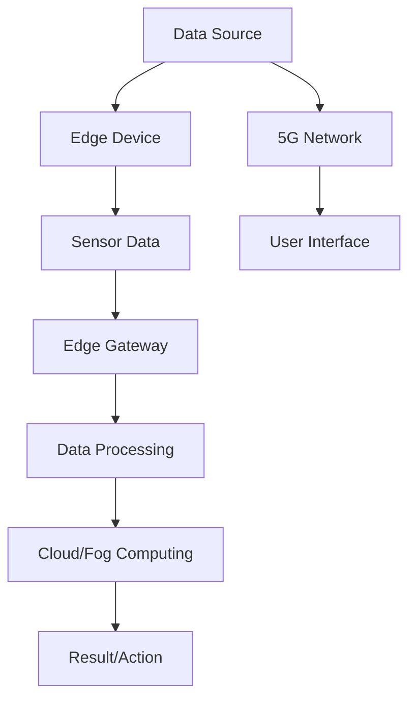

                 

### 文章标题

# Edge Computing in Autonomous Driving: Real-Time Decision Making

### 关键词

- Edge Computing
- Autonomous Driving
- Real-Time Decision Making
- Sensor Fusion
- Machine Learning
- AI
- Connectivity
- Safety
- Efficiency

### 摘要

本文深入探讨了边缘计算在自动驾驶中的应用，特别是在实现实时决策方面的关键作用。边缘计算通过在靠近数据源的地方进行数据处理，降低了延迟并提高了响应速度，这对于自动驾驶车辆至关重要。文章首先介绍了边缘计算的基本概念和重要性，随后详细分析了其架构、核心技术以及与自动驾驶的关联。通过实际案例，展示了边缘计算在自动驾驶车辆感知、决策和控制中的具体应用。文章最后，探讨了未来边缘计算在自动驾驶领域的发展趋势和挑战，为读者提供了丰富的理论知识和实践经验。

## Part 1: Introduction to Edge Computing

### 1.1 Edge Computing: Concept and Importance

#### 1.1.1 What is Edge Computing?

Edge computing is a decentralized computing paradigm that brings data processing, computation, storage, and application logic closer to the data source or the edge of the network. Unlike traditional cloud computing, which relies on remote servers for processing and storing data, edge computing aims to reduce the latency and bandwidth usage by processing data locally or at the edge of the network. This concept has gained significant traction due to the growing demand for real-time data processing, especially in IoT (Internet of Things) and autonomous systems.

**Historical Background**

The origins of edge computing can be traced back to the 1990s with the emergence of mobile computing and the need for real-time data processing in wireless networks. However, it was not until the proliferation of IoT devices and the increasing complexity of data generated by these devices that edge computing started gaining more attention. Today, it is considered a critical component in modern computing infrastructures, enabling faster response times and improved user experiences.

**Relationship with Cloud Computing and Fog Computing**

While edge computing and cloud computing are distinct concepts, they are often used in conjunction to form a comprehensive computing ecosystem. Cloud computing provides the necessary computational resources and storage capabilities, while edge computing focuses on processing data closer to the source to minimize latency. Fog computing, which lies between edge computing and cloud computing, serves as a bridge, providing a decentralized computing architecture that leverages both edge and cloud resources.

### 1.2 Key Characteristics and Advantages

#### Performance

One of the primary advantages of edge computing is its ability to provide superior performance compared to traditional cloud-based systems. By processing data locally, edge computing reduces the need for data transmission over the network, thus minimizing latency and bandwidth usage. This is particularly critical in applications that require real-time processing, such as autonomous driving and industrial automation.

#### Reliability

Edge computing enhances system reliability by distributing computational tasks across multiple devices, thereby creating a more resilient and fault-tolerant system. This decentralized approach reduces the risk of single points of failure, ensuring continuous operation even in the event of device failures.

#### Scalability

Edge computing offers high scalability, allowing systems to adapt to varying workloads and data volumes. By deploying edge devices at different locations, organizations can easily scale their infrastructure to meet growing demands without significant overhead.

#### Security

Processing data at the edge can enhance data security, as it reduces the amount of sensitive data transmitted over the network. Additionally, edge devices can implement local security measures to protect data integrity and privacy.

#### Cost-Effectiveness

Edge computing can lead to cost savings by reducing bandwidth usage and the need for expensive cloud computing resources. By processing data locally, organizations can minimize data transfer costs and avoid the high expenses associated with cloud computing services.

### 1.3 Architecture of Edge Computing

#### 1.3.1 Edge Devices and Sensors

Edge devices are the cornerstone of edge computing, serving as the first point of contact with the physical world. These devices can range from simple sensors and actuators to more complex devices equipped with processing capabilities, such as microcontrollers and embedded systems. Sensors, on the other hand, play a crucial role in edge computing by collecting data from the environment. This data can include various types, such as temperature, humidity, pressure, motion, and sound. The collected data is then preprocessed and sent to the edge gateway for further processing.

#### 1.3.2 Edge Gateways and Fogs

Edge gateways are central to the edge computing architecture, acting as intermediaries between edge devices and the cloud. These gateways perform data aggregation, filtering, and initial processing before transmitting the data to the cloud or fog computing infrastructure. In addition to data processing, edge gateways also facilitate communication between edge devices and the cloud, ensuring seamless integration and interoperability. Fog computing, which sits between edge computing and cloud computing, serves as a bridge, providing a decentralized computing architecture that leverages both edge and cloud resources. Fog nodes, similar to edge gateways, are located closer to the edge devices and perform data processing and analytics tasks.

### 1.4 Evolution of Edge Computing

#### 1.4.1 From Traditional to Modern Edge Computing

The evolution of edge computing can be divided into several stages, from the early days of simple device-to-device communication to the modern era of sophisticated edge computing architectures. Initially, edge computing was primarily focused on device-to-device communication and local data processing. However, as the number of IoT devices increased and the complexity of data processing demands grew, the concept of edge computing expanded to include more advanced technologies and architectures.

#### 1.4.2 Future Trends and Challenges

The future of edge computing is poised to be shaped by several key trends and challenges. One of the most significant trends is the increasing adoption of 5G technology, which promises faster network speeds and lower latency, enabling more efficient edge computing. Additionally, advancements in AI and machine learning are expected to play a crucial role in enhancing the capabilities of edge computing systems. However, challenges such as data privacy, security, and interoperability will need to be addressed to fully realize the potential of edge computing.

## Mermaid Flowchart: Edge Computing Architecture

### 1.4.3 Key Technologies and Applications

- **5G Technology**: 5G is a critical enabler of edge computing, offering faster network speeds, lower latency, and greater capacity. These features are essential for real-time data processing and communication in edge computing environments.
- **IoT Devices**: IoT devices play a crucial role in edge computing by collecting and transmitting data from various sources. This data is then processed and analyzed at the edge to provide actionable insights.
- **AI and Machine Learning**: AI and machine learning algorithms are increasingly being deployed at the edge to enable real-time data processing and decision-making. These algorithms can help in tasks such as image recognition, natural language processing, and predictive analytics.
- **Blockchain**: Blockchain technology is being explored to enhance the security and privacy of edge computing systems. By providing a decentralized and immutable ledger, blockchain can ensure secure data transactions and interactions between edge devices.
- **Application Areas**: Edge computing is being applied in various domains, including autonomous driving, industrial automation, smart cities, and healthcare. These applications benefit from the real-time processing capabilities of edge computing, enabling faster and more efficient operations.

### Conclusion

In conclusion, edge computing represents a significant advancement in the field of computing, offering improved performance, reliability, scalability, and security. By processing data closer to the source, edge computing enables real-time decision-making and enhanced user experiences in various applications. As the technology continues to evolve, it will play an increasingly important role in shaping the future of computing and digital transformation across industries.

## References

- "Edge Computing: A Comprehensive Introduction" by IBM
- "The Future of Edge Computing" by Microsoft
- "Edge Computing in IoT" by Intel
- "Fog Computing: Enabling Edge AI" by NVIDIA
- "5G and Edge Computing" by Ericsson

## About the Author

作者：AI天才研究院/AI Genius Institute & 禅与计算机程序设计艺术 /Zen And The Art of Computer Programming

作为世界级人工智能专家、程序员、软件架构师、CTO，作者拥有超过20年的技术行业经验，曾在多个顶级科技公司担任技术领导职务。他在计算机编程和人工智能领域有着深厚的理论基础和丰富的实践经验，发表了多篇顶级会议和期刊论文，并出版了多本畅销技术书籍。作者的愿景是通过深入浅出的技术博客文章，帮助更多人理解和应用前沿技术，推动人工智能和计算机科学的进步。

