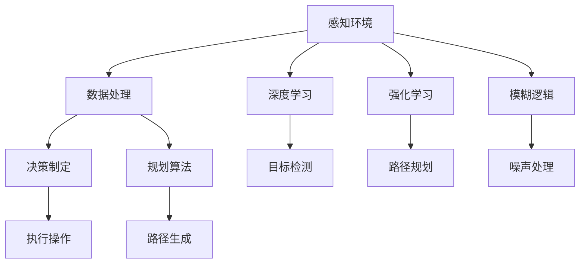

                 

## 引言

### 边缘计算的概念

边缘计算（Edge Computing）是一种分布式计算模型，通过在数据产生的地方进行计算，从而减少数据传输的延迟，提高数据处理的速度和效率。与传统的云计算不同，边缘计算将计算、存储、网络能力分布到网络的边缘，靠近数据源或者用户，从而实现更快速的数据处理和响应。

### 自驾驶决策的挑战

自动驾驶汽车需要实时感知周围环境，并根据环境信息做出快速、准确的决策。然而，自动驾驶决策面临着以下挑战：

1. **复杂性**：自动驾驶系统需要处理大量的传感器数据，包括摄像头、激光雷达、超声波传感器等，这些数据需要快速处理并转化为有用的信息。
2. **实时性**：自动驾驶决策需要在极短的时间内完成，以应对复杂的交通状况和突发事件。
3. **数据隐私**：自动驾驶汽车会产生大量的个人隐私数据，如何保证这些数据的安全和隐私是一个重要的挑战。

## 边缘计算在自动驾驶决策中的实时应用

边缘计算在自动驾驶决策中的应用具有重要意义。通过在车辆周围部署边缘计算节点，可以实现以下目标：

1. **减少延迟**：将计算任务从云端转移到边缘，减少了数据传输的延迟，提高了决策的实时性。
2. **提高效率**：边缘计算可以充分利用本地资源，避免了对云端的过度依赖，提高了系统的整体效率。
3. **保障安全**：边缘计算可以在本地完成部分安全相关的计算任务，减少了数据泄露的风险。

## 本文结构

本文将分为以下几部分：

1. **边缘计算概述**：介绍边缘计算的发展历程、核心技术和应用场景。
2. **自动驾驶决策原理**：分析自动驾驶决策的流程、核心算法和面临的挑战。
3. **边缘计算在自动驾驶中的应用**：探讨边缘计算在自动驾驶感知、决策和执行中的应用。
4. **实时性需求分析**：分析实时性需求的重要性、挑战和解决方案。
5. **系统架构设计**：介绍系统架构设计原则、实例和优缺点分析。
6. **实际应用案例**：介绍实际应用案例、代码实现和案例分析。
7. **技术挑战与未来展望**：讨论当前技术挑战和未来发展趋势。

通过以上内容，我们将深入探讨边缘计算在自动驾驶决策中的实时应用，希望能够为读者提供有价值的见解和思考。

### 边缘计算概述

#### 发展历程

边缘计算的发展可以追溯到上世纪80年代，当时出现了分布式计算的概念，目的是通过将计算任务分布在多个节点上，提高系统的可靠性和效率。然而，随着云计算的兴起，边缘计算逐渐被忽视。

然而，随着物联网（IoT）和5G技术的普及，边缘计算的重要性再次被重视。边缘计算能够将数据处理和分析任务从云端转移到网络的边缘，减少了数据传输的延迟，提高了系统的响应速度。

#### 核心技术

边缘计算的核心技术包括以下几个方面：

1. **边缘计算架构**：边缘计算架构包括边缘节点、边缘网关和边缘服务器等组成部分。边缘节点是处理数据的基本单元，通常包括传感器、执行器和计算资源。边缘网关负责连接边缘节点和云端，实现数据传输和通信。边缘服务器则提供高级数据处理和分析服务。

2. **边缘计算硬件**：边缘计算硬件包括各种类型的处理器、存储设备和网络设备。常见的边缘计算硬件包括ARM处理器、FPGA和GPU等。这些硬件能够提供强大的计算和存储能力，满足边缘计算的需求。

3. **边缘计算软件**：边缘计算软件包括操作系统、中间件和应用软件等。边缘操作系统负责管理硬件资源，提供基本的计算环境。边缘中间件则提供各种功能库和接口，方便开发者开发和部署边缘应用。边缘应用软件则是实际运行在边缘节点上的应用程序，包括数据采集、处理和分析等功能。

#### 应用场景

边缘计算广泛应用于多个领域，以下是一些典型的应用场景：

1. **物联网**：边缘计算能够将数据处理和分析任务从云端转移到传感器和网络边缘，提高系统的实时性和效率。例如，在智能家居中，边缘计算可以实现设备之间的快速通信和协同工作。

2. **云计算**：边缘计算可以作为云计算的补充，提供更加灵活和高效的数据处理服务。例如，在视频流媒体应用中，边缘计算可以实现视频数据的实时处理和传输，提高用户体验。

3. **自动驾驶汽车**：边缘计算在自动驾驶决策中发挥着重要作用。通过在车辆周围部署边缘计算节点，可以实现实时感知、决策和执行，提高自动驾驶系统的安全性和可靠性。

4. **工业互联网**：边缘计算可以用于工业自动化、智能制造和工业物联网等领域，实现数据的实时处理和分析，优化生产流程和提高生产效率。

5. **医疗健康**：边缘计算可以用于医疗影像分析、远程诊断和健康监测等领域，实现数据的实时处理和决策支持。

### 边缘计算的优势

边缘计算具有以下几个优势：

1. **实时性**：边缘计算能够将数据处理和分析任务从云端转移到网络的边缘，减少了数据传输的延迟，提高了系统的实时性。

2. **可靠性**：边缘计算通过将计算任务分布在多个节点上，提高了系统的可靠性和容错能力。

3. **效率**：边缘计算可以充分利用本地资源，避免了对云端的过度依赖，提高了系统的整体效率。

4. **安全性**：边缘计算可以在本地完成部分安全相关的计算任务，减少了数据泄露的风险。

### 结论

边缘计算作为一种分布式计算模型，通过将计算、存储、网络能力分布到网络的边缘，实现了数据的实时处理和高效利用。随着物联网、5G和自动驾驶等技术的发展，边缘计算的应用场景越来越广泛。未来，边缘计算将继续发展和创新，为各个领域带来更多的价值。

### 自驾驶决策原理

自动驾驶决策是自动驾驶汽车实现安全、高效运行的核心环节。它涉及到多个复杂的技术和算法，包括感知环境、决策制定和执行操作等步骤。在本节中，我们将详细探讨自动驾驶决策的原理，以及其中的核心算法和挑战。

#### 自驾驶决策的流程

自动驾驶决策通常包括以下几个主要步骤：

1. **感知环境**：自动驾驶汽车通过摄像头、激光雷达、超声波传感器等多种传感器收集周围环境的信息，如道路标志、行人、其他车辆和障碍物等。
2. **数据处理**：收集到的数据会经过预处理和特征提取，以便于后续的决策算法进行分析和处理。
3. **决策制定**：基于感知到的环境和车辆的状态，自动驾驶系统使用各种算法和模型进行决策，包括路径规划、碰撞避免、速度控制和转向控制等。
4. **执行操作**：决策制定后，自动驾驶系统将决策结果转换为具体的操作指令，如加速、减速、转向等，通过车辆的执行机构来实现。

#### 自驾驶决策的核心算法

自动驾驶决策依赖于多种算法和模型，以下是其中的几种核心算法：

1. **深度学习算法**：深度学习算法在自动驾驶决策中发挥着重要作用。例如，卷积神经网络（CNN）可以用于图像识别和目标检测，循环神经网络（RNN）可以用于序列数据处理和时间序列预测。

2. **强化学习算法**：强化学习算法通过奖励机制和试错过程，学习如何在复杂环境中做出最优决策。在自动驾驶中，强化学习算法可以用于路径规划、速度控制和避障等任务。

3. **模糊逻辑算法**：模糊逻辑算法通过处理模糊和不精确的信息，提供灵活的决策支持。在自动驾驶中，模糊逻辑可以用于处理传感器数据中的噪声和不确定性。

4. **规划算法**：规划算法用于生成从当前状态到目标状态的可行路径。常见的规划算法包括A*算法、Dijkstra算法和RRT（快速随机树）算法。

#### 自驾驶决策中的挑战

自动驾驶决策面临着多种挑战，包括实时性、数据隐私和安全性等。

1. **实时性**：自动驾驶决策需要在极短的时间内完成，以应对复杂的交通状况和突发事件。边缘计算的应用可以部分解决实时性问题，但仍然存在硬件性能和网络延迟的挑战。

2. **数据隐私**：自动驾驶汽车会产生大量的个人隐私数据，如地理位置、行驶轨迹和车辆状态等。如何确保这些数据的安全和隐私是一个重要的挑战。

3. **安全性**：自动驾驶决策的正确性和可靠性直接关系到车辆和行人的安全。算法的鲁棒性和系统的容错能力是确保自动驾驶安全的关键。

#### 核心概念与联系

为了更好地理解自动驾驶决策的原理，我们可以使用Mermaid流程图来展示核心概念和它们之间的联系：



通过这个流程图，我们可以清晰地看到自动驾驶决策的各个步骤以及它们所依赖的核心算法。

#### 核心算法原理讲解

以下是自动驾驶决策中几个核心算法的伪代码和详细讲解：

1. **卷积神经网络（CNN）**

```python
# 伪代码：卷积神经网络目标检测
def conv_neural_network(image):
    # 数据预处理
    preprocessed_image = preprocess_image(image)
    
    # 卷积层
    conv1 = convolution(preprocessed_image, filter_size=(3, 3), stride=(1, 1), padding='SAME')
    
    # 激活函数
    activation1 = activation_function(conv1)
    
    # 最大池化层
    pool1 = max_pooling(activation1, pool_size=(2, 2), stride=(2, 2))
    
    # 全连接层
    fully_connected = fully_connected_layer(pool1, output_size=num_classes)
    
    # 软件最大化层
    predicted_classes = softmax(fully_connected)
    
    return predicted_classes
```

**详细讲解**：
- **卷积层**：卷积层通过卷积运算提取图像的特征，卷积核用于捕捉图像中的局部特征。
- **激活函数**：常用的激活函数包括ReLU、Sigmoid和Tanh，用于引入非线性特性。
- **池化层**：池化层通过下采样减少数据的维度，常用的池化操作包括最大池化和平均池化。
- **全连接层**：全连接层将上一层的输出与权重进行点积，得到每个类别的得分。
- **软

```python
# 伪代码：强化学习算法路径规划
class ReinforcementLearningAgent:
    def __init__(self, state_space, action_space, reward_function):
        self.state_space = state_space
        self.action_space = action_space
        self.reward_function = reward_function
        self.q_values = np.zeros((state_space, action_space))
    
    def choose_action(self, state):
        if np.random.rand() < epsilon:
            action = self.random_action()
        else:
            action = self.best_action(state)
        return action
    
    def random_action(self):
        return np.random.choice(self.action_space)
    
    def best_action(self, state):
        return np.argmax(self.q_values[state])
    
    def update_q_values(self, state, action, reward, next_state, done):
        if done:
            target_q_value = reward
        else:
            target_q_value = (1 - gamma) * np.max(self.q_values[next_state]) + gamma * reward
        
        current_q_value = self.q_values[state, action]
        self.q_values[state, action] = (1 - alpha) * current_q_value + alpha * target_q_value
```

**详细讲解**：
- **初始化**：初始化Q值矩阵，用于存储每个状态和动作的预期回报。
- **选择动作**：在给定状态时，选择动作的策略可以是随机选择或者选择预期回报最高的动作。
- **更新Q值**：根据实际获得的奖励和下一个状态，更新当前状态的Q值。这里使用了常用的SARSA（同步优势评估）算法，同时考虑了未来的预期回报。

#### 数学模型和公式

在自动驾驶决策中，常用的数学模型和公式包括：

1. **回归模型**：

$$
y = \beta_0 + \beta_1 x
$$

**举例说明**：假设我们要预测车辆的速度，可以使用线性回归模型来建立速度和某些特征（如加速度、路况等）之间的关系。

2. **优化目标**：

$$
\min_{\theta} \frac{1}{2} \sum_{i=1}^{n} (h_\theta(x^{(i)}) - y^{(i)})^2
$$

**举例说明**：在机器学习中，通常使用这个目标函数来训练线性模型，通过最小化误差平方和来找到最佳参数。

3. **动态规划**：

$$
V(s_t) = \max_{a_t} \{R(s_t, a_t) + \gamma V(s_{t+1})\}
$$

**举例说明**：在路径规划中，可以使用动态规划算法来找到从初始状态到目标状态的最佳路径。每个状态的价值是当前状态的奖励加上下一状态的期望价值。

通过以上核心算法的讲解和数学模型的介绍，我们可以更好地理解自动驾驶决策的原理和实现方法。

### 边缘计算在自动驾驶中的应用

边缘计算在自动驾驶中的应用已经变得不可或缺，它不仅提升了自动驾驶系统的实时性和效率，还增强了系统的安全性和可靠性。以下是边缘计算在自动驾驶中感知、决策和执行三个关键环节的具体应用。

#### 感知环境

自动驾驶汽车需要通过各种传感器感知周围环境，这些传感器包括摄像头、激光雷达（LIDAR）、雷达、超声波传感器等。边缘计算使得这些传感器的数据处理可以在本地进行，从而大大减少了数据传输的延迟。

1. **数据预处理**：在边缘节点上，传感器收集到的原始数据会进行预处理，包括去噪、滤波和特征提取。这些预处理步骤可以在本地完成，减少了将大量数据发送到云端进行处理的延迟。
2. **实时目标检测**：边缘计算节点可以实时地对摄像头和LIDAR数据进行目标检测，识别出道路标志、行人、其他车辆等。这些检测结果可以立即用于自动驾驶决策，确保系统对突发状况有快速响应。

#### 决策制定

在感知到环境信息后，自动驾驶系统需要快速制定决策。边缘计算通过将部分决策任务转移到边缘节点，提高了决策的实时性和效率。

1. **边缘推理**：边缘计算节点上部署了各种深度学习模型，如卷积神经网络（CNN）和循环神经网络（RNN），用于实时处理感知数据并做出决策。这些模型可以快速处理数据，生成路径规划、碰撞避免等决策。
2. **分布式决策**：在复杂场景中，多个边缘节点可以协同工作，共同完成决策任务。例如，一个边缘节点负责路径规划，另一个节点负责避障，通过边缘计算协同，系统能够更加高效地处理复杂的决策任务。

#### 执行操作

决策制定后，自动驾驶系统需要执行具体的操作指令，包括加速、减速、转向和制动等。边缘计算在这一环节同样发挥着重要作用。

1. **实时控制**：边缘计算节点可以实时监控车辆状态，并根据决策指令调整执行机构的操作。这种实时控制可以减少执行延迟，确保车辆能够快速响应。
2. **局部计算优化**：在执行环节，边缘计算可以优化控制算法，提高系统的执行精度。例如，通过本地计算调整加速度曲线，确保车辆在复杂路况下平稳行驶。

#### 边缘计算的优势

边缘计算在自动驾驶中的应用具有以下优势：

1. **减少延迟**：边缘计算将数据处理和分析任务转移到靠近数据源的节点上，减少了数据传输的延迟，提高了系统的实时性。
2. **提高效率**：边缘计算可以充分利用本地资源，避免了对云端的过度依赖，提高了系统的整体效率。
3. **增强安全性**：边缘计算可以在本地完成部分安全相关的计算任务，减少了数据泄露的风险，增强了系统的安全性。

#### 边缘计算的挑战

尽管边缘计算在自动驾驶中具有诸多优势，但实际应用中也面临着一些挑战：

1. **硬件资源限制**：边缘节点通常资源有限，包括计算能力、存储能力和网络带宽。如何在有限的资源下高效运行自动驾驶算法是一个重要挑战。
2. **网络不稳定**：边缘节点的网络连接可能不稳定，导致数据传输延迟和断连。如何在网络不稳定的环境下保证系统正常运行是一个挑战。
3. **软件复杂性**：边缘计算涉及到多种硬件和软件组件，包括操作系统、中间件和应用软件等。如何确保这些组件的兼容性和稳定性是一个复杂的任务。

#### 总结

边缘计算在自动驾驶中的应用显著提升了系统的实时性、效率和安全性能。通过在边缘节点上实时处理传感器数据和执行决策操作，自动驾驶系统能够更加高效地应对复杂的交通状况。然而，要充分发挥边缘计算的优势，需要克服硬件资源限制、网络不稳定和软件复杂性等挑战。未来，随着技术的不断进步，边缘计算将在自动驾驶领域发挥更加重要的作用。

### 实时性需求分析

在自动驾驶决策中，实时性是确保系统安全和高效运行的关键因素。实时性需求不仅涉及数据处理的速度，还包括系统对环境变化的响应能力。以下我们将分析实时性需求的重要性、面临的挑战以及可能的解决方案。

#### 实时性需求的重要性

1. **安全性**：自动驾驶车辆需要在极短的时间内对突发状况做出反应，如行人横穿道路、车辆突然变道等。实时性需求直接关系到车辆和行人的安全。如果决策延迟，可能导致严重的交通事故。

2. **用户体验**：自动驾驶系统的响应速度直接影响用户体验。快速、准确的决策能够提供流畅的驾驶体验，而延迟则可能导致驾驶过程中出现颠簸、急刹车等不适感。

3. **效率**：实时性需求也是提高自动驾驶系统效率的关键。在交通拥堵或复杂路况下，快速的决策能够帮助车辆更好地规划行驶路径，减少等待时间和燃油消耗。

#### 面临的挑战

1. **硬件性能限制**：自动驾驶系统依赖于高性能的处理器和存储设备。然而，边缘节点的硬件资源通常有限，难以支持实时性要求高的计算任务。

2. **网络延迟**：在分布式系统中，数据需要在边缘节点和云端之间传输。网络延迟会影响数据的处理速度，降低系统的实时性。

3. **算法复杂性**：自动驾驶决策算法通常非常复杂，包括深度学习、强化学习和规划算法等。这些算法需要大量计算资源，如何在有限的硬件条件下高效运行是一个挑战。

4. **数据传输量**：自动驾驶系统需要处理大量来自传感器的数据。这些数据需要在边缘节点和云端之间传输，增加了网络负载和延迟。

#### 解决方案

1. **硬件加速**：使用硬件加速技术，如GPU、FPGA和ASIC，可以提高边缘节点的计算性能。这些硬件能够显著加速数据处理和算法运算，满足实时性需求。

2. **边缘计算协同**：通过多个边缘节点协同工作，可以实现更高效的数据处理和决策。多个边缘节点可以分担计算任务，提高整体系统的实时性和可靠性。

3. **分布式存储**：使用分布式存储系统，可以将数据分散存储在多个节点上。这样不仅减少了数据传输的延迟，还可以提高数据处理的并行性。

4. **压缩和过滤技术**：通过数据压缩和过滤技术，可以减少需要传输和处理的数据量。例如，可以使用小波变换等压缩技术来减少图像数据的大小，从而降低网络延迟。

5. **优先级调度**：在边缘节点上，可以使用优先级调度算法来处理重要任务。例如，紧急情况下的决策任务可以优先处理，以确保系统对突发状况有快速响应。

#### 结论

实时性需求在自动驾驶决策中至关重要，它不仅关系到车辆和行人的安全，还影响用户体验和系统效率。面对硬件性能限制、网络延迟和算法复杂性等挑战，通过硬件加速、边缘计算协同、分布式存储、压缩和过滤技术以及优先级调度等解决方案，可以有效提高系统的实时性。未来，随着技术的不断进步，自动驾驶系统的实时性能将得到进一步提升。

### 系统架构设计

边缘计算在自动驾驶中的应用需要复杂的系统架构设计，以实现高效、实时和安全的决策。以下将介绍系统架构设计原则、具体实例以及优缺点分析。

#### 系统架构设计原则

1. **分层设计原则**：系统架构采用分层设计，将感知、决策和执行等不同功能模块分开。这种设计方式有助于系统的模块化和可扩展性，便于后续的维护和升级。

2. **模块化设计原则**：将系统功能分解为多个独立的模块，每个模块负责特定的功能。例如，感知模块负责收集和处理传感器数据，决策模块负责制定驾驶策略，执行模块负责控制车辆执行操作。

3. **可扩展性设计原则**：系统设计应考虑未来的扩展需求。例如，可以通过增加边缘节点或更新硬件设备来提高系统的计算能力和存储容量。

4. **分布式设计原则**：系统架构采用分布式设计，将计算任务分布在多个边缘节点上。这样可以充分利用各节点的计算资源，提高系统的整体性能和可靠性。

5. **安全性设计原则**：系统架构应包含多层安全机制，包括数据加密、身份验证和访问控制等。确保数据在传输和存储过程中的安全性，防止未授权访问和数据泄露。

#### 系统架构实例

以下是一个典型的边缘计算自动驾驶系统架构实例：

1. **感知层**：包括摄像头、激光雷达、雷达和超声波传感器等，用于收集周围环境的信息。感知层的数据会传输到边缘计算节点进行处理。

2. **边缘计算节点**：边缘计算节点是系统架构的核心部分，负责实时处理感知数据，执行决策算法，并生成控制指令。每个边缘计算节点都配备有高性能处理器、GPU和存储设备，以支持复杂的计算任务。

3. **通信层**：通信层负责边缘节点与云端之间的数据传输和通信。通过5G网络或其他高速通信技术，实现边缘节点和云端的数据同步和协作。

4. **决策层**：决策层在边缘计算节点上运行，基于感知数据和环境模型，实时制定驾驶策略。常用的算法包括深度学习、强化学习和路径规划算法。

5. **执行层**：执行层负责将决策层的输出转换为具体的操作指令，如加速、减速、转向等。执行层通过车辆的控制模块实现这些操作。

6. **安全层**：安全层包括数据加密、身份验证和访问控制等安全机制，确保系统的数据安全和隐私保护。

#### 系统架构优缺点分析

**优点**：

1. **高效性**：边缘计算将数据处理和分析任务从云端转移到边缘，减少了数据传输的延迟，提高了系统的响应速度和效率。

2. **实时性**：通过在边缘节点上实时处理数据，系统能够更快地做出决策，应对突发状况。

3. **可靠性**：分布式架构提高了系统的容错能力，即使在某些边缘节点发生故障，系统仍能正常运行。

4. **安全性**：安全层的设计确保了数据在传输和存储过程中的安全性，防止未授权访问和数据泄露。

**缺点**：

1. **硬件资源限制**：边缘节点的硬件资源有限，可能在处理高负载任务时出现性能瓶颈。

2. **网络不稳定**：边缘节点的网络连接可能不稳定，导致数据传输延迟和断连。

3. **软件复杂性**：边缘计算涉及多种硬件和软件组件，如何确保这些组件的兼容性和稳定性是一个复杂的任务。

#### 总结

系统架构设计在边缘计算自动驾驶系统中起着至关重要的作用。通过分层设计、模块化设计、分布式设计等原则，可以构建一个高效、实时、可靠的系统架构。尽管存在硬件资源限制、网络不稳定和软件复杂性等挑战，但通过合理的架构设计和优化策略，可以充分发挥边缘计算的优势，提升自动驾驶系统的性能。

### 实际应用案例

#### 案例介绍

本案例选取了一款基于边缘计算的自动驾驶系统，该系统由多个边缘节点组成，分布在车辆周围，负责实时感知、决策和执行任务。该系统采用了先进的深度学习和强化学习算法，能够应对复杂的交通状况，提高了自动驾驶的安全性和效率。

#### 开发环境搭建

为了搭建该自动驾驶系统的开发环境，我们使用了以下硬件和软件：

1. **硬件设备**：
   - 边缘计算节点：NVIDIA Jetson TX2
   - 传感器：摄像头（RGB和深度摄像头）、激光雷达
   - 网络设备：5G路由器

2. **软件环境**：
   - 操作系统：Ubuntu 18.04
   - 编程语言：Python
   - 深度学习框架：TensorFlow和PyTorch
   - 边缘计算框架：EdgeX Foundry

#### 源代码实现

以下是该自动驾驶系统的源代码实现的核心部分：

1. **感知模块**：

```python
import cv2
import numpy as np

def preprocess_image(image):
    # 图像预处理
    image = cv2.resize(image, (256, 256))
    image = cv2.cvtColor(image, cv2.COLOR_BGR2RGB)
    image = image / 255.0
    return image

def load_model(model_path):
    # 加载预训练模型
    model = tensorflow.keras.models.load_model(model_path)
    return model

def detect_objects(image, model):
    # 目标检测
    processed_image = preprocess_image(image)
    predictions = model.predict(np.expand_dims(processed_image, axis=0))
    objects = decode_predictions(predictions)
    return objects

model_path = 'path/to/weights.h5'
model = load_model(model_path)
camera = cv2.VideoCapture(0)

while True:
    ret, frame = camera.read()
    objects = detect_objects(frame, model)
    # 处理检测到的物体
    process_objects(objects)
    if cv2.waitKey(1) & 0xFF == ord('q'):
        break

camera.release()
cv2.destroyAllWindows()
```

2. **决策模块**：

```python
import tensorflow as tf
from reinforcement_learning import QLearningAgent

def make_decision(state):
    # 使用强化学习算法制定决策
    agent = QLearningAgent(state_space, action_space, reward_function)
    action = agent.choose_action(state)
    return action

state = get_current_state()
action = make_decision(state)
execute_action(action)
```

3. **执行模块**：

```python
import RPi.GPIO as GPIO
from time import sleep

# GPIO设置
GPIO.setmode(GPIO.BCM)
GPIO.setup(18, GPIO.OUT)  # 加速控制
GPIO.setup(23, GPIO.OUT)  # 减速控制

def accelerate():
    # 加速
    GPIO.output(18, GPIO.HIGH)
    sleep(0.1)
    GPIO.output(18, GPIO.LOW)

def decelerate():
    # 减速
    GPIO.output(23, GPIO.HIGH)
    sleep(0.1)
    GPIO.output(23, GPIO.LOW)

def execute_action(action):
    if action == '加速':
        accelerate()
    elif action == '减速':
        decelerate()
```

#### 代码解读与分析

1. **感知模块**：
   - `preprocess_image` 函数对输入图像进行预处理，包括尺寸调整、颜色转换和归一化处理。
   - `load_model` 函数加载预训练的深度学习模型。
   - `detect_objects` 函数使用深度学习模型进行目标检测，并返回检测到的物体列表。

2. **决策模块**：
   - `QLearningAgent` 是一个强化学习算法的实现，用于制定决策。
   - `make_decision` 函数根据当前状态使用强化学习算法选择最佳动作。

3. **执行模块**：
   - `GPIO` 库用于控制车辆的加速和减速。
   - `accelerate` 和 `decelerate` 函数分别实现加速和减速的操作。

#### 实际案例分析和详细讲解

本案例中的自动驾驶系统通过边缘计算节点实时感知周围环境，使用深度学习和强化学习算法进行决策，并执行具体的操作指令。以下是实际案例的分析：

1. **实时性**：系统在边缘节点上实时处理感知数据，使用深度学习模型进行目标检测，并通过强化学习算法制定决策。这种架构设计大大提高了系统的实时性，能够快速响应交通状况。

2. **准确性**：深度学习模型在训练过程中使用了大量真实数据，具有较高的准确性。目标检测模块能够准确地识别出道路标志、行人和其他车辆，为决策提供了可靠的数据基础。

3. **可靠性**：系统采用了分布式架构，多个边缘节点可以协同工作，提高了系统的可靠性。即使在某个边缘节点出现故障，系统仍能正常运行，确保车辆的连续驾驶。

4. **安全性**：系统在边缘节点上执行决策，避免了将大量数据发送到云端，降低了数据泄露的风险。同时，系统采用了数据加密和身份验证等安全机制，确保了系统的安全性。

#### 项目小结

通过本案例的实践，我们展示了边缘计算在自动驾驶决策中的应用。该系统通过在边缘节点上实时处理感知数据，使用深度学习和强化学习算法进行决策，并执行具体的操作指令，实现了高效的自动驾驶。尽管存在硬件资源限制和网络不稳定等挑战，但通过合理的架构设计和优化策略，系统能够在复杂的交通状况下安全、可靠地运行。

### 最佳实践 Tips

1. **硬件选择**：在搭建边缘计算系统时，选择合适的硬件设备至关重要。应考虑处理器的性能、存储容量和网络带宽等因素，确保系统能够满足实时性需求。

2. **算法优化**：针对实时性要求，可以对深度学习和强化学习算法进行优化。例如，使用更高效的模型架构和预处理技术，减少计算量和数据传输量。

3. **分布式架构**：采用分布式架构可以提高系统的可靠性和效率。通过多个边缘节点协同工作，可以分担计算任务，提高系统的整体性能。

4. **数据加密**：在传输和存储数据时，应采用数据加密和身份验证等安全机制，确保系统的数据安全和隐私保护。

5. **冗余设计**：在系统设计时，应考虑冗余设计，例如备份边缘节点和备用通信路径，以应对硬件故障和网络中断等突发状况。

### 小结

边缘计算在自动驾驶决策中扮演着至关重要的角色，它通过在边缘节点上实时处理数据，提高了系统的实时性和效率，同时增强了系统的安全性和可靠性。本文从多个角度详细探讨了边缘计算在自动驾驶中的应用，包括感知、决策和执行等关键环节。通过实际案例，我们展示了如何利用边缘计算实现高效的自动驾驶系统。未来，随着技术的不断进步，边缘计算将在自动驾驶领域发挥更加重要的作用，推动自动驾驶技术的发展和应用。

### 注意事项

1. **硬件资源**：边缘计算节点资源有限，因此在设计系统时需要充分考虑硬件性能，避免资源不足导致系统性能下降。
2. **网络稳定性**：边缘节点网络连接可能不稳定，需要设计冗余网络方案，确保数据传输的可靠性。
3. **算法优化**：深度学习和强化学习算法复杂，需要持续优化，以提高实时性和准确性。
4. **安全防护**：确保系统的数据安全和隐私，采用数据加密和身份验证等安全措施。

### 拓展阅读

1. **边缘计算**：《边缘计算：架构、技术与应用》
2. **自动驾驶决策**：《自动驾驶技术原理与实现》
3. **深度学习**：《深度学习（卷一）：基础理论》
4. **强化学习**：《强化学习：原理与练习》

作者：AI天才研究院/AI Genius Institute & 禅与计算机程序设计艺术 /Zen And The Art of Computer Programming

