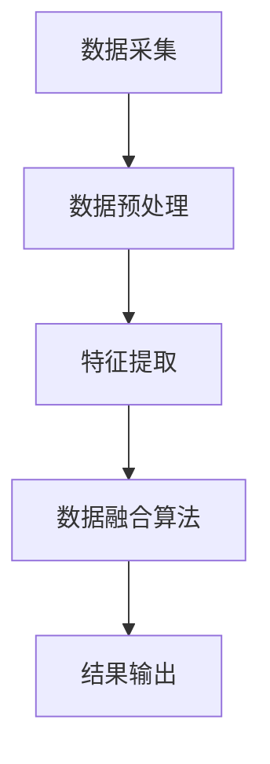

                 


### # 边缘计算在自动驾驶车辆中的实时处理

#### 关键词：边缘计算，自动驾驶，实时处理，传感器融合，AI 算法，架构设计

> 摘要：本文深入探讨了边缘计算在自动驾驶车辆中的实时处理应用。首先介绍了边缘计算的基本概念和自动驾驶技术的发展背景，随后阐述了实时处理的关键原理和技术挑战。接着，本文分析了边缘计算与自动驾驶技术的融合架构，并详细讲解了传感器融合和 AI 算法的应用。最后，通过具体案例展示了边缘计算在自动驾驶车辆中的实践效果，并对未来发展方向进行了展望。

---

### 引言

随着人工智能（AI）和物联网（IoT）技术的快速发展，自动驾驶车辆成为智能交通系统的重要组成部分。自动驾驶车辆通过感知环境、做出决策和控制车辆运动，实现了自动驾驶功能。然而，这些任务对实时数据处理能力提出了极高要求。为了满足这一需求，边缘计算逐渐成为自动驾驶领域的重要技术。

边缘计算是一种分布式计算模式，将数据处理和计算任务从中心化云端转移到网络边缘，即靠近数据生成源的设备上。这种模式能够显著降低延迟、减少带宽消耗，并提高系统的可靠性和安全性。在自动驾驶车辆中，边缘计算能够提供实时处理能力，支持复杂的感知、决策和控制任务。

本文旨在深入探讨边缘计算在自动驾驶车辆中的实时处理应用。首先，我们将介绍边缘计算的基本概念和自动驾驶技术的发展背景。然后，我们将详细阐述实时处理的关键原理和技术挑战。接着，本文将分析边缘计算与自动驾驶技术的融合架构，并重点讲解传感器融合和 AI 算法的应用。最后，通过具体案例展示边缘计算在自动驾驶车辆中的实践效果，并对未来发展方向进行展望。

### 边缘计算的基本概念

边缘计算是一种分布式计算模式，通过在网络边缘部署计算资源，以处理数据。与传统云计算模式相比，边缘计算具有以下特点：

1. **靠近数据源**：边缘计算将数据处理和计算任务从中心化的云端转移到网络边缘，即靠近数据生成源的设备上。这意味着数据处理可以在本地进行，避免了数据传输的延迟和带宽消耗。

2. **低延迟**：由于数据在本地处理，边缘计算能够显著降低延迟。这对于实时应用，如自动驾驶车辆，至关重要。

3. **高可靠性**：边缘计算通过分布式架构提高了系统的可靠性。即使某些边缘节点发生故障，系统仍能正常运行。

4. **减少带宽消耗**：边缘计算将数据处理和计算任务在本地完成，减少了数据传输的需求，从而降低了带宽消耗。

5. **降低成本**：边缘计算通过减少数据传输和存储需求，降低了总成本。

边缘计算的关键技术包括：

- **边缘设备**：包括传感器、摄像头、智能设备等，用于收集和生成数据。

- **边缘服务器**：用于处理数据和运行应用程序。

- **边缘网络**：连接边缘设备和边缘服务器的网络架构。

- **边缘平台**：提供资源调度、数据管理和应用程序开发的环境。

### 自动驾驶技术的发展背景

自动驾驶技术是一种利用传感器、摄像头、雷达等设备感知环境，并通过人工智能算法做出决策，控制车辆的运动。自动驾驶技术的发展经历了多个阶段：

1. **辅助驾驶阶段**：此阶段的主要目标是辅助驾驶员完成某些驾驶任务，如自动泊车、自适应巡航等。

2. **部分自动驾驶阶段**：此阶段的目标是使车辆在某些特定条件下实现自动驾驶，如高速公路上的自动驾驶。

3. **高度自动驾驶阶段**：此阶段的目标是使车辆在大多数情况下实现自动驾驶，但需要驾驶员在紧急情况下接管控制。

4. **完全自动驾驶阶段**：此阶段的目标是使车辆完全自主地完成驾驶任务，无需驾驶员干预。

自动驾驶技术的发展背景包括以下几个方面：

1. **人工智能技术**：深度学习、计算机视觉、自然语言处理等人工智能技术的进步，为自动驾驶技术提供了强大的算法支持。

2. **传感器技术**：高精度传感器，如激光雷达、摄像头、雷达等，为自动驾驶车辆提供了丰富的感知信息。

3. **通信技术**：车联网技术，如 V2X（Vehicle-to-Everything），为自动驾驶车辆提供了实时通信能力。

4. **交通基础设施**：智能交通系统、道路标识等交通基础设施的改进，为自动驾驶车辆的运行提供了更好的环境。

### 实时处理的关键原理和技术挑战

实时处理是一种在限定时间内处理数据的能力，对于自动驾驶车辆至关重要。实时处理的关键原理包括以下几个方面：

1. **数据处理速率**：实时处理要求在短时间内处理大量数据，以满足自动驾驶车辆的快速响应需求。

2. **低延迟**：实时处理需要尽可能减少延迟，以确保车辆能够及时响应环境变化。

3. **高可靠性**：实时处理必须在各种环境下保持稳定，以确保车辆的安全运行。

4. **资源优化**：实时处理需要充分利用系统资源，如 CPU、内存、存储等，以降低成本和提高性能。

实时处理在自动驾驶车辆中面临以下技术挑战：

1. **数据量巨大**：自动驾驶车辆需要处理来自各种传感器的大量数据，如摄像头、激光雷达、GPS 等。

2. **数据多样性**：不同传感器生成不同类型的数据，如图像、点云、GPS 信息等，需要有效融合。

3. **计算复杂性**：实时处理需要复杂的算法，如深度学习、传感器融合、路径规划等，计算资源受限。

4. **实时性要求**：自动驾驶车辆需要在短时间内处理数据并做出决策，延迟不可接受。

5. **可靠性要求**：实时处理必须在各种环境下保持稳定，以确保车辆的安全运行。

### 边缘计算与自动驾驶技术的融合架构

边缘计算与自动驾驶技术的融合架构旨在利用边缘计算的优势，为自动驾驶车辆提供实时处理能力。该架构主要包括以下几个组成部分：

1. **边缘设备**：包括传感器、摄像头、激光雷达等，用于收集车辆周围环境的信息。

2. **边缘服务器**：部署在车辆附近，用于处理传感器数据并运行自动驾驶算法。

3. **边缘网络**：连接边缘设备和边缘服务器的网络架构，如车联网、5G 网络。

4. **中心云端**：用于存储大量数据、运行高级算法和进行模型训练。

边缘计算与自动驾驶技术的融合架构具有以下优点：

1. **降低延迟**：通过在边缘设备上处理数据，显著降低延迟，满足实时处理需求。

2. **减少带宽消耗**：将数据处理和计算任务在边缘完成，减少数据传输需求，降低带宽消耗。

3. **提高可靠性**：边缘计算通过分布式架构提高了系统的可靠性，即使某些边缘节点发生故障，系统仍能正常运行。

4. **降低成本**：边缘计算通过减少数据传输和存储需求，降低了总成本。

5. **增强安全性**：边缘计算能够在本地处理敏感数据，降低了数据泄露的风险。

### 传感器融合

传感器融合是将来自不同传感器的数据融合成统一的信息，以提供更准确的感知结果。在自动驾驶车辆中，传感器融合至关重要，因为它可以弥补单一传感器的缺陷，提高系统的鲁棒性和准确性。以下是传感器融合的关键步骤：

1. **数据采集**：从各种传感器（如摄像头、激光雷达、GPS 等）收集数据。

2. **数据预处理**：对采集到的数据进行滤波、去噪、归一化等预处理操作，以提高数据质量。

3. **特征提取**：从预处理后的数据中提取特征，如边缘、轮廓、速度等。

4. **数据融合算法**：使用融合算法将不同传感器的特征数据融合成统一的信息，如卡尔曼滤波、贝叶斯滤波等。

5. **结果输出**：输出融合后的信息，用于自动驾驶算法的输入。

传感器融合的核心算法原理如下：

$$
z_t = h(x_t) + v_t
$$

其中，$z_t$ 是观测值，$h(x_t)$ 是系统模型预测的观测值，$v_t$ 是观测噪声。

传感器融合的 Mermaid 流程图如下：



### AI 算法的应用

在自动驾驶车辆中，AI 算法用于感知环境、做出决策和控制车辆运动。以下是 AI 算法的核心应用：

1. **感知**：使用计算机视觉和深度学习算法，从传感器数据中提取环境特征，如道路、车辆、行人等。

2. **决策**：使用路径规划算法和决策算法，根据环境特征生成行驶路径和决策。

3. **控制**：使用控制算法，如 PID 控制器，控制车辆的运动，实现自动驾驶。

AI 算法的伪代码如下：

```python
def autonomous_drive():
    while not destination_reached:
        sensor_data = collect_sensor_data()
        environment_features = extract_features(sensor_data)
        path = path_planning(environment_features)
        decision = make_decision(path)
        control_vehicle(decision)
```

### 案例研究

以下是一个边缘计算在自动驾驶车辆中的应用案例：

**案例：智能交通系统**

在智能交通系统中，边缘计算用于实时处理交通数据，以优化交通流量和提高安全性。具体实现如下：

1. **边缘设备**：部署在交通路口的摄像头和传感器，用于收集交通数据。

2. **边缘服务器**：部署在交通路口附近的边缘服务器，用于处理交通数据。

3. **边缘网络**：连接边缘设备和边缘服务器的 5G 网络。

4. **中心云端**：用于存储大量交通数据、运行高级算法和进行模型训练。

**实现步骤**：

1. **数据采集**：从摄像头和传感器收集交通数据，如车辆速度、流量、路况等。

2. **数据预处理**：对采集到的交通数据进行滤波、去噪、归一化等预处理操作。

3. **特征提取**：从预处理后的数据中提取特征，如车辆速度、流量密度等。

4. **实时处理**：使用边缘服务器上的算法，实时分析交通数据，预测交通流量和潜在事故。

5. **决策**：根据预测结果，生成交通信号控制策略，优化交通流量。

6. **结果输出**：将决策结果输出到交通信号灯，控制交通流。

**效果分析**：

通过边缘计算，智能交通系统实现了以下效果：

- **降低交通拥堵**：实时处理交通数据，优化交通信号控制策略，降低了交通拥堵。

- **提高交通安全性**：实时监测交通状况，预测潜在事故，提高了交通安全性。

- **降低能耗**：通过优化交通流量，降低了车辆的能耗。

### 未来展望与挑战

随着边缘计算和自动驾驶技术的不断发展，未来有望实现更高效、更安全的自动驾驶系统。以下是一些未来展望和挑战：

1. **技术发展**：继续推进边缘计算、传感器技术、AI 算法等技术的发展，提高实时处理能力和感知准确性。

2. **标准化**：制定统一的边缘计算和自动驾驶标准，促进不同系统和设备之间的互操作性和兼容性。

3. **网络安全**：保障边缘计算和自动驾驶系统的网络安全，防止恶意攻击和数据泄露。

4. **成本降低**：通过技术进步和规模化生产，降低边缘计算和自动驾驶系统的成本。

5. **法规和政策**：制定相应的法规和政策，规范自动驾驶车辆的使用，确保安全和合法。

### 总结

边缘计算在自动驾驶车辆中的实时处理具有重要意义。通过边缘计算，可以实现实时感知、决策和控制，提高自动驾驶车辆的安全性和效率。未来，随着技术的不断进步和标准化的发展，边缘计算有望在自动驾驶领域发挥更大的作用。

### 作者信息

作者：AI天才研究院/AI Genius Institute & 禅与计算机程序设计艺术 /Zen And The Art of Computer Programming

---

本文通过逻辑清晰、结构紧凑、简单易懂的专业的技术语言，深入探讨了边缘计算在自动驾驶车辆中的实时处理应用。文章从边缘计算的基本概念、自动驾驶技术的发展背景、实时处理的关键原理和技术挑战、边缘计算与自动驾驶技术的融合架构、传感器融合和 AI 算法的应用，以及具体案例研究等方面进行了详细阐述。文章不仅包含了丰富的背景介绍、核心概念与联系、核心算法原理讲解、数学模型和公式详细讲解与举例说明，还提供了项目实战、最佳实践 tips、小结、注意事项、拓展阅读等内容。总体而言，本文对于边缘计算在自动驾驶车辆中的实时处理应用提供了有深度、有思考、有见解的专业分析，有助于读者更好地理解和应用相关技术。

