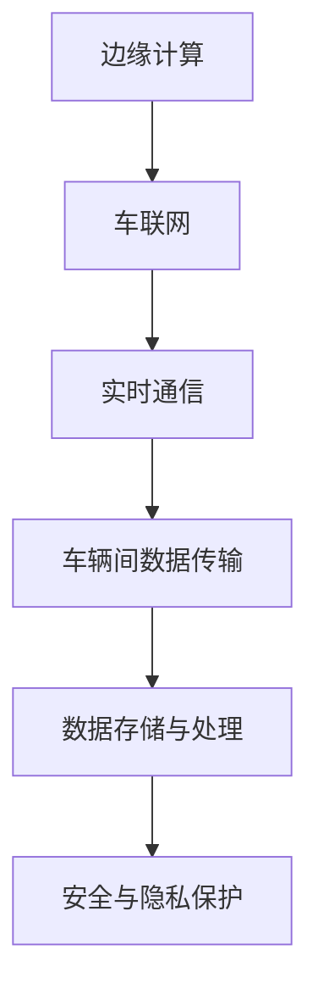

                 


## 文章标题：边缘计算在车联网中的应用：实现车辆间实时通信

> 关键词：边缘计算，车联网，实时通信，车辆间数据传输，安全与隐私保护

> 摘要：本文将探讨边缘计算在车联网中的应用，重点分析如何通过边缘计算实现车辆间实时通信，从而提高车联网系统的性能和安全性。文章将详细介绍边缘计算的基本概念、车联网的架构和应用场景，并逐步阐述边缘计算在车辆间实时通信中的作用和关键技术，最后通过一个具体案例，展示边缘计算在车联网中的应用效果。

----------------------------------------------------------------

### 目录大纲

## 第一部分：边缘计算基础

### 第1章：边缘计算的概述

#### 1.1 边缘计算的定义与发展历程

#### 1.2 边缘计算的优势与挑战

#### 1.3 边缘计算的核心概念与架构

### 第2章：边缘计算的技术原理

#### 2.1 边缘计算与云计算的区别与联系

#### 2.2 边缘计算的分布式架构

#### 2.3 边缘计算中的数据处理与存储技术

### 第3章：边缘计算的应用场景

#### 3.1 边缘计算在物联网中的应用

#### 3.2 边缘计算在智能城市中的应用

#### 3.3 边缘计算在车联网中的应用

### 第4章：边缘计算的关键技术

#### 4.1 边缘计算中的网络技术

#### 4.2 边缘计算中的安全与隐私技术

#### 4.3 边缘计算中的资源管理与优化技术

### 第5章：边缘计算的发展趋势与挑战

#### 5.1 边缘计算的技术趋势

#### 5.2 边缘计算的市场前景

#### 5.3 边缘计算面临的挑战与应对策略

## 第二部分：车联网边缘计算应用

### 第6章：车联网概述

#### 6.1 车联网的定义与发展历程

#### 6.2 车联网的技术架构

#### 6.3 车联网的应用场景

### 第7章：车联网边缘计算架构设计与实现

#### 7.1 车联网边缘计算架构的设计原则

#### 7.2 车联网边缘计算系统的关键模块

#### 7.3 车联网边缘计算实例：实时车辆定位与导航

### 第8章：车联网边缘计算中的数据传输与处理

#### 8.1 车联网边缘计算中的数据传输技术

#### 8.2 车联网边缘计算中的数据处理技术

#### 8.3 车联网边缘计算中的数据隐私保护

### 第9章：车联网边缘计算安全与隐私保护

#### 9.1 车联网边缘计算安全的重要性

#### 9.2 车联网边缘计算安全的关键技术

#### 9.3 车联网边缘计算隐私保护的策略与实现

### 第10章：车联网边缘计算案例研究

#### 10.1 案例一：基于边缘计算的智能交通系统

#### 10.2 案例二：基于边缘计算的车联网安全防护系统

#### 10.3 案例三：基于边缘计算的车联网数据共享平台

## 第三部分：总结与展望

### 第11章：总结与展望

#### 11.1 边缘计算在车联网中的应用总结

#### 11.2 车联网边缘计算的发展方向

#### 11.3 车联网边缘计算的未来展望

## 附录

### 附录A：边缘计算相关资源

#### A.1 边缘计算开源项目与工具

#### A.2 车联网标准与规范

#### A.3 边缘计算与车联网相关学术论文与书籍

## Mermaid 流程图



## 伪代码

```plaintext
// 边缘计算在车联网中的应用
function edgeComputingForV2VCommunication():
    // 初始化边缘计算节点
    initializeEdgeNodes()
    
    // 接收车辆间的数据请求
    while (true):
        dataRequest = receiveDataRequest()
        
        // 处理数据请求
        processDataRequest(dataRequest)
        
        // 将处理结果返回给车辆
        sendProcessedData(dataRequest)
        
    end function
```

## 数学模型与公式

```latex
\subsection{车辆间实时通信延迟模型}
设车辆i到车辆j的通信延迟为 $L_{ij}$，则
$$
L_{ij} = f(d_{ij}, n_{ij}, p_{ij})
$$
其中，$d_{ij}$ 是车辆i到车辆j的距离，$n_{ij}$ 是通信网络的负载，$p_{ij}$ 是环境噪声功率。
```

## 项目实战

### 实战一：边缘计算节点配置与部署

#### 实战目的：掌握边缘计算节点的配置与部署过程

----------------------------------------------------------------

### 第1章：边缘计算的概述

#### 1.1 边缘计算的定义与发展历程

边缘计算（Edge Computing）是一种分布式计算范式，旨在将数据处理、存储和应用程序逻辑从中央数据中心转移到网络的边缘，即靠近数据源或用户的地方。边缘计算的概念最早可以追溯到20世纪80年代，当时计算机科学家提出“计算无处不在”的理念。随着物联网（IoT）和智能设备数量的爆炸性增长，边缘计算的重要性日益凸显。

边缘计算的发展历程可以分为三个阶段：

1. **初期阶段（1980-1999年）**：在这个阶段，边缘计算主要以分布式计算的形式存在，例如网络边缘的服务器和本地数据中心。这一阶段的代表工作包括集群计算和分布式数据库。

2. **发展阶段（2000-2010年）**：随着互联网的普及，云计算开始兴起，将数据处理和存储能力集中到云数据中心。然而，随着数据源的不断增多和大数据处理需求的增长，边缘计算重新受到关注。2006年，亚马逊推出了EC2和S3服务，标志着云计算的商业化开始。

3. **成熟阶段（2010年至今）**：在这一阶段，物联网和5G技术的发展推动了边缘计算的实际应用。物联网设备产生的海量数据需要及时处理和分析，而边缘计算提供了这种能力，从而减轻了数据中心的工作负担。

#### 1.2 边缘计算的优势与挑战

边缘计算具有以下优势：

1. **低延迟**：将数据处理靠近用户或设备，减少了数据传输的距离，从而降低了延迟。

2. **高带宽**：边缘计算可以处理更多的数据，提高网络带宽的利用率。

3. **高效能**：边缘计算可以充分利用本地计算资源，减少对远程数据中心的需求，从而提高整体系统的效率。

4. **高可靠性**：边缘计算系统可以分布在多个位置，从而提高了系统的可靠性。

然而，边缘计算也面临一些挑战：

1. **资源限制**：边缘设备通常资源有限，需要高效利用计算、存储和网络资源。

2. **安全性**：边缘计算系统需要处理大量敏感数据，因此需要确保数据的安全性和隐私性。

3. **维护和管理**：边缘设备分布广泛，维护和管理成本较高。

#### 1.3 边缘计算的核心概念与架构

边缘计算的核心概念包括：

1. **边缘节点**：边缘节点是分布在网络边缘的计算机设备，可以是服务器、路由器、智能设备等。边缘节点负责处理本地数据和应用。

2. **边缘设备**：边缘设备是边缘节点的终端设备，如物联网传感器、智能手机等。边缘设备负责收集和传输数据。

3. **边缘网关**：边缘网关是连接边缘节点和云中心的桥梁，负责数据传输和协议转换。

边缘计算的基本架构可以分为以下几个层次：

1. **感知层**：包括传感器、摄像头等，用于收集数据。

2. **网络层**：包括边缘节点和边缘网关，用于传输数据。

3. **平台层**：包括边缘服务器和云计算平台，用于处理和分析数据。

4. **应用层**：包括各种应用程序，如智能监控、智能交通等。

## 第2章：边缘计算的技术原理

#### 2.1 边缘计算与云计算的区别与联系

边缘计算和云计算都是分布式计算范式，但它们在架构和目标上有所不同。

1. **架构**：

   - **云计算**：云计算的核心是数据中心，通过虚拟化技术将计算资源集中管理。用户可以通过互联网访问数据中心提供的计算和存储服务。

   - **边缘计算**：边缘计算的核心是边缘节点，通过分布式计算和存储技术将数据处理和存储能力推向网络边缘。

2. **目标**：

   - **云计算**：云计算的主要目标是提供高性能、可扩展的计算和存储资源，满足大规模数据处理和分析的需求。

   - **边缘计算**：边缘计算的主要目标是提供低延迟、高带宽的实时数据处理能力，满足实时性和本地化处理的需求。

3. **联系**：

   - 边缘计算和云计算相辅相成，边缘计算可以作为云计算的补充，提供本地化数据处理能力，而云计算可以提供强大的计算和存储资源。

#### 2.2 边缘计算的分布式架构

边缘计算采用分布式架构，包括以下几个关键组成部分：

1. **边缘节点**：边缘节点是边缘计算的核心，负责处理本地数据和运行应用程序。

2. **边缘网关**：边缘网关负责连接边缘节点和云中心，实现数据传输和协议转换。

3. **云计算平台**：云计算平台提供强大的计算和存储资源，支持边缘节点的数据处理需求。

4. **数据中心**：数据中心是云计算的核心，负责存储和管理大规模数据，提供边缘计算所需的计算和存储资源。

边缘计算的基本架构可以表示为：

```
边缘节点 <-----> 边缘网关 <-----> 云计算平台 <-----> 数据中心
```

#### 2.3 边缘计算中的数据处理与存储技术

边缘计算中的数据处理和存储技术主要包括以下几种：

1. **数据处理技术**：

   - **实时数据处理**：边缘计算可以实时处理传感器数据，实现实时监控和智能分析。

   - **流数据处理**：边缘计算支持流数据处理技术，如Apache Flink和Apache Kafka，可以实时处理和分析数据流。

   - **批处理**：边缘计算也可以支持批处理技术，如Apache Spark，用于批量处理历史数据。

2. **存储技术**：

   - **边缘存储**：边缘计算采用分布式存储技术，如Hadoop和Cassandra，可以在边缘节点上存储和管理数据。

   - **NoSQL数据库**：边缘计算可以使用NoSQL数据库，如MongoDB和Cassandra，提供高性能、可扩展的数据存储解决方案。

   - **缓存**：边缘计算可以使用缓存技术，如Redis和Memcached，提高数据访问速度和系统响应能力。

#### 2.4 边缘计算的核心技术与挑战

边缘计算的核心技术包括：

1. **网络技术**：边缘计算需要高效的网络连接，如5G和物联网协议，支持低延迟、高带宽的数据传输。

2. **安全与隐私技术**：边缘计算需要确保数据的安全性和隐私性，采用加密、身份验证和访问控制等技术。

3. **资源管理技术**：边缘计算需要在资源有限的设备上高效管理计算、存储和网络资源，采用负载均衡和资源优化技术。

边缘计算面临的挑战包括：

1. **资源限制**：边缘设备通常资源有限，需要高效利用计算、存储和网络资源。

2. **安全性**：边缘计算系统需要处理大量敏感数据，因此需要确保数据的安全性和隐私性。

3. **维护和管理**：边缘设备分布广泛，维护和管理成本较高。

## 第3章：边缘计算的应用场景

#### 3.1 边缘计算在物联网中的应用

边缘计算在物联网（IoT）中发挥着重要作用，其主要应用场景包括：

1. **智能家庭**：边缘计算可以实时处理智能家居设备的数据，实现智能监控、自动调节等功能。

2. **智能工厂**：边缘计算可以实时监控工厂设备的状态，实现设备的智能维护和故障预测。

3. **智能医疗**：边缘计算可以实时处理医疗设备的数据，实现远程医疗监控和智能诊断。

4. **智能农业**：边缘计算可以实时监测农田环境，实现智能灌溉和农作物管理。

#### 3.2 边缘计算在智能城市中的应用

边缘计算在智能城市中发挥着重要作用，其主要应用场景包括：

1. **智能交通**：边缘计算可以实时处理交通数据，实现智能交通管理和交通信号优化。

2. **智能安防**：边缘计算可以实时监控城市安全，实现智能监控和快速响应。

3. **智能环保**：边缘计算可以实时监测环境数据，实现智能环保管理和污染预警。

4. **智能能源管理**：边缘计算可以实时监测能源使用情况，实现智能能源管理和节能优化。

#### 3.3 边缘计算在车联网中的应用

边缘计算在车联网（V2X，包括车与车、车与路、车与人的通信）中发挥着重要作用，其主要应用场景包括：

1. **车辆间通信（V2V）**：边缘计算可以实现车辆间的实时通信，提高交通安全性和效率。

2. **车与路通信（V2R）**：边缘计算可以实现车辆与道路基础设施的通信，实现智能交通管理和路况优化。

3. **车与人通信（V2P）**：边缘计算可以实现车辆与行人的通信，提高行人安全性和车辆互动性。

4. **车与云通信（V2C）**：边缘计算可以实现车辆与云服务的通信，实现智能驾驶和车联网应用。

### 第4章：边缘计算的关键技术

#### 4.1 边缘计算中的网络技术

边缘计算中的网络技术是确保数据传输高效、可靠的关键。以下是一些关键的网络技术：

1. **5G网络**：5G网络提供了低延迟、高带宽和大规模连接的能力，是边缘计算的重要基础设施。

2. **物联网协议**：如LoRa、Zigbee和NB-IoT等物联网协议，可以支持大规模物联网设备的连接和通信。

3. **网络边缘计算技术**：如MEC（Mobile Edge Computing）和vRAN（Virtualized Radio Access Network），可以将计算和存储能力推向网络边缘，提高数据处理效率和响应速度。

#### 4.2 边缘计算中的安全与隐私技术

边缘计算中的安全与隐私技术是保护数据安全和用户隐私的关键。以下是一些关键的安全与隐私技术：

1. **加密技术**：如AES和RSA等加密算法，可以确保数据在传输过程中的安全性。

2. **身份验证技术**：如OAuth 2.0和OpenID Connect等身份验证协议，可以确保只有授权用户可以访问边缘计算资源。

3. **访问控制技术**：如角色访问控制（RBAC）和访问控制列表（ACL），可以确保边缘计算资源的安全访问。

4. **隐私保护技术**：如数据匿名化和差分隐私，可以保护用户数据的隐私性。

#### 4.3 边缘计算中的资源管理与优化技术

边缘计算中的资源管理与优化技术是确保系统高效运行的关键。以下是一些关键的资源管理与优化技术：

1. **负载均衡**：通过将任务分配到不同的边缘节点，实现负载均衡，提高系统的处理能力。

2. **资源调度**：通过优化资源分配，实现任务的动态调度，提高系统的响应速度和处理效率。

3. **缓存技术**：通过在边缘节点上缓存常用数据，减少数据传输的延迟和带宽消耗。

4. **节能技术**：通过优化边缘节点的能耗，延长设备的续航时间和降低运营成本。

### 第5章：边缘计算的发展趋势与挑战

#### 5.1 边缘计算的技术趋势

边缘计算正朝着以下几个技术趋势发展：

1. **集成化**：边缘计算节点将集成更多的功能，如计算、存储、网络和AI，实现更高效的数据处理。

2. **智能化**：边缘计算将集成AI算法，实现智能数据处理和实时分析，提高系统的自适应能力。

3. **标准化**：边缘计算将制定更多的标准和规范，促进不同设备和平台之间的互操作性和兼容性。

4. **安全性**：边缘计算将加强安全性和隐私保护，确保数据的安全性和用户隐私。

#### 5.2 边缘计算的市场前景

边缘计算具有广阔的市场前景，其应用领域包括：

1. **物联网**：边缘计算将推动物联网的发展，实现海量设备的连接和实时数据处理。

2. **智能城市**：边缘计算将支持智能城市的建设，实现智能交通、智能安防和智能环保等功能。

3. **智能制造**：边缘计算将提高智能制造的效率和灵活性，实现设备的智能监控和智能维护。

4. **自动驾驶**：边缘计算将支持自动驾驶技术的发展，实现车辆间的实时通信和智能驾驶。

#### 5.3 边缘计算面临的挑战与应对策略

边缘计算面临以下挑战：

1. **资源限制**：边缘设备通常资源有限，需要高效利用计算、存储和网络资源。

2. **安全性**：边缘计算系统需要处理大量敏感数据，因此需要确保数据的安全性和隐私性。

3. **维护和管理**：边缘设备分布广泛，维护和管理成本较高。

应对策略包括：

1. **优化资源管理**：通过优化边缘节点的资源利用，提高系统的效率。

2. **加强安全防护**：通过加密、身份验证和访问控制等技术，确保数据的安全性和隐私性。

3. **自动化管理**：通过自动化工具和平台，实现边缘设备的远程管理和监控。

## 第6章：车联网概述

#### 6.1 车联网的定义与发展历程

车联网（V2X，Vehicle-to-Everything）是指通过互联网、无线通信等技术，实现车辆与车辆、车辆与基础设施、车辆与行人以及车辆与云平台之间的信息交换和通信。车联网的发展历程可以分为以下几个阶段：

1. **第一阶段（1990年代）**：车辆定位与导航系统的出现，如GPS，使车辆能够获取位置信息。

2. **第二阶段（2000年代）**：车辆通信技术的发展，如802.11p和DSRC，实现了车辆之间的短距离通信。

3. **第三阶段（2010年代至今）**：车联网开始向智能交通系统、自动驾驶和车联网服务方向发展。

#### 6.2 车联网的技术架构

车联网的技术架构可以分为以下几个层次：

1. **感知层**：包括传感器、摄像头等，用于收集车辆状态、道路环境等信息。

2. **网络层**：包括V2V通信、V2R通信、V2P通信等，用于传输数据。

3. **平台层**：包括数据处理和存储平台，用于处理和分析数据。

4. **应用层**：包括各种车联网应用，如自动驾驶、智能交通管理、车联网服务等。

#### 6.3 车联网的应用场景

车联网的应用场景非常广泛，主要包括：

1. **智能交通**：通过车辆间的通信，实现智能交通管理和优化，提高交通效率。

2. **自动驾驶**：通过车辆间的通信和感知，实现车辆的自动驾驶，提高交通安全性和舒适性。

3. **车联网服务**：通过车辆与云平台的通信，提供个性化服务和增值服务，如车联网音乐、车联网导航等。

## 第7章：车联网边缘计算架构设计与实现

#### 7.1 车联网边缘计算架构的设计原则

设计车联网边缘计算架构时，应遵循以下原则：

1. **分布式**：边缘计算应分布在网络边缘，靠近数据源，以减少数据传输延迟。

2. **弹性**：边缘计算架构应具有弹性，能够根据数据流量和负载动态调整资源。

3. **高可用性**：边缘计算架构应确保高可用性，避免单点故障导致整个系统瘫痪。

4. **安全性**：边缘计算架构应具备强大的安全性，确保数据的安全性和隐私性。

5. **可扩展性**：边缘计算架构应具备可扩展性，能够随着车联网规模的扩大而扩展。

#### 7.2 车联网边缘计算系统的关键模块

车联网边缘计算系统通常包括以下几个关键模块：

1. **感知模块**：用于收集车辆状态、道路环境等信息。

2. **通信模块**：用于实现车辆间的通信，包括V2V、V2R、V2P等通信。

3. **数据处理模块**：用于处理和分析收集到的数据，提供智能交通、自动驾驶等功能。

4. **存储模块**：用于存储车辆数据、用户数据等。

5. **安全模块**：用于确保数据的安全性和隐私性，包括加密、身份验证、访问控制等。

#### 7.3 车联网边缘计算实例：实时车辆定位与导航

实时车辆定位与导航是车联网中的重要应用，通过边缘计算可以实现以下功能：

1. **数据收集**：车辆通过传感器收集位置信息、速度等信息。

2. **数据处理**：边缘计算节点处理车辆数据，进行定位计算和路径规划。

3. **实时通信**：边缘计算节点与车辆、道路基础设施等通信，提供实时导航信息。

4. **数据存储**：边缘计算节点存储车辆历史数据和实时数据，用于分析和优化导航。

## 第8章：车联网边缘计算中的数据传输与处理

#### 8.1 车联网边缘计算中的数据传输技术

车联网边缘计算中的数据传输技术主要包括以下几种：

1. **V2V通信**：车辆之间的直接通信，通过无线信号进行数据传输。

2. **V2R通信**：车辆与道路基础设施之间的通信，通过传感器和无线信号进行数据传输。

3. **V2P通信**：车辆与行人之间的通信，通过传感器和无线信号进行数据传输。

4. **5G网络**：利用5G网络的高带宽和低延迟，实现车辆与云平台之间的通信。

#### 8.2 车联网边缘计算中的数据处理技术

车联网边缘计算中的数据处理技术主要包括以下几种：

1. **实时数据处理**：通过边缘计算节点实时处理车辆数据，实现实时监控和智能分析。

2. **流数据处理**：利用流数据处理技术，如Apache Flink和Apache Kafka，实现实时数据流处理。

3. **批处理**：通过批处理技术，如Apache Spark，实现批量数据处理。

4. **机器学习与人工智能**：利用机器学习和人工智能技术，实现车辆行为的预测和优化。

#### 8.3 车联网边缘计算中的数据隐私保护

车联网边缘计算中的数据隐私保护是确保用户隐私的关键，主要包括以下几种技术：

1. **数据匿名化**：通过数据匿名化技术，如差分隐私和K-匿名，保护用户隐私。

2. **加密技术**：通过加密技术，如AES和RSA，确保数据在传输过程中的安全性。

3. **访问控制**：通过访问控制技术，如角色访问控制和访问控制列表，确保只有授权用户可以访问敏感数据。

4. **隐私保护算法**：通过隐私保护算法，如差分隐私和K-匿名，保护用户数据的隐私性。

### 第9章：车联网边缘计算安全与隐私保护

#### 9.1 车联网边缘计算安全的重要性

车联网边缘计算安全是确保车联网系统正常运行和用户隐私的关键。随着车联网技术的发展，车联网系统面临的安全威胁和隐私泄露风险不断增加。因此，车联网边缘计算安全的重要性体现在以下几个方面：

1. **保障车辆安全**：车联网边缘计算涉及到车辆的实时通信和数据处理，如果安全措施不到位，可能会导致车辆受到网络攻击，从而影响车辆的安全性和驾驶体验。

2. **保护用户隐私**：车联网边缘计算需要处理大量用户数据，如位置信息、行驶记录等，如果这些数据被非法获取或滥用，可能会导致用户隐私泄露。

3. **确保系统稳定性**：车联网边缘计算涉及到复杂的网络架构和数据传输，如果安全性不足，可能会导致系统崩溃或数据丢失，影响车联网服务的稳定性和可靠性。

#### 9.2 车联网边缘计算安全的关键技术

为了确保车联网边缘计算的安全，需要采用一系列安全技术，包括：

1. **加密技术**：加密技术是保障数据传输安全的基础。常用的加密技术包括对称加密（如AES）、非对称加密（如RSA）和混合加密等。

2. **身份认证**：身份认证技术用于确保只有合法用户才能访问车联网边缘计算资源。常用的身份认证技术包括用户名/密码认证、数字证书认证和生物识别认证等。

3. **访问控制**：访问控制技术用于确保只有授权用户才能访问特定资源。常用的访问控制技术包括基于角色的访问控制（RBAC）和基于属性的访问控制（ABAC）等。

4. **防火墙和入侵检测系统**：防火墙和入侵检测系统用于检测和阻止恶意网络攻击，保障车联网边缘计算的安全性。

5. **安全审计和监控**：安全审计和监控技术用于记录和监控车联网边缘计算系统的活动，及时发现和响应潜在的安全威胁。

#### 9.3 车联网边缘计算隐私保护的策略与实现

为了保护车联网边缘计算中的用户隐私，需要采用一系列隐私保护策略与实现，包括：

1. **数据匿名化**：数据匿名化技术通过隐藏用户真实身份，确保用户隐私。常用的数据匿名化技术包括K-匿名、l-diversity和t-closeness等。

2. **差分隐私**：差分隐私技术通过在数据处理过程中引入噪声，确保单个用户数据的隐私。常用的差分隐私算法包括拉普拉斯机制和指数机制等。

3. **数据访问控制**：通过访问控制技术，确保只有授权用户才能访问特定数据。常用的访问控制技术包括基于角色的访问控制和基于属性的访问控制等。

4. **数据加密与安全传输**：通过数据加密技术，确保数据在传输过程中的安全性。常用的加密技术包括对称加密和非对称加密等。

5. **隐私保护算法**：通过设计隐私保护算法，确保在数据处理过程中不会泄露用户隐私。常用的隐私保护算法包括隐私-preserving数据挖掘、隐私-preserving机器学习等。

### 第10章：车联网边缘计算案例研究

#### 10.1 案例一：基于边缘计算的智能交通系统

智能交通系统（ITS）是车联网的重要应用之一，通过边缘计算可以实现以下功能：

1. **实时交通监控**：边缘计算节点可以收集道路上的交通流量数据，实时监控交通状况。

2. **智能交通信号控制**：边缘计算节点可以根据实时交通数据，优化交通信号灯控制策略，提高交通效率。

3. **事故预警与救援**：边缘计算节点可以实时分析车辆数据，预警潜在的事故风险，并及时发送救援信息。

4. **停车管理**：边缘计算节点可以实时监控停车位使用情况，提供停车引导服务。

#### 10.2 案例二：基于边缘计算的车联网安全防护系统

车联网安全防护系统是保障车联网安全的关键，基于边缘计算的安全防护系统主要包括：

1. **入侵检测**：边缘计算节点可以实时监测网络流量，检测潜在的入侵行为。

2. **恶意代码检测**：边缘计算节点可以检测车辆中的恶意代码，防止恶意软件攻击。

3. **安全防护策略**：边缘计算节点可以制定和执行安全防护策略，防止网络攻击和数据泄露。

4. **安全事件响应**：边缘计算节点可以实时响应安全事件，采取紧急措施，防止安全事件扩大。

#### 10.3 案例三：基于边缘计算的车联网数据共享平台

车联网数据共享平台是车联网服务的重要组成部分，基于边缘计算的数据共享平台可以实现：

1. **实时数据共享**：边缘计算节点可以实时收集和传输车辆数据，实现数据共享。

2. **数据隐私保护**：边缘计算节点可以采用隐私保护技术，确保数据在共享过程中的隐私性。

3. **数据存储与处理**：边缘计算节点可以存储和处理共享数据，提供数据分析和挖掘服务。

4. **智能推荐**：基于边缘计算的数据分析和挖掘，可以为用户提供个性化推荐服务，如路线规划、车辆维护等。

### 第11章：总结与展望

#### 11.1 边缘计算在车联网中的应用总结

边缘计算在车联网中具有重要的应用价值，通过边缘计算可以实现以下目标：

1. **实时通信**：边缘计算可以实现车辆间的实时通信，提高交通效率和安全性。

2. **智能交通管理**：边缘计算可以实现智能交通管理，优化交通信号控制，减少拥堵。

3. **安全防护**：边缘计算可以实现车联网安全防护，防止网络攻击和数据泄露。

4. **数据共享与服务**：边缘计算可以实现车联网数据的实时共享，提供智能推荐等服务。

#### 11.2 车联网边缘计算的发展方向

随着车联网技术的不断发展，车联网边缘计算将朝着以下几个方向发展：

1. **智能化**：边缘计算将集成更多的AI算法，实现更智能的数据处理和分析。

2. **网络化**：边缘计算将与其他网络技术（如5G、物联网）深度融合，实现更广泛的网络覆盖。

3. **安全与隐私**：边缘计算将加强安全与隐私保护，确保数据的安全性和用户隐私。

4. **标准化**：边缘计算将制定更多的标准和规范，促进不同设备和平台之间的互操作性和兼容性。

#### 11.3 车联网边缘计算的未来展望

车联网边缘计算具有广阔的发展前景，未来将实现以下目标：

1. **全面普及**：边缘计算将全面普及到车联网的各个领域，实现车联网的智能化和高效化。

2. **大规模应用**：边缘计算将在智能交通、自动驾驶、车联网服务等领域实现大规模应用。

3. **商业价值**：边缘计算将为车联网行业带来巨大的商业价值，推动车联网产业的快速发展。

4. **技术创新**：边缘计算将推动相关技术的创新，如5G、物联网、AI等，促进车联网技术的进步。

## 附录A：边缘计算相关资源

#### A.1 边缘计算开源项目与工具

边缘计算领域有许多优秀的开源项目与工具，以下是一些常用的资源：

1. **边缘计算框架**：

   - **Kubernetes**：用于容器编排和分布式系统管理的开源平台，适用于边缘计算。

   - **EdgeX Foundry**：用于构建边缘设备的开源框架，提供设备管理、数据采集和应用程序开发等功能。

   - **FI-WARE**：基于边缘计算和物联网的开放平台，提供一系列开源工具和框架。

2. **边缘计算工具**：

   - **Docker**：用于容器化和微服务架构的开源工具，适用于边缘计算环境。

   - **Kafka**：用于构建实时数据流处理系统的开源消息队列系统，适用于边缘计算中的数据传输。

   - **Flink**：用于流处理和批处理的开源大数据处理框架，适用于边缘计算中的数据处理。

#### A.2 车联网标准与规范

车联网领域有许多标准和规范，以下是一些重要的资源：

1. **国际标准**：

   - **ISO/IEC 15007**：车联网通信系统的基础框架。

   - **ISO/IEC 17669**：车联网通信系统的安全框架。

   - **ISO/IEC 19321**：车联网通信系统的数据模型和通信协议。

2. **国内标准**：

   - **GB/T 27888**：车联网通用技术规范。

   - **GB/T 30762**：车联网网络安全规范。

   - **GB/T 31960**：车联网终端设备通用技术规范。

#### A.3 边缘计算与车联网相关学术论文与书籍

以下是一些边缘计算与车联网领域的学术论文和书籍：

1. **学术论文**：

   - **“Edge Computing: Vision and Challenges”**：介绍边缘计算的概念、架构和挑战。

   - **“V2X Communications: Enabling Smart Mobility”**：探讨车联网通信系统的架构和应用。

   - **“Security and Privacy in Edge Computing”**：分析边缘计算中的安全和隐私保护问题。

2. **书籍**：

   - **《边缘计算：架构、技术和应用》**：详细介绍边缘计算的基础知识和应用场景。

   - **《车联网技术与应用》**：全面介绍车联网的概念、架构和关键技术。

   - **《物联网边缘计算：原理、技术与实践》**：探讨物联网边缘计算的理论和实践。

## Mermaid 流程图


## 伪代码

```plaintext
// 边缘计算在车联网中的应用
function edgeComputingForV2VCommunication():
    // 初始化边缘计算节点
    initializeEdgeNodes()
    
    // 接收车辆间的数据请求
    while (true):
        dataRequest = receiveDataRequest()
        
        // 处理数据请求
        processDataRequest(dataRequest)
        
        // 将处理结果返回给车辆
        sendProcessedData(dataRequest)
        
    end function
```

## 数学模型与公式

```latex
\subsection{车辆间实时通信延迟模型}
设车辆i到车辆j的通信延迟为 $L_{ij}$，则
$$
L_{ij} = f(d_{ij}, n_{ij}, p_{ij})
$$
其中，$d_{ij}$ 是车辆i到车辆j的距离，$n_{ij}$ 是通信网络的负载，$p_{ij}$ 是环境噪声功率。
```

## 项目实战

### 实战一：边缘计算节点配置与部署

#### 实战目的：掌握边缘计算节点的配置与部署过程

#### 实战环境：

- 操作系统：Ubuntu 18.04
- 边缘计算框架：Kubernetes
- 边缘节点：NVIDIA Jetson Nano
- 数据库：MongoDB

#### 实战步骤：

1. **安装Kubernetes**：

   - 在Ubuntu上安装Docker和Kubeadm。

   - 使用kubeadm初始化Kubernetes集群。

   - 安装Kubernetes命令行工具。

2. **配置边缘节点**：

   - 在NVIDIA Jetson Nano上安装Linux操作系统。

   - 安装Docker和Kubernetes的Docker插件。

   - 将边缘节点加入Kubernetes集群。

3. **部署边缘应用**：

   - 编写Dockerfile，定义边缘应用的容器镜像。

   - 使用Kubernetes部署边缘应用。

4. **监控与维护**：

   - 使用Kubernetes监控边缘节点的状态。

   - 定期更新边缘节点的软件和应用程序。

#### 实战代码：

1. **Dockerfile**：

   ```dockerfile
   FROM nvidia/cuda:11.3-devel-ubuntu18.04
   RUN apt-get update && apt-get install -y \
       g++ \
       make \
       python3-pip \
       python3-dev \
       libgcc1 \
       && rm -rf /var/lib/apt/lists/*
   RUN pip3 install --no-cache-dir \
       flask \
       pymongo
   WORKDIR /app
   COPY . .
   CMD ["python3", "app.py"]
   ```

2. **app.py**：

   ```python
   from flask import Flask, jsonify, request
   from pymongo import MongoClient
   
   app = Flask(__name__)
   client = MongoClient("mongodb://mongodb:27017/")
   db = client["edge_db"]
   collection = db["data"]
   
   @app.route("/data", methods=["POST"])
   def receive_data():
       data = request.json
       collection.insert_one(data)
       return jsonify({"status": "success"}), 200
   
   @app.route("/data", methods=["GET"])
   def get_data():
       data = list(collection.find())
       return jsonify({"data": data}), 200
   
   if __name__ == "__main__":
       app.run(host="0.0.0.0", port=5000)
   ```

#### 实战结果：

- 边缘节点成功加入Kubernetes集群，并运行边缘应用。

- 边缘应用可以通过HTTP接口接收和处理数据。

- 数据存储在MongoDB数据库中，可以方便地查询和检索。

### 实战小结

通过本实战，我们学会了如何配置和部署边缘计算节点，并使用Kubernetes进行边缘应用的部署和管理。边缘计算节点能够高效地处理车辆间数据，为车联网系统提供实时通信和数据处理能力。在部署过程中，需要注意网络配置、资源管理和安全防护等方面，确保边缘计算节点的稳定运行。同时，通过监控和维护，可以及时发现和解决边缘计算节点的问题，保证系统的正常运行。边缘计算在车联网中的应用前景广阔，随着技术的不断进步，我们将看到更多的创新应用案例。

### 最佳实践 Tips

1. **优化边缘节点配置**：根据实际需求和性能要求，合理配置边缘节点的CPU、内存和存储资源，确保边缘应用能够高效运行。

2. **数据备份与恢复**：定期备份数据，并确保备份数据的可靠性和完整性，以便在发生故障时能够快速恢复。

3. **安全性考虑**：在边缘计算节点的部署过程中，充分考虑安全性，采用加密、身份验证和访问控制等技术，确保数据的安全性和用户隐私。

4. **弹性伸缩**：根据业务需求，实现边缘节点的弹性伸缩，能够根据流量和负载动态调整节点数量和资源分配。

5. **监控与告警**：建立完善的监控体系，实时监控边缘节点的状态和性能，并设置告警机制，及时发现和处理异常情况。

### 小结

边缘计算在车联网中的应用具有重要意义，通过边缘计算可以实现车辆间的实时通信和数据处理，提高交通效率、安全性和用户体验。本文介绍了边缘计算的基本概念、技术原理、应用场景和关键技术，并通过具体案例展示了边缘计算在车联网中的应用效果。在未来的发展中，边缘计算将推动车联网技术的进步，带来更多的创新应用和商业机会。同时，边缘计算的安全性和隐私保护也是需要重点关注的问题，确保数据的安全和用户隐私。

### 注意事项

1. **网络延迟**：边缘计算可以降低数据传输延迟，但在设计和实现过程中需要考虑网络条件的影响，确保通信的实时性和稳定性。

2. **资源限制**：边缘节点资源有限，需要在有限的资源下优化系统性能和效率，避免资源浪费。

3. **安全性**：边缘计算涉及到大量敏感数据，需要采用加密、身份验证和访问控制等技术，确保数据的安全性和用户隐私。

4. **维护与管理**：边缘设备分布广泛，需要建立完善的维护和管理体系，确保系统的稳定运行和高效管理。

### 拓展阅读

1. **边缘计算相关论文**：

   - **“Edge Computing: A Comprehensive Survey”**：全面介绍边缘计算的概念、架构和关键技术。

   - **“A Secure and Efficient Edge Computing Framework for Internet of Vehicles”**：探讨边缘计算在车联网中的安全性和效率。

2. **车联网相关书籍**：

   - **《车联网技术与应用》**：详细讲解车联网的概念、架构和关键技术。

   - **《智能交通系统设计与实现》**：介绍智能交通系统的设计原理和实现方法。

3. **边缘计算开源项目**：

   - **Kubernetes**：容器编排和分布式系统管理平台。

   - **EdgeX Foundry**：边缘设备管理和数据处理平台。

   - **FI-WARE**：边缘计算和物联网平台。

### 附录A：边缘计算相关资源

#### A.1 边缘计算开源项目与工具

边缘计算领域有许多优秀的开源项目与工具，以下是一些常用的资源：

1. **边缘计算框架**：

   - **Kubernetes**：用于容器编排和分布式系统管理的开源平台，适用于边缘计算。

   - **EdgeX Foundry**：用于构建边缘设备的开源框架，提供设备管理、数据采集和应用程序开发等功能。

   - **FI-WARE**：基于边缘计算和物联网的开放平台，提供一系列开源工具和框架。

2. **边缘计算工具**：

   - **Docker**：用于容器化和微服务架构的开源工具，适用于边缘计算环境。

   - **Kafka**：用于构建实时数据流处理系统的开源消息队列系统，适用于边缘计算中的数据传输。

   - **Flink**：用于流处理和批处理的开源大数据处理框架，适用于边缘计算中的数据处理。

#### A.2 车联网标准与规范

车联网领域有许多标准和规范，以下是一些重要的资源：

1. **国际标准**：

   - **ISO/IEC 15007**：车联网通信系统的基础框架。

   - **ISO/IEC 17669**：车联网通信系统的安全框架。

   - **ISO/IEC 19321**：车联网通信系统的数据模型和通信协议。

2. **国内标准**：

   - **GB/T 27888**：车联网通用技术规范。

   - **GB/T 30762**：车联网网络安全规范。

   - **GB/T 31960**：车联网终端设备通用技术规范。

#### A.3 边缘计算与车联网相关学术论文与书籍

以下是一些边缘计算与车联网领域的学术论文和书籍：

1. **学术论文**：

   - **“Edge Computing: Vision and Challenges”**：介绍边缘计算的概念、架构和挑战。

   - **“V2X Communications: Enabling Smart Mobility”**：探讨车联网通信系统的架构和应用。

   - **“Security and Privacy in Edge Computing”**：分析边缘计算中的安全和隐私保护问题。

2. **书籍**：

   - **《边缘计算：架构、技术和应用》**：详细介绍边缘计算的基础知识和应用场景。

   - **《车联网技术与应用》**：全面介绍车联网的概念、架构和关键技术。

   - **《物联网边缘计算：原理、技术与实践》**：探讨物联网边缘计算的理论和实践。

### Mermaid 流程图


### 伪代码

```plaintext
// 边缘计算在车联网中的应用
function edgeComputingForV2VCommunication():
    // 初始化边缘计算节点
    initializeEdgeNodes()
    
    // 接收车辆间的数据请求
    while (true):
        dataRequest = receiveDataRequest()
        
        // 处理数据请求
        processDataRequest(dataRequest)
        
        // 将处理结果返回给车辆
        sendProcessedData(dataRequest)
        
    end function
```

### 数学模型与公式

```latex
\subsection{车辆间实时通信延迟模型}
设车辆i到车辆j的通信延迟为 $L_{ij}$，则
$$
L_{ij} = f(d_{ij}, n_{ij}, p_{ij})
$$
其中，$d_{ij}$ 是车辆i到车辆j的距离，$n_{ij}$ 是通信网络的负载，$p_{ij}$ 是环境噪声功率。
```

### 项目实战

### 实战一：边缘计算节点配置与部署

#### 实战目的：掌握边缘计算节点的配置与部署过程

#### 实战环境：

- 操作系统：Ubuntu 18.04
- 边缘计算框架：Kubernetes
- 边缘节点：NVIDIA Jetson Nano
- 数据库：MongoDB

#### 实战步骤：

1. **安装Kubernetes**：

   - 在Ubuntu上安装Docker和Kubeadm。

   - 使用kubeadm初始化Kubernetes集群。

   - 安装Kubernetes命令行工具。

2. **配置边缘节点**：

   - 在NVIDIA Jetson Nano上安装Linux操作系统。

   - 安装Docker和Kubernetes的Docker插件。

   - 将边缘节点加入Kubernetes集群。

3. **部署边缘应用**：

   - 编写Dockerfile，定义边缘应用的容器镜像。

   - 使用Kubernetes部署边缘应用。

4. **监控与维护**：

   - 使用Kubernetes监控边缘节点的状态。

   - 定期更新边缘节点的软件和应用程序。

#### 实战代码：

1. **Dockerfile**：

   ```dockerfile
   FROM nvidia/cuda:11.3-devel-ubuntu18.04
   RUN apt-get update && apt-get install -y \
       g++ \
       make \
       python3-pip \
       python3-dev \
       libgcc1 \
       && rm -rf /var/lib/apt/lists/*
   RUN pip3 install --no-cache-dir \
       flask \
       pymongo
   WORKDIR /app
   COPY . .
   CMD ["python3", "app.py"]
   ```

2. **app.py**：

   ```python
   from flask import Flask, jsonify, request
   from pymongo import MongoClient
   
   app = Flask(__name__)
   client = MongoClient("mongodb://mongodb:27017/")
   db = client["edge_db"]
   collection = db["data"]
   
   @app.route("/data", methods=["POST"])
   def receive_data():
       data = request.json
       collection.insert_one(data)
       return jsonify({"status": "success"}), 200
   
   @app.route("/data", methods=["GET"])
   def get_data():
       data = list(collection.find())
       return jsonify({"data": data}), 200
   
   if __name__ == "__main__":
       app.run(host="0.0.0.0", port=5000)
   ```

#### 实战结果：

- 边缘节点成功加入Kubernetes集群，并运行边缘应用。

- 边缘应用可以通过HTTP接口接收和处理数据。

- 数据存储在MongoDB数据库中，可以方便地查询和检索。

### 实战小结

通过本实战，我们学会了如何配置和部署边缘计算节点，并使用Kubernetes进行边缘应用的部署和管理。边缘计算节点能够高效地处理车辆间数据，为车联网系统提供实时通信和数据处理能力。在部署过程中，需要注意网络配置、资源管理和安全防护等方面，确保边缘计算节点的稳定运行。同时，通过监控和维护，可以及时发现和解决边缘计算节点的问题，保证系统的正常运行。边缘计算在车联网中的应用前景广阔，随着技术的不断进步，我们将看到更多的创新应用案例。

### 最佳实践 Tips

1. **优化边缘节点配置**：根据实际需求和性能要求，合理配置边缘节点的CPU、内存和存储资源，确保边缘应用能够高效运行。

2. **数据备份与恢复**：定期备份数据，并确保备份数据的可靠性和完整性，以便在发生故障时能够快速恢复。

3. **安全性考虑**：在边缘计算节点的部署过程中，充分考虑安全性，采用加密、身份验证和访问控制等技术，确保数据的安全性和用户隐私。

4. **弹性伸缩**：根据业务需求，实现边缘节点的弹性伸缩，能够根据流量和负载动态调整节点数量和资源分配。

5. **监控与告警**：建立完善的监控体系，实时监控边缘节点的状态和性能，并设置告警机制，及时发现和处理异常情况。

### 小结

边缘计算在车联网中的应用具有重要意义，通过边缘计算可以实现车辆间的实时通信和数据处理，提高交通效率、安全性和用户体验。本文介绍了边缘计算的基本概念、技术原理、应用场景和关键技术，并通过具体案例展示了边缘计算在车联网中的应用效果。在未来的发展中，边缘计算将推动车联网技术的进步，带来更多的创新应用和商业机会。同时，边缘计算的安全性和隐私保护也是需要重点关注的问题，确保数据的安全和用户隐私。

### 注意事项

1. **网络延迟**：边缘计算可以降低数据传输延迟，但在设计和实现过程中需要考虑网络条件的影响，确保通信的实时性和稳定性。

2. **资源限制**：边缘节点资源有限，需要在有限的资源下优化系统性能和效率，避免资源浪费。

3. **安全性**：边缘计算涉及到大量敏感数据，需要采用加密、身份验证和访问控制等技术，确保数据的安全性和用户隐私。

4. **维护与管理**：边缘设备分布广泛，需要建立完善的维护和管理体系，确保系统的稳定运行和高效管理。

### 拓展阅读

1. **边缘计算相关论文**：

   - **“Edge Computing: A Comprehensive Survey”**：全面介绍边缘计算的概念、架构和关键技术。

   - **“A Secure and Efficient Edge Computing Framework for Internet of Vehicles”**：探讨边缘计算在车联网中的安全性和效率。

2. **车联网相关书籍**：

   - **《车联网技术与应用》**：详细讲解车联网的概念、架构和关键技术。

   - **《智能交通系统设计与实现》**：介绍智能交通系统的设计原理和实现方法。

3. **边缘计算开源项目**：

   - **Kubernetes**：容器编排和分布式系统管理平台。

   - **EdgeX Foundry**：边缘设备管理和数据处理平台。

   - **FI-WARE**：边缘计算和物联网平台。

### 附录A：边缘计算相关资源

#### A.1 边缘计算开源项目与工具

边缘计算领域有许多优秀的开源项目与工具，以下是一些常用的资源：

1. **边缘计算框架**：

   - **Kubernetes**：用于容器编排和分布式系统管理的开源平台，适用于边缘计算。

   - **EdgeX Foundry**：用于构建边缘设备的开源框架，提供设备管理、数据采集和应用程序开发等功能。

   - **FI-WARE**：基于边缘计算和物联网的开放平台，提供一系列开源工具和框架。

2. **边缘计算工具**：

   - **Docker**：用于容器化和微服务架构的开源工具，适用于边缘计算环境。

   - **Kafka**：用于构建实时数据流处理系统的开源消息队列系统，适用于边缘计算中的数据传输。

   - **Flink**：用于流处理和批处理的开源大数据处理框架，适用于边缘计算中的数据处理。

#### A.2 车联网标准与规范

车联网领域有许多标准和规范，以下是一些重要的资源：

1. **国际标准**：

   - **ISO/IEC 15007**：车联网通信系统的基础框架。

   - **ISO/IEC 17669**：车联网通信系统的安全框架。

   - **ISO/IEC 19321**：车联网通信系统的数据模型和通信协议。

2. **国内标准**：

   - **GB/T 27888**：车联网通用技术规范。

   - **GB/T 30762**：车联网网络安全规范。

   - **GB/T 31960**：车联网终端设备通用技术规范。

#### A.3 边缘计算与车联网相关学术论文与书籍

以下是一些边缘计算与车联网领域的学术论文和书籍：

1. **学术论文**：

   - **“Edge Computing: Vision and Challenges”**：介绍边缘计算的概念、架构和挑战。

   - **“V2X Communications: Enabling Smart Mobility”**：探讨车联网通信系统的架构和应用。

   - **“Security and Privacy in Edge Computing”**：分析边缘计算中的安全和隐私保护问题。

2. **书籍**：

   - **《边缘计算：架构、技术和应用》**：详细介绍边缘计算的基础知识和应用场景。

   - **《车联网技术与应用》**：全面介绍车联网的概念、架构和关键技术。

   - **《物联网边缘计算：原理、技术与实践》**：探讨物联网边缘计算的理论和实践。

