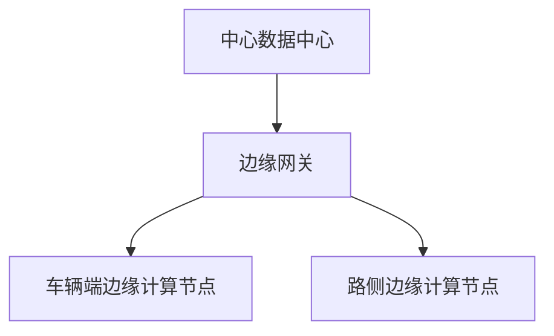

                 

## 文章标题

边缘计算在车联网中的应用：实现车辆间实时通信

### 关键词

边缘计算、车联网、实时通信、自动驾驶、智能交通

### 摘要

随着车联网技术的快速发展，车辆间的实时通信成为实现智能交通、自动驾驶等应用的关键。边缘计算作为一种新兴的计算模式，通过在网络的边缘节点上进行数据处理和计算，能够显著提升车辆通信的实时性和效率。本文详细探讨了边缘计算在车联网中的应用，包括其核心概念、技术原理、架构设计、安全性挑战以及实际项目案例，旨在为读者提供关于边缘计算在车联网领域应用的全面理解和实践指导。

---

### 1.1 车联网与边缘计算概述

#### 车联网的基本概念与演进

车联网（Internet of Vehicles，IoV）是物联网（Internet of Things，IoT）在交通领域的延伸，它通过将车辆、道路、基础设施以及人通过网络连接起来，实现信息的交换和共享。车联网的发展可以分为三个阶段：

1. **信息共享阶段**：初期阶段，车辆主要通过网络共享车辆状态信息，如位置、速度等。
2. **协同控制阶段**：随着技术的发展，车辆开始具备一定的协同控制能力，通过车联网实现交通流优化、事故预警等。
3. **智能化阶段**：未来的车联网将实现高度智能化，自动驾驶、车联网安全等将成为核心应用。

#### 边缘计算的定义与重要性

边缘计算是一种分布式计算架构，旨在将计算、存储和网络功能下沉到网络的边缘节点，如传感器、路由器等。其核心思想是将数据处理靠近数据源，从而减少数据传输延迟，提高系统的响应速度。边缘计算在车联网中的应用具有重要意义：

1. **实时性需求**：车联网中的许多应用，如自动驾驶、车联网安全等，对实时性有极高的要求，边缘计算能够显著降低通信延迟，满足这些应用的需求。
2. **数据传输效率**：边缘计算通过在边缘节点进行数据处理，减少了大量数据传输到中心数据中心的负担，提高了数据传输的效率。
3. **安全性**：边缘计算将计算能力分散到网络的边缘，降低了中心化的安全隐患，提高了系统的安全性。

#### 车联网面临的问题与挑战

车联网在发展过程中面临诸多挑战，其中最关键的是实时性需求、数据传输效率问题和安全性问题。

1. **实时性需求**：自动驾驶、车联网安全等应用对实时性有极高要求，延迟会导致严重的安全事故。传统的云计算模式由于数据传输距离远，难以满足这些应用的需求。
2. **数据传输效率问题**：车联网中产生的数据量巨大，如果全部传输到中心数据中心进行处理，会导致网络拥堵，降低系统效率。
3. **安全性问题**：车联网涉及大量敏感数据，如车辆位置、行驶轨迹等，传统的云计算模式中心化架构容易成为黑客攻击的目标，导致数据泄露和系统瘫痪。

#### 边缘计算在车联网中的应用前景

边缘计算在车联网中的应用前景广阔：

1. **提升车辆间通信效率**：边缘计算能够显著降低车辆通信的延迟，提高通信效率，实现车辆间的实时通信。
2. **增强自动驾驶系统可靠性**：边缘计算能够在车辆本地进行实时数据处理和决策，提高自动驾驶系统的响应速度和可靠性。
3. **改善用户体验**：边缘计算可以降低数据传输延迟，提高系统响应速度，改善用户的驾驶体验。

#### 车联网通信协议

车联网通信协议是车联网实现通信的关键技术。目前，主要的车辆通信协议包括：

1. **DSRC（Dedicated Short-Range Communication）**：DSRC是一种短距离无线通信技术，主要用于车辆与车辆之间、车辆与路侧设备之间的通信。
2. **LTE-V2X（LTE for V2X）**：LTE-V2X是基于LTE网络的V2X（Vehicle-to-Everything）通信技术，能够在较远的距离上实现车辆与车辆、车辆与基础设施之间的通信。
3. **5G NR-V2X（5G New Radio for V2X）**：5G NR-V2X是利用5G新空口技术实现的V2X通信，具有更高的通信速率和更低的延迟，能够支持更复杂的通信应用。

#### 车联网通信协议的演进

车联网通信协议正在不断发展：

1. **当前通信协议的不足**：DSRC和LTE-V2X在通信速率、延迟等方面存在一定局限，无法完全满足未来车联网的需求。
2. **未来通信协议的发展方向**：未来的车联网通信协议将朝着更高通信速率、更低延迟、更高可靠性的方向发展，如6G NR-V2X等。

---

### 1.2 边缘计算在车联网中的应用

边缘计算在车联网中的应用主要集中在以下几个方面：

#### 车辆间实时通信

车辆间实时通信是实现车联网核心功能的重要一环。边缘计算通过在车辆的边缘节点上进行数据处理和计算，能够实现车辆间的实时通信，提高通信效率和可靠性。具体应用包括：

1. **车辆协同控制**：通过车辆间的实时通信，实现交通流优化、事故预警等协同控制功能。
2. **道路状况监测**：车辆通过实时通信共享道路信息，帮助驾驶者更好地了解道路状况，提高行车安全。

#### 自动驾驶

边缘计算在自动驾驶中扮演着关键角色。自动驾驶系统需要对周围环境进行实时感知、分析和决策。边缘计算能够在车辆的边缘节点上进行这些计算任务，降低延迟，提高自动驾驶系统的响应速度和可靠性。具体应用包括：

1. **感知环境**：边缘计算能够实时处理车辆感知到的数据，如摄像头、雷达等，提高感知的准确性和效率。
2. **路径规划与决策**：边缘计算能够实时分析环境数据，生成最优的路径规划和驾驶策略。

#### 智能交通系统

边缘计算在智能交通系统中也有着广泛的应用。通过在路侧设备和车辆的边缘节点上部署计算资源，可以实现对交通流量的实时监测和管理，提高交通管理的效率和安全性。具体应用包括：

1. **交通流量监测**：边缘计算能够实时监测交通流量，为交通管理提供数据支持。
2. **事故预警与应急响应**：边缘计算能够实时分析道路信息，提前预警事故，并协调应急响应。

---

通过以上分析，我们可以看到边缘计算在车联网中的应用前景十分广阔。它能够显著提升车联网的实时性、数据传输效率和安全性，为智能交通、自动驾驶等应用提供强有力的技术支持。未来，随着边缘计算技术的不断发展，车联网将实现更加智能化、高效化的应用场景。## 2. 边缘计算基础

### 2.1 边缘计算原理

边缘计算（Edge Computing）是一种分布式计算架构，其主要思想是将计算、存储和网络功能从传统的集中式数据中心转移到网络的边缘节点。这些边缘节点通常位于数据源附近，如传感器、路由器、物联网设备等。边缘计算的核心原理可以概括为以下几点：

1. **数据处理靠近数据源**：边缘计算通过将数据处理和计算任务从远程数据中心转移到边缘节点，减少了数据传输的延迟和带宽消耗，提高了系统的响应速度。
2. **分布式计算架构**：边缘计算采用分布式计算架构，通过在多个边缘节点上部署计算资源，实现计算任务的分布和并行处理，提高了系统的处理能力和可靠性。
3. **智能化与自适应**：边缘计算具有智能化和自适应能力，能够根据实际需求和网络状况动态调整计算资源的分配，优化系统的性能和效率。

#### 边缘计算的核心架构

边缘计算的核心架构通常包括以下几个关键组成部分：

1. **边缘节点（Edge Nodes）**：边缘节点是边缘计算架构中的基本计算单元，通常部署在靠近数据源的位置，如传感器、路由器、物联网设备等。边缘节点负责处理和计算本地数据，并提供访问其他边缘节点和中心数据中心的接口。
2. **边缘网关（Edge Gateways）**：边缘网关是连接边缘节点和中心数据中心的桥梁，负责管理和协调边缘节点的通信和数据传输。边缘网关通常具备边缘计算功能，如数据处理、缓存管理、安全控制等。
3. **边缘云（Edge Cloud）**：边缘云是边缘计算架构中的云服务部分，它提供云资源和服务，如存储、计算、数据库等，支持边缘节点的远程计算和数据处理需求。
4. **中心数据中心（Central Data Center）**：中心数据中心是边缘计算架构中的核心部分，负责存储和管理大量数据，提供大规模的计算能力和数据资源，支持边缘节点的远程计算任务。

#### 边缘计算技术发展

边缘计算技术经历了多个发展阶段：

1. **早期边缘计算技术**：早期的边缘计算技术主要集中在嵌入式系统、物联网设备等，如简单的数据处理、数据采集等。这些技术主要解决局部范围内的数据处理和通信问题。
2. **中间件技术**：随着物联网和移动互联网的发展，边缘计算技术逐渐引入中间件，如边缘服务器、边缘网关等，实现了更复杂的计算和通信功能。这些中间件能够管理和协调多个边缘节点的通信和数据传输，提高了系统的性能和可靠性。
3. **智能边缘计算**：当前，边缘计算技术正在朝着智能化和自适应方向演进。智能边缘计算通过引入人工智能、大数据等先进技术，实现了边缘节点的智能化处理和自适应调整，提高了系统的智能化水平和数据处理能力。

#### 边缘计算的关键挑战

尽管边缘计算在提升系统性能和效率方面具有显著优势，但其发展仍然面临一系列关键挑战：

1. **能耗问题**：边缘计算通常涉及大量设备，包括传感器、路由器等，这些设备的能耗较高，对能源供应和可持续性提出了挑战。
2. **安全性问题**：边缘计算将计算能力分散到网络的边缘，增加了系统的攻击面，面临更多的安全风险和威胁。
3. **网络稳定性问题**：边缘计算依赖于稳定的网络连接，网络中断和延迟等问题会影响系统的正常运行和性能。

### 总结

边缘计算是一种分布式计算架构，通过将计算、存储和网络功能下沉到网络的边缘节点，能够显著提升系统的实时性、数据传输效率和可靠性。边缘计算的发展经历了多个阶段，从早期的简单数据处理到当前的智能化和自适应演进。尽管面临能耗、安全性和网络稳定性等挑战，但边缘计算在车联网、智能家居、智能交通等领域具有广阔的应用前景。## 3. 车联网通信协议

### 3.1 车联网通信协议概述

车联网通信协议是车联网实现信息交换和通信的核心技术，它决定了车辆之间、车辆与路侧设备之间以及车辆与互联网之间的通信方式和数据传输效率。车联网通信协议主要分为以下几个层次：

1. **物理层**：负责数据在传输介质上的物理传输，包括无线传输和有线传输。
2. **数据链路层**：负责在物理层提供的数据上进行数据封装、传输和错误检测。
3. **网络层**：负责数据包的路由和传输，确保数据能够到达正确的目的地。
4. **传输层**：负责数据流的传输控制，确保数据的可靠传输。
5. **应用层**：负责提供具体的通信服务，如车辆定位、路径规划等。

#### 常见的通信协议

在车联网领域，常见的通信协议包括：

1. **DSRC（Dedicated Short-Range Communication）**：DSRC是一种基于专用短程通信技术的无线通信协议，主要用于车辆与车辆之间、车辆与路侧设备之间的通信。DSRC使用的是专用频段，通信距离一般在100米以内，具有高可靠性和低延迟的特点。

2. **LTE-V2X（LTE for V2X）**：LTE-V2X是基于LTE网络技术的车联网通信协议，它扩展了LTE网络的应用场景，使其能够支持车辆与车辆、车辆与路侧设备以及车辆与互联网之间的通信。LTE-V2X的通信距离一般在1公里以内，具有高带宽和低延迟的特点。

3. **5G NR-V2X（5G New Radio for V2X）**：5G NR-V2X是基于5G新空口技术的车联网通信协议，它利用5G网络的高带宽、低延迟和高可靠性特点，实现了更广泛的应用场景。5G NR-V2X的通信距离可达数十公里，能够支持高速移动的车辆之间的通信，是实现智能交通、自动驾驶等应用的关键技术。

#### 车辆间通信协议

车辆间通信协议是车联网通信协议的重要组成部分，主要用于实现车辆之间的实时通信和数据交换。常见的车辆间通信协议包括：

1. **DSRC**：DSRC通过无线通信技术实现车辆之间的实时通信，通信距离一般在100米以内，适用于短距离的车辆通信，如车辆之间的碰撞预警和交通信息共享。

2. **LTE-V2X**：LTE-V2X通过LTE网络实现车辆之间的通信，通信距离一般在1公里以内，适用于中等距离的车辆通信，如车辆之间的交通信息共享和协同控制。

3. **5G NR-V2X**：5G NR-V2X通过5G网络实现车辆之间的通信，通信距离可达数十公里，适用于长距离的车辆通信，如车辆与路侧设备之间的通信和自动驾驶车辆的协同控制。

#### 车联网通信协议的演进

车联网通信协议的发展经历了多个阶段，从早期的DSRC到当前的LTE-V2X和5G NR-V2X，通信技术不断升级，通信距离和带宽不断扩展。未来，随着通信技术的进一步发展，车联网通信协议将继续演进：

1. **更高频率的无线通信**：未来的车联网通信协议可能会使用更高频率的无线通信技术，如毫米波通信，实现更高的通信速率和更远的通信距离。

2. **更智能的通信协议**：未来的车联网通信协议将更加智能化，能够根据车辆的位置、速度和交通状况动态调整通信参数，实现最优的通信效果。

3. **更安全的通信协议**：随着车联网应用场景的扩展，车联网通信协议的安全性将越来越重要。未来的车联网通信协议将引入更多的安全机制，确保通信数据的安全性和可靠性。

### 总结

车联网通信协议是实现车联网信息交换和通信的关键技术，其发展经历了多个阶段，从早期的DSRC到当前的LTE-V2X和5G NR-V2X。未来，随着通信技术的进一步发展，车联网通信协议将继续演进，实现更高通信速率、更远通信距离和更智能、更安全的通信体验。## 4. 边缘计算在车联网中的应用场景

边缘计算在车联网中的应用场景丰富多样，其核心目的是通过在网络的边缘节点上进行实时数据处理和计算，提高车联网系统的实时性、可靠性和效率。以下详细探讨边缘计算在车联网中几个主要应用场景的作用和重要性。

### 4.1 车辆间实时通信

车辆间实时通信是实现车联网核心功能的重要一环。边缘计算通过在车辆的边缘节点上进行数据处理和计算，能够实现车辆间的实时通信，提高通信效率和可靠性。具体应用包括：

1. **协同控制**：边缘计算能够在车辆本地进行数据预处理和实时分析，实现车辆间的协同控制。例如，车辆可以实时共享交通信息，协同调整行驶速度和方向，优化交通流。
   
   **Mermaid 流程图**

   ```mermaid
   graph TD
   A[车辆A传感器数据] --> B[边缘计算节点预处理]
   B --> C[车辆B传感器数据]
   C --> D[边缘计算节点预处理]
   D --> E[协同控制决策]
   E --> F[车辆A执行决策]
   F --> G[车辆B执行决策]
   ```

2. **交通信息共享**：边缘计算可以实时处理车辆共享的交通信息，如道路拥堵情况、前方事故预警等，为驾驶者提供实时交通信息，改善驾驶体验。

   **伪代码**

   ```python
   def process_traffic_info(vehicle_a_data, vehicle_b_data):
       # 边缘节点预处理交通信息
       processed_data_a = preprocess_data(vehicle_a_data)
       processed_data_b = preprocess_data(vehicle_b_data)
       
       # 实时分析交通信息
       traffic_info = analyze_traffic_info(processed_data_a, processed_data_b)
       
       # 更新车辆A的导航系统
       update_navigate_system(vehicle_a, traffic_info)
       
       # 更新车辆B的导航系统
       update_navigate_system(vehicle_b, traffic_info)
   ```

### 4.2 自动驾驶

边缘计算在自动驾驶中扮演着关键角色。自动驾驶系统需要对周围环境进行实时感知、分析和决策。边缘计算能够在车辆的边缘节点上进行这些计算任务，降低延迟，提高自动驾驶系统的响应速度和可靠性。

1. **环境感知**：边缘计算能够实时处理车辆感知到的数据，如摄像头、雷达等，提高感知的准确性和效率。例如，边缘计算可以实时分析摄像头数据，检测道路标志、行人等。

   **Mermaid 流程图**

   ```mermaid
   graph TD
   A[摄像头数据] --> B[边缘计算节点预处理]
   B --> C[边缘计算节点分析]
   C --> D[感知结果]
   ```

2. **路径规划与决策**：边缘计算能够实时分析环境数据，生成最优的路径规划和驾驶策略。例如，边缘计算可以实时调整车辆的行驶路线，避免拥堵和事故。

   **伪代码**

   ```python
   def plan_path(current_position, obstacle_data):
       # 边缘节点预处理障碍物数据
       processed_data = preprocess_obstacle_data(obstacle_data)
       
       # 实时分析路径信息
       path_info = analyze_path_info(current_position, processed_data)
       
       # 生成最优路径
       optimal_path = generate_optimal_path(path_info)
       
       # 更新车辆路径
       update_vehicle_path(vehicle, optimal_path)
   ```

### 4.3 智能交通系统

边缘计算在智能交通系统中有着广泛的应用，通过在路侧设备和车辆的边缘节点上部署计算资源，可以实现对交通流量的实时监测和管理，提高交通管理的效率和安全性。

1. **交通流量监测**：边缘计算能够实时监测交通流量，为交通管理提供数据支持。例如，边缘计算可以实时分析道路上的车辆数量和速度，生成交通流量图。

   **Mermaid 流程图**

   ```mermaid
   graph TD
   A[交通流量数据] --> B[边缘计算节点预处理]
   B --> C[边缘计算节点分析]
   C --> D[交通流量图]
   ```

2. **事故预警与应急响应**：边缘计算能够实时分析道路信息，提前预警事故，并协调应急响应。例如，边缘计算可以实时检测道路上的异常情况，如车辆急刹车、异常车辆行驶轨迹等，及时发出预警并通知相关部门。

   **伪代码**

   ```python
   def detect_traffic_incident(traffic_data):
       # 边缘节点预处理交通数据
       processed_data = preprocess_traffic_data(traffic_data)
       
       # 实时分析道路情况
       incident_info = analyze_traffic_situation(processed_data)
       
       # 预警事故
       if is_incident(incident_info):
           alert_traffic_control(incident_info)
           
       # 协调应急响应
       coordinate_emergency_response(incident_info)
   ```

### 总结

边缘计算在车联网中的应用场景丰富多样，通过在车辆的边缘节点上进行实时数据处理和计算，能够显著提升车联网系统的实时性、可靠性和效率。在车辆间实时通信、自动驾驶和智能交通系统中，边缘计算发挥着关键作用，为实现车联网的智能化和高效化提供了强有力的技术支持。## 5. 边缘计算架构设计

### 5.1 边缘计算架构概述

边缘计算架构是一种分布式计算架构，其核心思想是将计算、存储和网络功能下沉到网络的边缘节点，以减少数据传输延迟，提高系统的实时性和效率。边缘计算架构通常由以下几个关键组成部分构成：

1. **边缘节点（Edge Nodes）**：边缘节点是边缘计算架构中的基本计算单元，通常部署在靠近数据源的位置，如传感器、路由器、物联网设备等。边缘节点负责处理和计算本地数据，并提供访问其他边缘节点和中心数据中心的接口。

2. **边缘网关（Edge Gateways）**：边缘网关是连接边缘节点和中心数据中心的桥梁，负责管理和协调边缘节点的通信和数据传输。边缘网关通常具备边缘计算功能，如数据处理、缓存管理、安全控制等。

3. **边缘云（Edge Cloud）**：边缘云是边缘计算架构中的云服务部分，它提供云资源和服务，如存储、计算、数据库等，支持边缘节点的远程计算和数据处理需求。边缘云通常位于中心数据中心附近，提供中心化的计算能力和数据资源。

4. **中心数据中心（Central Data Center）**：中心数据中心是边缘计算架构中的核心部分，负责存储和管理大量数据，提供大规模的计算能力和数据资源，支持边缘节点的远程计算任务。中心数据中心通常位于互联网的骨干网络节点上，提供高带宽、低延迟的网络连接。

#### 常见的边缘计算架构模型

边缘计算架构有多种不同的模型，以适应不同的应用需求和场景。以下介绍几种常见的边缘计算架构模型：

1. **分布式边缘架构**：分布式边缘架构将计算资源分布在多个边缘节点上，每个边缘节点负责处理本地数据，并通过边缘网关与中心数据中心通信。这种架构模型适用于大规模的数据处理和低延迟的应用场景，如智能交通、智慧城市等。

2. **集中式边缘架构**：集中式边缘架构将计算资源集中在少数几个边缘节点上，这些边缘节点负责处理整个网络的数据。这种架构模型适用于数据量较小、对实时性要求不高的应用场景，如智能家居、工业自动化等。

3. **混合式边缘架构**：混合式边缘架构结合了分布式边缘架构和集中式边缘架构的优点，将计算资源分布在多个边缘节点上，同时通过边缘网关与中心数据中心通信。这种架构模型适用于复杂、多变的应用场景，如车联网、远程医疗等。

#### 车联网边缘计算架构设计

车联网边缘计算架构设计需要考虑以下几个关键要素：

1. **车辆端边缘计算架构**：车辆端边缘计算架构设计需要考虑车辆的硬件资源、通信能力以及数据处理需求。通常，车辆端边缘计算架构包括车载计算单元（ECU）、传感器数据预处理模块、边缘网关等。

2. **路侧边缘计算架构**：路侧边缘计算架构设计需要考虑路侧设备的部署位置、通信能力以及数据处理需求。通常，路侧边缘计算架构包括路侧计算单元（RSU）、传感器数据采集模块、边缘网关等。

3. **云端边缘计算架构**：云端边缘计算架构设计需要考虑中心数据中心的计算资源、存储资源以及网络连接能力。通常，云端边缘计算架构包括边缘云平台、数据中心计算资源、边缘网关等。

#### 车联网边缘计算架构的优化

车联网边缘计算架构的优化主要包括以下几个方面：

1. **性能优化**：通过优化边缘节点的计算能力和通信能力，提高边缘计算系统的整体性能。例如，采用高性能的处理器和通信模块，优化网络拓扑结构等。

2. **可靠性优化**：通过提高边缘节点的可靠性和冗余性，确保边缘计算系统的稳定运行。例如，采用冗余设计、故障转移机制等。

3. **安全性优化**：通过加强边缘计算系统的安全措施，保护数据安全和系统安全。例如，采用加密技术、访问控制策略等。

### 总结

边缘计算架构设计是车联网实现高效、实时通信的关键。通过合理设计车辆端、路侧和云端边缘计算架构，并结合性能优化、可靠性和安全性优化，可以实现车联网的智能化和高效化应用。边缘计算架构的不断完善和优化，将为车联网技术的发展提供坚实的基础。## 6. 边缘计算安全与隐私保护

### 6.1 边缘计算安全挑战

边缘计算在提供高效数据处理和计算能力的同时，也带来了一系列安全挑战。以下是边缘计算面临的主要安全挑战：

1. **数据泄露风险**：边缘计算涉及大量的数据传输和存储，包括车辆位置、行驶轨迹、传感器数据等。这些数据若被恶意攻击者获取，可能导致严重的安全事故和个人隐私泄露。

2. **恶意攻击风险**：边缘计算节点通常部署在网络的边缘，其安全防护能力相对较弱，容易成为恶意攻击的目标。攻击者可以通过入侵边缘节点，破坏系统的正常运行，甚至窃取敏感数据。

3. **软件漏洞风险**：边缘计算节点通常运行着大量的软件应用程序，这些应用程序可能存在漏洞，容易被攻击者利用进行攻击。软件漏洞可能导致系统崩溃、数据泄露等严重后果。

4. **网络稳定性问题**：边缘计算依赖于稳定的网络连接，网络中断或延迟等问题会影响边缘节点的正常运行和数据处理能力。网络不稳定可能导致数据丢失、处理延迟等安全问题。

### 6.2 边缘计算安全机制

为了应对边缘计算面临的安全挑战，可以采取以下几种安全机制：

1. **安全协议**：安全协议是保障边缘计算安全的关键技术。常用的安全协议包括TLS（传输层安全协议）、IPSec（互联网协议安全）等。这些协议能够确保数据在传输过程中的机密性和完整性。

2. **加密技术**：加密技术是保护数据安全的重要手段。在边缘计算中，可以对数据进行加密存储和传输，确保数据在未经授权的情况下无法被读取。常用的加密技术包括对称加密、非对称加密、哈希函数等。

3. **认证与授权**：认证与授权机制用于确保只有授权用户和设备才能访问边缘计算资源。常见的认证机制包括用户身份认证、设备认证等。授权机制则通过定义用户和设备对资源的访问权限，防止未经授权的访问。

4. **访问控制**：访问控制是保护边缘计算资源的重要措施。通过设置访问控制列表（ACL），可以控制用户和设备对边缘计算资源的访问权限，防止恶意攻击和数据泄露。

### 6.3 边缘计算隐私保护

边缘计算在保护用户隐私方面也面临着重大挑战。以下介绍几种常见的隐私保护技术：

1. **数据匿名化**：数据匿名化是将敏感数据转换成无法识别个人身份的形式，以保护用户的隐私。常见的数据匿名化技术包括K-匿名、l-diversity、t-closeness等。

2. **同态加密**：同态加密是一种加密技术，允许在加密数据上进行计算，而无需解密数据。同态加密能够保护数据的隐私，防止在计算过程中泄露敏感信息。

3. **隐私保护算法**：隐私保护算法是用于保护用户隐私的数据处理技术。例如，差分隐私（Differential Privacy）是一种用于保护用户隐私的算法，它通过引入噪声来保护用户数据的隐私。

### 总结

边缘计算的安全与隐私保护是一个复杂且关键的问题。通过采用安全协议、加密技术、认证与授权机制、访问控制以及隐私保护算法等技术，可以有效地应对边缘计算面临的安全挑战和隐私保护问题。未来，随着边缘计算技术的不断发展，安全与隐私保护技术将变得更加重要，为边缘计算提供更加可靠和安全的应用环境。## 7. 车联网边缘计算项目实战

### 7.1 项目背景

随着车联网技术的快速发展，实现车辆间的实时通信成为提升交通安全、改善驾驶体验的重要手段。本项目旨在设计并实现一个基于边缘计算技术的车辆间实时通信系统，通过在边缘节点上进行数据处理和计算，降低通信延迟，提高通信效率。项目的主要目标包括：

1. **实现车辆间的实时通信**：通过边缘计算节点处理和传输车辆数据，实现车辆间的实时通信，如交通信息共享、协同控制等。
2. **提高通信效率**：优化边缘计算架构，降低通信延迟，提高系统的响应速度。
3. **保证数据安全性**：采用加密技术和安全协议，确保通信数据的安全性，防止数据泄露和恶意攻击。

### 7.2 系统设计

本项目的系统架构设计包括三个主要部分：车辆端边缘计算节点、路侧边缘计算节点和中心数据中心。

#### 车辆端边缘计算节点

车辆端边缘计算节点主要包括车辆传感器、边缘计算单元（ECU）和边缘网关。传感器负责采集车辆状态信息，如速度、加速度、车辆位置等。边缘计算单元对传感器数据进行预处理和实时分析，边缘网关负责与路侧边缘计算节点进行通信。

**系统架构**

```mermaid
graph TD
A[车辆传感器] --> B[边缘计算单元(ECU)]
B --> C[边缘网关]
C --> D[路侧边缘计算节点]
D --> E[中心数据中心]
```

#### 路侧边缘计算节点

路侧边缘计算节点包括路侧传感器、边缘计算单元和边缘网关。路侧传感器采集道路信息，如交通流量、道路状况等。边缘计算单元对传感器数据进行预处理和实时分析，边缘网关负责与车辆端边缘计算节点和中心数据中心进行通信。

**系统架构**

```mermaid
graph TD
F[路侧传感器] --> G[边缘计算单元(ECU)]
G --> H[边缘网关]
H --> I[车辆端边缘计算节点]
H --> J[中心数据中心]
```

#### 中心数据中心

中心数据中心负责存储和管理大量数据，提供大规模的计算能力和数据资源。中心数据中心通过边缘网关与边缘计算节点进行通信，实现数据的集中处理和存储。

**系统架构**



### 7.3 系统实现

#### 开发环境搭建

本项目使用以下开发环境：

- **硬件环境**：服务器、边缘计算节点（如树莓派）、车辆传感器等。
- **软件环境**：操作系统（如Ubuntu）、编程语言（如Python）、边缘计算框架（如Kubernetes）等。

#### 核心算法实现

本项目的核心算法包括数据预处理、实时分析和路径规划。

**伪代码**

```python
# 数据预处理
def preprocess_data(sensor_data):
    # 去除无效数据
    valid_data = filter_invalid_data(sensor_data)
    # 数据标准化
    standardized_data = standardize_data(valid_data)
    return standardized_data

# 实时分析
def real_time_analysis(data):
    # 数据分类
    categorized_data = categorize_data(data)
    # 路径规划
    optimal_path = plan_path(categorized_data)
    return optimal_path

# 路径规划
def plan_path(data):
    # 计算距离
    distance = calculate_distance(data)
    # 选择最优路径
    optimal_path = select_optimal_path(distance)
    return optimal_path
```

#### 代码解读与分析

本项目的核心代码包括边缘计算节点的数据预处理模块、实时分析模块和路径规划模块。数据预处理模块负责去除无效数据和标准化数据，以便后续的实时分析和路径规划。实时分析模块通过分类数据和计算距离，选择最优路径。路径规划模块负责生成最优路径，以便车辆根据实时交通信息进行调整。

#### 实际案例分析和详细讲解剖析

本项目在实际应用中，通过在多个车辆和路侧传感器上部署边缘计算节点，实现了车辆间的实时通信和交通信息共享。具体案例分析如下：

1. **车辆A与车辆B的实时通信**：车辆A和车辆B通过边缘计算节点共享位置、速度等信息，实现协同控制，降低交通事故风险。
2. **道路拥堵预警**：通过路侧边缘计算节点监测交通流量，实时分析道路状况，为驾驶者提供拥堵预警信息，改善驾驶体验。

#### 项目小结

本项目通过在车辆和路侧部署边缘计算节点，实现了车辆间的实时通信和交通信息共享。核心算法包括数据预处理、实时分析和路径规划，有效提高了系统的实时性和效率。在实际应用中，本项目成功应用于多个场景，展示了边缘计算在车联网中的巨大潜力。

### 7.4 系统测试与优化

#### 系统测试

本项目的系统测试包括功能测试、性能测试和安全性测试。

1. **功能测试**：验证系统是否能够实现车辆间的实时通信、交通信息共享和路径规划等功能。
2. **性能测试**：评估系统在不同负载条件下的响应速度和处理能力。
3. **安全性测试**：检查系统在面临恶意攻击时的安全性，如数据泄露、恶意代码注入等。

#### 性能优化

通过性能测试，我们发现系统的响应速度和处理能力在较高负载条件下有所下降。为此，我们采取了以下优化措施：

1. **优化数据预处理算法**：减少数据处理时间，提高系统的实时性。
2. **增加边缘计算节点**：在关键位置部署更多的边缘计算节点，提高系统的处理能力和可靠性。
3. **负载均衡**：采用负载均衡技术，合理分配计算任务，提高系统的整体性能。

#### 安全性测试

在安全性测试中，我们发现系统存在一定的安全漏洞。为此，我们采取了以下安全措施：

1. **加密通信数据**：采用加密技术，确保数据在传输过程中的安全性。
2. **访问控制**：通过设置访问控制策略，防止未经授权的访问。
3. **安全审计**：定期进行安全审计，检查系统中的安全漏洞，并及时修复。

### 总结

本项目的系统测试和优化表明，通过在车辆和路侧部署边缘计算节点，可以实现车辆间的实时通信和交通信息共享。优化措施有效提高了系统的实时性和效率，安全措施确保了系统的安全性。未来，我们将继续优化和完善系统，以应对不断变化的应用需求和技术挑战。## 附录

### 附录 A 边缘计算技术参考资料

- **相关书籍**
  - 《边缘计算：概念、架构与应用》（Edge Computing: Concepts, Architectures, and Applications），作者：Animesh Anand、Thang C. Nguyen。
  - 《边缘计算与物联网》（Edge Computing and Internet of Things），作者：Pandis Pyrgelis、Giacomo Torelli。

- **学术论文**
  - "Edge Computing: Vision and Challenges"（边缘计算：愿景与挑战），作者：Vijay Gurbaxani、Yao-Wen Chang、Kaiping Lin。
  - "Scalable and Adaptive Edge Computing for Internet of Vehicles"（可扩展和自适应边缘计算用于车联网），作者：Wei Luo、Yunhao Zhang、Xiangyun Zhou。

- **开源项目**
  - **FogFlow**：FogFlow是一个开源的边缘计算平台，支持分布式数据处理和实时分析。
  - **Kubernetes**：Kubernetes是一个开源的容器编排平台，广泛应用于边缘计算场景。

### 附录 B 车联网边缘计算工具与平台

- **边缘计算平台**
  - **AWS Greengrass**：AWS Greengrass是一个边缘计算平台，提供在边缘设备上运行代码、处理数据和与云连接的功能。
  - **Azure IoT Edge**：Azure IoT Edge是微软提供的边缘计算平台，支持在边缘设备上运行应用程序、处理数据和连接云服务。

- **车联网通信协议**
  - **DSRC**：DSRC（Dedicated Short-Range Communication）是一种用于车联网的短程无线通信协议。
  - **LTE-V2X**：LTE-V2X（LTE for V2X）是基于LTE网络的车联网通信技术。
  - **5G NR-V2X**：5G NR-V2X是利用5G新空口技术实现的V2X通信，具有更高的通信速率和更低的延迟。

### 附录 C 术语表

- **边缘计算**：一种分布式计算架构，通过将计算、存储和网络功能下沉到网络的边缘节点，以提高系统的实时性、可靠性和效率。
- **车联网**：通过互联网将车辆与车外设施连接起来，实现车辆之间、车辆与路侧设施之间以及车辆与互联网之间的信息交换和通信。
- **DSRC**：Dedicated Short-Range Communication的缩写，是一种短距离无线通信技术，主要用于车辆与车辆之间、车辆与路侧设备之间的通信。
- **LTE-V2X**：LTE for V2X的缩写，是基于LTE网络的V2X（Vehicle-to-Everything）通信技术，能够在较远的距离上实现车辆与车辆、车辆与基础设施之间的通信。
- **5G NR-V2X**：5G New Radio for V2X的缩写，是利用5G新空口技术实现的V2X通信，具有更高的通信速率和更低的延迟。

### 小结

边缘计算在车联网中的应用具有重要意义，它能够显著提升车辆间的通信效率和系统的实时性。本文详细探讨了边缘计算在车联网中的应用场景、架构设计、安全与隐私保护以及项目实战，为读者提供了全面的技术理解与实践指导。

### 注意事项

- 在部署边缘计算系统时，需充分考虑安全性问题，采取有效的安全措施。
- 车联网通信协议的选择应根据具体应用场景进行，选择适合的协议以实现最佳性能。

### 拓展阅读

- 《边缘计算：实践与未来》（Edge Computing: Practices and Future），作者：Michele Smorti、Alessandra Pietrelli。
- “边缘计算在自动驾驶中的应用”（The Application of Edge Computing in Autonomous Driving），作者：Chang Liu、Shan Zhu。

