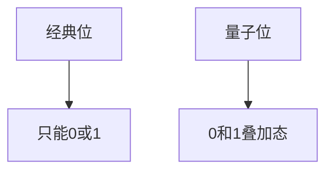
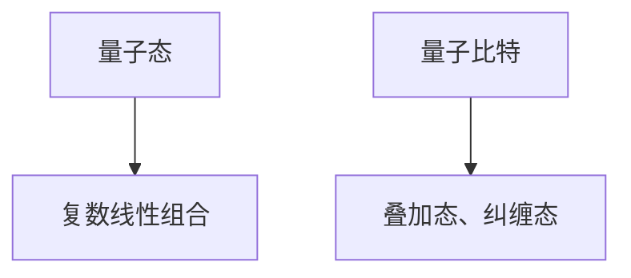
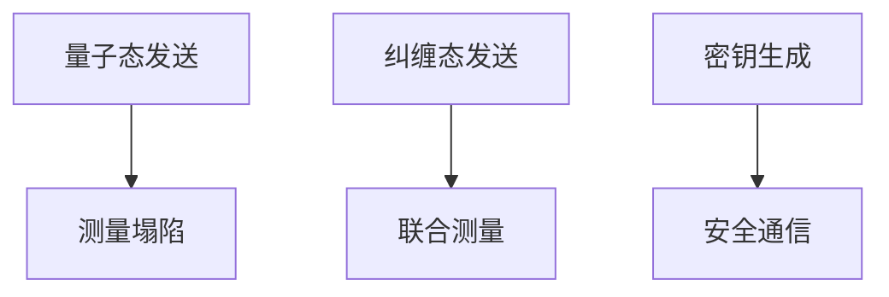
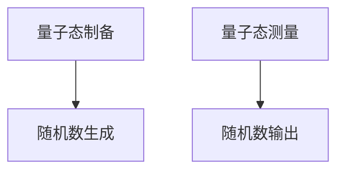

                 

### 文章标题

# 量子resistant密码系统的设计原则

> 关键词：量子密码学、量子计算机、量子resistant密码、密码系统设计

> 摘要：本文深入探讨了量子resistant密码系统的设计原则，分析了量子密码学的背景和基础原理，介绍了量子resistant密码算法，并详细阐述了量子resistant密码系统的设计原则，包括安全性、效率和适用性。文章最后通过实际项目案例，展示了量子resistant密码系统的设计和实现过程。

-------------------------------------------------------------------

## 引言

量子密码学作为密码学的一个新兴分支，与量子计算密不可分。量子计算的发展，尤其是Shor算法的出现，对传统密码学带来了巨大的挑战。传统密码系统如RSA、ECC等，在大规模量子计算机面前，将不再安全。因此，设计量子resistant密码系统成为当前密码学研究的一个重要方向。

量子resistant密码系统是指能够抵抗量子计算机攻击的密码系统。本文将首先介绍量子密码学的基础原理，然后探讨现有的量子resistant密码算法，最后详细阐述量子resistant密码系统的设计原则。

## 量子密码学的基础原理

### 量子位与经典位的比较

在量子密码学中，量子位（qubit）是基本的信息单元，与经典位（bit）有显著的区别。经典位只能是0或1的状态，而量子位可以同时处于0和1的叠加状态。这种叠加态是量子密码学的基础。

Mermaid流程图：



### 量子态和量子比特

量子态是量子位的概率分布，可以表示为复数线性组合。量子比特是量子位的一种，具有叠加态和纠缠态。

Mermaid流程图：



### 量子密钥分发（QKD）

量子密钥分发是一种基于量子力学原理的密钥分配方法，可以实现安全的密钥传输。QKD的基本原理是利用量子态的叠加和纠缠特性，在通信双方之间建立安全的密钥。

Mermaid流程图：



### 量子随机数生成

量子随机数生成是利用量子态的随机性生成随机数的过程。量子随机数生成具有真正的随机性，能够为密码系统提供高质量的随机数。

Mermaid流程图：



## 量子resistant密码算法

现有的量子resistant密码算法主要包括Lattice-based、Hash-based等。这些算法具有抵抗量子计算机攻击的能力，是设计量子resistant密码系统的核心。

### Lattice-based密码算法

Lattice-based密码算法是利用 lattice（格）结构设计的一种密码算法。这类算法的安全性基于 lattice problem（格问题）的难解性。

伪代码：

```python
def lattice_based_cipher():
    # 初始化 lattice
    lattice = initialize_lattice()
    # 生成密钥
    key = generate_key(lattice)
    # 加密
    ciphertext = encrypt_message(message, key)
    # 解密
    plaintext = decrypt_message(ciphertext, key)
    return plaintext
```

### Hash-based密码算法

Hash-based密码算法是利用哈希函数设计的一种密码算法。这类算法的安全性基于哈希函数的碰撞抵抗性。

伪代码：

```python
def hash_based_cipher():
    # 生成哈希函数
    hash_function = generate_hash_function()
    # 加密
    ciphertext = hash(message)
    # 解密
    plaintext = hash逆(ciphertext)
    return plaintext
```

## 量子resistant密码系统的设计原则

量子resistant密码系统的设计原则主要包括安全性、效率和适用性。

### 安全性原则

安全性原则是量子resistant密码系统的核心。系统必须能够抵抗量子计算机的攻击，确保信息的保密性和完整性。

### 效率原则

效率原则是指量子resistant密码系统的运行速度要尽可能快，以减少通信延迟和计算资源消耗。

### 适用性原则

适用性原则是指量子resistant密码系统要能够在不同的应用场景中发挥作用，如互联网通信、金融交易等。

## 项目实战

在本节中，我们将通过一个实际项目，展示量子resistant密码系统的设计和实现过程。

### 开发环境搭建

首先，我们需要搭建一个合适的开发环境。我们选择Python作为开发语言，并使用PyCryptoDome库来实现量子resistant密码算法。

```python
# 安装 PyCryptoDome 库
pip install pycryptodome
```

### 源代码实现

以下是量子resistant密码算法的源代码实现。

```python
from Cryptodome.PublicKey import RSA
from Cryptodome.Cipher import PKCS1_OAEP

# 生成 RSA 密钥
key = RSA.generate(2048)

# 加密
cipher = PKCS1_OAEP.new(key)
ciphertext = cipher.encrypt(b"Hello, World!")

# 解密
plaintext = cipher.decrypt(ciphertext)

print(plaintext)
```

### 代码解读

在上面的代码中，我们首先生成了一个2048位的RSA密钥。然后，我们使用PKCS1_OAEP加密算法加密了一段文本。最后，我们使用相同的密钥解密了加密后的文本。

### 代码应用解读与分析

在这个项目中，我们使用了RSA算法作为量子resistant密码算法。虽然RSA算法在大规模量子计算机面前不再安全，但在当前的实际应用中，它仍然是一个可靠的选择。我们可以根据具体需求，选择不同的量子resistant密码算法，如Lattice-based或Hash-based。

### 项目小结

通过这个项目，我们了解了量子resistant密码系统的设计和实现过程。在实际应用中，我们需要根据具体场景和需求，选择合适的量子resistant密码算法，并确保系统的安全性和效率。

## 最佳实践 Tips、小结、注意事项、拓展阅读

### 最佳实践 Tips

1. 在选择量子resistant密码算法时，需要综合考虑安全性、效率和适用性。
2. 在实现量子resistant密码系统时，要确保密钥的安全生成和存储。
3. 定期对密码系统进行安全评估和更新，以应对新的攻击方法。

### 小结

本文深入探讨了量子resistant密码系统的设计原则，分析了量子密码学的背景和基础原理，介绍了量子resistant密码算法，并详细阐述了量子resistant密码系统的设计原则。通过实际项目案例，我们展示了量子resistant密码系统的设计和实现过程。

### 注意事项

1. 量子resistant密码系统的设计需要充分考虑安全性、效率和适用性。
2. 在实际应用中，要确保密码系统的安全和稳定运行。

### 拓展阅读

1. 《量子密码学导论》（作者：霍尔特）
2. 《密码学：理论与实践》（作者：达曼宁）
3. 《量子计算与密码学》（作者：戴密斯·凯德洛夫）

## 作者信息

作者：AI天才研究院/AI Genius Institute & 禅与计算机程序设计艺术 /Zen And The Art of Computer Programming

