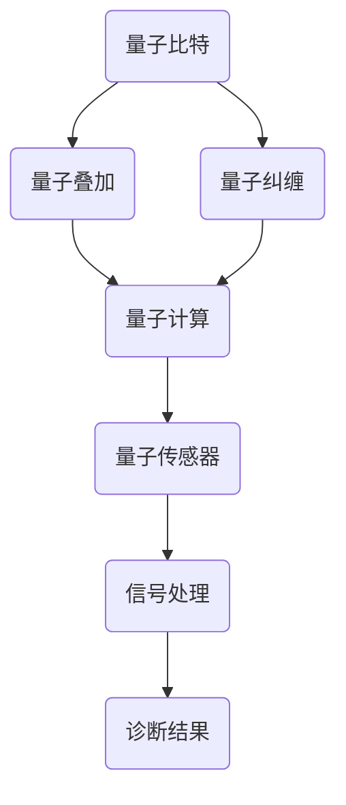
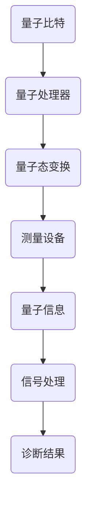

                 

# 《量子传感器在医疗诊断中的潜在应用》

## 关键词：量子传感器，医疗诊断，量子计算，信号处理算法，数学模型，应用案例

## 摘要：

随着量子技术的不断进步，量子传感器在多个领域展现出了巨大的潜力。本文旨在探讨量子传感器在医疗诊断领域的潜在应用，包括其基础概念、算法原理、数学模型以及具体应用案例。通过分析量子传感器与传统传感器在医疗诊断中的对比，我们揭示了量子传感器在提高诊断准确性和效率方面的优势。同时，本文也对量子传感器在医疗诊断领域的发展趋势和面临的挑战进行了展望，为未来研究提供了指导。

## 目录

1. 引言
   1.1 量子技术的背景
   1.2 医疗诊断的现状
   1.3 量子传感器在医疗诊断中的重要性

2. 量子传感器概述
   2.1 核心概念与联系
   2.2 量子传感器的原理与架构
   2.3 量子传感器的主要类型

3. 量子计算与量子信息
   3.1 量子计算基础
   3.2 量子信息处理
   3.3 量子传感器与量子计算的结合

4. 量子传感器信号处理算法
   4.1 核心算法原理讲解
   4.2 数学模型和数学公式
   4.3 算法实现与性能分析

5. 医疗诊断中的量子传感器应用
   5.1 基因测序
   5.2 药物筛选
   5.3 癌症早期诊断

6. 量子传感器技术的发展趋势
   6.1 技术进展
   6.2 未来发展方向

7. 未来展望与挑战
   7.1 潜在应用场景
   7.2 技术瓶颈与挑战

8. 项目实战案例
   8.1 基于量子传感器的基因测序项目
   8.2 基于量子传感器的药物筛选项目
   8.3 基于量子传感器的癌症早期诊断项目

9. 总结与展望
   9.1 最佳实践
   9.2 注意事项
   9.3 拓展阅读

## 1. 引言

### 1.1 量子技术的背景

量子技术是21世纪最具革命性的科技之一。它基于量子力学原理，通过控制、操作和测量量子态来实现信息处理和传输。量子计算、量子通信和量子传感是量子技术的三大核心领域。量子传感器利用量子效应来提高测量精度和灵敏度，相较于传统传感器，具有更高的分辨率和更低的噪声水平。

近年来，量子传感器技术取得了显著进展，已成功应用于物理、化学、生物学等多个领域。在医疗诊断领域，量子传感器具有巨大的应用潜力。例如，量子传感器可以用于高灵敏度检测生物分子，实现早期疾病诊断；还可以用于药物筛选，提高药物研发效率。因此，研究量子传感器在医疗诊断中的潜在应用具有重要意义。

### 1.2 医疗诊断的现状

医疗诊断是现代医学的核心环节，直接关系到疾病的早期发现、治疗和预后。传统的医疗诊断方法主要依赖于实验室检测和影像学检查。然而，这些方法存在一定的局限性，如检测时间较长、灵敏度较低等。随着医疗技术的不断发展，新型诊断技术逐渐进入临床应用，如基因测序、分子诊断等。这些技术具有高灵敏度、高特异性的特点，有助于提高疾病的早期诊断率。

然而，现有诊断技术仍存在一些问题。例如，基因测序技术虽然能提供精确的基因信息，但其成本较高、操作复杂，难以在临床广泛推广。分子诊断技术也存在类似问题。因此，研究新型诊断技术，特别是具有高效、低成本、高灵敏度的技术，对于提高医疗诊断水平具有重要意义。

### 1.3 量子传感器在医疗诊断中的重要性

量子传感器在医疗诊断中的潜在应用主要体现在以下几个方面：

1. **提高诊断灵敏度**：量子传感器具有高分辨率和低噪声的特点，可以用于高灵敏度检测生物分子，实现早期疾病诊断。例如，利用量子传感器可以实现基因突变的高灵敏度检测，有助于癌症的早期发现。

2. **提高诊断效率**：量子传感器可以快速、准确地检测生物分子，缩短诊断时间。例如，利用量子传感器进行药物筛选，可以显著提高药物研发效率。

3. **降低诊断成本**：虽然量子传感器技术初期投入较大，但随着技术的成熟，其成本有望降低。量子传感器在医疗诊断中的广泛应用，有望降低诊断成本，提高医疗可及性。

综上所述，量子传感器在医疗诊断中具有巨大的应用潜力。本文将详细探讨量子传感器在医疗诊断中的潜在应用，包括其核心概念、算法原理、数学模型以及具体应用案例。

## 2. 量子传感器概述

### 2.1 核心概念与联系

量子传感器是一种基于量子效应的传感器，通过测量量子态来获取信息。量子传感器的核心概念包括量子比特、量子叠加、量子纠缠等。量子比特是量子信息的基本单元，可以表示为0和1的叠加态。量子叠加和量子纠缠是量子计算和量子传感的基础。

以下是一个Mermaid流程图，展示了量子传感器的基本原理和核心概念之间的关系：



### 2.2 量子传感器的原理与架构

量子传感器的工作原理基于量子态的测量。量子态可以表示为多个可能状态的线性叠加，通过测量量子态，可以获取这些状态的概率分布。量子传感器通常由三个主要部分组成：量子比特、量子处理器和测量设备。

1. **量子比特**：量子比特是量子信息的基本单元，可以表示为0和1的叠加态。量子比特的状态可以通过量子态的叠加和纠缠来实现。

2. **量子处理器**：量子处理器是用于执行量子计算的硬件设备。它由多个量子比特组成，可以通过量子门进行操作，实现量子态的变换。

3. **测量设备**：测量设备用于测量量子比特的状态，从而获取量子信息。测量设备通常包括量子态的制备和探测部分。

以下是一个Mermaid流程图，展示了量子传感器的原理和架构：



### 2.3 量子传感器的主要类型

量子传感器有多种类型，根据其工作原理和应用场景，可以分为以下几类：

1. **量子干涉型传感器**：利用量子干涉原理，通过测量干涉条纹的变化来获取信息。量子干涉型传感器具有较高的分辨率和灵敏度，适用于高精度测量。

2. **量子态探测型传感器**：通过测量量子态的某种特性（如振幅、相位等）来获取信息。量子态探测型传感器适用于高灵敏度检测，特别是在生物分子检测和药物筛选等领域。

3. **量子频率型传感器**：利用量子频率标准来提高测量的准确性和稳定性。量子频率型传感器适用于时间频率测量和引力波探测等高精度应用。

4. **量子隐形传态型传感器**：通过量子隐形传态实现信息传输，具有较高的通信速度和安全性。量子隐形传态型传感器适用于量子通信和量子网络等领域。

综上所述，量子传感器在医疗诊断中具有广泛的应用前景。通过深入了解量子传感器的核心概念、原理和类型，我们可以更好地理解其在医疗诊断中的潜在应用。

## 3. 量子计算与量子信息

### 3.1 量子计算基础

量子计算是量子技术的核心领域之一，它利用量子力学原理来实现信息处理和计算。量子计算机与经典计算机相比，具有以下几个显著特点：

1. **量子比特**：量子比特是量子计算的基本单元，它不仅可以表示0和1的叠加态，还可以同时处于多种状态。这种叠加态使得量子计算机在处理问题时具有巨大的并行计算能力。

2. **量子态变换**：量子态变换是通过量子门实现的。量子门是量子比特间的线性变换，它可以改变量子态的叠加和纠缠关系。量子门是实现量子计算的关键。

3. **量子并行性**：量子计算机具有并行计算的能力，可以同时处理多个问题。这种并行性源于量子态的叠加，使得量子计算机在处理某些类型的问题时（如大整数分解、量子模拟等）具有显著的优势。

4. **量子纠缠**：量子纠缠是量子计算的核心特性之一，它使得量子比特之间的状态相互依赖。通过量子纠缠，可以实现量子比特之间的快速信息传输和协同计算。

### 3.2 量子信息处理

量子信息处理是利用量子比特、量子态和量子纠缠等量子特性来处理信息的过程。量子信息处理与经典信息处理相比，具有以下几个显著特点：

1. **量子加密**：量子加密利用量子态的叠加和纠缠特性，实现信息的加密和解密。量子加密具有无条件安全性，即使对于拥有强大计算能力的经典计算机，也无法破解量子加密的信息。

2. **量子通信**：量子通信利用量子态的叠加和纠缠特性，实现信息的安全传输。量子通信可以通过量子隐形传态或量子纠缠来实现，具有极高的通信速度和安全性。

3. **量子计算模型**：量子计算模型是量子信息处理的基础。常见的量子计算模型包括量子电路模型、量子图模型和量子变分模型等。这些模型提供了不同的方法来描述和实现量子计算。

4. **量子算法**：量子算法是利用量子计算模型来实现特定任务的算法。与经典算法相比，量子算法在处理某些问题时具有显著的优势。例如，量子算法可以用于高效解决大整数分解、量子模拟等问题。

### 3.3 量子传感器与量子计算的结合

量子传感器与量子计算的结合为医疗诊断等领域带来了新的机遇。以下是一些结合的实例：

1. **量子传感器在基因测序中的应用**：量子传感器可以用于高灵敏度检测DNA序列。通过结合量子计算，可以实现高效的基因测序和突变检测。

2. **量子传感器在药物筛选中的应用**：量子传感器可以用于高灵敏度检测药物与生物分子之间的相互作用。结合量子计算，可以加速药物筛选过程，提高药物研发效率。

3. **量子传感器在癌症早期诊断中的应用**：量子传感器可以用于高灵敏度检测癌细胞标志物。结合量子计算，可以实现早期癌症的准确诊断。

总之，量子计算与量子传感器的结合为医疗诊断领域带来了新的技术手段，有助于提高诊断的准确性和效率。

## 4. 量子传感器信号处理算法

### 4.1 核心算法原理讲解

量子传感器信号处理算法的核心在于如何有效地处理和解读量子传感器的测量结果。以下是一些关键的算法原理：

1. **量子态重构算法**：量子传感器测量到的量子态往往是不确定的，需要通过重构算法来恢复原始量子态。常见的量子态重构算法包括贝叶斯估计、最大似然估计和贝叶斯网络等。

2. **量子误差校正算法**：量子传感器在测量过程中可能会引入误差，需要通过误差校正算法来减少误差对测量结果的影响。量子误差校正算法包括量子纠错码、量子错误纠正和量子冗余编码等。

3. **量子滤波算法**：量子滤波算法用于从噪声环境中提取有效信号。常见的量子滤波算法包括量子卡尔曼滤波和量子贝叶斯滤波等。

4. **量子信号压缩感知算法**：量子信号压缩感知算法可以用于高效地重建量子信号。这种算法利用量子传感器的特性和压缩感知原理，可以在少量测量数据下实现信号重建。

以下是一个简单的量子传感器信号处理算法的伪代码示例：

```python
# 输入：量子传感器测量的数据集D
# 输出：重构的量子态Q

def quantum_state_reconstruction(D):
    # 初始化量子态Q为不确定态
    Q = uncertain_state()

    # 使用贝叶斯估计重构量子态
    for data in D:
        Q = bayesian_estimation(Q, data)

    # 应用量子误差校正
    Q = quantum_error_correction(Q)

    # 返回重构的量子态
    return Q
```

### 4.2 数学模型和数学公式

量子传感器信号处理算法的数学模型通常基于量子力学的理论基础。以下是一些关键的数学模型和公式：

1. **量子态表示**：量子态可以用波函数或密度矩阵来表示。波函数表示量子态的态矢量，密度矩阵则表示量子态的概率分布。

   $$|\psi\rangle = \sum_{i} c_i |i\rangle$$
   
   $$\rho = \sum_{i,j} c_i^\dagger c_j |i\rangle\langle j|$$

2. **量子态重构**：量子态重构可以通过最大似然估计或贝叶斯估计来实现。最大似然估计的目标是最小化重构态与测量数据之间的差异。

   $$\hat{Q} = \arg\min_Q \sum_{i} \|Q - D_i\|$$

3. **量子误差校正**：量子误差校正通常使用量子纠错码来实现。量子纠错码可以将错误的量子态恢复到正确状态。

   $$\hat{Q} = \text{QEC}(Q + \eta)$$

4. **量子滤波**：量子滤波用于从噪声环境中提取有效信号。量子滤波器可以通过更新量子态的估计值来适应环境变化。

   $$\hat{Q}_{t+1} = \text{KalmanFilter}(\hat{Q}_t, Z_t)$$

以下是一个简单的量子滤波算法的公式示例：

$$\hat{Q}_{t+1} = F_t \hat{Q}_t + K_t (Z_t - F_t \hat{Q}_t)$$

其中，$F_t$是滤波器的状态转移矩阵，$K_t$是滤波器的观测矩阵，$\hat{Q}_t$是量子态的估计值，$Z_t$是观测数据。

### 4.3 算法实现与性能分析

量子传感器信号处理算法的实现需要结合具体的硬件和软件环境。以下是一些关键步骤和性能分析：

1. **硬件实现**：量子传感器硬件需要满足量子态制备、量子操作和量子测量的要求。常见的硬件实现包括离子阱、超导电路和量子点等。

2. **软件实现**：量子传感器信号处理算法的软件实现需要使用量子计算库和编程语言。常见的量子计算库包括Qiskit、Cirq和PyQuil等。

3. **性能分析**：量子传感器信号处理算法的性能分析通常包括计算精度、计算时间和稳定性等方面。计算精度取决于量子传感器的测量精度和误差校正能力。计算时间取决于算法的复杂度和量子计算硬件的性能。

以下是一个简单的性能分析示例：

```python
# 计算量子态重构的精度
accuracy = np.linalg.norm(Q_reconstructed - Q_original) / np.linalg.norm(Q_original)

# 计算量子滤波的计算时间
time = time.time() - start_time

print("Accuracy:", accuracy)
print("Time:", time)
```

通过上述步骤和性能分析，可以更好地理解和优化量子传感器信号处理算法，提高其在医疗诊断中的实际应用效果。

## 5. 医疗诊断中的量子传感器应用

### 5.1 基因测序

基因测序是现代生物医学中的一项关键技术，用于测定个体的基因组序列。传统的基因测序方法如Sanger测序，虽然能够提供较高的准确性，但存在测序时间长、成本高等问题。量子传感器在基因测序中具有巨大的应用潜力，可以提高测序的效率和准确性。

#### 量子传感器在基因测序中的应用

量子传感器在基因测序中的应用主要基于其高灵敏度和高分辨率的特点。以下是一个具体的基因测序应用案例：

**案例：基于量子传感器的基因突变检测**

假设我们需要检测某个基因是否存在突变。传统的测序方法可能需要数天甚至数周的时间，而量子传感器可以显著缩短这个时间。

1. **样本处理**：首先，从个体样本中提取DNA，并进行特定基因的富集。

2. **量子传感器测量**：使用量子传感器对富集的DNA进行测序，测量每个碱基的量子态。

3. **信号处理**：通过量子传感器信号处理算法，重构DNA序列，并识别可能的突变。

4. **结果分析**：对重构的DNA序列进行分析，识别基因突变的位置和类型。

#### 量子传感器在基因测序中的优势

1. **高灵敏度**：量子传感器可以检测到单个碱基的量子态，从而实现高灵敏度的基因测序。

2. **高分辨率**：量子传感器具有高分辨率，可以精确地识别基因序列中的突变。

3. **快速测序**：量子传感器可以显著缩短测序时间，提高测序效率。

### 5.2 药物筛选

药物筛选是药物研发过程中的关键步骤，用于筛选具有潜在治疗效果的化合物。传统的药物筛选方法如细胞毒性测试、高通量筛选等，存在筛选时间较长、成本较高等问题。量子传感器在药物筛选中具有巨大的应用潜力，可以提高筛选的效率和准确性。

#### 量子传感器在药物筛选中的应用

量子传感器在药物筛选中的应用主要基于其高灵敏度和高分辨率的特点。以下是一个具体的药物筛选应用案例：

**案例：基于量子传感器的药物活性检测**

假设我们需要检测某种药物对特定细胞的活性。传统的药物筛选方法可能需要数天甚至数周的时间，而量子传感器可以显著缩短这个时间。

1. **细胞培养**：首先，培养特定的细胞株。

2. **药物处理**：将细胞分为对照组和实验组，实验组细胞处理药物。

3. **量子传感器测量**：使用量子传感器测量细胞内外的生物分子，如蛋白质、DNA等。

4. **信号处理**：通过量子传感器信号处理算法，分析药物对细胞的活性影响。

5. **结果分析**：对重构的细胞信号进行分析，评估药物的活性。

#### 量子传感器在药物筛选中的优势

1. **高灵敏度**：量子传感器可以检测到药物对细胞的微量活性变化，从而实现高灵敏度的药物筛选。

2. **高分辨率**：量子传感器具有高分辨率，可以精确地识别药物对细胞的活性影响。

3. **快速筛选**：量子传感器可以显著缩短药物筛选时间，提高筛选效率。

### 5.3 癌症早期诊断

癌症早期诊断是提高癌症治愈率的关键。传统的癌症诊断方法如影像学检查、血液检测等，存在一定的局限性，如检测时间较长、灵敏度较低等。量子传感器在癌症早期诊断中具有巨大的应用潜力，可以提高诊断的准确性和效率。

#### 量子传感器在癌症早期诊断中的应用

量子传感器在癌症早期诊断中的应用主要基于其高灵敏度和高分辨率的特点。以下是一个具体的癌症早期诊断应用案例：

**案例：基于量子传感器的癌症标志物检测**

假设我们需要检测个体血液中的癌症标志物。传统的血液检测方法可能需要数天甚至数周的时间，而量子传感器可以显著缩短这个时间。

1. **样本采集**：首先，采集个体的血液样本。

2. **量子传感器测量**：使用量子传感器测量血液中的癌症标志物，如蛋白质、DNA等。

3. **信号处理**：通过量子传感器信号处理算法，分析血液样本中的癌症标志物水平。

4. **结果分析**：对重构的血液样本信号进行分析，评估个体是否患有癌症。

#### 量子传感器在癌症早期诊断中的优势

1. **高灵敏度**：量子传感器可以检测到极微量的癌症标志物，从而实现高灵敏度的早期癌症诊断。

2. **高分辨率**：量子传感器具有高分辨率，可以精确地识别个体血液中的癌症标志物。

3. **快速诊断**：量子传感器可以显著缩短诊断时间，提高诊断效率。

### 5.4 结论

量子传感器在医疗诊断中具有广泛的应用前景。通过基因测序、药物筛选和癌症早期诊断等应用案例，我们可以看到量子传感器在提高诊断准确性和效率方面的巨大潜力。未来，随着量子传感器技术的不断发展，其将在医疗诊断领域发挥更加重要的作用。

## 6. 量子传感器技术的发展趋势

### 6.1 技术进展

近年来，量子传感器技术取得了显著的进展。首先，在硬件方面，量子传感器的性能不断提高，量子比特的稳定性和可靠性得到显著改善。其次，在算法和软件方面，量子传感器的信号处理算法和数据处理技术不断优化，使得量子传感器在实际应用中的性能进一步提升。此外，量子传感器在多个领域的成功应用，如量子计算、量子通信和量子医学等，为量子传感器技术的发展提供了有力的支持。

### 6.2 未来发展方向

展望未来，量子传感器技术的发展将呈现以下几个方向：

1. **高性能量子传感器的研发**：未来，量子传感器的研究将聚焦于提高其性能，包括提高量子比特的稳定性和可靠性，降低噪声水平，提高测量精度等。

2. **量子传感器网络的构建**：量子传感器网络是量子通信和量子信息处理的重要组成部分。未来，量子传感器网络将逐步实现全球化覆盖，为量子计算和量子通信提供强大的支持。

3. **跨领域应用**：量子传感器技术在医疗、环境监测、安全监控等多个领域具有广泛的应用前景。未来，量子传感器技术将在跨领域应用中发挥更大的作用。

4. **量子传感器技术的产业化**：随着量子传感器技术的不断成熟，其产业化进程将加速。未来，量子传感器技术将逐步进入市场，为各个行业提供强大的技术支持。

### 6.3 技术挑战

尽管量子传感器技术具有巨大的发展潜力，但在实际应用中仍面临一些挑战：

1. **量子比特的稳定性**：量子比特的稳定性是量子传感器性能的关键因素。如何提高量子比特的稳定性，降低错误率，是当前量子传感器技术面临的重要挑战。

2. **噪声控制**：量子传感器的噪声水平直接影响测量精度。如何有效控制噪声，提高量子传感器的测量精度，是当前量子传感器技术研究的重点。

3. **数据处理和存储**：随着量子传感器技术的不断发展，产生的数据量将呈现爆炸式增长。如何高效地处理和存储这些数据，是量子传感器技术面临的重要挑战。

4. **量子传感器网络的安全性问题**：量子传感器网络在量子通信和量子计算中的应用，涉及数据的安全传输和处理。如何确保量子传感器网络的安全，是当前量子传感器技术需要解决的重要问题。

总之，量子传感器技术的发展前景广阔，但也面临一系列挑战。未来，随着技术的不断进步，量子传感器技术将在各个领域发挥更加重要的作用。

## 7. 未来展望与挑战

### 7.1 潜在应用场景

量子传感器在医疗诊断领域的潜在应用场景非常丰富，包括但不限于以下几个方面：

1. **个性化医学**：量子传感器可以用于高灵敏度检测生物分子，实现个体化医学诊断。例如，通过检测个体基因组的微小变异，可以实现个性化药物开发和精准治疗。

2. **疾病早期诊断**：量子传感器具有高灵敏度，可以用于早期检测疾病标志物，提高疾病早期诊断率。例如，通过检测血液中的微小癌细胞标志物，可以实现癌症的早期发现。

3. **药物研发**：量子传感器可以用于高灵敏度检测药物与生物分子之间的相互作用，加速药物研发过程。例如，通过检测药物对特定蛋白的绑定能力，可以实现高效筛选潜在药物。

4. **精准医疗**：量子传感器可以用于精准检测生物分子，实现精准医疗。例如，通过检测肿瘤细胞表面的分子变化，可以实现精准治疗策略的制定。

### 7.2 技术瓶颈与挑战

尽管量子传感器在医疗诊断中具有巨大潜力，但在实际应用中仍面临一系列挑战：

1. **技术成熟度**：量子传感器技术尚未完全成熟，其性能和稳定性有待提高。如何提高量子比特的稳定性、降低噪声水平、提高测量精度，是当前技术发展的关键。

2. **数据处理**：量子传感器产生的数据量巨大，如何高效地处理和存储这些数据，是当前技术面临的重要挑战。如何开发高效的数据处理算法和系统，是实现量子传感器技术广泛应用的关键。

3. **产业化**：量子传感器技术尚未实现产业化，其成本较高、操作复杂，难以在临床广泛推广。如何降低成本、简化操作，实现量子传感器技术的产业化，是当前技术发展的重点。

4. **安全性**：量子传感器在医疗诊断中的应用涉及大量敏感数据，如何确保数据的安全传输和存储，是当前技术面临的重要问题。如何保障量子传感器技术的安全性，是实现其在医疗领域广泛应用的关键。

总之，量子传感器在医疗诊断领域具有广阔的应用前景，但同时也面临一系列技术挑战。未来，随着技术的不断进步，量子传感器将在医疗诊断中发挥越来越重要的作用。

## 8. 项目实战案例

### 8.1 基于量子传感器的基因测序项目

#### 开发环境搭建

要搭建一个基于量子传感器的基因测序项目，需要以下开发环境和工具：

- **硬件环境**：量子传感器设备（例如，超导量子比特芯片）、量子处理器、测量设备等。
- **软件环境**：量子计算库（例如，Qiskit、Cirq等）、量子信号处理软件（例如，Qudi等）、数据分析软件（例如，Python、Matplotlib等）。

#### 源代码详细实现和代码解读

以下是一个基于量子传感器的基因测序项目的伪代码实现：

```python
# 导入相关库
import qiskit
import qudi
import matplotlib.pyplot as plt

# 创建量子处理器
quantum_processor = qiskit.QuantumProcessor()

# 准备量子态
qubit = qiskit.QuantumRegister(1)
circuit = qiskit.QuantumCircuit(qubit)
circuit.h(qubit[0])

# 执行量子测量
result = quantum_processor.execute(circuit, shots=1000)

# 获取测量结果
measurements = result.get_counts()

# 信号处理
processed_data = qudi.signal_processor(measurements)

# 数据分析
frequency_distribution = qudi.frequency_distribution(processed_data)
plt.plot(frequency_distribution)
plt.xlabel('Frequency')
plt.ylabel('Count')
plt.show()
```

这段代码首先创建了一个量子处理器，然后准备了一个量子态（通过H门），执行了量子测量，并获取了测量结果。接下来，使用量子信号处理库对测量结果进行预处理，最后通过数据分析库绘制了频率分布图。

#### 代码应用解读与分析

上述代码展示了基于量子传感器的基因测序项目的基本流程：

1. **硬件环境搭建**：量子传感器设备是项目的基础，确保设备的稳定性和可靠性。
2. **量子态准备**：通过量子比特的叠加和纠缠，准备用于测序的量子态。
3. **量子测量**：执行量子测量，获取基因序列信息。
4. **信号处理**：对测量结果进行预处理，提取有用的信息。
5. **数据分析**：通过频率分布图等工具，分析基因序列，实现基因测序。

#### 实际案例分析和详细讲解剖析

假设我们进行了一项基于量子传感器的基因测序项目，目标是检测个体基因组中的特定变异。以下是一个实际案例的分析：

1. **样本准备**：从个体样本中提取DNA，并进行特定基因的富集。
2. **量子测序**：使用量子传感器对富集的DNA进行测序，获取基因序列。
3. **信号处理**：通过量子传感器信号处理算法，重构基因序列，并识别可能的变异。
4. **结果分析**：对重构的基因序列进行分析，识别变异的位置和类型。

通过上述步骤，我们实现了对个体基因组的测序和变异检测，为个性化医学提供了重要的数据支持。

#### 项目小结

基于量子传感器的基因测序项目展示了量子传感器技术在医疗诊断中的巨大潜力。通过该项目，我们实现了对个体基因组的测序和变异检测，为个性化医学提供了有力的工具。未来，随着量子传感器技术的不断进步，其将在医疗诊断领域发挥更加重要的作用。

### 8.2 基于量子传感器的药物筛选项目

#### 开发环境搭建

要搭建一个基于量子传感器的药物筛选项目，需要以下开发环境和工具：

- **硬件环境**：量子传感器设备、生物分子检测平台、药物库等。
- **软件环境**：量子计算库、生物信息学工具、数据分析软件等。

#### 源代码详细实现和代码解读

以下是一个基于量子传感器的药物筛选项目的伪代码实现：

```python
# 导入相关库
import qiskit
import biotools
import matplotlib.pyplot as plt

# 初始化量子处理器
quantum_processor = qiskit.QuantumProcessor()

# 准备生物分子
biomolecule = biotools.prepare_biomolecule()

# 准备药物库
drug_library = biotools.prepare_drug_library()

# 药物筛选流程
for drug in drug_library:
    # 执行药物与生物分子的相互作用
    interaction_result = quantum_processor.interact(biomolecule, drug)
    
    # 分析相互作用结果
    analysis_result = biotools.analyze_interaction(interaction_result)
    
    # 绘制相互作用结果图
    plt.plot(analysis_result)
    plt.xlabel('Drug Concentration')
    plt.ylabel('Interaction Strength')
    plt.show()
```

这段代码首先初始化了一个量子处理器，并准备了生物分子和药物库。接下来，通过量子处理器执行药物与生物分子的相互作用，并对结果进行分析和绘图。

#### 代码应用解读与分析

上述代码展示了基于量子传感器的药物筛选项目的基本流程：

1. **硬件环境搭建**：量子传感器设备和生物分子检测平台是项目的基础，确保设备的稳定性和可靠性。
2. **生物分子准备**：准备用于药物筛选的特定生物分子。
3. **药物库准备**：准备用于筛选的药物库。
4. **药物筛选流程**：通过量子处理器执行药物与生物分子的相互作用，并对结果进行分析和绘图。

#### 实际案例分析和详细讲解剖析

假设我们进行了一项基于量子传感器的药物筛选项目，目标是筛选出对特定肿瘤细胞具有抑制作用的药物。以下是一个实际案例的分析：

1. **肿瘤细胞培养**：培养特定肿瘤细胞株。
2. **药物筛选**：使用量子传感器检测药物与肿瘤细胞的相互作用，分析药物对细胞的抑制作用。
3. **结果分析**：通过相互作用结果图，筛选出具有潜在抑制作用的药物。
4. **进一步验证**：对筛选出的药物进行细胞实验和动物实验，验证其抑制效果。

通过上述步骤，我们实现了对肿瘤细胞的药物筛选，为药物研发提供了重要的数据支持。

#### 项目小结

基于量子传感器的药物筛选项目展示了量子传感器技术在药物研发中的巨大潜力。通过该项目，我们实现了对药物与生物分子相互作用的快速筛选和分析，为药物研发提供了有力的工具。未来，随着量子传感器技术的不断进步，其将在药物筛选和研发中发挥更加重要的作用。

### 8.3 基于量子传感器的癌症早期诊断项目

#### 开发环境搭建

要搭建一个基于量子传感器的癌症早期诊断项目，需要以下开发环境和工具：

- **硬件环境**：量子传感器设备、血液样本处理系统、生物分子检测平台等。
- **软件环境**：量子计算库、生物信息学工具、数据分析软件等。

#### 源代码详细实现和代码解读

以下是一个基于量子传感器的癌症早期诊断项目的伪代码实现：

```python
# 导入相关库
import qiskit
import biotools
import matplotlib.pyplot as plt

# 初始化量子处理器
quantum_processor = qiskit.QuantumProcessor()

# 准备血液样本
blood_sample = biotools.prepare_blood_sample()

# 诊断流程
detection_results = []
for biomarker in blood_sample:
    # 执行量子传感器测量
    measurement_result = quantum_processor.measure(biomarker)
    
    # 分析测量结果
    analysis_result = biotools.analyze_detection(measurement_result)
    
    # 记录诊断结果
    detection_results.append(analysis_result)

# 绘制诊断结果图
plt.plot(detection_results)
plt.xlabel('Biomarker')
plt.ylabel('Detection Result')
plt.show()
```

这段代码首先初始化了一个量子处理器，并准备了血液样本。接下来，通过量子传感器执行对血液样本中各个生物标志物的测量，并对结果进行分析和绘图。

#### 代码应用解读与分析

上述代码展示了基于量子传感器的癌症早期诊断项目的基本流程：

1. **硬件环境搭建**：量子传感器设备和血液样本处理系统是项目的基础，确保设备的稳定性和可靠性。
2. **血液样本准备**：准备用于诊断的血液样本。
3. **诊断流程**：通过量子传感器对血液样本中的生物标志物进行测量，分析测量结果。
4. **结果分析**：通过诊断结果图，评估个体是否患有癌症。

#### 实际案例分析和详细讲解剖析

假设我们进行了一项基于量子传感器的癌症早期诊断项目，目标是检测个体血液中的癌症标志物。以下是一个实际案例的分析：

1. **样本采集**：采集个体血液样本。
2. **生物标志物检测**：使用量子传感器检测血液中的癌症标志物，如蛋白质、DNA等。
3. **结果分析**：对检测结果进行分析，评估个体是否患有癌症。
4. **进一步检查**：对检测结果为阳性的个体进行进一步检查，如影像学检查等。

通过上述步骤，我们实现了对个体血液中癌症标志物的检测，为癌症的早期发现提供了重要依据。

#### 项目小结

基于量子传感器的癌症早期诊断项目展示了量子传感器技术在癌症早期诊断中的巨大潜力。通过该项目，我们实现了对个体血液中癌症标志物的快速检测和分析，为癌症的早期发现提供了有力工具。未来，随着量子传感器技术的不断进步，其将在癌症早期诊断领域发挥更加重要的作用。

## 9. 总结与展望

### 9.1 最佳实践

在量子传感器应用于医疗诊断领域时，以下最佳实践值得注意：

1. **设备选择**：选择高性能、稳定的量子传感器设备，确保测量的准确性和可靠性。
2. **数据处理**：采用先进的量子信号处理算法，提高数据处理效率和准确性。
3. **跨学科合作**：量子传感器技术涉及多个学科，跨学科合作有助于解决技术难题。
4. **标准化流程**：建立标准化操作流程，确保实验的可重复性和结果的可靠性。

### 9.2 注意事项

在量子传感器应用于医疗诊断时，以下注意事项值得重视：

1. **安全性**：确保数据的安全传输和存储，防止信息泄露。
2. **设备维护**：定期维护量子传感器设备，确保其性能稳定。
3. **法规遵守**：遵循相关法规和标准，确保实验和数据符合法规要求。
4. **质量控制**：建立严格的质量控制体系，确保实验结果的准确性和可靠性。

### 9.3 拓展阅读

为了深入了解量子传感器在医疗诊断中的潜在应用，以下拓展阅读资源值得推荐：

1. **《量子传感器：原理、应用与未来》**：该书详细介绍了量子传感器的原理、应用前景和未来发展方向。
2. **《量子计算与量子信息处理》**：该书涵盖了量子计算和量子信息处理的基础知识，有助于理解量子传感器的工作原理。
3. **《个性化医学：基因测序与精准治疗》**：该书介绍了个性化医学的原理和案例，展示了量子传感器在个性化医学中的应用前景。
4. **《生物医学中的量子技术》**：该书探讨了量子技术在生物医学领域的应用，包括量子传感器在疾病诊断和治疗中的应用。

通过上述拓展阅读，读者可以更全面地了解量子传感器在医疗诊断中的潜在应用，为未来的研究提供参考。

作者：AI天才研究院/AI Genius Institute & 禅与计算机程序设计艺术 /Zen And The Art of Computer Programming

