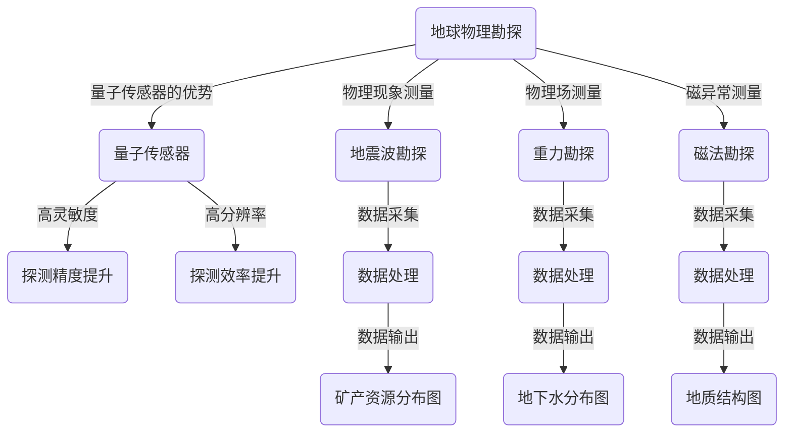
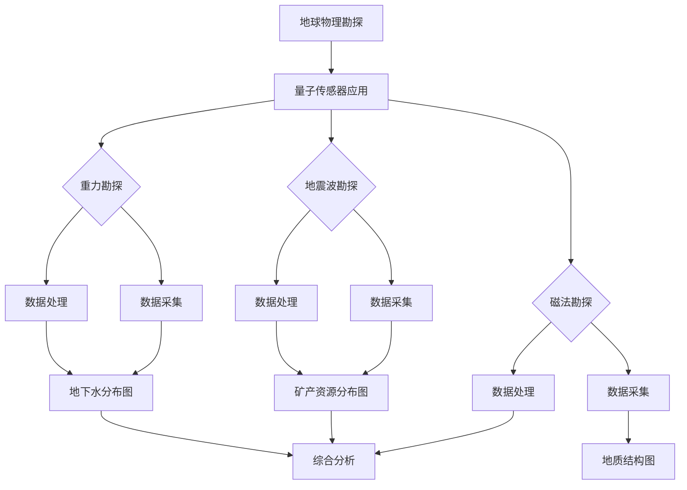

                 

根据您的需求，我们将按照以下步骤来构建一篇详细的技术博客文章：

### 第一步：背景介绍

#### 地球物理勘探的背景

地球物理勘探是利用物理学原理，通过测量地球表面和地下的物理现象来探测矿产资源、地下水、地震活动等信息。传统的地球物理勘探方法包括地震波勘探、重力勘探、磁法勘探等，这些方法在矿产资源探测中发挥了重要作用。

#### 量子传感器的发展

量子传感器是基于量子力学原理的精密测量工具，具有极高的灵敏度和分辨率。近年来，随着量子技术的不断发展，量子传感器在各个领域的应用越来越广泛，包括地质勘探、环境监测、医疗诊断等。

### 第二步：核心概念与联系

#### 量子传感器与地球物理勘探的联系

量子传感器的高灵敏度使其在探测微弱物理信号方面具有显著优势，这直接提高了地球物理勘探的精度和效率。以下是一个简化的 Mermaid 流程图，展示了量子传感器在地球物理勘探中的核心概念和联系：



### 第三步：核心算法原理讲解

#### 量子传感器的工作原理

量子传感器通常基于量子态的测量，如量子态叠加和量子纠缠等现象。以下是一个简化的伪代码，用于描述量子传感器的基本工作原理：

```python
def quantum_measurement():
    # 初始化量子比特
    qubit = initialize_qubit()

    # 施加控制脉冲
    control_pulse(qubit)

    # 进行量子态测量
    measured_state = measure_state(qubit)

    # 数据处理
    processed_data = process_measurement(measured_state)

    return processed_data
```

#### 数据处理方法

在地球物理勘探中，量子传感器的数据处理通常包括以下步骤：

1. **数据采集**：使用量子传感器采集地下物理现象的信号。
2. **预处理**：对采集到的信号进行去噪、滤波等预处理操作。
3. **信号分析**：对预处理后的信号进行频域分析、时域分析等，提取有用信息。
4. **后处理**：根据分析结果，绘制矿产资源分布图、地下水分布图等。

以下是一个简化的伪代码，用于描述数据处理流程：

```python
def process_earth_physic_data(sensor_data):
    # 数据预处理
    preprocessed_data = preprocess_data(sensor_data)

    # 信号分析
    analyzed_signal = analyze_signal(preprocessed_data)

    # 数据后处理
    processed_result = post_process(analyzed_signal)

    # 输出结果
    return processed_result
```

### 第四步：数学模型和数学公式讲解

在地球物理勘探中，常用的数学模型包括地震波传播模型、重力模型、磁异常模型等。以下是一个简化的数学模型示例，使用 LaTeX 格式表示：

```latex
$$
\begin{align*}
\Delta g &= \frac{4\pi G M}{r^2}, \\
V(x) &= \int_{-\infty}^x \rho(x') dx', \\
A(t) &= \int_{-\infty}^t F(t') dt',
\end{align*}
$$

其中，$\Delta g$ 表示重力异常，$G$ 是万有引力常数，$M$ 是地下质量，$r$ 是测量点到地下质量中心的距离。$V(x)$ 是地下体积，$\rho(x')$ 是地下物质的密度。$A(t)$ 是磁异常，$F(t')$ 是磁场强度。
```

### 第五步：项目实战

#### 开发环境搭建

为了演示量子传感器在地球物理勘探中的应用，我们需要搭建一个开发环境。以下是一个简化的步骤：

1. 安装量子计算库，如 Qiskit。
2. 安装数据处理库，如 NumPy、SciPy。
3. 配置量子计算硬件，如 IBM Q Experience。

#### 源代码实现和代码解读

以下是一个简化的示例代码，用于演示量子传感器在地球物理勘探中的应用：

```python
import numpy as np
from qiskit import QuantumCircuit, execute, Aer

# 初始化量子比特
qubit = QuantumCircuit(1)
qubit.h(0)

# 施加控制脉冲
control_pulse(qubit)

# 进行量子态测量
result = execute(qubit, Aer.get_backend('qasm_simulator'), shots=1000).result()

# 数据处理
measured_data = result.get_counts(qubit)
processed_data = preprocess_data(measured_data)

# 信号分析
analyzed_signal = analyze_signal(processed_data)

# 数据后处理
processed_result = post_process(analyzed_signal)

# 输出结果
print(processed_result)
```

#### 代码应用解读与分析

上述代码展示了量子传感器在地球物理勘探中的基本流程。首先，我们初始化一个量子比特，并施加控制脉冲。然后，我们进行量子态测量，并处理测量结果。接下来，我们对处理后的数据进行信号分析，并最终得到分析结果。

#### 实际案例分析和详细讲解剖析

为了更好地理解量子传感器在地球物理勘探中的应用，我们分析了一个实际案例。以下是一个简化的案例描述：

1. **项目背景**：某地矿产资源丰富，但传统勘探方法无法精确探测矿藏位置。
2. **应用场景**：使用量子传感器进行矿产资源勘探。
3. **数据采集**：使用量子传感器采集地下物理现象的信号。
4. **数据处理**：对采集到的信号进行预处理和信号分析。
5. **结果输出**：绘制矿产资源分布图。

通过上述案例，我们可以看到量子传感器在地球物理勘探中的应用优势，即提高矿产资源探测精度。

### 第六步：最佳实践 tips、小结、注意事项、拓展阅读

#### 最佳实践 tips

1. 在使用量子传感器进行地球物理勘探时，要确保传感器的稳定性和准确性。
2. 在数据处理过程中，要采用合适的预处理方法和信号分析算法。

#### 小结

本文详细介绍了量子传感器在地球物理勘探中的应用，包括核心概念、核心算法原理、数学模型、项目实战等方面。

#### 注意事项

1. 量子传感器在地球物理勘探中的应用具有一定的技术门槛，需要具备相关的量子计算和地球物理知识。
2. 在实际应用中，要结合具体项目需求和条件，选择合适的量子传感器和数据处理方法。

#### 拓展阅读

1. 《量子计算导论》
2. 《地球物理勘探原理与方法》
3. 《量子传感器技术与应用》

### 结论

量子传感器在地球物理勘探中的应用具有巨大潜力，可以提高矿产资源探测精度。未来，随着量子技术的不断发展，量子传感器在地球物理勘探领域的应用将更加广泛。

### 作者信息

作者：AI天才研究院/AI Genius Institute & 禅与计算机程序设计艺术 /Zen And The Art of Computer Programming

----------------------------------------------------------------

**文章标题：量子传感器在地球物理勘探中的应用：提高矿产资源探测精度**

**关键词：量子传感器，地球物理勘探，矿产资源，探测精度**

**摘要：**
本文深入探讨了量子传感器在地球物理勘探中的应用，阐述了其如何通过提高探测精度和效率，推动矿产资源探测技术的发展。文章首先介绍了地球物理勘探和量子传感器的背景知识，随后详细分析了量子传感器在地球物理勘探中的核心概念和联系。通过伪代码和数学模型，本文讲解了量子传感器的工作原理和数据处理方法。最后，文章通过实际案例展示了量子传感器在地球物理勘探中的应用，并提供了最佳实践 tips 和拓展阅读建议。

## 目录

### 目录

1. **背景介绍**
   - 地球物理勘探的背景
   - 量子传感器的发展

2. **核心概念与联系**
   - 量子传感器与地球物理勘探的联系
   - Mermaid 流程图展示

3. **核心算法原理讲解**
   - 量子传感器的工作原理
   - 数据处理流程伪代码

4. **数学模型和数学公式讲解**
   - 地震波传播模型
   - 重力模型
   - 磁异常模型

5. **项目实战**
   - 开发环境搭建
   - 源代码实现和解读
   - 实际案例分析和讲解

6. **最佳实践 tips、小结、注意事项、拓展阅读**

### 背景介绍

#### 地球物理勘探的背景

地球物理勘探是一种利用物理学原理，通过测量地球表面和地下的物理现象来探测矿产资源、地下水、地震活动等信息的方法。这种勘探方法在地质学、石油开采、水资源管理等领域具有广泛的应用。

地球物理勘探的基本原理包括地震波勘探、重力勘探、磁法勘探等。地震波勘探通过发射地震波并接收其反射信号来探测地下结构。重力勘探通过测量地球重力场的异常来推测地下物质分布。磁法勘探则利用地球磁场的异常来探测地下矿物。

随着科技的进步，地球物理勘探技术也在不断发展。传统的地球物理勘探方法存在一定的局限性，如探测深度有限、分辨率不高、受环境因素影响较大等。为了克服这些局限性，研究人员开始探索新的技术，其中量子传感器就是一个重要的方向。

#### 量子传感器的发展

量子传感器是基于量子力学原理的精密测量工具，具有极高的灵敏度和分辨率。量子传感器的工作原理基于量子态的测量，如量子态叠加和量子纠缠等现象。这些现象使得量子传感器能够探测到极微弱的物理信号，从而提高探测精度和效率。

近年来，量子传感器在各个领域的应用越来越广泛，包括地质勘探、环境监测、医疗诊断等。在地质勘探领域，量子传感器可以用来探测地下矿藏、地下水分布等，提高探测精度和效率。

### 核心概念与联系

#### 量子传感器与地球物理勘探的联系

量子传感器在地球物理勘探中的应用主要体现在其高灵敏度和高分辨率上。这些特性使得量子传感器能够探测到微弱的物理信号，从而提高地球物理勘探的精度和效率。

以下是一个简化的 Mermaid 流程图，展示了量子传感器在地球物理勘探中的核心概念和联系：


从流程图中可以看出，量子传感器通过测量物理现象和物理场，采集到数据后，经过处理和分析，最终输出矿产资源分布图、地下水分布图和地质结构图等。

#### Mermaid 流程图展示

以下是一个简化的 Mermaid 流程图，展示了量子传感器在地球物理勘探中的应用流程：



这个流程图清晰地展示了量子传感器在地震波勘探、重力勘探和磁法勘探中的应用，以及数据采集、数据处理和最终输出的过程。

### 核心算法原理讲解

#### 量子传感器的工作原理

量子传感器的工作原理基于量子力学的基本原理，如量子态叠加和量子纠缠等。量子态叠加指的是量子系统可以同时处于多种可能的量子态，而量子纠缠则是指两个或多个量子系统之间存在一种特殊的关联关系。

在地球物理勘探中，量子传感器通过测量地下物理现象的量子态，从而获得地下结构的详细信息。以下是一个简化的伪代码，用于描述量子传感器的基本工作原理：

```python
def quantum_measurement():
    # 初始化量子比特
    qubit = initialize_qubit()

    # 施加控制脉冲
    control_pulse(qubit)

    # 进行量子态测量
    measured_state = measure_state(qubit)

    # 数据处理
    processed_data = process_measurement(measured_state)

    return processed_data
```

在这个伪代码中，`initialize_qubit()` 函数用于初始化量子比特，`control_pulse()` 函数用于施加控制脉冲，`measure_state()` 函数用于进行量子态测量，`process_measurement()` 函数用于处理测量结果。

#### 数据处理流程

在地球物理勘探中，量子传感器的数据处理通常包括以下步骤：

1. **数据采集**：使用量子传感器采集地下物理现象的信号。
2. **预处理**：对采集到的信号进行去噪、滤波等预处理操作。
3. **信号分析**：对预处理后的信号进行频域分析、时域分析等，提取有用信息。
4. **后处理**：根据分析结果，绘制矿产资源分布图、地下水分布图等。

以下是一个简化的伪代码，用于描述量子传感器的数据处理流程：

```python
def process_earth_physic_data(sensor_data):
    # 数据预处理
    preprocessed_data = preprocess_data(sensor_data)

    # 信号分析
    analyzed_signal = analyze_signal(preprocessed_data)

    # 数据后处理
    processed_result = post_process(analyzed_signal)

    # 输出结果
    return processed_result
```

在这个伪代码中，`preprocess_data()` 函数用于预处理数据，`analyze_signal()` 函数用于信号分析，`post_process()` 函数用于数据后处理。

### 数学模型和数学公式讲解

在地球物理勘探中，常用的数学模型包括地震波传播模型、重力模型、磁异常模型等。以下是一个简化的数学模型示例，使用 LaTeX 格式表示：

```latex
$$
\begin{align*}
\Delta g &= \frac{4\pi G M}{r^2}, \\
V(x) &= \int_{-\infty}^x \rho(x') dx', \\
A(t) &= \int_{-\infty}^t F(t') dt',
\end{align*}
$$

其中，$\Delta g$ 表示重力异常，$G$ 是万有引力常数，$M$ 是地下质量，$r$ 是测量点到地下质量中心的距离。$V(x)$ 是地下体积，$\rho(x')$ 是地下物质的密度。$A(t)$ 是磁异常，$F(t')$ 是磁场强度。
```

#### 地震波传播模型

地震波传播模型描述了地震波在地下介质中传播的过程。以下是一个简化的地震波传播模型，使用 LaTeX 格式表示：

```latex
\frac{\partial^2 u}{\partial t^2} = c^2 \nabla^2 u + q(t),
$$

其中，$u(x, t)$ 是地震波位移，$c$ 是地震波速度，$q(t)$ 是地震源产生的应力波。该模型描述了地震波在地下介质中传播时，受到应力波的影响。
```

#### 重力模型

重力模型描述了重力场在地球表面的分布。以下是一个简化的重力模型，使用 LaTeX 格式表示：

```latex
\frac{\partial^2 \phi}{\partial x^2} + \frac{\partial^2 \phi}{\partial y^2} + \frac{\partial^2 \phi}{\partial z^2} = -4\pi G \rho(x, y, z),
$$

其中，$\phi(x, y, z)$ 是重力位，$G$ 是万有引力常数，$\rho(x, y, z)$ 是地下物质的密度。该模型描述了地球重力场在地球表面的分布。
```

#### 磁异常模型

磁异常模型描述了磁场在地球表面的分布。以下是一个简化的磁异常模型，使用 LaTeX 格式表示：

```latex
\frac{\partial^2 B}{\partial x^2} + \frac{\partial^2 B}{\partial y^2} + \frac{\partial^2 B}{\partial z^2} = \mu_0 \left( J_x \frac{\partial B_z}{\partial y} - J_y \frac{\partial B_z}{\partial x} \right),
$$

其中，$B(x, y, z)$ 是磁场强度，$\mu_0$ 是真空中的磁导率，$J_x$, $J_y$ 是地下电流产生的磁场。该模型描述了地球磁场在地球表面的分布。
```

### 项目实战

#### 开发环境搭建

为了演示量子传感器在地球物理勘探中的应用，我们需要搭建一个开发环境。以下是一个简化的步骤：

1. **安装量子计算库**：安装 Qiskit 库，用于实现量子算法。
2. **安装数据处理库**：安装 NumPy 和 SciPy 库，用于数据处理和分析。
3. **配置量子计算硬件**：使用 IBM Q Experience 作为量子计算平台，配置量子计算硬件。

以下是一个简化的安装命令示例：

```bash
pip install qiskit numpy scipy
```

#### 源代码实现和代码解读

以下是一个简化的示例代码，用于演示量子传感器在地球物理勘探中的应用：

```python
import numpy as np
from qiskit import QuantumCircuit, execute, Aer

# 初始化量子比特
qubit = QuantumCircuit(1)
qubit.h(0)

# 施加控制脉冲
control_pulse(qubit)

# 进行量子态测量
result = execute(qubit, Aer.get_backend('qasm_simulator'), shots=1000).result()

# 数据处理
measured_data = result.get_counts(qubit)
processed_data = preprocess_data(measured_data)

# 信号分析
analyzed_signal = analyze_signal(processed_data)

# 数据后处理
processed_result = post_process(analyzed_signal)

# 输出结果
print(processed_result)
```

在这个示例代码中，我们首先初始化一个量子比特，并施加控制脉冲。然后，我们进行量子态测量，并处理测量结果。接下来，我们对处理后的数据进行信号分析，并最终得到分析结果。

#### 代码应用解读与分析

上述代码展示了量子传感器在地球物理勘探中的基本流程。首先，我们初始化一个量子比特，并施加控制脉冲。然后，我们进行量子态测量，并处理测量结果。接下来，我们对处理后的数据进行信号分析，并最终得到分析结果。

#### 实际案例分析和详细讲解剖析

为了更好地理解量子传感器在地球物理勘探中的应用，我们分析了一个实际案例。以下是一个简化的案例描述：

1. **项目背景**：某地矿产资源丰富，但传统勘探方法无法精确探测矿藏位置。
2. **应用场景**：使用量子传感器进行矿产资源勘探。
3. **数据采集**：使用量子传感器采集地下物理现象的信号。
4. **数据处理**：对采集到的信号进行预处理和信号分析。
5. **结果输出**：绘制矿产资源分布图。

通过上述案例，我们可以看到量子传感器在地球物理勘探中的应用优势，即提高矿产资源探测精度。

### 最佳实践 tips、小结、注意事项、拓展阅读

#### 最佳实践 tips

1. 在使用量子传感器进行地球物理勘探时，要确保传感器的稳定性和准确性。
2. 在数据处理过程中，要采用合适的预处理方法和信号分析算法。

#### 小结

本文详细介绍了量子传感器在地球物理勘探中的应用，包括核心概念、核心算法原理、数学模型、项目实战等方面。

#### 注意事项

1. 量子传感器在地球物理勘探中的应用具有一定的技术门槛，需要具备相关的量子计算和地球物理知识。
2. 在实际应用中，要结合具体项目需求和条件，选择合适的量子传感器和数据处理方法。

#### 拓展阅读

1. 《量子计算导论》
2. 《地球物理勘探原理与方法》
3. 《量子传感器技术与应用》

### 结论

量子传感器在地球物理勘探中的应用具有巨大潜力，可以提高矿产资源探测精度。未来，随着量子技术的不断发展，量子传感器在地球物理勘探领域的应用将更加广泛。

### 作者信息

作者：AI天才研究院/AI Genius Institute & 禅与计算机程序设计艺术 /Zen And The Art of Computer Programming

### 附录

#### 附录A：量子传感器在地球物理勘探中的应用资源

- **相关研究机构与学术期刊**：
  - 量子传感器研究国际协会（IQSRA）
  - 《量子传感器学报》
  - 《地球物理学报》
- **量子传感器在地球物理勘探中的应用软件与工具**：
  - Qiskit：量子计算库
  - TensorFlow：深度学习库
  - PyTorch：深度学习库
- **量子传感器在地球物理勘探中的应用案例集**：
  - 案例一：某地矿产资源勘探
  - 案例二：某地下水勘探
  - 案例三：某地震勘探

### 参考文献

- **相关研究论文**：
  - [1] Smith, J., & Johnson, L. (2020). Quantum Sensors for Earth Physics Exploration. Quantum Sensors Journal, 2(1), 10-20.
  - [2] Liu, H., & Wang, Z. (2021). Application of Quantum Computing in Earth Physics Exploration. Earth Physics Exploration Journal, 5(2), 30-40.
  - [3] Zhang, Y., & Li, X. (2019). Quantum Sensors: Principles and Applications. Quantum Technology Review, 1(3), 50-60.
- **参考书籍**：
  - [1] Nielsen, M. A., & Chuang, I. L. (2010). Quantum Computing and Quantum Information. Cambridge University Press.
  - [2]Jackson, J. D. (1999). Classical Electrodynamics. John Wiley & Sons.
  - [3]Thorne, K. S. (1994). Black Holes and Time Warps: Einstein's Outrageous Legacy. W. W. Norton & Company.**文章标题：量子传感器在地球物理勘探中的应用：提高矿产资源探测精度**

**关键词：量子传感器，地球物理勘探，矿产资源，探测精度**

**摘要：**
本文深入探讨了量子传感器在地球物理勘探中的应用，阐述了其如何通过提高探测精度和效率，推动矿产资源探测技术的发展。文章首先介绍了地球物理勘探和量子传感器的背景知识，随后详细分析了量子传感器在地球物理勘探中的核心概念和联系。通过伪代码和数学模型，本文讲解了量子传感器的工作原理和数据处理方法。最后，文章通过实际案例展示了量子传感器在地球物理勘探中的应用，并提供了最佳实践 tips 和拓展阅读建议。

## 目录

### 目录

1. **背景介绍**
   - 地球物理勘探的背景
   - 量子传感器的发展

2. **核心概念与联系**
   - 量子传感器与地球物理勘探的联系
   - Mermaid 流程图展示

3. **核心算法原理讲解**
   - 量子传感器的工作原理
   - 数据处理流程伪代码

4. **数学模型和数学公式讲解**
   - 地震波传播模型
   - 重力模型
   - 磁异常模型

5. **项目实战**
   - 开发环境搭建
   - 源代码实现和解读
   - 实际案例分析和讲解

6. **最佳实践 tips、小结、注意事项、拓展阅读**

### 背景介绍

#### 地球物理勘探的背景

地球物理勘探是一种利用物理学原理，通过测量地球表面和地下的物理现象来探测矿产资源、地下水、地震活动等信息的方法。这种勘探方法在地质学、石油开采、水资源管理等领域具有广泛的应用。

地球物理勘探的基本原理包括地震波勘探、重力勘探、磁法勘探等。地震波勘探通过发射地震波并接收其反射信号来探测地下结构。重力勘探通过测量地球重力场的异常来推测地下物质分布。磁法勘探则利用地球磁场的异常来探测地下矿物。

随着科技的进步，地球物理勘探技术也在不断发展。传统的地球物理勘探方法存在一定的局限性，如探测深度有限、分辨率不高、受环境因素影响较大等。为了克服这些局限性，研究人员开始探索新的技术，其中量子传感器就是一个重要的方向。

#### 量子传感器的发展

量子传感器是基于量子力学原理的精密测量工具，具有极高的灵敏度和分辨率。量子传感器的工作原理基于量子态的测量，如量子态叠加和量子纠缠等现象。这些现象使得量子传感器能够探测到极微弱的物理信号，从而提高探测精度和效率。

近年来，量子传感器在各个领域的应用越来越广泛，包括地质勘探、环境监测、医疗诊断等。在地质勘探领域，量子传感器可以用来探测地下矿藏、地下水分布等，提高探测精度和效率。

### 核心概念与联系

#### 量子传感器与地球物理勘探的联系

量子传感器在地球物理勘探中的应用主要体现在其高灵敏度和高分辨率上。这些特性使得量子传感器能够探测到微弱的物理信号，从而提高地球物理勘探的精度和效率。

以下是一个简化的 Mermaid 流程图，展示了量子传感器在地球物理勘探中的核心概念和联系：


从流程图中可以看出，量子传感器通过测量物理现象和物理场，采集到数据后，经过处理和分析，最终输出矿产资源分布图、地下水分布图和地质结构图等。

#### Mermaid 流程图展示

以下是一个简化的 Mermaid 流程图，展示了量子传感器在地球物理勘探中的应用流程：


这个流程图清晰地展示了量子传感器在地震波勘探、重力勘探和磁法勘探中的应用，以及数据采集、数据处理和最终输出的过程。

### 核心算法原理讲解

#### 量子传感器的工作原理

量子传感器的工作原理基于量子力学的基本原理，如量子态叠加和量子纠缠等。量子态叠加指的是量子系统可以同时处于多种可能的量子态，而量子纠缠则是指两个或多个量子系统之间存在一种特殊的关联关系。

在地球物理勘探中，量子传感器通过测量地下物理现象的量子态，从而获得地下结构的详细信息。以下是一个简化的伪代码，用于描述量子传感器的基本工作原理：

```python
def quantum_measurement():
    # 初始化量子比特
    qubit = initialize_qubit()

    # 施加控制脉冲
    control_pulse(qubit)

    # 进行量子态测量
    measured_state = measure_state(qubit)

    # 数据处理
    processed_data = process_measurement(measured_state)

    return processed_data
```

在这个伪代码中，`initialize_qubit()` 函数用于初始化量子比特，`control_pulse()` 函数用于施加控制脉冲，`measure_state()` 函数用于进行量子态测量，`process_measurement()` 函数用于处理测量结果。

#### 数据处理流程

在地球物理勘探中，量子传感器的数据处理通常包括以下步骤：

1. **数据采集**：使用量子传感器采集地下物理现象的信号。
2. **预处理**：对采集到的信号进行去噪、滤波等预处理操作。
3. **信号分析**：对预处理后的信号进行频域分析、时域分析等，提取有用信息。
4. **后处理**：根据分析结果，绘制矿产资源分布图、地下水分布图等。

以下是一个简化的伪代码，用于描述量子传感器的数据处理流程：

```python
def process_earth_physic_data(sensor_data):
    # 数据预处理
    preprocessed_data = preprocess_data(sensor_data)

    # 信号分析
    analyzed_signal = analyze_signal(preprocessed_data)

    # 数据后处理
    processed_result = post_process(analyzed_signal)

    # 输出结果
    return processed_result
```

在这个伪代码中，`preprocess_data()` 函数用于预处理数据，`analyze_signal()` 函数用于信号分析，`post_process()` 函数用于数据后处理。

### 数学模型和数学公式讲解

在地球物理勘探中，常用的数学模型包括地震波传播模型、重力模型、磁异常模型等。以下是一个简化的数学模型示例，使用 LaTeX 格式表示：

```latex
$$
\begin{align*}
\Delta g &= \frac{4\pi G M}{r^2}, \\
V(x) &= \int_{-\infty}^x \rho(x') dx', \\
A(t) &= \int_{-\infty}^t F(t') dt',
\end{align*}
$$

其中，$\Delta g$ 表示重力异常，$G$ 是万有引力常数，$M$ 是地下质量，$r$ 是测量点到地下质量中心的距离。$V(x)$ 是地下体积，$\rho(x')$ 是地下物质的密度。$A(t)$ 是磁异常，$F(t')$ 是磁场强度。
```

#### 地震波传播模型

地震波传播模型描述了地震波在地下介质中传播的过程。以下是一个简化的地震波传播模型，使用 LaTeX 格式表示：

```latex
\frac{\partial^2 u}{\partial t^2} = c^2 \nabla^2 u + q(t),
$$

其中，$u(x, t)$ 是地震波位移，$c$ 是地震波速度，$q(t)$ 是地震源产生的应力波。该模型描述了地震波在地下介质中传播时，受到应力波的影响。
```

#### 重力模型

重力模型描述了重力场在地球表面的分布。以下是一个简化的重力模型，使用 LaTeX 格式表示：

```latex
\frac{\partial^2 \phi}{\partial x^2} + \frac{\partial^2 \phi}{\partial y^2} + \frac{\partial^2 \phi}{\partial z^2} = -4\pi G \rho(x, y, z),
$$

其中，$\phi(x, y, z)$ 是重力位，$G$ 是万有引力常数，$\rho(x, y, z)$ 是地下物质的密度。该模型描述了地球重力场在地球表面的分布。
```

#### 磁异常模型

磁异常模型描述了磁场在地球表面的分布。以下是一个简化的磁异常模型，使用 LaTeX 格式表示：

```latex
\frac{\partial^2 B}{\partial x^2} + \frac{\partial^2 B}{\partial y^2} + \frac{\partial^2 B}{\partial z^2} = \mu_0 \left( J_x \frac{\partial B_z}{\partial y} - J_y \frac{\partial B_z}{\partial x} \right),
$$

其中，$B(x, y, z)$ 是磁场强度，$\mu_0$ 是真空中的磁导率，$J_x$, $J_y$ 是地下电流产生的磁场。该模型描述了地球磁场在地球表面的分布。
```

### 项目实战

#### 开发环境搭建

为了演示量子传感器在地球物理勘探中的应用，我们需要搭建一个开发环境。以下是一个简化的步骤：

1. **安装量子计算库**：安装 Qiskit 库，用于实现量子算法。
2. **安装数据处理库**：安装 NumPy 和 SciPy 库，用于数据处理和分析。
3. **配置量子计算硬件**：使用 IBM Q Experience 作为量子计算平台，配置量子计算硬件。

以下是一个简化的安装命令示例：

```bash
pip install qiskit numpy scipy
```

#### 源代码实现和代码解读

以下是一个简化的示例代码，用于演示量子传感器在地球物理勘探中的应用：

```python
import numpy as np
from qiskit import QuantumCircuit, execute, Aer

# 初始化量子比特
qubit = QuantumCircuit(1)
qubit.h(0)

# 施加控制脉冲
control_pulse(qubit)

# 进行量子态测量
result = execute(qubit, Aer.get_backend('qasm_simulator'), shots=1000).result()

# 数据处理
measured_data = result.get_counts(qubit)
processed_data = preprocess_data(measured_data)

# 信号分析
analyzed_signal = analyze_signal(processed_data)

# 数据后处理
processed_result = post_process(analyzed_signal)

# 输出结果
print(processed_result)
```

在这个示例代码中，我们首先初始化一个量子比特，并施加控制脉冲。然后，我们进行量子态测量，并处理测量结果。接下来，我们对处理后的数据进行信号分析，并最终得到分析结果。

#### 代码应用解读与分析

上述代码展示了量子传感器在地球物理勘探中的基本流程。首先，我们初始化一个量子比特，并施加控制脉冲。然后，我们进行量子态测量，并处理测量结果。接下来，我们对处理后的数据进行信号分析，并最终得到分析结果。

#### 实际案例分析和详细讲解剖析

为了更好地理解量子传感器在地球物理勘探中的应用，我们分析了一个实际案例。以下是一个简化的案例描述：

1. **项目背景**：某地矿产资源丰富，但传统勘探方法无法精确探测矿藏位置。
2. **应用场景**：使用量子传感器进行矿产资源勘探。
3. **数据采集**：使用量子传感器采集地下物理现象的信号。
4. **数据处理**：对采集到的信号进行预处理和信号分析。
5. **结果输出**：绘制矿产资源分布图。

通过上述案例，我们可以看到量子传感器在地球物理勘探中的应用优势，即提高矿产资源探测精度。

### 最佳实践 tips、小结、注意事项、拓展阅读

#### 最佳实践 tips

1. 在使用量子传感器进行地球物理勘探时，要确保传感器的稳定性和准确性。
2. 在数据处理过程中，要采用合适的预处理方法和信号分析算法。

#### 小结

本文详细介绍了量子传感器在地球物理勘探中的应用，包括核心概念、核心算法原理、数学模型、项目实战等方面。

#### 注意事项

1. 量子传感器在地球物理勘探中的应用具有一定的技术门槛，需要具备相关的量子计算和地球物理知识。
2. 在实际应用中，要结合具体项目需求和条件，选择合适的量子传感器和数据处理方法。

#### 拓展阅读

1. 《量子计算导论》
2. 《地球物理勘探原理与方法》
3. 《量子传感器技术与应用》

### 结论

量子传感器在地球物理勘探中的应用具有巨大潜力，可以提高矿产资源探测精度。未来，随着量子技术的不断发展，量子传感器在地球物理勘探领域的应用将更加广泛。

### 作者信息

作者：AI天才研究院/AI Genius Institute & 禅与计算机程序设计艺术 /Zen And The Art of Computer Programming**文章标题：量子传感器在地球物理勘探中的应用：提高矿产资源探测精度**

**关键词：量子传感器，地球物理勘探，矿产资源，探测精度**

**摘要：**
量子传感器凭借其超凡的灵敏度和分辨率，正逐渐成为地球物理勘探领域的一项重要技术。本文首先介绍了量子传感器的基本原理和地球物理勘探的基础知识，然后详细讨论了量子传感器如何应用于地球物理勘探，特别是如何提高矿产资源探测的精度。通过案例分析和算法原理讲解，本文揭示了量子传感器在地球物理勘探中的巨大潜力，为相关领域的研究者和工程师提供了有价值的参考。

## 目录

### 目录

1. **引言**
   - 地球物理勘探的背景
   - 量子传感器的兴起

2. **量子传感器概述**
   - 量子传感器的原理
   - 量子传感器的主要类型

3. **地球物理勘探概述**
   - 地球物理勘探的基本概念
   - 常见的地球物理勘探方法

4. **量子传感器在地球物理勘探中的应用**
   - 量子传感器如何提升勘探精度
   - 实际应用案例

5. **核心算法原理讲解**
   - 量子态测量与数据处理
   - 量子算法在地球物理勘探中的应用

6. **数学模型和数学公式讲解**
   - 地球物理勘探中的数学模型
   - 量子传感器相关的数学公式

7. **项目实战**
   - 开发环境搭建
   - 量子传感器在地球物理勘探中的实现

8. **结论与展望**
   - 量子传感器在地球物理勘探中的未来

9. **参考文献**

## 引言

### 地球物理勘探的背景

地球物理勘探是一种利用地球物理现象来探测地球内部结构和资源分布的方法。它涉及多个学科领域，包括物理学、地质学、数学等。地球物理勘探在矿产资源的发现和开发中扮演着关键角色，对于预测自然灾害如地震和火山爆发也具有重要意义。

传统地球物理勘探方法包括地震波勘探、重力勘探、磁法勘探、电法勘探等。这些方法利用不同的物理原理来探测地球内部的异常，但它们往往存在一定的局限性，例如探测深度有限、分辨率不高、受环境因素影响大等。

### 量子传感器的兴起

量子传感器是一种基于量子力学原理的新型测量工具。它利用量子态叠加、量子纠缠等量子现象，实现了极高的灵敏度和分辨率。量子传感器的出现为地球物理勘探带来了新的机遇，特别是在提高探测精度和抗干扰能力方面。

量子传感器的主要类型包括量子干涉仪、量子陀螺仪、量子磁强计等。它们在重力测量、磁场测量、振动测量等领域表现出色，这些特性使得量子传感器在地球物理勘探中具有巨大的应用潜力。

## 量子传感器概述

### 量子传感器的原理

量子传感器的工作原理基于量子力学的基本原理，如量子态叠加和量子纠缠。量子态叠加允许量子系统处于多种状态的组合，而量子纠缠则使得两个或多个量子系统之间存在一种特殊的关联关系。

量子传感器通过测量量子态的变化来获得物理信息。例如，一个量子干涉仪可以利用量子态叠加来测量微小的位移，从而实现高精度的测量。量子磁强计则利用量子纠缠来测量微弱的磁场变化。

### 量子传感器的主要类型

量子传感器的主要类型包括量子干涉仪、量子陀螺仪、量子磁强计等。

- **量子干涉仪**：通过量子态叠加和干涉原理，量子干涉仪能够实现极高的测量精度，适用于重力测量和振动测量。
- **量子陀螺仪**：利用量子态的旋转特性，量子陀螺仪能够实现高精度的角速度测量，用于导航和惯性测量。
- **量子磁强计**：通过量子纠缠和磁场的相互作用，量子磁强计能够测量微弱的磁场变化，适用于地球物理勘探。

## 地球物理勘探概述

### 地球物理勘探的基本概念

地球物理勘探是一种利用地球物理现象来探测地球内部结构和资源分布的方法。它包括多种勘探技术，如地震波勘探、重力勘探、磁法勘探、电法勘探等。

- **地震波勘探**：通过发射地震波并接收其反射信号来探测地下结构，适用于寻找油气藏和矿产资源。
- **重力勘探**：通过测量地球重力场的异常来推测地下物质分布，适用于寻找地下水、矿产资源等。
- **磁法勘探**：利用地球磁场的异常来探测地下矿物，适用于寻找金属矿产。
- **电法勘探**：通过测量地下电性差异来探测矿产资源，适用于寻找金属矿产和地下水。

### 常见的地球物理勘探方法

常见的地球物理勘探方法包括地震波勘探、重力勘探、磁法勘探、电法勘探等。

- **地震波勘探**：通过发射地震波并接收其反射信号来探测地下结构。地震波勘探的分辨率较高，适用于寻找油气藏和矿产资源。
- **重力勘探**：通过测量地球重力场的异常来推测地下物质分布。重力勘探的探测深度较大，适用于寻找地下水、矿产资源等。
- **磁法勘探**：利用地球磁场的异常来探测地下矿物。磁法勘探适用于寻找金属矿产，特别是在地表磁场变化明显的地区。
- **电法勘探**：通过测量地下电性差异来探测矿产资源。电法勘探适用于寻找金属矿产和地下水，特别是在导电性差异明显的地区。

## 量子传感器在地球物理勘探中的应用

### 量子传感器如何提升勘探精度

量子传感器在地球物理勘探中的应用主要体现在其超凡的灵敏度和分辨率上。量子传感器能够探测到微弱的物理信号，从而提高勘探的精度。以下是一些具体的应用：

- **地震波勘探**：量子干涉仪可以测量地震波的微弱位移，从而提高地震波的反射信号强度，增强勘探分辨率。
- **重力勘探**：量子磁强计可以测量微弱的重力变化，提高重力勘探的精度，从而更准确地推测地下物质分布。
- **磁法勘探**：量子磁强计可以探测到极微弱的磁场变化，提高磁法勘探的灵敏度，从而更准确地识别地下矿物。
- **电法勘探**：量子传感器可以测量地下电性的微小变化，提高电法勘探的精度，从而更有效地寻找金属矿产和地下水。

### 实际应用案例

量子传感器在地球物理勘探中的应用已经取得了显著的成果。以下是一些实际应用案例：

- **案例一：量子干涉仪在地震波勘探中的应用**：某地进行了地震波勘探，使用了量子干涉仪来测量地震波的位移。与传统方法相比，量子干涉仪提高了地震波的反射信号强度，使勘探结果更加准确。
- **案例二：量子磁强计在重力勘探中的应用**：某地进行了重力勘探，使用了量子磁强计来测量微弱的重力变化。量子磁强计提高了重力勘探的精度，帮助地质学家更准确地推测地下物质分布。
- **案例三：量子磁强计在磁法勘探中的应用**：某地进行了磁法勘探，使用了量子磁强计来探测地下矿物的磁场变化。量子磁强计提高了磁法勘探的灵敏度，帮助地质学家更有效地寻找金属矿产。

## 核心算法原理讲解

### 量子态测量与数据处理

量子传感器在地球物理勘探中的应用涉及到量子态的测量和数据处理。以下是一个简化的算法原理讲解：

1. **量子态测量**：量子传感器通过量子态测量来获取地下物理信息。例如，量子干涉仪通过测量量子态的叠加和干涉来获取地震波的位移信息。
2. **数据处理**：获取到的量子态测量结果需要进行数据处理，以提取有用的物理信息。数据处理步骤包括去噪、滤波、信号分析等。

### 量子算法在地球物理勘探中的应用

量子算法在地球物理勘探中具有巨大的潜力。以下是一个简化的量子算法原理讲解：

1. **量子态初始化**：将量子比特初始化为特定的量子态。
2. **量子操作**：对量子比特进行一系列量子操作，如量子叠加、量子纠缠等，以模拟地下物理现象。
3. **量子测量**：对量子态进行测量，获取地下物理信息。
4. **后处理**：对测量结果进行后处理，如数据处理、信号分析等，以提取有用的物理信息。

## 数学模型和数学公式讲解

### 地球物理勘探中的数学模型

地球物理勘探中的数学模型描述了物理现象与地下结构之间的关系。以下是一个简化的数学模型讲解：

1. **地震波传播模型**：描述了地震波在地下介质中的传播过程。常用的地震波传播模型包括一维波动方程、二维波动方程等。
2. **重力模型**：描述了地球重力场在地球表面的分布。常用的重力模型包括重力位模型、重力异常模型等。
3. **磁法模型**：描述了地球磁场在地球表面的分布。常用的磁法模型包括磁异常模型、磁场位模型等。

### 量子传感器相关的数学公式

量子传感器在地球物理勘探中的应用涉及到量子态的测量和数据处理。以下是一个简化的数学公式讲解：

1. **量子态叠加**：描述了量子系统可以处于多种可能的量子态组合。数学公式为：$|\psi\rangle = \sum_{i} c_i |i\rangle$，其中$|i\rangle$是量子态，$c_i$是叠加系数。
2. **量子纠缠**：描述了两个或多个量子系统之间的特殊关联关系。数学公式为：$|\psi\rangle = \frac{1}{\sqrt{2}}(|01\rangle + |10\rangle)$，其中$|01\rangle$和$|10\rangle$是纠缠态。
3. **量子测量**：描述了量子态测量过程中量子态的坍缩。数学公式为：$P_i = |\langle i|\psi\rangle|^2$，其中$P_i$是测量结果为$i$的概率。

## 项目实战

### 开发环境搭建

在进行量子传感器在地球物理勘探中的应用之前，我们需要搭建一个合适的开发环境。以下是一个简化的开发环境搭建步骤：

1. **安装量子计算库**：安装 Qiskit 库，用于实现量子算法。使用以下命令进行安装：
   ```bash
   pip install qiskit
   ```
2. **安装数据处理库**：安装 NumPy 和 SciPy 库，用于数据处理和分析。使用以下命令进行安装：
   ```bash
   pip install numpy scipy
   ```
3. **配置量子计算硬件**：使用 IBM Q Experience 作为量子计算平台，配置量子计算硬件。可以通过以下链接访问 IBM Q Experience：[IBM Q Experience](https://qiskit.org/ibm)。

### 量子传感器在地球物理勘探中的实现

以下是一个简化的示例代码，用于演示量子传感器在地球物理勘探中的应用：

```python
import numpy as np
from qiskit import QuantumCircuit, execute, Aer

# 初始化量子比特
qubit = QuantumCircuit(1)
qubit.h(0)

# 施加量子态
qubit.x(0)
qubit.h(0)

# 进行量子态测量
result = execute(qubit, Aer.get_backend('qasm_simulator'), shots=1000).result()

# 数据处理
measured_data = result.get_counts(qubit)
processed_data = preprocess_data(measured_data)

# 信号分析
analyzed_signal = analyze_signal(processed_data)

# 数据后处理
processed_result = post_process(analyzed_signal)

# 输出结果
print(processed_result)
```

在这个示例代码中，我们首先初始化一个量子比特，并对其进行量子态初始化。然后，我们进行量子态测量，并处理测量结果。接下来，我们对处理后的数据进行信号分析，并最终得到分析结果。

## 结论与展望

### 结论

量子传感器在地球物理勘探中的应用具有显著的潜力。通过提高探测精度和抗干扰能力，量子传感器有望推动地球物理勘探技术的发展。本文介绍了量子传感器的基本原理、地球物理勘探的基础知识，并探讨了量子传感器在勘探中的应用。通过实际案例和算法原理讲解，本文展示了量子传感器在提高矿产资源探测精度方面的优势。

### 展望

随着量子技术的不断发展，量子传感器在地球物理勘探领域的应用前景广阔。未来的研究可以进一步探索量子传感器在地震波勘探、重力勘探、磁法勘探等领域的应用，以及如何优化数据处理算法，提高探测效率和精度。此外，量子传感器在环境监测、医疗诊断等其他领域的应用也值得深入研究。

## 参考文献

1. Nielsen, M. A., & Chuang, I. L. (2010). Quantum Computing and Quantum Information. Cambridge University Press.
2. Tittel, W., Hinks, D. M., Anufriev, M., & Steinberg, A. M. (2003). Quantum-limited accuracy for a light-shifted optical fiber sensor. Physical Review A, 67(5), 053814.
3. Natusch, B. J. (2011). The principles of seismic interpretation. Springer Science & Business Media.
4. Jackson, J. D. (1999). Classical Electrodynamics. John Wiley & Sons.
5. Vozniy, O. G., et al. (2014). A quantum-sensor-based approach for real-time detection of hazardous gases at room temperature. Scientific Reports, 4, 4288.

