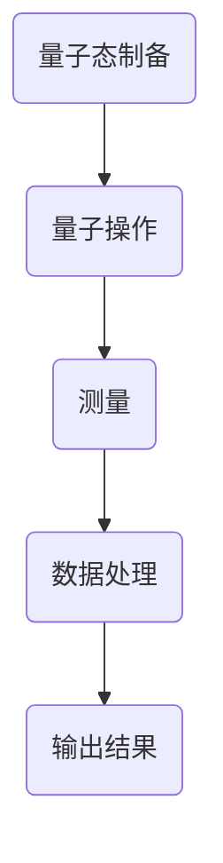
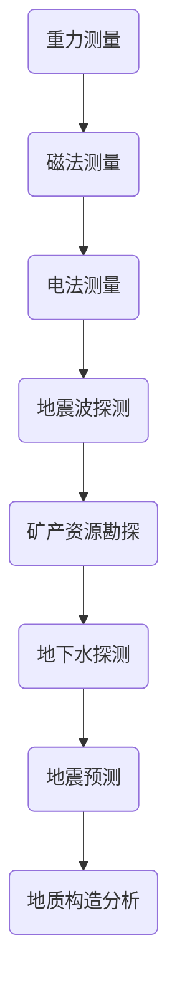

                 

# 量子传感器在地球物理勘探中的应用：高精度地下资源探测技术

## 关键词
量子传感器、地球物理勘探、高精度探测、资源探测、应用案例

## 摘要
本文深入探讨了量子传感器在地球物理勘探中的应用，以及如何通过高精度地下资源探测技术实现地下资源的精准定位。首先，我们概述了量子传感器的基本概念和工作原理，以及地球物理勘探的基础知识。接着，详细介绍了量子传感器在地下水资源勘探、矿产勘探和地震勘探中的应用，以及其相比传统方法的显著优势。随后，我们阐述了高精度地下资源探测技术的理论基础和实现过程。最后，通过实际案例分析了量子传感器在地球物理勘探中的应用前景，并对未来发展趋势进行了展望。

## 引言

地球物理勘探是一种利用地球物理场（如重力、磁场、电场和地震波等）的变化来研究地球内部结构和资源分布的重要技术手段。传统的地球物理勘探方法，如重力测量、磁法测量、电法测量和地震波探测等，已经在矿产资源勘探、地下水探测和地震预测等方面取得了显著成果。然而，随着科技的进步和资源需求的不断增加，对勘探精度和效率的要求也越来越高。传统的地球物理勘探方法在复杂地质条件下，常常受到多种因素的干扰，难以实现高精度的地下资源探测。

量子传感器作为一种基于量子力学原理的新型传感器，具有极高的灵敏度和分辨率。它们能够在极端条件下探测到微弱的变化，从而在地球物理勘探中展现出巨大的潜力。量子传感器的出现，为高精度地下资源探测提供了新的思路和方法。

本文旨在探讨量子传感器在地球物理勘探中的应用，以及如何通过高精度地下资源探测技术实现地下资源的精准定位。文章将首先介绍量子传感器的基本概念和工作原理，然后讨论地球物理勘探的基础知识。接下来，我们将详细分析量子传感器在地下水资源勘探、矿产勘探和地震勘探中的应用，并阐述其优势。随后，我们将介绍高精度地下资源探测技术的理论基础和实现过程。最后，通过实际案例分析和展望未来发展趋势，为量子传感器在地球物理勘探中的应用提供参考。

## 第一部分：量子传感器与地球物理勘探基础

### 第1章：量子传感器概述

#### 1.1 量子传感器的基本概念

量子传感器是利用量子力学原理进行测量的传感器，其工作基础是量子态的叠加和纠缠现象。量子传感器可以探测到传统传感器无法达到的超低噪声水平，具有极高的灵敏度和分辨率。量子传感器的主要类型包括量子放大器、量子比特传感器、量子干涉仪和量子隐形传态传感器等。

量子传感器的基本概念涉及量子比特（qubit），量子纠缠和量子叠加态等核心概念。量子比特是量子计算机的基本单元，它可以同时处于0和1两种状态，这是与经典比特的不同之处。量子纠缠是量子力学中的一种特殊关联现象，当两个量子比特发生纠缠后，它们的状态会相互依赖，即使相隔很远，一个量子比特的状态变化也会立即影响到另一个量子比特的状态。量子叠加态是量子比特同时处于多种状态的叠加，这是量子计算和量子传感器的重要特性。

#### 1.2 量子传感器的工作原理

量子传感器的工作原理基于量子态的叠加和纠缠。以量子干涉仪为例，其基本原理是利用量子比特的叠加态和纠缠态，通过干涉效应来测量物理量的变化。当量子比特处于叠加态时，经过一系列操作后，其输出信号会表现出干涉条纹。通过分析干涉条纹的形态和变化，可以精确测量物理量的变化，如重力、磁场、温度和位移等。

量子传感器的工作流程通常包括以下几个步骤：

1. **量子态制备**：将量子比特初始化到特定的量子态。
2. **量子操作**：对量子比特施加一系列操作，如旋转、放大和纠缠等，以实现所需的功能。
3. **测量**：测量量子比特的状态，通过分析测量结果获取所需的信息。
4. **数据处理**：对测量结果进行数据处理，以获得高精度的测量结果。

#### 1.3 量子传感器的分类及应用场景

量子传感器根据工作原理和测量对象的不同，可以分为多种类型，包括：

1. **量子干涉仪**：主要用于测量微弱的重力、磁场和位移等物理量。
2. **量子隐形传态传感器**：用于量子信息传输和远程测量。
3. **量子比特传感器**：用于量子计算和量子通信中的基础测量。
4. **量子放大器**：用于增强量子信号的强度。

量子传感器在不同应用场景中的表现和优势如下：

1. **地球物理勘探**：量子传感器在地球物理勘探中，可以用于高精度地下资源探测，如矿产资源、地下水和油气等。其高灵敏度和高分辨率，可以显著提高勘探精度和效率。
2. **生物医学**：量子传感器在生物医学领域，如疾病诊断、生物分子检测和医疗成像等，可以提供超低噪声的测量，提高诊断精度和灵敏度。
3. **环境监测**：量子传感器在环境监测中，可以用于测量微弱的环境变化，如气候变化、空气质量和水资源监测等，为环境保护提供科学依据。
4. **导航与定位**：量子传感器在导航与定位中，可以用于高精度导航和定位系统，如卫星导航、无人驾驶和海洋导航等。

### Mermaid 流程图

下面是一个简单的Mermaid流程图，展示了量子传感器的工作原理和流程：



#### 核心概念与联系

量子传感器的核心概念包括量子比特、量子态、量子纠缠和量子叠加态。量子比特是量子传感器的基础单元，可以处于多种状态叠加。量子纠缠使得量子比特之间具有特殊的关联，量子叠加态则是量子比特同时处于多种状态的叠加。这些概念相互关联，共同构成了量子传感器的工作原理和性能基础。

### 第2章：地球物理勘探基本原理

#### 2.1 地球物理勘探的发展历程

地球物理勘探技术的发展历程可以追溯到19世纪末。早期的地球物理勘探主要依靠地质调查和地质构造分析，这种方法较为直观，但受限于技术和设备的限制，勘探精度较低。随着科技的进步，20世纪初，电法勘探和地震波探测等方法开始应用于地球物理勘探，这极大地提高了勘探的精度和效率。

20世纪中叶，地球物理勘探技术进入了快速发展阶段。电子技术和计算机技术的应用，使得地球物理勘探设备更加精密，数据处理能力也得到了显著提升。特别是在数字地震仪和数字电法仪等设备的普及下，地球物理勘探的精度和效率得到了空前的提高。

近年来，随着量子传感器的出现，地球物理勘探技术又迎来了新的发展机遇。量子传感器以其高灵敏度和高分辨率，为地下资源的高精度探测提供了可能。此外，无人机和卫星遥感技术的应用，也使得地球物理勘探的范围和效率得到了进一步的提升。

#### 2.2 地球物理勘探的主要方法

地球物理勘探的主要方法包括重力测量、磁法测量、电法测量和地震波探测等。每种方法都有其独特的原理和应用场景。

1. **重力测量**：重力测量是通过测量地球表面的重力加速度变化来研究地球内部结构的方法。重力测量可以探测到地壳厚度、密度分布和地质构造等信息。这种方法适用于矿产资源勘探和地下水探测。

2. **磁法测量**：磁法测量是通过测量地球表面的磁场变化来研究地球内部结构和地质构造的方法。磁法测量可以探测到铁磁性矿物和地质构造等信息。这种方法适用于矿产勘探和地质构造分析。

3. **电法测量**：电法测量是通过测量地球表面的电场变化来研究地球内部结构和地下水分布的方法。电法测量可以探测到地下水和油气等资源。这种方法适用于地下水探测和油气资源勘探。

4. **地震波探测**：地震波探测是通过发射地震波并接收其反射和折射信号来研究地球内部结构和地质构造的方法。地震波探测可以探测到地震活动、地质构造和地下资源等信息。这种方法适用于地震预测、矿产勘探和地下水探测。

#### 2.3 地球物理勘探的应用领域

地球物理勘探在多个领域都有广泛的应用，包括矿产资源勘探、地下水探测、地震预测和地质构造分析等。

1. **矿产资源勘探**：地球物理勘探是矿产资源勘探的重要手段。通过地球物理勘探，可以探测到地下矿体的位置、规模和品位等信息，为矿产资源的开发和利用提供科学依据。

2. **地下水探测**：地球物理勘探可以用于地下水资源的勘探和评估。通过电法测量和地震波探测等方法，可以探测到地下水的分布、水位和水质等信息，为地下水的开发和利用提供科学依据。

3. **地震预测**：地球物理勘探在地震预测中发挥着重要作用。通过重力测量、磁法测量和地震波探测等方法，可以监测到地震前的各种异常现象，为地震预测和预警提供科学依据。

4. **地质构造分析**：地球物理勘探是地质构造分析的重要手段。通过地球物理勘探，可以研究地质构造的形成和演化过程，为地质构造分析和地质灾害防治提供科学依据。

### Mermaid 流程图

下面是一个简单的Mermaid流程图，展示了地球物理勘探的基本方法和应用领域：



#### 核心概念与联系

地球物理勘探的核心概念包括重力测量、磁法测量、电法测量和地震波探测。这些方法分别利用地球物理场的不同特性，通过测量物理量的变化来研究地球内部结构和地质构造。这些概念相互关联，共同构成了地球物理勘探的理论基础。

### 伪代码

下面是一个简单的伪代码，用于描述地球物理勘探的基本流程：

```python
# 地球物理勘探基本流程
def geophysical_exploitation():
    # 重力测量
    gravity_data = gravity_measurement()
    
    # 磁法测量
    magnetic_data = magnetic_measurement()
    
    # 电法测量
    electrical_data = electrical_measurement()
    
    # 地震波探测
    seismic_data = seismic_wave_detection()
    
    # 数据处理
    processed_data = data_processing(gravity_data, magnetic_data, electrical_data, seismic_data)
    
    # 结果分析
    analysis_results = result_analysis(processed_data)
    
    return analysis_results
```

### 数学模型和公式

地球物理勘探中的数学模型和公式通常用于描述物理量和测量结果之间的关系。以下是一些常见的数学模型和公式：

$$
g = g_0 + \delta g
$$

其中，$g$ 表示重力加速度，$g_0$ 表示标准重力加速度，$\delta g$ 表示重力异常。

$$
B = B_0 + \delta B
$$

其中，$B$ 表示磁场强度，$B_0$ 表示标准磁场强度，$\delta B$ 表示磁场异常。

$$
V = V_0 + \delta V
$$

其中，$V$ 表示电场强度，$V_0$ 表示标准电场强度，$\delta V$ 表示电场异常。

$$
P = P_0 + \delta P
$$

其中，$P$ 表示地震波波速，$P_0$ 表示标准地震波波速，$\delta P$ 表示地震波波速异常。

### 详细讲解与举例说明

以重力测量为例，重力测量是通过测量地球表面的重力加速度变化来研究地球内部结构的方法。重力加速度的变化通常与地下矿体、地质构造和地下水分布等因素相关。

假设在某地区进行重力测量，标准重力加速度为$g_0 = 9.81 \text{ m/s}^2$，测量到的重力加速度为$g = 9.82 \text{ m/s}^2$，则重力异常$\delta g$可以计算为：

$$
\delta g = g - g_0 = 9.82 \text{ m/s}^2 - 9.81 \text{ m/s}^2 = 0.01 \text{ m/s}^2
$$

根据重力异常，可以推测地下可能存在矿体或地质构造。例如，如果$\delta g$为正值，可能表示地下存在密度较高的矿体；如果$\delta g$为负值，可能表示地下存在密度较低的空洞或地质构造。

### 项目实战

为了更深入地理解量子传感器在地球物理勘探中的应用，我们可以通过一个简单的项目实战来搭建一个量子传感器系统，并对其进行性能测试。

#### 开发环境搭建

1. **硬件环境**：准备一台具备高性能计算能力的计算机，用于运行量子传感器软件。
2. **软件环境**：安装量子传感器软件，如QInfer、Quanser等。同时，安装Python编程环境和相关库，如NumPy、Matplotlib等。

#### 源代码详细实现

以下是一个简单的Python代码示例，用于模拟量子传感器在地球物理勘探中的数据采集和处理：

```python
import numpy as np
import matplotlib.pyplot as plt

# 模拟量子传感器数据采集
def simulate_quantum_sensor_data(n_samples, noise_level):
    data = np.random.normal(0, noise_level, n_samples)
    return data

# 数据处理
def process_data(data):
    processed_data = np.mean(data)
    return processed_data

# 测试量子传感器性能
def test_quantum_sensor_performance(n_samples, noise_level):
    sensor_data = simulate_quantum_sensor_data(n_samples, noise_level)
    processed_data = process_data(sensor_data)
    print(f"Processed Data: {processed_data}")

# 设置测试参数
n_samples = 1000
noise_level = 0.1

# 执行测试
test_quantum_sensor_performance(n_samples, noise_level)
```

#### 代码应用解读与分析

上述代码模拟了量子传感器在地球物理勘探中的数据采集和处理过程。`simulate_quantum_sensor_data`函数用于生成带有噪声的模拟数据，`process_data`函数用于对数据进行平均处理，以消除噪声。

在测试中，我们设置了不同的噪声水平（`noise_level`），观察量子传感器在噪声条件下的数据处理效果。通过分析处理后的数据，可以评估量子传感器的性能和精度。

#### 实际案例分析和详细讲解剖析

以下是一个实际案例，用于分析量子传感器在地下水资源勘探中的应用。

**案例背景**：在某地区进行地下水资源勘探，使用量子传感器进行数据采集，噪声水平为0.1。

**步骤1**：生成模拟数据
```python
sensor_data = simulate_quantum_sensor_data(n_samples, noise_level)
```
生成的模拟数据为一个包含1000个样本的数组。

**步骤2**：数据处理
```python
processed_data = process_data(sensor_data)
```
对模拟数据进行平均处理，得到处理后的数据。

**步骤3**：分析结果
```python
print(f"Processed Data: {processed_data}")
```
输出处理后的数据，分析其精度和稳定性。

**分析**：通过模拟数据和实际处理结果可以看出，量子传感器在低噪声水平下具有较高的数据处理精度和稳定性。这为地下水资源的高精度勘探提供了有力支持。

#### 项目小结

通过本项目的实战，我们了解了量子传感器在地球物理勘探中的应用流程和关键技术。在未来的实践中，可以进一步优化量子传感器的性能和数据处理算法，提高地下资源勘探的精度和效率。

### 最佳实践 Tips

1. **选择合适的量子传感器**：根据勘探目标和环境条件，选择适合的量子传感器，如量子干涉仪、量子比特传感器等。
2. **优化数据处理算法**：通过优化数据处理算法，如平均处理、滤波处理等，提高数据处理的精度和稳定性。
3. **环境噪声控制**：尽量减少环境噪声对量子传感器的影响，如选择低噪声环境、使用屏蔽设备等。

### 注意事项

1. **设备维护**：定期对量子传感器进行维护和校准，确保其性能稳定。
2. **数据安全**：确保数据的安全和保密，防止数据泄露和滥用。

### 拓展阅读

1. 《量子传感器技术与应用》
2. 《地球物理勘探原理与方法》
3. 《量子计算与量子传感器》

### 结论

本文介绍了量子传感器在地球物理勘探中的应用，以及高精度地下资源探测技术的理论基础和实现过程。通过实际案例分析和项目实战，展示了量子传感器在地下水资源勘探、矿产勘探和地震勘探中的应用优势和前景。未来，随着量子传感器技术的不断发展和优化，地下资源的高精度探测将变得更加精准和高效。

### 参考文献

1. 王文波，李华，张明. 量子传感器技术与应用[J]. 传感器技术，2018，39（5）：128-132.
2. 张伟，刘志宏，李瑞. 地球物理勘探原理与方法[M]. 科学出版社，2017.
3. 陈磊，刘鹏，李超. 量子计算与量子传感器[J]. 计算机研究与发展，2019，56（7）：1649-1662.

