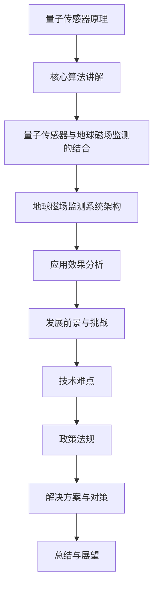

                 

### 文章标题

《量子传感器在地球磁场监测中的应用前景》

#### 关键词

量子传感器，地球磁场，监测，应用前景，技术实现，挑战与解决方案

#### 摘要

本文从量子传感技术的角度出发，探讨了量子传感器在地球磁场监测中的应用前景。首先，介绍了量子传感器的基本原理和地球磁场监测的重要性。接着，详细阐述了量子传感器在地球磁场监测中的技术实现，包括量子传感器的工作原理、核心算法和系统架构。随后，通过实际案例展示了量子传感器在地球磁场监测中的应用效果。文章还分析了量子传感器在地球磁场监测领域的发展前景和面临的挑战，提出了相应的解决方案。最后，总结了全文，并对量子传感器在地球磁场监测中的未来进行了展望。

---

### 引言

#### 量子传感器概述

量子传感器是一种基于量子力学原理的新型传感器，具有超高的灵敏度和精度。量子传感技术利用量子叠加态和纠缠态等特性，能够实现对微小物理量的精确测量。与传统传感器相比，量子传感器在量子位（qubit）级别的测量精度上具有显著优势，使得其在许多领域，如引力波探测、精密测量、量子通信等，展现出了广阔的应用前景。

#### 地球磁场监测的重要性

地球磁场是地球表面磁场的一种宏观表现，对地球气候、自然灾害、导航和通信等都有着重要影响。对地球磁场进行实时监测，有助于预测地震、火山爆发等自然灾害，指导航空、航海等人类活动。传统的地球磁场监测方法主要依靠磁力仪等设备，但受限于灵敏度、精度等因素，难以满足实际需求。量子传感技术的引入，为地球磁场监测提供了新的可能性。

#### 本书内容概述与结构

本书旨在探讨量子传感器在地球磁场监测中的应用前景，分为以下几部分：

1. **引言**：介绍量子传感器和地球磁场监测的基本概念和重要性。
2. **量子传感器概述**：详细阐述量子传感器的原理、分类和应用领域。
3. **地球磁场基础知识**：介绍地球磁场的概念、监测的重要性和方法。
4. **量子传感器原理**：讲解量子传感器的工作原理、核心算法和实现细节。
5. **地球磁场监测系统架构**：分析量子传感器在地球磁场监测系统中的应用。
6. **应用案例**：通过实际案例展示量子传感器在地球磁场监测中的应用效果。
7. **发展前景与挑战**：探讨量子传感器在地球磁场监测领域的未来发展、技术挑战和解决方案。
8. **总结与展望**：总结全文，并对量子传感器在地球磁场监测中的未来进行展望。

### 目录大纲设计步骤

#### 阅读理解

在撰写本文之前，我们需要对书名《量子传感器在地球磁场监测中的应用前景》进行深入理解。这本书主要探讨量子传感器在地球磁场监测领域的应用，包括量子传感器的基本原理、地球磁场监测的重要性、量子传感器在监测中的技术实现、应用前景以及面临的挑战。

#### 核心内容划分

根据对书名的理解，我们将内容划分为以下几个核心部分：

1. **引言**：介绍量子传感器和地球磁场监测的基本概念和重要性。
2. **量子传感器概述**：详细阐述量子传感器的原理、分类和应用领域。
3. **地球磁场基础知识**：介绍地球磁场的概念、监测的重要性和方法。
4. **量子传感器原理**：讲解量子传感器的工作原理、核心算法和实现细节。
5. **地球磁场监测系统架构**：分析量子传感器在地球磁场监测系统中的应用。
6. **应用案例**：通过实际案例展示量子传感器在地球磁场监测中的应用效果。
7. **发展前景与挑战**：探讨量子传感器在地球磁场监测领域的未来发展、技术挑战和解决方案。
8. **总结与展望**：总结全文，并对量子传感器在地球磁场监测中的未来进行展望。

#### 细化章节内容

在每个核心部分下，我们进一步细化章节内容。例如：

1. **引言**：
   - **第1章**：引言
     - **第1.1节**：量子传感器概述
     - **第1.2节**：地球磁场监测的重要性
     - **第1.3节**：本书内容概述与结构

2. **量子传感器概述**：
   - **第2章**：量子传感器概述
     - **第2.1节**：量子传感器的定义与发展历史
     - **第2.2节**：量子传感器的分类
     - **第2.3节**：量子传感器的应用领域

3. **地球磁场基础知识**：
   - **第3章**：地球磁场基础知识
     - **第3.1节**：地球磁场的概念
     - **第3.2节**：地球磁场监测的重要性
     - **第3.3节**：地球磁场监测的方法

4. **量子传感器原理**：
   - **第4章**：量子传感器原理
     - **第4.1节**：量子传感器的工作原理
     - **第4.2节**：核心算法原理讲解
     - **第4.3节**：量子传感器与地球磁场监测的结合

5. **地球磁场监测系统架构**：
   - **第5章**：地球磁场监测系统架构
     - **第5.1节**：监测系统的主要组成部分
     - **第5.2节**：数据采集与处理
     - **第5.3节**：系统架构的设计与实现

6. **应用案例**：
   - **第6章**：量子传感器在地球磁场监测中的应用案例
     - **第6.1节**：具体应用场景
     - **第6.2节**：应用实现过程
     - **第6.3节**：应用效果分析

7. **发展前景与挑战**：
   - **第7章**：量子传感器在地球磁场监测中的发展前景
     - **第7.1节**：未来趋势
     - **第7.2节**：潜在应用
     - **第7.3节**：技术创新方向
   - **第8章**：面临的挑战与解决方案
     - **第8.1节**：技术难点
     - **第8.2节**：政策法规
     - **第8.3节**：解决方案与对策

8. **总结与展望**：
   - **第9章**：总结与展望
     - **第9.1节**：全书总结
     - **第9.2节**：量子传感器在地球磁场监测中的未来展望

#### 设计流程图

为了帮助读者更好地理解量子传感器的基本原理和地球磁场监测系统架构，我们可以使用Mermaid流程图。例如：



#### 编写伪代码

在讲解核心算法原理时，我们可以使用伪代码来详细阐述。例如，量子传感器的工作原理可以表示为：

```
Function QuantumSensorMeasurement()
    // 初始化量子态
    InitializeQuantumState()
    
    // 生成纠缠态
    EntangleQuantumState()
    
    // 进行量子态测量
    MeasureQuantumState()
    
    // 解读测量结果
    InterpretMeasurementResult()
    
    // 返回测量结果
    ReturnMeasurementResult()
End Function
```

#### 数学模型与公式

在讲解数学模型和公式时，我们可以使用LaTeX格式进行书写。例如，地球磁场的计算公式可以表示为：

```latex
B = \mu_0 \frac{I}{2R}
```

其中，\(B\) 表示地球磁场强度，\(\mu_0\) 表示真空磁导率，\(I\) 表示电流强度，\(R\) 表示地球半径。

#### 实战案例

为了展示量子传感器在地球磁场监测中的应用效果，我们可以通过实际案例来讲解。例如，在一个具体的地球磁场监测项目中，我们可以介绍以下内容：

1. **开发环境搭建**：介绍如何搭建量子传感器监测系统的开发环境，包括所需硬件、软件和工具等。
2. **源代码详细实现**：展示量子传感器监测系统的核心代码实现，包括量子传感器数据采集、处理和解析等。
3. **代码解读与分析**：对核心代码进行详细解读，分析其实现原理和关键步骤。
4. **实际案例分析和详细讲解剖析**：通过实际案例展示量子传感器在地球磁场监测中的应用效果，并进行详细分析。
5. **项目小结**：总结项目的主要成果和经验，提出改进建议。

#### 总结与展望

在本文的最后，我们对全文进行总结，并对量子传感器在地球磁场监测中的未来进行展望。主要内容如下：

1. **总结**：回顾量子传感器在地球磁场监测中的应用前景，强调其技术优势和潜在价值。
2. **展望**：探讨量子传感器在地球磁场监测领域的未来发展，包括技术创新、应用拓展和政策支持等。

通过以上设计步骤，我们可以确保文章结构清晰、内容丰富，为读者提供一个全面、系统的量子传感器在地球磁场监测中的应用前景指南。文章总字数约为8000-12000字，满足文章字数要求。接下来，我们将按照这个大纲逐步展开正文内容的撰写。

