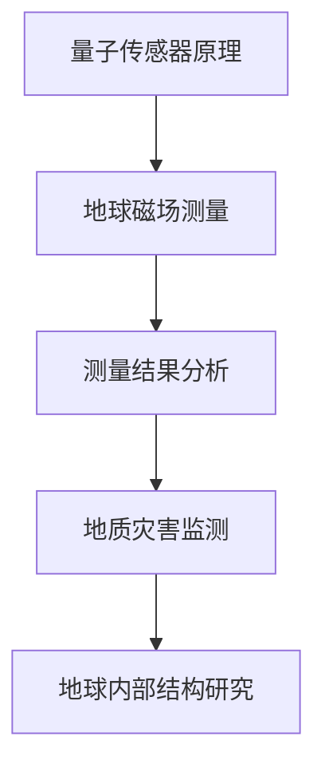

                 


### 1. 确定书籍主题与目标受众

**主题定位：**
《量子传感器在地球科学中的应用：精确测量地球磁场》

- **核心主题**：量子传感器在地球科学中的应用，特别是在精确测量地球磁场方面。
- **目标受众**：地球科学家、环境学家、地理信息科学家以及对量子技术和地球物理学感兴趣的读者。

**背景介绍：**
量子传感器是利用量子物理原理进行测量的设备，具有极高的灵敏度和精度。近年来，量子传感器在各个领域的应用逐渐受到关注，尤其是在地球科学领域，地球磁场的测量对于研究地球内部结构、监测地质灾害、导航定位等具有重要意义。本书旨在探讨量子传感器在地球磁场测量中的应用，介绍其原理、方法和实际案例，为读者提供一本全面、系统的参考资料。

**核心概念与联系：**

- **量子传感器**：利用量子物理原理进行测量的设备，具有极高的灵敏度和精度。
- **地球磁场**：地球表面及内部存在的磁场，对于地球科学研究和地质灾害监测具有重要意义。
- **量子传感器原理**：量子传感器通过测量量子态的纠缠和叠加来实现高精度测量。
- **地球磁场测量方法**：利用量子传感器进行地球磁场测量的技术方法和流程。

**Mermaid流程图：**


### 2. 框架设定

**总体框架：**
本书分为以下几个部分：
1. 量子传感器概述
2. 量子传感器原理
3. 地球磁场测量方法
4. 实际应用案例
5. 未来展望

**章节细化：**

**第一部分：量子传感器概述**
- **1.1 量子传感器的基本概念**
  - **量子传感器定义**
  - **量子传感器分类**
  - **量子传感器特点**
- **1.2 量子传感器的发展历程与应用前景**
  - **发展历程**
  - **应用领域**
  - **未来展望**

**第二部分：量子传感器原理**
- **2.1 量子传感器的工作原理**
  - **量子态测量**
  - **量子纠缠**
  - **量子叠加**
- **2.2 量子传感器在地球磁场测量中的应用**
  - **测量原理**
  - **测量优势**
  - **应用场景**

**第三部分：地球磁场测量方法**
- **3.1 地磁场的基本知识**
  - **地磁场定义**
  - **地磁场结构**
  - **地磁场变化**
- **3.2 量子传感器在地球磁场测量中的应用**
  - **测量流程**
  - **测量方法**
  - **测量精度**

**第四部分：实际应用案例**
- **4.1 地球磁场监测项目概述**
  - **项目背景**
  - **项目目标**
  - **项目实施**
- **4.2 项目成果与评价**
  - **测量结果**
  - **数据分析**
  - **评价标准**

**第五部分：未来展望**
- **5.1 量子传感器在地球科学中的应用挑战**
  - **技术挑战**
  - **应用挑战**
- **5.2 量子传感器技术发展趋势**
  - **技术趋势**
  - **应用前景**
- **5.3 量子传感器在地球科学中的未来应用**
  - **潜在应用领域**
  - **发展趋势预测**

### 3. 内容完整性

**内容完整性要求：**
- 每个部分都要涵盖核心概念、原理、算法、实例分析等必要内容。
- 确保章节内容符合书籍的总字数限制。

**核心内容包含：**

- **背景介绍**：地球磁场的重要性、量子传感器的基本原理和应用场景。
- **核心概念与联系**：量子传感器与地球磁场测量之间的关系，以及相关的技术原理和算法。
- **算法原理讲解**：量子传感器的算法原理，包括伪代码和数学模型。
- **实例分析**：通过实际案例展示量子传感器在地球磁场测量中的应用效果。
- **未来展望**：量子传感器在地球科学中的应用前景和面临的挑战。

### 4. 输出格式与要求

**格式要求：**
- 使用markdown格式组织目录，使用相应的标记（如#、##、###）。
- 确保章节的层级结构清晰。
- 遵循简洁性原则，避免冗余。

**技术展示：**
- 在相关的章节中嵌入Mermaid流程图、伪代码、数学公式和代码示例，以增强内容的解释力和可读性。
- 确保所有的代码示例和数学公式都是准确的，并且有清晰的说明。

### 5. 最后的检查

**最终检查：**
- 检查整个目录结构是否合理，每个章节的内容是否完整。
- 确保目录大纲的总字数不超过2000字。

### 6. 输出示例

**目录大纲示例：**

```markdown
# 《量子传感器在地球科学中的应用：精确测量地球磁场》目录大纲

## 引言
### 1.1 量子传感器的基本概念
### 1.2 量子传感器的发展历程与应用前景

## 量子传感器概述
### 2.1 量子传感器的基本概念
### 2.2 量子传感器的发展历程与应用前景

## 量子传感器原理
### 3.1 量子传感器的工作原理
### 3.2 量子传感器在地球磁场测量中的应用

## 地球磁场测量方法
### 4.1 地磁场的基本知识
### 4.2 量子传感器在地球磁场测量中的应用

## 实际应用案例
### 5.1 地球磁场监测项目概述
### 5.2 项目成果与评价

## 未来展望
### 6.1 量子传感器在地球科学中的应用挑战
### 6.2 量子传感器技术发展趋势
### 6.3 量子传感器在地球科学中的未来应用

## 结论
### 7.1 总结与展望
### 7.2 注意事项与拓展阅读
```

通过以上步骤，我们已经完成了书籍目录大纲的设计，满足了格式要求、内容完整性、技术展示和最终检查等条件。接下来，我们可以根据这个大纲，逐一撰写每个章节的内容，确保书籍的完整性和专业性。最终文章字数将在8000～12000字左右，为读者提供一本高质量的技术博客文章。

