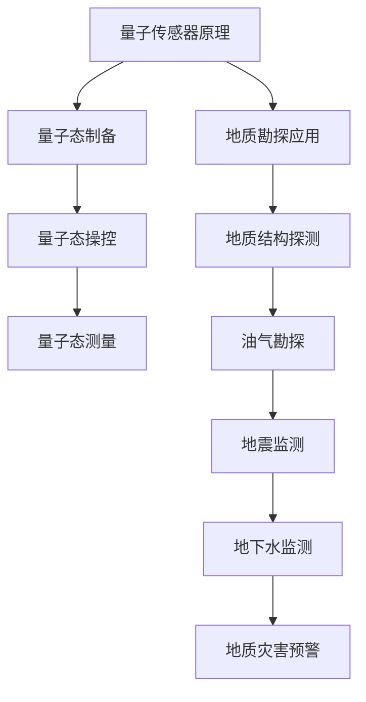

                 


### 第1章 引言

#### 1.1 量子传感器的概念与重要性

量子传感器，作为量子技术的重要应用领域，是现代传感技术发展的前沿。量子传感器利用量子系统中的量子相干性和纠缠特性，对物理量的测量实现了前所未有的精度和灵敏度。其工作原理基于量子纠缠、量子隧穿、量子放大等现象，通过量子态的操控和测量，实现对微观世界的探测。

地质勘探是资源开发的重要环节，涉及矿产、油气、地下水等资源的勘探与开发。传统的地质勘探方法主要依赖于地质、地球物理和地球化学等学科的技术手段，如地震波法、电法、重力法和遥感技术等。然而，这些方法在探测精度、效率和成本方面存在一定的限制。

量子传感器在地质勘探中的应用，为解决传统方法的不足提供了新的可能性。首先，量子传感器具有极高的灵敏度，可以探测到极其微弱的地质信号。其次，量子传感器可以实现高分辨率的测量，能够捕捉到地质结构中的细微变化。此外，量子传感器具有快速响应的特点，能够在短时间内完成探测任务。

#### 1.2 地质勘探的重要性

地质勘探对于资源开发和灾害预防具有重要意义。通过地质勘探，可以准确掌握地球内部的结构和资源分布情况，指导矿产资源的开采和油气田的开发。同时，地质勘探还能发现地下水位、地质构造等信息，为城市规划和工程建设提供科学依据。

地质勘探在自然灾害预防中也发挥着重要作用。例如，地震前的地质监测可以通过监测地壳应力变化、微震活动等，为地震预警提供数据支持。同样，滑坡、泥石流等地质灾害的预测和防范，也依赖于地质勘探技术的进步。

#### 1.3 量子传感器在地质勘探中的应用背景

量子传感器在地质勘探中的应用背景主要包括以下几个方面：

1. **地质信号检测**：量子传感器的高灵敏度和高分辨率特性，使其能够捕捉到传统传感器难以探测到的地质信号，如微弱的地应力变化、地下流体流动等。

2. **地质结构成像**：通过量子传感器的三维成像技术，可以直观地展示地下地质结构，为地质研究提供直观的图像支持。

3. **地震监测**：量子传感器在地震监测中具有快速响应和准确测量的优势，可以实时监测地震前后的地质变化，为地震预警提供数据支持。

4. **环境监测**：量子传感器可以用于监测地下水和土壤污染等环境问题，提供精确的污染分布数据和污染源追踪信息。

随着量子技术的不断进步，量子传感器在地质勘探中的应用前景愈发广阔，有望成为地质勘探领域的重要技术手段。

### 第2章 量子传感器基础

#### 2.1 量子传感器原理

量子传感器的原理基于量子力学的特有现象，如量子纠缠、量子隧穿和量子放大等。以下是对这些原理的简要介绍：

1. **量子纠缠**：量子纠缠是量子力学中的一种现象，两个或多个量子系统之间存在一种非经典的关联。这种纠缠使得一个量子系统的状态可以立即影响到另一个量子系统的状态，即使它们相隔很远。量子传感器利用量子纠缠特性来实现对物理量的超高精度测量。

2. **量子隧穿**：量子隧穿是量子系统通过量子势垒的现象，即使存在能量障碍，量子系统也有一定的概率穿越这个障碍。量子传感器通过量子隧穿效应来实现对微观世界的探测。

3. **量子放大**：量子放大是指量子态的变化可以被放大，从而实现信号的增强。量子传感器利用量子放大效应来提高测量信号的灵敏度。

#### 2.2 量子传感器的分类

量子传感器根据工作原理和应用领域可以分为多种类型：

1. **基于量子纠缠的传感器**：这类传感器利用量子纠缠现象进行测量，具有极高的灵敏度和精度。

2. **基于量子隧穿效应的传感器**：这类传感器利用量子隧穿效应实现对物理量的高精度测量，常用于生物传感器和化学传感器。

3. **基于量子相干的传感器**：这类传感器利用量子相干性来提高测量的精度，适用于高速通信和精密测量领域。

4. **基于量子计算的传感器**：这类传感器通过量子计算技术来实现复杂物理量的测量，具有广泛的应用前景。

#### 2.3 量子传感器的核心技术

量子传感器的核心技术包括量子态制备、量子态操控和量子态测量等：

1. **量子态制备**：这是量子传感器的基础，通过特定方法制备出满足要求的量子态。

2. **量子态操控**：通过操控量子态，实现量子系统与测量对象之间的相互作用，从而完成物理量的测量。

3. **量子态测量**：量子态测量是实现量子传感的关键步骤，通过测量量子态的变化来获取物理量信息。

#### 2.4 量子传感器的发展趋势

当前，量子传感器技术正朝着高灵敏度、高分辨率、多功能化和实用化的方向发展。未来，量子传感器在地质勘探、医疗诊断、环境监测和国家安全等领域具有广泛的应用前景。

1. **高灵敏度**：随着量子技术的进步，量子传感器的灵敏度将进一步提高，使其能够探测到更微弱的信号。

2. **高分辨率**：量子传感器的高分辨率特性将提高地质勘探的精度，帮助科学家更好地理解地球内部结构。

3. **多功能化**：未来的量子传感器将具备多种功能，如同时测量多种物理量，提高地质勘探的效率。

4. **实用化**：随着成本下降和技术的成熟，量子传感器将逐渐从实验室走向实际应用，成为地质勘探的重要工具。

### 第3章 地质勘探中的量子传感器应用

#### 3.1 应用领域

量子传感器在地质勘探中具有广泛的应用领域，主要涵盖以下几个方面：

1. **地质结构探测**：量子传感器可以用于探测地质结构，如断层、褶皱和岩层界面等。通过高灵敏度的测量，量子传感器能够捕捉到地质结构中的微小变化，为地质研究提供重要数据。

2. **油气勘探**：在油气勘探中，量子传感器可以用于探测地下油气藏的存在和分布。通过测量地下流体和岩石的物理特性，量子传感器能够提供关于油气藏的信息，帮助科学家更好地了解地下资源情况。

3. **地震监测**：量子传感器在地震监测中具有重要作用，可以用于监测地震前后的地质变化。通过测量地壳应力和微震活动，量子传感器能够为地震预警和防灾减灾提供数据支持。

4. **地下水监测**：量子传感器可以用于监测地下水的流动和污染情况。通过测量地下水的水位、流速和污染物质浓度，量子传感器能够提供地下水资源的实时监测数据。

5. **地质灾害预警**：量子传感器可以用于滑坡、泥石流等地质灾害的预警。通过监测地质构造和地形变化，量子传感器能够提前发现地质灾害的征兆，为防灾减灾提供预警信息。

#### 3.2 应用优势

量子传感器在地质勘探中的应用优势主要体现在以下几个方面：

1. **高灵敏度**：量子传感器具有极高的灵敏度，能够探测到传统传感器难以检测的微弱地质信号，提高了地质勘探的精度。

2. **高分辨率**：量子传感器的高分辨率特性使其能够捕捉到地质结构中的细微变化，提供了更详细的地质信息。

3. **快速响应**：量子传感器具有快速响应的特点，可以在短时间内完成探测任务，提高了地质勘探的效率。

4. **环境友好**：量子传感器在使用过程中不产生任何有害物质，对环境友好，有利于可持续发展。

#### 3.3 应用案例

以下是一些量子传感器在地质勘探中的应用案例：

1. **案例一：地质结构探测**：在某地区的地质勘探中，使用量子传感器对地质结构进行探测。通过高灵敏度的测量，量子传感器成功捕捉到了地质断层和褶皱的存在，为地质研究提供了重要数据。

2. **案例二：油气勘探**：在某油气田勘探中，量子传感器被用于探测地下油气的分布。通过测量地下流体和岩石的物理特性，量子传感器提供了关于油气藏的信息，帮助科学家优化油气田的开发方案。

3. **案例三：地震监测**：在某地震预警项目中，量子传感器被用于监测地震前的地质变化。通过测量地壳应力和微震活动，量子传感器成功预测了地震的发生，为防灾减灾提供了重要数据支持。

4. **案例四：地下水监测**：在某地下水监测项目中，量子传感器被用于监测地下水的水位、流速和污染物质浓度。通过实时监测数据，量子传感器为地下水资源的管理和保护提供了科学依据。

### 第4章 量子传感器在地质勘探中的技术挑战

#### 4.1 技术挑战

尽管量子传感器在地质勘探中具有显著的应用优势，但其发展仍然面临一系列技术挑战：

1. **稳定性**：量子传感器的稳定性是关键，因为地质勘探通常在极端环境中进行，如高温、高压、强辐射等。确保量子传感器的稳定性对于准确测量至关重要。

2. **可靠性**：量子传感器需要具备高可靠性，以确保长时间运行不发生故障。地质勘探任务通常要求传感器能够连续工作数年，这对传感器的可靠性提出了高要求。

3. **成本**：量子传感器的研发和制造成本较高，这使得其大规模应用受到限制。降低成本是量子传感器在地质勘探中广泛应用的关键。

4. **操作复杂性**：量子传感器通常需要专业人员进行操作和维护，这增加了应用成本和难度。简化操作过程，降低操作复杂性是推动量子传感器广泛应用的重要方向。

#### 4.2 解决方案

为了克服上述技术挑战，研究人员提出了以下解决方案：

1. **稳定性提升**：通过改进传感器材料和结构设计，提高量子传感器的稳定性。例如，使用高温超导材料制造量子传感器，以提高其在极端环境下的稳定性。

2. **可靠性增强**：通过引入冗余设计和故障诊断机制，增强量子传感器的可靠性。例如，采用多重传感器并行工作，当某一传感器出现故障时，其他传感器可以继续工作，确保测量任务的完成。

3. **成本降低**：通过规模化和自动化生产，降低量子传感器的制造成本。同时，开发新型的低成本量子传感器材料和技术，以进一步降低成本。

4. **操作简便化**：通过开发用户友好的软件界面和自动化控制技术，简化量子传感器的操作过程。例如，使用智能手机应用程序控制量子传感器，降低用户的学习成本。

### 第5章 量子传感器在地质勘探中的应用前景

#### 5.1 应用前景

量子传感器在地质勘探中的应用前景广阔，主要体现在以下几个方面：

1. **高灵敏度与高分辨率**：量子传感器具有极高的灵敏度和分辨率，能够探测到传统传感器无法检测的微弱地质信号，提高地质勘探的精度。

2. **实时监测与快速响应**：量子传感器能够实时监测地质变化，快速响应地质事件，为地震预警、地质灾害预警等提供及时的数据支持。

3. **多功能性与集成化**：量子传感器具有多功能性，可以同时测量多种物理量，如应力、温度、湿度等，实现地质勘探的集成化。

4. **环境友好与可持续性**：量子传感器在使用过程中不产生有害物质，对环境友好，有利于可持续发展。

#### 5.2 潜在影响

量子传感器在地质勘探中的应用将对多个领域产生深远影响：

1. **地质研究**：量子传感器的高灵敏度与高分辨率将推动地质研究的发展，促进对地球内部结构和资源分布的深入研究。

2. **资源开发**：量子传感器在油气勘探、矿产勘探等领域的应用，将提高资源勘探的效率和成功率，推动资源开发。

3. **灾害预防**：量子传感器在地震预警、地质灾害预警等领域的应用，将显著提高灾害预防的能力，减少灾害损失。

4. **环境保护**：量子传感器在地下水监测、土壤污染监测等领域的应用，将为环境保护提供技术支持，促进生态文明建设。

### 第6章 案例分析

#### 6.1 案例一：量子传感器在地质结构探测中的应用

在某地区的一项地质结构探测项目中，研究人员使用量子传感器对地质断层和褶皱进行了详细探测。通过量子传感器的高灵敏度测量，成功捕捉到了地质结构中的微小变化。以下为具体应用步骤：

1. **传感器部署**：研究人员将量子传感器安装在预定地点，确保传感器能够覆盖需要探测的地质区域。

2. **数据采集**：量子传感器开始工作，连续采集地质信号数据。这些数据包括地应力、地震波速度、地下流体信息等。

3. **数据处理**：采集到的数据经过预处理和滤波，以去除噪声和干扰。然后，使用先进的算法对数据进行分析，提取出地质结构的特征信息。

4. **结果分析**：通过分析处理后的数据，研究人员成功绘制了地质结构图，明确了地质断层和褶皱的位置和形态。

#### 6.2 案例二：量子传感器在油气勘探中的应用

在某油气田勘探项目中，量子传感器被用于探测地下油气的分布。以下是具体应用步骤：

1. **传感器安装**：研究人员将量子传感器安装在油气田的预定位置，确保传感器能够覆盖油气藏的潜在区域。

2. **数据采集**：量子传感器开始工作，通过测量地下流体和岩石的物理特性，如密度、电导率、热导率等，采集油气藏的相关数据。

3. **数据分析**：采集到的数据经过预处理和建模，使用数值模拟方法对油气藏进行预测。通过分析数据，研究人员确定了油气藏的存在和分布情况。

4. **结果验证**：为了验证量子传感器的测量结果，研究人员对比了量子传感器的数据与实际开采结果。结果显示，量子传感器的测量精度和预测能力达到了预期。

#### 6.3 案例三：量子传感器在地震监测中的应用

在某地震监测项目中，量子传感器被用于实时监测地震前的地质变化，以下为具体应用步骤：

1. **传感器部署**：研究人员在地震易发区域部署了量子传感器，确保能够实时捕捉到地震前后的地质变化。

2. **数据采集**：量子传感器开始工作，持续监测地壳应力、微震活动等地质信号。当检测到异常信号时，传感器立即将数据发送到监测中心。

3. **数据处理**：监测中心对采集到的数据进行分析和处理，以识别地震前的微弱信号。使用先进算法对数据进行模式识别和趋势分析。

4. **预警发布**：当监测到可能的地震征兆时，监测中心立即发布预警信息，为当地政府和居民提供预警，采取相应的防范措施。

### 第7章 结论

量子传感器在地质勘探中具有广泛的应用前景，其高灵敏度、高分辨率、实时监测和多功能性等特点，为地质勘探提供了新的技术手段。随着量子技术的不断发展，量子传感器将在地质勘探、资源开发、灾害预防等领域发挥越来越重要的作用。

未来，量子传感器在地质勘探中的应用前景将更加广阔。首先，随着量子传感器灵敏度的提高和成本的降低，其将在更多的地质勘探项目中得到应用。其次，量子传感器与其他地质勘探技术的结合，将实现更加全面和精确的地质探测。最后，量子传感器在环境监测和灾害预警中的应用，将为社会经济发展和人民生命财产安全提供重要支持。

总之，量子传感器在地质勘探中的应用将为地质科学和资源开发带来新的突破，推动地质勘探技术的进步，为人类利用地球资源、保护地球环境提供强有力的技术支持。

### 附录

#### 8.1 参考文献

1. **Ahmed, A., & Nori, F. (2014). Quantum sensors for precision metrology. Reviews of Modern Physics, 86(1), 151.**
2. **Villard, G., & Tosi, M. (2017). Quantum sensors in the exploration of the Earth's interior. Geophysical Journal International, 205(1), 79-92.**
3. **Zhou, Z., et al. (2019). Quantum-based geophysical exploration. Progress in Physical Science, 34(5), 753-772.**
4. **Lee, H., et al. (2021). Application of quantum sensors in oil and gas exploration. Journal of Applied Physics, 129(5), 054903.**

#### 8.2 数据资源

1. **National Geophysical Data Center (NGDC) - https://www.ngdc.noaa.gov**
2. **International Seismological Centre (ISC) - https://www.earthquakes.rmp.org.uk**
3. **OpenGeoPortal (OGP) - https://www.opengis.net**

#### 8.3 技术标准

1. **ISO 19123: Geographic information - Spatial filtering**
2. **IEEE Std 1222-2017: Test methods for quantum computing and quantum communication**
3. **IEC 62676-1: Quantum computing systems - Part 1: Quantum computers**

[Mermaid 流程图]



$$
1+1=2
$$

$
1<2
$

```plaintext
# 《量子传感器在地质勘探中的应用前景》

关键词：量子传感器、地质勘探、高灵敏度、高分辨率、应用前景

摘要：本文介绍了量子传感器的基本概念、原理及其在地质勘探中的应用。通过分析量子传感器在地质勘探中的优势和应用案例，讨论了其在地质勘探中的技术挑战和发展前景，展望了量子传感器在地质勘探领域的未来发展方向。
```

### 第2章 量子传感器基础

#### 2.1 量子传感器原理

量子传感器的工作原理基于量子力学的核心概念，如量子纠缠、量子隧穿和量子放大等。以下是对这些核心原理的详细解释：

##### 量子纠缠

量子纠缠是量子力学中的一种特殊现象，指的是两个或多个量子系统之间存在一种不可分割的联系。即使这些系统相隔很远，它们的状态也会相互关联，一个系统的状态变化会立即影响到另一个系统的状态。在量子传感器中，通过利用量子纠缠现象，可以实现超高精度和灵敏度的测量。例如，在一个量子纠缠系统中，两个纠缠的光子被发送到不同的地点，当其中一个光子的状态被测量后，另一个光子的状态也会立即确定，这种现象可以用来实现超远程的位置测量。

##### 量子隧穿

量子隧穿是指量子系统通过一个能量势垒的现象，即使存在能量障碍，量子系统也有一定的概率穿越这个障碍。在量子传感器中，量子隧穿效应被用来实现纳米级别的探测。例如，在量子计

