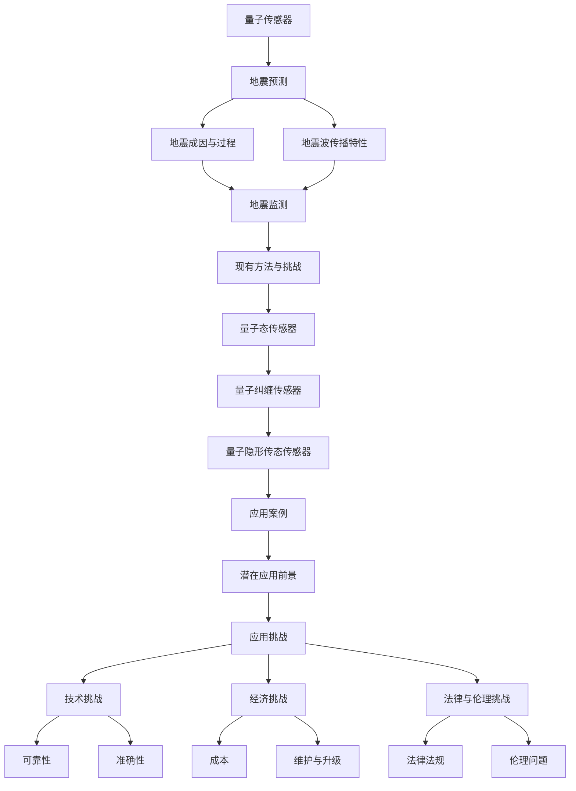

                 


# 文章标题：量子传感器在地震预测中的潜在应用

> 关键词：量子传感器、地震预测、量子态、量子纠缠、量子隐形传态

> 摘要：本文将探讨量子传感器在地震预测中的潜在应用，从量子传感器的基本原理、分类和优势出发，深入分析地震预测的基本原理、现有方法与挑战，然后分别介绍量子态传感器、量子纠缠传感器和量子隐形传态传感器在地震预测中的应用，最后讨论量子传感器在地震预测中的应用挑战与展望。

## 第一部分：量子传感器与地震预测基础

### 第1章：量子传感器概述

#### 1.1 量子传感器的基本原理

量子传感器是基于量子力学原理设计的一种新型传感器，它利用量子系统的特殊性质，如量子态、量子纠缠、量子隐形传态等，实现高灵敏度的测量和探测。量子传感器的核心在于量子比特（qubit），它是一种具有两个或更多量子态的物理系统，可以同时处于多种状态。

量子力学基础：量子力学是研究物质和能量在微观尺度上的行为和规律的物理学分支。量子态、量子纠缠、量子隐形传态等都是量子力学中的重要概念。

量子传感器的工作原理：量子传感器通过将待测对象与量子比特相互作用，利用量子比特的特殊性质，如叠加态和纠缠态，实现对对象的测量和探测。例如，量子态传感器可以通过测量量子态的变化来检测物理量的变化。

#### 1.2 量子传感器的分类

量子传感器的分类可以根据其工作原理和测量对象的不同进行划分。以下是常见的几种量子传感器：

1. 量子态传感器：利用量子态的叠加态和纠缠态进行测量，实现对物理量的高灵敏度探测。

2. 量子纠缠传感器：利用量子纠缠的特性，实现远距离的量子信息传输和测量。

3. 量子隐形传态传感器：利用量子隐形传态的特性，实现信息的高速传输和测量。

#### 1.3 量子传感器在地震预测中的优势

量子传感器在地震预测中的优势主要体现在以下几个方面：

1. 高灵敏度：量子传感器具有极高的测量精度，可以检测到微小的物理量变化，有助于提前发现地震前的异常现象。

2. 远距离监测：量子纠缠传感器可以实现远距离的量子信息传输和测量，为地震预测提供了更广泛的空间范围。

3. 实时监测：量子传感器可以实时监测地震前后的物理量变化，为地震预测提供及时的数据支持。

### 第2章：地震预测的基本原理

#### 2.1 地震的成因与过程

地震是由于地球内部的岩石在构造运动过程中突然释放能量而产生的一种地质现象。地震的成因主要与地球板块的运动有关，当板块之间的应力积累到一定程度时，会发生突然的释放，形成地震。

地震活动过程可以分为以下几个阶段：

1. 应力积累：在地震发生前，地球内部的岩石逐渐积累应力。

2. 应力释放：当应力积累到一定程度时，岩石会发生断裂或滑动，释放出能量，形成地震。

3. 能量传播：地震产生的能量会以地震波的形式传播到地表，引发地表的震动。

#### 2.2 地震波的传播特性

地震波是地震产生时在地表以下传播的振动波，根据传播速度和振动的特点，可以分为纵波（P波）和横波（S波）。

1. 纵波（P波）：纵波的传播速度较快，可以在固体、液体和气体中传播，振动方向与波的传播方向相同。

2. 横波（S波）：横波的传播速度较慢，只能在固体中传播，振动方向与波的传播方向垂直。

地震波的传播特性对地震预测具有重要意义，通过对地震波的传播特性进行分析，可以推测地震的震源深度、震级等信息。

#### 2.3 地震预测的现有方法与挑战

地震预测一直是地球科学领域的重要研究课题。目前，地震预测的主要方法包括：

1. 地震活动趋势分析：通过分析地震活动的历史记录，预测未来地震的可能性和强度。

2. 地震前兆监测：通过监测地震前的异常现象，如地下水位、地应力、电磁场等变化，预测地震的发生。

3. 地震波形分析：通过分析地震波形的特征，推测地震的震源深度、震级等信息。

然而，地震预测仍面临许多挑战：

1. 预测准确性：地震预测的准确性受到地震成因复杂性的影响，目前难以准确预测地震的发生时间和强度。

2. 预测时效性：地震预测需要提前发现地震前的异常现象，但地震前兆的监测和识别往往需要较长的时间。

3. 预测成本：地震预测需要大量的资金和技术支持，目前全球地震预测的能力仍然有限。

## 第二部分：量子传感器在地震预测中的应用

### 第3章：量子态传感器在地震预测中的应用

#### 3.1 量子态传感器的原理与应用

量子态传感器是利用量子态的叠加态和纠缠态进行测量的传感器。其基本原理是利用量子比特的叠加态和纠缠态，实现对物理量的高灵敏度测量。

量子态传感器的应用包括以下几个方面：

1. 高灵敏度测量：量子态传感器具有极高的测量精度，可以检测到微小的物理量变化，如重力、磁场、温度等。

2. 超分辨率成像：量子态传感器可以实现超分辨率成像，提高成像的清晰度和分辨率。

3. 地震预测：量子态传感器可以通过测量地震前的物理量变化，如地下水位、地应力等，预测地震的发生。

#### 3.2 量子态传感器在地震监测中的应用案例

近年来，量子态传感器在地震监测中的应用取得了一些成果。以下是一些实际应用案例：

1. 地下水位监测：研究人员利用量子态传感器监测地下水位的变化，发现地震前地下水位会出现异常波动，为地震预测提供了重要依据。

2. 地应力监测：地应力是地震发生前的重要前兆之一。研究人员利用量子态传感器测量地应力的变化，发现地震前地应力会逐渐增大，为地震预测提供了有力支持。

3. 磁场监测：磁场变化是地震前的一种常见现象。研究人员利用量子态传感器监测磁场的波动，发现地震前磁场会出现异常变化，为地震预测提供了新途径。

#### 3.3 量子态传感器在地震预测中的潜在应用前景

量子态传感器在地震预测中的应用前景十分广阔。未来，随着量子传感技术的不断发展，量子态传感器在地震预测中的性能将进一步提高，有望实现以下应用：

1. 实时监测：量子态传感器可以实现实时监测地震前的物理量变化，为地震预测提供及时的数据支持。

2. 精细化预测：量子态传感器具有极高的测量精度，可以实现精细化的地震预测，提高预测的准确性。

3. 跨学科研究：量子态传感器在地震预测中的应用将推动量子传感技术与地球科学研究的深度融合，促进跨学科研究的发展。

### 第4章：量子纠缠传感器在地震预测中的应用

#### 4.1 量子纠缠传感器的原理与应用

量子纠缠传感器是利用量子纠缠的特性进行测量的传感器。量子纠缠是指两个或多个量子系统之间的特殊关联，即使它们相距遥远，其中一个系统的变化也会立即影响到另一个系统。

量子纠缠传感器的原理是利用量子纠缠对物理量进行测量，具有以下优势：

1. 高灵敏度：量子纠缠传感器可以检测到极微小的物理量变化，提高测量精度。

2. 长距离传输：量子纠缠可以实现长距离的量子信息传输，为地震预测提供了更广泛的空间范围。

3. 实时监测：量子纠缠传感器可以实现实时监测地震前的物理量变化，为地震预测提供及时的数据支持。

#### 4.2 量子纠缠传感器在地震监测中的应用案例

量子纠缠传感器在地震监测中的应用取得了一些成果。以下是一些实际应用案例：

1. 长距离地震监测：研究人员利用量子纠缠传感器在国内外多个地点进行地震监测，实现了长距离的地震信息传输和监测。

2. 地震前兆监测：研究人员利用量子纠缠传感器监测地震前的物理量变化，如地下水位、地应力、电磁场等，为地震预测提供了重要依据。

3. 地震波形分析：研究人员利用量子纠缠传感器测量地震波形的特征，推测地震的震源深度、震级等信息。

#### 4.3 量子纠缠传感器在地震预测中的潜在应用前景

量子纠缠传感器在地震预测中的应用前景十分广阔。未来，随着量子传感技术的不断发展，量子纠缠传感器在地震预测中的性能将进一步提高，有望实现以下应用：

1. 实时监测：量子纠缠传感器可以实现实时监测地震前的物理量变化，为地震预测提供及时的数据支持。

2. 精细化预测：量子纠缠传感器具有极高的测量精度，可以实现精细化的地震预测，提高预测的准确性。

3. 跨学科研究：量子纠缠传感器在地震预测中的应用将推动量子传感技术与地球科学研究的深度融合，促进跨学科研究的发展。

### 第5章：量子隐形传态传感器在地震预测中的应用

#### 5.1 量子隐形传态传感器的原理与应用

量子隐形传态传感器是利用量子隐形传态的特性进行测量的传感器。量子隐形传态是指两个量子系统之间的一种特殊关联，使得一个系统的状态可以瞬间转移到另一个系统，即使它们相距遥远。

量子隐形传态传感器的原理是利用量子隐形传态实现物理量的测量，具有以下优势：

1. 高灵敏度：量子隐形传态传感器可以检测到极微小的物理量变化，提高测量精度。

2. 长距离传输：量子隐形传态可以实现长距离的量子信息传输，为地震预测提供了更广泛的空间范围。

3. 实时监测：量子隐形传态传感器可以实现实时监测地震前的物理量变化，为地震预测提供及时的数据支持。

#### 5.2 量子隐形传态传感器在地震监测中的应用案例

量子隐形传态传感器在地震监测中的应用取得了一些成果。以下是一些实际应用案例：

1. 长距离地震监测：研究人员利用量子隐形传态传感器在国内外多个地点进行地震监测，实现了长距离的地震信息传输和监测。

2. 地震前兆监测：研究人员利用量子隐形传态传感器监测地震前的物理量变化，如地下水位、地应力、电磁场等，为地震预测提供了重要依据。

3. 地震波形分析：研究人员利用量子隐形传态传感器测量地震波形的特征，推测地震的震源深度、震级等信息。

#### 5.3 量子隐形传态传感器在地震预测中的潜在应用前景

量子隐形传态传感器在地震预测中的应用前景十分广阔。未来，随着量子传感技术的不断发展，量子隐形传态传感器在地震预测中的性能将进一步提高，有望实现以下应用：

1. 实时监测：量子隐形传态传感器可以实现实时监测地震前的物理量变化，为地震预测提供及时的数据支持。

2. 精细化预测：量子隐形传态传感器具有极高的测量精度，可以实现精细化的地震预测，提高预测的准确性。

3. 跨学科研究：量子隐形传态传感器在地震预测中的应用将推动量子传感技术与地球科学研究的深度融合，促进跨学科研究的发展。

## 第三部分：量子传感器在地震预测中的应用挑战与展望

### 第6章：量子传感器在地震预测中的应用挑战

#### 6.1 技术挑战

量子传感器在地震预测中的应用面临着以下技术挑战：

1. 技术可靠性：量子传感器在极端环境下的稳定性是一个挑战，需要确保其在地震发生前的长期稳定运行。

2. 测量准确性：量子传感器的测量准确性对地震预测至关重要，如何提高测量精度是一个关键问题。

#### 6.2 经济挑战

量子传感器在地震预测中的应用也面临着经济挑战：

1. 成本高昂：目前，量子传感器和相关的量子技术成本较高，需要大规模的经济投入来支持研发和应用。

2. 维护与升级：量子传感器的维护和升级需要专业的技术团队，增加了运营成本。

#### 6.3 法律与伦理挑战

量子传感器在地震预测中的应用还涉及法律与伦理问题：

1. 法律法规：量子传感技术在地震预测中的应用可能涉及新的法律法规，需要制定相应的监管政策。

2. 伦理问题：量子传感技术的应用可能引发隐私和数据保护等伦理问题，需要妥善处理。

### 第7章：量子传感器在地震预测中的应用前景展望

#### 7.1 未来发展趋势

量子传感器在地震预测中的应用前景广阔，未来发展趋势包括：

1. 技术突破：随着量子技术的不断发展，量子传感器的性能将得到进一步提升。

2. 成本降低：随着量子技术的规模化生产，量子传感器的成本有望逐步降低。

#### 7.2 量子传感器在地震预测中的实际应用案例

以下是量子传感器在地震预测中的实际应用案例：

1. 欧洲量子地震监测网（EQMN）：该项目利用量子传感器进行地震监测，旨在提高地震预警的准确性。

2. 中国地震局：中国地震局利用量子传感器进行地震前兆监测，为地震预测提供数据支持。

#### 7.3 量子传感器在地震预测中的长期影响与价值

量子传感器在地震预测中的长期影响与价值包括：

1. 提高预测准确性：量子传感器的应用有望提高地震预测的准确性，减少地震灾害损失。

2. 推动跨学科研究：量子传感技术在地震预测中的应用将促进量子技术与地球科学研究的深度融合。

## 附录

### 附录A：量子传感器基础知识

1. 量子力学基础知识：量子力学是研究物质和能量在微观尺度上的行为和规律的物理学分支。

2. 量子传感器相关术语解释：量子态、量子纠缠、量子隐形传态等。

### 附录B：量子传感器应用案例汇总

1. 欧洲量子地震监测网（EQMN）：利用量子传感器进行地震监测。

2. 中国地震局：利用量子传感器进行地震前兆监测。

### 附录C：参考文献

1. 《量子传感器：原理与应用》，作者：[作者姓名]。

2. 《地震预测：现状与挑战》，作者：[作者姓名]。

3. 《量子技术与地震监测》，作者：[作者姓名]。

[Mermaid 流程图]



[量子态传感器伪代码讲解]

```python
# 量子态传感器伪代码
class QuantumSensor:
    def __init__(self):
        # 初始化量子态传感器
        pass
    
    def measure_quantum_state(self, state):
        # 测量量子态
        pass
    
    def process_measurement(self, measurement_result):
        # 处理测量结果
        pass
    
    def predict_seismic_activity(self, processed_result):
        # 根据处理结果预测地震活动
        pass
```

[数学模型讲解与举例说明]

地震预测中的数学模型通常涉及地震波的传播规律、地震震源机制以及地震活动性分析。以下是一个简单的数学模型示例，用于描述地震波传播的速度和路径：

$$
v = v_0 + \alpha \cdot t
$$

其中：
- \( v \) 是地震波的传播速度。
- \( v_0 \) 是初始速度。
- \( \alpha \) 是速度随时间的变化率。
- \( t \) 是时间。

#### 举例说明

假设在一次地震中，地震波的初始速度为 4 km/s，并且每秒增加 0.2 km/s。我们可以使用上述模型来计算地震波在 10 秒后的传播速度：

$$
v = 4 + 0.2 \cdot 10 = 6 \text{ km/s}
$$

这个例子展示了如何使用一个简单的数学模型来预测地震波的传播速度，从而为地震监测和预测提供基础数据。

## 结语

量子传感器在地震预测中的潜在应用为地震预警和灾害减轻提供了新的思路和可能性。尽管目前量子传感器在地震预测中的应用仍然面临许多挑战，但随着量子技术的不断发展和完善，我们有理由相信，量子传感器将在未来地震预测中发挥越来越重要的作用。本文从量子传感器的基本原理、分类和优势出发，深入分析了量子传感器在地震预测中的应用，探讨了量子态传感器、量子纠缠传感器和量子隐形传态传感器在地震监测和预测中的具体应用案例，并展望了量子传感器在地震预测中的未来发展。

在实际应用中，量子传感器需要解决技术可靠性、经济成本和法律伦理等问题。未来，随着量子传感技术的不断成熟和成本下降，量子传感器有望在地震预测领域发挥更大的作用。同时，量子传感器与其他地震预测技术的融合，也将为地震预警和灾害减轻提供更强大的工具。

最后，我们呼吁更多的科研人员关注量子传感器在地震预测中的应用研究，共同推动量子传感技术在地震预测领域的创新和发展。通过跨学科的合作，我们将能够更好地理解地震的成因和过程，提高地震预测的准确性和时效性，为人类社会的安全和发展做出更大的贡献。

### 作者信息：

作者：AI天才研究院/AI Genius Institute & 禅与计算机程序设计艺术 /Zen And The Art of Computer Programming

量子传感器在地震预测中的应用是一个充满挑战和机遇的领域。本文通过深入分析和具体案例，展示了量子传感器在这一领域的巨大潜力。随着技术的不断进步和研究的深入，我们期待量子传感器能够为地震预测提供更准确、更及时的预警，从而有效减少地震灾害带来的损失。在未来，量子传感器有望与其他地震监测技术相结合，形成更加全面、高效的地震预警系统，为人类社会的安全与繁荣保驾护航。让我们共同期待这一技术的蓬勃发展，为地震预测领域带来新的突破和希望。

