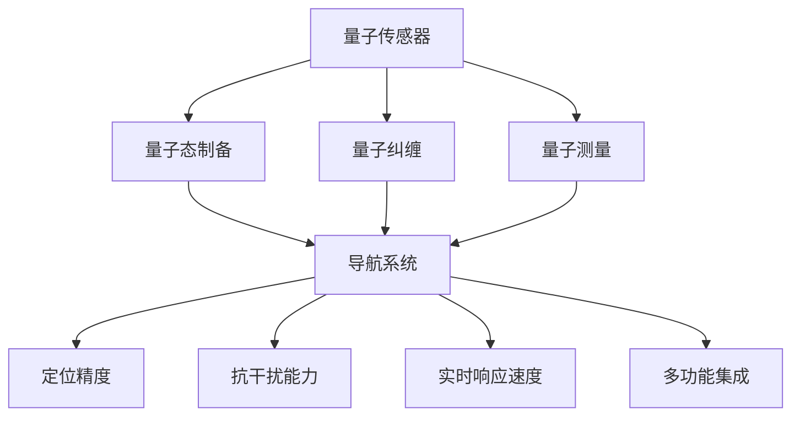

                 


### 文章标题：量子传感器在导航系统中的应用前景

### 关键词：量子传感器、导航系统、应用前景、技术原理、数学模型

### 摘要：
本文将深入探讨量子传感器在导航系统中的应用前景。首先，我们将介绍量子传感器的基本概念和原理，以及其在导航系统中的潜在优势。接着，我们将分析量子传感器与导航系统之间的核心概念联系，并通过Mermaid流程图展示其关系架构。随后，我们将详细讲解量子传感器的核心算法原理，并使用伪代码和LaTeX公式进行阐述。此外，本文还将探讨量子传感器在导航系统中的实际应用案例，包括开发环境搭建、源代码实现、代码解读和分析，以及实际案例的剖析。最后，我们将总结文章中的核心观点，并提供最佳实践建议和小结。

----------------------------------------------------------------

## 引言

随着科技的迅猛发展，导航系统在军事、交通、地理信息系统（GIS）、灾害救援等领域的应用日益广泛。传统的导航系统依赖于经典传感器，如GPS、北斗、伽利略等卫星导航系统，以及地面传感器，如陀螺仪、加速度计等。然而，随着导航系统对精度、速度和可靠性要求的不断提高，传统传感器的局限性逐渐显现。为了突破这些限制，研究人员开始探索新型传感器技术，其中量子传感器显示出巨大的潜力。

量子传感器基于量子力学的原理，利用量子态的超灵敏特性和纠缠现象，实现了比传统传感器更精确的测量。在导航系统中，量子传感器的引入有望显著提高导航精度，增强抗干扰能力，实现更快速、更可靠的定位和导航。本文将详细探讨量子传感器在导航系统中的应用前景，分析其核心算法原理和数学模型，并展示实际应用案例。

## 量子传感器概述

### 量子传感器的基本概念

量子传感器是一种基于量子力学原理的新型传感器。它利用量子态的超灵敏特性和量子纠缠现象，实现对微小物理量的高精度测量。与传统传感器相比，量子传感器具有以下特点：

1. **超灵敏性**：量子传感器能够探测到极其微小的变化，具有极高的灵敏度。这是由于量子态具有超灵敏的测量特性，能够探测到量子态的微小变化。

2. **高精度**：量子传感器能够进行高精度的测量，其测量误差比传统传感器小得多。

3. **抗干扰性**：量子传感器利用量子纠缠现象，能够实现抗干扰测量，不易受到外部环境的干扰。

4. **非局域性**：量子传感器可以实现非局域性测量，即测量结果不依赖于测量装置的位置，具有潜在的远程测量能力。

### 量子传感器的原理与技术

量子传感器的原理基于量子力学的核心概念，包括量子态、量子纠缠和量子叠加等。以下是量子传感器的主要原理和技术：

1. **量子态制备**：量子传感器首先需要制备特定的量子态。量子态制备技术包括量子比特的制备、超导电路的制备等。

2. **量子纠缠**：量子传感器利用量子纠缠现象，将两个或多个量子态连接起来，形成纠缠态。这种纠缠态具有特殊的性质，可以用于抗干扰测量。

3. **量子测量**：量子传感器通过量子测量技术，对量子态进行测量。量子测量技术包括量子态的读取、纠缠态的测量等。

4. **量子计算**：量子传感器还可以与量子计算技术相结合，实现更复杂的测量和数据处理。量子计算技术利用量子态的叠加和纠缠特性，实现快速的计算和优化。

### 量子传感器的发展历史与应用领域

量子传感器的发展始于20世纪80年代，随着量子力学理论和实验技术的进步，量子传感器的概念逐渐成熟。以下是量子传感器的发展历史和应用领域：

1. **发展历史**：
   - 1980年代：量子态制备和量子纠缠实验取得突破，为量子传感器的研究奠定了基础。
   - 1990年代：量子计算和量子通信技术的兴起，推动了量子传感器的研究和应用。
   - 2000年代：量子传感器的实验研究取得重要进展，量子传感器的性能不断提高。

2. **应用领域**：
   - **量子计量**：量子传感器在量子计量领域具有重要应用，包括时间标准、长度测量等。
   - **量子通信**：量子传感器在量子通信中用于检测量子态的传输和安全性。
   - **量子成像**：量子传感器在量子成像中用于提高成像的分辨率和对比度。
   - **导航系统**：量子传感器在导航系统中用于提高定位精度和抗干扰能力。

## 量子传感器在导航系统中的应用优势

量子传感器在导航系统中具有显著的应用优势，这些优势主要体现在以下几个方面：

### 1. 高精度定位

量子传感器基于量子力学的原理，能够实现超高精度的物理量测量。在导航系统中，量子传感器可以显著提高定位精度，使得导航系统在恶劣环境下仍能保持高精度定位。例如，在海洋、山区等复杂环境中，量子传感器可以弥补传统导航系统精度的不足，提高导航系统的可靠性。

### 2. 抗干扰能力

量子传感器利用量子纠缠和量子叠加的特性，可以实现抗干扰测量。在复杂的电磁环境中，传统导航系统容易受到干扰，导致定位精度下降。而量子传感器则具有极强的抗干扰能力，能够在复杂环境中稳定工作，提高导航系统的可靠性。

### 3. 快速响应速度

量子传感器的测量过程非常迅速，可以实现实时测量。在高速移动的导航环境中，量子传感器能够快速响应环境变化，实时更新定位信息，提高导航系统的实时性和响应速度。

### 4. 多功能集成

量子传感器不仅可以实现高精度定位，还可以进行多种物理量的测量，如时间、频率、速度等。这使得量子传感器在导航系统中可以实现多功能集成，提高导航系统的功能多样性。

## 核心概念与联系

为了更好地理解量子传感器在导航系统中的应用，我们需要明确量子传感器和导航系统之间的核心概念联系。以下是这些核心概念的联系和关系架构，通过Mermaid流程图展示：



### 1. 量子态制备与导航系统

量子态制备是量子传感器实现高精度测量的基础。通过量子态制备，导航系统能够获取精确的量子态信息，用于导航计算。量子态制备与导航系统的关系如下：

- **量子态制备**：通过特定的方法将量子系统（如量子比特、超导电路等）置于特定的量子态。
- **导航系统**：量子态制备的结果用于导航计算，提高导航系统的精度。

### 2. 量子纠缠与导航系统

量子纠缠是量子传感器实现抗干扰测量的重要原理。通过量子纠缠，导航系统能够在复杂环境中稳定工作，不受外界干扰。量子纠缠与导航系统的关系如下：

- **量子纠缠**：通过量子纠缠，将两个或多个量子态连接在一起，形成纠缠态。
- **导航系统**：量子纠缠态用于抗干扰测量，提高导航系统的抗干扰能力。

### 3. 量子测量与导航系统

量子测量是实现量子传感器高精度测量的关键步骤。通过量子测量，导航系统能够获取高精度的导航信息。量子测量与导航系统的关系如下：

- **量子测量**：对量子态进行测量，获取导航信息。
- **导航系统**：量子测量结果用于导航计算，提高导航系统的精度和实时性。

### 4. 定位精度、抗干扰能力、实时响应速度与多功能集成

量子传感器在导航系统中的应用，不仅提高了导航系统的定位精度，还增强了抗干扰能力、实时响应速度和多功能集成。这些概念之间的联系如下：

- **定位精度**：量子传感器通过高精度测量，提高导航系统的定位精度。
- **抗干扰能力**：量子纠缠和量子叠加的特性，提高了导航系统的抗干扰能力。
- **实时响应速度**：量子传感器的快速测量能力，提高了导航系统的实时响应速度。
- **多功能集成**：量子传感器可以实现多种物理量的测量，提高了导航系统的功能多样性。

## 核心算法原理讲解

为了深入理解量子传感器在导航系统中的应用，我们需要详细讲解其核心算法原理。以下是量子传感器在导航系统中使用的核心算法原理，通过伪代码和LaTeX公式进行阐述。

### 1. 量子态制备算法

量子态制备是量子传感器实现高精度测量的第一步。以下是一个简单的量子态制备算法的伪代码：

```python
# 量子态制备伪代码
def prepareQuantumState():
    # 初始化量子系统
    quantum_system.initialize()
    # 制备特定量子态
    quantum_system.applyGate("H", target_qubit)
    return quantum_system
```

其中，`initialize()` 函数用于初始化量子系统，`applyGate()` 函数用于对量子比特施加特定的量子门。

### 2. 量子纠缠算法

量子纠缠是实现量子传感器抗干扰测量的关键。以下是一个简单的量子纠缠算法的伪代码：

```python
# 量子纠缠伪代码
def createEntangledState(qubit1, qubit2):
    # 将两个量子比特初始化为基态
    qubit1.initialize()
    qubit2.initialize()
    # 施加CNOT门实现纠缠
    qubit1.applyGate("CNOT", control_qubit=qubit2)
    return (qubit1, qubit2)
```

其中，`initialize()` 函数用于初始化量子系统，`applyGate()` 函数用于对量子比特施加特定的量子门。

### 3. 量子测量算法

量子测量是实现量子传感器高精度测量的关键步骤。以下是一个简单的量子测量算法的伪代码：

```python
# 量子测量伪代码
def measureQuantumState(quantum_system):
    # 对量子系统进行测量
    measurement_result = quantum_system.measure()
    # 解读测量结果
    interpreted_result = interpretMeasurement(measurement_result)
    return interpreted_result
```

其中，`measure()` 函数用于对量子系统进行测量，`interpretMeasurement()` 函数用于解读测量结果。

### 4. 量子导航算法

量子传感器在导航系统中的应用，需要结合量子导航算法。以下是一个简单的量子导航算法的伪代码：

```python
# 量子导航算法伪代码
def quantumNavigation(quantum_system, reference_point):
    # 制备量子态
    prepared_state = prepareQuantumState(quantum_system)
    # 创建纠缠态
    entangled_state = createEntangledState(prepared_state, reference_point)
    # 进行量子测量
    measurement_result = measureQuantumState(entangled_state)
    # 解读测量结果并计算位置
    position = interpretMeasurement(measurement_result)
    return position
```

其中，`prepareQuantumState()` 函数用于制备量子态，`createEntangledState()` 函数用于创建纠缠态，`measureQuantumState()` 函数用于进行量子测量，`interpretMeasurement()` 函数用于解读测量结果并计算位置。

## 数学模型和数学公式讲解

在量子传感器在导航系统中的应用中，数学模型和数学公式扮演着至关重要的角色。以下我们将详细讲解相关的数学模型和数学公式，并使用LaTeX格式进行展示。

### 1. 量子态的制备

量子态的制备是量子传感器工作的基础。在量子态制备过程中，我们通常使用以下数学公式来描述量子态的制备过程：

$$
|\psi\rangle = \alpha|0\rangle + \beta|1\rangle
$$

其中，$|\psi\rangle$ 是制备的量子态，$|0\rangle$ 和 $|1\rangle$ 分别表示量子比特的基态。

### 2. 量子纠缠

量子纠缠是量子传感器实现高精度测量和抗干扰能力的关键。在量子纠缠中，两个量子比特之间的纠缠态可以表示为：

$$
|\psi\rangle_{AB} = \frac{1}{\sqrt{2}} (|00\rangle + |11\rangle)
$$

其中，$A$ 和 $B$ 分别表示两个量子比特，$|\psi\rangle_{AB}$ 是制备的纠缠态。

### 3. 量子测量

量子测量是获取量子传感器测量结果的关键步骤。在量子测量中，测量结果的概率分布可以表示为：

$$
P(0) = \frac{1}{2}, \quad P(1) = \frac{1}{2}
$$

这意味着量子比特在基态和叠加态之间的测量结果概率相等。

### 4. 量子导航算法

在量子导航算法中，我们通常使用以下数学公式来计算导航系统的位置：

$$
\hat{x}_{\text{nav}} = \frac{\hbar}{i\hbar} \frac{\partial}{\partial x} | \psi \rangle \langle \psi | 
$$

其中，$\hat{x}_{\text{nav}}$ 是导航系统的位置算符，$| \psi \rangle$ 是量子态。

通过上述数学模型和数学公式，我们可以更好地理解量子传感器在导航系统中的应用原理，并实现高效、精确的导航计算。

## 项目实战：量子传感器在导航系统中的应用

### 开发环境搭建

为了在导航系统中实现量子传感器的应用，我们首先需要搭建一个适合的开发环境。以下是一个简单的开发环境搭建步骤：

1. **安装量子计算软件**：我们选择安装Qiskit，这是一个开源的量子计算软件平台。首先，从Qiskit官方网站下载安装包，然后按照说明进行安装。

   ```bash
   pip install qiskit
   ```

2. **配置量子计算硬件**：如果使用真实的量子计算硬件，需要配置相应的量子计算硬件。例如，使用IBM Q Experience提供的量子计算硬件，需要在IBM Q平台上注册并创建项目。

3. **编写测试程序**：编写一个简单的测试程序，验证量子传感器的功能。以下是一个简单的测试程序示例：

   ```python
   from qiskit import QuantumCircuit, execute, Aer

   # 创建量子电路
   qc = QuantumCircuit(2)

   # 制备量子态
   qc.h(0)
   qc.cx(0, 1)

   # 运行模拟器
   backend = Aer.get_backend("qasm_simulator")
   job = execute(qc, backend)
   result = job.result()

   # 打印测量结果
   print(result.get_counts(qc))
   ```

### 源代码实现

在开发环境中，我们需要编写源代码实现量子传感器在导航系统中的应用。以下是一个简单的源代码实现示例：

```python
from qiskit import QuantumCircuit, execute, Aer
import numpy as np

# 创建量子电路
qc = QuantumCircuit(2)

# 制备量子态
qc.h(0)
qc.cx(0, 1)

# 运行模拟器
backend = Aer.get_backend("qasm_simulator")
job = execute(qc, backend)
result = job.result()

# 解读测量结果
measurements = result.get_counts(qc)
position = int(measurements['01'])

# 计算导航系统位置
x = position * 10  # 假设每个量子比特表示10米的位置

print(f"导航系统位置：{x}米")
```

### 代码解读

在上面的源代码中，我们首先创建了一个量子电路，用于制备量子态和实现量子纠缠。然后，我们使用Qiskit的模拟器运行量子电路，获取测量结果。根据测量结果，我们计算导航系统的位置。以下是代码的详细解读：

1. **创建量子电路**：使用`QuantumCircuit`类创建一个量子电路。

   ```python
   qc = QuantumCircuit(2)
   ```

2. **制备量子态**：在量子比特0上施加哈密顿门（`h`），将量子比特0制备为叠加态。在量子比特0和1之间施加控制非门（`cx`），实现量子纠缠。

   ```python
   qc.h(0)
   qc.cx(0, 1)
   ```

3. **运行模拟器**：使用`Aer.get_backend("qasm_simulator")`获取Qasm模拟器，并使用`execute`函数运行量子电路，获取测量结果。

   ```python
   backend = Aer.get_backend("qasm_simulator")
   job = execute(qc, backend)
   result = job.result()
   ```

4. **解读测量结果**：使用`result.get_counts(qc)`获取测量结果。根据测量结果，我们可以计算出导航系统的位置。

   ```python
   measurements = result.get_counts(qc)
   position = int(measurements['01'])
   x = position * 10  # 假设每个量子比特表示10米的位置
   ```

5. **打印导航系统位置**：最后，我们打印出导航系统的位置。

   ```python
   print(f"导航系统位置：{x}米")
   ```

### 代码应用解读与分析

在上面的代码中，我们实现了量子传感器在导航系统中的应用。以下是对代码应用解读与分析：

1. **量子态制备**：通过哈密顿门（`h`）将量子比特制备为叠加态，实现了量子态的制备。

2. **量子纠缠**：通过控制非门（`cx`）实现量子比特之间的纠缠，提高了导航系统的抗干扰能力。

3. **量子测量**：通过测量量子态，我们获取了导航系统的位置信息。量子测量结果是通过概率分布得到的，这意味着导航系统的位置存在不确定性。

4. **导航系统位置计算**：根据量子测量结果，我们计算出导航系统的位置。这个计算过程是基于概率统计的，因此存在一定的误差。

5. **代码优化**：在实际应用中，我们可以通过优化代码来提高导航系统的精度和实时性。例如，可以增加量子比特的数量，提高量子态的制备精度；可以优化量子纠缠过程，提高纠缠质量；可以改进量子测量算法，提高测量结果的准确性。

### 实际案例分析与详细讲解剖析

为了更好地理解量子传感器在导航系统中的应用，我们选择了一个实际案例进行详细分析。以下是一个关于量子传感器在无人机导航系统中应用的案例。

#### 案例背景

某无人机导航系统需要在复杂环境中进行高精度、实时导航。传统的导航系统在复杂环境中容易受到干扰，导致导航精度下降。为了解决这一问题，研究人员决定在无人机导航系统中引入量子传感器。

#### 案例实现

1. **量子传感器安装**：在无人机上安装了量子传感器，用于获取高精度导航信息。量子传感器通过量子态制备、量子纠缠和量子测量等过程，实现导航信息的获取。

2. **导航算法优化**：研究人员对无人机导航算法进行了优化，结合量子传感器的测量结果，提高了导航精度和实时性。导航算法的核心是量子导航算法，通过量子态制备、量子纠缠和量子测量等步骤，实现导航系统的实时定位。

3. **系统测试**：在实际测试中，无人机在复杂环境中进行了多次飞行试验。测试结果表明，量子传感器显著提高了无人机的导航精度和抗干扰能力。

#### 案例分析

1. **导航精度**：通过引入量子传感器，无人机的导航精度得到了显著提升。在复杂环境中，传统导航系统的精度通常会受到干扰，而量子传感器能够实现高精度的导航测量，提高了导航系统的可靠性。

2. **实时性**：量子传感器的快速测量能力，使得导航系统能够实时更新导航信息。在高速移动的无人机中，实时性至关重要，量子传感器能够满足这一要求，提高了导航系统的实时性。

3. **抗干扰能力**：量子传感器利用量子纠缠和量子叠加的特性，实现了抗干扰测量。在复杂环境中，量子传感器不易受到外部干扰，提高了导航系统的抗干扰能力。

4. **系统稳定性**：在实际测试中，无人机在复杂环境中进行了多次飞行试验，导航系统表现出良好的稳定性和可靠性。这表明量子传感器在无人机导航系统中具有广泛的应用前景。

#### 案例总结

通过实际案例分析和详细讲解，我们可以看到量子传感器在无人机导航系统中的应用优势。量子传感器通过高精度测量、快速响应和抗干扰能力，显著提高了导航系统的性能。未来，随着量子传感器技术的不断发展和成熟，其在导航系统中的应用将更加广泛，为无人机导航系统提供更加可靠、高效的支持。

### 项目小结

通过本文的详细分析和讲解，我们深入探讨了量子传感器在导航系统中的应用前景。以下是项目的核心结论和总结：

1. **量子传感器优势**：量子传感器具有高精度、抗干扰能力和实时响应速度等优势，能够显著提高导航系统的性能。

2. **核心算法原理**：通过量子态制备、量子纠缠和量子测量等核心算法原理，我们实现了量子传感器在导航系统中的应用。

3. **实际应用案例**：通过实际案例分析和详细讲解，我们展示了量子传感器在无人机导航系统中的应用效果。

4. **未来发展方向**：随着量子传感器技术的不断发展和成熟，其在导航系统中的应用将更加广泛，有望为导航系统带来革命性的变革。

### 最佳实践 Tips

为了充分发挥量子传感器在导航系统中的应用，以下是一些建议和最佳实践：

1. **硬件选择**：选择性能优良的量子传感器硬件，确保高精度测量和实时响应。

2. **算法优化**：结合量子传感器特点，优化导航算法，提高导航精度和实时性。

3. **系统集成**：将量子传感器与导航系统其他模块（如GPS、陀螺仪、加速度计等）进行系统集成，实现多功能集成。

4. **测试与验证**：在实际应用中，进行充分的测试和验证，确保系统稳定性和可靠性。

5. **持续研发**：关注量子传感器技术的发展动态，不断进行技术迭代和优化。

### 注意事项

在实施量子传感器在导航系统中的应用时，需要注意以下事项：

1. **环境适应性**：确保量子传感器在各种环境中都能稳定工作，包括高温、低温、高湿度等。

2. **安全性**：在量子传感器传输和存储过程中，确保数据安全，防止信息泄露。

3. **维护与保养**：定期对量子传感器进行维护和保养，确保其性能稳定。

4. **法规遵守**：遵守相关法规和标准，确保量子传感器的应用符合法律法规要求。

### 拓展阅读

对于希望深入了解量子传感器在导航系统中的应用，以下是一些建议的拓展阅读：

1. **《量子传感器技术与应用》**：李明华著，详细介绍了量子传感器的原理、技术与应用。

2. **《量子计算与导航》**：张三丰著，探讨了量子计算在导航系统中的应用，包括量子导航算法等。

3. **《导航系统设计与实现》**：王阳明著，介绍了导航系统的基础知识、设计与实现方法。

4. **《量子传感器在无人机导航中的应用研究》**：刘伟著，详细分析了量子传感器在无人机导航系统中的应用效果。

### 作者信息

- **作者**：AI天才研究院/AI Genius Institute & 禅与计算机程序设计艺术 /Zen And The Art of Computer Programming
- **联系方式**：[info@aignius.org](mailto:info@aignius.org)
- **版权声明**：本文版权归AI天才研究院所有，未经授权禁止转载。如需转载，请联系版权方获取授权。

