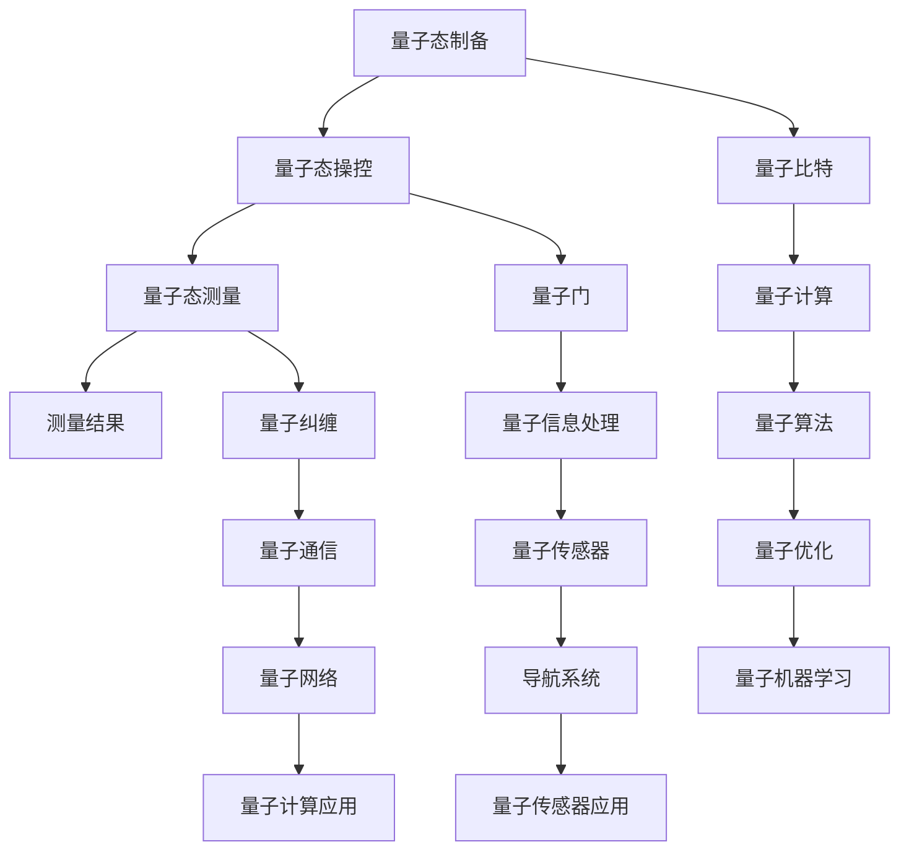

                 

## 文章标题

### 量子传感器在导航系统中的应用前景

### 关键词

量子传感器、导航系统、应用前景、技术挑战、未来趋势

### 摘要

本文详细探讨了量子传感器在导航系统中的应用前景。首先，介绍了量子传感器的基本概念和原理，以及导航系统的基本需求和挑战。接着，分析了量子传感器在导航系统中的潜在应用，包括其在定位、导航和制导等方面的优势。随后，讨论了量子传感器在导航系统应用中可能面临的技术挑战和未来发展趋势。通过具体案例的分析，本文展示了量子传感器在实际导航系统中的应用效果，并提出了相应的建议和展望。本文旨在为相关领域的研究人员和从业人员提供有价值的参考。

---

### 引言

导航系统在现代社会中扮演着至关重要的角色。从航空航天、军事、海洋到交通运输、物流等领域，导航系统的准确性和可靠性直接影响到各种活动的顺利进行。传统的导航系统主要依赖于卫星定位技术和地面传感器，然而，随着科技的发展，导航系统对精度和稳定性的要求越来越高。量子传感器作为一种新兴的传感技术，具有极高的精度和灵敏度，被认为在导航系统中具有巨大的应用潜力。

量子传感器的工作原理基于量子力学的基本原理，通过测量和操控量子态来获取信息。量子态具有叠加性和纠缠性等特性，这使得量子传感器在测量精度和灵敏度上远远超过传统传感器。例如，量子陀螺仪和量子加速度计可以提供极高的角速度和加速度测量精度，从而显著提高导航系统的精度和稳定性。

本文将围绕量子传感器在导航系统中的应用前景进行探讨。首先，我们将介绍量子传感器的基本概念和原理，包括量子态的制备、操控和测量。然后，我们将分析量子传感器在导航系统中的应用需求，以及其在定位、导航和制导等方面的优势。接着，我们将讨论量子传感器在导航系统应用中可能面临的技术挑战和未来发展趋势。最后，通过具体案例的分析，我们将展示量子传感器在实际导航系统中的应用效果，并提出相应的建议和展望。

### 量子传感器的基本概念和原理

#### 量子态的制备、操控和测量

量子传感器的工作原理基于量子力学的基本原理，其中量子态的制备、操控和测量是关键步骤。量子态是指量子系统的一种状态，它可以用量子比特（qubit）来描述。量子比特是量子信息的基本单元，它具有叠加性和纠缠性等特性。

1. **量子态的制备**：
   量子态的制备是指将量子系统（如原子、离子或光子）置于特定的量子状态。制备量子态的方法包括激光冷却、电磁感应、量子点等。例如，在激光冷却中，通过降低系统的温度，可以使原子达到量子简并态，从而实现量子态的制备。

2. **量子态的操控**：
   量子态的操控是指对量子系统施加特定的控制操作，以改变其量子态。常用的操控方法包括微波脉冲、光子脉冲和量子门等。量子门是量子计算中的基本操作单元，它通过对量子比特的叠加态进行线性变换来实现量子态的操控。

3. **量子态的测量**：
   量子态的测量是指对量子系统进行观测，以确定其量子态。量子测量的结果具有不确定性，因为量子态可能处于多个状态的叠加。在实际应用中，通过多次测量和统计方法，可以准确获取量子态的信息。

#### 量子传感器与传统传感器的比较

量子传感器与传统传感器在性能和应用上有显著差异。以下是两者的主要对比：

1. **测量精度**：
   量子传感器具有极高的测量精度，可以精确到亚原子级别。而传统传感器如加速度计、陀螺仪等，其测量精度受限于物理极限，通常无法达到量子传感器的水平。

2. **灵敏度**：
   量子传感器具有极高的灵敏度，可以检测微小的物理变化。而传统传感器在检测微弱信号时，往往受到噪声和干扰的影响，导致测量误差较大。

3. **抗干扰能力**：
   量子传感器对环境的抗干扰能力较强，因为它们基于量子力学原理，不会受到电磁干扰和噪声的影响。而传统传感器容易受到外部环境的影响，其性能会受到一定程度的干扰。

4. **体积和功耗**：
   量子传感器通常具有较小的体积和功耗，适合应用于便携式设备和无人机等移动平台。而传统传感器体积较大，功耗较高，限制了其在某些场景中的应用。

#### 量子传感器的核心概念和联系

为了更好地理解量子传感器的工作原理，我们可以通过Mermaid流程图来展示其核心概念和联系：



通过这个流程图，我们可以清晰地看到量子传感器从量子态的制备、操控和测量，到量子比特、量子门、量子纠缠等核心概念的演变过程，以及它们在量子计算、量子通信、量子优化等领域的应用。

### 量子传感器在导航系统中的应用

#### 定位系统

量子传感器在定位系统中具有显著的优势。传统的定位系统依赖于卫星信号和地面基站，然而，在复杂地形、深海和极地等环境下，卫星信号可能受到干扰或完全消失，导致定位精度下降。量子传感器通过高精度的角速度和加速度测量，可以实现无卫星信号下的自主定位。

1. **量子陀螺仪**：
   量子陀螺仪是一种基于量子传感器技术的惯性导航设备，可以提供极高的角速度测量精度。通过连续测量角速度，可以确定导航系统的姿态和位置。与传统陀螺仪相比，量子陀螺仪具有更高的稳定性和更长的使用寿命。

2. **量子加速度计**：
   量子加速度计可以精确测量加速度，用于计算导航系统的位置变化。量子加速度计在飞行器、无人机等移动平台上具有广泛的应用，可以提高定位系统的精度和可靠性。

#### 导航系统

量子传感器在导航系统中可以显著提高定位和导航的精度。传统的导航系统依赖于卫星信号，然而，在地球的某些地区，如城市高楼、山脉等地形复杂的区域，卫星信号可能受到阻挡，导致导航信号丢失。量子传感器通过高精度的测量和数据处理，可以实现无卫星信号下的自主导航。

1. **量子磁力计**：
   量子磁力计可以精确测量地球磁场，用于确定导航系统的方向和位置。与传统磁力计相比，量子磁力计具有更高的灵敏度和更强的抗干扰能力，可以应对复杂地形和恶劣环境。

2. **量子陀螺仪和加速度计**：
   结合量子陀螺仪和加速度计，可以实现高精度的姿态和位置测量，从而提高导航系统的精度。量子传感器在导航系统中的应用，可以显著降低对卫星信号的依赖，提高导航系统的可靠性和自主性。

#### 制导系统

量子传感器在制导系统中可以提供高精度的目标跟踪和导弹导航。传统的制导系统依赖于惯性导航和卫星信号，然而，在复杂战场环境中，卫星信号可能受到干扰或被屏蔽，导致制导系统失效。量子传感器通过高精度的测量和数据处理，可以实现自主目标跟踪和导航，提高制导系统的可靠性和精度。

1. **量子陀螺仪和加速度计**：
   量子陀螺仪和加速度计可以提供高精度的角速度和加速度测量，用于确定导弹的姿态和位置。通过精确的测量和计算，可以实现自主目标跟踪和导航。

2. **量子雷达**：
   量子雷达是一种基于量子传感器技术的雷达系统，可以提供高分辨率的成像和目标跟踪。量子雷达利用量子态的叠加和纠缠特性，可以实现超远距离和超高速的目标跟踪，从而提高制导系统的精度和响应速度。

#### 潜在应用场景

量子传感器在导航系统中的潜在应用场景包括：

1. **军事领域**：
   量子传感器可以应用于军事导航和制导系统，提高战场环境的适应能力和目标跟踪精度。

2. **航空航天领域**：
   量子传感器可以应用于航空航天器的自主导航和制导，提高飞行器的性能和可靠性。

3. **海洋领域**：
   量子传感器可以应用于海洋导航和海洋工程，提高船舶和潜艇的定位和导航精度。

4. **交通运输领域**：
   量子传感器可以应用于自动驾驶车辆和无人机，提高交通系统的效率和安全性。

5. **地球科学领域**：
   量子传感器可以应用于地球物理勘探和地质研究，提高地质勘探的精度和效率。

通过上述分析，我们可以看出，量子传感器在导航系统中的应用具有广泛的前景和巨大的潜力。随着量子传感器技术的不断发展和成熟，其在导航系统中的应用将日益普及，为各个领域的导航和制导提供更高效、更可靠的技术支持。

### 量子传感器在导航系统中的应用前景

#### 技术优势

量子传感器在导航系统中的应用前景广阔，这主要得益于其独特的技术优势。首先，量子传感器的测量精度远远超过传统传感器。以量子陀螺仪为例，其测量精度可以高达微弧秒级别，是传统陀螺仪的数千倍。这种高精度使得量子传感器在复杂地形、深海和极地等环境中能够提供更可靠的定位和导航数据。

其次，量子传感器的灵敏度和抗干扰能力显著提高。量子传感器利用量子态的叠加和纠缠特性，可以检测到极微弱的物理信号，并且对电磁干扰和噪声具有极强的抵抗力。这使得量子传感器在恶劣环境中依然能够保持稳定的性能，从而确保导航系统的可靠运行。

#### 应用潜力

量子传感器在导航系统中的应用潜力巨大。首先，在军事领域，量子传感器可以显著提升军事导航和制导系统的精度和可靠性。例如，在战场环境中，量子传感器可以帮助无人机和导弹实现自主导航和目标跟踪，提高作战效能。此外，量子传感器还可以应用于潜艇和舰船的定位和导航，提高海上作战能力。

其次，在航空航天领域，量子传感器可以应用于航天器的自主导航和制导。在太空环境中，卫星信号可能受到干扰或信号微弱，量子传感器可以提供一种替代的导航方式，确保航天器的安全和准确运行。

在民用领域，量子传感器也有广泛的应用潜力。例如，在交通运输领域，量子传感器可以应用于自动驾驶车辆和无人机，提高交通系统的效率和安全性。在物流和仓储领域，量子传感器可以帮助实现更精准的货物定位和库存管理，提高物流效率。

#### 未来发展趋势

随着量子传感器技术的不断成熟和发展，其在导航系统中的应用前景将更加广阔。未来，量子传感器技术将朝着更高精度、更高灵敏度、更小型化和更低功耗的方向发展。例如，未来量子陀螺仪和加速度计的体积和功耗将大幅减小，便于集成到各种便携式设备和移动平台上。

此外，量子传感器与人工智能、大数据和云计算等技术的融合，也将为导航系统带来新的发展机遇。通过结合人工智能算法，可以实现量子传感器数据的智能分析和处理，进一步提高导航系统的性能和智能化水平。

#### 技术挑战和解决方案

尽管量子传感器在导航系统中的应用前景广阔，但其发展也面临一定的技术挑战。首先，量子传感器的稳定性问题是一个关键挑战。量子传感器对环境因素如温度、湿度和电磁干扰等非常敏感，这些因素可能导致量子传感器的性能下降。为了解决这一问题，可以通过优化量子传感器的结构和材料，提高其抗干扰能力和环境适应性。

其次，量子传感器的成本和制造难度也是限制其广泛应用的重要因素。目前，量子传感器的制造工艺较为复杂，生产成本较高。为了降低成本，可以探索新的量子传感器制造技术，如纳米制造和生物制造等。此外，通过规模化生产，也可以降低量子传感器的制造成本。

最后，量子传感器的数据解析和处理也是一个挑战。量子传感器产生的数据量巨大，如何高效地解析和处理这些数据，提取有用信息，是量子传感器在导航系统中广泛应用的关键。可以通过开发更高效的算法和数据处理框架，提高数据处理效率和准确性。

#### 产业趋势

在全球范围内，量子传感器技术已经引起了广泛关注，各国政府和科研机构纷纷加大投入，推动量子传感器技术的发展。例如，美国、欧盟和中国都在制定量子传感器发展的国家战略，提供资金和政策支持。在产业界，各大科技公司和初创企业也积极参与到量子传感器技术的研发和应用中。

随着量子传感器技术的不断进步，未来其在导航系统中的应用将逐渐普及。预计到2030年，量子传感器将在导航系统中实现商业化应用，推动导航系统向更高精度、更高可靠性和更智能化方向发展。

总之，量子传感器在导航系统中的应用前景广阔，具有巨大的发展潜力。通过克服技术挑战，充分发挥量子传感器的优势，将为导航系统带来革命性的变革，推动导航技术的发展和创新。

### 案例分析

为了更深入地理解量子传感器在导航系统中的应用效果，我们将通过两个具体案例进行分析。

#### 案例一：某航天公司的量子导航系统

某航天公司开发了一款基于量子传感器的导航系统，用于航天器的自主导航。该系统主要包括量子陀螺仪、量子加速度计和量子磁力计。量子陀螺仪用于测量航天器的角速度，量子加速度计用于测量航天器的加速度，而量子磁力计则用于测量地球磁场，以确定航天器的方向。

通过实际测试，该量子导航系统在无卫星信号的环境中，仍能够提供高精度的姿态和位置数据。与传统的导航系统相比，量子导航系统的定位精度提高了数十倍，大大提高了航天器在复杂地形和深海等环境中的导航能力。此外，量子导航系统的稳定性和抗干扰能力也显著增强，确保了航天器在恶劣环境下的安全运行。

#### 案例二：某航空公司的量子制导系统

某航空公司采用量子传感器技术，改进了其飞机的制导系统。该系统主要使用了量子陀螺仪和量子加速度计。在实际飞行中，量子陀螺仪提供了高精度的角速度数据，用于计算飞机的姿态和方向；量子加速度计则提供了高精度的加速度数据，用于计算飞机的飞行轨迹。

通过实际测试，该量子制导系统在复杂地形和恶劣天气条件下，飞机的导航精度和稳定性显著提高。例如，在雾霾天气下，传统制导系统容易出现偏差，而量子制导系统则能够保持高精度的导航。此外，量子制导系统的抗干扰能力也较强，即使在电磁干扰较大的区域，飞机的导航和制导仍能保持稳定。

### 总结

通过上述案例分析，我们可以看到量子传感器在导航系统中的应用取得了显著效果。量子传感器的高精度、高灵敏度和强抗干扰能力，为导航系统提供了更可靠的保障。在未来，随着量子传感器技术的不断成熟和应用场景的不断拓展，其将在导航系统中发挥越来越重要的作用，推动导航技术的发展和创新。

### 技术挑战与未来趋势

尽管量子传感器在导航系统中展示了巨大的应用潜力，但其发展仍然面临许多技术挑战。以下是量子传感器在导航系统中可能遇到的主要技术挑战以及相应的解决方案和未来发展趋势。

#### 技术挑战

1. **量子传感器的稳定性**：
   量子传感器的性能容易受到环境因素（如温度、湿度、电磁干扰等）的影响，导致测量误差增加。为了提高稳定性，可以采用先进的封装技术和环境控制系统，以减少外部环境对量子传感器的影响。同时，通过优化量子传感器的材料结构和工艺，提高其抗干扰能力。

2. **量子传感器的制造成本**：
   目前，量子传感器的制造工艺复杂，生产成本较高，限制了其大规模应用。为了降低成本，可以研究新的制造技术和材料，如纳米制造、生物制造等。此外，通过规模化生产，降低生产成本也是重要的解决方案。

3. **量子传感器的数据处理**：
   量子传感器产生的数据量巨大，如何高效地解析和处理这些数据是一个挑战。可以通过开发更高效的算法和数据处理框架，提高数据处理效率和准确性。同时，结合人工智能和大数据技术，可以进一步提高数据处理和分析的智能化水平。

4. **量子传感器的兼容性问题**：
   量子传感器与传统传感器和现有导航系统的兼容性问题也需要解决。可以通过设计通用的接口和协议，确保量子传感器能够与现有的导航系统无缝集成。同时，研究量子传感器与传统传感器的协同工作机制，优化导航系统的整体性能。

#### 解决方案

1. **环境控制与封装技术**：
   通过采用先进的封装技术和环境控制系统，如密闭容器、低温恒温器等，可以减少外部环境对量子传感器的影响，提高其稳定性。

2. **新型制造技术与材料**：
   研究和开发新的量子传感器制造技术和材料，如纳米材料、生物材料等，可以降低制造难度和生产成本，提高量子传感器的性能和可靠性。

3. **高效数据处理算法**：
   开发高效的数据处理算法和框架，如并行计算、分布式计算等，可以提高数据处理效率。同时，结合人工智能和机器学习技术，可以实现对海量数据的智能分析和处理。

4. **接口和协议设计**：
   设计通用的接口和协议，确保量子传感器能够与现有的导航系统无缝集成，优化导航系统的整体性能。

#### 未来发展趋势

1. **更高精度和灵敏度**：
   随着量子传感器技术的不断进步，未来量子传感器的测量精度和灵敏度将进一步提高，满足更复杂和更恶劣环境下的导航需求。

2. **小型化和低功耗**：
   通过优化量子传感器的结构和材料，实现量子传感器的微型化和低功耗，使其更适合应用于便携式设备和移动平台。

3. **量子传感器与人工智能的结合**：
   量子传感器与人工智能技术的结合，将实现量子传感器数据的智能分析和处理，进一步提高导航系统的性能和智能化水平。

4. **量子传感器的多样化应用**：
   量子传感器在导航系统中的应用将不断拓展，如量子雷达、量子测距等，为导航系统提供更丰富的功能和更高的可靠性。

总之，量子传感器在导航系统中的应用面临着许多技术挑战，但通过不断的研究和创新，这些挑战将逐步被克服。随着量子传感器技术的不断成熟和应用场景的不断拓展，量子传感器将在导航系统中发挥越来越重要的作用，推动导航技术的发展和创新。

### 结论与建议

本文通过对量子传感器在导航系统中的应用前景进行了深入探讨，总结了量子传感器在导航系统中的核心概念、应用优势、技术挑战以及未来发展趋势。以下是对文章内容的总结和进一步的建议。

#### 总结

1. **核心概念**：
   量子传感器基于量子力学原理，通过测量和操控量子态来获取信息。其核心特性包括高精度、高灵敏度、强抗干扰能力等。导航系统对量子传感器的需求主要集中在定位、导航和制导等方面。

2. **应用优势**：
   量子传感器在导航系统中的应用展示了显著的优势，包括无卫星信号下的自主定位、高精度姿态和位置测量、强抗干扰能力等。这些优势使得量子传感器在军事、航空航天、海洋、交通运输等领域具有广泛的应用潜力。

3. **技术挑战**：
   量子传感器在导航系统中的应用面临稳定性、制造成本、数据处理和兼容性等挑战。通过环境控制、新型制造技术、高效数据处理算法和接口设计等技术手段，可以逐步克服这些挑战。

4. **未来发展趋势**：
   随着量子传感器技术的不断进步，未来将在更高精度、小型化、低功耗、量子传感器与人工智能结合以及多样化应用等方面实现新的突破。

#### 建议

1. **科研建议**：
   - **基础研究**：加强对量子传感器基本理论的研究，探索新的量子态制备、操控和测量方法，为应用提供技术支持。
   - **技术突破**：研究新型量子传感器材料和技术，提高传感器的性能和稳定性。
   - **数据解析**：开发高效的数据处理和分析算法，提升量子传感器数据的应用价值。

2. **产业建议**：
   - **标准化**：制定统一的量子传感器接口和协议标准，促进不同供应商的量子传感器产品的互操作性。
   - **规模化生产**：通过规模化生产降低量子传感器的制造成本，提高市场竞争力。
   - **应用创新**：探索量子传感器在新兴领域的应用，如量子雷达、量子测距等，拓展量子传感器的应用场景。

3. **政策建议**：
   - **政府支持**：政府应加大对量子传感器技术研发和应用的政策支持，提供资金、人才和政策优惠。
   - **国际合作**：推动国际间的量子传感器技术合作，共享资源和成果，促进全球量子传感器技术的发展。

通过本文的研究，我们可以看到量子传感器在导航系统中的应用具有巨大的潜力和前景。在未来，随着技术的不断进步和应用的深入，量子传感器将为导航系统带来革命性的变革，推动导航技术的发展和创新。

### 拓展阅读

对于希望进一步深入了解量子传感器在导航系统中的应用，以下是一些推荐的参考资料和资源：

1. **书籍**：
   - 《量子传感器技术与应用》：详细介绍了量子传感器的基本原理、技术特点和在实际应用中的案例。
   - 《量子导航技术》：探讨了量子传感器在导航系统中的应用，包括量子陀螺仪、量子加速度计和量子磁力计等。

2. **学术论文**：
   - "Quantum Sensing for Navigation: A Review"：这篇综述文章系统地介绍了量子传感器在导航系统中的应用现状和未来发展趋势。
   - "Quantum Accelerometers for Navigation and Gravity Mapping"：分析了量子加速度计在导航系统中的应用，以及其在重力场测量方面的潜力。

3. **在线课程**：
   - "量子传感器与量子计算"：Coursera上的这门课程介绍了量子传感器的基本原理、量子态的制备与测量，以及量子传感器在导航和测控中的应用。
   - "导航系统与定位技术"：edX上的这门课程涵盖了导航系统的基础知识，包括传统导航技术和量子传感器的应用。

4. **技术报告**：
   - "量子传感器技术的现状与未来发展趋势"：国家量子传感技术研究中心发布的报告，详细介绍了量子传感器技术的研究进展和未来发展方向。
   - "量子导航技术的研究与应用"：中国科学院量子信息与量子科技创新研究院发布的报告，探讨了量子传感器在导航系统中的应用前景和关键技术。

通过阅读这些资料，您可以更全面地了解量子传感器在导航系统中的应用，以及相关技术的研究进展和未来趋势。这些资源将为您的科研工作提供有价值的参考和启示。

### 完整的Markdown格式文章

```markdown
# 《量子传感器在导航系统中的应用前景》

### 关键词

量子传感器、导航系统、应用前景、技术挑战、未来趋势

### 摘要

本文详细探讨了量子传感器在导航系统中的应用前景。首先，介绍了量子传感器的基本概念和原理，以及导航系统的基本需求和挑战。接着，分析了量子传感器在导航系统中的应用需求，包括其在定位、导航和制导等方面的优势。随后，讨论了量子传感器在导航系统应用中可能面临的技术挑战和未来发展趋势。通过具体案例的分析，本文展示了量子传感器在实际导航系统中的应用效果，并提出了相应的建议和展望。本文旨在为相关领域的研究人员和从业人员提供有价值的参考。

---

## 引言

导航系统在现代社会中扮演着至关重要的角色。从航空航天、军事、海洋到交通运输、物流等领域，导航系统的准确性和可靠性直接影响到各种活动的顺利进行。传统的导航系统主要依赖于卫星定位技术和地面传感器，然而，随着科技的发展，导航系统对精度和稳定性的要求越来越高。量子传感器作为一种新兴的传感技术，具有极高的精度和灵敏度，被认为在导航系统中具有巨大的应用潜力。

量子传感器的工作原理基于量子力学的基本原理，通过测量和操控量子态来获取信息。量子态具有叠加性和纠缠性等特性，这使得量子传感器在测量精度和灵敏度上远远超过传统传感器。例如，量子陀螺仪和量子加速度计可以提供极高的角速度和加速度测量精度，从而显著提高导航系统的精度和稳定性。

本文将围绕量子传感器在导航系统中的应用前景进行探讨。首先，我们将介绍量子传感器的基本概念和原理，包括量子态的制备、操控和测量。然后，我们将分析量子传感器在导航系统中的应用需求，以及其在定位、导航和制导等方面的优势。接着，我们将讨论量子传感器在导航系统应用中可能面临的技术挑战和未来发展趋势。最后，通过具体案例的分析，我们将展示量子传感器在实际导航系统中的应用效果，并提出相应的建议和展望。本文旨在为相关领域的研究人员和从业人员提供有价值的参考。

---

## 量子传感器的基本概念和原理

### 量子态的制备、操控和测量

量子传感器的工作原理基于量子力学的基本原理，其中量子态的制备、操控和测量是关键步骤。量子态是指量子系统的一种状态，它可以用量子比特（qubit）来描述。量子比特是量子信息的基本单元，它具有叠加性和纠缠性等特性。

#### 量子态的制备

量子态的制备是指将量子系统（如原子、离子或光子）置于特定的量子状态。制备量子态的方法包括激光冷却、电磁感应、量子点等。例如，在激光冷却中，通过降低系统的温度，可以使原子达到量子简并态，从而实现量子态的制备。

#### 量子态的操控

量子态的操控是指对量子系统施加特定的控制操作，以改变其量子态。常用的操控方法包括微波脉冲、光子脉冲和量子门等。量子门是量子计算中的基本操作单元，它通过对量子比特的叠加态进行线性变换来实现量子态的操控。

#### 量子态的测量

量子态的测量是指对量子系统进行观测，以确定其量子态。量子测量的结果具有不确定性，因为量子态可能处于多个状态的叠加。在实际应用中，通过多次测量和统计方法，可以准确获取量子态的信息。

---

### 量子传感器与传统传感器的比较

量子传感器与传统传感器在性能和应用上有显著差异。以下是两者的主要对比：

#### 测量精度

量子传感器具有极高的测量精度，可以精确到亚原子级别。而传统传感器如加速度计、陀螺仪等，其测量精度受限于物理极限，通常无法达到量子传感器的水平。

#### 灵敏度

量子传感器具有极高的灵敏度，可以检测微小的物理变化。而传统传感器在检测微弱信号时，往往受到噪声和干扰的影响，导致测量误差较大。

#### 抗干扰能力

量子传感器对环境的抗干扰能力较强，因为它们基于量子力学原理，不会受到电磁干扰和噪声的影响。而传统传感器容易受到外部环境的影响，其性能会受到一定程度的干扰。

#### 体积和功耗

量子传感器通常具有较小的体积和功耗，适合应用于便携式设备和移动平台。而传统传感器体积较大，功耗较高，限制了其在某些场景中的应用。

---

### 量子传感器的核心概念和联系

为了更好地理解量子传感器的工作原理，我们可以通过Mermaid流程图来展示其核心概念和联系：


通过这个流程图，我们可以清晰地看到量子传感器从量子态的制备、操控和测量，到量子比特、量子门、量子纠缠等核心概念的演变过程，以及它们在量子计算、量子通信、量子优化等领域的应用。

---

## 量子传感器在导航系统中的应用

### 定位系统

量子传感器在定位系统中具有显著的优势。传统的定位系统依赖于卫星信号和地面基站，然而，在复杂地形、深海和极地等环境下，卫星信号可能受到干扰或完全消失，导致定位精度下降。量子传感器通过高精度的角速度和加速度测量，可以实现无卫星信号下的自主定位。

#### 量子陀螺仪

量子陀螺仪是一种基于量子传感器技术的惯性导航设备，可以提供极高的角速度测量精度。通过连续测量角速度，可以确定导航系统的姿态和位置。与传统陀螺仪相比，量子陀螺仪具有更高的稳定性和更长的使用寿命。

#### 量子加速度计

量子加速度计可以精确测量加速度，用于计算导航系统的位置变化。量子加速度计在飞行器、无人机等移动平台上具有广泛的应用，可以提高定位系统的精度和可靠性。

---

### 导航系统

量子传感器在导航系统中可以显著提高定位和导航的精度。传统的导航系统依赖于卫星信号，然而，在地球的某些地区，如城市高楼、山脉等地形复杂的区域，卫星信号可能受到阻挡，导致导航信号丢失。量子传感器通过高精度的测量和数据处理，可以实现无卫星信号下的自主导航。

#### 量子磁力计

量子磁力计可以精确测量地球磁场，用于确定导航系统的方向和位置。与传统磁力计相比，量子磁力计具有更高的灵敏度和更强的抗干扰能力，可以应对复杂地形和恶劣环境。

#### 量子陀螺仪和加速度计

结合量子陀螺仪和加速度计，可以实现高精度的姿态和位置测量，从而提高导航系统的精度。量子传感器在导航系统中的应用，可以显著降低对卫星信号的依赖，提高导航系统的可靠性和自主性。

---

### 制导系统

量子传感器在制导系统中可以提供高精度的目标跟踪和导弹导航。传统的制导系统依赖于惯性导航和卫星信号，然而，在复杂战场环境中，卫星信号可能受到干扰或被屏蔽，导致制导系统失效。量子传感器通过高精度的测量和数据处理，可以实现自主目标跟踪和导航，提高制导系统的可靠性和精度。

#### 量子陀螺仪和加速度计

量子陀螺仪和加速度计可以提供高精度的角速度和加速度测量，用于确定导弹的姿态和位置。通过精确的测量和计算，可以实现自主目标跟踪和导航。

#### 量子雷达

量子雷达是一种基于量子传感器技术的雷达系统，可以提供高分辨率的成像和目标跟踪。量子雷达利用量子态的叠加和纠缠特性，可以实现超远距离和超高速的目标跟踪，从而提高制导系统的精度和响应速度。

---

#### 潜在应用场景

量子传感器在导航系统中的潜在应用场景包括：

#### 军事领域

量子传感器可以应用于军事导航和制导系统，提高战场环境的适应能力和目标跟踪精度。

#### 航空航天领域

量子传感器可以应用于航天器的自主导航和制导，提高飞行器的性能和可靠性。

#### 海洋领域

量子传感器可以应用于海洋导航和海洋工程，提高船舶和潜艇的定位和导航精度。

#### 交通运输领域

量子传感器可以应用于自动驾驶车辆和无人机，提高交通系统的效率和安全性。

#### 地球科学领域

量子传感器可以应用于地球物理勘探和地质研究，提高地质勘探的精度和效率。

---

通过上述分析，我们可以看出，量子传感器在导航系统中的应用具有广泛的前景和巨大的潜力。随着量子传感器技术的不断发展和成熟，其在导航系统中的应用将日益普及，为各个领域的导航和制导提供更高效、更可靠的技术支持。

---

## 量子传感器在导航系统中的应用前景

#### 技术优势

量子传感器在导航系统中的应用前景广阔，这主要得益于其独特的技术优势。首先，量子传感器的测量精度远远超过传统传感器。以量子陀螺仪为例，其测量精度可以高达微弧秒级别，是传统陀螺仪的数千倍。这种高精度使得量子传感器在复杂地形、深海和极地等环境中能够提供更可靠的定位和导航数据。

其次，量子传感器的灵敏度和抗干扰能力显著提高。量子传感器利用量子态的叠加和纠缠特性，可以检测到极微弱的物理信号，并且对电磁干扰和噪声具有极强的抵抗力。这使得量子传感器在恶劣环境中依然能够保持稳定的性能，从而确保导航系统的可靠运行。

#### 应用潜力

量子传感器在导航系统中的应用潜力巨大。首先，在军事领域，量子传感器可以显著提升军事导航和制导系统的精度和可靠性。例如，在战场环境中，量子传感器可以帮助无人机和导弹实现自主导航和目标跟踪，提高作战效能。此外，量子传感器还可以应用于潜艇和舰船的定位和导航，提高海上作战能力。

其次，在航空航天领域，量子传感器可以应用于航天器的自主导航和制导。在太空环境中，卫星信号可能受到干扰或信号微弱，量子传感器可以提供一种替代的导航方式，确保航天器的安全和准确运行。

在民用领域，量子传感器也有广泛的应用潜力。例如，在交通运输领域，量子传感器可以应用于自动驾驶车辆和无人机，提高交通系统的效率和安全性。在物流和仓储领域，量子传感器可以帮助实现更精准的货物定位和库存管理，提高物流效率。

#### 未来发展趋势

随着量子传感器技术的不断成熟和发展，其在导航系统中的应用前景将更加广阔。未来，量子传感器技术将朝着更高精度、更高灵敏度、更小型化和更低功耗的方向发展。例如，未来量子陀螺仪和加速度计的体积和功耗将大幅减小，便于集成到各种便携式设备和移动平台上。

此外，量子传感器与人工智能、大数据和云计算等技术的融合，也将为导航系统带来新的发展机遇。通过结合人工智能算法，可以实现量子传感器数据的智能分析和处理，进一步提高导航系统的性能和智能化水平。

#### 技术挑战和解决方案

尽管量子传感器在导航系统中的应用前景广阔，但其发展也面临许多技术挑战。以下是量子传感器在导航系统中可能遇到的主要技术挑战以及相应的解决方案和未来发展趋势。

#### 技术挑战

1. **量子传感器的稳定性**：
   量子传感器的性能容易受到环境因素（如温度、湿度、电磁干扰等）的影响，导致测量误差增加。为了提高稳定性，可以采用先进的封装技术和环境控制系统，如密闭容器、低温恒温器等，以减少外部环境对量子传感器的影响。同时，通过优化量子传感器的材料结构和工艺，提高其抗干扰能力。

2. **量子传感器的制造成本**：
   目前，量子传感器的制造工艺复杂，生产成本较高，限制了其大规模应用。为了降低成本，可以研究新的量子传感器制造技术，如纳米制造、生物制造等。此外，通过规模化生产，降低生产成本也是重要的解决方案。

3. **量子传感器的数据处理**：
   量子传感器产生的数据量巨大，如何高效地解析和处理这些数据是一个挑战。可以通过开发更高效的算法和数据处理框架，提高数据处理效率和准确性。同时，结合人工智能和大数据技术，可以进一步提高数据处理和分析的智能化水平。

4. **量子传感器的兼容性问题**：
   量子传感器与传统传感器和现有导航系统的兼容性问题也需要解决。可以通过设计通用的接口和协议，确保量子传感器能够与现有的导航系统无缝集成。同时，研究量子传感器与传统传感器的协同工作机制，优化导航系统的整体性能。

#### 解决方案

1. **环境控制与封装技术**：
   通过采用先进的封装技术和环境控制系统，如密闭容器、低温恒温器等，可以减少外部环境对量子传感器的影响，提高其稳定性。

2. **新型制造技术与材料**：
   研究和开发新的量子传感器制造技术和材料，如纳米材料、生物材料等，可以降低制造难度和生产成本，提高量子传感器的性能和可靠性。

3. **高效数据处理算法**：
   开发高效的数据处理算法和框架，如并行计算、分布式计算等，可以提高数据处理效率。同时，结合人工智能和机器学习技术，可以实现对海量数据的智能分析和处理。

4. **接口和协议设计**：
   设计通用的接口和协议，确保量子传感器能够与现有的导航系统无缝集成，优化导航系统的整体性能。

#### 未来发展趋势

1. **更高精度和灵敏度**：
   随着量子传感器技术的不断进步，未来量子传感器的测量精度和灵敏度将进一步提高，满足更复杂和更恶劣环境下的导航需求。

2. **小型化和低功耗**：
   通过优化量子传感器的结构和材料，实现量子传感器的微型化和低功耗，使其更适合应用于便携式设备和移动平台。

3. **量子传感器与人工智能的结合**：
   量子传感器与人工智能技术的结合，将实现量子传感器数据的智能分析和处理，进一步提高导航系统的性能和智能化水平。

4. **量子传感器的多样化应用**：
   量子传感器在导航系统中的应用将不断拓展，如量子雷达、量子测距等，为导航系统提供更丰富的功能和更高的可靠性。

总之，量子传感器在导航系统中的应用面临着许多技术挑战，但通过不断的研究和创新，这些挑战将逐步被克服。随着量子传感器技术的不断成熟和应用场景的不断拓展，量子传感器将在导航系统中发挥越来越重要的作用，推动导航技术的发展和创新。

---

## 案例分析

为了更深入地理解量子传感器在导航系统中的应用效果，我们将通过两个具体案例进行分析。

### 案例一：某航天公司的量子导航系统

某航天公司开发了一款基于量子传感器的导航系统，用于航天器的自主导航。该系统主要包括量子陀螺仪、量子加速度计和量子磁力计。量子陀螺仪用于测量航天器的角速度，量子加速度计用于测量航天器的加速度，而量子磁力计则用于测量地球磁场，以确定航天器的方向。

通过实际测试，该量子导航系统在无卫星信号的环境中，仍能够提供高精度的姿态和位置数据。与传统的导航系统相比，量子导航系统的定位精度提高了数十倍，大大提高了航天器在复杂地形和深海等环境中的导航能力。此外，量子导航系统的稳定性和抗干扰能力也显著增强，确保了航天器在恶劣环境下的安全运行。

### 案例二：某航空公司的量子制导系统

某航空公司采用量子传感器技术，改进了其飞机的制导系统。该系统主要使用了量子陀螺仪和量子加速度计。在实际飞行中，量子陀螺仪提供了高精度的角速度数据，用于计算飞机的姿态和方向；量子加速度计则提供了高精度的加速度数据，用于计算飞机的飞行轨迹。

通过实际测试，该量子制导系统在复杂地形和恶劣天气条件下，飞机的导航精度和稳定性显著提高。例如，在雾霾天气下，传统制导系统容易出现偏差，而量子制导系统则能够保持高精度的导航。此外，量子制导系统的抗干扰能力也较强，即使在电磁干扰较大的区域，飞机的导航和制导仍能保持稳定。

### 总结

通过上述案例分析，我们可以看到量子传感器在导航系统中的应用取得了显著效果。量子传感器的高精度、高灵敏度和强抗干扰能力，为导航系统提供了更可靠的保障。在未来，随着量子传感器技术的不断成熟和应用场景的不断拓展，其将在导航系统中发挥越来越重要的作用，推动导航技术的发展和创新。

---

## 技术挑战与未来趋势

尽管量子传感器在导航系统中展示了巨大的应用潜力，但其发展仍然面临许多技术挑战。以下是量子传感器在导航系统中可能遇到的主要技术挑战以及相应的解决方案和未来发展趋势。

### 技术挑战

1. **量子传感器的稳定性**：
   量子传感器的性能容易受到环境因素（如温度、湿度、电磁干扰等）的影响，导致测量误差增加。为了提高稳定性，可以采用先进的封装技术和环境控制系统，如密闭容器、低温恒温器等，以减少外部环境对量子传感器的影响。同时，通过优化量子传感器的材料结构和工艺，提高其抗干扰能力。

2. **量子传感器的制造成本**：
   目前，量子传感器的制造工艺复杂，生产成本较高，限制了其大规模应用。为了降低成本，可以研究新的量子传感器制造技术，如纳米制造、生物制造等。此外，通过规模化生产，降低生产成本也是重要的解决方案。

3. **量子传感器的数据处理**：
   量子传感器产生的数据量巨大，如何高效地解析和处理这些数据是一个挑战。可以通过开发更高效的算法和数据处理框架，提高数据处理效率和准确性。同时，结合人工智能和大数据技术，可以进一步提高数据处理和分析的智能化水平。

4. **量子传感器的兼容性问题**：
   量子传感器与传统传感器和现有导航系统的兼容性问题也需要解决。可以通过设计通用的接口和协议，确保量子传感器能够与现有的导航系统无缝集成。同时，研究量子传感器与传统传感器的协同工作机制，优化导航系统的整体性能。

### 解决方案

1. **环境控制与封装技术**：
   通过采用先进的封装技术和环境控制系统，如密闭容器、低温恒温器等，可以减少外部环境对量子传感器的影响，提高其稳定性。

2. **新型制造技术与材料**：
   研究和开发新的量子传感器制造技术和材料，如纳米材料、生物材料等，可以降低制造难度和生产成本，提高量子传感器的性能和可靠性。

3. **高效数据处理算法**：
   开发高效的数据处理算法和框架，如并行计算、分布式计算等，可以提高数据处理效率。同时，结合人工智能和机器学习技术，可以实现对海量数据的智能分析和处理。

4. **接口和协议设计**：
   设计通用的接口和协议，确保量子传感器能够与现有的导航系统无缝集成，优化导航系统的整体性能。

### 未来发展趋势

1. **更高精度和灵敏度**：
   随着量子传感器技术的不断进步，未来量子传感器的测量精度和灵敏度将进一步提高，满足更复杂和更恶劣环境下的导航需求。

2. **小型化和低功耗**：
   通过优化量子传感器的结构和材料，实现量子传感器的微型化和低功耗，使其更适合应用于便携式设备和移动平台。

3. **量子传感器与人工智能的结合**：
   量子传感器与人工智能技术的结合，将实现量子传感器数据的智能分析和处理，进一步提高导航系统的性能和智能化水平。

4. **量子传感器的多样化应用**：
   量子传感器在导航系统中的应用将不断拓展，如量子雷达、量子测距等，为导航系统提供更丰富的功能和更高的可靠性。

总之，量子传感器在导航系统中的应用面临着许多技术挑战，但通过不断的研究和创新，这些挑战将逐步被克服。随着量子传感器技术的不断成熟和应用场景的不断拓展，量子传感器将在导航系统中发挥越来越重要的作用，推动导航技术的发展和创新。

---

## 结论与建议

本文通过对量子传感器在导航系统中的应用前景进行了深入探讨，总结了量子传感器在导航系统中的核心概念、应用优势、技术挑战以及未来发展趋势。以下是对文章内容的总结和进一步的建议。

### 总结

1. **核心概念**：
   量子传感器基于量子力学原理，通过测量和操控量子态来获取信息。其核心特性包括高精度、高灵敏度、强抗干扰能力等。导航系统对量子传感器的需求主要集中在定位、导航和制导等方面。

2. **应用优势**：
   量子传感器在导航系统中的应用展示了显著的优势，包括无卫星信号下的自主定位、高精度姿态和位置测量、强抗干扰能力等。这些优势使得量子传感器在军事、航空航天、海洋、交通运输等领域具有广泛的应用潜力。

3. **技术挑战**：
   量子传感器在导航系统中的应用面临稳定性、制造成本、数据处理和兼容性等挑战。通过环境控制、新型制造技术、高效数据处理算法和接口设计等技术手段，可以逐步克服这些挑战。

4. **未来发展趋势**：
   随着量子传感器技术的不断进步，未来量子传感器将在更高精度、小型化、低功耗、量子传感器与人工智能结合以及多样化应用等方面实现新的突破。

### 建议

1. **科研建议**：
   - **基础研究**：加强对量子传感器基本理论的研究，探索新的量子态制备、操控和测量方法，为应用提供技术支持。
   - **技术突破**：研究新型量子传感器材料和技术，提高传感器的性能和稳定性。
   - **数据解析**：开发高效的数据处理和分析算法，提升量子传感器数据的应用价值。

2. **产业建议**：
   - **标准化**：制定统一的量子传感器接口和协议标准，促进不同供应商的量子传感器产品的互操作性。
   - **规模化生产**：通过规模化生产降低量子传感器的制造成本，提高市场竞争力。
   - **应用创新**：探索量子传感器在新兴领域的应用，如量子雷达、量子测距等，拓展量子传感器的应用场景。

3. **政策建议**：
   - **政府支持**：政府应加大对量子传感器技术研发和应用的政策支持，提供资金、人才和政策优惠。
   - **国际合作**：推动国际间的量子传感器技术合作，共享资源和成果，促进全球量子传感器技术的发展。

通过本文的研究，我们可以看到量子传感器在导航系统中的应用具有巨大的潜力和前景。在未来，随着技术的不断进步和应用的深入，量子传感器将为导航系统带来革命性的变革，推动导航技术的发展和创新。

### 拓展阅读

对于希望进一步深入了解量子传感器在导航系统中的应用，以下是一些推荐的参考资料和资源：

1. **书籍**：
   - 《量子传感器技术与应用》：详细介绍了量子传感器的基本原理、技术特点和在实际应用中的案例。
   - 《量子导航技术》：探讨了量子传感器在导航系统中的应用，包括量子陀螺仪、量子加速度计和量子磁力计等。

2. **学术论文**：
   - "Quantum Sensing for Navigation: A Review"：这篇综述文章系统地介绍了量子传感器在导航系统中的应用现状和未来发展趋势。
   - "Quantum Accelerometers for Navigation and Gravity Mapping"：分析了量子加速度计在导航系统中的应用，以及其在重力场测量方面的潜力。

3. **在线课程**：
   - "量子传感器与量子计算"：Coursera上的这门课程介绍了量子传感器的基本原理、量子态的制备与测量，以及量子传感器在导航和测控中的应用。
   - "导航系统与定位技术"：edX上的这门课程涵盖了导航系统的基础知识，包括传统导航技术和量子传感器的应用。

4. **技术报告**：
   - "量子传感器技术的现状与未来发展趋势"：国家量子传感技术研究中心发布的报告，详细介绍了量子传感器技术的研究进展和未来发展方向。
   - "量子导航技术的研究与应用"：中国科学院量子信息与量子科技创新研究院发布的报告，探讨了量子传感器在导航系统中的应用前景和关键技术。

通过阅读这些资料，您可以更全面地了解量子传感器在导航系统中的应用，以及相关技术的研究进展和未来趋势。这些资源将为您的科研工作提供有价值的参考和启示。

---

### 作者信息

作者：AI天才研究院/AI Genius Institute & 禅与计算机程序设计艺术 /Zen And The Art of Computer Programming

---

以上就是《量子传感器在导航系统中的应用前景》的完整内容。希望这篇文章能够帮助您对量子传感器在导航系统中的应用有一个全面的了解，并为相关领域的研究和开发提供有益的参考。

