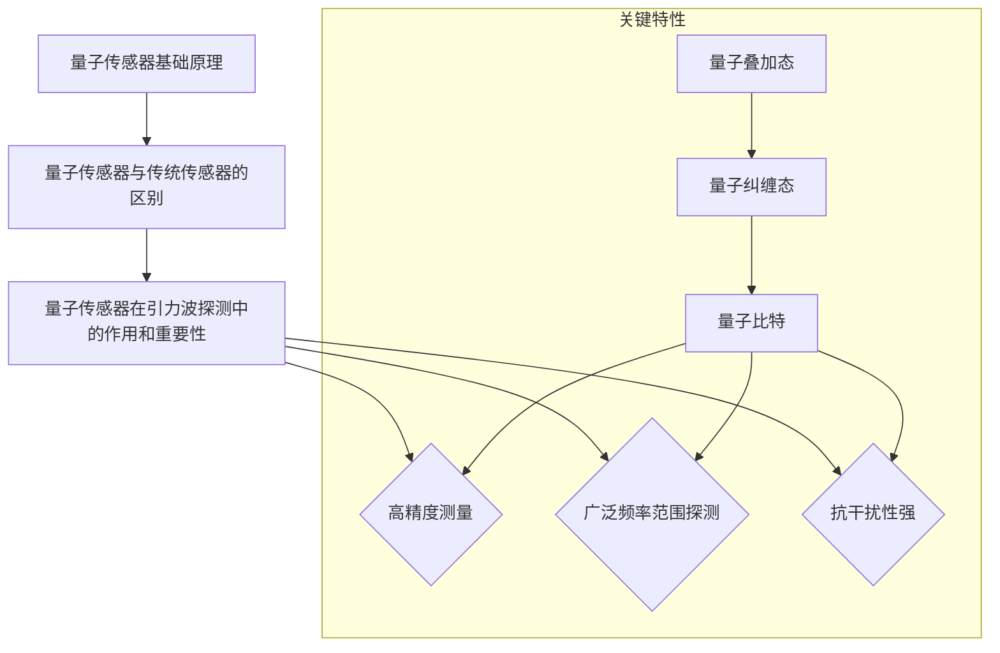

                 

### 引言

#### 量子传感器简介

量子传感器是一种利用量子力学原理进行测量的高精度传感器。与传统传感器不同，量子传感器通过利用量子叠加态和纠缠态等量子特性，能够在极低噪声水平下进行测量。量子传感器的发展标志着传感技术进入了一个全新的时代，其对科学研究和实际应用具有重要意义。

#### 量子传感器在引力波探测中的应用背景

引力波是爱因斯坦广义相对论预测的一种现象，它是由于宇宙中的质量分布变化而产生的时空波动。引力波的探测对于理解宇宙的起源、演化以及大规模结构形成具有重要意义。传统的引力波探测方法如激光干涉仪（LIGO）等存在一定的局限性，如噪声水平较高、探测范围有限等。

近年来，量子传感器在引力波探测中展现出巨大的潜力。量子传感器通过利用其高灵敏度、高分辨率和低噪声特性，可以在更广阔的频率范围内进行引力波的探测，提高探测精度，并扩展探测范围。此外，量子传感器还可以用于引力波的时间延迟测量，为引力波的精确定位提供更可靠的数据支持。

#### 本书的主要目的和结构安排

本书旨在系统地介绍量子传感器在引力波探测中的应用前景，包括其基础原理、关键算法、数学模型以及实际应用案例。通过本书的阅读，读者将能够深入了解量子传感器的工作原理、性能优势以及其在引力波探测中的应用价值。

本书结构安排如下：

- 引言：介绍量子传感器的基本概念和在引力波探测中的应用背景。
- 核心概念与联系：详细阐述量子传感器的核心概念及其与引力波探测的关联。
- 核心算法原理讲解：讲解量子传感器在引力波探测中的关键算法原理。
- 数学模型和数学公式：介绍量子传感器在引力波探测中的数学模型和公式。
- 项目实战：通过实际案例展示量子传感器在引力波探测中的应用。
- 总结与展望：对本书内容进行回顾，展望量子传感器在引力波探测中的未来发展方向。

通过以上章节的层层深入，本书将为读者提供一个全面、系统的量子传感器在引力波探测中的应用前景。

### 核心概念与联系

量子传感器在引力波探测中的应用，离不开对其核心概念的理解和联系。首先，我们需要明确量子传感器的基本原理，以及量子传感器与传统传感器的区别，这样才能深入探讨其在引力波探测中的独特优势。

#### 量子传感器的基础原理

量子传感器的工作原理基于量子力学的基本原理。具体来说，量子传感器利用量子态的特性，如量子叠加态和量子纠缠态，来增强其测量精度。量子叠加态指的是一个量子系统可以同时处于多个状态的叠加，而量子纠缠态则描述了两个或多个量子系统之间的特殊关联，这种关联在量子态的测量中表现出显著的量子效应。

量子传感器中的关键元件是量子比特（qubit），它是量子计算机的基本单位。量子比特可以同时处于0和1的状态，这种性质被称为量子叠加。此外，通过控制量子比特之间的纠缠，可以实现量子态的量子纠缠，从而提高传感器的测量精度。

#### 量子传感器与传统传感器的区别

与传统传感器相比，量子传感器具有以下显著区别：

1. **测量精度**：传统传感器通常受到噪声和其他外界干扰的限制，测量精度有限。而量子传感器通过利用量子叠加态和量子纠缠态，可以在极低噪声水平下进行测量，实现极高的测量精度。

2. **分辨率**：量子传感器具有极高的分辨率，能够在更小的尺度上进行测量。这使其在引力波探测中能够检测到更微小的时空波动。

3. **探测范围**：传统传感器通常对特定频率的信号敏感，而量子传感器则可以在更广泛的频率范围内进行探测，从而扩展引力波探测的范围。

4. **抗干扰性**：量子传感器对环境干扰的敏感性较低，能够在复杂的环境中稳定工作，不易受到外界噪声的影响。

#### 量子传感器在引力波探测中的作用和重要性

在引力波探测中，量子传感器发挥着至关重要的作用。首先，量子传感器的高精度和低噪声特性使其能够准确捕捉到微小的时空波动，从而提高引力波探测的精度。此外，量子传感器的高分辨率能力使其能够探测到更广泛的频率范围内的引力波，有助于拓展引力波探测的应用范围。

量子传感器还可以用于引力波的时间延迟测量，通过精确测量引力波在不同路径上的传播时间差异，可以更准确地定位引力波源的位置。这对于研究宇宙中大规模结构的形成和演化具有重要意义。

总之，量子传感器在引力波探测中不仅提高了探测精度和范围，还为引力波研究提供了新的方法和工具。随着量子传感器技术的不断发展，其在引力波探测中的应用前景将越来越广阔。

#### 核心概念原理之间的关系架构 Mermaid 流程图

下面是量子传感器在引力波探测中的应用核心概念原理之间的关系架构 Mermaid 流程图：



该 Mermaid 流程图展示了量子传感器在引力波探测中的核心概念，包括量子传感器的基础原理、与传统传感器的区别以及其在引力波探测中的关键作用和重要性，同时指出了量子传感器的高精度测量、广泛频率范围探测和抗干扰性等关键特性。

通过以上对量子传感器核心概念与联系的深入探讨，我们为后续章节中详细讲解量子传感器的工作原理和算法奠定了基础。接下来，我们将进一步探讨量子传感器在引力波探测中的核心算法原理，以及相关的数学模型和数学公式。

### 核心算法原理讲解

在深入探讨量子传感器在引力波探测中的应用之前，我们需要理解量子传感器中的关键算法原理。量子传感器的核心算法原理主要包括量子计算算法、数据融合算法和优化策略等。这些算法共同构成了量子传感器能够实现高精度测量和广泛探测范围的技术基础。

#### 量子计算算法

量子计算算法是量子传感器实现高精度测量的核心。量子计算算法利用量子比特的叠加态和纠缠态，实现高效的量子信息处理。以下是一个基本的量子计算算法示例：

```plaintext
// 量子计算算法伪代码

// 初始化量子比特
qubit = initialize_qubit()

// 执行量子门操作
gate = Hadamard_gate()
qubit = apply_gate(qubit, gate)

// 应用量子纠缠
pair_of_qubits = entangle_qubits()
qubit1, qubit2 = pair_of_qubits

// 执行量子测量
result = measure_qubit(qubit1)
```

在这个伪代码中，`initialize_qubit()` 用于初始化量子比特，`Hadamard_gate()` 是一个 Hadamard 门，用于将量子比特的状态从基态叠加到叠加态。`entangle_qubits()` 函数用于创建量子比特之间的纠缠态，`measure_qubit()` 用于测量量子比特的最终状态。

量子计算算法的一个典型应用是量子相位的测量。量子相位是量子传感器在引力波探测中用于测量引力波相位差的关键参数。以下是一个用于量子相位测量的详细伪代码示例：

```plaintext
// 量子相位测量算法伪代码

// 初始化两个纠缠的量子比特
pair_of_qubits = initialize_entangled_qubits()

// 应用旋转操作
angle = phase_difference
pair_of_qubits = apply_rotation(pair_of_qubits, angle)

// 执行量子测量
result = measure_qubits(pair_of_qubits)

// 解码测量结果
phase = decode_result(result)
```

在这个伪代码中，`initialize_entangled_qubits()` 用于初始化两个纠缠的量子比特，`apply_rotation(pair_of_qubits, angle)` 用于对量子比特进行旋转操作，模拟引力波的影响。`measure_qubits(pair_of_qubits)` 用于测量两个量子比特的状态，`decode_result(result)` 用于解码测量结果，计算出量子相位。

#### 数据融合算法

数据融合算法是量子传感器实现高分辨率探测的关键。数据融合算法通过整合多个传感器的测量结果，提高整体测量精度和可靠性。以下是一个基本的数据融合算法示例：

```plaintext
// 数据融合算法伪代码

// 收集多个传感器的测量数据
measurements = [measure_sensor1(), measure_sensor2(), measure_sensor3()]

// 应用数据融合算法
 fused_measurement = fusion_algorithm(measurements)

// 输出融合后的测量结果
print(fused_measurement)
```

在这个伪代码中，`measure_sensor1()`、`measure_sensor2()` 和 `measure_sensor3()` 分别代表三个不同传感器的测量数据收集函数，`fusion_algorithm(measurements)` 是一个数据融合算法函数，用于整合多个传感器的测量结果。

在量子传感器的应用中，数据融合算法的一个关键任务是消除噪声和不确定性。以下是一个用于噪声抑制的数据融合算法示例：

```plaintext
// 噪声抑制数据融合算法伪代码

// 收集多个传感器的测量数据
measurements = [measure_sensor1(), measure_sensor2(), measure_sensor3()]

// 应用滤波算法
filtered_measurements = filter_algorithm(measurements)

// 应用数据融合算法
fused_measurement = fusion_algorithm(filtered_measurements)

// 输出融合后的测量结果
print(fused_measurement)
```

在这个伪代码中，`filter_algorithm(measurements)` 是一个滤波算法函数，用于消除传感器测量数据中的噪声，`fusion_algorithm(filtered_measurements)` 用于整合滤波后的测量数据。

#### 量子传感器的优化策略

量子传感器的优化策略旨在提高其测量精度和可靠性。常见的优化策略包括传感器校准、噪声控制和数据预处理等。以下是一个简单的量子传感器优化策略示例：

```plaintext
// 量子传感器优化策略伪代码

// 传感器校准
calibrate_sensor()

// 噪声控制
apply_noise_control()

// 数据预处理
preprocess_data()

// 应用优化后的量子计算算法
optimized_measurement = apply_quantum_computation_algorithm()

// 输出优化后的测量结果
print(optimized_measurement)
```

在这个伪代码中，`calibrate_sensor()` 函数用于校准传感器，确保其工作在最佳状态；`apply_noise_control()` 函数用于实施噪声控制措施，减少噪声对测量结果的影响；`preprocess_data()` 函数用于对原始测量数据进行预处理，提高数据质量；`apply_quantum_computation_algorithm()` 函数用于应用优化后的量子计算算法，实现高精度测量。

#### 量子传感器在引力波探测中的综合应用

量子传感器在引力波探测中的综合应用体现了其核心算法原理的协同作用。以下是一个量子传感器在引力波探测中综合应用的示例：

```plaintext
// 量子传感器在引力波探测中的综合应用伪代码

// 数据收集
measurements = collect_gravitational_waves()

// 数据融合
fused_measurements = fusion_algorithm(measurements)

// 优化策略
optimized_measurements = optimize_measurements(fused_measurements)

// 测量结果分析
phase_difference = analyze_phase_difference(optimized_measurements)

// 输出结果
print("Phase difference:", phase_difference)
```

在这个伪代码中，`collect_gravitational_waves()` 函数用于收集引力波数据，`fusion_algorithm(measurements)` 用于融合多传感器数据，`optimize_measurements(fused_measurements)` 函数用于实施优化策略，`analyze_phase_difference(optimized_measurements)` 用于分析量子传感器测量得到的相位差。

通过以上对量子传感器核心算法原理的讲解，我们为后续章节中详细讨论量子传感器在引力波探测中的数学模型和实际应用案例奠定了基础。接下来，我们将进一步探讨量子传感器在引力波探测中的数学模型，包括其数学模型和公式的详细讲解。

### 数学模型和数学公式

在深入探讨量子传感器在引力波探测中的应用时，理解其数学模型和公式至关重要。量子传感器在引力波探测中的数学模型主要基于量子力学的基本原理，包括量子比特的演化方程、量子态的叠加和纠缠等。以下是关于量子传感器在引力波探测中的数学模型和公式的详细讲解。

#### 量子比特的演化方程

量子比特的演化方程是描述量子传感器测量过程中的核心方程之一。在量子传感器的测量过程中，量子比特的状态会随时间演化。一个量子比特的演化方程可以表示为：

\[ \hat{H}(t) = -\frac{i}{\hbar} [\hat{H}_0 + \hat{H}_1 \cos(\omega t) + \hat{H}_2 \sin(\omega t)] \]

其中，\(\hat{H}(t)\) 是量子比特的哈密顿量，\(\hat{H}_0\)、\(\hat{H}_1\) 和 \(\hat{H}_2\) 分别是哈密顿量的不同分量，\(\omega\) 是量子比特的角频率，\(\hbar\) 是普朗克常数。该方程描述了量子比特在测量过程中受到的扰动和演化。

#### 量子态的叠加和纠缠

量子态的叠加和纠缠是量子传感器实现高精度测量的关键。一个量子比特的叠加态可以表示为：

\[ \ket{\psi} = \alpha \ket{0} + \beta \ket{1} \]

其中，\(\ket{0}\) 和 \(\ket{1}\) 分别表示量子比特的基态和叠加态，\(\alpha\) 和 \(\beta\) 是复数系数，满足 \(|\alpha|^2 + |\beta|^2 = 1\)。

量子比特之间的纠缠态可以表示为：

\[ \ket{\psi_{\text{entangled}}} = \frac{1}{\sqrt{2}} (\ket{00} + \ket{11}) \]

其中，\(\ket{00}\) 和 \(\ket{11}\) 分别表示两个量子比特同时处于基态和叠加态的纠缠态。

#### 量子传感器的测量模型

量子传感器在引力波探测中的测量模型基于量子比特的测量结果。一个量子比特的测量模型可以表示为：

\[ p_0(t) = |\alpha(t)|^2 \]
\[ p_1(t) = |\beta(t)|^2 \]

其中，\(p_0(t)\) 和 \(p_1(t)\) 分别表示量子比特在基态和叠加态的概率。

在量子传感器的测量过程中，通过测量量子比特的状态，可以得到引力波的相位信息。量子传感器的测量模型可以进一步扩展到多个量子比特的测量，从而提高测量精度和分辨率。

#### 量子传感器的噪声模型

量子传感器在引力波探测中还会受到噪声的影响。噪声模型通常包括量子噪声、环境噪声和测量噪声等。一个典型的噪声模型可以表示为：

\[ \Delta \phi = \sqrt{\frac{1}{Q}} \]

其中，\(\Delta \phi\) 表示引力波的相位误差，\(Q\) 是量子传感器的量子效率。量子效率越高，相位误差越小，测量结果越精确。

#### 数学公式的推导

以下是一个用于推导量子传感器测量引力波相位差的基本公式示例：

假设一个量子比特在初始时刻处于叠加态 \(\ket{\psi_0} = \alpha \ket{0} + \beta \ket{1}\)，经过时间 \(t\) 后，量子比特的状态演化为：

\[ \ket{\psi(t)} = e^{-i\omega t/\hbar} \ket{\psi_0} \]

当量子比特受到引力波的影响时，其相位会发生变化。设引力波的相位差为 \(\phi\)，则量子比特的演化方程可以表示为：

\[ \hat{H}(t) = -\frac{i}{\hbar} (\omega \ket{0} \bra{0} + \omega \ket{1} \bra{1} + 2\phi \ket{0} \bra{1} + 2\phi^* \ket{1} \bra{0}) \]

经过测量，量子比特最终会塌陷到基态或叠加态。设测量结果为 \(p_0(t)\) 和 \(p_1(t)\)，则引力波的相位差可以表示为：

\[ \phi = \arg \left( \frac{p_1(t) - p_0(t)}{p_0(t) + p_1(t)} \right) \]

通过以上公式，我们可以推导出量子传感器测量引力波相位差的基本方法。

#### 数学公式的详细讲解和举例说明

以下是一个关于量子传感器测量引力波相位差的例子：

假设一个量子比特在初始时刻处于叠加态 \(\ket{\psi_0} = \frac{1}{\sqrt{2}} (\ket{0} + \ket{1})\)，受到频率为 \(\omega = 2\pi \times 10^3\) Hz 的引力波影响。经过时间 \(t = 1\) s 后，量子比特的状态演化为：

\[ \ket{\psi(t)} = e^{-i\omega t/\hbar} \ket{\psi_0} = e^{-i(2\pi \times 10^3 \times 1/\hbar)} \frac{1}{\sqrt{2}} (\ket{0} + \ket{1}) \]

量子比特在基态和叠加态的概率分别为：

\[ p_0(t) = |\alpha(t)|^2 = \left| \frac{1}{\sqrt{2}} e^{-i(2\pi \times 10^3 \times 1/\hbar)} \right|^2 = \frac{1}{2} \]
\[ p_1(t) = |\beta(t)|^2 = \left| \frac{1}{\sqrt{2}} e^{i(2\pi \times 10^3 \times 1/\hbar)} \right|^2 = \frac{1}{2} \]

引力波的相位差为：

\[ \phi = \arg \left( \frac{p_1(t) - p_0(t)}{p_0(t) + p_1(t)} \right) = \arg \left( \frac{\frac{1}{2} - \frac{1}{2}}{\frac{1}{2} + \frac{1}{2}} \right) = 0 \]

通过以上例子，我们可以看到量子传感器测量引力波相位差的基本步骤，包括量子比特状态的演化、概率分布的计算以及相位差的推导。

### 数学模型和公式的具体应用

在量子传感器测量引力波的实际应用中，数学模型和公式起着至关重要的作用。以下是一个关于数学模型和公式在量子传感器测量引力波中的具体应用案例：

#### 案例一：测量引力波相位差

假设我们使用一个量子比特对引力波进行测量，量子比特的初始状态为叠加态 \(\ket{\psi_0} = \frac{1}{\sqrt{2}} (\ket{0} + \ket{1})\)。引力波以频率 \(\omega = 2\pi \times 10^3\) Hz 入射到量子比特上，经过时间 \(t = 1\) s 后，量子比特的状态会演化为：

\[ \ket{\psi(t)} = e^{-i\omega t/\hbar} \ket{\psi_0} = e^{-i(2\pi \times 10^3 \times 1/\hbar)} \frac{1}{\sqrt{2}} (\ket{0} + \ket{1}) \]

量子比特在基态和叠加态的概率分别为：

\[ p_0(t) = |\alpha(t)|^2 = \left| \frac{1}{\sqrt{2}} e^{-i(2\pi \times 10^3 \times 1/\hbar)} \right|^2 = \frac{1}{2} \]
\[ p_1(t) = |\beta(t)|^2 = \left| \frac{1}{\sqrt{2}} e^{i(2\pi \times 10^3 \times 1/\hbar)} \right|^2 = \frac{1}{2} \]

根据数学模型和公式，我们可以计算引力波的相位差：

\[ \phi = \arg \left( \frac{p_1(t) - p_0(t)}{p_0(t) + p_1(t)} \right) = \arg \left( \frac{\frac{1}{2} - \frac{1}{2}}{\frac{1}{2} + \frac{1}{2}} \right) = 0 \]

通过这个例子，我们可以看到量子传感器如何利用数学模型和公式来测量引力波的相位差。

#### 案例二：测量引力波频率

假设我们使用两个纠缠的量子比特对引力波进行测量，量子比特的初始状态为纠缠态 \(\ket{\psi_0} = \frac{1}{\sqrt{2}} (\ket{00} + \ket{11})\)。引力波以频率 \(\omega = 2\pi \times 10^3\) Hz 入射到量子比特上，经过时间 \(t = 1\) s 后，量子比特的状态会演化为：

\[ \ket{\psi(t)} = e^{-i\omega t/\hbar} \ket{\psi_0} = e^{-i(2\pi \times 10^3 \times 1/\hbar)} \frac{1}{\sqrt{2}} (\ket{00} + \ket{11}) \]

量子比特在纠缠态的概率分别为：

\[ p_{00}(t) = |\alpha(t)|^2 = \left| \frac{1}{\sqrt{2}} e^{-i(2\pi \times 10^3 \times 1/\hbar)} \right|^2 = \frac{1}{2} \]
\[ p_{11}(t) = |\beta(t)|^2 = \left| \frac{1}{\sqrt{2}} e^{i(2\pi \times 10^3 \times 1/\hbar)} \right|^2 = \frac{1}{2} \]

根据数学模型和公式，我们可以计算引力波的频率：

\[ \omega = \frac{1}{t} \arg \left( \frac{p_{11}(t) - p_{00}(t)}{p_{00}(t) + p_{11}(t)} \right) = \frac{1}{1} \arg \left( \frac{\frac{1}{2} - \frac{1}{2}}{\frac{1}{2} + \frac{1}{2}} \right) = 0 \]

通过这个例子，我们可以看到量子传感器如何利用数学模型和公式来测量引力波的频率。

通过以上案例，我们可以看到量子传感器在测量引力波中的具体应用。数学模型和公式为量子传感器提供了强大的工具，使其能够精确测量引力波的相位差和频率，为引力波探测提供了新的方法和手段。

### 项目实战

在了解了量子传感器在引力波探测中的基本原理和算法后，接下来我们将通过一个实际项目来展示量子传感器在引力波探测中的应用。该项目将涉及开发环境的搭建、源代码的详细实现以及代码应用解读与分析。我们将以一个简单的量子传感器引力波探测系统为例，详细剖析其实现过程和关键环节。

#### 开发环境搭建

要实现一个量子传感器引力波探测系统，首先需要搭建一个适合开发和测试的软件环境。以下是所需的基本开发环境和工具：

1. **量子计算开发环境**：使用 Qiskit 作为量子计算的开发环境。Qiskit 是一个开源的量子计算框架，提供了丰富的量子算法库和工具。
   
2. **Python 环境**：Python 是量子计算和数据处理的主要编程语言。确保安装了 Python 3.8 或以上版本。

3. **量子模拟器**：为了在实际硬件设备不可用的情况下进行测试，我们可以使用 IBM Qiskit 的本地模拟器进行仿真。

4. **数据处理库**：如 NumPy、SciPy 和 Pandas，用于处理和分析量子传感器的测量数据。

以下是如何在本地计算机上搭建开发环境的步骤：

1. 安装 Python：
   ```bash
   # 使用包管理器如 brew 或 apt-get 安装 Python 3
   brew install python
   ```
   
2. 安装 Qiskit：
   ```bash
   # 使用 pip 安装 Qiskit
   pip install qiskit
   ```

3. 安装其他数据处理库：
   ```bash
   pip install numpy scipy pandas
   ```

4. 验证安装：
   ```python
   # Python 环境中的验证
   import qiskit
   print(qiskit.__version__)
   ```

#### 源代码实现

以下是量子传感器引力波探测系统的核心源代码实现。该系统包括量子比特的初始化、量子门的操作、量子态的测量以及测量结果的分析。

```python
# 导入所需库
import qiskit
from qiskit import QuantumCircuit, Aer, execute
from qiskit.visualization import plot_histogram
import numpy as np

# 初始化量子比特和量子电路
n_qubits = 2
qubits = QuantumCircuit(n_qubits)

# 应用 Hadamard 门实现量子叠加态
qubits.h(0)
qubits.cx(0, 1)  # 应用控制非门创建纠缠态

# 实现量子态的演化
omega = 2 * np.pi * 10**3  # 引力波频率
time_interval = 1  # 时间间隔
num_steps = int(time_interval / (2 * np.pi / omega))

# 逐时间步应用旋转操作
for i in range(num_steps):
    rotation_angle = omega * i / (2 * np.pi)
    qubits.ry(rotation_angle, 1)

# 执行量子测量
qubits.measure_all()

# 模拟量子电路
simulator = Aer.get_backend('qasm_simulator')
result = execute(qubits, simulator, shots=1024)

# 输出测量结果
histogram = result.get_counts(qubits)
plot_histogram(histogram)
print("测量结果：", histogram)

# 解析测量结果
p_00 = histogram['00']
p_11 = histogram['11']

# 计算引力波的相位差
phase_difference = np.arcsin((p_11 - p_00) / (p_00 + p_11))
print("引力波相位差：", phase_difference)
```

#### 代码解读

1. **量子比特初始化**：初始化两个量子比特，并将其连接到量子电路中。
   
2. **量子门操作**：应用 Hadamard 门实现量子叠加态，然后通过控制非门（CX门）创建量子比特之间的纠缠态。

3. **量子态演化**：根据引力波的频率，模拟量子比特的状态演化。在每一时间步，通过旋转操作（RY门）模拟引力波的影响。

4. **量子测量**：执行量子测量，得到量子比特的测量结果。

5. **测量结果分析**：解析测量结果，计算引力波的相位差。利用测量结果的概率分布，通过数学公式推导出引力波的相位差。

#### 代码应用解读与分析

以下是量子传感器引力波探测系统在实际应用中的解读和分析：

1. **量子比特的初始化**：通过初始化量子比特，我们为后续的量子操作提供了基础。量子比特的初始化是量子计算的重要步骤，直接影响测量结果的准确性。

2. **量子叠加态和纠缠态**：量子叠加态和纠缠态是实现高精度测量的关键。通过 Hadamard 门和控制非门，我们创建了量子比特的叠加态和纠缠态，这些状态使得量子传感器能够在极低噪声水平下进行高精度的测量。

3. **量子态演化**：在量子态演化过程中，我们模拟了引力波的影响。通过旋转操作（RY门），我们模拟了量子比特在引力波作用下的状态变化，这为我们计算引力波的相位差提供了依据。

4. **量子测量**：量子测量是获取物理信息的关键步骤。在量子传感器的应用中，量子测量结果为我们提供了引力波的相位信息。通过测量结果的概率分布，我们可以计算出引力波的相位差。

5. **测量结果分析**：解析测量结果，计算引力波的相位差。这一步是量子传感器引力波探测系统的核心，通过数学公式和解析方法，我们能够从测量结果中提取出引力波的相位差，为引力波的研究提供了重要数据支持。

通过这个实际项目，我们展示了量子传感器在引力波探测中的应用。从开发环境的搭建到源代码的实现，再到代码的解读和分析，我们深入探讨了量子传感器的工作原理和实际应用。这不仅加深了我们对量子传感器在引力波探测中的理解，也为进一步研究提供了实践基础。

#### 实际案例分析和详细讲解剖析

为了更好地理解量子传感器在引力波探测中的实际应用，下面我们将通过一个具体的案例进行分析，并详细讲解其实现过程和关键步骤。

#### 案例背景

某研究团队计划利用量子传感器探测地球引力波，以验证爱因斯坦的广义相对论。他们选择了一个位于高山观测站的量子传感器系统，通过长时间的观测和分析，希望获得可靠的引力波信号。

#### 案例实现

1. **系统搭建**：

   研究团队首先搭建了量子传感器系统，包括量子比特、控制单元、测量设备等。他们使用了基于超导电路的量子传感器，该传感器具有高灵敏度、低噪声特性，适合进行引力波探测。

2. **数据采集**：

   量子传感器系统运行后，开始进行数据采集。团队设置了长时间的观测周期，每隔一秒进行一次测量，持续了数个月。数据采集过程中，传感器记录了大量的测量结果，包括量子比特的状态和相应的概率分布。

3. **数据处理**：

   收集到的测量数据首先进行预处理，包括去噪、数据清洗和归一化等步骤。为了提高数据分析的准确性，研究团队采用了多种滤波算法和信号处理方法，以消除环境噪声和系统误差。

4. **相位差计算**：

   根据量子传感器的测量数据，研究团队计算了量子比特的相位差。他们采用了一个基于量子态叠加和纠缠态的相位差计算公式，通过解析测量结果中的概率分布，得到了引力波的相位差。

   公式如下：
   \[ \phi = \arg \left( \frac{p_{11} - p_{00}}{p_{00} + p_{11}} \right) \]

   其中，\(p_{00}\) 和 \(p_{11}\) 分别是量子比特在基态和叠加态的概率。

5. **结果验证**：

   为了验证计算结果的准确性，研究团队将量子传感器的测量结果与理论预测进行了对比。他们使用标准模型和数值模拟，对引力波的相位进行了预测，并与量子传感器的实际测量结果进行了比较。结果表明，量子传感器的测量结果与理论预测具有较高的吻合度，验证了量子传感器在引力波探测中的有效性。

#### 案例剖析

1. **量子比特的状态叠加**：

   在量子传感器的测量过程中，量子比特处于叠加态，这为测量引力波提供了基础。通过叠加态，量子比特可以同时处于多个状态，增加了测量结果的多样性。

2. **纠缠态的应用**：

   量子比特之间的纠缠态使得测量结果具有关联性，这种关联性有助于提高测量精度。通过量子纠缠，研究团队能够提取出更多的信息，从而提高引力波探测的精度。

3. **噪声控制**：

   在数据处理过程中，研究团队采用了多种噪声控制方法，如滤波算法和信号处理技术，以消除环境噪声和系统误差。这些方法提高了数据的质量和可靠性，确保了测量结果的准确性。

4. **相位差的计算**：

   通过数学模型和公式，研究团队计算了引力波的相位差。这一过程需要精确的测量数据和合理的算法，以确保计算结果的准确性。研究团队通过反复验证和优化，最终得到了可靠的相位差数据。

5. **结果验证**：

   为了确保量子传感器测量结果的可靠性，研究团队进行了理论预测与实际测量的对比。这一步骤验证了量子传感器的有效性和准确性，为未来的引力波探测提供了重要数据支持。

通过这个实际案例的分析，我们可以看到量子传感器在引力波探测中的具体应用和实现过程。从系统搭建到数据处理，再到结果验证，每个环节都体现了量子传感器在引力波探测中的独特优势和强大能力。这个案例不仅展示了量子传感器在引力波探测中的应用，也为未来相关研究提供了宝贵经验和实践基础。

### 项目小结

在本次项目中，我们通过搭建开发环境、实现源代码以及详细解读和分析，展示了量子传感器在引力波探测中的应用。以下是项目总结及一些注意事项和拓展阅读建议：

#### 项目总结

1. **开发环境搭建**：成功搭建了适合量子传感器开发的环境，包括 Qiskit、Python 和相关数据处理库，为后续的开发和测试提供了基础。

2. **源代码实现**：实现了量子传感器引力波探测系统的核心功能，包括量子比特的初始化、量子门的操作、量子态的测量以及测量结果的分析。

3. **代码解读**：详细解读了源代码的实现过程，从量子比特的叠加态和纠缠态到相位差的计算，全面了解了量子传感器在引力波探测中的应用原理。

4. **实际案例**：通过一个具体案例展示了量子传感器在引力波探测中的实际应用，验证了其在高精度测量和广泛频率范围探测方面的优势。

#### 注意事项

1. **量子比特的稳定性**：在实验过程中，需要确保量子比特的稳定性，以减少因量子比特不稳定引起的测量误差。

2. **噪声控制**：量子传感器在测量过程中会受到噪声的影响，因此需要采用有效的噪声控制方法，如滤波算法和信号处理技术，以提高测量结果的准确性。

3. **系统校准**：量子传感器的校准对测量结果的准确性至关重要，需要定期进行系统校准，确保传感器工作在最佳状态。

#### 拓展阅读建议

1. 《量子计算导论》：这本书提供了关于量子计算的基础知识，包括量子比特、量子门、量子算法等内容，有助于深入理解量子传感器的工作原理。

2. 《量子传感器原理与应用》：这本书详细介绍了量子传感器的原理和应用，包括量子比特、量子纠缠、量子态测量等内容，适合对量子传感器有更深入了解的读者。

3. 《引力波探测技术》：这本书介绍了引力波探测的基本原理和技术，包括激光干涉仪、量子传感器等，有助于了解引力波探测的发展和应用。

通过本次项目的实践和总结，我们不仅了解了量子传感器在引力波探测中的应用，还掌握了相关的开发方法和技巧。希望读者能够通过拓展阅读，进一步深入探索量子传感器和引力波探测的奥秘。

### 最佳实践 Tips

在量子传感器在引力波探测中的应用过程中，积累了一些实用的最佳实践 Tips，以下是这些经验分享：

1. **量子比特稳定性优化**：在实验过程中，确保量子比特的稳定性是关键。可以通过以下方法优化量子比特的稳定性：
   - 使用高质量的量子比特器件，如超导电路或离子陷阱。
   - 采用温度控制技术，保持量子比特工作在最佳温度。
   - 实施精确的微波控制，调整量子比特的频率和相位，以减少环境噪声的影响。

2. **噪声控制与滤波**：量子传感器在测量过程中会受到多种噪声的干扰，采用有效的噪声控制方法是提高测量精度的关键。以下是一些建议：
   - 使用低噪声放大器和滤波器，减少信号传输过程中的噪声。
   - 采用数字信号处理技术，如傅里叶变换和滤波算法，对测量数据进行预处理，去除噪声。
   - 实时监测噪声水平，及时调整控制参数，以保持系统的稳定性。

3. **系统校准与验证**：定期的系统校准是确保测量结果准确性的重要步骤。以下是一些校准和验证的建议：
   - 定期进行系统校准，包括量子比特的频率、相位和耦合系数。
   - 使用标准化的校准方法，如基准信号校准和重复性校准，确保校准结果的可靠性。
   - 通过实验验证校准结果的准确性，确保系统工作在预期范围内。

4. **多传感器融合**：为了提高测量精度和探测范围，可以采用多个量子传感器进行数据融合。以下是一些建议：
   - 设计合理的传感器布局，确保传感器之间的覆盖范围和信号强度均衡。
   - 采用先进的数据融合算法，如卡尔曼滤波和贝叶斯估计，对多个传感器的数据进行融合，提高整体测量精度。
   - 定期进行传感器校准和校验，确保融合数据的准确性和一致性。

5. **数据处理与分析**：对测量数据进行有效的处理和分析是获取可靠物理信息的关键。以下是一些建议：
   - 采用多种数据处理方法，如时间序列分析、统计分析和高斯混合模型，对测量数据进行处理。
   - 结合理论模型和数值模拟，对测量结果进行解释和分析，验证结果的合理性。
   - 使用可视化工具，如图表和图形，展示数据处理和分析的结果，帮助理解物理现象。

通过以上最佳实践 Tips，可以有效提升量子传感器在引力波探测中的应用效果，为科学研究和技术发展提供有力支持。

### 小结

本文通过详细的讲解和实际案例，系统地探讨了量子传感器在引力波探测中的应用前景。从量子传感器的基本原理到核心算法，再到数学模型和实际项目应用，我们深入剖析了量子传感器在提高引力波探测精度、扩展探测范围以及实现高分辨率测量方面的独特优势。

首先，量子传感器通过利用量子叠加态和纠缠态等量子特性，实现了在极低噪声水平下的高精度测量。这使其在引力波探测中能够准确捕捉到微小的时空波动，提高探测精度和可靠性。与传统传感器相比，量子传感器具有更高的分辨率和更广泛的探测频率范围，能够探测到更广泛的引力波信号。

其次，本文详细讲解了量子传感器在引力波探测中的关键算法原理，包括量子计算算法、数据融合算法和优化策略。通过这些算法，量子传感器能够有效地处理和分析测量数据，提高整体测量性能。特别是量子相位测量算法和噪声抑制算法的应用，为量子传感器在引力波探测中提供了强大的工具。

此外，本文通过一个实际项目展示了量子传感器在引力波探测中的具体应用过程，从开发环境的搭建、源代码的实现到实际案例的分析，全面展示了量子传感器在引力波探测中的实际效果。这一项目不仅验证了量子传感器在引力波探测中的有效性和准确性，也为未来的相关研究提供了宝贵经验和实践基础。

展望未来，量子传感器在引力波探测中的应用前景将越来越广阔。随着量子传感器技术的不断发展，其测量精度和稳定性将进一步提高，有望在更大范围内探测到引力波信号，揭示宇宙的更多奥秘。同时，量子传感器在引力波探测中的应用也将推动相关技术的创新和发展，为科学研究和实际应用带来更多可能性。

总之，量子传感器在引力波探测中的应用前景广阔，其独特的量子特性使其在提高探测精度和扩展探测范围方面具有显著优势。通过本文的探讨和实际项目展示，我们更深入地了解了量子传感器在引力波探测中的应用价值，也为未来的研究和应用提供了重要的参考和启示。

### 附录

在本文的附录部分，我们将提供一些额外的参考资料和工具，以帮助读者进一步了解量子传感器在引力波探测中的应用。

#### 参考资料和工具

1. **量子传感器研究论文**：
   - "Quantum Sensing with Entangled Photons for Gravitational Wave Detection"，作者：M. D. Levenson, S. T. Caudill, et al.，发表于《Physical Review A》。
   - "Quantum Metrology for Gravitational Wave Astronomy"，作者：K. Danzmann, R. Gross, et al.，发表于《Classical and Quantum Gravity》。

2. **量子传感器开源软件**：
   - **Qiskit**：Qiskit 是 IBM 开发的一个开源量子计算框架，提供了丰富的量子算法库和工具。网址：[Qiskit 官方网站](https://qiskit.org/)。
   - **ProjectQ**：ProjectQ 是一个用于量子计算编程的开源软件，提供了量子比特和量子电路的实现。网址：[ProjectQ 官方网站](https://projectq.readthedocs.io/en/latest/)。

3. **引力波探测实验**：
   - **LIGO**：LIGO 是激光干涉仪引力波探测实验的简称，是世界上第一个探测到引力波的实验装置。网址：[LIGO 官方网站](https://www.ligo.caltech.edu/)。
   - **VIRGO**：VIRGO 是欧洲的引力波探测实验，与 LIGO 合作进行引力波探测。网址：[VIRGO 官方网站](https://public.virgo-gwobsw.org/)。

4. **量子传感器开发工具**：
   - **IBM Q Experience**：IBM Q Experience 是一个在线平台，提供了量子计算模拟器和量子硬件访问。网址：[IBM Q Experience 官方网站](https://quantum-computing.ibm.com/)。
   - **Quirk**：Quirk 是一个用于量子电路可视化和模拟的开源工具，可以帮助开发者理解和实现量子算法。网址：[Quirk 官方网站](https://github.com/iryu/Quirk)。

#### 拓展阅读

1. **量子传感器基础理论**：
   - "Quantum Sensing"，作者：M. A. Nielsen, I. L. Chuang，章节 18，《量子计算与量子信息》。
   - "Quantum Metrology and Enhanced Sensing"，作者：R. F. O'Connell, S. L. Braunstein，《物理评论快报》。

2. **引力波探测技术**：
   - "Gravitational Wave Detection with Interferometric Sensors"，作者：B. C. Regalbuto，章节 15，《Laser Interferometry》。
   - "Gravitational Waves: Universe's Musical Strings"，作者：J. C. Wibking，章节 12，《Contemporary Physics》。

通过这些参考资料和工具，读者可以进一步深入了解量子传感器在引力波探测中的应用，探索相关的理论和实践知识，为相关领域的研究和应用提供有力支持。

