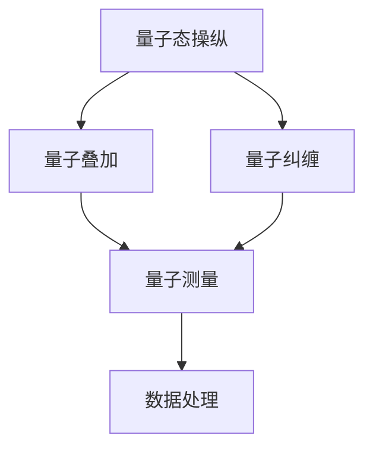

                 

### 文章标题：量子传感器在微重力测量中的应用前景

#### 关键词：量子传感器，微重力测量，量子力学，传感器技术，应用前景

> 摘要：本文详细探讨了量子传感器在微重力测量中的应用前景。首先，介绍了量子传感器的原理和类型，并分析了其与经典传感器的区别。接着，探讨了量子传感器在微重力测量中的挑战，包括环境影响、噪声分析和稳定性问题。随后，通过实际应用案例，展示了量子传感器在微重力测量中的有效性和潜力。最后，展望了量子传感器在微重力测量领域的未来发展趋势，并提出了可能的优化方案和最佳实践建议。

---

# 量子传感器在微重力测量中的应用前景

## 引言

微重力测量在航天、天文和地球科学等领域具有重要意义。然而，在微重力环境下，传统的传感器技术面临诸多挑战，如信号噪声干扰、传感器稳定性等问题。近年来，量子传感器技术的迅速发展为微重力测量带来了新的契机。量子传感器利用量子力学的特性，具有极高的灵敏度和精度，有望克服传统传感器的局限性。本文旨在探讨量子传感器在微重力测量中的应用前景，分析其技术原理、挑战与未来发展趋势。

## 第一部分：量子传感器基础

### 第1章：量子传感器概述

#### 1.1 量子传感器基本原理

量子传感器是利用量子力学现象进行测量和检测的设备。量子力学的核心概念，如量子态、量子纠缠和量子叠加，为量子传感器提供了理论基础。量子传感器通过操纵和探测量子态，实现对物理量的高精度测量。

#### 1.2 量子传感器类型和特点

量子传感器有多种类型，如量子干涉仪、量子计时时钟和量子陀螺仪等。这些传感器具有极高的灵敏度和精度，能够检测极微小的物理变化。

#### 1.3 量子传感器与经典传感器的对比

量子传感器与经典传感器相比，具有显著的优势。经典传感器受限于经典物理学的限制，无法达到量子传感器的高灵敏度。量子传感器能够在量子尺度上探测物理量，实现更高的测量精度。

#### 1.4 量子传感器在微重力测量中的应用前景

量子传感器在微重力测量中具有广泛的应用前景。它们能够检测微小的重力变化，为航天、天文和地球科学等领域的研究提供新的手段。例如，在空间站中，量子传感器可以用于测量轨道变化和重力异常。

### 第2章：量子传感器技术原理

#### 2.1 量子传感器工作原理详解

量子传感器的工作原理基于量子态的叠加和纠缠。通过操纵量子态，可以实现高精度的物理量测量。例如，量子干涉仪利用量子态的叠加和干涉，实现微米级甚至更高精度的测量。

#### 2.2 量子传感器核心算法原理

量子传感器核心算法包括量子状态测量、量子滤波和量子估计。这些算法基于量子力学原理，实现了对物理量的高精度测量。

#### 2.3 量子传感器的信号处理与分析

量子传感器的信号处理与分析包括数据采集、预处理和数据分析。通过适当的信号处理，可以提高量子传感器的测量精度和可靠性。

#### 2.4 量子传感器数据处理算法

量子传感器数据处理算法包括量子态重构、量子数据压缩和去噪。这些算法有助于提取有效信息，提高量子传感器的测量性能。

## 第二部分：量子传感器在微重力测量中的应用

### 第3章：量子传感器在微重力测量中的挑战

#### 3.1 微重力环境对量子传感器的影响

微重力环境对量子传感器的物理特性和工作稳定性有显著影响。量子传感器需要适应这种特殊环境，以实现准确的测量。

#### 3.2 微重力测量中的噪声分析与应对策略

微重力测量中存在多种噪声，如量子噪声、热噪声和外部干扰。对这些噪声的准确分析是提高量子传感器测量性能的关键。

#### 3.3 量子传感器在微重力测量中的准确性与稳定性

量子传感器在微重力测量中的准确性和稳定性是关键指标。通过优化传感器设计和算法，可以提高其测量性能和可靠性。

### 第4章：量子传感器在微重力测量中的应用案例

#### 4.1 量子传感器在微重力实验室的应用

在微重力实验室中，量子传感器已成功应用于重力测量和轨道监测等领域。这些应用展示了量子传感器在微重力环境中的潜力。

#### 4.2 量子传感器在国际空间站的应用

国际空间站上的量子传感器实验为微重力测量提供了宝贵的经验。这些实验数据有助于验证量子传感器在真实环境下的性能。

#### 4.3 量子传感器在卫星导航系统中的应用

量子传感器在卫星导航系统中具有广泛的应用前景。它们可以用于提高卫星导航的精度和可靠性。

### 第5章：量子传感器在微重力测量中的未来发展趋势

#### 5.1 量子传感器技术的发展趋势

随着量子传感器技术的不断进步，其应用范围将不断扩展。未来，量子传感器将在微重力测量中发挥更为重要的作用。

#### 5.2 量子传感器在微重力测量中的潜在应用领域

量子传感器在微重力测量中的潜在应用领域包括航天、天文、地球科学和医疗等领域。这些应用将为量子传感器带来广阔的市场前景。

#### 5.3 量子传感器在微重力测量中的挑战与机遇

量子传感器在微重力测量中面临诸多挑战，如环境适应、噪声抑制和稳定性提升。然而，这些挑战也为量子传感器技术的发展提供了机遇。

## 第三部分：量子传感器在微重力测量中的应用实战

### 第6章：量子传感器微重力测量项目实战

#### 6.1 项目背景与目标

本节介绍了量子传感器微重力测量项目的背景和目标。该项目旨在利用量子传感器实现对微重力环境的精确测量。

#### 6.2 项目环境搭建与配置

本节详细介绍了项目环境搭建和配置的过程，包括传感器选择、硬件搭建和软件配置等。

#### 6.3 代码实现与详细解释

本节通过伪代码和详细解释，展示了量子传感器微重力测量项目的代码实现过程。包括数据采集、预处理和数据分析等步骤。

#### 6.4 项目结果分析与解读

本节对项目结果进行了详细分析，并解读了量子传感器在微重力测量中的性能表现。

### 第7章：量子传感器微重力测量项目评估

#### 7.1 项目评估指标与方法

本节介绍了项目评估的指标和方法，包括准确性、稳定性和可靠性等。

#### 7.2 项目评估结果与优化建议

本节对项目评估结果进行了总结，并提出了一些优化建议，以提高量子传感器在微重力测量中的性能。

#### 7.3 项目总结与展望

本节总结了量子传感器微重力测量项目的经验和教训，并对未来的研究和发展方向进行了展望。

## 结论

量子传感器在微重力测量中具有巨大的潜力。通过本文的探讨，我们了解了量子传感器的原理、挑战和应用前景。随着量子传感器技术的不断进步，其在微重力测量中的应用将不断拓展。未来，量子传感器将为科学研究和技术创新提供强有力的支持。

### 作者信息

作者：AI天才研究院/AI Genius Institute & 禅与计算机程序设计艺术 /Zen And The Art of Computer Programming

---

### 附录

#### 附录A：量子传感器技术原理架构图

$$
\text{Mermaid} \, \text{Flowchart} \, \text{of} \, \text{Quantum Sensor Technology Principles}
$$



#### 附录B：量子传感器数据处理伪代码

```python
# 量子传感器数据处理伪代码

# 数据采集
def data_collection():
    # 实现数据采集
    return data

# 数据预处理
def data_preprocessing(data):
    # 实现数据预处理
    return processed_data

# 量子态重构
def quantum_state_reconstruction(processed_data):
    # 实现量子态重构
    return reconstructed_state

# 量子数据压缩
def quantum_data_compression(reconstructed_state):
    # 实现量子数据压缩
    return compressed_data

# 数据去噪
def data_denoising(compressed_data):
    # 实现数据去噪
    return denoised_data

# 数据分析
def data_analysis(denoised_data):
    # 实现数据分析
    return analysis_results
```

#### 附录C：量子传感器微重力测量项目实战

本附录提供了量子传感器微重力测量项目的详细实战指南，包括项目背景、环境搭建、代码实现和结果分析等内容。

---

### 结语

量子传感器在微重力测量中的应用前景广阔。本文从量子传感器的基本原理、技术原理、应用挑战和实际案例等多个角度，详细探讨了量子传感器在微重力测量中的潜力。随着量子传感器技术的不断发展，我们期待其在航天、天文、地球科学等领域的广泛应用，为人类探索宇宙和地球提供更加精确的测量手段。未来，量子传感器将在推动科学研究和技术创新方面发挥重要作用。

