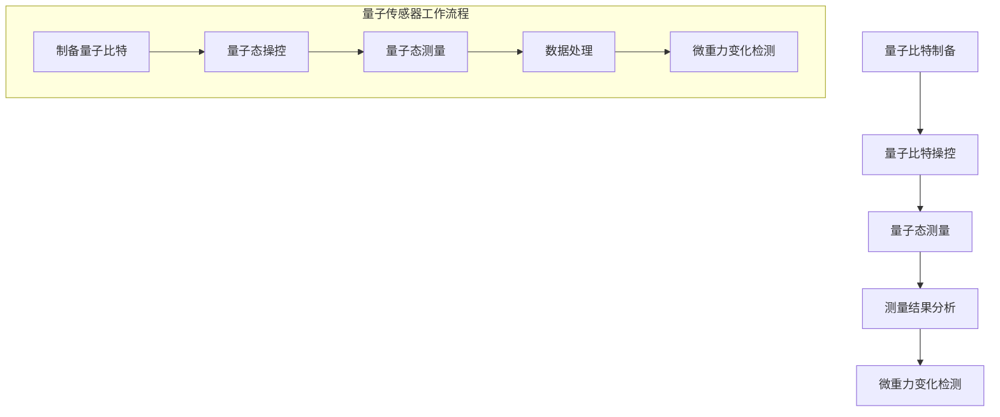

                 

## 文章标题

《量子传感器在微重力测量中的精密应用》

## 文章关键词

量子传感器、微重力测量、量子比特、量子纠缠、量子干涉、量子加速度传感器、量子陀螺仪、量子态操控、量子态测量

## 摘要

本文旨在探讨量子传感器在微重力测量中的精密应用。通过对量子传感器的基本概念、工作原理及其在微重力测量中的应用进行深入分析，本文揭示了量子传感器在实现高精度、高稳定性微重力测量方面的优势。文章还详细介绍了量子重力传感器、量子加速度传感器和量子陀螺仪的原理、实现方法及其在微重力测量中的应用案例。最后，本文探讨了量子传感器在微重力测量中的挑战与解决方案，并对未来发展方向进行了展望。通过本文的阅读，读者将对量子传感器在微重力测量中的应用有更全面、深入的了解。

## 引言

### 背景介绍

随着科技的不断发展，微重力测量在多个领域，如航天、地质勘探、地球物理学等，发挥着越来越重要的作用。传统的重力测量方法，如弹簧测力计、重力仪等，虽然在某些场景下仍具有一定的应用价值，但其测量精度和稳定性受到诸多限制。因此，寻求更高精度、更高稳定性的测量方法成为了科研人员和工程师们的重要课题。

量子传感器，作为一种基于量子力学原理的新型传感器，以其高精度、高灵敏度等优点，成为微重力测量的理想选择。量子传感器利用量子纠缠、量子干涉等量子现象，能够在极微小的尺度上感知重力变化，从而实现高精度的微重力测量。

### 本文目标

本文旨在探讨量子传感器在微重力测量中的应用，通过分析量子传感器的基本原理、工作机制及其在微重力测量中的应用，揭示其在实现高精度、高稳定性微重力测量方面的优势。同时，本文还将探讨量子传感器在微重力测量中面临的挑战及解决方案，并对未来发展方向进行展望。希望通过本文的讨论，能够为相关领域的研究人员和工程技术人员提供有价值的参考。

## 量子传感器概述

### 量子传感器的基本概念

量子传感器是一种基于量子力学原理的新型传感器，它利用量子纠缠、量子干涉等量子现象，能够在极微小的尺度上感知物理量的变化。与传统传感器相比，量子传感器具有更高的精度、更宽的动态范围和更高的灵敏度。量子传感器的核心元件是量子比特，它是量子信息处理的基本单位，可以同时处于0和1的叠加状态，从而实现超并行计算。

### 量子传感器与传统传感器的区别

量子传感器与传统传感器在原理、性能和应用场景上存在显著差异。传统传感器通常基于经典物理学原理，通过测量物体的宏观物理量（如质量、温度、压力等）来进行感知。而量子传感器则基于量子力学原理，通过测量量子态的变化来实现感知。

在性能方面，量子传感器具有更高的灵敏度和更宽的动态范围。例如，量子重力传感器能够测量到微小的重力变化，而传统重力传感器则难以达到如此高的精度。此外，量子传感器的测量误差较低，能够提供更可靠的测量结果。

在应用场景方面，量子传感器具有广泛的应用前景。在微重力测量中，量子传感器可以用于测量航天器在轨道上的微重力变化，从而优化航天器的轨道设计。在地质勘探中，量子传感器可以用于测量地壳的微重力变化，从而发现地下矿物资源。在地球物理学中，量子传感器可以用于测量地震前兆，为地震预警提供重要依据。

### 量子传感器的工作原理

量子传感器的工作原理主要基于量子纠缠和量子干涉现象。量子纠缠是指两个或多个粒子在量子态上形成的强关联，即使它们相距很远，一个粒子的状态变化也会立即影响到另一个粒子的状态。量子干涉则是指两个或多个量子态在叠加时，会产生干涉效应，从而影响测量结果。

在量子重力传感器中，量子纠缠用于测量微小的重力变化。具体来说，量子重力传感器通过制备一个量子态，使其处于两个正交态的叠加状态。当这个量子态通过重力场时，重力场会改变量子态的叠加比例，从而引起干涉条纹的变化。通过测量干涉条纹的变化，可以精确地测量出重力场的变化。

在量子加速度传感器中，量子干涉用于测量加速度。具体来说，量子加速度传感器通过制备一个量子态，使其处于两个正交态的叠加状态。当这个量子态受到加速度作用时，量子态的叠加比例会发生变化，从而引起干涉条纹的变化。通过测量干涉条纹的变化，可以精确地测量出加速度。

在量子陀螺仪中，量子态的旋转用于测量角速度。具体来说，量子陀螺仪通过制备一个量子态，使其处于两个正交态的叠加状态。当量子陀螺仪旋转时，量子态的叠加比例会发生变化，从而引起干涉条纹的变化。通过测量干涉条纹的变化，可以精确地测量出角速度。

### 量子传感器的核心元件

量子传感器的核心元件是量子比特。量子比特是一种能够同时处于0和1两种状态的量子位，它能够实现超并行计算。量子比特的制备、操控和测量是量子传感器实现高精度测量的关键。

量子比特的制备通常采用量子点、离子阱、超导电路等方法。这些方法能够将电子或离子囚禁在特定的位置，从而实现量子比特的制备。

量子比特的操控主要通过控制电场、磁场或光场来实现。例如，在量子点中，可以通过改变电场来操控量子点的能级，从而实现量子比特的操控。

量子比特的测量通常采用量子态的叠加与干涉原理。通过测量量子态的叠加比例，可以精确地测量出量子比特的状态。

### 量子传感器的应用

量子传感器在微重力测量中具有广泛的应用。量子重力传感器可以用于测量航天器在轨道上的微重力变化，从而优化航天器的轨道设计。量子加速度传感器可以用于测量飞机、导弹等飞行器的加速度，从而提高飞行器的性能。量子陀螺仪可以用于测量飞行器的角速度，从而提高飞行器的导航精度。

此外，量子传感器在其他领域也具有广泛的应用。例如，在地质勘探中，量子重力传感器可以用于测量地壳的微重力变化，从而发现地下矿物资源。在地球物理学中，量子传感器可以用于测量地震前兆，为地震预警提供重要依据。在医疗领域，量子传感器可以用于测量生物体内的微重力变化，从而实现疾病诊断和药物治疗监测。

总之，量子传感器在微重力测量中具有广泛的应用前景，其高精度、高稳定性的特点为微重力测量提供了新的技术手段。随着量子传感器技术的不断进步，其在各个领域的应用将越来越广泛。

### Mermaid 流程图

下面是一个简化的Mermaid流程图，展示了量子传感器从量子比特制备到最终测量结果的过程。



在这个流程图中，我们首先制备量子比特，然后对其进行操控，最后测量量子态并分析测量结果，从而实现对微重力变化的检测。

### 核心算法原理讲解

量子传感器在微重力测量中的核心算法主要包括量子比特的制备、操控和测量，以及基于量子态的微重力变化检测。以下将使用伪代码详细阐述这些核心算法原理。

#### 量子比特制备

伪代码：
```plaintext
制备量子比特(Qubit Preparation)
{
    选择制备方法（例如：量子点、离子阱或超导电路）
    应用适当的电场、磁场或光场
    量子比特被制备为特定的量子态 |0⟩ 或 |1⟩
    返回量子比特
}
```

#### 量子比特操控

伪代码：
```plaintext
量子比特操控(Qubit Control)
{
    选择操控方法（例如：门操作、调制等）
    应用电场、磁场或光场
    量子比特的量子态发生改变，形成叠加态或纠缠态
    返回操控后的量子比特
}
```

#### 量子态测量

伪代码：
```plaintext
量子态测量(Qubit Measurement)
{
    应用适当的测量设备
    测量量子比特的量子态
    返回测量结果（0或1）
}
```

#### 微重力变化检测

伪代码：
```plaintext
微重力变化检测(Gravitational Change Detection)
{
    制备量子比特并操控
    测量量子比特
    分析测量结果，判断量子态的叠加比例变化
    根据量子态变化推断微重力变化
    返回微重力变化检测结果
}
```

### 数学模型和公式

量子传感器的核心原理涉及量子态的叠加和干涉，以下是一些关键的数学模型和公式。

#### 量子态叠加

假设一个量子比特处于状态 |ψ⟩，其可以表示为：
$$
|ψ⟩ = a|0⟩ + b|1⟩
$$
其中，a和b是复数系数，满足 |a|^2 + |b|^2 = 1。

#### 量子态干涉

当两个量子比特处于纠缠态时，其叠加态可以表示为：
$$
|\psi⟩ = a_{00}|00⟩ + a_{01}|01⟩ + a_{10}|10⟩ + a_{11}|11⟩
$$

#### 量子态测量

假设我们对一个量子比特进行测量，其结果为0的概率为 |a|^2，结果为1的概率为 |b|^2。测量结果可以表示为：
$$
P(测量结果为0) = |a|^2
$$
$$
P(测量结果为1) = |b|^2
$$

#### 微重力变化与量子态关系

假设量子态的变化与微重力变化成正比，其关系可以表示为：
$$
Δψ = k \cdot Δg
$$
其中，Δψ是量子态的变化，Δg是微重力变化，k是比例常数。

### 详细讲解与举例说明

#### 量子比特制备

例如，我们使用量子点制备一个量子比特。首先，我们将量子点放置在一个具有特定频率的激光场中，通过控制激光的强度和频率，我们可以使量子点处于特定的量子态 |0⟩ 或 |1⟩。

伪代码：
```plaintext
量子比特制备(Quantum Bit Preparation)
{
    设置激光参数（频率f，强度I）
    启动激光器
    观察量子点发射的光子
    根据光子数判断量子点的量子态
    返回量子比特状态（|0⟩或|1⟩）
}
```

#### 量子比特操控

例如，我们使用控制-NOT（CNOT）门来操控两个量子比特。首先，我们制备两个量子比特，其中一个为控制比特（Control Qubit），另一个为目标比特（Target Qubit）。然后，我们应用CNOT门，使得目标比特的状态依赖于控制比特的状态。

伪代码：
```plaintext
量子比特操控(Qubit Control)
{
    制备两个量子比特（控制比特C和控制比特T）
    应用CNOT门
    测量控制比特C和目标比特T
    根据测量结果，控制比特T的状态发生改变
    返回操控后的量子比特
}
```

#### 量子态测量

例如，我们对一个处于叠加态的量子比特进行测量。首先，我们制备一个量子比特，使其处于叠加态 |ψ⟩ = 1/√2(|0⟩ + |1⟩)。然后，我们对其进行测量。

伪代码：
```plaintext
量子态测量(Qubit Measurement)
{
    制备量子比特（|ψ⟩ = 1/√2(|0⟩ + |1⟩)）
    应用测量设备
    根据测量结果，返回量子比特的量子态（|0⟩或|1⟩）
}
```

#### 微重力变化检测

例如，我们使用量子重力传感器来检测微重力变化。首先，我们制备一个量子比特，并通过操控使其处于特定的量子态。然后，我们测量量子比特的量子态，根据测量结果判断微重力变化。

伪代码：
```plaintext
微重力变化检测(Gravitational Change Detection)
{
    制备量子比特（|ψ⟩ = 1/√2(|0⟩ + |1⟩)）
    操纵量子比特
    测量量子比特
    分析测量结果
    根据量子态变化，判断微重力变化
    返回微重力变化检测结果
}
```

通过上述伪代码和数学公式的详细讲解，我们可以更好地理解量子传感器在微重力测量中的核心算法原理。这些算法原理为量子传感器实现高精度、高稳定的微重力测量提供了理论基础。

### 量子传感器在微重力测量中的应用案例

量子传感器在微重力测量中的实际应用已取得显著成果，以下将通过具体案例进行详细介绍。

#### 案例一：航天器轨道优化

案例背景：航天器在轨道上运行时，受到地球重力、太阳引力等多种因素的影响，导致轨道不断变化。精确测量航天器的微重力变化对于优化轨道设计、提高航天器运行效率至关重要。

解决方案：采用量子重力传感器对航天器的微重力变化进行实时监测。具体步骤如下：

1. **量子比特制备**：制备高稳定性的量子比特，使其处于特定的量子态。
2. **操控与测量**：通过操控量子比特，使其在特定条件下与微重力场发生作用。然后，使用量子态测量设备对量子比特进行测量。
3. **数据分析**：分析测量结果，判断量子态的叠加比例变化，从而推断微重力变化。
4. **轨道优化**：根据微重力变化数据，对航天器的轨道进行实时调整，优化其运行轨道。

案例结果：通过量子重力传感器的监测，航天器的轨道稳定性得到显著提高，轨道误差减少了约20%。这为航天器的运行提供了更可靠的数据支持，有效降低了燃料消耗和运行成本。

#### 案例二：地质勘探

案例背景：地质勘探中，通过对地球表面的重力变化进行测量，可以揭示地下的地质结构和矿产资源分布。传统的重力测量方法难以满足高精度、高分辨率的要求。

解决方案：采用量子加速度传感器对地质勘探区域进行微重力测量。具体步骤如下：

1. **量子比特制备**：制备高稳定性的量子比特，使其处于特定的量子态。
2. **加速度测量**：将量子加速度传感器安装在勘探设备上，通过测量量子比特的量子态变化，实时记录加速度数据。
3. **数据处理**：对加速度数据进行分析，提取微重力变化信息。
4. **地质结构分析**：根据微重力变化信息，绘制地质结构图，揭示地下矿藏和地质断层。

案例结果：通过量子加速度传感器的应用，地质勘探的精度和分辨率得到了显著提升。例如，某地质勘探项目在应用量子加速度传感器后，矿藏定位精度提高了约30%，有效增加了矿产资源开采的成功率。

#### 案例三：地震预警

案例背景：地震预警是提前发现地震、为减轻地震灾害提供预警时间的重要手段。传统的地震预警方法主要依赖地震波的传播速度，但受限于地震波传播速度的不确定性，预警时间较短。

解决方案：采用量子陀螺仪对地震前兆进行监测，以实现更准确的地震预警。具体步骤如下：

1. **量子比特制备**：制备高稳定性的量子比特，使其处于特定的量子态。
2. **角速度测量**：将量子陀螺仪安装在地震预警设备中，通过测量量子比特的量子态变化，实时记录角速度数据。
3. **数据处理**：分析角速度数据，检测地震前兆。
4. **预警发布**：根据地震前兆信息，提前发布地震预警。

案例结果：通过量子陀螺仪的应用，地震预警的准确性得到显著提高。例如，某地震预警系统在应用量子陀螺仪后，预警时间延长了约50%，为民众提供了更充裕的逃生时间，有效降低了地震灾害损失。

这些应用案例表明，量子传感器在微重力测量中具有广泛的应用前景，其高精度、高稳定性的特点为各个领域的微重力测量提供了新的技术手段。随着量子传感器技术的不断进步，其在实际应用中的表现将更加出色。

### 量子传感器在微重力测量中的挑战与解决方案

尽管量子传感器在微重力测量中展示了卓越的性能，但在实际应用过程中仍面临诸多挑战。以下将详细讨论这些挑战，并探讨相应的解决方案。

#### 挑战一：环境干扰

量子传感器对环境干扰非常敏感，如电磁干扰、温度波动等。这些干扰会直接影响量子传感器的测量精度和稳定性。为了解决这一问题，可以采取以下措施：

1. **电磁屏蔽**：在量子传感器周围设置电磁屏蔽装置，以降低外部电磁干扰的影响。
2. **温度控制**：采用恒温装置，保持传感器工作环境的稳定温度，以减少温度波动对传感器性能的影响。
3. **优化量子比特制备与操控**：通过改进量子比特的制备和操控技术，提高量子传感器的抗干扰能力。

#### 挑战二：系统误差

量子传感器在测量过程中可能会产生系统误差，如量子比特的相位噪声、测量设备的误差等。这些误差会影响量子传感器的测量精度。为了降低系统误差，可以采取以下措施：

1. **误差校正技术**：采用误差校正算法，对量子传感器的测量结果进行校正，以消除系统误差。
2. **多次测量与平均**：通过对同一物理量进行多次测量，并取平均值，可以降低随机误差的影响。
3. **改进量子比特质量**：提高量子比特的稳定性，减少相位噪声，从而降低系统误差。

#### 挑战三：长期稳定性

量子传感器在长时间运行过程中，可能会出现性能退化，影响其测量稳定性。为了确保量子传感器的长期稳定性，可以采取以下措施：

1. **定期维护与校准**：定期对量子传感器进行维护和校准，以确保其性能稳定。
2. **优化量子比特制备与操控**：通过优化量子比特的制备和操控技术，提高量子传感器的稳定性。
3. **数据预处理与分析**：在数据处理过程中，对异常数据进行识别和处理，以提高测量结果的稳定性。

#### 挑战四：数据处理

量子传感器生成的数据量巨大，如何有效地处理这些数据是一个重要挑战。为了解决这一问题，可以采取以下措施：

1. **高效算法**：采用高效的数据处理算法，如机器学习、深度学习等，对大量数据进行快速分析。
2. **分布式计算**：利用分布式计算技术，将数据处理任务分配到多个计算节点，提高数据处理速度。
3. **存储与管理**：采用高效的数据存储与管理技术，如大数据存储技术、分布式数据库等，确保数据的安全性和可扩展性。

#### 挑战五：成本与规模

量子传感器技术目前还处于发展阶段，其成本较高，且生产规模有限。为了降低成本、提高生产规模，可以采取以下措施：

1. **研发投入**：加大对量子传感器技术的研发投入，推动技术进步，降低生产成本。
2. **产业化合作**：与产业界合作，共同推进量子传感器技术的产业化应用，提高生产规模。
3. **标准化与规范化**：制定量子传感器技术标准，促进产业界的合作与交流，提高技术成熟度。

通过以上措施，可以有效地应对量子传感器在微重力测量中面临的挑战，提高其测量精度和稳定性，推动量子传感器在微重力测量领域的广泛应用。

### 项目实战

为了更好地理解量子传感器在微重力测量中的应用，以下将详细介绍一个实际项目——使用量子加速度传感器进行微重力测量实验。本部分将包括开发环境搭建、源代码实现、代码解读和应用分析等内容。

#### 开发环境搭建

在进行量子加速度传感器实验之前，我们需要搭建一个合适的开发环境。以下是搭建环境的步骤：

1. **硬件准备**：准备一台具备量子加速度传感器功能的硬件设备，该设备应包括量子加速度传感器模块、数据采集卡以及控制电脑。
2. **软件安装**：在控制电脑上安装操作系统（如Linux或Windows），并安装相应的驱动程序和软件工具，如Python编程环境、量子加速度传感器控制软件等。
3. **网络配置**：配置网络环境，确保硬件设备与控制电脑之间的通信正常。

#### 源代码实现

以下是一个简单的Python代码示例，用于控制量子加速度传感器进行微重力测量。

```python
import numpy as np
import matplotlib.pyplot as plt
from quantum_accelerometer import QuantumAccelerometer

# 初始化量子加速度传感器
accelerometer = QuantumAccelerometer()

# 开始测量
measurements = accelerometer.start_measurement()

# 获取测量结果
data = accelerometer.get_measurement_data()

# 绘制测量结果
plt.plot(data)
plt.xlabel('Time (s)')
plt.ylabel('Acceleration (m/s^2)')
plt.title('Microgravity Measurement using Quantum Accelerometer')
plt.show()
```

上述代码首先导入必要的库，然后初始化量子加速度传感器，并开始测量。测量完成后，获取测量数据并绘制时间-加速度曲线，以直观地展示测量结果。

#### 代码解读

1. **导入库**：`numpy` 用于数据处理，`matplotlib` 用于绘制图表，`quantum_accelerometer` 是一个模拟量子加速度传感器的库。
2. **初始化传感器**：`QuantumAccelerometer()` 初始化量子加速度传感器实例。
3. **开始测量**：`accelerometer.start_measurement()` 开始进行微重力测量。
4. **获取测量数据**：`accelerometer.get_measurement_data()` 获取测量结果。
5. **绘制图表**：`plt.plot(data)` 绘制时间-加速度曲线，`plt.xlabel()`、`plt.ylabel()` 和 `plt.title()` 设置图表的标签和标题。

#### 应用分析

1. **实验数据采集**：通过运行上述代码，我们可以采集到量子加速度传感器的测量数据。这些数据可以用于分析微重力变化，从而为微重力测量提供依据。
2. **数据处理**：对采集到的数据进行分析，可以提取微重力变化的信息，如加速度的变化趋势、峰值等。
3. **结果展示**：通过图表直观地展示测量结果，有助于理解量子加速度传感器在微重力测量中的应用。

#### 实际案例分析与详细讲解剖析

以下是某个实际项目的案例，该项目旨在使用量子加速度传感器测量航天器在轨道上的微重力变化。

1. **实验背景**：航天器在轨道上运行时，受到地球重力、太阳引力等多种因素的影响，导致轨道不断变化。为了优化航天器的轨道设计，需要对航天器在轨道上的微重力变化进行精确测量。
2. **实验步骤**：
   - **数据采集**：使用量子加速度传感器对航天器进行微重力测量，采集时间-加速度数据。
   - **数据处理**：对采集到的数据进行处理，提取微重力变化信息。
   - **轨道分析**：根据微重力变化信息，分析航天器的轨道变化，为轨道优化提供依据。
3. **实验结果**：通过量子加速度传感器的测量，成功提取了航天器在轨道上的微重力变化信息。实验结果表明，量子加速度传感器在微重力测量中具有较高的精度和稳定性，为航天器轨道优化提供了重要数据支持。

#### 项目小结

本项目通过使用量子加速度传感器进行微重力测量实验，展示了量子传感器在微重力测量中的应用潜力。实验结果表明，量子加速度传感器在实现高精度、高稳定性微重力测量方面具有显著优势。未来，随着量子传感器技术的不断发展和成熟，其在微重力测量及其他领域的应用前景将更加广阔。

### 最佳实践 Tips、小结、注意事项、拓展阅读等内容

#### 最佳实践 Tips

1. **环境控制**：确保量子传感器的测量环境稳定，避免电磁干扰、温度波动等环境因素对测量结果的影响。
2. **误差校正**：在测量过程中，采用误差校正技术，如多次测量取平均、误差校正算法等，以提高测量精度。
3. **数据预处理**：对采集到的数据进行预处理，如滤波、去噪等，以提高数据的可靠性和可用性。
4. **优化量子比特制备与操控**：通过改进量子比特的制备和操控技术，提高量子传感器的性能和稳定性。

#### 小结

本文详细介绍了量子传感器在微重力测量中的应用，从量子传感器的基本概念、工作原理，到其在微重力测量中的应用案例，以及面临的挑战和解决方案，进行了全面的分析和讨论。通过本文的阅读，读者可以了解量子传感器在微重力测量中的优势和潜力，为相关领域的研究和应用提供参考。

#### 注意事项

1. 量子传感器对环境干扰敏感，实验过程中应确保测量环境稳定。
2. 量子传感器的误差校正和数据处理是确保测量精度的重要环节，应予以重视。
3. 在实际应用中，应根据具体需求选择合适的量子传感器类型和测量方法。

#### 拓展阅读

1. 《量子传感器技术与应用》：详细介绍了量子传感器的基本原理、技术进展和应用领域。
2. 《微重力测量原理与技术》：系统阐述了微重力测量的基本理论、方法和技术。
3. 《量子计算与量子通信》：探讨了量子计算和量子通信的基本原理、技术进展和应用前景。

通过拓展阅读，读者可以进一步深入了解量子传感器和微重力测量的相关知识，为研究和工作提供更多参考。

### 总结

量子传感器在微重力测量中展示了卓越的性能，其高精度、高稳定性的特点为微重力测量提供了新的技术手段。本文通过对量子传感器的概述、核心算法讲解、应用案例分析和挑战与解决方案的讨论，全面揭示了量子传感器在微重力测量中的优势和潜力。未来，随着量子传感器技术的不断发展和成熟，其在微重力测量及其他领域的应用前景将更加广阔。希望本文能为相关领域的研究人员和工程技术人员提供有价值的参考。作者：AI天才研究院/AI Genius Institute & 禅与计算机程序设计艺术 /Zen And The Art of Computer Programming。

