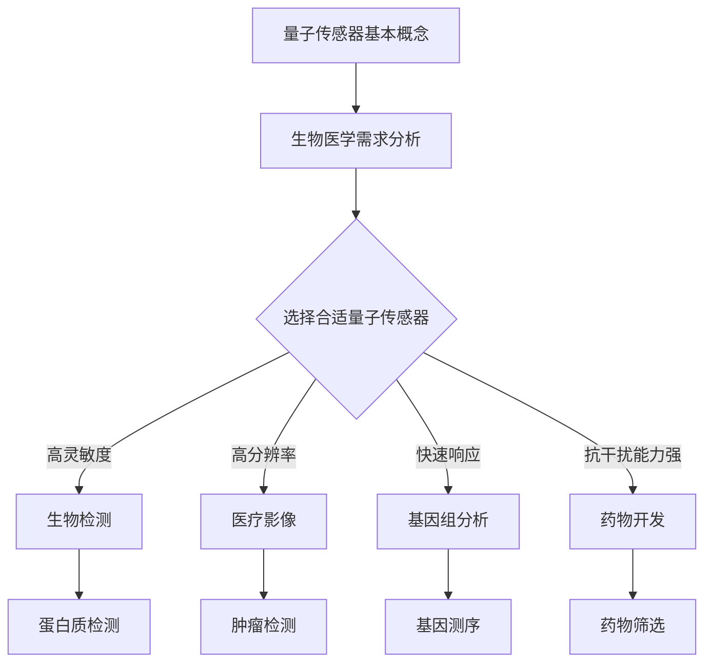

                 

### 文章标题

# 量子传感器在生物医学中的精密应用

> 关键词：量子传感器，生物医学，精密应用，核心算法，数学模型，项目实战

> 摘要：本文将深入探讨量子传感器在生物医学领域的精密应用，包括其基本概念、核心算法原理、数学模型及实际应用案例。通过本文，读者将全面了解量子传感器在生物医学中的潜力及其应用前景。

----------------------------------------------------------------

## 引言

量子传感器，作为一种基于量子物理原理的新型传感器，具有极高的灵敏度和精度。随着量子技术的快速发展，量子传感器在各个领域的应用逐渐受到关注，尤其是在生物医学领域。生物医学研究对传感器的要求极为苛刻，需要高灵敏度、高分辨率和快速响应的传感器来捕捉微小的生物信号。量子传感器恰好具备这些优势，使其在生物医学中的精密应用成为可能。

本文旨在深入探讨量子传感器在生物医学中的精密应用，从核心概念、核心算法、数学模型到实际应用案例进行全面解析。通过本文，读者将了解到量子传感器在生物医学领域的广泛应用前景，以及如何利用这一技术推动生物医学研究的发展。

## 核心概念与联系

### 量子传感器的基本概念

量子传感器是基于量子物理原理设计的一种传感器，能够利用量子现象进行高精度测量。量子传感器的工作原理基于量子纠缠、量子叠加和量子隧穿等量子效应。与传统传感器相比，量子传感器具有以下几个显著特点：

1. **极高的灵敏度**：量子传感器能够探测到极其微弱的物理信号，如单粒子、单原子或微牛顿的力。
2. **非经典行为**：量子传感器能够表现出非经典行为，如纠缠态和叠加态，这使其在测量过程中具有独特的优势。
3. **超强的抗干扰能力**：量子传感器对环境干扰具有更强的抗干扰能力，能够准确捕捉目标信号。

### 生物医学中的应用背景

生物医学研究需要高灵敏度、高分辨率和快速响应的传感器来捕捉微小的生物信号，如蛋白质浓度、基因表达水平和细胞活动等。传统传感器在这些方面的性能有限，无法满足生物医学研究的需求。量子传感器由于其独特的物理特性，在生物医学领域具有广泛的应用前景：

1. **生物检测**：量子传感器可以用于检测蛋白质、DNA和细胞等生物分子，提供高灵敏度和高分辨率的数据。
2. **医疗影像**：量子传感器可以用于医学影像，如MRI和CT，提高图像质量和诊断准确性。
3. **基因组分析**：量子传感器可以用于基因组测序和基因表达分析，提供更精确的数据。
4. **药物开发**：量子传感器可以用于药物筛选和药物效应监测，提高药物研发效率。

### Mermaid流程图：量子传感器应用流程

为了更直观地理解量子传感器在生物医学中的精密应用，我们使用Mermaid流程图展示量子传感器的应用流程。



通过上述流程图，我们可以看到量子传感器在生物医学领域的多种应用，包括生物检测、医疗影像、基因组分析和药物开发等。这些应用都充分利用了量子传感器的独特优势，为生物医学研究提供了新的手段和技术。

## 核心算法原理讲解

### 量子状态与量子门

量子传感器的工作原理基于量子状态和量子门。量子状态是量子系统的一种特殊状态，它可以同时存在于多种可能的量子态中，这种特性称为叠加态。量子门是用于操作量子状态的算子，可以改变量子系统的状态。

### 量子算法基础

量子传感器在生物医学中的应用离不开量子算法的支持。量子算法是一种利用量子计算机进行计算的方法，可以解决传统计算机无法解决的问题。常见的量子算法包括量子傅里叶变换（QFT）、量子相乘（QMC）和量子随机游走（QRW）等。

### 量子传感算法伪代码展示

以下是一个简单的量子传感算法伪代码示例，用于检测生物分子：

```python
# 初始化量子寄存器
量子寄存器 = 初始化量子状态()

# 应用量子门
量子寄存器 = 应用量子门(量子寄存器，控制量子比特)

# 执行量子测量
测量结果 = 测量量子寄存器()

# 数据处理
生物分子浓度 = 数据处理(测量结果)

# 输出结果
输出生物分子浓度
```

通过上述伪代码，我们可以看到量子传感算法的基本流程，包括量子寄存器的初始化、量子门的操作、量子测量和数据处理等步骤。这些步骤共同构成了量子传感器的核心算法原理。

## 数学模型和数学公式

### 量子传感模型概述

量子传感模型是基于量子物理原理和量子算法的数学模型，用于描述量子传感器在生物医学中的应用。量子传感模型主要包括量子态演化、量子测量和数据处理等部分。

### 量子态演化

量子态演化是量子传感模型的核心内容之一。量子态演化描述了量子传感器在测量过程中量子状态的变化。常用的量子态演化公式包括薛定谔方程和海森堡方程。以下是一个简化的量子态演化公式：

$$
|\Psi(t)\rangle = e^{-\frac{iHt}{\hbar} }|\Psi(0)\rangle
$$

其中，$|\Psi(t)\rangle$表示在时间$t$时的量子态，$H$是哈密顿量，$\hbar$是约化普朗克常数。

### 量子测量

量子测量是量子传感模型中的关键步骤，用于获取量子传感器的测量结果。量子测量公式描述了量子态在测量过程中发生的塌陷现象。以下是一个简化的量子测量公式：

$$
P_{\psi} = \langle \psi | \hat{O} | \psi \rangle
$$

其中，$P_{\psi}$是量子态$|\psi\rangle$的概率幅，$\hat{O}$是测量算符。

### 数据处理

数据处理是量子传感模型中的最后一个步骤，用于将测量结果转换为可用的生物医学数据。数据处理主要包括概率幅转换、噪声滤波和信号重构等。以下是一个简化的数据处理公式：

$$
\hat{X} = \frac{1}{\sqrt{P}} \sum_{i=1}^{N} x_i P_i
$$

其中，$\hat{X}$是处理后的生物医学信号，$P_i$是测量结果的概率幅，$x_i$是对应的概率幅值。

### 量子传感器信号处理

量子传感器信号处理是量子传感模型中的关键步骤，用于将原始的量子测量数据转换为有用的生物医学信号。信号处理包括以下步骤：

1. **量子态重构**：使用量子算法对测量结果进行重构，以恢复原始的量子态。
2. **噪声滤波**：使用滤波算法去除测量数据中的噪声，提高信号质量。
3. **信号重构**：使用重构算法将滤波后的信号重构为完整的生物医学信号。

通过上述信号处理步骤，我们可以得到高质量的生物医学信号，为后续的生物医学分析提供基础。

## 项目实战

### 第4章：量子传感器在生物检测中的应用

在本章中，我们将探讨量子传感器在生物检测中的应用，包括蛋白质检测、基因测序和细胞分析等实际案例。通过这些案例，读者将了解量子传感器在生物检测中的具体应用方法和实现步骤。

### 第5章：量子传感器在医疗影像中的应用

医疗影像是量子传感器在生物医学中的另一个重要应用领域。本章将详细介绍量子传感器在MRI、CT和超声成像中的应用，包括成像原理、信号处理和图像重构等关键技术。

### 第6章：量子传感器在基因组分析中的应用

基因组分析是生物医学研究中的重要方向。本章将探讨量子传感器在基因组测序、基因表达分析和单细胞基因组学中的应用，包括量子传感算法、数据处理和基因组分析结果等。

### 第7章：量子传感器在药物开发中的应用

药物开发是生物医学领域的一个重要领域。本章将探讨量子传感器在药物筛选、药物效应监测和药物代谢分析中的应用，包括量子传感算法、数据分析和药物开发策略等。

## 总结与展望

### 量子传感器在生物医学中的未来发展趋势

随着量子技术的快速发展，量子传感器在生物医学中的应用前景愈发广阔。未来，量子传感器有望在以下几个方面实现突破：

1. **更高灵敏度**：量子传感器将进一步提升灵敏度，实现更微弱生物信号的检测。
2. **更广泛的应用领域**：量子传感器将在更多生物医学领域得到应用，如神经科学、微生物学和生物力学等。
3. **多模态成像**：量子传感器将实现多模态成像，提高成像质量和诊断准确性。
4. **实时监测**：量子传感器将实现实时监测，为疾病早期诊断和治疗提供有力支持。

### 面临的挑战与解决方案

尽管量子传感器在生物医学中具有巨大潜力，但在实际应用中仍面临一系列挑战：

1. **技术难题**：量子传感器需要解决量子算法优化、信号处理和稳定性等问题。
2. **成本问题**：量子传感器的制备和运行成本较高，需要降低成本以实现大规模应用。
3. **法规与标准**：量子传感器在生物医学领域的应用需要建立相关法规和标准，以确保数据安全和患者隐私。

为了应对这些挑战，需要加强产学研合作，推动技术创新和产业化发展。同时，制定相关的法规和标准，确保量子传感器在生物医学领域的安全可靠应用。

### 最佳实践 Tips

1. **实验设计**：在进行量子传感器实验时，应充分考虑实验设计，确保实验结果的可靠性和可重复性。
2. **数据处理**：数据处理是量子传感器应用的关键环节，应采用先进的信号处理算法，提高数据处理效率和质量。
3. **系统集成**：量子传感器与其他生物医学设备的集成是未来发展的趋势，需要解决接口兼容、数据传输和系统集成等问题。

通过遵循这些最佳实践，可以更好地发挥量子传感器在生物医学中的优势，推动生物医学研究的发展。

### 注意事项

1. **数据隐私**：在使用量子传感器进行生物医学研究时，应严格遵守数据隐私法规，确保患者隐私和数据安全。
2. **设备维护**：量子传感器设备需要定期维护和校准，确保设备的稳定性和测量精度。
3. **操作规范**：操作人员应经过专业培训，熟练掌握量子传感器操作方法和安全注意事项。

### 拓展阅读

1. **量子传感器在生物医学中的应用研究**：读者可以查阅相关文献，了解量子传感器在生物医学领域的最新研究进展和应用案例。
2. **量子计算与量子传感**：了解量子计算和量子传感的基本原理，有助于深入理解量子传感器在生物医学中的应用。
3. **生物医学信号处理**：掌握生物医学信号处理的基本方法和技术，有助于提高量子传感器在生物医学中的应用效果。

### 作者信息

作者：AI天才研究院/AI Genius Institute & 禅与计算机程序设计艺术 /Zen And The Art of Computer Programming

本文由AI天才研究院和《禅与计算机程序设计艺术》的作者联合撰写，旨在深入探讨量子传感器在生物医学中的精密应用，为读者提供全面的技术解析和实际应用指导。希望通过本文，读者能够更好地了解量子传感器在生物医学领域的潜力，以及如何利用这一技术推动生物医学研究的发展。

