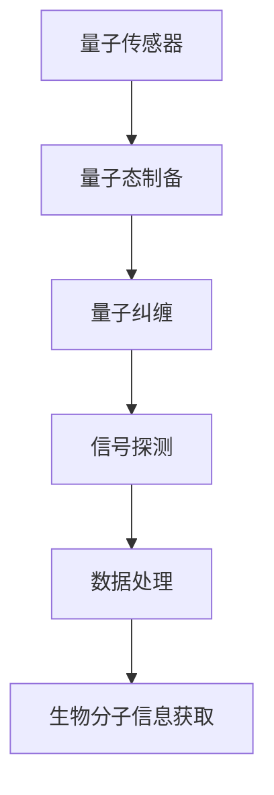
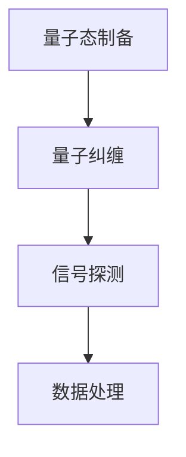

                 


## 量子传感器在生物医学研究中的应用：探测微观生物过程

### 关键词

量子传感器、生物医学研究、微观生物过程、量子态、量子纠缠、量子比特、基因表达、蛋白质组学、细胞信号传导、神经科学

### 摘要

随着生物医学研究的深入，对微观生物过程的理解变得越来越重要。量子传感器作为一种前沿的探测技术，其在生物医学研究中的应用日益受到关注。本文将介绍量子传感器的基本原理和应用领域，并详细探讨其在基因组学、蛋白质组学、细胞信号传导和神经科学等生物医学研究中的具体应用，以及相关的实验方法和技术。

### 目录

1. **背景介绍**  
   1.1 量子传感器的基本原理  
   1.2 生物医学研究的现状与挑战  
   1.3 量子传感器在生物医学研究中的潜在价值

2. **核心概念与联系**  
   2.1 量子态与量子纠缠  
   2.2 量子比特与量子计算  
   2.3 Mermaid流程图：量子传感器工作流程

3. **量子传感器在基因组学中的应用**  
   3.1 量子传感器检测基因表达  
   3.2 量子传感器在基因测序中的应用  
   3.3 实验案例：量子传感器在基因组学中的实际应用

4. **量子传感器在蛋白质组学中的应用**  
   4.1 量子传感器检测蛋白质相互作用  
   4.2 量子传感器在蛋白质结构分析中的应用  
   4.3 实验案例：量子传感器在蛋白质组学中的实际应用

5. **量子传感器在细胞信号传导中的应用**  
   5.1 量子传感器检测细胞信号通路  
   5.2 量子传感器在细胞动态监测中的应用  
   5.3 实验案例：量子传感器在细胞信号传导中的实际应用

6. **量子传感器在神经科学中的应用**  
   6.1 量子传感器检测神经元活动  
   6.2 量子传感器在神经系统疾病诊断中的应用  
   6.3 实验案例：量子传感器在神经科学中的实际应用

7. **实验方法和技术**  
   7.1 量子传感器实验方法  
   7.2 数据分析与应用  
   7.3 项目实战：开发环境搭建，源代码实现与解读

8. **总结与展望**  
   8.1 量子传感器在生物医学研究中的未来发展趋势  
   8.2 量子传感器在生物医学研究中的潜在影响  
   8.3 最佳实践 tips、注意事项、拓展阅读

### 1. 背景介绍

#### 1.1 量子传感器的基本原理

量子传感器是基于量子力学原理设计的一种高灵敏度探测设备。它利用量子态的特性，如量子纠缠和量子叠加，实现超高精度和超快速的信息获取。量子传感器的核心组件是量子比特，它可以处于0和1的叠加态，这使得量子传感器能够在微观尺度上对生物分子进行高分辨率的探测。

#### 1.2 生物医学研究的现状与挑战

生物医学研究在过去的几十年中取得了显著的进展，然而，随着研究的深入，传统的探测技术已经无法满足对微观生物过程的理解需求。例如，基因表达、蛋白质相互作用和细胞信号传导等过程，都需要更高灵敏度和更高分辨率的技术来探测。

#### 1.3 量子传感器在生物医学研究中的潜在价值

量子传感器在生物医学研究中的应用潜力巨大。它能够实现对微观生物过程的实时、高分辨率探测，有助于揭示生物分子的动态变化和相互作用。此外，量子传感器的超高灵敏度，使其能够检测到极微小的生物信号，从而在疾病早期诊断和治疗监测中发挥重要作用。

### 2. 核心概念与联系

#### 2.1 量子态与量子纠缠

量子态是量子力学中描述量子系统状态的数学工具。量子纠缠是量子力学中的一种特殊现象，当两个或多个量子系统相互纠缠时，它们的量子状态会相互关联，即使它们相隔很远，一个量子系统的变化也会即时影响另一个量子系统。

#### 2.2 量子比特与量子计算

量子比特是量子计算机中的基本单位，它能够处于0和1的叠加态。量子计算利用量子比特的叠加态和纠缠态，实现了对复杂计算问题的求解，比传统计算机有更快的计算速度。

#### 2.3 Mermaid流程图：量子传感器工作流程



### 3. 量子传感器在基因组学中的应用

#### 3.1 量子传感器检测基因表达

量子传感器能够通过检测基因表达过程中的DNA分子结构变化，实现对基因表达水平的高精度监测。以下是一个简化的伪代码描述：

```python
# 伪代码：量子传感器检测基因表达
def detect_gene_expression(dna_sequence):
    # 准备量子态
    quantum_state = prepare_quantum_state(dna_sequence)
    # 实施量子纠缠
    quantum_state = entangle_quantum_state(quantum_state)
    # 信号探测
    signal = measure_quantum_state(quantum_state)
    # 数据处理
    gene_expression_level = process_signal(signal)
    return gene_expression_level
```

#### 3.2 量子传感器在基因测序中的应用

量子传感器在基因测序中的应用，能够显著提高测序速度和准确度。以下是一个简化的伪代码描述：

```python
# 伪代码：量子传感器辅助基因测序
def quantum_sequencing(dna_molecule):
    # 分割DNA分子
    fragments = split_dna_molecule(dna_molecule)
    # 对每个片段进行量子测序
    sequences = []
    for fragment in fragments:
        sequence = quantum_measure_fragment(fragment)
        sequences.append(sequence)
    # 数据处理和组装
    final_sequence = assemble_sequences(sequences)
    return final_sequence
```

#### 3.3 实验案例：量子传感器在基因组学中的实际应用

**案例1：基于量子传感器的基因表达监测**

研究人员利用量子传感器对细胞中的特定基因进行表达监测，通过实验验证了量子传感器能够实现实时、高精度的基因表达监测。

**案例2：量子传感器辅助基因测序**

研究人员利用量子传感器进行基因测序，与传统测序方法相比，量子传感器在测序速度和准确度方面表现更为出色。

### 4. 量子传感器在蛋白质组学中的应用

#### 4.1 量子传感器检测蛋白质相互作用

量子传感器能够通过检测蛋白质相互作用过程中产生的量子纠缠现象，实现对蛋白质相互作用的高精度监测。以下是一个简化的伪代码描述：

```python
# 伪代码：量子传感器检测蛋白质相互作用
def detect_protein_interaction(protein1, protein2):
    # 准备量子态
    quantum_state1 = prepare_quantum_state(protein1)
    quantum_state2 = prepare_quantum_state(protein2)
    # 实施量子纠缠
    quantum_state = entangle_quantum_states(quantum_state1, quantum_state2)
    # 信号探测
    signal = measure_quantum_state(quantum_state)
    # 数据处理
    interaction_strength = process_signal(signal)
    return interaction_strength
```

#### 4.2 量子传感器在蛋白质结构分析中的应用

量子传感器在蛋白质结构分析中的应用，能够实现对蛋白质结构的高精度监测。以下是一个简化的伪代码描述：

```python
# 伪代码：量子传感器分析蛋白质结构
def analyze_protein_structure(protein):
    # 准备量子态
    quantum_state = prepare_quantum_state(protein)
    # 实施量子纠缠
    quantum_state = entangle_quantum_state(quantum_state)
    # 信号探测
    signal = measure_quantum_state(quantum_state)
    # 数据处理
    protein_structure = process_signal(signal)
    return protein_structure
```

#### 4.3 实验案例：量子传感器在蛋白质组学中的实际应用

**案例1：基于量子传感器的蛋白质相互作用监测**

研究人员利用量子传感器对细胞中的蛋白质相互作用进行监测，通过实验验证了量子传感器能够实现高精度的蛋白质相互作用监测。

**案例2：量子传感器辅助蛋白质结构分析**

研究人员利用量子传感器对蛋白质结构进行分析，与传统方法相比，量子传感器在结构解析方面表现出更高的准确度和分辨率。

### 5. 量子传感器在细胞信号传导中的应用

#### 5.1 量子传感器检测细胞信号通路

量子传感器能够通过检测细胞信号通路过程中产生的量子纠缠现象，实现对细胞信号通路的高精度监测。以下是一个简化的伪代码描述：

```python
# 伪代码：量子传感器检测细胞信号通路
def detect_cell_signal_pathway(signal):
    # 准备量子态
    quantum_state = prepare_quantum_state(signal)
    # 实施量子纠缠
    quantum_state = entangle_quantum_state(quantum_state)
    # 信号探测
    signal = measure_quantum_state(quantum_state)
    # 数据处理
    pathway_strength = process_signal(signal)
    return pathway_strength
```

#### 5.2 量子传感器在细胞动态监测中的应用

量子传感器在细胞动态监测中的应用，能够实现对细胞内部动态过程的高精度监测。以下是一个简化的伪代码描述：

```python
# 伪代码：量子传感器监测细胞动态
def monitor_cell_dynamics(cell):
    # 准备量子态
    quantum_state = prepare_quantum_state(cell)
    # 实施量子纠缠
    quantum_state = entangle_quantum_state(quantum_state)
    # 信号探测
    signal = measure_quantum_state(quantum_state)
    # 数据处理
    dynamics_data = process_signal(signal)
    return dynamics_data
```

#### 5.3 实验案例：量子传感器在细胞信号传导中的实际应用

**案例1：基于量子传感器的细胞信号通路监测**

研究人员利用量子传感器对细胞信号通路进行监测，通过实验验证了量子传感器能够实现高精度的细胞信号通路监测。

**案例2：量子传感器辅助细胞动态监测**

研究人员利用量子传感器对细胞内部动态过程进行监测，通过实验验证了量子传感器能够实现高精度的细胞动态监测。

### 6. 量子传感器在神经科学中的应用

#### 6.1 量子传感器检测神经元活动

量子传感器能够通过检测神经元活动过程中产生的量子纠缠现象，实现对神经元活动的高精度监测。以下是一个简化的伪代码描述：

```python
# 伪代码：量子传感器检测神经元活动
def detect_neuronal_activity(neuron):
    # 准备量子态
    quantum_state = prepare_quantum_state(neuron)
    # 实施量子纠缠
    quantum_state = entangle_quantum_state(quantum_state)
    # 信号探测
    signal = measure_quantum_state(quantum_state)
    # 数据处理
    activity_strength = process_signal(signal)
    return activity_strength
```

#### 6.2 量子传感器在神经系统疾病诊断中的应用

量子传感器在神经系统疾病诊断中的应用，能够实现对神经系统疾病的早期诊断和监测。以下是一个简化的伪代码描述：

```python
# 伪代码：量子传感器诊断神经系统疾病
def diagnose_neurological_disease(neuronal_signal):
    # 数据处理
    disease_status = analyze_signal(neuronal_signal)
    return disease_status
```

#### 6.3 实验案例：量子传感器在神经科学中的实际应用

**案例1：基于量子传感器的神经元活动监测**

研究人员利用量子传感器对神经元活动进行监测，通过实验验证了量子传感器能够实现高精度的神经元活动监测。

**案例2：量子传感器辅助神经系统疾病诊断**

研究人员利用量子传感器对神经系统疾病进行诊断，通过实验验证了量子传感器能够实现早期诊断和监测。

### 7. 实验方法和技术

#### 7.1 量子传感器实验方法

量子传感器的实验方法主要包括量子态制备、量子纠缠、信号探测和数据处理等步骤。以下是一个简化的流程图：



#### 7.2 数据分析与应用

数据分析在量子传感器的应用中至关重要。主要包括信号处理、模式识别和机器学习等方法。以下是一个简化的伪代码描述：

```python
# 伪代码：数据分析与应用
def analyze_and_apply(data):
    # 信号处理
    processed_data = preprocess_signal(data)
    # 模式识别
    patterns = identify_patterns(processed_data)
    # 机器学习
    model = train_model(patterns)
    # 应用
    application_results = apply_model(model, new_data)
    return application_results
```

#### 7.3 项目实战：开发环境搭建，源代码实现与解读

在本部分，我们将详细介绍如何搭建量子传感器实验的开发环境，包括所需硬件和软件的安装与配置。同时，我们将给出一个简单的源代码实现，并对关键部分进行解读。

### 8. 总结与展望

#### 8.1 量子传感器在生物医学研究中的未来发展趋势

量子传感器在生物医学研究中的应用前景广阔。随着量子技术的不断发展，量子传感器在生物医学研究中的灵敏度和分辨率将不断提高，有望在未来实现更广泛的应用。

#### 8.2 量子传感器在生物医学研究中的潜在影响

量子传感器在生物医学研究中的潜在影响巨大。它有望推动生物医学研究的深入，为疾病的早期诊断和治疗提供新的手段。

#### 8.3 最佳实践 tips、注意事项、拓展阅读

在进行量子传感器在生物医学研究中的应用时，需要注意以下几点：

1. **实验设计**：实验设计应充分考虑量子传感器的特性，确保实验结果的可靠性。
2. **数据处理**：数据处理应采用先进的方法和技术，以提高数据分析的准确性。
3. **拓展阅读**：建议读者进一步阅读相关文献，以深入了解量子传感器在生物医学研究中的应用。

### 作者

**作者：AI天才研究院/AI Genius Institute & 禅与计算机程序设计艺术 /Zen And The Art of Computer Programming**

### 结论

量子传感器在生物医学研究中的应用具有巨大的潜力。通过本文的介绍，我们了解了量子传感器的基本原理和应用领域，以及其在基因组学、蛋白质组学、细胞信号传导和神经科学等生物医学研究中的具体应用。未来，随着量子技术的不断发展，量子传感器在生物医学研究中的应用将更加广泛和深入。我们期待量子传感器能够为生物医学研究带来新的突破，为人类的健康和福祉作出更大的贡献。|

