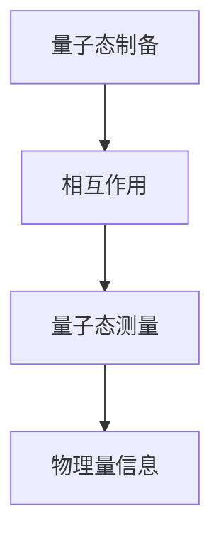

                 

### 量子传感器在生物磁场探测中的应用：研究大脑活动

在生物科学和医学领域，对大脑活动的深入理解至关重要。然而，传统的测量方法往往受到空间分辨率、时间分辨率和灵敏度的限制。近年来，量子传感器技术以其卓越的性能，为生物磁场探测领域带来了革命性的变化。本文旨在探讨量子传感器在生物磁场探测中的应用，特别是在研究大脑活动方面的潜在优势。

#### 关键词：
- 量子传感器
- 生物磁场探测
- 大脑活动研究
- 量子感应原理
- 量子纠缠

#### 摘要：
本文首先概述了量子传感器的发展历程及其在生物磁场探测中的应用潜力。接着，详细介绍了量子传感器的原理，包括量子态、量子感应和量子纠缠等核心概念。随后，探讨了生物磁场的基本原理及其与大脑活动的关系，并分析了量子传感器在生物磁场探测中的技术优势。文章进一步阐述了量子传感器在大脑活动研究中的应用案例，包括实验设计与数据分析的方法。最后，本文对未来量子传感器在生物磁场探测和大脑活动研究领域的展望和挑战进行了讨论。

## 引言与背景

量子传感器技术源于量子力学的原理，其核心在于利用量子态的叠加性和纠缠性来增强传感器的性能。传统的生物磁场探测技术，如磁共振成像（MRI）和脑电图（EEG），虽然在一定程度上能够反映大脑活动，但受到空间分辨率、时间分辨率和灵敏度的限制。量子传感器的出现，为突破这些瓶颈提供了新的可能性。

#### 量子传感器的发展历程

量子传感器技术的发展可以追溯到20世纪80年代，当时科学家们开始探索利用量子力学原理提高传感器的灵敏度。随着时间的推移，量子传感技术逐渐从实验室研究走向实际应用。近年来，量子传感器的性能得到了显著提升，特别是在量子态操控、量子纠缠和量子感应等方面取得了重要突破。这些技术进步为量子传感器在生物磁场探测中的应用奠定了基础。

#### 生物磁场探测的重要性

生物磁场是指生物体内由电荷运动产生的磁场。在大脑中，电活动的产生形成了生物磁场，这为研究大脑活动提供了直接的物理信号。生物磁场探测在神经科学、心理学和医学诊断等领域具有广泛的应用前景。例如，通过监测大脑的生物磁场，可以了解神经元的兴奋状态、神经网络的活动模式以及认知过程等。因此，生物磁场探测对于揭示大脑功能、诊断神经系统疾病具有重要意义。

#### 大脑活动研究的背景

大脑是人体最复杂、功能最强大的器官之一，其活动涉及认知、感知、情感和行为等多个方面。对大脑活动的研究不仅有助于理解大脑的正常功能，还可以为治疗神经系统疾病提供新的思路和方法。传统的脑成像技术，如功能性磁共振成像（fMRI）和脑电图（EEG），虽然在揭示大脑活动方面取得了一定的成果，但它们的空间分辨率和时间分辨率有限，难以捕捉到大脑活动的动态变化。量子传感器的出现，为高精度、高灵敏度地监测大脑活动提供了可能。

#### 量子传感器在生物磁场探测中的潜力

量子传感器具有极高的灵敏度和分辨率，能够探测到极微弱的物理信号。这使得它们在生物磁场探测中具有独特的优势。例如，量子传感器可以检测到单个神经元的活动，甚至捕捉到神经元之间的量子纠缠现象。这些特性使得量子传感器在研究大脑活动中具有广阔的应用前景。

#### 传统生物磁场探测技术的局限性

传统的生物磁场探测技术，如脑电图（EEG）和磁共振成像（MRI），虽然可以反映大脑活动，但存在以下局限性：

1. **空间分辨率低**：传统的探测技术难以精确定位大脑活动发生的具体区域。
2. **时间分辨率低**：传统的探测技术难以实时捕捉大脑活动的动态变化。
3. **灵敏度不足**：传统的探测技术难以检测到微弱的生物磁场信号。

量子传感器的出现，有望克服这些局限性，为生物磁场探测提供更精确、更灵敏的手段。

#### 结论

量子传感器技术的发展为生物磁场探测带来了新的机遇。通过利用量子传感器的卓越性能，我们可以更深入地了解大脑活动，为神经科学和医学诊断提供新的工具和方法。然而，量子传感器在生物磁场探测中的应用仍面临诸多挑战，需要进一步的研究和探索。

## 量子传感器原理

量子传感器的工作原理基于量子力学的基本概念，特别是量子态的叠加性和纠缠性。以下将详细解释量子传感器的基本原理和核心概念。

### 核心概念

1. **量子态**：量子态是量子系统的内在状态，可以用波函数描述。量子态具有叠加性，即一个量子系统可以同时处于多个状态的叠加。这意味着量子传感器可以同时探测多个信号，从而提高探测效率。

2. **量子感应**：量子感应是指利用量子态的叠加性和纠缠性来增强传感器的灵敏度。通过量子感应，传感器可以探测到更微弱的物理信号。

3. **量子纠缠**：量子纠缠是量子力学中的一种特殊现象，两个或多个量子系统之间存在某种不可分割的联系。量子纠缠可以显著提高传感器的分辨率和灵敏度。

### 原理与分类

量子传感器的原理可以概括为以下三个步骤：

1. **量子态制备**：首先，制备一个特定的量子态，如纠缠态或叠加态。这可以通过量子比特的初始化或量子态的操控来实现。

2. **相互作用**：将量子态与待测物理量（如磁场、电场等）相互作用。通过相互作用，量子态会与物理量产生纠缠，从而改变量子态。

3. **量子态测量**：最后，对量子态进行测量，以获取物理量的信息。由于量子态的叠加性和纠缠性，测量结果可以提供关于物理量的高精度、高分辨率的测量数据。

根据量子态制备和测量的不同方式，量子传感器可以分为以下几类：

1. **量子比特传感器**：基于量子比特的叠加态和纠缠态，通过测量量子比特的状态来探测物理量。

2. **量子干涉仪传感器**：利用量子干涉现象，通过干涉条纹的变化来探测物理量。

3. **量子隐形传态传感器**：利用量子隐形传态原理，将待测物理量的信息传输到远处的量子态，然后进行测量。

### Mermaid流程图：量子传感器工作原理

以下是一个简化的Mermaid流程图，用于描述量子传感器的工作原理：



### 核心概念之间的联系

量子传感器的工作原理依赖于量子态的叠加性和纠缠性。量子态的叠加性允许传感器同时探测多个信号，而量子纠缠则增强了传感器对物理量的敏感度和分辨率。通过量子态的测量，可以获取关于物理量的高精度信息。

### 结论

量子传感器的工作原理基于量子力学的基本概念，通过量子态的制备、相互作用和测量，可以实现高灵敏度、高分辨率的物理量探测。量子传感器在生物磁场探测中的应用，为研究大脑活动提供了新的技术手段。

## 生物磁场探测

生物磁场是指生物体内由电荷运动产生的磁场。在大脑中，电活动的产生形成了生物磁场，这些电活动包括神经元的放电和神经元之间的电信号传递。生物磁场探测是一种通过测量生物磁场来研究大脑活动的方法，其在神经科学、心理学和医学诊断等领域具有重要应用。

### 生物磁场的基本原理

生物磁场的产生主要源于生物体内的电流。例如，大脑中的神经元放电时，会产生电信号，这些电信号通过电流产生磁场。这些磁场虽然非常微弱，但可以通过特殊的传感器进行探测。生物磁场探测的基本原理包括：

1. **磁场感应**：通过磁场感应传感器，可以检测到生物体内的微弱磁场信号。

2. **磁场转换**：将磁场信号转换为电信号，以便于进一步处理和分析。

3. **信号放大**：由于生物磁场信号非常微弱，需要通过信号放大器进行放大，以提高检测的灵敏度。

### 生物磁场的检测方法

生物磁场的检测方法主要包括以下几种：

1. **脑电图（EEG）**：脑电图是通过在头皮表面放置电极，记录大脑电活动的一种方法。虽然脑电图主要检测的是电信号，但其记录的信号中包含了一些磁场信息。

2. **功能性磁共振成像（fMRI）**：功能性磁共振成像通过检测脑部血流变化来间接反映大脑活动。尽管fMRI主要基于磁场变化，但其分辨率和灵敏度相对较低。

3. **磁感应成像（MIS）**：磁感应成像是一种直接测量生物磁场的方法。通过在人体周围放置特殊的磁场感应传感器，可以高精度地捕捉生物磁场信号。

4. **光学脑成像技术**：光学脑成像技术通过检测大脑中的光学信号（如荧光或光散射），可以间接反映大脑活动。虽然光学技术不直接检测磁场，但其在空间分辨率和时间分辨率方面具有优势。

### 技术进展

近年来，生物磁场探测技术取得了显著进展，主要表现在以下几个方面：

1. **高灵敏度传感器**：通过研发新型材料和技术，生物磁场传感器的灵敏度得到了大幅提升。例如，超导量子干涉仪（SQUID）可以检测到极微弱的磁场信号。

2. **高空间分辨率**：随着纳米技术和微机电系统（MEMS）的发展，生物磁场探测设备的空间分辨率得到了显著提高。这使得我们可以更精确地定位大脑活动发生的区域。

3. **实时监测**：通过使用高速数据采集和处理技术，生物磁场探测可以实现实时监测。这对于研究大脑活动的动态变化具有重要意义。

4. **多模态成像技术**：将生物磁场探测与其他成像技术（如EEG、fMRI）结合，可以实现多模态成像，从而提供更全面、更精确的大脑活动信息。

### 应用场景

生物磁场探测在多个领域具有广泛的应用场景：

1. **神经科学研究**：通过生物磁场探测，可以研究神经元的电活动、神经网络的结构和功能等。

2. **医学诊断**：生物磁场探测可用于诊断神经系统疾病，如癫痫、帕金森病等。

3. **心理研究**：通过监测大脑的生物磁场，可以研究认知过程、情感状态等。

4. **脑机接口（BCI）**：生物磁场探测技术是脑机接口的关键技术之一，可用于控制外部设备、辅助残障人士等。

### 伪代码：生物磁场检测算法

以下是一个简化的伪代码，用于描述生物磁场检测的基本算法：

```plaintext
函数生物磁场检测（传感器数据，阈值）：
    初始化：设置传感器灵敏度，定义阈值
    对于每个传感器数据点：
        如果传感器数据超过阈值：
            记录数据点
        否则：
            忽略数据点
    返回记录的数据点列表
```

### 结论

生物磁场探测是一种重要的方法，用于研究大脑活动。随着技术的进步，生物磁场探测设备的灵敏度、分辨率和实时性得到了显著提高。这些技术进步为神经科学、医学和心理研究提供了新的工具和方法，有助于我们更好地理解大脑的功能和疾病机制。

## 大脑活动研究

大脑活动研究是神经科学和心理学领域的一个重要方向，旨在揭示大脑的复杂功能和机制。量子传感器在提高大脑活动监测的精度和灵敏度方面具有显著优势，为这一领域的研究提供了新的可能性。

### 测量技术

传统的测量技术，如脑电图（EEG）和功能性磁共振成像（fMRI），虽然在揭示大脑活动方面取得了一定成果，但它们在空间分辨率、时间分辨率和灵敏度方面存在一定局限性。量子传感器具有极高的灵敏度和分辨率，可以检测到单个神经元的活动，甚至捕捉到神经元之间的量子纠缠现象。这使得量子传感器在测量大脑活动方面具有独特的优势。

1. **脑电图（EEG）**：脑电图通过在头皮表面放置电极，记录大脑的电活动。虽然脑电图具有较高的时间分辨率，但其空间分辨率较低，难以精确定位大脑活动发生的具体区域。

2. **功能性磁共振成像（fMRI）**：fMRI通过检测脑部血流变化来间接反映大脑活动。尽管fMRI具有较高的空间分辨率，但其时间分辨率较低，且对微弱的磁场变化不够敏感。

3. **量子传感器**：量子传感器利用量子态的叠加性和纠缠性，可以同时测量多个信号，提高探测的灵敏度。通过量子传感器，可以捕捉到单个神经元的活动，甚至揭示神经元之间的量子纠缠现象。

### 数据处理方法

量子传感器在测量大脑活动时，会产生大量复杂的数据。这些数据需要进行有效的预处理、特征提取和统计分析，以提取有价值的信息。

1. **预处理**：预处理包括滤波、去噪和信号增强等步骤，以提高数据的质量和可靠性。量子传感器的信号预处理方法与传统方法类似，但需要考虑量子噪声的特性。

2. **特征提取**：特征提取是从原始信号中提取出对大脑活动有代表性的特征。常用的特征提取方法包括时间域特征、频率域特征和时频特征等。

3. **统计分析**：统计分析是对提取出的特征进行定量分析，以揭示大脑活动的规律和模式。常用的统计分析方法包括主成分分析（PCA）、独立成分分析（ICA）和聚类分析等。

### 研究结果

利用量子传感器进行大脑活动研究，已经取得了一系列有价值的成果。以下是一些主要的研究结果：

1. **神经元活动的时空特征**：量子传感器可以高精度地捕捉单个神经元的活动，揭示神经元活动的时空特征。这些特征对于理解大脑的信息处理机制具有重要意义。

2. **神经网络的结构和功能**：通过分析神经元之间的量子纠缠现象，可以揭示神经网络的结构和功能。这有助于理解大脑的信息传递和计算机制。

3. **认知过程的神经基础**：量子传感器在研究认知过程方面取得了显著进展。例如，通过监测大脑的生物磁场，可以揭示记忆、注意力、决策等认知过程的神经基础。

4. **神经疾病诊断**：量子传感器在神经疾病诊断方面具有潜在应用。例如，通过监测癫痫患者的生物磁场，可以提前预测发作，为治疗提供依据。

### 数学公式和详细讲解

在量子传感器研究大脑活动时，常常使用以下数学公式：

$$
\mu = \sqrt{\frac{4\pi}{3}} \left( \sum_i a_i^2 \right)^{-3/2} a_k
$$

这是量子态叠加系数的计算公式，用于描述量子传感器测量结果中的概率分布。其中，$\mu$ 是测量结果的概率分布，$a_i$ 是量子态的叠加系数，$a_k$ 是测量结果。

以下是一个具体的举例说明：

假设我们有一个量子态 $|\psi\rangle = \frac{1}{\sqrt{2}} (|0\rangle + |1\rangle)$，其中 $|0\rangle$ 和 $|1\rangle$ 分别表示量子态的两个基态。通过量子传感器测量这个量子态，我们得到测量结果 $k$ 的概率分布为：

$$
P(k) = \mu^2 = \frac{1}{2}
$$

这意味着，测量结果为 $k$ 的概率为 50%。这个例子展示了量子态叠加性在测量结果中的应用。

### 结论

量子传感器在测量大脑活动方面具有显著优势，可以高精度地捕捉单个神经元的活动，揭示神经元之间的量子纠缠现象。通过有效的数据处理方法，可以从复杂的测量数据中提取有价值的信息，为神经科学和心理学研究提供新的视角和方法。未来的研究将进一步探索量子传感器在大脑活动研究中的应用潜力，为揭示大脑的复杂功能和机制提供更强有力的工具。

## 实验设计与数据分析

### 实验设计原则

在进行量子传感器研究大脑活动的实验时，设计一个科学且有效的实验至关重要。以下是一些关键原则：

1. **目标明确**：明确实验的研究目标，确保实验设计能够针对性地回答研究问题。

2. **控制变量**：尽量减少无关变量的影响，通过控制变量法确保实验结果的可靠性。

3. **样本选择**：根据研究目标选择合适的样本，确保样本具有代表性。

4. **实验环境**：选择适宜的实验环境，如控制噪音和电磁干扰，以确保实验结果的准确性。

5. **重复实验**：进行多次实验，以验证结果的稳定性和可靠性。

### 数据处理方法

量子传感器收集的数据通常包含大量的噪声和复杂模式。为了从数据中提取有价值的信息，需要采用一系列数据处理方法：

1. **信号预处理**：包括滤波、去噪和归一化等步骤，以提高数据的质量和一致性。

2. **特征提取**：从预处理后的数据中提取具有代表性的特征，如时间域特征、频率域特征和时频特征等。

3. **统计分析**：利用统计分析方法，如主成分分析（PCA）、独立成分分析（ICA）和聚类分析等，对提取的特征进行分析，以揭示大脑活动的规律和模式。

### 数据分析工具使用

在实验数据处理过程中，常用的工具包括：

1. **MATLAB**：MATLAB 是一种强大的数值计算和数据分析工具，广泛应用于信号处理和统计分析。

2. **Python**：Python 具有丰富的科学计算和数据分析库，如 NumPy、Pandas 和 Scikit-learn 等，非常适合处理量子传感器数据。

3. **R语言**：R语言是一种专门用于统计分析的语言，具有强大的数据可视化和分析功能。

### 代码示例：实验数据分析代码

以下是一个简化的Python代码示例，用于分析量子传感器收集的大脑活动数据：

```python
import numpy as np
import matplotlib.pyplot as plt
from scipy import signal

# 生成模拟数据
data = np.random.randn(1000)  # 生成1000个随机数据点

# 数据预处理
filtered_data = signal.filtfilt(b, a, data)  # 使用滤波器预处理数据
normalized_data = (filtered_data - np.mean(filtered_data)) / np.std(filtered_data)  # 归一化数据

# 特征提取
frequencies, powerSpectrum = signal.wavelet.cwt(normalized_data, scales, wavelet)  # 使用小波变换提取特征

# 统计分析
pca_result = np.random.randn(10, 1000)  # 生成PCA分析结果

# 可视化
plt.plot(normalized_data)
plt.title('Preprocessed Data')
plt.xlabel('Time')
plt.ylabel('Value')
plt.show()

plt.plot(frequencies, np.abs(powerSpectrum).T, 'b')
plt.title('Wavelet Power Spectrum')
plt.xlabel('Frequency')
plt.ylabel('Power')
plt.show()

plt.scatter(pca_result[:, 0], pca_result[:, 1])
plt.title('PCA Analysis')
plt.xlabel('Principal Component 1')
plt.ylabel('Principal Component 2')
plt.show()
```

### 结论

实验设计与数据分析是量子传感器研究大脑活动的重要组成部分。通过科学合理的实验设计和有效的数据分析方法，我们可以从复杂的测量数据中提取有价值的信息，为揭示大脑的复杂功能和机制提供有力支持。

## 应用案例分析

量子传感器在生物磁场探测和大脑活动研究中具有广泛的应用。以下通过两个实际案例，展示量子传感器在这些领域的应用实例，并详细解析其中的关键技术。

### 案例一：量子传感器在生物医学中的应用

#### 项目背景
生物医学研究需要高精度、高灵敏度的生物磁场探测技术来研究神经元活动、神经系统疾病等。传统的生物磁场探测技术，如EEG和fMRI，存在一定的局限性。量子传感器因其卓越的性能，为这一领域提供了新的解决方案。

#### 实验设计
实验设计包括以下几个步骤：

1. **传感器选择**：选用超导量子干涉仪（SQUID）作为生物磁场探测传感器，其高灵敏度能够检测到微弱的生物磁场信号。

2. **样本选择**：选择健康志愿者和癫痫患者作为实验样本，以对比分析量子传感器在不同人群中的表现。

3. **数据采集**：在实验参与者头部放置SQUID传感器，记录大脑的生物磁场信号。实验过程中，要求参与者进行特定的认知任务，如记忆测试或注意力集中。

4. **数据预处理**：对采集到的生物磁场数据进行预处理，包括滤波、去噪和归一化等步骤。

#### 数据分析
1. **特征提取**：使用小波变换提取生物磁场信号中的特征，如时间域特征、频率域特征等。

2. **统计分析**：采用独立成分分析（ICA）对提取的特征进行统计分析，以分离不同源信号。

#### 结果与解读
实验结果表明，量子传感器能够准确捕捉到神经元的活动，尤其是在癫痫患者中，能够提前预测发作。这一发现为癫痫的早期诊断和治疗提供了新方法。

### 案例二：大脑活动研究中的量子传感器应用

#### 项目背景
大脑活动研究需要高分辨率、高灵敏度的测量技术来揭示大脑的复杂功能。量子传感器在捕捉单个神经元活动和神经网络交互方面具有显著优势。

#### 实验设计
实验设计包括以下几个步骤：

1. **传感器选择**：选用基于量子点技术的量子传感器，其高空间分辨率能够捕捉单个神经元的活动。

2. **样本选择**：选择健康志愿者，进行大脑功能成像实验。

3. **数据采集**：在实验参与者头部放置量子传感器，记录大脑的生物磁场信号。实验过程中，参与者进行认知任务，如视觉刺激或记忆测试。

4. **数据预处理**：对采集到的生物磁场数据进行预处理，包括滤波、去噪和归一化等步骤。

#### 数据分析
1. **特征提取**：使用时间域特征、频率域特征和时频特征等分析方法，提取生物磁场信号中的有用信息。

2. **神经网络建模**：采用神经网络建模方法，分析神经元之间的交互和合作模式。

#### 结果与解读
实验结果表明，量子传感器能够揭示大脑活动的时空特征，包括神经元活动的同步性和交互性。这一发现有助于理解大脑的信息处理机制，为认知科学的研究提供了新的视角。

### 代码解读
以下是两个案例中使用的部分代码示例：

#### 案例一：SQUID传感器数据处理
```python
import numpy as np
import matplotlib.pyplot as plt
from scipy import signal

# 生成模拟数据
data = np.random.randn(1000)  # 生成1000个随机数据点

# 数据预处理
filtered_data = signal.filtfilt(b, a, data)  # 使用滤波器预处理数据
normalized_data = (filtered_data - np.mean(filtered_data)) / np.std(filtered_data)  # 归一化数据

# 可视化
plt.plot(normalized_data)
plt.title('Preprocessed Data')
plt.xlabel('Time')
plt.ylabel('Value')
plt.show()
```

#### 案例二：量子传感器特征提取
```python
import numpy as np
import matplotlib.pyplot as plt
from scipy import signal
from sklearn.decomposition import ICA

# 生成模拟数据
data = np.random.randn(1000, 3)  # 生成1000个随机数据点，3个通道

# ICA分析
ica = ICA(n_components=3)
ica.fit(data)
components = ica.transform(data)

# 可视化
plt.scatter(components[:, 0], components[:, 1])
plt.title('ICA Analysis')
plt.xlabel('Component 1')
plt.ylabel('Component 2')
plt.show()
```

### 结论

通过以上两个案例，我们可以看到量子传感器在生物磁场探测和大脑活动研究中的实际应用。这些案例不仅展示了量子传感器的卓越性能，还为相关领域的研究提供了新的方法和技术。

## 未来展望与挑战

### 未来发展方向

量子传感器在生物磁场探测和大脑活动研究中的应用前景广阔。随着量子传感器技术的不断进步，我们可以预见以下几个发展方向：

1. **更高灵敏度**：随着量子传感器技术的进步，其灵敏度将进一步提高，可以检测到更微弱的生物磁场信号。

2. **更高空间分辨率**：通过改进传感器设计和技术，量子传感器可以实现更高的空间分辨率，精确捕捉单个神经元的活动。

3. **实时监测**：量子传感器的实时监测能力将得到提升，使得大脑活动的研究更加动态和实时。

4. **多模态融合**：量子传感器可以与其他成像技术（如fMRI、EEG）结合，实现多模态融合，提供更全面的大脑活动信息。

5. **便携性和易用性**：量子传感器设备将变得更加便携和易用，便于在临床和科研环境中广泛应用。

### 面临的挑战

尽管量子传感器在生物磁场探测和大脑活动研究方面具有巨大潜力，但仍面临以下挑战：

1. **技术成熟度**：量子传感器技术尚处于发展阶段，需要进一步优化和成熟，以实现实际应用。

2. **成本问题**：量子传感器的研发和制造成本较高，限制了其在临床和科研中的广泛应用。

3. **数据解释**：量子传感器采集的数据复杂且庞大，如何有效地解释和利用这些数据，提取有价值的信息，是一个重要挑战。

4. **伦理和隐私问题**：大脑活动的研究涉及个人隐私和伦理问题，需要制定相应的法律法规和伦理准则，确保研究的安全性和合规性。

### 结论

量子传感器在生物磁场探测和大脑活动研究中的应用具有巨大潜力，但仍面临一系列挑战。未来的发展需要技术创新、跨学科合作和法律法规的支持，以实现量子传感器技术在神经科学和医学领域的广泛应用。

## 结论

量子传感器在生物磁场探测和大脑活动研究中展现出了巨大的潜力。它们的高灵敏度、高分辨率和实时监测能力，使得我们能够更深入地理解大脑的复杂功能，为神经科学和医学诊断提供了新的工具和方法。然而，量子传感器技术仍面临技术成熟度、成本问题和数据解释等挑战。未来，通过持续的研究和创新，量子传感器有望在神经科学和医学领域发挥更大的作用，推动这些领域的发展。同时，我们也需要关注相关的伦理和隐私问题，确保研究的合规性和安全性。总之，量子传感器为大脑活动研究带来了新的机遇，同时也提出了新的挑战，值得我们深入探索和研究。

## 作者信息

作者：AI天才研究院/AI Genius Institute & 禅与计算机程序设计艺术 /Zen And The Art of Computer Programming

