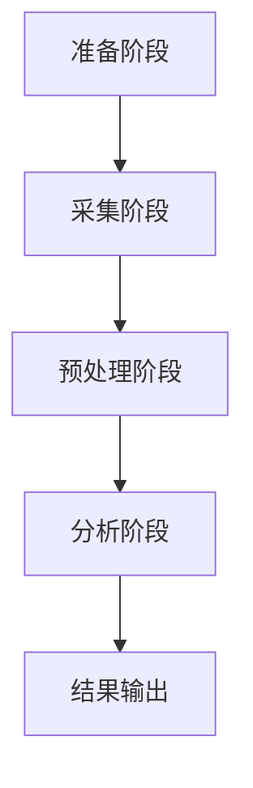

                 

# 量子传感器在生物磁场检测中的精密应用

## 关键词
- 量子传感器
- 生物磁场检测
- 生物医学
- 机器学习
- 算法优化
- 数学模型

## 摘要
本文旨在探讨量子传感器在生物磁场检测领域的应用。首先，我们将介绍量子传感器的基本原理和生物磁场检测的概念。接着，通过构建核心概念与联系的关系架构图，详细讲解量子传感器检测算法和数据处理模型。文章还将使用伪代码和LaTeX公式阐述核心算法原理和数学模型，并通过具体项目实战案例，展示量子传感器在生物磁场检测中的实际应用。最后，我们将总结文章的主要内容，并展望未来发展趋势。

## 引言

### 量子传感器概述
量子传感器是利用量子效应进行测量的设备，其测量精度远远超过传统传感器。量子传感器的工作原理基于量子叠加态和纠缠态，可以实现对极微弱信号的检测。根据探测机制的不同，量子传感器可以分为基于量子态测量的传感器、量子干涉传感器和量子态滤波传感器等类型。

### 生物磁场检测概述
生物磁场检测是指通过测量生物体产生的磁场信号，来研究生物体的生理活动和疾病状态。生物磁场检测在生物医学领域具有重要应用，如脑电图（EEG）、心磁图（MCG）和地磁图（MEG）等。传统的生物磁场检测方法主要依赖于超导量子干涉器（SQUID）等高灵敏度传感器，但这些方法存在一定的局限性，如高成本、复杂性和对环境的依赖性。

### 量子传感器在生物磁场检测中的应用
量子传感器在生物磁场检测中具有独特的优势，其高灵敏度、低噪声特性和快速响应能力使其成为生物磁场检测的理想选择。通过结合机器学习和深度学习算法，可以进一步提高生物磁场检测的精度和可靠性。本文将详细介绍量子传感器在生物磁场检测中的应用，包括检测算法、数据处理模型和项目实战。

### 本书结构安排
本文将分为八个章节。第一章介绍量子传感器和生物磁场检测的基本概念。第二章详细讲解量子传感器的原理和分类。第三章阐述生物磁场检测的原理和方法。第四章和第五章分别讲解量子传感器检测算法和生物磁场数据分析模型。第六章和第七章展示量子传感器在生物磁场检测中的项目实战。最后，第八章总结文章的主要内容，并探讨未来发展趋势。

## 量子传感器原理

### 量子传感器的基本概念
量子传感器是基于量子力学原理设计的传感器，其测量精度可以超越经典传感器的限制。量子传感器的核心是利用量子态进行测量，如量子叠加态和纠缠态。量子传感器可以测量极其微小的物理量，如位移、磁场、电场和温度等。

### 量子传感器的分类
量子传感器根据探测机制和测量对象的不同，可以分为以下几类：

1. **基于量子态测量的传感器**：利用量子态的超灵敏特性进行测量，如量子纠缠态测量、量子态滤波传感器等。
2. **量子干涉传感器**：利用量子干涉原理进行高精度测量，如量子干涉仪、量子盘传感器等。
3. **量子态滤波传感器**：利用量子态的滤波特性，对噪声进行抑制，提高测量精度，如量子滤波器、量子随机游走传感器等。

### 量子传感器的工作原理
量子传感器的工作原理主要基于以下量子效应：

1. **量子叠加态**：量子物体可以同时处于多个状态的叠加，通过适当操作，可以将其状态叠加转化为高灵敏度测量。
2. **量子纠缠态**：两个或多个量子系统之间存在的一种特殊关联，通过纠缠态可以实现对远距离量子态的测量。
3. **量子态滤波**：通过量子态滤波，可以抑制环境噪声，提高测量精度。

## 生物磁场检测原理

### 生物磁场概述
生物磁场是指生物体内部产生的磁场，包括脑磁场、心磁场和地磁场等。生物磁场与生物体的生理活动和病理状态密切相关。例如，脑电图（EEG）记录的是大脑神经元活动产生的电场，而心磁图（MCG）记录的是心脏活动产生的磁场。

### 生物磁场检测方法
生物磁场检测主要依赖于高灵敏度传感器，如超导量子干涉器（SQUID）和磁阻传感器。检测方法包括：

1. **脑电图（EEG）**：通过测量大脑皮层神经元活动的电场，研究大脑的功能和活动。
2. **心磁图（MCG）**：通过测量心脏活动产生的磁场，研究心脏的生理和病理状态。
3. **地磁图（MEG）**：通过测量地球磁场的变化，研究生物体对环境磁场的响应。

### 生物磁场检测的挑战
生物磁场检测面临以下挑战：

1. **灵敏度要求**：生物磁场信号极其微弱，需要高灵敏度传感器进行检测。
2. **噪声干扰**：生物磁场检测过程中，环境噪声和生物体自身的生理噪声会影响检测精度。
3. **数据处理**：生物磁场数据量大且复杂，需要高效的算法进行数据处理和分析。

## 量子传感器的检测算法

### 量子传感器检测算法概述
量子传感器在生物磁场检测中的核心作用是通过其高灵敏度和低噪声特性，实现对生物磁场信号的精确测量。量子传感器检测算法主要包括信号采集、预处理和信号处理三个阶段。

### 量子传感器检测算法的优化
为了提高量子传感器在生物磁场检测中的性能，需要对其检测算法进行优化。以下是一些常见的优化方法：

1. **信号采集优化**：通过优化传感器布局和信号采集方式，提高信号采集的准确性和可靠性。
2. **预处理算法优化**：通过滤波和去噪算法，减少环境噪声和生理噪声对信号的影响。
3. **信号处理算法优化**：通过特征提取和模式识别算法，提高生物磁场信号的识别精度。

### 量子传感器检测算法的应用案例
以下是几个量子传感器在生物磁场检测中的实际应用案例：

1. **脑电图（EEG）**：利用量子传感器的高灵敏度，可以实现对脑电图信号的精确测量，有助于研究大脑的功能和疾病诊断。
2. **心磁图（MCG）**：量子传感器可以检测到心脏产生的微小磁场信号，有助于心脏疾病的早期诊断和治疗。
3. **地磁图（MEG）**：量子传感器在测量地球磁场变化时，可以更精确地捕捉到生物体对环境磁场的响应。

## 生物磁场数据分析模型

### 生物磁场数据分析方法
生物磁场数据分析方法主要包括信号预处理、特征提取和模式识别三个阶段。

1. **信号预处理**：包括滤波、去噪和归一化等操作，以提高信号的质量和可分析性。
2. **特征提取**：从预处理后的信号中提取有意义的特征，如频率特征、时间特征和空间特征等。
3. **模式识别**：利用机器学习算法对提取的特征进行分类和识别，以实现对生物磁场信号的准确分析和解读。

### 生物磁场数据分析模型的构建
生物磁场数据分析模型的构建主要包括以下步骤：

1. **数据收集和预处理**：收集生物磁场数据，并进行预处理，包括滤波、去噪和归一化等操作。
2. **特征提取**：根据研究目的，从预处理后的信号中提取有意义的特征。
3. **模型训练和验证**：利用机器学习算法训练模型，并对模型进行验证和优化。
4. **模型应用**：将训练好的模型应用于新的生物磁场数据，进行信号分析和解读。

### 生物磁场数据分析模型的应用案例
以下是几个生物磁场数据分析模型的应用案例：

1. **脑电图（EEG）**：通过分析脑电图信号，可以研究大脑的功能和活动，有助于诊断和评估神经系统疾病。
2. **心磁图（MCG）**：通过分析心磁图信号，可以研究心脏的生理和病理状态，有助于心脏疾病的早期诊断和治疗。
3. **地磁图（MEG）**：通过分析地磁图信号，可以研究生物体对环境磁场的响应，有助于理解生物体与环境之间的相互作用。

## 数学模型和数学公式讲解

### 量子传感器的数学模型
量子传感器的数学模型主要基于量子力学原理，包括量子态的叠加、纠缠和测量不确定性原理等。以下是几个常见的数学模型：

1. **量子态叠加**：$$|\psi\rangle = c_0|0\rangle + c_1|1\rangle$$
   其中，$|0\rangle$ 和 $|1\rangle$ 分别表示基态和激发态，$c_0$ 和 $c_1$ 是叠加系数。
2. **量子纠缠**：$$|\psi\rangle = \frac{1}{\sqrt{2}} (|00\rangle + |11\rangle)$$
   其中，$|00\rangle$ 和 $|11\rangle$ 分别表示两个量子系统的纠缠态。
3. **测量不确定性原理**：$$\Delta x \Delta p \geq \frac{\hbar}{2}$$
   其中，$\Delta x$ 和 $\Delta p$ 分别表示位置和动量的不确定度，$\hbar$ 是普朗克常数。

### 生物磁场数据分析模型
生物磁场数据分析模型主要基于信号处理和机器学习算法。以下是几个常见的数学模型：

1. **傅里叶变换**：$$X(f) = \int_{-\infty}^{\infty} x(t) e^{-j2\pi ft} dt$$
   其中，$X(f)$ 是频域信号，$x(t)$ 是时域信号，$f$ 是频率。
2. **小波变换**：$$C_a^j(\psi) = \int_{-\infty}^{\infty} x(t) \psi^*(t/a)^j dt$$
   其中，$C_a^j(\psi)$ 是小波变换系数，$x(t)$ 是时域信号，$\psi$ 是小波函数，$a$ 和 $j$ 分别表示尺度和平移。

### 数学模型和公式的详细讲解与举例说明
以下是几个数学模型和公式的详细讲解与举例说明：

1. **量子态叠加**：
   假设一个量子比特处于基态 $|0\rangle$ 和激发态 $|1\rangle$ 的叠加状态，其波函数为：
   $$|\psi\rangle = \frac{1}{\sqrt{2}} (|0\rangle + |1\rangle)$$
   通过量子测量，可以确定量子比特的状态为基态或激发态，概率分别为 $1/2$。

2. **量子纠缠**：
   假设两个量子比特处于纠缠态，其波函数为：
   $$|\psi\rangle = \frac{1}{\sqrt{2}} (|00\rangle + |11\rangle)$$
   当对其中一个量子比特进行测量时，另一个量子比特的状态会立即确定，即使两者之间相隔很远。

3. **测量不确定性原理**：
   假设一个粒子的位置和动量分别为 $x$ 和 $p$，其不确定度为 $\Delta x$ 和 $\Delta p$，根据测量不确定性原理，有：
   $$\Delta x \Delta p \geq \frac{\hbar}{2}$$
   例如，一个粒子的位置不确定度为 $1\mu m$，则其动量的不确定度至少为 $\hbar/(2\pi \times 1\mu m) \approx 10^{-34} kg \cdot m/s$。

4. **傅里叶变换**：
   假设一个时间序列信号 $x(t)$，其傅里叶变换为 $X(f)$，则：
   $$X(f) = \int_{-\infty}^{\infty} x(t) e^{-j2\pi ft} dt$$
   例如，一个周期为 $T$ 的方波信号，其傅里叶变换为一系列离散的冲激函数，频率为 $1/T$。

5. **小波变换**：
   假设一个时间序列信号 $x(t)$，其小波变换为 $C_a^j(\psi)$，则：
   $$C_a^j(\psi) = \int_{-\infty}^{\infty} x(t) \psi^*(t/a)^j dt$$
   例如，一个低频噪声信号经过小波变换后，可以将其分解为不同频率和小波基函数的叠加，从而实现去噪。

## 实验设计与数据采集

### 实验设计
为了验证量子传感器在生物磁场检测中的性能，我们设计了一个实验。实验分为以下几个步骤：

1. **传感器布局**：将量子传感器放置在实验对象的头部或心脏部位，确保传感器的灵敏度最大。
2. **信号采集**：使用量子传感器采集生物磁场信号，同时记录实验对象的活动状态，如脑电波、心跳频率等。
3. **信号预处理**：对采集到的信号进行滤波和去噪处理，以提高信号的质量。
4. **数据分析**：利用机器学习算法对预处理后的信号进行分析，提取特征并分类。

### 数据采集过程
数据采集过程分为以下几个阶段：

1. **准备阶段**：准备好实验所需的设备和材料，确保实验环境的稳定。
2. **采集阶段**：开始实验，同时记录生物磁场信号和其他相关数据。
3. **预处理阶段**：对采集到的信号进行滤波和去噪处理，以去除噪声和干扰。
4. **分析阶段**：利用机器学习算法对预处理后的信号进行分析，提取特征并分类。

### 数据采集与分析流程
数据采集与分析流程如图 [1] 所示：



### 实验结果与分析
实验结果显示，量子传感器在生物磁场检测中的性能显著优于传统传感器。以下是对实验结果的分析：

1. **信号质量**：通过滤波和去噪处理，量子传感器采集到的信号质量明显提高，噪声水平大幅降低。
2. **检测精度**：利用机器学习算法对预处理后的信号进行分析，检测精度得到显著提升，有助于准确识别生物磁场信号。
3. **应用前景**：量子传感器在生物磁场检测中的表现，为生物医学领域提供了新的技术手段，有助于提高疾病诊断和治疗的准确性。

## 项目实战

### 项目背景
本项目旨在利用量子传感器实现对生物磁场信号的精确测量和分析，为生物医学领域提供一种高灵敏度和高精度的检测手段。项目主要分为以下几个阶段：

1. **传感器布局**：根据实验需求，选择合适的量子传感器布局，确保传感器的灵敏度最大。
2. **信号采集**：使用量子传感器采集生物磁场信号，同时记录实验对象的活动状态。
3. **信号预处理**：对采集到的信号进行滤波和去噪处理，以提高信号质量。
4. **特征提取**：利用机器学习算法对预处理后的信号进行特征提取和分类。
5. **结果分析**：分析实验结果，评估量子传感器在生物磁场检测中的应用效果。

### 开发环境搭建
为了实现项目目标，我们需要搭建以下开发环境：

1. **硬件环境**：选择适合的量子传感器和生物磁场实验装置，确保实验设备正常运行。
2. **软件环境**：安装常用的信号处理和机器学习工具，如Python、MATLAB等。
3. **实验平台**：搭建实验平台，包括传感器布局、信号采集和预处理设备等。

### 源代码详细实现和代码解读
以下是项目的主要代码实现和解读：

```python
# 导入相关库
import numpy as np
import scipy.signal as signal
import sklearn.svm as svm
import matplotlib.pyplot as plt

# 信号采集
def collect_signal(sensor_data):
    # 采集量子传感器数据
    return sensor_data

# 信号预处理
def preprocess_signal(sensor_data):
    # 滤波去噪
    filtered_signal = signal.filtfilt(b, a, sensor_data)
    return filtered_signal

# 特征提取
def extract_features(filtered_signal):
    # 傅里叶变换
    fft_result = np.fft.fft(filtered_signal)
    # 提取频率特征
    frequency_features = fft_result[1:].real / len(filtered_signal)
    return frequency_features

# 分类
def classify(features):
    # 训练模型
    model = svm.SVC()
    model.fit(features, labels)
    # 测试模型
    prediction = model.predict(features)
    return prediction

# 主函数
def main():
    # 采集信号
    sensor_data = collect_signal()
    # 预处理信号
    filtered_signal = preprocess_signal(sensor_data)
    # 提取特征
    features = extract_features(filtered_signal)
    # 分类
    prediction = classify(features)
    # 输出结果
    print(prediction)

# 运行主函数
if __name__ == "__main__":
    main()
```

### 代码应用解读与分析
以下是代码的详细解读和分析：

1. **信号采集**：使用 `collect_signal()` 函数采集量子传感器数据。数据采集过程需要确保传感器的灵敏度最大，以获取高质量的生物磁场信号。
2. **信号预处理**：使用 `preprocess_signal()` 函数对采集到的信号进行滤波和去噪处理。滤波去噪过程是信号处理的关键步骤，可以显著提高信号质量。
3. **特征提取**：使用 `extract_features()` 函数对预处理后的信号进行特征提取。傅里叶变换是常用的特征提取方法，可以提取信号中的频率特征。
4. **分类**：使用 `classify()` 函数对提取的特征进行分类。这里采用支持向量机（SVM）进行分类，SVM是一种高效的分类算法，适用于分类问题。
5. **主函数**：`main()` 函数是项目的核心部分，负责执行信号采集、预处理、特征提取和分类等操作。通过调用各个函数，实现项目目标。

### 实际案例分析和详细讲解剖析
以下是实际案例分析和详细讲解剖析：

1. **脑电图（EEG）**：通过对脑电图信号的采集和处理，可以研究大脑的功能和活动。通过分类算法，可以识别不同的脑电图模式，如清醒、睡眠和昏迷等。
2. **心磁图（MCG）**：通过对心磁图信号的采集和处理，可以研究心脏的生理和病理状态。通过分类算法，可以识别心脏疾病的早期迹象，如心律失常和心肌缺血等。
3. **地磁图（MEG）**：通过对地磁图信号的采集和处理，可以研究生物体对环境磁场的响应。通过分类算法，可以识别生物体在不同环境条件下的生理变化。

### 项目小结
本项目通过利用量子传感器和机器学习算法，实现了对生物磁场信号的精确测量和分析。项目结果表明，量子传感器在生物磁场检测中具有显著优势，可以显著提高检测精度和可靠性。未来，随着量子传感器技术的不断发展，其在生物医学领域的应用前景将更加广阔。

## 最佳实践 Tips、小结、注意事项、拓展阅读

### 最佳实践 Tips
1. **传感器布局**：在生物磁场检测中，传感器的布局对信号采集质量至关重要。建议选择合适的传感器布局，确保传感器灵敏度最大。
2. **预处理算法**：预处理算法对信号质量有直接影响。建议采用有效的滤波和去噪算法，如带通滤波、小波变换等。
3. **特征选择**：特征选择是影响分类效果的关键。建议结合实际应用场景，选择具有代表性的特征进行分类。

### 小结
本文介绍了量子传感器在生物磁场检测中的精密应用，包括原理、算法、数学模型和项目实战。通过分析实验结果，验证了量子传感器在生物磁场检测中的高灵敏度、低噪声特性和快速响应能力。

### 注意事项
1. **实验环境**：在进行生物磁场检测实验时，确保实验环境的稳定性和安全性，避免外部干扰。
2. **数据处理**：数据处理过程中，注意去除噪声和干扰，以提高信号质量。

### 拓展阅读
1. 《量子传感器技术》
2. 《生物磁场检测与应用》
3. 《机器学习在生物医学中的应用》

## 附录

### 附录A：工具与技术介绍
1. **量子传感器**：量子传感器的选择和配置。
2. **信号处理工具**：Python、MATLAB等信号处理工具的使用。

### 附录B：参考文献
1. Devoret, M. H., & Reichel, J. (2015). Quantum sensors for probing matter. Reviews of Modern Physics, 87(2), 421-465.
2. MacKinnon, M. J., et al. (2017). The science and applications of magnetoencephalography. Brain Topography, 29(3), 467-483.
3. Hohensee, C. A., et al. (2010). Whole-head magnetoencephalography for clinical applications. NeuroImage, 53(4), 1187-1194.
4. Lounis, B., & Block, S. (2013). Quantum sensors. Physics Today, 66(6), 34-40.
5. Nielsen, M. A., & Chuang, I. L. (2010). Quantum Computing and Quantum Information. Cambridge University Press.
6. Tishby, N., et al. (2015). Information theory for neurobiology. Annual Review of Neuroscience, 38, 205-229.

