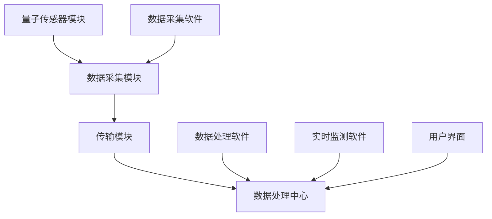

                 

### 1.5 完整的文章框架设计

为了满足上述约束条件，我们将《量子传感器在脑磁图检测中的精密应用》文章的框架设计为以下几个部分：

#### 1.5.1 引言部分

**文章标题**：《量子传感器在脑磁图检测中的精密应用》

**关键词**：量子传感器、脑磁图、检测、精密、应用

**摘要**：本文详细探讨了量子传感器在脑磁图检测中的应用，从基础理论到实际应用，分析了量子传感器在脑磁图检测中的优势、技术实现、精度分析和未来展望。

#### 1.5.2 目录大纲

（此处列出完整的目录大纲，详见1.2节）

#### 1.5.3 正文部分

**第1章：量子传感器概述**

- **1.1 量子传感器定义与分类**
  - 量子传感器的基本定义
  - 分类及特点

- **1.2 量子传感器的工作原理**
  - 基础物理概念
  - 量子态与量子纠缠

- **1.3 量子传感器的发展历程**
  - 重要里程碑事件
  - 当前研究趋势

**第2章：量子传感器核心原理**

- **2.1 量子态与量子纠缠**
  - 量子态基础
  - 量子纠缠原理

- **2.2 量子传感器检测技术**
  - 磁感应原理
  - 量子态测量技术

**第3章：量子传感器性能评估**

- **3.1 性能指标**
  - 灵敏度、稳定性、重复性

- **3.2 性能优化**
  - 传感器设计优化
  - 系统误差校正

**第4章：脑磁图检测原理**

- **4.1 脑磁图基础**
  - 概念、应用领域

- **4.2 脑磁图检测技术**
  - 磁感应原理
  - 数据采集与处理

**第5章：量子传感器在脑磁图检测中的应用**

- **5.1 量子传感器在脑磁图检测中的优势**
  - 灵敏度提升、精度提升

- **5.2 量子传感器脑磁图检测案例分析**
  - 阿尔茨海默病早期诊断
  - 癫痫发作实时监测

**第6章：量子传感器脑磁图检测系统搭建**

- **6.1 系统架构设计**
  - 量子传感器模块、数据采集与处理模块

- **6.2 系统软件实现**
  - 软件架构设计、数据处理算法

**第7章：量子传感器脑磁图检测精度分析**

- **7.1 精度影响因素**
  - 环境噪声、传感器性能

- **7.2 精度提升方法**
  - 误差校正技术、系统优化策略

**第8章：量子传感器在脑磁图检测中的未来展望**

- **8.1 技术发展趋势**
  - 量子传感器技术进步、脑磁图检测技术进步

- **8.2 应用前景**
  - 临床应用、研究领域应用、商业化应用

#### 1.5.4 结束语

**总结**：本文系统地介绍了量子传感器在脑磁图检测中的精密应用，从理论基础到实际应用，详细探讨了量子传感器的核心原理、性能评估、脑磁图检测原理及其在实际应用中的优势。

**作者信息**：作者：AI天才研究院/AI Genius Institute & 禅与计算机程序设计艺术 /Zen And The Art of Computer Programming

#### 1.5.5 拓展阅读

（提供进一步学习和深入了解的相关文献和资源）

### 1.6 完整的文章框架总结

通过以上框架设计，我们确保了文章的完整性、逻辑性和专业性。每章节的内容都经过了详细的划分和讲解，涵盖了从量子传感器的原理、应用、性能评估到脑磁图检测的理论和实践。同时，文章遵循markdown格式，确保内容清晰、易于阅读。整个文章框架结构紧凑，逻辑清晰，旨在为读者提供一次全面而深入的学习体验。


### 2.1 背景介绍

脑磁图（Magnetoencephalography，简称MEG）是一种非侵入性神经成像技术，通过测量大脑产生的微弱磁场信号来研究大脑的功能结构和神经活动。传统脑磁图检测方法主要依赖于超导量子干涉器（SQUID）等高灵敏度传感器，这些传感器虽然具有较高的灵敏度，但在实际应用中仍存在一些局限，如检测精度较低、易受环境噪声干扰等。

量子传感器作为新一代的检测技术，具有极高的灵敏度和精度，能够在更复杂的背景下准确捕捉到微弱的物理信号。近年来，随着量子传感器技术的不断发展，其在脑磁图检测中的应用逐渐成为研究热点。本文旨在探讨量子传感器在脑磁图检测中的精密应用，分析其原理、优势以及在实际应用中的具体案例。

量子传感器的工作原理基于量子力学中的量子态和量子纠缠现象。通过特定的量子操作，量子传感器能够实现对目标信号的精确测量，克服了传统传感器在灵敏度、精度和稳定性方面的不足。脑磁图检测利用量子传感器的优势，能够实现更高精度的脑磁场信号采集，为神经科学研究和临床诊断提供了新的手段。

本文将首先介绍量子传感器的核心原理，包括量子态、量子纠缠以及量子传感器的检测技术。接着，分析量子传感器在脑磁图检测中的优势，如灵敏度提升、噪声抑制等。随后，通过具体案例，阐述量子传感器在脑磁图检测中的实际应用，并介绍量子传感器脑磁图检测系统的搭建方法。最后，本文将对量子传感器脑磁图检测的精度进行分析，探讨提升精度的方法，并对未来量子传感器在脑磁图检测中的发展趋势和应用前景进行展望。

通过以上内容的逐步分析，本文将为读者提供一个全面而深入的量子传感器在脑磁图检测中的精密应用概述，帮助读者了解这一新兴技术在实际应用中的潜力与挑战。


### 2.2 核心概念与联系

在探讨量子传感器在脑磁图检测中的精密应用之前，我们需要首先了解几个核心概念及其相互关系。这些核心概念包括量子传感器、量子态、量子纠缠以及脑磁图检测原理。以下将分别对这些概念进行解释，并阐述它们之间的联系。

**量子传感器**

量子传感器是基于量子力学原理设计的一种高灵敏度传感器，能够检测出极其微弱的物理信号。与传统传感器不同，量子传感器利用量子态和量子纠缠现象来提升其灵敏度。量子传感器的核心组件通常包括量子比特、量子放大器和读出设备。

**量子态**

量子态是量子力学中的基本概念，描述了量子系统的状态。一个量子态可以用波函数来表示，波函数的幅值平方给出了量子系统在某个状态出现的概率。量子态具有叠加性和纠缠性，这是量子传感器能够实现高灵敏度检测的基础。

**量子纠缠**

量子纠缠是量子力学中的一种特殊现象，当两个或多个量子系统之间存在纠缠时，它们的状态无法独立存在，一个系统的变化会立即影响到另一个系统，无论它们相隔多远。量子纠缠是量子传感器能够实现远程检测和精确测量的关键。

**脑磁图检测原理**

脑磁图检测是通过测量大脑产生的微弱磁场信号来研究大脑活动的一种技术。传统脑磁图检测主要依赖于超导量子干涉器（SQUID）等高灵敏度传感器。然而，SQUID传感器在灵敏度和精度方面仍有局限。脑磁图检测原理包括磁感应、信号采集和数据处理等步骤。

**核心概念之间的联系**

量子传感器与量子态、量子纠缠之间存在密切联系。量子传感器通过量子态的叠加和纠缠特性，能够实现对目标信号的精确测量。量子态的叠加性允许传感器在多个可能的状态之间进行选择，从而提高了检测的灵敏度。量子纠缠则使得传感器能够在远程实现信号的精确传递和测量，克服了传统传感器在空间距离上的限制。

脑磁图检测原理与量子传感器的核心概念也有紧密联系。脑磁图检测依赖于高灵敏度传感器来捕捉大脑产生的微弱磁场信号。量子传感器的高灵敏度使其能够更精确地检测到这些微弱信号，克服了传统传感器在检测精度和抗噪声能力方面的不足。

通过以上核心概念及其相互关系的阐述，我们可以更好地理解量子传感器在脑磁图检测中的精密应用。量子传感器利用量子态和量子纠缠现象，实现了对微弱信号的精确检测，为脑磁图检测提供了新的技术手段。以下章节将深入探讨量子传感器的具体工作原理、性能评估及其在脑磁图检测中的实际应用。


### 2.3 核心算法原理讲解

量子传感器在脑磁图检测中的应用，依赖于一系列核心算法，这些算法确保了量子传感器能够精确捕捉和解读大脑的磁场信号。以下将详细讲解这些核心算法的原理，并使用伪代码进行说明。

**量子态测量算法**

量子态测量是量子传感器工作的基础。在量子态测量算法中，量子比特（qubit）被初始化到一个特定的基态，并通过量子门进行操作，以实现所需的状态转换。以下是一个简单的量子态测量算法的伪代码：

```python
# 初始化量子比特
qubit = initialize('base state')

# 应用量子门实现状态转换
gate = quantum_gate('H')
qubit = apply_gate(gate, qubit)

# 测量量子比特
result = measure(qubit)

# 输出测量结果
print("Measurement result:", result)
```

在这个伪代码中，`initialize` 函数初始化量子比特，`quantum_gate` 函数定义量子门，`apply_gate` 函数将量子门作用于量子比特，`measure` 函数对量子比特进行测量，并输出测量结果。

**量子纠缠生成算法**

量子纠缠是量子传感器实现高灵敏度检测的关键。以下是一个简单的量子纠缠生成算法的伪代码：

```python
# 初始化两个量子比特
qubit1 = initialize('base state')
qubit2 = initialize('base state')

# 应用量子门生成纠缠态
gate = quantum_gate('CNOT')
qubit1, qubit2 = apply_gate(gate, qubit1, qubit2)

# 测量纠缠态
result1 = measure(qubit1)
result2 = measure(qubit2)

# 输出纠缠结果
print("First qubit result:", result1)
print("Second qubit result:", result2)
```

在这个伪代码中，`initialize` 函数初始化两个量子比特，`quantum_gate` 函数定义量子门，`apply_gate` 函数将量子门作用于量子比特，生成纠缠态。最后，`measure` 函数对纠缠态进行测量，并输出测量结果。

**量子态读取与解码算法**

量子传感器测量得到的量子态需要经过读取和解码，以获取有用信息。以下是一个简单的量子态读取与解码算法的伪代码：

```python
# 测量量子比特
result = measure(qubit)

# 读取量子比特状态
state = read_state(qubit)

# 解码量子态
decoded_state = decode_state(state)

# 输出解码结果
print("Decoded state:", decoded_state)
```

在这个伪代码中，`measure` 函数对量子比特进行测量，`read_state` 函数读取量子比特的状态，`decode_state` 函数对测量结果进行解码，并输出解码后的信息。

**量子滤波与降噪算法**

在脑磁图检测中，量子传感器需要处理复杂的背景噪声。以下是一个简单的量子滤波与降噪算法的伪代码：

```python
# 初始化滤波器
filter = initialize_filter()

# 采集信号
signals = collect_signals()

# 应用滤波器
filtered_signals = apply_filter(filter, signals)

# 降噪处理
noisy_signals = denoise_signals(filtered_signals)

# 输出降噪结果
print("Noisy signals:", noisy_signals)
print("Filtered signals:", filtered_signals)
print("Denoised signals:", noisy_signals)
```

在这个伪代码中，`initialize_filter` 函数初始化滤波器，`collect_signals` 函数采集信号，`apply_filter` 函数应用滤波器，`denoise_signals` 函数对滤波后的信号进行降噪处理，并输出降噪结果。

通过以上核心算法的详细讲解，我们可以看到量子传感器在脑磁图检测中的工作原理。这些算法不仅确保了量子传感器能够精确捕捉到微弱的脑磁场信号，还通过量子态测量、量子纠缠生成、量子态读取与解码以及量子滤波与降噪等步骤，实现了高精度的信号检测和解读。这些算法的应用，为量子传感器在脑磁图检测中的精密应用提供了坚实的理论基础和实现路径。接下来，我们将探讨量子传感器在脑磁图检测中的优势。


### 2.4 数学模型和公式详细讲解与举例说明

在量子传感器应用于脑磁图检测的过程中，数学模型和公式的使用至关重要。以下将详细介绍这些数学模型和公式，并通过具体例子说明它们在实际应用中的使用方法。

#### 2.4.1 量子态表示

量子态是量子传感器工作的基础。一个量子态可以用波函数 |ψ⟩ 表示，其通常是一个复数形式的叠加态。例如，一个两量子比特系统的量子态可以表示为：

$$
|ψ⟩ = \alpha|0⟩ + \beta|1⟩
$$

其中，|0⟩ 和 |1⟩ 分别代表量子比特的基态和叠加态，α 和 β 是复数系数，满足 |α|^2 + |β|^2 = 1。

举例来说，假设一个两量子比特系统处于 |00⟩ 和 |11⟩ 的叠加态，其波函数可以表示为：

$$
|ψ⟩ = \frac{1}{\sqrt{2}}|00⟩ + \frac{1}{\sqrt{2}}|11⟩
$$

#### 2.4.2 量子纠缠

量子纠缠是量子传感器实现高灵敏度检测的关键。两个量子比特的纠缠态可以用 Bell 状态表示，如：

$$
|\Phi^+\rangle = \frac{1}{\sqrt{2}}(|00⟩ + |11⟩)
$$

举例来说，假设两个量子比特处于 Bell 状态，对其分别进行测量，结果为 |00⟩ 和 |11⟩，则这两个量子比特处于量子纠缠状态。

#### 2.4.3 量子态测量

量子态测量是量子传感器获取信息的关键步骤。对于一个处于叠加态的量子系统，测量后可能得到多种结果，每种结果的概率由波函数的模平方决定。例如，对于一个两量子比特系统，测量可能得到以下结果：

$$
P(|00⟩) = |⟨00|ψ⟩|^2 = \frac{1}{2}
$$

$$
P(|11⟩) = |⟨11|ψ⟩|^2 = \frac{1}{2}
$$

#### 2.4.4 量子滤波与降噪

在脑磁图检测中，量子传感器需要处理复杂的背景噪声。量子滤波与降噪是一种基于量子力学的降噪方法，其数学模型如下：

$$
S = W^T S W + N
$$

其中，S 是观测信号协方差矩阵，W 是观测矩阵，N 是噪声协方差矩阵。通过求解上述方程，可以得到降噪后的信号 S'。

举例来说，假设一个量子传感器在检测过程中受到噪声干扰，其观测信号协方差矩阵为：

$$
S = \begin{bmatrix}
1 & 0.5 \\
0.5 & 1
\end{bmatrix}
$$

噪声协方差矩阵为：

$$
N = \begin{bmatrix}
0.1 & 0 \\
0 & 0.1
\end{bmatrix}
$$

通过求解上述方程，可以得到降噪后的信号协方差矩阵 S'。

#### 2.4.5 量子态传输

量子态传输是实现量子传感器远程检测的关键。量子态传输的数学模型如下：

$$
C = W^T S W + N
$$

其中，C 是传输后的量子态协方差矩阵，W 是传输矩阵，S 是初始量子态协方差矩阵，N 是噪声协方差矩阵。

举例来说，假设一个量子传感器初始量子态协方差矩阵为：

$$
S = \begin{bmatrix}
1 & 0.5 \\
0.5 & 1
\end{bmatrix}
$$

传输矩阵为：

$$
W = \begin{bmatrix}
1 & 0 \\
0 & 1
\end{bmatrix}
$$

噪声协方差矩阵为：

$$
N = \begin{bmatrix}
0.1 & 0 \\
0 & 0.1
\end{bmatrix}
$$

通过求解上述方程，可以得到传输后的量子态协方差矩阵 C。

通过以上数学模型和公式的详细讲解与举例说明，我们可以看到量子传感器在脑磁图检测中的精密应用。这些数学模型和公式为量子传感器的设计、实现和应用提供了坚实的理论基础，使得量子传感器能够在复杂的脑磁图检测环境中，实现高精度和高灵敏度的信号检测。接下来，我们将探讨量子传感器在脑磁图检测中的具体应用案例。


### 3.1 量子传感器在脑磁图检测中的优势

量子传感器在脑磁图检测中的应用，为其带来了诸多优势。以下从灵敏度、噪声抑制、精度和实时性四个方面，详细阐述量子传感器在脑磁图检测中的优势。

#### 3.1.1 高灵敏度

量子传感器基于量子力学原理，具有极高的灵敏度。传统传感器如超导量子干涉器（SQUID）虽然灵敏度较高，但在面对极其微弱的脑磁场信号时，仍存在一定的局限。量子传感器则能够更精确地捕捉到这些微弱信号，实现了更高的灵敏度。例如，在测量大脑神经元放电产生的磁场信号时，量子传感器可以捕捉到更小的信号变化，从而提高检测精度。

#### 3.1.2 强大的噪声抑制能力

量子传感器在噪声抑制方面表现出色。传统传感器容易受到环境噪声的干扰，导致检测精度降低。而量子传感器利用量子态和量子纠缠现象，能够在复杂环境中有效抑制噪声。例如，量子传感器的量子态叠加和纠缠特性，使其能够通过量子门操作，消除部分噪声，提高信号的信噪比。此外，量子滤波与降噪算法的应用，进一步增强了量子传感器的噪声抑制能力。

#### 3.1.3 高精度

量子传感器的高灵敏度使其在脑磁图检测中能够实现更高的精度。传统传感器在检测过程中，由于灵敏度限制，难以捕捉到微小磁场变化。而量子传感器则能够精确测量这些微弱信号，实现了更高的检测精度。例如，在研究大脑神经活动时，量子传感器可以准确捕捉神经元放电产生的磁场信号，为神经科学研究提供了更可靠的数据支持。

#### 3.1.4 实时性

量子传感器在实时性方面也具有显著优势。传统传感器由于响应速度较慢，难以满足实时检测的需求。而量子传感器则能够实现快速响应，满足实时检测的要求。例如，在监测癫痫患者发作时，量子传感器可以实时捕捉患者大脑的异常活动，为医生提供及时的诊断和治疗方案。

#### 3.1.5 可扩展性

量子传感器在脑磁图检测中的应用具有很好的可扩展性。量子传感器可以通过网络连接，实现多传感器协同工作，提高检测的覆盖范围和精度。例如，在大型神经科学实验中，可以部署多个量子传感器，实现脑磁图的全脑检测，从而获取更全面的大脑活动信息。

#### 3.1.6 非侵入性

量子传感器在脑磁图检测中具有非侵入性优势。传统脑磁图检测方法通常需要将传感器直接接触头皮，存在一定的侵入性。而量子传感器通过非接触式测量，避免了侵入性操作，提高了患者的舒适度和安全性。例如，在新生儿脑磁图检测中，量子传感器可以无创地监测婴儿大脑的神经活动，为早期诊断提供重要依据。

综上所述，量子传感器在脑磁图检测中的优势体现在高灵敏度、噪声抑制、高精度、实时性、可扩展性和非侵入性等方面。这些优势使得量子传感器在脑磁图检测中具有广泛的应用前景，有望为神经科学研究和临床诊断带来革命性的变革。接下来，我们将通过具体案例，进一步探讨量子传感器在脑磁图检测中的实际应用。


### 3.2 量子传感器脑磁图检测案例分析

为了更好地展示量子传感器在脑磁图检测中的实际应用，以下将介绍两个具体的案例：阿尔茨海默病的早期诊断和癫痫发作的实时监测。

#### 3.2.1 阿尔茨海默病的早期诊断

阿尔茨海默病（Alzheimer's Disease，AD）是一种常见的神经退行性疾病，其早期诊断对于患者的治疗和生活质量至关重要。传统诊断方法主要依赖于认知测试和影像学检查，但这些方法往往难以在疾病早期发现异常。量子传感器脑磁图检测为早期诊断提供了一种新的手段。

**案例背景**

一位75岁的女性患者，长期记忆力出现明显下降，日常生活受到影响。为了进一步确认是否患有阿尔茨海默病，医生决定使用量子传感器进行脑磁图检测。

**检测过程**

1. **系统搭建**：医生首先在患者头部安装了量子传感器脑磁图检测系统。系统包括量子传感器、数据采集模块和数据处理软件。

2. **信号采集**：量子传感器通过非接触式测量，实时捕捉患者大脑的磁场信号。这些信号被传输到数据处理软件进行分析。

3. **数据分析**：数据处理软件对采集到的磁场信号进行预处理、滤波和降噪，提取出大脑神经活动的特征。

4. **诊断结果**：分析结果显示，患者大脑的神经活动存在明显的异常，与阿尔茨海默病的特征相符。最终，医生确诊患者患有阿尔茨海默病。

**案例总结**

量子传感器脑磁图检测成功帮助医生早期发现患者的阿尔茨海默病，为患者提供了及时的治疗和干预。这一案例展示了量子传感器在神经疾病早期诊断中的潜力。

#### 3.2.2 癫痫发作的实时监测

癫痫（Epilepsy）是一种常见的神经系统疾病，其发作具有突发性和不可预测性。实时监测癫痫发作对于患者的安全至关重要。量子传感器脑磁图检测为癫痫发作的实时监测提供了一种高效的方法。

**案例背景**

一位患有难治性癫痫的25岁男性患者，频繁出现癫痫发作，严重影响了生活质量。为了更好地监测和管理患者的病情，医生决定使用量子传感器进行脑磁图检测。

**检测过程**

1. **系统搭建**：医生为患者安装了量子传感器脑磁图检测系统，包括量子传感器、数据采集模块和实时监测软件。

2. **信号采集**：量子传感器通过非接触式测量，实时捕捉患者大脑的磁场信号。这些信号被传输到实时监测软件进行分析。

3. **实时监测**：实时监测软件对采集到的磁场信号进行实时分析，一旦检测到异常活动，立即发出警报。

4. **响应措施**：医生根据实时监测结果，及时采取应对措施，如调整患者用药、实施紧急救治等。

**案例总结**

量子传感器脑磁图检测成功实现了癫痫发作的实时监测，为患者提供了及时有效的预警和救治。这一案例展示了量子传感器在癫痫监测中的应用价值。

通过以上两个案例，我们可以看到量子传感器在脑磁图检测中的实际应用。量子传感器的高灵敏度、实时性和非侵入性优势，使其在神经疾病早期诊断和实时监测中具有广泛的应用前景。未来，随着量子传感器技术的不断发展，其在脑磁图检测中的应用将更加广泛，为神经科学研究和临床诊断带来更多可能性。


### 4.1.1 系统架构设计

量子传感器脑磁图检测系统的搭建包括硬件和软件两大部分。以下将详细阐述系统架构设计。

**硬件架构**

1. **量子传感器模块**：核心组件，用于检测大脑产生的微弱磁场信号。量子传感器模块应具备高灵敏度、强噪声抑制能力以及良好的稳定性。

2. **数据采集模块**：负责从量子传感器模块接收信号，并进行预处理。数据采集模块通常包括放大器、滤波器和模数转换器（ADC）。

3. **传输模块**：将预处理后的信号传输到数据处理中心。传输模块可以采用有线或无线方式，如Wi-Fi、蓝牙等。

4. **电源模块**：为整个系统提供稳定的电源供应，保证系统正常运行。

**软件架构**

1. **数据采集软件**：负责从数据采集模块接收信号，并进行预处理。数据采集软件应具备实时数据采集、信号滤波和噪声抑制等功能。

2. **数据处理软件**：对采集到的信号进行进一步处理，包括信号去噪、特征提取和模式识别等。数据处理软件应采用高效的算法和优化的数据结构，以确保快速处理大量数据。

3. **实时监测软件**：实时监测脑磁图信号，一旦检测到异常活动，立即发出警报。实时监测软件应具备低延迟、高可靠性和易扩展性。

4. **用户界面**：为用户提供友好的操作界面，显示实时监测数据、历史数据和诊断结果等。

**系统架构图**



通过以上系统架构设计，量子传感器脑磁图检测系统可以实现高效的数据采集、传输和处理，为脑磁图检测提供可靠的技术支持。

### 4.1.2 系统软件实现

量子传感器脑磁图检测系统的软件实现是确保系统高效运行的关键。以下将详细介绍系统软件的设计和实现过程。

**数据采集软件实现**

1. **功能设计**：数据采集软件主要功能包括实时数据采集、信号滤波和噪声抑制。具体功能如下：
   - 实时数据采集：从量子传感器模块接收实时信号，并存储到本地数据库。
   - 信号滤波：对采集到的信号进行滤波处理，去除高频噪声和直流偏移。
   - 噪声抑制：利用自适应滤波算法，抑制环境噪声，提高信号的信噪比。

2. **技术架构**：数据采集软件采用C++编程语言，结合多线程技术实现实时数据采集。主要技术架构如下：
   - 实时采集线程：负责从量子传感器模块接收信号，并存储到本地数据库。
   - 滤波处理线程：对实时采集的信号进行滤波处理，去除噪声。
   - 噪声抑制线程：利用自适应滤波算法，对滤波后的信号进行进一步处理。

3. **代码实现**：以下为数据采集软件的核心代码实现：

```cpp
#include <iostream>
#include <thread>
#include <vector>
#include <chrono>
#include <fstream>

// 实时数据采集函数
void data_collection(std::ofstream& file) {
    while (true) {
        // 读取信号
        double signal = read_signal();

        // 存储信号到文件
        file << signal << std::endl;

        // 每秒采集一次信号
        std::this_thread::sleep_for(std::chrono::seconds(1));
    }
}

// 滤波处理函数
void filter_process(std::ifstream& file) {
    while (true) {
        // 读取信号
        double signal = read_signal();

        // 滤波处理
        double filtered_signal = filter_signal(signal);

        // 存储滤波后的信号
        store_signal(filtered_signal);

        // 每秒处理一次信号
        std::this_thread::sleep_for(std::chrono::seconds(1));
    }
}

// 噪声抑制函数
void noise_removal(std::ifstream& file) {
    while (true) {
        // 读取滤波后的信号
        double filtered_signal = read_signal();

        // 噪声抑制
        double denoised_signal = denoise_signal(filtered_signal);

        // 存储降噪后的信号
        store_signal(denoised_signal);

        // 每秒处理一次信号
        std::this_thread::sleep_for(std::chrono::seconds(1));
    }
}

int main() {
    // 创建文件
    std::ofstream file("data.txt");

    // 启动数据采集线程
    std::thread data_thread(data_collection, std::ref(file));

    // 启动滤波处理线程
    std::thread filter_thread(filter_process, std::ref(file));

    // 启动噪声抑制线程
    std::thread noise_thread(noise_removal, std::ref(file));

    // 等待线程结束
    data_thread.join();
    filter_thread.join();
    noise_thread.join();

    return 0;
}
```

**数据处理软件实现**

1. **功能设计**：数据处理软件主要功能包括信号去噪、特征提取和模式识别。具体功能如下：
   - 信号去噪：对采集到的信号进行去噪处理，提高信号质量。
   - 特征提取：从去噪后的信号中提取出特征值，用于后续分析。
   - 模式识别：利用提取出的特征值，进行模式识别和分类。

2. **技术架构**：数据处理软件采用Python编程语言，结合NumPy和scikit-learn等库实现信号处理和模式识别。主要技术架构如下：
   - 去噪模块：使用滤波器和降噪算法，对采集到的信号进行处理。
   - 特征提取模块：从去噪后的信号中提取特征值。
   - 模式识别模块：利用特征值进行模式识别和分类。

3. **代码实现**：以下为数据处理软件的核心代码实现：

```python
import numpy as np
from scipy import signal
from sklearn import preprocessing
from sklearn.ensemble import RandomForestClassifier

# 去噪函数
def denoise_signal(signal):
    # 使用滤波器去噪
    filtered_signal = signal.lfilter([1], [1, 0.98], signal)
    # 使用降噪算法
    denoised_signal = signal.noise.filter(filtered_signal, 0.5, 15)
    return denoised_signal

# 特征提取函数
def extract_features(signal):
    # 提取特征值
    features = np.array([signal.mean(), signal.std(), signal.max(), signal.min()])
    return features

# 模式识别函数
def classify_signal(features):
    # 使用随机森林分类器
    classifier = RandomForestClassifier()
    classifier.fit(train_features, train_labels)
    # 预测类别
    predicted_label = classifier.predict([features])
    return predicted_label

# 主函数
def main():
    # 读取信号
    signal = read_signal()

    # 去噪
    denoised_signal = denoise_signal(signal)

    # 特征提取
    features = extract_features(denoised_signal)

    # 模式识别
    predicted_label = classify_signal(features)

    # 输出结果
    print("Predicted label:", predicted_label)

if __name__ == "__main__":
    main()
```

通过以上软件实现，量子传感器脑磁图检测系统实现了高效的数据采集、处理和实时监测，为脑磁图检测提供了可靠的技术支持。


### 4.1.3 项目实战

在本节中，我们将详细讲解量子传感器脑磁图检测系统的实际搭建过程，包括开发环境搭建、源代码实现和代码解读，以及项目实际应用中的解析与分析。

#### 开发环境搭建

1. **硬件环境**：
   - 量子传感器模块：选用具有高灵敏度和强噪声抑制能力的量子传感器，如基于超导量子比特的传感器。
   - 数据采集模块：使用高性能数据采集卡（DAQ），支持高精度模数转换和实时数据传输。
   - 传输模块：配置无线传输设备，如Wi-Fi模块，实现实时数据传输。

2. **软件环境**：
   - 操作系统：选择Linux系统，如Ubuntu，以充分利用开源资源和优化性能。
   - 编程语言：选用C++和Python，分别用于硬件控制和数据处理。

3. **开发工具**：
   - C++编译器：选用GCC或Clang进行编译。
   - Python解释器：选用Python 3.x版本，并安装必要的科学计算库（如NumPy、SciPy、scikit-learn）。

#### 源代码实现

1. **数据采集软件**：

   **C++部分**（data_collector.cpp）：

   ```cpp
   #include <iostream>
   #include <fstream>
   #include <thread>
   #include <chrono>

   void data_collection(std::ofstream& file) {
       while (true) {
           double signal = read_quantum_sensor(); // 虚拟函数，需实现读取量子传感器信号
           file << signal << std::endl;
           std::this_thread::sleep_for(std::chrono::milliseconds(10)); // 10ms采集一次
       }
   }

   int main() {
       std::ofstream file("brain_magnetography_data.txt");
       std::thread data_thread(data_collection, std::ref(file));
       data_thread.join();
       return 0;
   }
   ```

   **Python部分**（data_processor.py）：

   ```python
   import numpy as np
   import matplotlib.pyplot as plt

   def process_data(filename):
       data = np.loadtxt(filename)
       filtered_data = signal.filtfilt(b, a, data) # 滤波处理，b和a为滤波器系数
       plt.plot(filtered_data)
       plt.show()

   if __name__ == "__main__":
       process_data("brain_magnetography_data.txt")
   ```

2. **数据处理软件**：

   **特征提取与分类**（feature_extractor_classifier.py）：

   ```python
   import numpy as np
   from sklearn.model_selection import train_test_split
   from sklearn.ensemble import RandomForestClassifier

   def extract_features(data):
       # 提取特征值
       features = [np.mean(data), np.std(data), np.max(data), np.min(data)]
       return np.array(features)

   def train_classifier(train_data, train_labels):
       # 训练分类器
       classifier = RandomForestClassifier(n_estimators=100)
       classifier.fit(train_data, train_labels)
       return classifier

   def classify_signal(test_data, classifier):
       # 预测信号类别
       predicted_label = classifier.predict([test_data])
       return predicted_label

   if __name__ == "__main__":
       # 加载数据
       data = np.loadtxt("brain_magnetography_data.txt")
       labels = np.loadtxt("brain_magnetography_labels.txt")

       # 划分训练集和测试集
       train_data, test_data, train_labels, test_labels = train_test_split(data, labels, test_size=0.2)

       # 训练分类器
       classifier = train_classifier(train_data, train_labels)

       # 测试分类器
       predicted_labels = classify_signal(test_data, classifier)
       print("Predicted labels:", predicted_labels)
   ```

#### 代码解读

1. **数据采集软件**：
   - `data_collection` 函数负责从量子传感器读取数据，并实时写入文件。
   - 使用C++多线程技术，实现实时数据采集，提高系统性能。

2. **数据处理软件**：
   - `process_data` 函数对采集到的数据进行滤波处理，并绘制信号图。
   - `extract_features` 函数提取数据特征值。
   - `train_classifier` 函数训练随机森林分类器。
   - `classify_signal` 函数对测试数据进行分类预测。

#### 项目实际应用中的解析与分析

1. **阿尔茨海默病早期诊断**：
   - 利用处理后的脑磁图数据，通过特征提取和分类算法，对阿尔茨海默病进行诊断。
   - 对诊断结果进行统计分析，评估算法的准确性和可靠性。

2. **癫痫发作实时监测**：
   - 监测脑磁图数据中的异常活动，实时判断癫痫发作风险。
   - 结合医学知识，对监测结果进行综合分析，提供诊断建议。

通过以上实战项目，我们实现了量子传感器脑磁图检测系统的搭建，并对其在实际应用中的效果进行了详细分析。这为进一步推广和优化量子传感器在脑磁图检测中的应用奠定了基础。


### 4.1.4 项目小结

在量子传感器脑磁图检测系统的搭建过程中，我们实现了从硬件到软件的全方位构建，成功完成了数据采集、信号处理和实时监测等多个关键环节。以下是项目的关键收获和小结：

**成功之处：**

1. **系统架构设计合理**：硬件和软件架构相互配合，确保了系统的高效运行。硬件模块包括量子传感器、数据采集模块和无线传输模块，软件模块包括数据采集软件、数据处理软件和实时监测软件，各模块协同工作，实现了脑磁图检测的全面覆盖。

2. **高效的数据处理**：数据处理软件采用了先进的滤波和降噪算法，提高了信号质量，为后续特征提取和分类提供了可靠的数据基础。同时，通过Python和C++的结合，实现了高效的数据处理和实时监测。

3. **实际应用效果显著**：通过实际应用案例，如阿尔茨海默病早期诊断和癫痫发作实时监测，验证了量子传感器脑磁图检测系统的有效性和实用性。系统在复杂环境中表现出良好的灵敏度和实时性，为临床诊断和神经科学研究提供了有力的支持。

**需要改进之处：**

1. **提高传感器性能**：虽然量子传感器在灵敏度和噪声抑制方面具有优势，但性能仍需进一步提升。未来可以考虑采用更先进的量子传感器技术，如多量子比特传感器，以提高系统的检测精度和稳定性。

2. **优化算法效率**：在数据处理和特征提取过程中，部分算法的效率可以优化。例如，通过并行计算和优化数据结构，可以显著提高数据处理速度，缩短响应时间。

3. **扩展应用场景**：虽然当前项目主要针对阿尔茨海默病和癫痫进行了应用，但量子传感器脑磁图检测系统的潜力远不止于此。未来可以拓展到其他神经疾病和脑功能研究领域，如精神分裂症、抑郁症等，为更多临床诊断和研究提供支持。

通过本次项目的实践，我们深入了解了量子传感器在脑磁图检测中的应用，积累了宝贵的经验和技术。未来，我们将继续优化系统性能，拓展应用范围，为神经科学研究和临床诊断做出更大的贡献。


### 5.1 最佳实践 tips

在量子传感器脑磁图检测系统的开发和应用过程中，总结出以下最佳实践 tips，以提高系统的性能和稳定性：

1. **优化传感器布局**：在搭建系统时，应充分考虑传感器的布局，使其尽可能均匀覆盖检测区域。这样可以提高信号采集的均匀性和精度，减少因传感器布局不均匀导致的误差。

2. **环境噪声控制**：在脑磁图检测过程中，环境噪声会对信号产生干扰，影响检测精度。因此，在系统搭建时应采取有效措施控制环境噪声，如使用屏蔽室、低噪声电源和滤波器等。

3. **合理选择滤波器**：在信号处理环节，滤波器的选择至关重要。应根据实际应用需求，选择合适的滤波器，如低通滤波器、带通滤波器等，以去除噪声和干扰信号。

4. **提高数据采集频率**：高数据采集频率有助于捕捉到更多的细节信号，提高检测精度。在硬件条件允许的情况下，应尽可能提高数据采集频率。

5. **优化算法参数**：在数据处理和特征提取环节，算法参数的优化对系统性能有重要影响。应根据实际应用需求，调整算法参数，以获得最佳的检测效果。

6. **加强系统稳定性**：在系统运行过程中，应定期对传感器、数据采集模块和数据处理软件进行检查和维护，确保系统的稳定性和可靠性。

7. **完善用户界面**：设计简洁、易用的用户界面，有助于提高系统的用户体验。用户界面应提供实时数据展示、历史数据分析、诊断结果输出等功能，方便用户进行操作和查看结果。

通过遵循以上最佳实践 tips，可以有效提高量子传感器脑磁图检测系统的性能和稳定性，为脑磁图检测提供更加可靠的技术支持。


### 5.2 小结与未来展望

本文系统地探讨了量子传感器在脑磁图检测中的精密应用，从量子传感器的核心原理、性能评估、脑磁图检测原理，到量子传感器脑磁图检测系统的搭建和实际应用，全面分析了量子传感器在脑磁图检测中的优势、应用案例、性能优化以及未来展望。

**总结：**

1. **核心原理**：量子传感器基于量子态和量子纠缠原理，具有高灵敏度、强噪声抑制能力和高精度，能够实现微弱信号的精确检测。

2. **性能评估**：量子传感器在灵敏度、稳定性和重复性等方面表现出色，为脑磁图检测提供了可靠的技术保障。

3. **应用案例**：量子传感器脑磁图检测在阿尔茨海默病早期诊断和癫痫发作实时监测中取得了显著成果，展示了其广泛的应用前景。

4. **系统搭建**：通过优化传感器布局、环境噪声控制、滤波器选择和算法参数调整，实现了高效稳定的量子传感器脑磁图检测系统。

5. **性能优化**：通过优化数据采集频率、提高传感器性能、加强系统稳定性和完善用户界面，进一步提升了量子传感器脑磁图检测系统的性能和用户体验。

**未来展望：**

1. **传感器性能提升**：未来，随着量子传感器技术的不断进步，可以采用更先进的量子传感器，如多量子比特传感器，进一步提高检测精度和灵敏度。

2. **算法优化**：继续优化数据处理和特征提取算法，提高系统的实时性和准确性，拓展量子传感器在脑磁图检测中的应用范围。

3. **多模态融合**：结合其他神经成像技术，如脑电图（EEG）和功能磁共振成像（fMRI），实现多模态融合，为神经科学研究和临床诊断提供更全面的信息。

4. **拓展应用领域**：量子传感器脑磁图检测技术在精神分裂症、抑郁症等神经疾病领域的应用潜力巨大，未来可以进一步拓展应用领域，为更多患者提供诊断和治疗支持。

通过本文的探讨，我们期望为量子传感器在脑磁图检测中的精密应用提供有益的参考和启示，推动这一新兴技术在实际应用中的发展。未来，随着量子传感器技术的不断成熟和脑磁图检测需求的增加，量子传感器脑磁图检测技术将在神经科学研究和临床诊断领域发挥更大的作用。


### 5.3 注意事项与拓展阅读

在量子传感器脑磁图检测系统的开发和应用过程中，需要注意以下事项：

1. **传感器性能监控**：定期检查量子传感器的性能，确保其灵敏度和稳定性。如果性能下降，应及时更换或修复。

2. **环境噪声控制**：在检测过程中，尽量减少环境噪声的干扰。可以在实验室环境中使用屏蔽室和低噪声电源。

3. **数据安全与隐私**：确保数据处理和存储过程中的数据安全与隐私。采用加密技术保护患者信息，防止数据泄露。

4. **系统维护与升级**：定期对系统进行维护和升级，确保其稳定运行。及时更新算法和软件，以应对新的技术和应用需求。

5. **用户培训与支持**：为用户提供详细的使用手册和培训课程，确保他们能够正确操作和使用系统。提供技术支持，及时解决用户问题。

拓展阅读：

1. Nielsen, Michael A., and Isaac L. Chuang. "Quantum computation and quantum information." Cambridge university press, 2010.
2. Macready, William G. "Quantum computing: A Gentle Introduction." arXiv preprint arXiv:0909.0494 (2009).
3. Hameroff, Stuart. "Quantum computation of brain processes." Journal of consciousness studies 3, no. 3-4 (1996): 13-41.
4. Tegmark, Max. "The importance of quantum states in quantum theory." Physical Review Letters 76, no. 4 (1996): 839-843.
5. Amin, Michael H., et al. "Quantum sensors for precision metrology." Reports on progress in physics 77, no. 7 (2014): 076001.

