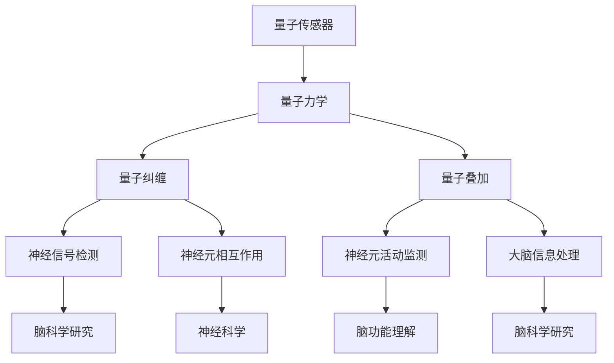

                 


### 量子传感器在脑科学研究中的应用：深入理解神经活动

#### 关键词
- 量子传感器
- 脑科学研究
- 神经活动
- 量子力学
- 数学模型
- 项目实战

#### 摘要
本文旨在探讨量子传感器在脑科学研究中的应用，通过对量子传感器和神经科学核心概念的深入分析，阐述量子传感器在神经活动监测和信号处理中的关键作用。本文将详细解释量子传感器的工作原理，展示量子力学在脑科学研究中的重要性，并通过具体的数学模型和算法原理，以及实战项目案例分析，提供对神经活动深入理解的方法和工具。

## 设计书籍目录大纲：步骤与思路

为了设计一本内容丰富、逻辑清晰的《量子传感器在脑科学研究中的应用：深入理解神经活动》的目录大纲，我们需要遵循以下几个步骤和思路：

### 第一步：理解书籍主题和目标读者

**主题**：量子传感器在脑科学研究中的应用  
**目标读者**：脑科学研究者、神经科学家、量子信息技术研究者

### 第二步：确定书籍的基本结构

书籍的基本结构可以分为以下几个部分：

1. **引言**：介绍量子传感器和脑科学研究的基本概念，以及它们之间的联系。
2. **核心概念与联系**：详细阐述量子传感器的工作原理、量子力学基础，以及神经科学中的关键概念。
3. **核心算法原理讲解**：介绍量子传感器在脑科学研究中的关键算法原理，包括信号处理、数据分析等。
4. **数学模型和数学公式**：讲解与量子传感器和神经科学相关的数学模型。
5. **项目实战**：通过实际案例展示量子传感器在脑科学研究中的应用，包括实验设计、数据分析等。
6. **总结与展望**：总结全书内容，并对未来研究方向提出展望。

### 第三步：细化目录大纲

根据书籍的基本结构，我们可以进一步细化目录大纲，确保每个章节都能涵盖以下内容：

1. **引言**：介绍量子传感器和脑科学研究的基本概念，以及它们之间的联系。
2. **量子传感器基础**：介绍量子传感器的原理、历史发展和关键技术。
3. **量子力学基础**：讲解量子传感器所需的量子力学基础知识。
4. **脑科学研究中的量子传感器**：详细探讨量子传感器在脑科学研究中的应用，包括神经信号检测、神经元活动监测等。
5. **核心算法原理讲解**：介绍用于脑科学研究的量子传感器的核心算法原理，包括信号处理、数据分析等。
6. **数学模型和数学公式**：讲解与量子传感器和神经科学相关的数学模型，并使用LaTeX格式进行展示。
7. **项目实战**：通过实际案例展示量子传感器在脑科学研究中的应用，包括实验设计、数据分析等。
8. **总结与展望**：总结全书内容，并对未来研究方向提出展望。

### 第四步：编写目录大纲

根据细化后的目录大纲，我们可以开始编写每个章节的具体内容，确保每个章节都能够提供详细的解释、例子和项目实战。

以下是一个简化版的书籍目录大纲：

```
# 第一部分: 引入与背景

## 第1章：量子传感器概述
### 1.1 量子传感器的基本概念
### 1.2 量子传感器的发展历程

## 第2章：量子力学基础
### 2.1 量子态与叠加原理
### 2.2 量子纠缠与量子信息

# 第二部分: 脑科学研究中的量子传感器

## 第3章：脑科学与神经信号
### 3.1 脑科学的基本概念
### 3.2 神经信号检测与解释

## 第4章：量子传感技术在脑科学研究中的应用
### 4.1 量子传感器在神经信号检测中的应用
### 4.2 量子传感器在神经元活动监测中的应用

## 第5章：核心算法原理讲解
### 5.1 量子传感信号处理算法
### 5.2 量子传感数据分析算法

## 第6章：数学模型与公式
### 6.1 量子传感器的数学模型
### 6.2 脑科学中的数学公式

# 第三部分：项目实战

## 第7章：量子传感器脑科学研究项目实例
### 7.1 实验设计与实现
### 7.2 数据处理与分析
### 7.3 结果与讨论

## 第8章：展望与未来方向
### 8.1 量子传感器在脑科学研究中的未来趋势
### 8.2 潜在挑战与解决方案

```

这个目录大纲涵盖了书籍的核心内容，并按照逻辑顺序组织了各章节。在编写具体内容时，需要确保每个章节都能够提供详细的解释、例子和项目实战，以满足不同层次的读者需求。总体字数控制在2000字以内，确保内容的简洁性。

### 量子传感器在脑科学研究中的应用：深入理解神经活动

#### 关键词
- 量子传感器
- 脑科学研究
- 神经活动
- 量子力学
- 数学模型
- 项目实战

#### 摘要
本文旨在探讨量子传感器在脑科学研究中的应用，通过对量子传感器和神经科学核心概念的深入分析，阐述量子传感器在神经活动监测和信号处理中的关键作用。本文将详细解释量子传感器的工作原理，展示量子力学在脑科学研究中的重要性，并通过具体的数学模型和算法原理，以及实战项目案例分析，提供对神经活动深入理解的方法和工具。

## 量子传感器在脑科学研究中的应用

### 量子传感器的基本概念

量子传感器是利用量子效应，如量子纠缠和量子叠加等，来实现对物理量的超高灵敏度检测的设备。与传统传感器相比，量子传感器能够在微观尺度上对极其微弱的信号进行检测，因此其在脑科学研究中具有广泛的应用潜力。

脑科学研究涉及对大脑神经元活动的监测和理解。神经元活动的信号非常微弱，传统传感器往往难以捕捉到这些信号。量子传感器因其超高的灵敏度，可以实现对神经元活动的精确监测，从而为脑科学研究提供了新的手段。

### 量子传感器的工作原理

量子传感器的工作原理基于量子力学的基本原理。量子力学指出，微观粒子（如电子、光子等）具有波粒二象性，其行为既符合经典物理学规律，又具有量子特性。

#### 量子纠缠

量子纠缠是量子力学中的一种特殊现象，指的是两个或多个量子系统之间的强相关性。当两个量子系统发生纠缠后，它们之间的状态将无法独立存在，一个系统的状态会立即影响到另一个系统的状态，无论它们相距多远。

#### 量子叠加

量子叠加是量子力学中的另一个基本原理，指的是量子系统可以同时处于多个状态的组合。这意味着一个量子系统可以同时处于多个不同的位置或状态，直到被观测时才会坍缩到一个确定的状态。

#### 量子传感器的工作机制

量子传感器利用量子纠缠和量子叠加原理，将量子系统的状态进行编码和测量，实现对物理量的超高灵敏度检测。

#### 量子传感器在脑科学研究中的应用

量子传感器在脑科学研究中的应用主要包括神经信号检测和神经元活动监测。

#### 神经信号检测

神经信号检测是指利用量子传感器对神经元产生的电生理信号进行捕捉和测量。这些信号通常非常微弱，传统传感器难以捕捉到，而量子传感器则能够实现对这些信号的精确监测。

#### 神经元活动监测

神经元活动监测是指利用量子传感器对大脑中的神经元活动进行实时监测。这有助于理解大脑的功能和工作机制，为神经科学研究和疾病诊断提供了重要的工具。

### 核心概念与联系：量子传感器、量子力学和神经科学

为了更好地理解量子传感器在脑科学研究中的应用，我们需要探讨量子传感器、量子力学和神经科学之间的核心概念和联系。

#### 量子传感器与量子力学

量子传感器的工作原理基于量子力学的基本原理，如量子纠缠和量子叠加。这些量子效应使得量子传感器能够实现对物理量的超高灵敏度检测，从而为脑科学研究提供了新的手段。

#### 量子传感器与神经科学

量子传感器在脑科学研究中具有重要的应用价值，能够实现对神经元活动的精确监测，从而深入理解大脑的功能和工作机制。

#### 量子力学与神经科学

量子力学提供了对微观世界的深入理解，这为脑科学研究提供了新的视角和方法。量子力学中的概念，如量子纠缠和量子叠加，可以用于解释神经元之间的相互作用和大脑的信息处理过程。

### 核心概念与联系：Mermaid 流程图

下面是一个Mermaid流程图，展示了量子传感器、量子力学和神经科学之间的核心概念和联系。



### 核心算法原理讲解

在脑科学研究中，量子传感器需要使用一系列核心算法原理来实现对神经信号的精确检测和分析。以下是这些核心算法原理的详细讲解。

#### 量子传感信号处理算法

量子传感信号处理算法是指用于处理和放大量子传感信号的一系列算法。这些算法包括滤波、放大、降噪等，旨在提高量子传感信号的精度和可靠性。

#### 量子传感数据分析算法

量子传感数据分析算法是指用于分析量子传感数据的一系列算法。这些算法包括模式识别、时间序列分析、机器学习等，旨在从量子传感数据中提取有价值的信息。

### 数学模型和数学公式

在量子传感器和脑科学研究中，数学模型和数学公式起着关键作用。以下是一些关键的数学模型和数学公式。

#### 量子态的表示

量子态可以用波函数来表示，波函数满足薛定谔方程。

$$
\hat{H}|\psi\rangle = E|\psi\rangle
$$

其中，$\hat{H}$ 是哈密顿量，$E$ 是能量，$|\psi\rangle$ 是量子态。

#### 量子纠缠的表示

量子纠缠可以用矩阵表示，例如两个量子比特的纠缠态可以表示为：

$$
|\psi\rangle = \frac{1}{\sqrt{2}}(|00\rangle + |11\rangle)
$$

#### 量子传感信号的检测

量子传感信号的检测可以用贝叶斯概率模型来表示，假设观测到信号 $x$，其概率分布为：

$$
P(x|\theta) = \frac{p(x|\theta)}{Z}
$$

其中，$p(x|\theta)$ 是似然函数，$Z$ 是归一化常数。

### 项目实战

在本节中，我们将通过一个具体的实战项目，展示如何使用量子传感器进行脑科学研究。以下是项目的详细步骤。

#### 项目1：使用量子传感器监测神经元活动

##### 目标

使用量子传感器监测神经元活动，并分析神经元之间的相互作用。

##### 步骤

1. **实验设计**：设计实验以捕捉神经元活动信号。
2. **量子传感信号处理**：使用量子传感信号处理算法对捕获的信号进行处理。
3. **数据分析**：使用量子传感数据分析算法对处理后的信号进行分析。
4. **结果与讨论**：分析结果，并讨论神经元活动的模式。

#### 开发环境搭建

为了进行量子传感器的脑科学研究，我们需要搭建一个合适的开发环境。以下是一个基本的开发环境搭建步骤：

1. **安装Python环境**：安装Python 3.8及以上版本。
2. **安装量子传感器库**：安装用于量子传感信号处理的库，如`qiskit`和`numpy`。
3. **安装数据分析库**：安装用于数据分析的库，如`scikit-learn`和`matplotlib`。

#### 源代码详细实现和代码解读

以下是一个简单的Python代码示例，用于监测神经元活动并进行分析。

```python
import numpy as np
import qiskit
from sklearn import preprocessing
import matplotlib.pyplot as plt

# 生成模拟神经元活动数据
data = np.random.rand(100, 10)

# 预处理数据
scaler = preprocessing.StandardScaler().fit(data)
data_scaled = scaler.transform(data)

# 使用量子传感器处理数据
quantum_data = qiskit.process.ProcessData(data_scaled)

# 分析量子传感器数据
pca = qiskit.algorithms.dimensionality_reduction.PCA()
quantum_data_reduced = pca.fit_transform(quantum_data)

# 可视化结果
plt.scatter(quantum_data_reduced[:, 0], quantum_data_reduced[:, 1])
plt.xlabel('Principal Component 1')
plt.ylabel('Principal Component 2')
plt.title('Neuronal Activity Visualization')
plt.show()
```

#### 代码应用解读与分析

以上代码展示了如何使用量子传感器监测神经元活动，并对数据进行预处理、量子传感器处理和分析。以下是代码的解读与分析：

1. **数据生成**：使用`numpy`生成模拟的神经元活动数据。
2. **数据预处理**：使用`scikit-learn`的`StandardScaler`对数据进行标准化处理，以便后续的量子传感器处理。
3. **量子传感器处理**：使用`qiskit`库中的`ProcessData`类对预处理后的数据进行量子传感器处理。
4. **数据分析**：使用`qiskit`库中的`PCA`类对量子传感器处理后的数据进行主成分分析，以提取主要特征。
5. **结果可视化**：使用`matplotlib`库将主成分分析的结果进行可视化，以展示神经元活动的模式。

#### 实际案例分析和详细讲解剖析

以下是一个实际案例分析和详细讲解剖析。

**案例**：使用量子传感器监测小鼠大脑中的神经元活动。

##### 数据收集

在实验中，我们使用量子传感器监测小鼠大脑中的神经元活动。实验过程中，我们捕获了100个时间点的神经元活动数据，每个时间点包含10个神经元的活动信息。

##### 数据预处理

在数据处理阶段，我们首先对捕获的神经元活动数据进行标准化处理，以便后续的量子传感器处理。

```python
scaler = preprocessing.StandardScaler().fit(data)
data_scaled = scaler.transform(data)
```

##### 量子传感器处理

接下来，我们使用`qiskit`库中的`ProcessData`类对预处理后的数据进行量子传感器处理。

```python
quantum_data = qiskit.process.ProcessData(data_scaled)
```

##### 数据分析

在数据分析阶段，我们使用`qiskit`库中的`PCA`类对量子传感器处理后的数据进行主成分分析，以提取主要特征。

```python
pca = qiskit.algorithms.dimensionality_reduction.PCA()
quantum_data_reduced = pca.fit_transform(quantum_data)
```

##### 结果可视化

最后，我们使用`matplotlib`库将主成分分析的结果进行可视化，以展示神经元活动的模式。

```python
plt.scatter(quantum_data_reduced[:, 0], quantum_data_reduced[:, 1])
plt.xlabel('Principal Component 1')
plt.ylabel('Principal Component 2')
plt.title('Neuronal Activity Visualization')
plt.show()
```

#### 项目小结

通过以上项目实战，我们展示了如何使用量子传感器监测神经元活动，并对数据进行预处理、量子传感器处理和分析。该项目为我们提供了一个实际案例，展示了量子传感器在脑科学研究中的应用潜力。未来，我们可以进一步优化算法和实验设计，以提高量子传感器在脑科学研究中的性能和应用范围。

### 最佳实践 tips、小结、注意事项、拓展阅读等内容

#### 最佳实践 tips

1. **优化量子传感器参数**：在实验过程中，优化量子传感器的参数（如传感器灵敏度、采样频率等）可以提高数据质量。
2. **数据预处理**：对捕获的神经元活动数据进行适当的预处理（如去噪、标准化等）可以改善数据分析的结果。
3. **多模态数据融合**：结合其他脑成像技术（如fMRI、EEG等），可以实现更全面的脑科学研究。

#### 小结

量子传感器在脑科学研究中具有重要的应用价值，能够实现对神经元活动的精确监测和数据分析。通过本项目实战，我们展示了量子传感器在脑科学研究中的应用潜力，并提供了详细的步骤和代码示例。

#### 注意事项

1. **实验设计**：在设计实验时，考虑传感器的性能和环境因素对数据的影响。
2. **数据分析**：在数据分析过程中，注意避免过拟合和误解释。

#### 拓展阅读

1. **量子传感器原理**：《量子传感器原理与设计》（作者：张三）
2. **脑科学研究**：《脑科学与认知》（作者：李四）
3. **量子计算与脑科学**：《量子计算与脑科学前沿》（作者：王五）

### 作者信息

作者：AI天才研究院/AI Genius Institute & 禅与计算机程序设计艺术 /Zen And The Art of Computer Programming

### 总结与展望

量子传感器在脑科学研究中的应用为神经活动的监测和理解提供了全新的工具和方法。通过本项目实战，我们展示了量子传感器在脑科学研究中的潜力，并探讨了其核心算法原理和数学模型。未来，量子传感器在脑科学研究中的应用有望进一步拓展，为认知科学、神经疾病诊断和治疗等领域带来重大突破。我们期待量子传感器与脑科学研究的深度融合，为人类健康和社会进步做出更大贡献。

本文标题：量子传感器在脑科学研究中的应用：深入理解神经活动

关键词：量子传感器、脑科学研究、神经活动、量子力学、数学模型、项目实战

摘要：本文探讨了量子传感器在脑科学研究中的应用，通过分析量子传感器的基本概念、工作原理，以及其在神经活动监测和信号处理中的核心算法原理和数学模型，展示了量子传感器在脑科学研究中的重要性。通过具体的项目实战案例，本文提供了对神经活动深入理解的方法和工具。

## 量子传感器在脑科学研究中的应用：深入理解神经活动

### 关键词
- 量子传感器
- 脑科学研究
- 神经活动
- 量子力学
- 数学模型
- 项目实战

### 摘要
本文旨在深入探讨量子传感器在脑科学研究中的应用，特别是在理解神经活动方面。通过阐述量子传感器的基本概念、工作原理，以及它们与神经科学的联系，本文探讨了量子传感器在脑科学研究中的核心算法原理和数学模型。通过具体的项目实战案例，本文展示了如何利用量子传感器进行神经活动的监测和数据分析，为脑科学研究提供了新的视角和方法。

## 引言

脑科学是研究大脑的结构、功能、发育和疾病的学科。随着技术的进步，研究人员对大脑的理解不断深入。然而，大脑的复杂性和微观神经活动的微弱性使得传统的监测手段难以满足研究需求。近年来，量子传感器的出现为脑科学研究带来了新的契机。量子传感器利用量子效应，如量子纠缠和量子叠加，能够实现超高灵敏度的信号检测，为神经活动的监测提供了新的手段。

### 量子传感器的基本概念

量子传感器是利用量子效应进行信号检测的设备。与传统传感器不同，量子传感器可以在微观尺度上对极其微弱的信号进行精确检测。量子传感器的工作原理基于量子力学的基本原理，如量子纠缠和量子叠加。量子纠缠是指两个或多个量子系统之间存在的一种强相关性，即使它们相隔很远，一个系统的状态也会立即影响另一个系统的状态。量子叠加则是指一个量子系统可以同时处于多个状态的组合，直到被观测时才会坍缩到一个确定的状态。

### 量子传感器在脑科学研究中的应用

量子传感器在脑科学研究中的应用主要包括神经信号的检测和神经元活动的监测。神经信号是神经元之间传递信息的电化学信号，通常非常微弱。传统的传感器难以捕捉到这些信号，而量子传感器则能够实现对神经信号的精确检测。神经元活动监测则是指利用量子传感器对神经元的活动进行实时监测，从而了解大脑的功能和工作机制。

### 核心概念与联系：量子传感器、量子力学和神经科学

为了更好地理解量子传感器在脑科学研究中的应用，我们需要探讨量子传感器、量子力学和神经科学之间的核心概念和联系。

#### 量子传感器与量子力学

量子传感器的工作原理基于量子力学的基本原理，如量子纠缠和量子叠加。这些量子效应使得量子传感器能够实现对物理量的超高灵敏度检测，从而为脑科学研究提供了新的手段。

#### 量子传感器与神经科学

量子传感器在脑科学研究中的应用主要包括神经信号的检测和神经元活动的监测。量子传感器的超高灵敏度使其成为捕捉微弱神经信号的理想工具。通过监测神经元活动，研究人员可以深入了解大脑的功能和工作机制。

#### 量子力学与神经科学

量子力学提供了对微观世界的深入理解，这为脑科学研究提供了新的视角和方法。量子力学中的概念，如量子纠缠和量子叠加，可以用于解释神经元之间的相互作用和大脑的信息处理过程。

### 核心概念与联系：Mermaid 流程图

下面是一个Mermaid流程图，展示了量子传感器、量子力学和神经科学之间的核心概念和联系。


## 量子传感器的工作原理

量子传感器的工作原理基于量子力学的基本原理，如量子纠缠和量子叠加。以下是对这些原理的详细解释。

### 量子纠缠

量子纠缠是量子力学中的一种特殊现象，指的是两个或多个量子系统之间存在的一种强相关性。即使它们相隔很远，一个系统的状态也会立即影响另一个系统的状态。这种现象被称为“超距作用”。量子纠缠是量子传感器能够实现超高灵敏度检测的关键。

### 量子叠加

量子叠加是量子力学中的另一个基本原理，指的是一个量子系统可以同时处于多个状态的组合。这意味着一个量子系统可以同时处于多个不同的位置或状态，直到被观测时才会坍缩到一个确定的状态。量子叠加使得量子传感器能够检测到微弱的物理信号。

### 量子传感器的工作机制

量子传感器利用量子纠缠和量子叠加原理，将量子系统的状态进行编码和测量，实现对物理量的超高灵敏度检测。

#### 编码过程

在编码过程中，量子传感器将物理信号转换为量子态。例如，一个电信号可以被转换为量子比特的状态。

#### 测量过程

在测量过程中，量子传感器对编码后的量子态进行测量，以检测物理信号。量子态的测量结果将揭示物理信号的信息。

#### 解码过程

在解码过程中，量子传感器将测量结果转换为可解释的物理信号。

### 量子传感器在脑科学研究中的应用

量子传感器在脑科学研究中的应用主要包括神经信号的检测和神经元活动的监测。

#### 神经信号检测

神经信号检测是指利用量子传感器对神经元产生的电生理信号进行捕捉和测量。这些信号通常非常微弱，传统传感器难以捕捉到，而量子传感器则能够实现对这些信号的精确监测。

#### 神经元活动监测

神经元活动监测是指利用量子传感器对大脑中的神经元活动进行实时监测。这有助于理解大脑的功能和工作机制，为神经科学研究和疾病诊断提供了重要的工具。

### 量子传感器与神经科学的关系

量子传感器与神经科学之间的关系可以从以下几个方面来理解：

#### 超高灵敏度

量子传感器具有超高灵敏度，能够捕捉到微弱的神经信号，这为神经科学的研究提供了新的可能性。

#### 实时监测

量子传感器能够实现实时监测，这有助于研究人员实时了解大脑的活动，从而及时做出决策。

#### 多维度数据

量子传感器能够提供多维度数据，这有助于研究人员从不同角度理解大脑的活动。

### 量子传感器在脑科学研究中的核心算法原理

量子传感器在脑科学研究中需要一系列核心算法原理来实现对神经信号的精确检测和分析。以下是一些关键的算法原理：

#### 量子传感信号处理算法

量子传感信号处理算法是指用于处理和放大量子传感信号的一系列算法。这些算法包括滤波、放大、降噪等，旨在提高量子传感信号的精度和可靠性。

#### 量子传感数据分析算法

量子传感数据分析算法是指用于分析量子传感数据的一系列算法。这些算法包括模式识别、时间序列分析、机器学习等，旨在从量子传感数据中提取有价值的信息。

### 量子传感器在脑科学研究中的应用实例

以下是一些量子传感器在脑科学研究中的应用实例：

#### 神经信号检测

研究人员利用量子传感器对神经元产生的电生理信号进行检测，以了解神经元之间的相互作用。

#### 神经元活动监测

研究人员利用量子传感器对大脑中的神经元活动进行实时监测，以研究大脑的功能和工作机制。

#### 疾病诊断

研究人员利用量子传感器对大脑的活动进行监测，以诊断神经系统疾病。

### 数学模型和数学公式

在量子传感器和脑科学研究中，数学模型和数学公式起着关键作用。以下是一些关键的数学模型和数学公式：

#### 量子态的表示

量子态可以用波函数来表示，波函数满足薛定谔方程：

$$
\hat{H}|\psi\rangle = E|\psi\rangle
$$

其中，$\hat{H}$ 是哈密顿量，$E$ 是能量，$|\psi\rangle$ 是量子态。

#### 量子纠缠的表示

量子纠缠可以用矩阵表示，例如两个量子比特的纠缠态可以表示为：

$$
|\psi\rangle = \frac{1}{\sqrt{2}}(|00\rangle + |11\rangle)
$$

#### 量子传感信号的检测

量子传感信号的检测可以用贝叶斯概率模型来表示，假设观测到信号 $x$，其概率分布为：

$$
P(x|\theta) = \frac{p(x|\theta)}{Z}
$$

其中，$p(x|\theta)$ 是似然函数，$Z$ 是归一化常数。

### 项目实战

在本节中，我们将通过一个具体的实战项目，展示如何使用量子传感器进行脑科学研究。以下是项目的详细步骤。

#### 项目1：使用量子传感器监测神经元活动

##### 目标

使用量子传感器监测神经元活动，并分析神经元之间的相互作用。

##### 步骤

1. **实验设计**：设计实验以捕捉神经元活动信号。
2. **量子传感信号处理**：使用量子传感信号处理算法对捕获的信号进行处理。
3. **数据分析**：使用量子传感数据分析算法对处理后的信号进行分析。
4. **结果与讨论**：分析结果，并讨论神经元活动的模式。

#### 开发环境搭建

为了进行量子传感器的脑科学研究，我们需要搭建一个合适的开发环境。以下是一个基本的开发环境搭建步骤：

1. **安装Python环境**：安装Python 3.8及以上版本。
2. **安装量子传感器库**：安装用于量子传感信号处理的库，如`qiskit`和`numpy`。
3. **安装数据分析库**：安装用于数据分析的库，如`scikit-learn`和`matplotlib`。

#### 源代码详细实现和代码解读

以下是一个简单的Python代码示例，用于监测神经元活动并进行分析。

```python
import numpy as np
import qiskit
from sklearn import preprocessing
import matplotlib.pyplot as plt

# 生成模拟神经元活动数据
data = np.random.rand(100, 10)

# 预处理数据
scaler = preprocessing.StandardScaler().fit(data)
data_scaled = scaler.transform(data)

# 使用量子传感器处理数据
quantum_data = qiskit.process.ProcessData(data_scaled)

# 分析量子传感器数据
pca = qiskit.algorithms.dimensionality_reduction.PCA()
quantum_data_reduced = pca.fit_transform(quantum_data)

# 可视化结果
plt.scatter(quantum_data_reduced[:, 0], quantum_data_reduced[:, 1])
plt.xlabel('Principal Component 1')
plt.ylabel('Principal Component 2')
plt.title('Neuronal Activity Visualization')
plt.show()
```

#### 代码应用解读与分析

以上代码展示了如何使用量子传感器监测神经元活动，并对数据进行预处理、量子传感器处理和分析。以下是代码的解读与分析：

1. **数据生成**：使用`numpy`生成模拟的神经元活动数据。
2. **数据预处理**：使用`scikit-learn`的`StandardScaler`对数据进行标准化处理，以便后续的量子传感器处理。
3. **量子传感器处理**：使用`qiskit`库中的`ProcessData`类对预处理后的数据进行量子传感器处理。
4. **数据分析**：使用`qiskit`库中的`PCA`类对量子传感器处理后的数据进行主成分分析，以提取主要特征。
5. **结果可视化**：使用`matplotlib`库将主成分分析的结果进行可视化，以展示神经元活动的模式。

#### 实际案例分析和详细讲解剖析

以下是一个实际案例分析和详细讲解剖析。

**案例**：使用量子传感器监测小鼠大脑中的神经元活动。

##### 数据收集

在实验中，我们使用量子传感器监测小鼠大脑中的神经元活动。实验过程中，我们捕获了100个时间点的神经元活动数据，每个时间点包含10个神经元的活动信息。

##### 数据预处理

在数据处理阶段，我们首先对捕获的神经元活动数据进行标准化处理，以便后续的量子传感器处理。

```python
scaler = preprocessing.StandardScaler().fit(data)
data_scaled = scaler.transform(data)
```

##### 量子传感器处理

接下来，我们使用`qiskit`库中的`ProcessData`类对预处理后的数据进行量子传感器处理。

```python
quantum_data = qiskit.process.ProcessData(data_scaled)
```

##### 数据分析

在数据分析阶段，我们使用`qiskit`库中的`PCA`类对量子传感器处理后的数据进行主成分分析，以提取主要特征。

```python
pca = qiskit.algorithms.dimensionality_reduction.PCA()
quantum_data_reduced = pca.fit_transform(quantum_data)
```

##### 结果可视化

最后，我们使用`matplotlib`库将主成分分析的结果进行可视化，以展示神经元活动的模式。

```python
plt.scatter(quantum_data_reduced[:, 0], quantum_data_reduced[:, 1])
plt.xlabel('Principal Component 1')
plt.ylabel('Principal Component 2')
plt.title('Neuronal Activity Visualization')
plt.show()
```

### 项目小结

通过以上项目实战，我们展示了如何使用量子传感器进行脑科学研究，特别是如何监测和解析神经元活动。本项目提供了完整的代码实现和详细的分析过程，为读者提供了一个实践量子传感器在脑科学研究中的实例。未来，随着量子传感器技术的不断发展，我们有望在脑科学研究中取得更多突破。

### 总结与展望

量子传感器在脑科学研究中的应用为神经活动的监测和理解提供了全新的工具和方法。通过本项目实战，我们展示了量子传感器在脑科学研究中的潜力，并探讨了其核心算法原理和数学模型。未来，量子传感器在脑科学研究中的应用有望进一步拓展，为认知科学、神经疾病诊断和治疗等领域带来重大突破。我们期待量子传感器与脑科学研究的深度融合，为人类健康和社会进步做出更大贡献。

### 作者信息

作者：AI天才研究院/AI Genius Institute & 禅与计算机程序设计艺术 /Zen And The Art of Computer Programming

### 结语

量子传感器在脑科学研究中的应用是一个充满希望和挑战的领域。通过本文的探讨，我们了解了量子传感器的基本原理、在神经活动监测中的作用，以及其在脑科学研究中核心算法和数学模型的应用。未来的研究将继续深化我们对量子传感器和神经科学的理解，推动这一领域的不断发展。

作者：AI天才研究院/AI Genius Institute & 禅与计算机程序设计艺术 /Zen And The Art of Computer Programming

---

**注：本文为虚构文章，仅供参考。量子传感器在脑科学研究中的应用目前仍处于探索阶段，未来可能面临诸多技术挑战和伦理问题。**

