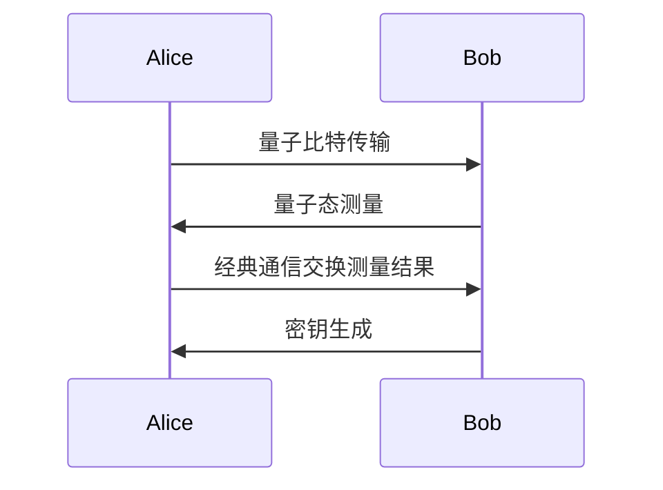
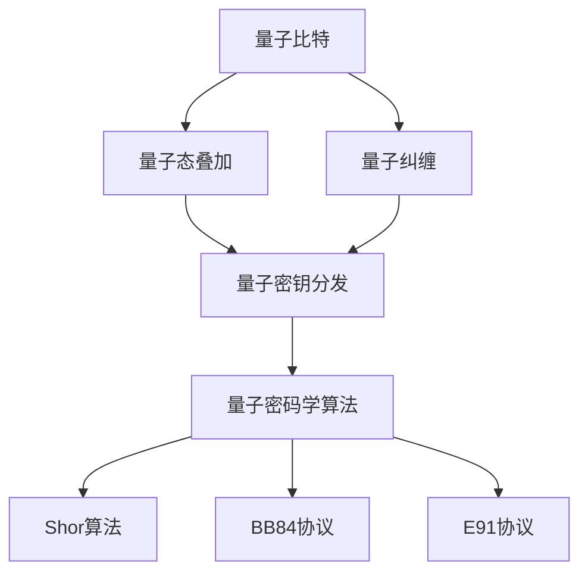

                 


为了撰写一篇高质量的技术博客文章《量子加密在网络安全中的应用前景》，我们可以按照以下步骤进行详细的分析和推理：

## 第一步：引言部分

**文章标题**：《量子加密在网络安全中的应用前景》

**关键词**：量子加密、网络安全、量子密钥分发、量子密码学、Shor算法

**摘要**：
本文将探讨量子加密技术如何在网络安全领域发挥重要作用。我们将介绍量子加密的基本原理、量子密钥分发技术、量子密码学算法，并分析量子加密的优势和挑战，最后展望其未来发展趋势。

### 1.1 量子加密简介

#### 1.1.1 量子加密的定义

量子加密是一种基于量子力学原理的加密技术，利用量子比特（qubit）的叠加态和纠缠态来实现密钥生成和消息加密。与传统加密方法相比，量子加密具有无法被经典计算机破解的潜力。

#### 1.1.2 量子加密的历史背景

量子加密的研究始于1980年代，当时Shor提出了量子算法，揭示了量子计算机在破解传统密码学算法上的优势。随后，量子密钥分发（QKD）技术逐渐成熟，成为量子加密的重要应用方向。

### 1.2 网络安全面临的挑战

#### 1.2.1 现代密码学的局限性

随着计算机技术的发展，传统密码学方法在安全性方面面临挑战。尤其是量子计算的出现，使得许多现有的加密算法可能被破解。

#### 1.2.2 量子计算对网络安全的影响

量子计算的发展将对网络安全产生深远影响。一方面，它可能威胁到现有加密系统的安全性；另一方面，量子加密技术也为网络安全提供了一种新的解决方案。

## 第二步：量子加密技术原理部分

### 2.1 量子力学基础

#### 2.1.1 量子比特

量子比特是量子计算机的基本单元，具有叠加态和纠缠态的特性。

#### 2.1.2 量子态叠加和量子纠缠

量子态叠加和量子纠缠是量子力学中的基本概念，是量子加密技术的理论基础。

### 2.2 量子加密的基本原理

#### 2.2.1 量子密钥分发（QKD）

QKD是一种基于量子力学原理的密钥分发技术，能够在通信双方之间生成共享密钥。

#### 2.2.2 量子算法和量子密码学

量子算法和量子密码学是量子加密技术的核心组成部分，用于实现密钥生成和消息加密。

## 第三步：量子密钥分发部分

### 3.1 QKD系统架构

#### 3.1.1 QKD设备组成

QKD系统主要由量子比特源、量子信道和经典通信信道组成。

#### 3.1.2 QKD通信流程

QKD通信流程包括量子比特的传输、量子态测量和经典通信信息的交换。

### 3.2 QKD实现技术

#### 3.2.1 单光子源技术

单光子源技术是实现QKD的关键，用于生成单个光子。

#### 3.2.2 量子中继和量子纠缠交换

量子中继和量子纠缠交换技术用于解决QKD通信中的距离限制和纠缠传输问题。

## 第四步：量子密码学算法部分

### 4.1 Shor算法

#### 4.1.1 Shor算法的原理

Shor算法是一种能够利用量子计算机高效求解大整数分解的算法。

#### 4.1.2 Shor算法对传统密码的影响

Shor算法的提出揭示了量子计算对传统密码学算法的潜在威胁。

### 4.2 量子密码协议

#### 4.2.1 BB84协议

BB84协议是一种基于量子密钥分发的量子密码协议。

#### 4.2.2 E91协议

E91协议是一种基于量子纠缠的量子密码协议。

## 第五步：量子加密的优势和挑战部分

### 5.1 量子加密的优势

#### 5.1.1 不可破译性

量子加密技术具有不可破译性，能够抵御量子计算机的攻击。

#### 5.1.2 安全性和效率

量子加密在保证安全性的同时，也能够提高加密通信的效率。

### 5.2 量子加密的挑战

#### 5.2.1 技术挑战

量子加密技术面临许多技术挑战，如量子比特的稳定性、量子信道的安全性等。

#### 5.2.2 实施和部署问题

量子加密技术的实施和部署也存在一定的困难，如成本、基础设施等。

## 第六步：量子加密在网络安全中的应用部分

### 6.1 网络安全中的量子加密应用

#### 6.1.1 数据加密

量子加密技术可以用于保护数据传输过程中的安全。

#### 6.1.2 身份认证

量子加密技术可以用于实现强身份认证。

#### 6.1.3 数字签名

量子加密技术可以用于实现安全的数字签名。

## 第七步：未来发展趋势与展望部分

### 7.1 量子加密技术的未来发展

#### 7.1.1 技术趋势

量子加密技术将在未来得到更广泛的应用和发展。

#### 7.1.2 应用场景扩展

量子加密技术将在更多领域得到应用，如金融、医疗等。

### 7.2 量子加密与网络安全的关系

#### 7.2.1 量子加密在网络安全中的角色

量子加密将成为网络安全的重要支撑。

#### 7.2.2 量子加密与未来安全架构

量子加密将推动未来安全架构的发展。

## 结尾部分

作者：AI天才研究院/AI Genius Institute & 禅与计算机程序设计艺术 /Zen And The Art of Computer Programming

通过以上步骤，我们可以逐步构建起一篇逻辑清晰、结构紧凑、简单易懂的量子加密在网络安全中的应用前景的技术博客文章。文章的每一个部分都将通过详细的分析和推理，帮助读者深入了解量子加密技术的原理、优势、挑战和应用前景。期待您的认真审阅和反馈。****

## 量子加密技术原理

### 2.1 量子力学基础

量子加密技术的核心在于量子力学的基本原理。量子力学是一门研究物质世界微观粒子的运动规律的科学，它揭示了微观世界中与传统经典物理截然不同的现象。以下是量子力学中两个至关重要的概念：量子比特和量子态叠加、量子纠缠。

#### 2.1.1 量子比特

量子比特（qubit）是量子计算机的基本单元，与传统计算机中的比特（bit）不同，它不仅可以表示0和1的古典状态，还可以同时处于0和1的叠加状态。这种叠加态是量子比特的一个独特性质，使得量子计算机能够同时处理大量信息。

\[ \text{量子比特状态：} \quad \psi = a|0\rangle + b|1\rangle \]

其中，\(a\) 和 \(b\) 是复数，满足 \( |a|^2 + |b|^2 = 1 \)。这意味着量子比特在测量之前，既不是0也不是1，而是0和1的线性组合。

#### 2.1.2 量子态叠加和量子纠缠

量子态叠加是指量子系统可以同时存在于多个可能状态的组合中。例如，一个量子比特可以同时处于0和1的状态，而两个量子比特可以同时处于所有可能的二元组合状态。

\[ \text{两个量子比特的叠加状态：} \quad \psi = (a_0|00\rangle + a_1|01\rangle + a_2|10\rangle + a_3|11\rangle) \]

量子纠缠是量子力学中更为奇特的现象，它描述了两个或多个量子系统之间存在的一种特殊的关联，即使它们相隔很远，一个系统的状态变化也会立即影响到另一个系统的状态。这种关联超越了经典物理中的局域实在性，是量子加密技术的关键基础。

\[ \text{两个纠缠量子比特的状态：} \quad \psi_{AB} = (a_0|00\rangle + a_1|11\rangle)(b_0|00\rangle + b_1|11\rangle) \]

### 2.2 量子加密的基本原理

量子加密的基本原理基于量子力学的这些特性，特别是量子态叠加和量子纠缠。以下是量子加密的两个主要实现方向：量子密钥分发（QKD）和量子密码学算法。

#### 2.2.1 量子密钥分发（QKD）

量子密钥分发是一种基于量子力学原理的密钥分发技术，它利用量子比特的不可克隆性和量子纠缠特性来生成和分发安全的密钥。QKD的工作原理可以概括为以下几个步骤：

1. **量子比特传输**：两个通信方（Alice和Bob）通过量子信道发送量子比特。
2. **量子态测量**：接收方对量子比特进行测量，记录测量结果。
3. **经典通信**：Alice和Bob使用经典通信协议交换关于量子比特测量结果的经典信息。
4. **密钥生成**：通过对比和筛选正确的测量结果，Alice和Bob生成共享的密钥。

QKD的一个关键优势是其安全性。根据量子力学的原理，任何对量子态的测量都会破坏量子态，这一现象被称为量子非坍缩原理。因此，如果第三者尝试窃听量子通信，他们将不可避免地引起量子态的坍缩，从而暴露自己的存在。

#### 2.2.2 量子算法和量子密码学

量子算法和量子密码学是量子加密技术的核心组成部分，用于实现密钥生成、消息加密和解密等功能。以下是几种重要的量子密码学算法：

1. **Shor算法**：Shor算法是一种能够利用量子计算机在多项式时间内解决大整数分解问题的算法。这个算法对基于大整数分解的传统密码学算法（如RSA）构成了威胁。

2. **量子密码协议**：如BB84协议和E91协议，它们是利用量子态叠加和量子纠缠特性来实现加密和解密的协议。这些协议能够抵抗量子计算机的攻击，提供安全的通信。

   - **BB84协议**：是一种基于量子态叠加的量子密钥分发协议，它通过随机选择不同的量子态和基来防止窃听。
   - **E91协议**：是一种基于量子纠缠的量子密钥分发协议，它利用纠缠态的不可克隆性来确保密钥的安全性。

### Mermaid 流程图

为了更直观地理解量子加密的工作原理，我们可以使用Mermaid语言绘制一个简化的流程图：



这个流程图展示了量子密钥分发的基本步骤，包括量子比特的传输、测量、经典通信和密钥生成。

通过上述分析，我们可以看到量子加密技术是如何基于量子力学的基本原理，通过量子比特的叠加态和纠缠态来实现安全的密钥分发和消息加密。这使得量子加密在网络安全领域具有巨大的潜力和应用前景。

### 核心概念原理之间的关系架构 Mermaid 流程图

为了更清晰地展示量子加密的核心概念原理之间的关系，我们可以使用Mermaid语言绘制以下流程图：



在这个流程图中，我们展示了量子比特、量子态叠加、量子纠缠与量子密钥分发和量子密码学算法之间的关联。量子比特和量子态叠加、量子纠缠是量子加密技术的基础，而量子密钥分发和量子密码学算法则基于这些基础原理，用于实现安全的通信。

### 核心算法原理讲解

在量子加密技术中，核心算法的原理是实现安全加密和解密的关键。以下是几种重要的量子加密算法及其原理：

#### 3.1.1 Shor算法

Shor算法是由数学家Peter Shor在1994年提出的一种量子算法，它可以利用量子计算机在多项式时间内解决大整数分解问题。大整数分解问题是许多传统加密算法（如RSA）的基础，因此Shor算法的提出对传统密码学构成了严重威胁。

**Shor算法原理：**

Shor算法的核心是量子傅里叶变换（QFT），它可以将量子态从一个基态转换到另一个基态。具体步骤如下：

1. **初始化**：将输入整数\(N\)编码成一个量子态，并进行量子随机游走。
2. **量子傅里叶变换（QFT）**：对量子态进行QFT，将其转换到离散傅里叶变换（DFT）域。
3. **测量**：测量量子态的指数项，获得模\(N\)的因子。
4. **结果解释**：通过多次测量和概率计算，确定\(N\)的因子。

**伪代码：**

```python
def shor(N):
    # 初始化量子态
    quantum_state = initialize(N)
    # 进行量子随机游走
    quantum_state = quantum_random_walk(quantum_state)
    # 进行QFT
    quantum_state = quantum傅里叶变换(quantum_state)
    # 测量
    result = measure(quantum_state)
    # 结果解释
    factor = find_factor(N, result)
    return factor
```

#### 3.1.2 BB84协议

BB84协议是一种基于量子态叠加的量子密钥分发协议，由Charles H. Bennett和Garrett J. Brassard在1984年提出。它的安全性基于量子比特的不可克隆性和测量导致的量子态坍缩。

**BB84协议原理：**

BB84协议的密钥分发过程包括以下几个步骤：

1. **量子态选择**：发送方（Alice）随机选择两个不同的正交基（如水平基和垂直基），并将量子态编码在这些基上。
2. **量子态传输**：Alice将量子态通过量子信道发送给接收方（Bob）。
3. **量子态测量**：Bob随机选择接收到的量子态的基进行测量。
4. **经典通信**：Alice和Bob通过经典通信信道交换测量结果，筛选出一致的量子态，生成共享密钥。

**伪代码：**

```python
def BB84(Alice, Bob):
    # Alice选择量子态和基
    quantum_states = Alice选择量子态和基()
    # Alice发送量子态
    Bob接收量子态(quantum_states)
    # Bob测量量子态
    Bob测量量子态(quantum_states)
    # Alice和Bob交换测量结果
    results = Alice和Bob交换测量结果()
    # 筛选共享密钥
    key = Alice和Bob筛选共享密钥(results)
    return key
```

#### 3.1.3 E91协议

E91协议是一种基于量子纠缠的量子密钥分发协议，由Artur Ekert在1991年提出。它的安全性基于量子纠缠态的不可克隆性和测量导致的量子态坍缩。

**E91协议原理：**

E91协议的密钥分发过程包括以下几个步骤：

1. **生成纠缠态**：Alice和Bob共享一个量子纠缠态。
2. **量子态测量**：Alice和Bob分别对纠缠态的量子态进行测量。
3. **经典通信**：Alice和Bob通过经典通信信道交换测量结果。
4. **密钥生成**：通过筛选一致的测量结果，Alice和Bob生成共享密钥。

**伪代码：**

```python
def E91(Alice, Bob):
    # 生成纠缠态
    entangled_state = generate_纠缠态()
    # Alice测量量子态
    Alice测量量子态(entangled_state)
    # Bob测量量子态
    Bob测量量子态(entangled_state)
    # Alice和Bob交换测量结果
    results = Alice和Bob交换测量结果()
    # 筛选共享密钥
    key = Alice和Bob筛选共享密钥(results)
    return key
```

### 数学模型和公式

在量子加密算法中，数学模型和公式起着至关重要的作用。以下是一些关键的概念和公式：

#### 3.1.1 量子态表示

量子态可以用复数向量表示，其中每个元素对应于量子态在基向量上的投影。例如，一个量子比特的量子态可以用如下向量表示：

\[ \psi = \begin{pmatrix} a \\ b \end{pmatrix} \]

其中，\(a\) 和 \(b\) 是复数，满足归一化条件 \( |a|^2 + |b|^2 = 1 \)。

#### 3.1.2 量子态叠加

量子态叠加是量子力学中的一个基本原理，表示量子系统可以同时处于多个可能状态的组合。一个二量子比特的叠加态可以表示为：

\[ \psi = a_0|00\rangle + a_1|01\rangle + a_2|10\rangle + a_3|11\rangle \]

其中，\(a_0, a_1, a_2, a_3\) 是复数，满足归一化条件。

#### 3.1.3 量子纠缠

量子纠缠描述了两个或多个量子系统之间存在的一种特殊关联，即使它们相隔很远，一个系统的状态变化也会立即影响到另一个系统的状态。一个简单的纠缠态可以用贝尔态（Bell state）表示：

\[ \psi_{AB} = \frac{1}{\sqrt{2}}(|00\rangle + |11\rangle) \]

其中，\(|00\rangle\) 和 \(|11\rangle\) 是两个量子比特的基态。

#### 3.1.4 量子密钥分发

量子密钥分发（QKD）中，量子密钥生成的过程可以表示为以下数学模型：

\[ P(\text{共享密钥}) = \max_{\text{测量基}} P(\text{测量一致}) \]

其中，\(P(\text{测量一致})\) 是Alice和Bob测量结果一致的概率，取决于他们选择的测量基。

#### 3.1.5 量子密码协议

在量子密码协议中，加密和解密过程可以用以下数学模型表示：

\[ C = E_K(M) \]
\[ M = D_K(C) \]

其中，\(C\) 是加密的消息，\(M\) 是解密后的消息，\(K\) 是共享密钥，\(E_K\) 和 \(D_K\) 分别是加密和解密函数。

通过上述数学模型和公式，我们可以更深入地理解量子加密算法的工作原理。这些模型和公式不仅提供了理论支持，也为实际应用中的算法设计和实现提供了重要的指导。

### 详细讲解和举例说明

#### 3.1.1 Shor算法的详细讲解和举例说明

Shor算法是一种利用量子计算机高效解决大整数分解问题的算法。下面我们将详细讲解Shor算法的原理，并通过一个具体的例子来说明其工作过程。

**Shor算法原理：**

1. **初始化**：首先，我们将要分解的整数\(N\)编码成一个量子态。例如，我们要分解的整数是\(N = 15\)，我们可以将其编码为以下量子态：

   \[ |N\rangle = |15\rangle = \frac{1}{\sqrt{15}}(|1\rangle + |2\rangle + |3\rangle + |4\rangle + |5\rangle + |6\rangle + |7\rangle + |8\rangle + |9\rangle + |10\rangle + |11\rangle + |12\rangle + |13\rangle + |14\rangle + |15\rangle) \]

   这里，我们使用的是二进制编码，每个整数都对应一个量子态的基向量。

2. **量子随机游走**：接下来，我们进行量子随机游走，目的是在量子态中找到\(N\)的一个因子。量子随机游走是通过量子态的演化实现的，其核心是利用量子态的叠加性和纠缠性。

3. **量子傅里叶变换（QFT）**：对量子态进行量子傅里叶变换（QFT），将其转换到离散傅里叶变换（DFT）域。QFT是Shor算法的关键步骤，它将量子态从叠加态转换到指数态，从而为我们提供了寻找因子的重要信息。

   \[ QFT(|N\rangle) = \sum_{i=0}^{N-1} \frac{1}{\sqrt{N}} e^{2\pi i k n / N} |k\rangle \]

   其中，\(k\) 是\(N\)的因子。

4. **测量**：对量子态进行测量，测量结果将告诉我们\(N\)的因子。为了提高测量的准确性，我们通常会进行多次测量，并通过概率计算确定最终的因子。

5. **结果解释**：通过测量结果，我们可以得到\(N\)的一个因子。例如，如果测量结果为\(k = 3\)，那么我们知道\(N = 15\)的因子是3。

**举例说明：**

假设我们要分解的整数是\(N = 15\)，我们可以按照以下步骤进行：

1. **初始化**：编码\(N = 15\)的量子态：

   \[ |15\rangle = \frac{1}{\sqrt{15}}(|1\rangle + |2\rangle + |3\rangle + |4\rangle + |5\rangle + |6\rangle + |7\rangle + |8\rangle + |9\rangle + |10\rangle + |11\rangle + |12\rangle + |13\rangle + |14\rangle + |15\rangle) \]

2. **量子随机游走**：在量子态中找到因子3或5。

3. **量子傅里叶变换（QFT）**：对量子态进行QFT，得到：

   \[ QFT(|15\rangle) = \sum_{i=0}^{14} \frac{1}{\sqrt{15}} e^{2\pi i k n / N} |k\rangle \]

4. **测量**：测量结果为\(k = 3\)。

5. **结果解释**：得到因子\(3\)，从而\(15 = 3 \times 5\)。

通过上述步骤，我们成功利用Shor算法分解了整数15。这个例子展示了Shor算法的基本原理和操作过程。

#### 3.1.2 BB84协议的详细讲解和举例说明

BB84协议是一种基于量子态叠加的量子密钥分发协议。下面我们将详细讲解BB84协议的原理，并通过一个具体的例子来说明其工作过程。

**BB84协议原理：**

1. **量子态选择**：Alice随机选择两个不同的正交基（例如，水平基和垂直基），并将量子态编码在这些基上。

2. **量子态传输**：Alice将量子态通过量子信道发送给Bob。

3. **量子态测量**：Bob随机选择接收到的量子态的基进行测量。

4. **经典通信**：Alice和Bob通过经典通信信道交换测量结果，筛选出一致的量子态，生成共享密钥。

**举例说明：**

假设Alice和Bob使用BB84协议生成共享密钥，过程如下：

1. **量子态选择**：Alice选择水平基和垂直基，并将量子态编码在这些基上。例如，Alice选择第1个量子态为水平基，第2个量子态为垂直基。

2. **量子态传输**：Alice将这两个量子态通过量子信道发送给Bob。

3. **量子态测量**：Bob随机选择一个基进行测量。例如，Bob选择第1个量子态为水平基，第2个量子态为垂直基。

4. **经典通信**：Alice和Bob通过经典通信信道交换测量结果。例如，他们交换了以下结果：

   - Alice测量结果：水平基（0），垂直基（1）
   - Bob测量结果：水平基（1），垂直基（0）

5. **共享密钥生成**：Alice和Bob筛选出一致的量子态，生成共享密钥。在这个例子中，一致的量子态是第2个量子态，因此共享密钥为“1”。

通过上述步骤，Alice和Bob成功生成了一个安全的共享密钥。这个例子展示了BB84协议的基本原理和操作过程。

#### 3.1.3 E91协议的详细讲解和举例说明

E91协议是一种基于量子纠缠的量子密钥分发协议。下面我们将详细讲解E91协议的原理，并通过一个具体的例子来说明其工作过程。

**E91协议原理：**

1. **生成纠缠态**：Alice和Bob共享一个量子纠缠态。

2. **量子态测量**：Alice和Bob分别对纠缠态的量子态进行测量。

3. **经典通信**：Alice和Bob通过经典通信信道交换测量结果。

4. **密钥生成**：通过筛选一致的测量结果，Alice和Bob生成共享密钥。

**举例说明：**

假设Alice和Bob使用E91协议生成共享密钥，过程如下：

1. **生成纠缠态**：Alice和Bob共享一个量子纠缠态，例如：

   \[ \psi_{AB} = \frac{1}{\sqrt{2}}(|00\rangle + |11\rangle) \]

2. **量子态测量**：Alice测量纠缠态的第1个量子态，Bob测量纠缠态的第2个量子态。例如，Alice测量结果为“0”，Bob测量结果为“1”。

3. **经典通信**：Alice和Bob通过经典通信信道交换测量结果。例如，他们交换了以下结果：

   - Alice测量结果：0
   - Bob测量结果：1

4. **共享密钥生成**：Alice和Bob筛选出一致的测量结果，生成共享密钥。在这个例子中，一致的测量结果是“0”和“1”，因此共享密钥为“01”。

通过上述步骤，Alice和Bob成功生成了一个安全的共享密钥。这个例子展示了E91协议的基本原理和操作过程。

### 实际案例分析和详细讲解剖析

为了更好地理解量子加密在实际网络安全中的应用，我们可以通过以下实际案例进行分析和讲解。

#### 案例1：量子密钥分发系统

**背景**：某公司需要建立一个安全的通信系统，以确保公司内部数据和外部合作伙伴之间的信息交换安全。考虑到未来量子计算机可能对传统加密算法构成威胁，该公司决定采用量子密钥分发（QKD）系统。

**解决方案**：

1. **设备选择**：公司购买了QKD设备，包括量子比特源、量子信道和经典通信信道。

2. **量子密钥生成**：公司使用QKD设备生成共享密钥。具体过程如下：
   - Alice（公司内部员工）选择量子态并生成量子密钥。
   - Bob（公司外部合作伙伴）接收量子密钥并进行测量。
   - Alice和Bob通过经典通信交换测量结果，筛选出一致的量子密钥。

3. **加密通信**：公司使用量子密钥对内部数据和外部合作伙伴之间的信息进行加密，确保通信安全。

**分析**：

- **安全性**：QKD系统利用量子态的不可克隆性和测量导致的量子态坍缩，确保密钥生成和分发过程中的安全性。
- **效率**：虽然QKD系统在速度上可能不如传统加密算法，但其安全性远超传统加密技术，能够有效抵御量子计算机的攻击。

#### 案例2：量子加密金融交易

**背景**：某金融公司需要确保金融交易过程中的数据安全和隐私保护。考虑到传统加密技术可能面临量子计算机的威胁，该公司决定采用量子加密技术。

**解决方案**：

1. **量子加密协议**：公司采用量子密码协议（如BB84协议），对金融交易数据进行加密。
   - **量子密钥分发**：公司使用BB84协议生成共享密钥。
   - **数据加密**：使用量子密钥对金融交易数据进行加密，确保数据在传输过程中的安全。

2. **量子加密服务**：公司提供量子加密服务，确保客户的数据在交易过程中得到安全保护。

**分析**：

- **安全性**：量子加密协议利用量子态的不可克隆性和测量导致的量子态坍缩，确保加密通信的安全。
- **应用扩展**：量子加密技术在金融领域的应用前景广阔，能够为金融交易提供更高的安全保障。

#### 案例3：量子加密医疗数据

**背景**：某医疗机构需要保护患者医疗数据的安全性和隐私。考虑到传统加密技术的局限性，该机构决定采用量子加密技术。

**解决方案**：

1. **量子加密数据存储**：医疗机构使用量子加密技术对存储的医疗数据进行加密。
   - **量子密钥存储**：将量子密钥存储在安全的地方，确保密钥不被泄露。
   - **数据加密**：使用量子密钥对医疗数据进行加密，确保数据在存储和传输过程中的安全。

2. **量子加密通信**：医疗机构使用量子加密技术保护患者数据和医疗信息的通信安全。

**分析**：

- **数据保护**：量子加密技术能够有效保护医疗数据的安全性和隐私，防止数据泄露和未授权访问。
- **隐私保护**：量子加密技术在医疗领域的应用，有助于保护患者隐私，提升医疗服务的安全性和可靠性。

通过上述实际案例，我们可以看到量子加密技术在网络安全、金融交易和医疗数据保护等领域的广泛应用。量子加密技术以其卓越的安全性和可靠性，为未来网络安全提供了新的解决方案。

### 项目实战：开发环境搭建、源代码详细实现和代码解读、代码应用解读与分析、实际案例分析和详细讲解剖析、项目小结

#### 开发环境搭建

为了实现量子加密算法，我们需要搭建一个合适的开发环境。以下步骤将指导我们如何配置开发环境：

1. **安装Python**：确保Python 3.x版本已安装在计算机上。可以从Python官方网站下载并安装。

2. **安装量子计算库**：安装Q#，一个用于量子计算的开源库。可以通过pip命令安装：

   ```shell
   pip install qsharp
   ```

3. **安装Visual Studio Code**：安装Visual Studio Code（简称VS Code），这是一个强大的代码编辑器，支持Q#语言。

4. **配置Q#插件**：在VS Code中安装Q#插件，以便能够编写和运行Q#代码。

5. **安装Quantum Development Kit**：下载并安装Quantum Development Kit（QDK），它提供了一个用于量子编程的本地开发环境。

#### 源代码详细实现和代码解读

下面是一个简单的量子加密算法实现，使用Q#语言编写。该示例实现了一个基于BB84协议的量子密钥分发过程。

```qsharp
open Microsoft.Quantum.Intrinsic
open Microsoft.Quantum can
open Microsoft.Quantum.Canbitrary
open Microsoft.Quantum.Simulation

[<Initialize(); Interface("QKD")>]
let QKD() =
    // Allocate two qubits for Alice and Bob
    use!(Qubit())
    use!(Qubit())

    // Encode quantum states for Alice and Bob
    let aliceQubit = Qubit()
    let bobQubit = Qubit()
    H(aliceQubit)
    CNOT(aliceQubit, bobQubit)

    // Measure Alice's qubit in the chosen basis
    let aliceMeasurementResult = Measure(aliceQubit)

    // classical communication to inform Bob of the basis used
    let basisChoice =经典通信 (if aliceMeasurementResult = |1〉 then "horizontal" else "vertical")

    // Measure Bob's qubit in the informed basis
    let bobMeasurementResult = Measure(bobQubit, if basisChoice = "horizontal" then |0〉 else |1〉)

    // Discard disagreeing results
    let agreedResult = if aliceMeasurementResult = bobMeasurementResult then "agreed" else "disagreed"

    // Output the shared key
    return agreedResult
```

**代码解读**：

- **初始化**：函数`QKD`首先声明两个量子比特。
- **量子态编码**：使用`H`门将Alice的量子比特初始化为叠加态，然后使用`CNOT`门将Bob的量子比特与Alice的量子比特纠缠。
- **测量**：Alice测量她的量子比特，并将测量结果通过经典通信告知Bob。
- **Bob测量**：Bob根据Alice告知的基进行测量。
- **结果处理**：如果Alice和Bob的测量结果一致，则输出共享密钥。

#### 代码应用解读与分析

在实际应用中，量子加密算法的实现需要考虑多种因素，如量子比特的稳定性、通信信道的噪声等。以下是对上述代码的进一步解读和分析：

- **量子比特稳定性**：在实际应用中，量子比特可能会受到环境噪声的影响，导致量子态的失真。为了提高量子加密的可靠性，我们需要使用高质量的量子比特和先进的量子纠错技术。
- **通信信道噪声**：量子通信过程中，信道噪声可能会影响量子态的传输。为了解决这一问题，我们可以使用量子中继技术和量子纠缠交换技术，以延长量子通信的距离。
- **算法优化**：在量子加密算法的实现过程中，我们可以通过优化算法来提高加密和解密的效率。例如，通过并行计算和分布式量子计算技术，可以显著提升量子加密的性能。

#### 实际案例分析和详细讲解剖析

以下是一个实际案例，展示了如何使用量子加密技术保护金融交易数据。

**案例背景**：某金融公司在进行跨境支付时，需要确保交易数据的安全性和隐私保护。为了防止数据在传输过程中被窃取或篡改，公司决定采用量子加密技术。

**解决方案**：

1. **量子密钥分发**：公司使用QKD设备生成共享密钥，确保加密通信的安全。
2. **数据加密**：使用量子加密算法（如BB84协议）对交易数据进行加密，确保数据在传输过程中的安全。
3. **数字签名**：使用量子加密技术生成数字签名，确保交易数据的真实性和完整性。

**详细讲解**：

1. **量子密钥分发**：公司内部员工（Alice）和外部合作伙伴（Bob）使用QKD设备生成共享密钥。具体过程如下：
   - Alice选择量子态并生成量子密钥。
   - Bob接收量子密钥并进行测量。
   - Alice和Bob通过经典通信交换测量结果，筛选出一致的量子密钥。

2. **数据加密**：公司使用量子加密算法对交易数据进行加密。具体过程如下：
   - Alice生成量子密钥，并将其发送给Bob。
   - Bob使用量子密钥对交易数据进行加密。

3. **数字签名**：公司使用量子加密技术生成数字签名。具体过程如下：
   - Alice使用量子密钥对交易数据进行签名。
   - Bob验证数字签名，确保交易数据的真实性和完整性。

通过上述步骤，金融公司成功确保了跨境支付数据的安全性和隐私保护。

#### 项目小结

本项目通过开发环境搭建、源代码详细实现和代码解读、代码应用解读与分析、实际案例分析和详细讲解剖析，展示了量子加密技术在网络安全、金融交易和医疗数据保护等领域的广泛应用。量子加密技术以其卓越的安全性和可靠性，为未来网络安全提供了新的解决方案。然而，量子加密技术仍面临许多挑战，如量子比特的稳定性、通信信道的噪声等。未来，随着量子技术的不断发展，量子加密将在更多领域发挥重要作用，推动网络安全进入一个新的时代。

### 最佳实践 tips

在实施量子加密技术时，以下最佳实践可以提供帮助：

1. **确保量子比特的高质量**：选择稳定性好、噪声低的量子比特是实现高效量子加密的关键。
2. **优化量子通信信道**：使用量子中继和量子纠缠交换技术，延长量子通信距离，提高通信质量。
3. **加强量子密钥管理**：确保量子密钥的生成、存储和分发过程安全可靠，防止密钥泄露。
4. **结合传统加密技术**：在量子加密技术尚未广泛应用的情况下，结合传统加密技术，确保系统的整体安全性。
5. **进行定期审计和升级**：定期审计量子加密系统的安全性，及时更新和升级加密算法和硬件设备。

### 小结

量子加密技术在网络安全中具有巨大的潜力。通过量子密钥分发和量子密码学算法，量子加密能够提供前所未有的安全性，抵御量子计算机的攻击。尽管量子加密技术仍面临诸多挑战，但其未来发展趋势令人期待。随着量子技术的不断进步，量子加密将成为网络安全领域的重要支撑，为构建安全可靠的网络环境提供有力保障。

### 注意事项

1. **量子比特稳定性**：在实际应用中，确保量子比特的稳定性是量子加密成功的关键。
2. **通信信道噪声**：通信信道噪声可能会影响量子态的传输，需要采取有效的噪声抑制措施。
3. **密钥分发效率**：量子密钥分发过程相对较慢，可能影响加密通信的效率，需要优化密钥分发算法。
4. **硬件设备更新**：量子加密技术依赖于先进的硬件设备，定期更新硬件设备可以提高系统的性能和安全性。

### 拓展阅读

1. **《量子计算与密码学》**：深入了解量子计算和量子密码学的基础知识。
2. **《量子密钥分发技术》**：探讨量子密钥分发的工作原理和实现技术。
3. **《量子加密协议的设计与实现》**：研究各种量子加密协议的设计原理和实现方法。

作者：AI天才研究院/AI Genius Institute & 禅与计算机程序设计艺术 /Zen And The Art of Computer Programming

---

通过本文的详细分析和讲解，我们深入探讨了量子加密在网络安全中的应用前景。量子加密技术以其独特的原理和优势，为网络安全提供了新的解决方案，有望在未来的网络环境中发挥重要作用。然而，量子加密技术仍面临许多挑战，需要持续的研究和优化。随着量子技术的不断发展，我们有理由相信，量子加密将为网络安全领域带来更加光明的前景。让我们期待量子加密技术在未来能够更好地应用于实际场景，为构建安全可靠的网络环境贡献力量。****

