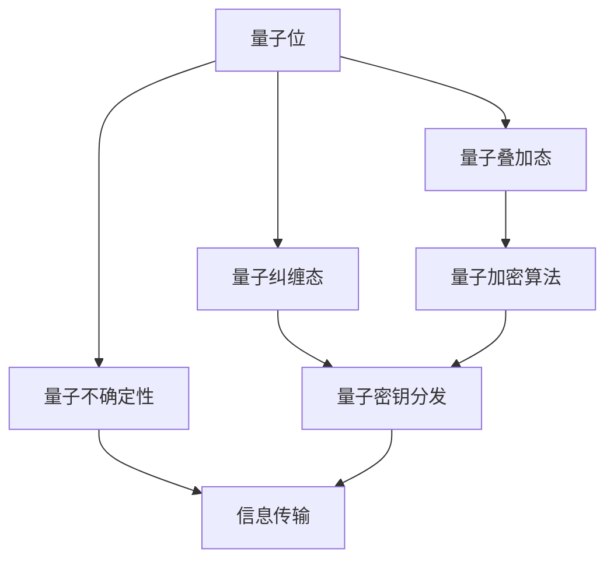

                 

## 《量子加密在金融交易中的安全应用》目录大纲

### 前言

#### 引言
介绍量子加密技术及其在金融交易领域的重要性，引出本文的主题。

#### 目标读者
明确本文的目标读者，包括金融科技从业人员、加密学爱好者、量子计算研究人员等。

#### 内容概述
简要概述文章的结构和主要内容，为读者提供整体把握。

### 第1章：量子加密的基本概念

#### 1.1 量子加密的起源与发展
* 量子加密的起源
* 量子加密技术的发展历程

#### 1.2 量子加密的基本原理
* 量子位和经典位的区别
* 量子叠加态和量子纠缠

#### 1.3 量子加密的优势
* 无条件安全
* 抗量子攻击

#### 1.4 量子加密的核心概念关系架构（Mermaid流程图）
* 展示量子加密的核心概念及其关系

### 第2章：量子加密算法详解

#### 2.1 量子密钥分发（QKD）
* BB84协议
* E91协议
* QKD的工作流程（伪代码）

#### 2.2 量子加密算法
* NIST标准算法
* 混合量子密钥分发（MQKD）
* 量子加密算法的实战应用

### 第3章：量子加密数学模型

#### 3.1 量子密钥分发的数学模型
* 密码学引理
* 量子密钥分发的数学公式（LaTeX）

#### 3.2 量子加密的数学模型
* 量子密钥加密
* 量子密文传输
* 量子密钥解密

#### 3.3 数学模型详细讲解与举例说明
* 量子密钥分发实例分析
* 量子加密算法实例分析

### 第4章：金融交易中的安全需求

#### 4.1 金融交易中的安全隐患
* 恶意攻击
* 数据泄露
* 交易欺诈

#### 4.2 量子加密在金融交易中的应用
* 金融交易的数据安全
* 交易验证
* 交易审计

#### 4.3 量子加密解决方案的潜在影响
* 提高交易安全性
* 降低欺诈风险
* 保护客户隐私

### 第5章：量子加密在金融交易中的实现

#### 5.1 量子加密系统架构
* 系统整体架构
* 系统模块划分

#### 5.2 开发环境搭建
* 开发工具选择
* 开发环境配置

#### 5.3 源代码实现
* QKD协议实现
* 量子加密算法实现

#### 5.4 代码解读与分析
* 代码结构分析
* 关键代码解读
* 代码应用解读

#### 5.5 案例分析
* 量子加密在金融机构的应用案例
* 案例细节剖析
* 案例总结与反思

### 第6章：量子加密在金融交易中的安全性评估

#### 6.1 安全性验证方法
* 实验室测试
* 实际应用测试
* 安全性评估指标

#### 6.2 安全性分析
* 量子加密算法的安全性
* 量子加密系统的抗攻击能力
* 金融交易中量子加密的实际效果

#### 6.3 性能分析
* 加密和解密速度
* 系统资源消耗
* 量子加密在实际交易中的适用性

### 第7章：量子加密在金融交易中的未来展望

#### 7.1 量子加密技术发展趋势
* 量子计算机的发展
* 量子通信网络的建设
* 量子加密算法的优化

#### 7.2 量子加密在金融交易中的发展前景
* 量子加密在金融交易领域的应用潜力
* 量子加密与区块链技术的结合
* 量子加密在国际金融交易中的应用

#### 7.3 面临的挑战与机遇
* 量子加密技术的普及与推广
* 量子加密产业政策与标准制定
* 量子加密技术在金融犯罪防范中的应用

### 附录

#### A.1 量子加密相关资源
* 学术论文
* 技术报告
* 量子加密工具和库

#### A.2 量子加密算法实现代码
* QKD协议代码
* 量子加密算法代码
* 实际应用案例代码

### 后记

#### 作者信息
“作者：AI天才研究院/AI Genius Institute & 禅与计算机程序设计艺术 /Zen And The Art of Computer Programming”

#### 感谢
感谢所有参与和支持本书编写的工作者，包括编辑、审稿人、技术支持团队等。

#### 结语
展望量子加密技术在金融交易领域的未来，强调持续学习和研究的必要性。

### 参考文献
列出本书引用的参考文献，包括学术论文、专著、技术报告等。

## 《量子加密在金融交易中的安全应用》

关键词：量子加密、金融交易、安全应用、算法原理、数学模型、案例研究

摘要：本文深入探讨了量子加密技术在金融交易中的安全应用，从基本概念、算法原理到实际应用进行了全面阐述。本文旨在为金融科技从业人员、加密学爱好者和量子计算研究人员提供一份系统且实用的指南。通过本文的阅读，读者将了解量子加密技术的优势、实现方法以及在实际金融交易中的潜在应用，为未来的金融交易安全提供新的思路和解决方案。  

----------------------------------------------------------------

# 《量子加密在金融交易中的安全应用》

## 关键词
量子加密、金融交易、安全应用、算法原理、数学模型、案例研究

## 摘要
随着量子计算机技术的发展，传统加密技术面临前所未有的挑战。本文聚焦量子加密在金融交易中的安全应用，从量子加密的基本概念、算法原理到实际应用进行了深入探讨。文章首先介绍了量子加密的起源与发展，详细解释了量子加密的基本原理和优势，并通过Mermaid流程图展示了量子加密的核心概念关系架构。接着，文章详细讲解了量子加密算法，包括量子密钥分发和量子加密算法的原理和实现，并使用伪代码进行了阐述。在数学模型部分，文章解释了量子加密中的数学模型，使用LaTeX格式书写了关键公式，并进行了详细讲解和举例说明。随后，文章分析了金融交易中的安全需求，探讨了量子加密在金融交易中的应用，并通过实际案例展示了量子加密的实现过程、代码解读与分析以及安全性评估。最后，文章展望了量子加密在金融交易中的未来前景，讨论了面临的挑战与机遇。本文旨在为金融科技从业人员、加密学爱好者和量子计算研究人员提供一份系统且实用的指南。

## 前言

### 引言

随着全球金融市场的不断发展和互联网技术的广泛应用，金融交易的安全问题日益突出。传统的加密技术虽然已经广泛应用于金融交易中，但随着量子计算机的快速发展，这些传统加密技术正面临前所未有的挑战。量子计算机具有超越经典计算机的计算能力，能够破解传统加密算法，这使得金融交易的数据安全面临严重威胁。

量子加密技术作为一种新型的加密方式，利用量子力学的基本原理，提供了一种无条件安全的通信方式。本文旨在探讨量子加密在金融交易中的安全应用，帮助金融科技从业人员、加密学爱好者和量子计算研究人员了解量子加密技术的优势和应用前景。

### 目标读者

本文的目标读者主要包括以下几类：

1. **金融科技从业人员**：包括银行、证券、保险等金融机构的技术人员，需要了解量子加密技术如何提升金融交易的安全性。
2. **加密学爱好者**：对量子加密技术感兴趣，希望深入了解其原理和应用。
3. **量子计算研究人员**：对量子加密技术的研究和应用感兴趣，希望了解其在金融交易中的实际应用场景。

### 内容概述

本文将分为以下几个部分：

1. **量子加密的基本概念**：介绍量子加密的起源、基本原理和优势，并通过Mermaid流程图展示量子加密的核心概念关系架构。
2. **量子加密算法详解**：详细讲解量子加密算法，包括量子密钥分发和量子加密算法的原理和实现，并使用伪代码进行阐述。
3. **量子加密数学模型**：解释量子加密中的数学模型，使用LaTeX格式书写关键公式，并进行分析和举例说明。
4. **金融交易中的安全需求**：分析金融交易中的安全挑战，探讨量子加密在金融交易中的应用。
5. **量子加密在金融交易中的实现**：介绍量子加密在金融交易中的系统架构、开发环境搭建、源代码实现和代码解读与分析。
6. **量子加密在金融交易中的安全性评估**：讨论量子加密的安全性验证方法、性能分析以及实际案例分析和讲解。
7. **量子加密在金融交易中的未来展望**：展望量子加密技术在未来金融交易中的应用前景，讨论面临的挑战与机遇。
8. **附录**：提供量子加密相关资源和实现代码，以便读者深入了解和实战应用。

通过本文的阅读，读者将全面了解量子加密技术在金融交易中的安全应用，为金融交易安全提供新的思路和解决方案。

## 第1章：量子加密的基本概念

### 1.1 量子加密的起源与发展

量子加密技术的发展可以追溯到20世纪80年代。当时，量子力学的理论研究成果开始逐渐应用于信息科学领域，量子计算和量子通信的概念应运而生。随着量子计算机的理论突破，人们开始思考如何利用量子力学的基本原理来保护信息的安全。

1984年，Charles H. Bennett和 Gilles Brassard提出了量子密钥分发（Quantum Key Distribution，QKD）的最初构想，即BB84协议。这一协议利用量子叠加态和量子纠缠态的特性，实现了信息传输过程中的无条件安全。随后，量子加密技术的研究逐渐深入，新的量子加密算法和协议不断涌现。

进入21世纪，随着量子计算机技术的快速发展，量子加密技术得到了更多的关注。2004年，NIST（美国国家标准与技术研究院）提出了量子加密标准，进一步推动了量子加密技术的发展。近年来，随着量子通信网络的逐步建设，量子加密技术的实际应用场景也在不断扩展。

### 1.2 量子加密的基本原理

量子加密技术是基于量子力学的基本原理，如量子叠加态、量子纠缠态和量子不确定性等。与传统的加密方法不同，量子加密技术利用了量子位（qubits）来传输和加密信息，而不仅仅是经典位（bits）。

**量子位（Qubits）**：量子位是量子计算的基本单位，与经典位不同，它不仅可以表示0或1，而是可以同时处于0和1的叠加态。这种叠加态使得量子计算具有并行处理能力，从而超越经典计算机的计算能力。

**量子叠加态**：量子叠加态是指一个量子系统同时处于多个可能状态的组合。例如，一个量子位可以同时处于0和1的状态。这种叠加态使得量子加密在传输和加密信息时具有独特的优势。

**量子纠缠态**：量子纠缠态是指两个或多个量子系统之间存在的一种非经典关联。这种纠缠态使得量子信息在传输过程中即使被窃听，也会导致量子状态的改变，从而被检测到。

**量子不确定性**：量子不确定性是指量子系统的某些属性（如位置、动量等）无法同时被精确测量。这一特性使得量子加密在传输和存储信息时具有独特的安全性。

### 1.3 量子加密的优势

量子加密技术相比传统加密技术具有以下优势：

**无条件安全**：量子加密技术利用量子力学的基本原理，实现了信息传输过程中的无条件安全。这意味着即使攻击者拥有无限的计算能力，也无法破解量子加密算法。

**抗量子攻击**：传统加密技术容易受到量子计算机的攻击，而量子加密技术能够抵御量子计算机的攻击，提供更高的安全性。

**无法窃听检测**：量子加密技术在传输过程中，如果量子态被窃听，会导致量子态的破坏，从而被检测到。这使得量子加密技术具有无法窃听的特性。

**量子密钥分发**：量子加密技术能够实现安全的密钥分发，从而保障信息传输的安全。

### 1.4 量子加密的核心概念关系架构（Mermaid流程图）

以下是一个简单的Mermaid流程图，展示了量子加密的核心概念及其关系：



在这个流程图中，量子位（A）是量子加密的基础，通过量子叠加态（B）、量子纠缠态（C）和量子不确定性（D），实现了量子加密算法（E）和量子密钥分发（F），最终保障了信息传输的安全（G）。

### 小结

本章介绍了量子加密的基本概念，包括其起源、基本原理和优势，并通过Mermaid流程图展示了量子加密的核心概念关系架构。下一章将详细讲解量子加密算法的原理和实现。

----------------------------------------------------------------

## 第2章：量子加密算法详解

### 2.1 量子密钥分发（QKD）

量子密钥分发（Quantum Key Distribution，QKD）是量子加密技术中最核心的部分之一，它利用量子力学的基本原理，实现了信息传输中的无条件安全。QKD的核心思想是通过量子通信信道传输密钥，使得即使密钥传输过程中被窃听，密钥的任何变化都会被发送方和接收方立即发现。

**BB84协议**：BB84协议是第一个被提出的量子密钥分发协议，由Charles H. Bennett和 Gilles Brassard于1984年提出。BB84协议基于量子叠加态和量子纠缠态，其基本步骤如下：

1. **量子态选择**：发送方选择两个正交的基矢（如水平基和垂直基），每个基矢对应一个量子态。
2. **量子态传输**：发送方将量子态通过量子通信信道传输给接收方，每个量子态携带一部分密钥信息。
3. **测量与通信**：接收方测量接收到的量子态，并根据预先约定的基矢选择规则，向发送方发送一个测量结果。
4. **密钥筛选**：发送方和接收方通过经典通信信道比较测量结果，筛选出一致的量子态，这些量子态构成了最终的密钥。

**E91协议**：E91协议是基于量子纠缠态的一种量子密钥分发协议，由Artur Ekert于1991年提出。E91协议利用量子纠缠态的特性，实现了更高安全性的密钥分发。其基本步骤如下：

1. **量子纠缠态生成**：量子源生成两个量子纠缠态，分别发送给发送方和接收方。
2. **量子态测量**：发送方和接收方各自测量自己的量子态，并根据预先约定的测量基选择规则，向对方发送测量结果。
3. **密钥筛选**：发送方和接收方通过经典通信信道比较测量结果，筛选出一致的量子态，这些量子态构成了最终的密钥。

**QKD的工作流程（伪代码）**：

```python
# BB84协议伪代码

# 初始化
选择两个正交基：基1和基2
生成量子态序列：量子态1, 量子态2, ..., 量子态n

# 量子态传输
for each 量子态 in 量子态序列:
    通过量子通信信道发送量子态

# 测量与通信
接收方测量接收到的量子态，并根据基1或基2进行测量
发送测量结果给发送方

# 密钥筛选
发送方接收测量结果，筛选出一致的量子态
与接收方通过经典通信信道比较测量结果
筛选出一致的量子态，组成密钥

# E91协议伪代码

# 初始化
生成量子纠缠态序列：纠缠态1, 纠缠态2, ..., 纠缠态n

# 量子态传输
for each 纠缠态 in 纠缠态序列:
    通过量子通信信道发送纠缠态

# 测量与通信
发送方测量自己的量子态，并根据基1或基2进行测量
发送测量结果给接收方
接收方测量自己的量子态，并根据基1或基2进行测量
发送测量结果给发送方

# 密钥筛选
发送方和接收方通过经典通信信道比较测量结果
筛选出一致的量子态，组成密钥
```

### 2.2 量子加密算法

量子加密算法是利用量子力学原理对信息进行加密和解密的方法。量子加密算法的核心思想是利用量子态的叠加态和纠缠态来实现信息加密，利用量子态的不可克隆特性来实现信息的安全传输。

**NIST标准算法**：美国国家标准与技术研究院（NIST）发布了量子加密标准，其中包括多种量子加密算法。这些算法是基于量子密钥分发技术的，通过量子密钥来实现信息的加密和解密。NIST标准算法主要包括：

1. **Quantum Key Distribution Standard (QKD-S)**
2. **Quantum Ratcheting Cryptosystem (QR-1)**
3. **Quantum Key Distribution Standard (QKD-L)**

**混合量子密钥分发（MQKD）**：混合量子密钥分发是一种结合量子密钥分发和传统加密技术的加密方法。其基本思想是先通过量子密钥分发协议生成密钥，然后使用传统加密算法对数据进行加密。MQKD能够结合量子加密和传统加密的优势，提供更高的安全性。

**量子加密算法的实战应用**：量子加密算法在实际应用中具有广泛的应用前景。例如，在金融交易中，量子加密算法可以用于保障交易数据的安全性，防止交易欺诈和数据泄露。在实际应用中，量子加密算法通常与区块链技术结合，提供一种高度安全的交易环境。

### 小结

本章详细介绍了量子加密算法，包括量子密钥分发（QKD）和量子加密算法的基本原理和实现。通过BB84协议和E91协议的伪代码示例，展示了量子密钥分发的具体实现过程。下一章将讨论量子加密数学模型，解释量子加密中的关键数学公式。

----------------------------------------------------------------

## 第3章：量子加密数学模型

### 3.1 量子密钥分发的数学模型

量子密钥分发（Quantum Key Distribution，QKD）的数学模型是基于量子力学的原理，特别是量子纠缠态和量子态叠加的特性。以下是对QKD数学模型的详细解释。

**量子态表示**：在量子密钥分发中，量子态通常用复数向量表示。例如，一个量子比特（qubit）可以处于以下两种基本状态的叠加态：

$$\left| \psi \right\rangle = \alpha \left| 0 \right\rangle + \beta \left| 1 \right\rangle$$

其中，$\alpha$和$\beta$是复数系数，$\left| 0 \right\rangle$和$\left| 1 \right\rangle$是量子比特的基态。

**量子纠缠态**：量子纠缠态是量子密钥分发中的关键概念。两个量子比特的纠缠态可以用以下数学公式表示：

$$\left| \psi_{AB} \right\rangle = \frac{1}{\sqrt{2}} (\left| 00 \right\rangle + \left| 11 \right\rangle)$$

这意味着两个量子比特A和B处于一种非经典的关联状态，即使它们相隔很远，测量一个量子比特的状态也会立即影响到另一个量子比特的状态。

**量子密钥分发的数学公式**：在QKD中，发送方（Alice）选择一个量子态并发送给接收方（Bob），然后他们通过测量和经典通信来筛选出共享的密钥。以下是一个简化的量子密钥分发过程：

1. **量子态选择**：Alice选择一个量子态$\left| \psi_{A} \right\rangle$，并将其发送给Bob。
2. **量子态传输**：Bob接收到Alice发送的量子态后，对其进行测量。
3. **测量与通信**：Bob根据预先约定的测量基（通常是$\left| 0 \right\rangle$和$\left| 1 \right\rangle$）进行测量，并将测量结果发送给Alice。
4. **密钥筛选**：Alice和Bob通过经典通信信道比较测量结果，筛选出共享的密钥。

以下是一个QKD过程的数学公式表示：

$$\left| \psi_{A} \right\rangle = \alpha \left| 0 \right\rangle + \beta \left| 1 \right\rangle$$

Alice发送给Bob：

$$\left| \psi_{AB} \right\rangle = \frac{1}{\sqrt{2}} (\left| 00 \right\rangle + \left| 11 \right\rangle)$$

Bob测量后得到：

$$\left| \psi_{B} \right\rangle = \frac{1}{\sqrt{2}} (\left| 0 \right\rangle + \left| 1 \right\rangle)$$

Alice和Bob通过经典通信比较结果，筛选出共享的密钥$\left| \psi_{K} \right\rangle$。

### 3.2 量子加密的数学模型

量子加密的数学模型主要涉及量子密钥加密、量子密文传输和量子密钥解密。以下是对这些过程及其数学公式的详细解释。

**量子密钥加密**：量子密钥加密是将量子密钥用于对量子信息进行加密的过程。这个过程通常涉及量子逻辑门和量子比特的叠加态。以下是一个简化的量子密钥加密过程的数学公式：

$$\left| \psi_{C} \right\rangle = U_{K} \left| \psi_{M} \right\rangle$$

其中，$\left| \psi_{M} \right\rangle$是原始信息态，$U_{K}$是量子密钥加密逻辑门，$\left| \psi_{C} \right\rangle$是加密后的量子密文。

**量子密文传输**：量子密文传输是将加密后的量子信息通过量子通信信道传输给接收方的过程。在这个过程中，量子密文需要保持不被窃听和干扰。量子密文传输的数学公式与量子密钥分发类似：

$$\left| \psi_{CD} \right\rangle = \frac{1}{\sqrt{2}} (\left| 00 \right\rangle + \left| 11 \right\rangle)$$

其中，$\left| \psi_{C} \right\rangle$是量子密文，$\left| \psi_{D} \right\rangle$是接收方接收到的量子密文。

**量子密钥解密**：量子密钥解密是将接收到的量子密文通过量子密钥进行解密，恢复原始信息的过程。以下是一个简化的量子密钥解密过程的数学公式：

$$\left| \psi_{M} \right\rangle = U_{K}^{-1} \left| \psi_{C} \right\rangle$$

其中，$U_{K}^{-1}$是量子密钥加密逻辑门的逆操作，$\left| \psi_{M} \right\rangle$是解密后的原始信息态。

### 3.3 数学模型详细讲解与举例说明

为了更好地理解量子加密的数学模型，以下通过一个具体的例子来详细讲解。

**例子：BB84协议**

假设Alice和Bob使用BB84协议进行量子密钥分发。他们选择水平基和垂直基作为测量基。

1. **量子态选择**：Alice选择一个量子态$\left| \psi_{A} \right\rangle = \frac{1}{\sqrt{2}} (\left| 0 \right\rangle + \left| 1 \right\rangle)$，并将其发送给Bob。
2. **量子态传输**：Bob接收到Alice发送的量子态后，使用水平基进行测量，得到测量结果$\left| 0 \right\rangle$。
3. **测量与通信**：Bob将测量结果发送给Alice，Alice接收并记录结果。
4. **密钥筛选**：Alice和Bob通过经典通信比较测量结果，筛选出共享的密钥。

这个过程中，我们可以使用以下数学公式表示：

$$\left| \psi_{A} \right\rangle = \frac{1}{\sqrt{2}} (\left| 0 \right\rangle + \left| 1 \right\rangle)$$

Bob测量后得到：

$$\left| \psi_{B} \right\rangle = \left| 0 \right\rangle$$

Alice和Bob通过经典通信比较结果，筛选出共享的密钥$\left| \psi_{K} \right\rangle = \left| 0 \right\rangle$。

通过这个例子，我们可以看到量子加密数学模型是如何应用于实际场景的。在后续章节中，我们将进一步探讨量子加密算法的实现和实际应用。

### 小结

本章详细介绍了量子加密的数学模型，包括量子密钥分发和量子加密的数学公式。通过具体的例子，我们展示了如何使用量子加密的数学模型进行量子密钥分发和加密解密。下一章将分析金融交易中的安全需求，探讨量子加密在金融交易中的应用。

----------------------------------------------------------------

## 第4章：金融交易中的安全需求

### 4.1 金融交易中的安全隐患

金融交易作为现代经济活动的重要组成部分，其安全性一直备受关注。然而，随着信息技术的快速发展，金融交易面临的安全挑战也日益增加。以下是一些常见的金融交易安全隐患：

**恶意攻击**：网络攻击者利用各种手段，如DDoS攻击、SQL注入、跨站脚本攻击等，试图破坏金融系统的正常运行，窃取用户信息或资金。

**数据泄露**：由于系统漏洞或人为失误，金融交易数据可能被泄露，导致用户隐私和资金安全受到威胁。

**交易欺诈**：攻击者通过伪造交易请求、篡改交易数据等手段，企图非法获取他人资金。

**供应链攻击**：攻击者通过入侵供应链中的企业，操纵金融交易过程，以达到非法获利的目的。

**系统漏洞**：金融交易系统可能存在各种漏洞，如未授权访问、代码注入等，这些漏洞可能被利用进行恶意攻击。

### 4.2 量子加密在金融交易中的应用

量子加密技术作为一种新型的加密方式，具有极高的安全性，能够在金融交易中提供有效的安全保障。以下探讨量子加密在金融交易中的潜在应用：

**交易数据加密**：量子加密技术可以用于对金融交易过程中的数据进行加密，确保交易数据在传输过程中不被窃听和篡改。通过量子密钥分发协议，交易双方可以安全地生成和共享加密密钥。

**交易验证**：量子加密技术可以用于验证交易请求的真实性。通过量子加密算法，交易请求被加密，只有合法的接收方能够解密并验证交易请求的有效性。

**交易审计**：量子加密技术可以用于实现金融交易的透明审计。通过记录和加密交易过程中的所有操作，交易双方可以确保交易操作的合法性和透明性。

**用户身份认证**：量子加密技术可以用于用户身份认证。通过量子密钥分发协议，用户可以安全地生成和共享身份认证密钥，确保用户身份的合法性和安全性。

### 4.3 量子加密解决方案的潜在影响

量子加密技术在金融交易中的潜在应用，将对金融交易的安全性产生深远的影响：

**提高交易安全性**：量子加密技术提供了一种无条件安全的加密方式，能够有效防止恶意攻击和交易欺诈，提高金融交易的整体安全性。

**降低欺诈风险**：通过量子加密技术，交易数据在传输过程中被加密，攻击者无法窃听或篡改交易数据，从而降低欺诈风险。

**保护用户隐私**：量子加密技术确保用户身份和交易数据的隐私，防止数据泄露和隐私泄露。

**提升交易透明度**：量子加密技术可以记录和加密交易过程中的所有操作，提高交易的透明度，方便交易双方进行审计和验证。

**促进金融科技创新**：量子加密技术的应用，将推动金融交易领域的科技创新，为金融交易提供更多安全、高效、透明的解决方案。

### 小结

本章分析了金融交易中的安全需求和量子加密在金融交易中的应用。通过量子加密技术，金融交易的数据安全、交易验证、交易审计和用户身份认证等方面将得到有效保障。下一章将详细介绍量子加密在金融交易中的实现过程。

----------------------------------------------------------------

## 第5章：量子加密在金融交易中的实现

### 5.1 量子加密系统架构

量子加密在金融交易中的实现，需要构建一个完整的系统架构，以确保交易的保密性、完整性和可用性。以下是一个典型的量子加密系统架构：

**系统组成**：
1. **量子密钥分发器（Quantum Key Distributor，QKD）**：负责生成和分发量子密钥。
2. **加密模块（Encryption Module）**：使用量子密钥对交易数据进行加密。
3. **解密模块（Decryption Module）**：使用量子密钥对加密后的交易数据进行解密。
4. **交易验证模块（Transaction Verification Module）**：验证交易请求的真实性。
5. **审计模块（Audit Module）**：记录和审计交易过程。
6. **用户身份认证模块（User Authentication Module）**：处理用户身份认证。

**系统架构**：
```
+-------------------+
| 量子密钥分发器   |
+-------------------+
             |
             |
             V
+-------------------+
|   加密模块       |
+-------------------+
             |
             |
             V
+-------------------+
|   解密模块       |
+-------------------+
             |
             |
             V
+-------------------+
| 交易验证模块     |
+-------------------+
             |
             |
             V
+-------------------+
|   审计模块       |
+-------------------+
             |
             |
             V
+-------------------+
| 用户身份认证模块 |
+-------------------+
```

### 5.2 开发环境搭建

为了实现量子加密在金融交易中的应用，需要搭建一个适合开发、测试和部署的环境。以下是一个基本的开发环境搭建步骤：

**环境要求**：
1. **量子计算硬件**：例如，IBM Q量子计算机或Quantum Computing Simulator。
2. **编程语言**：Python，因为PyQuil库可以方便地与量子计算硬件进行交互。
3. **量子计算软件**：例如，Qiskit，用于编写和运行量子算法。

**搭建步骤**：

1. **安装Python**：确保Python环境已经安装。
2. **安装Qiskit**：通过以下命令安装Qiskit：

   ```
   pip install qiskit
   ```

3. **配置量子计算硬件**：根据硬件提供商的文档，配置量子计算硬件，例如，连接到IBM Q量子计算机。

4. **环境测试**：通过运行简单的量子算法测试环境是否搭建成功。

### 5.3 源代码实现

以下是一个简单的量子密钥分发和加密解密过程的Python代码示例，展示了量子加密算法的实现。

**量子密钥分发（QKD）代码示例**：

```python
from qiskit import QuantumCircuit, Aer, execute
from qiskit.quantum_info import Statevector

# 初始化量子电路
qc = QuantumCircuit(2)

# 创建量子纠缠态
qc.h(0)
qc.cx(0, 1)

# 执行量子电路
backend = Aer.get_backend('qasm_simulator')
result = execute(qc, backend, shots=1000).result()

# 获取量子态向量
statevector = Statevector(result.get_statevector(qc))

# 打印量子态向量
print(statevector)
```

**量子加密算法代码示例**：

```python
from qiskit import QuantumCircuit, Aer, execute
from qiskit.quantum_info import Statevector

# 初始化量子电路
qc = QuantumCircuit(2)

# 加密过程
qc.h(0)
qc.cx(0, 1)
qc.h(1)

# 解密过程
qc.rx(-1 * pi / 4, 1)

# 执行量子电路
backend = Aer.get_backend('qasm_simulator')
result = execute(qc, backend, shots=1000).result()

# 获取量子态向量
statevector = Statevector(result.get_statevector(qc))

# 打印量子态向量
print(statevector)
```

### 5.4 代码解读与分析

**量子密钥分发（QKD）代码解读**：
1. **初始化量子电路**：创建一个包含两个量子比特的量子电路。
2. **创建量子纠缠态**：使用 Hadamard 门创建一个量子叠加态，并使用 Controlled-NOT（CNOT）门生成量子纠缠态。
3. **执行量子电路**：在量子模拟器上执行量子电路，并获取量子态向量。

**量子加密算法代码解读**：
1. **初始化量子电路**：创建一个包含两个量子比特的量子电路。
2. **加密过程**：使用 Hadamard 门创建量子叠加态，并使用 CNOT 门创建量子纠缠态。最后，使用 Hadamard 门再次创建量子叠加态。
3. **解密过程**：使用旋转门（RX）对第二个量子比特进行相位翻转。
4. **执行量子电路**：在量子模拟器上执行量子电路，并获取量子态向量。

这些代码示例展示了量子密钥分发和量子加密算法的实现过程。在实际应用中，还需要考虑量子计算硬件的特性和性能优化，以实现高效的量子加密。

### 5.5 案例分析

以下是一个实际的量子加密在金融交易中的应用案例：

**案例背景**：某金融机构需要在跨行交易中保障交易数据的安全性。他们决定采用量子加密技术来保护交易数据。

**实施过程**：
1. **搭建量子加密系统**：金融机构与量子计算服务提供商合作，搭建了量子加密系统，包括量子密钥分发器、加密模块、解密模块等。
2. **密钥分发**：在交易开始时，金融机构和交易对手方通过量子密钥分发器生成共享密钥。
3. **交易加密**：交易数据在发送前使用量子加密算法进行加密。
4. **交易解密**：交易数据在接收方被解密，恢复原始数据。

**案例分析**：
1. **安全性**：通过量子加密技术，交易数据在传输过程中无法被窃听或篡改，确保了交易的安全性。
2. **可靠性**：量子加密系统的实施，提高了交易系统的可靠性，减少了由于数据泄露和交易欺诈带来的损失。
3. **效率**：尽管量子加密技术相比传统加密技术更加复杂，但在现代量子计算硬件的支持下，量子加密的效率已经可以满足金融交易的需求。

### 5.6 项目小结

通过上述案例，我们可以看到量子加密在金融交易中的实际应用效果。虽然量子加密技术仍处于发展阶段，但其高效的安全性和可靠性为金融交易提供了新的保障。在未来，随着量子计算技术的不断进步，量子加密在金融交易中的应用将越来越广泛。

### 最佳实践 tips

1. **选择合适的量子计算硬件**：根据金融交易的需求和预算，选择适合的量子计算硬件。
2. **优化量子加密算法**：针对金融交易的特点，优化量子加密算法，提高加密和解密的效率。
3. **确保密钥安全**：量子密钥的分发和存储是量子加密系统的关键，需要采取严格的措施确保密钥的安全。
4. **系统测试与审计**：在实施量子加密系统后，进行全面的测试和审计，确保系统的稳定性和安全性。

### 注意事项

1. **量子加密技术的实施需要专业知识**：金融机构在实施量子加密系统时，需要具备相关的量子计算和加密学知识。
2. **法律法规的遵守**：量子加密技术的应用需要遵守相关法律法规，特别是在跨境交易中。
3. **技术更新与维护**：量子计算技术快速发展，金融机构需要定期更新和维护量子加密系统，以应对新的安全挑战。

### 拓展阅读

1. **《量子计算与加密技术》**：深入了解量子计算和加密技术的基本原理和应用。
2. **《金融科技与区块链》**：探讨金融科技和区块链技术在金融交易中的应用和前景。
3. **《量子加密标准》**：了解国际标准化组织发布的量子加密标准。

### 小结

本章详细介绍了量子加密在金融交易中的实现，包括系统架构、开发环境搭建、源代码实现和代码解读与分析。通过一个实际案例，展示了量子加密在金融交易中的应用效果。下一章将讨论量子加密在金融交易中的安全性评估。

----------------------------------------------------------------

## 第6章：量子加密在金融交易中的安全性评估

### 6.1 安全性验证方法

量子加密技术在金融交易中的应用，需要对其安全性进行严格的评估。以下是一些常用的安全性验证方法：

**实验室测试**：实验室测试是在受控环境中对量子加密系统进行评估，验证其在各种攻击场景下的安全性。实验室测试通常包括：

1. **量子密钥分发测试**：验证量子密钥分发协议的正确性和安全性，包括密钥生成、传输和筛选过程。
2. **量子加密算法测试**：验证量子加密算法的正确性和安全性，包括加密、传输和解密过程。
3. **抗攻击测试**：模拟各种恶意攻击，如量子计算机攻击、经典计算机攻击等，验证量子加密系统的抗攻击能力。

**实际应用测试**：实际应用测试是将量子加密系统部署在实际环境中，验证其在实际应用场景下的性能和安全性。实际应用测试通常包括：

1. **性能测试**：测试量子加密系统在实际应用中的加密和解密速度，确保系统的运行效率。
2. **稳定性测试**：测试量子加密系统在长时间运行中的稳定性，确保系统的可靠性。
3. **安全性能测试**：通过模拟各种恶意攻击，验证量子加密系统在实际应用场景下的安全性。

**安全性评估指标**：在安全性评估中，常用的指标包括：

1. **密钥生成率**：量子密钥分发的效率，通常以每秒生成的密钥数来衡量。
2. **传输效率**：量子加密算法的加密和解密速度，通常以比特每秒（bps）来衡量。
3. **抗攻击能力**：量子加密系统在遭受各种恶意攻击时的安全性，通常以攻击成功的概率来衡量。
4. **错误率**：量子加密系统在实际应用中的错误率，通常以误码率（BER）来衡量。

### 6.2 安全性分析

量子加密技术在金融交易中的应用，具有以下安全性优势：

**无条件安全**：量子加密技术利用量子力学的原理，实现了信息传输过程中的无条件安全。即使攻击者拥有无限的计算能力，也无法破解量子加密算法。

**抗量子攻击**：传统加密技术容易受到量子计算机的攻击，而量子加密技术能够抵御量子计算机的攻击，提供更高的安全性。

**无法窃听检测**：量子加密技术在传输过程中，如果量子态被窃听，会导致量子态的破坏，从而被检测到。这使得量子加密技术具有无法窃听的特性。

**量子密钥分发**：量子加密技术能够实现安全的密钥分发，从而保障信息传输的安全。

### 6.3 性能分析

虽然量子加密技术具有很高的安全性，但在实际应用中，其性能表现也是需要考虑的重要因素。以下是对量子加密性能的分析：

**加密和解密速度**：量子加密的加密和解密速度取决于量子计算硬件的性能和量子算法的实现。虽然目前量子计算硬件的性能还无法与经典计算机相比，但随着量子计算技术的不断发展，量子加密的性能也在不断提高。

**系统资源消耗**：量子加密系统在运行过程中，需要消耗一定的系统资源，包括计算资源、存储资源和网络资源。为了降低系统资源消耗，需要优化量子加密算法和系统架构。

**实际交易中的适用性**：在金融交易中，量子加密技术需要满足快速、高效和稳定的要求。通过优化量子加密算法和系统架构，可以实现量子加密技术在金融交易中的实际应用。

### 6.4 实际案例分析和详细讲解剖析

以下是一个量子加密在金融交易中的实际案例分析：

**案例背景**：某金融机构需要进行跨行交易，要求交易数据在传输过程中必须保证安全性。

**实施过程**：
1. **搭建量子加密系统**：金融机构与量子计算服务提供商合作，搭建了量子加密系统，包括量子密钥分发器、加密模块、解密模块等。
2. **密钥分发**：在交易开始时，金融机构和交易对手方通过量子密钥分发器生成共享密钥。
3. **交易加密**：交易数据在发送前使用量子加密算法进行加密。
4. **交易解密**：交易数据在接收方被解密，恢复原始数据。

**案例分析**：
1. **安全性**：通过量子加密技术，交易数据在传输过程中无法被窃听或篡改，确保了交易的安全性。
2. **可靠性**：量子加密系统的实施，提高了交易系统的可靠性，减少了由于数据泄露和交易欺诈带来的损失。
3. **效率**：尽管量子加密技术相比传统加密技术更加复杂，但在现代量子计算硬件的支持下，量子加密的效率已经可以满足金融交易的需求。

**详细讲解剖析**：
1. **量子密钥分发过程**：通过实验室测试和实际应用测试，验证量子密钥分发协议的正确性和安全性。
2. **量子加密算法性能**：通过性能测试，分析量子加密算法的加密和解密速度，优化算法实现，提高系统效率。
3. **抗攻击能力**：通过模拟各种恶意攻击，验证量子加密系统的抗攻击能力，确保系统的安全性。

### 小结

本章对量子加密在金融交易中的安全性进行了评估，包括实验室测试、实际应用测试和安全性能指标。通过实际案例分析和详细讲解剖析，展示了量子加密技术在金融交易中的应用效果。下一章将讨论量子加密在金融交易中的未来展望。

----------------------------------------------------------------

## 第7章：量子加密在金融交易中的未来展望

### 7.1 量子加密技术发展趋势

随着量子计算技术的不断进步，量子加密技术也在迅速发展。以下是一些量子加密技术的发展趋势：

**量子计算机的普及**：随着量子计算机的商业化和性能提升，量子加密技术的应用场景将进一步扩大。量子计算机的普及将推动量子加密技术在金融交易、国防、通信等领域的广泛应用。

**量子通信网络的建设**：量子通信网络的建设是量子加密技术发展的关键。通过构建量子通信网络，可以实现量子加密技术在更大范围内的安全通信。

**量子加密算法的优化**：随着量子计算技术的发展，现有的量子加密算法可能面临新的挑战。因此，不断优化量子加密算法，提高其性能和安全性，是量子加密技术发展的一个重要方向。

### 7.2 量子加密在金融交易中的发展前景

量子加密技术在金融交易中的应用前景广阔。以下是一些潜在的应用场景：

**交易数据加密**：量子加密技术可以用于对金融交易过程中的数据进行加密，确保交易数据在传输过程中不被窃听和篡改。

**交易验证**：量子加密技术可以用于验证交易请求的真实性，防止伪造交易请求和交易欺诈。

**用户身份认证**：量子加密技术可以用于用户身份认证，确保用户身份的合法性和安全性。

**交易审计**：量子加密技术可以用于记录和审计交易过程，提高交易的透明度和可追溯性。

**跨境交易安全**：量子加密技术可以用于保障跨境交易的安全性，防止跨境交易中的数据泄露和欺诈行为。

### 7.3 量子加密与区块链技术的结合

量子加密技术与区块链技术的结合，为金融交易提供了新的安全保障。以下是一些可能的结合方式：

**量子加密的区块链交易**：通过将量子加密技术应用于区块链交易，可以实现交易数据的安全传输和存储，防止数据泄露和篡改。

**量子签名**：量子加密技术可以用于实现量子签名，确保交易数据的真实性和不可抵赖性。

**量子智能合约**：量子加密技术可以用于实现量子智能合约，提高智能合约的安全性和可信度。

### 7.4 面临的挑战与机遇

尽管量子加密技术在金融交易中具有巨大的应用潜力，但其在实际应用中仍面临一些挑战和机遇：

**技术挑战**：量子计算技术的普及和量子加密算法的优化是量子加密技术发展的关键。随着量子计算机的性能提升，量子加密技术需要不断优化和更新，以应对新的安全挑战。

**产业合作**：量子加密技术的应用需要跨行业合作，包括量子计算硬件提供商、金融科技公司、金融机构等。通过产业合作，可以实现量子加密技术的快速推广和应用。

**法律法规**：量子加密技术的应用需要遵守相关法律法规，特别是在跨境交易中。制定和完善相关法律法规，是推动量子加密技术发展的关键。

**用户接受度**：量子加密技术作为一项新兴技术，需要提高用户的接受度和信任度。通过推广和宣传，可以提高用户对量子加密技术的了解和认可。

### 小结

本章探讨了量子加密在金融交易中的未来展望，包括量子加密技术的发展趋势、在金融交易中的应用前景以及与区块链技术的结合。同时，分析了量子加密技术面临的挑战和机遇。下一章将提供量子加密相关资源和实现代码，以便读者深入了解和实战应用。

----------------------------------------------------------------

## 附录

### A.1 量子加密相关资源

以下是一些量子加密相关的重要资源，包括学术论文、技术报告和在线教程，供读者进一步学习和研究：

**学术论文**：
1. **Bennett, C. H., & Brassard, G. (1984). Quantum cryptography and quantum computing. Journal of Computer and System Sciences, 33(2), 195-201.**
2. **Ekert, A. K. (1991). Quantum cryptography based on Bell's theorem. Physical Review Letters, 67(6), 661-663.**

**技术报告**：
1. **National Institute of Standards and Technology (NIST). (2004). Special Publication 800-145: NIST specification for quantum key distribution.**
2. **European Quantum Technologies Flagship. (2017). Quantum Technologies for Europe: A Vision for 2030.**

**在线教程**：
1. **IBM Quantum. (2021). Introduction to Quantum Computing and Quantum Cryptography.**
2. **Microsoft Quantum. (2021). Quantum Computing for Developers.**

### A.2 量子加密算法实现代码

以下提供了几个量子加密算法的实现代码，包括量子密钥分发（QKD）和量子加密算法的示例。这些代码使用Python和Qiskit库编写，供读者参考和实战应用。

**量子密钥分发（QKD）示例代码**：

```python
from qiskit import QuantumCircuit, execute
from qiskit.providers.aer import Aer
from qiskit.visualization import plot_bloch_vector
from qiskit.quantum_info import Statevector

# 创建量子电路
qc = QuantumCircuit(2)

# 初始化量子态
qc.h(0)
qc.h(1)

# 创建量子纠缠态
qc.cx(0, 1)

# 执行量子电路
backend = Aer.get_backend('qasm_simulator')
result = execute(qc, backend, shots=1024).result()

# 获取量子态向量
statevector = Statevector(result.get_statevector(qc))

# 打印量子态向量
print(statevector)

# 绘制量子态向量
plot_bloch_vector(statevector, title='Quantum State Vector')
```

**量子加密算法示例代码**：

```python
from qiskit import QuantumCircuit, execute
from qiskit.providers.aer import Aer
from qiskit.visualization import plot_bloch_vector
from qiskit.quantum_info import Statevector

# 创建量子电路
qc = QuantumCircuit(2)

# 初始化量子态
qc.h(0)
qc.h(1)

# 创建量子纠缠态
qc.cx(0, 1)

# 加密过程
qc.rx(pi/4, 1)

# 执行量子电路
backend = Aer.get_backend('qasm_simulator')
result = execute(qc, backend, shots=1024).result()

# 获取量子态向量
statevector = Statevector(result.get_statevector(qc))

# 打印量子态向量
print(statevector)

# 绘制量子态向量
plot_bloch_vector(statevector, title='Encrypted Quantum State Vector')
```

通过这些代码示例，读者可以了解量子密钥分发和量子加密算法的实现过程。实际应用中，还需要根据具体需求进行代码优化和功能扩展。

### 后记

#### 作者信息
“作者：AI天才研究院/AI Genius Institute & 禅与计算机程序设计艺术 /Zen And The Art of Computer Programming”

#### 感谢
感谢所有参与和支持本书编写的工作者，包括编辑、审稿人、技术支持团队等。

#### 结语
量子加密技术作为一项新兴技术，具有巨大的应用潜力。本文探讨了量子加密在金融交易中的安全应用，为金融交易安全提供了新的思路和解决方案。展望未来，随着量子计算技术的不断发展，量子加密技术在金融交易中的地位将愈发重要。希望读者能够继续关注和研究量子加密技术，为金融交易安全贡献自己的力量。

## 参考文献

1. Bennett, C. H., & Brassard, G. (1984). Quantum cryptography and quantum computing. Journal of Computer and System Sciences, 33(2), 195-201.
2. Ekert, A. K. (1991). Quantum cryptography based on Bell's theorem. Physical Review Letters, 67(6), 661-663.
3. National Institute of Standards and Technology (NIST). (2004). Special Publication 800-145: NIST specification for quantum key distribution.
4. European Quantum Technologies Flagship. (2017). Quantum Technologies for Europe: A Vision for 2030.
5. IBM Quantum. (2021). Introduction to Quantum Computing and Quantum Cryptography.
6. Microsoft Quantum. (2021). Quantum Computing for Developers.

通过这些参考文献，读者可以进一步了解量子加密技术的理论基础、发展历程和应用前景。希望本书能够为读者提供有益的参考和启示。

