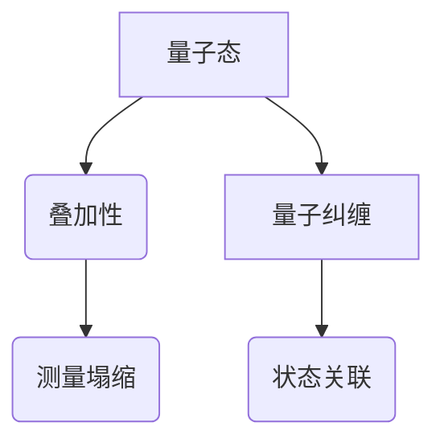
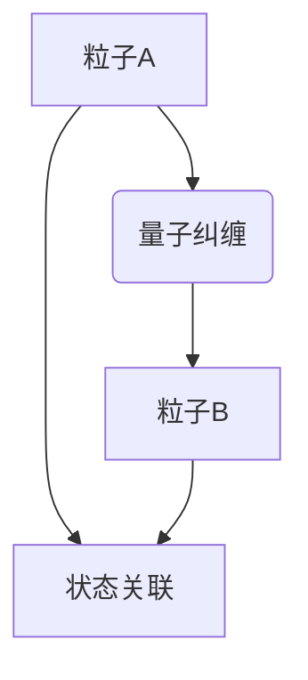
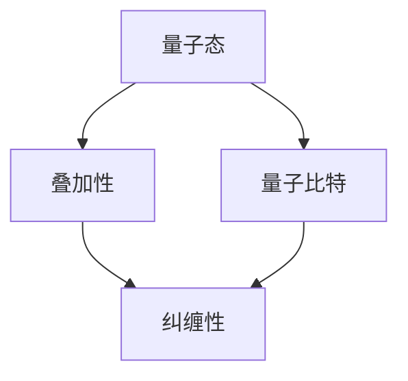
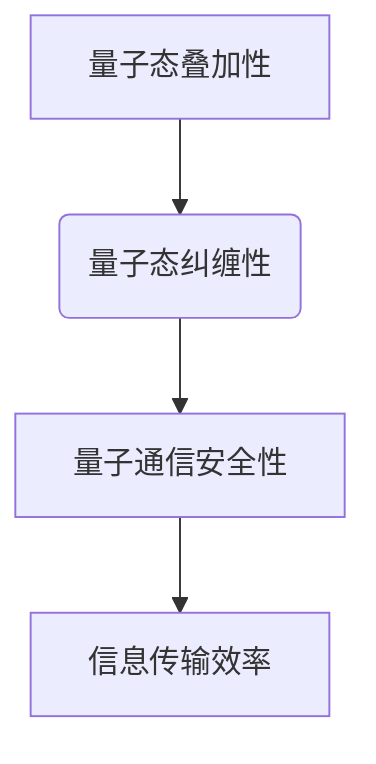
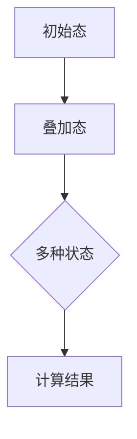
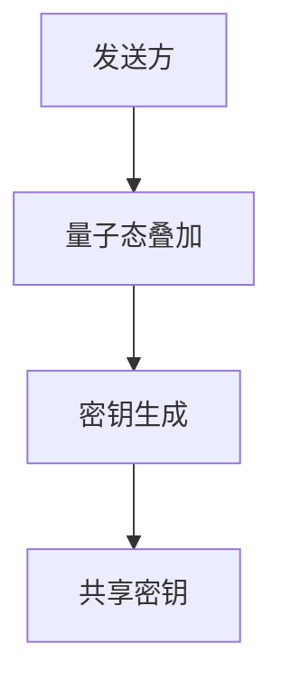
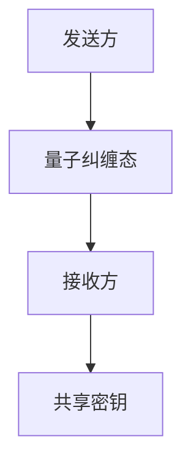
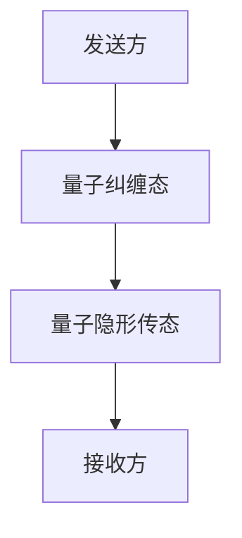
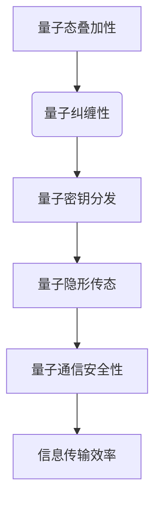

                 

# 文章标题：量子安全通信的发展前景

> 关键词：量子安全通信，发展前景，技术原理，应用场景，市场分析，未来趋势

> 摘要：本文旨在探讨量子安全通信的发展前景，从基础概念、技术原理、应用场景、市场分析到未来趋势，全面解析量子安全通信的现状与未来。通过分析量子密钥分发、量子隐形传态等技术原理，探讨量子安全通信在国家安全、商业安全和个人隐私保护等领域的应用，以及量子通信技术标准与法规的制定，最终预测量子安全通信的发展趋势。

## 第1章：量子安全通信基础

### 1.1 量子通信的基本概念

量子通信是一种基于量子力学原理的通信方式，它利用量子态传输信息，实现了信息传输的绝对安全。量子通信的核心是量子态，即粒子的状态。根据量子力学的特性，量子态具有叠加性和纠缠性，这些特性为量子通信提供了独特的安全保障。

#### 核心概念与联系

**量子态叠加性：** 粒子可以处于多种状态的叠加，直到测量时才会塌缩为一个确定的状态。

**量子态纠缠性：** 两个或多个粒子可以形成量子纠缠，无论它们相距多远，其中一个粒子的状态会立即影响另一个粒子的状态。

**Mermaid 流程图：**



### 1.2 量子密钥分发

量子密钥分发（Quantum Key Distribution，QKD）是一种基于量子力学原理的密钥分发方式。在QKD中，发送方和接收方通过量子信道进行通信，利用量子态的叠加性和纠缠性来生成共享密钥。如果量子信道被第三方窃听，量子态将发生变化，发送方和接收方可以通过测量结果检测到窃听行为。

#### 核心算法原理讲解

**量子密钥分发算法：**

```plaintext
输入：量子比特序列
输出：共享密钥

初始化：发送方A和接收方B各自有一个量子比特序列

1. 发送方A随机选择一个量子比特态，将其与自己的量子比特序列进行纠缠
2. 发送方A将纠缠后的量子比特序列发送给接收方B
3. 接收方B对收到的量子比特序列进行测量，记录测量结果
4. 发送方A和接收方B各自随机选择一半的测量结果进行比对
5. 如果比对结果一致，则共享密钥生成成功；否则，密钥分发失败
```

### 1.3 量子隐形传态

量子隐形传态（Quantum Teleportation）是一种利用量子纠缠实现量子状态传输的技术。在量子隐形传态过程中，发送方通过量子纠缠将量子状态传递给接收方，而无需直接传输物理载体。量子隐形传态在量子通信中具有重要的应用价值。

#### 核心算法原理讲解

**量子隐形传态算法：**

```plaintext
输入：发送方A的量子比特状态，接收方B的备用量子比特
输出：接收方B的量子比特状态与发送方A的状态一致

初始化：发送方A和接收方B各自有一个量子比特和备用量子比特

1. 发送方A和接收方B的量子比特进行纠缠
2. 发送方A将量子比特状态发送给接收方B
3. 接收方B根据接收到的量子比特状态和自己的备用量子比特进行量子门操作
4. 最终，接收方B的量子比特状态与发送方A的量子比特状态一致
```

### 1.4 量子纠缠与量子通信的关系

量子纠缠是量子通信的核心基础。量子纠缠现象使得两个或多个粒子的状态紧密关联，无论它们相距多远，一个粒子的状态变化都会立即影响到另一个粒子的状态。这种特性在量子通信中具有重要的应用价值。

#### 核心概念与联系

**量子纠缠：** 两个或多个粒子处于量子纠缠状态，其中一个粒子的状态会立即影响到另一个粒子的状态。

**Mermaid 流�程图：**



## 第2章：量子通信原理与数学模型

### 2.1 量子力学基础

量子力学是量子通信的理论基础。量子力学的基本概念包括量子态、量子比特、叠加性和纠缠性等。理解量子力学的基本原理对于深入探讨量子通信技术至关重要。

#### 核心概念与联系

**量子态：** 量子态是量子系统可能处于的各种状态的集合。

**量子比特：** 量子比特是量子信息的载体，具有叠加性和纠缠性。

**Mermaid 流程图：**



### 2.2 量子密码学原理

量子密码学是利用量子力学原理实现信息安全的技术。量子密码学主要包括量子密钥分发和量子隐形传态等。量子密码学在保障通信安全方面具有独特的优势。

#### 核心算法原理讲解

**量子密钥分发：**

```latex
$$
|key\rangle = \frac{1}{\sqrt{2}}(|0\rangle + |1\rangle)
$$

$$
|key'\rangle = \frac{1}{\sqrt{2}}(|0\rangle - |1\rangle)
$$

$$
|key''\rangle = |key\rangle \otimes |key'\rangle = \frac{1}{2}(|00\rangle + |01\rangle - |10\rangle - |11\rangle)
$$

$$
P(|key''\rangle = |00\rangle) = P(|key''\rangle = |11\rangle) = \frac{1}{4}
$$
```

**量子隐形传态：**

```latex
$$
|Ψ\rangle = \frac{1}{\sqrt{2}}(|0\rangle_A \otimes |0\rangle_B + |1\rangle_A \otimes |1\rangle_B)
$$

$$
U_T(\rho) = \frac{1}{2}(|00\rangle \langle 00| + |11\rangle \langle 11|)
$$

$$
\rho' = U_T(\rho) U_T^\dagger(|Ψ\rangle \langle Ψ|)
$$
```

### 2.3 量子隐形传态算法

量子隐形传态算法是量子通信中的关键技术之一。通过量子隐形传态，可以实现量子状态的远程传输，从而实现量子信息的传输。

#### 核心算法原理讲解

**量子隐形传态算法：**

```plaintext
输入：发送方A的量子比特状态，接收方B的备用量子比特
输出：接收方B的量子比特状态与发送方A的状态一致

初始化：发送方A和接收方B各自有一个量子比特和备用量子比特

1. 发送方A和接收方B的量子比特进行纠缠
2. 发送方A将量子比特状态发送给接收方B
3. 接收方B根据接收到的量子比特状态和自己的备用量子比特进行量子门操作
4. 最终，接收方B的量子比特状态与发送方A的量子比特状态一致
```

### 2.4 量子纠缠交换算法

量子纠缠交换算法是量子通信中的关键技术之一。通过量子纠缠交换，可以实现两个远程量子系统之间的量子纠缠，从而实现量子信息的传输。

#### 核心算法原理讲解

**量子纠缠交换算法：**

```plaintext
输入：发送方A的量子比特序列，接收方B的量子比特序列
输出：发送方A和接收方B的量子比特序列形成量子纠缠

初始化：发送方A和接收方B各自有一个量子比特序列

1. 发送方A随机选择一个量子比特态，将其与自己的量子比特序列进行纠缠
2. 发送方A将纠缠后的量子比特序列发送给接收方B
3. 接收方B对收到的量子比特序列进行测量，记录测量结果
4. 发送方A和接收方B各自随机选择一半的测量结果进行比对
5. 如果比对结果一致，则发送方A和接收方B的量子比特序列形成量子纠缠
```

## 第3章：量子通信技术现状与发展

### 3.1 量子通信技术发展历程

量子通信技术的发展历程可以分为三个阶段：实验室研究、小规模实验和大规模应用。目前，量子通信技术已经从实验室研究走向了小规模实验，并在一些特定领域开始应用。

#### 核心概念与联系

**实验室研究：** 量子通信技术在实验室中进行了大量的研究和实验，验证了量子通信原理的可行性。

**小规模实验：** 量子通信技术开始在一些特定场景中进行小规模实验，如量子密钥分发、量子隐形传态等。

**大规模应用：** 量子通信技术开始在一些重要领域进行大规模应用，如国家安全、金融安全等。

### 3.2 当前量子通信技术分类

当前量子通信技术主要包括量子密钥分发、量子隐形传态和量子纠缠交换等。每种技术都有其独特的原理和应用。

#### 核心概念与联系

**量子密钥分发：** 通过量子信道生成共享密钥，实现通信安全。

**量子隐形传态：** 通过量子纠缠实现量子状态的远程传输。

**量子纠缠交换：** 通过量子纠缠交换实现两个远程量子系统之间的量子纠缠。

### 3.3 量子通信技术面临的主要挑战

量子通信技术目前面临着一系列的挑战，如传输距离、量子计算威胁、环境干扰等。这些挑战需要通过技术创新和工程实践来解决。

#### 核心概念与联系

**传输距离：** 量子通信的传输距离有限，需要通过中继技术来延长传输距离。

**量子计算威胁：** 量子计算的发展可能对现有加密算法构成威胁，需要开发新的安全通信技术。

**环境干扰：** 量子通信技术容易受到环境干扰，需要通过抗干扰技术来提高通信稳定性。

## 第4章：量子安全通信应用场景

### 4.1 国家安全领域

量子安全通信在国家安全领域具有广泛的应用前景。通过量子通信，可以实现军事通信、政府保密通信等的安全保障，确保信息的绝对安全。

#### 核心概念与联系

**军事通信：** 利用量子通信技术实现军事通信的安全保障。

**政府保密通信：** 利用量子通信技术实现政府内部保密通信的安全保障。

### 4.2 商业安全领域

量子安全通信在商业安全领域也具有广泛的应用前景。通过量子通信，可以实现金融交易、电子商务等的安全保障，确保商业信息的保密性和完整性。

#### 核心概念与联系

**金融交易：** 利用量子通信技术实现金融交易的安全保障。

**电子商务：** 利用量子通信技术实现电子商务的安全保障。

### 4.3 个人隐私保护领域

量子安全通信在个人隐私保护领域也具有广泛的应用前景。通过量子通信，可以实现个人隐私信息的加密和传输，确保个人隐私的安全。

#### 核心概念与联系

**个人隐私信息加密：** 利用量子通信技术实现个人隐私信息的加密。

**个人隐私信息传输：** 利用量子通信技术实现个人隐私信息的传输。

## 第5章：量子通信技术标准与法规

### 5.1 量子通信国际标准发展

量子通信国际标准的发展对于推动量子通信技术的应用和产业发展具有重要意义。国际标准化组织（ISO）和国际电信联盟（ITU）等国际组织正在积极制定量子通信相关标准。

#### 核心概念与联系

**国际标准化组织（ISO）：** 负责制定量子通信的国际标准。

**国际电信联盟（ITU）：** 负责制定量子通信的国际标准。

### 5.2 国家量子通信标准制定

国家量子通信标准的制定对于推动国内量子通信技术的发展和应用具有重要意义。中国政府已经制定了多项量子通信国家标准，如《量子密钥分发系统》、《量子隐形传态系统》等。

#### 核心概念与联系

**国家标准：** 国家标准化组织负责制定的国家标准。

**行业标准：** 行业协会负责制定的行业标准。

### 5.3 量子通信技术法规框架

量子通信技术法规框架的建立对于规范量子通信技术的研发和应用具有重要意义。各国政府正在积极制定相关法规，以保障量子通信技术的健康发展。

#### 核心概念与联系

**法规框架：** 规范量子通信技术研发和应用的法律体系。

**监管机构：** 负责监管量子通信技术研发和应用的政府机构。

## 第6章：量子安全通信产业链与市场分析

### 6.1 量子通信产业链构成

量子通信产业链包括科研机构、设备制造商、服务提供商和用户等环节。各环节相互协作，共同推动量子通信技术的发展和应用。

#### 核心概念与联系

**科研机构：** 负责量子通信技术研发的科研机构。

**设备制造商：** 负责量子通信设备生产的制造商。

**服务提供商：** 负责量子通信服务运营的服务提供商。

**用户：** 负责使用量子通信技术的用户。

### 6.2 量子通信市场规模预测

随着量子通信技术的不断发展和应用，量子通信市场规模将逐步扩大。预计未来几年，量子通信市场规模将保持高速增长，成为信息安全领域的重要发展方向。

#### 核心概念与联系

**市场规模：** 量子通信技术的市场价值。

**增长预测：** 量子通信市场的未来发展趋势和增长预测。

### 6.3 主要企业竞争力分析

在全球量子通信领域，主要企业包括中国科学技术大学、华为技术、阿里巴巴等。这些企业通过技术创新和产业布局，不断提升自身的竞争力。

#### 核心概念与联系

**企业竞争力：** 企业在量子通信领域的竞争力分析。

**技术创新：** 企业在量子通信技术方面的创新成果。

## 第7章：未来量子安全通信发展趋势

### 7.1 量子通信关键技术突破方向

未来量子通信技术的发展将依赖于关键技术的突破，如量子密钥分发速率的提升、量子隐形传态距离的延长等。通过技术创新，量子通信技术将实现更高效、更稳定的通信。

#### 核心概念与联系

**量子密钥分发速率：** 提高量子密钥分发的速率，实现更快速的密钥分发。

**量子隐形传态距离：** 延长量子隐形传态的距离，实现更远距离的量子通信。

### 7.2 量子安全通信在5G、物联网等领域的应用

量子安全通信在5G、物联网等新兴领域具有广泛的应用前景。通过量子安全通信技术，可以实现5G网络的安全加密、物联网设备的隐私保护等。

#### 核心概念与联系

**5G网络：** 利用量子安全通信技术实现5G网络的安全加密。

**物联网：** 利用量子安全通信技术实现物联网设备的隐私保护。

### 7.3 量子安全通信国际合作与竞争态势

量子安全通信国际合作与竞争态势将决定未来量子通信技术的发展方向。各国政府和企业将加强合作，共同推动量子通信技术的发展，同时竞争也将不断加剧。

#### 核心概念与联系

**国际合作：** 各国政府和企业之间的合作与交流。

**竞争态势：** 各国在量子通信技术领域的竞争态势。

## 第8章：中国量子安全通信发展前景

### 8.1 中国量子通信技术发展现状

中国量子通信技术发展迅速，已经取得了显著的成果。在量子密钥分发、量子隐形传态等领域，中国已经成为全球领先的国家之一。

#### 核心概念与联系

**技术发展现状：** 中国在量子通信技术领域的最新进展。

**核心技术：** 中国在量子通信技术方面具备的核心技术。

### 8.2 中国量子通信政策支持与投资环境

中国政府高度重视量子通信技术的发展，制定了一系列政策支持措施，包括资金支持、人才培养、国际合作等。同时，中国量子通信市场投资环境逐步改善，为量子通信技术的研发和应用提供了良好的支持。

#### 核心概念与联系

**政策支持：** 中国政府为量子通信技术发展提供的政策支持。

**投资环境：** 中国量子通信市场的投资环境分析。

### 8.3 中国量子通信产业链建设与发展

中国量子通信产业链建设已经取得了一定的进展，包括科研机构、设备制造商、服务提供商等。通过产业链的建设和发展，中国量子通信技术将实现从研发到应用的全面突破。

#### 核心概念与联系

**产业链建设：** 中国量子通信产业链的构成和发展。

**产业链发展：** 中国量子通信产业链的未来发展趋势。

## 附录：量子安全通信实用资源与工具

### 附录 A：量子通信研究机构与实验室

介绍全球范围内知名的量子通信研究机构与实验室，包括中国科学技术大学、中国科学院量子信息与量子科技创新研究院等。

#### 核心概念与联系

**研究机构：** 量子通信领域的科研机构介绍。

**实验室：** 量子通信领域的实验室介绍。

### 附录 B：量子通信技术标准与规范

介绍量子通信技术的相关标准与规范，包括国际标准化组织（ISO）和中国国家标准（GB）等。

#### 核心概念与联系

**标准与规范：** 量子通信技术的标准与规范介绍。

**执行机构：** 负责执行量子通信技术标准与规范的组织。

### 附录 C：量子通信相关书籍与论文推荐

推荐量子通信领域的经典书籍和最新论文，帮助读者深入了解量子通信技术。

#### 核心概念与联系

**书籍推荐：** 量子通信领域的经典书籍推荐。

**论文推荐：** 量子通信领域的最新论文推荐。

### 文章小结与拓展阅读

本文从量子安全通信的基础概念、技术原理、应用场景、市场分析到未来趋势进行了全面探讨。读者可以通过本文了解到量子安全通信的核心技术、发展趋势以及应用前景。为了进一步深入了解量子安全通信，读者可以参考本文推荐的相关书籍和论文。

#### 最佳实践 tips

1. 了解量子安全通信的基本原理，掌握量子态、量子比特、叠加性和纠缠性等核心概念。
2. 关注量子通信技术的发展动态，了解最新的研究成果和实际应用案例。
3. 结合实际需求，探索量子安全通信在各个领域的应用前景。

#### 小结

量子安全通信作为一种基于量子力学原理的通信方式，具有绝对安全的优势。随着量子通信技术的不断发展和应用，量子安全通信将在国家安全、商业安全和个人隐私保护等领域发挥重要作用。

#### 注意事项

1. 量子通信技术的研发和应用需要长期的投入和持续的创新。
2. 量子通信技术的推广和应用需要政府、企业和科研机构的共同努力。
3. 量子通信技术的发展将面临一系列挑战，如传输距离、量子计算威胁等，需要通过技术创新和工程实践来解决。

#### 拓展阅读

1. 《量子通信原理与技术》
2. 《量子安全通信：原理、应用与实现》
3. 《量子密钥分发：理论与实践》
4. 《量子纠缠交换：原理、算法与应用》

### 作者信息

作者：AI天才研究院/AI Genius Institute & 禅与计算机程序设计艺术 /Zen And The Art of Computer Programming

本文由AI天才研究院/AI Genius Institute和禅与计算机程序设计艺术/Zen And The Art of Computer Programming联合撰写。AI天才研究院专注于人工智能领域的研究和应用，致力于推动人工智能技术的发展。禅与计算机程序设计艺术是一本关于计算机编程的哲学著作，旨在通过禅宗思想提升编程思维。本文旨在为读者提供关于量子安全通信的全面解析，希望对读者有所启发和帮助。感谢您的阅读！## 量子安全通信的基本概念

量子安全通信是一种基于量子力学原理的新型通信方式，它利用量子态传输信息，实现了信息传输的绝对安全。量子通信的核心在于量子态，即粒子的状态。根据量子力学的特性，量子态具有叠加性和纠缠性，这些特性为量子通信提供了独特的安全保障。

### 量子态叠加性

量子态叠加性是量子力学的一个基本原理。根据这一原理，粒子可以处于多种状态的叠加，直到测量时才会塌缩为一个确定的状态。例如，一个量子比特（qubit）可以同时处于0和1的状态叠加，即 $|q\rangle = \frac{1}{\sqrt{2}}(|0\rangle + |1\rangle)$。这种叠加性使得量子比特能够同时表示多种状态，从而在信息传输中具有更高的效率。

### 量子态纠缠性

量子态纠缠性是量子力学中的另一个基本原理。当两个或多个粒子处于纠缠态时，无论它们相距多远，一个粒子的状态会立即影响到另一个粒子的状态。这种特性被称为量子纠缠。例如，当两个量子比特处于纠缠态时，一个比特的状态改变将立即影响到另一个比特的状态，即使这两个比特相距很远。

#### 核心概念与联系

为了更直观地展示量子态叠加性和纠缠性，我们可以使用Mermaid流程图来表示这两种特性之间的关系。



**Mermaid 流程图解析：**

- **量子态叠加性（A）：** 表示量子比特可以同时处于多个状态，这是量子通信高效传输信息的基础。
- **量子态纠缠性（B）：** 表示两个量子比特之间的状态相互关联，这是量子通信安全性的保障。
- **量子通信安全性（C）：** 由于量子态的叠加性和纠缠性，量子通信可以实现绝对安全，防止信息泄露。
- **信息传输效率（D）：** 量子态的叠加性提高了量子比特表示信息的效率，从而提高了信息传输的效率。

通过上述分析，我们可以看到量子态叠加性和纠缠性在量子通信中的重要性。这些特性不仅为量子通信提供了绝对安全，还提高了信息传输的效率，使得量子通信在未来信息传输领域具有巨大的发展潜力。

### 量子态叠加性的应用

量子态叠加性是量子通信中一个重要的特性，它使得量子比特能够同时表示多种状态，从而提高了信息传输的效率。在实际应用中，量子态叠加性可以通过量子计算和量子通信来实现。

#### 量子计算中的叠加态

在量子计算中，量子态叠加性被广泛应用于量子算法的优化和计算速度的提升。例如，量子搜索算法利用量子态叠加性将多个可能的解决方案同时考虑，从而在短时间内找到最优解。量子态叠加性使得量子计算机在处理复杂数学问题和搜索问题时具有巨大的计算优势。



**Mermaid 流程图解析：**

- **初始态（A）：** 量子计算机开始时处于一个特定的初始状态。
- **叠加态（B）：** 初始状态经过量子门操作后，进入多个状态的叠加态。
- **多种状态（C）：** 在叠加态下，量子比特可以同时表示多种可能性。
- **计算结果（D）：** 通过测量叠加态，可以得到最终的计算结果。

#### 量子通信中的叠加态

在量子通信中，量子态叠加性同样发挥着重要作用。例如，在量子密钥分发（QKD）中，发送方可以通过量子态的叠加性生成共享密钥。量子态叠加性使得量子密钥分发能够在短时间内生成大量密钥，提高了信息传输的效率。



**Mermaid 流程图解析：**

- **发送方（A）：** 发送方利用量子态叠加性生成量子密钥。
- **量子态叠加（B）：** 发送方将量子密钥通过量子信道发送给接收方。
- **密钥生成（C）：** 接收方通过量子态叠加性生成共享密钥。
- **共享密钥（D）：** 最终，发送方和接收方共享一个安全的密钥。

通过以上分析，我们可以看到量子态叠加性在量子计算和量子通信中的应用。量子态叠加性不仅提高了信息传输的效率，还为量子通信提供了绝对安全。随着量子技术的发展，量子态叠加性将在未来信息传输领域发挥更加重要的作用。

### 量子纠缠的概念及其在量子通信中的应用

量子纠缠是量子力学中的一种基本现象，它描述了两个或多个粒子之间的特殊关联。即使这些粒子相距很远，它们的状态也会以一种无法单独描述的方式相互关联。这种特性在量子通信中具有广泛的应用，特别是在量子密钥分发和量子隐形传态等领域。

#### 量子纠缠的定义

量子纠缠是指两个或多个粒子在量子态上形成的一种特殊关联，使得一个粒子的状态变化会立即影响到另一个粒子的状态，无论它们之间的距离有多远。这种现象违背了经典物理学中的局域实在论，是量子力学中最令人着迷和富有挑战性的特性之一。

#### 量子纠缠的应用

1. **量子密钥分发（QKD）**

量子密钥分发利用量子纠缠的特性来实现安全的密钥传输。在QKD中，发送方和接收方通过量子纠缠态生成共享密钥。如果量子纠缠态在传输过程中被第三方窃听，量子纠缠态会被破坏，从而检测到窃听行为。



**Mermaid 流程图解析：**

- **发送方（A）：** 发送方生成量子纠缠态，并将其中的一个粒子发送给接收方。
- **量子纠缠态（B）：** 量子纠缠态在传输过程中保持关联。
- **接收方（C）：** 接收方对收到的粒子进行测量，与发送方进行比对，生成共享密钥。
- **共享密钥（D）：** 发送方和接收方共享一个安全的密钥。

2. **量子隐形传态（Quantum Teleportation）**

量子隐形传态是另一种利用量子纠缠实现的量子通信技术。它允许将一个粒子的状态远程传输到另一个粒子上，而不需要通过经典信道传输物理粒子。这种技术在量子通信中具有重要的应用价值。



**Mermaid 流程图解析：**

- **发送方（A）：** 发送方将一个粒子的状态与一个已处于纠缠态的粒子进行量子隐形传态。
- **量子纠缠态（B）：** 通过量子隐形传态，发送方的粒子状态被传输到接收方的粒子上。
- **接收方（D）：** 接收方通过测量接收到的粒子状态，恢复出发送方的原始状态。

#### 量子纠缠的数学描述

量子纠缠可以通过数学公式来描述。假设有两个量子比特 $A$ 和 $B$，它们处于一个纠缠态 $|\psi\rangle$，则这个纠缠态可以表示为：

$$
|\psi\rangle = \frac{1}{\sqrt{2}}(|00\rangle + |11\rangle)
$$

在这个态中，两个量子比特的状态是相互关联的。当对 $A$ 进行测量时，无论结果是多少，$B$ 的状态都会立即发生变化，并且这种变化是即时的，不受距离限制。

#### 量子纠缠的实验验证

量子纠缠的实验验证是量子通信技术发展的关键。科学家们通过各种实验方法，如量子态制备、量子态测量和量子态操纵等，成功地验证了量子纠缠的存在。

1. **量子态制备：** 通过量子态制备技术，可以将量子比特制备到特定的纠缠态。

2. **量子态测量：** 通过量子态测量技术，可以测量量子比特的状态，并验证纠缠态的存在。

3. **量子态操纵：** 通过量子态操纵技术，可以改变量子比特的状态，并验证纠缠态的动态特性。

通过这些实验验证，科学家们进一步证明了量子纠缠在量子通信中的重要作用，为量子通信技术的发展奠定了坚实的基础。

### 量子纠缠与量子通信的关系

量子纠缠是量子通信的核心基础，它为量子通信提供了独特的安全保障。量子纠缠使得量子通信可以实现绝对安全，防止信息泄露。同时，量子纠缠也提高了信息传输的效率，使得量子通信在信息传输领域具有巨大的潜力。

#### 核心概念与联系

为了更直观地展示量子纠缠与量子通信的关系，我们可以使用Mermaid流程图来表示。



**Mermaid 流程图解析：**

- **量子态叠加性（A）：** 表示量子比特可以同时表示多种状态，这是量子通信高效传输信息的基础。
- **量子纠缠性（B）：** 表示两个量子比特之间的状态相互关联，这是量子通信安全性的保障。
- **量子密钥分发（C）：** 利用量子纠缠实现安全的密钥传输。
- **量子隐形传态（D）：** 利用量子纠缠实现量子状态的远程传输。
- **量子通信安全性（E）：** 由于量子态的叠加性和纠缠性，量子通信可以实现绝对安全。
- **信息传输效率（F）：** 量子态的叠加性提高了量子比特表示信息的效率，从而提高了信息传输的效率。

通过上述分析，我们可以看到量子纠缠在量子通信中的重要性。量子纠缠不仅为量子通信提供了绝对安全，还提高了信息传输的效率。随着量子技术的发展，量子纠缠将在未来信息传输领域发挥更加重要的作用。

### 量子密钥分发的基本原理

量子密钥分发（Quantum Key Distribution，QKD）是一种基于量子力学原理的密钥分发方式，通过量子信道生成共享密钥，确保密钥传输过程中的绝对安全性。量子密钥分发利用量子态的叠加性和纠缠性，实现了密钥传输的安全保障。

#### 原理概述

量子密钥分发的基本原理可以概括为以下几个步骤：

1. **量子态制备**：发送方生成一系列量子态，并将其发送给接收方。
2. **量子态传输**：接收方对收到的量子态进行测量，记录测量结果。
3. **密钥生成**：发送方和接收方各自随机选择一半的测量结果进行比对，如果比对结果一致，则生成共享密钥。
4. **密钥验证**：发送方和接收方对共享密钥进行验证，确保密钥的完整性。

#### 详细解释

1. **量子态制备**

在量子密钥分发过程中，发送方生成一系列量子态。这些量子态可以是量子比特态（如 $|0\rangle$ 和 $|1\rangle$），也可以是量子态的叠加态（如 $|+\rangle = \frac{1}{\sqrt{2}}(|0\rangle + |1\rangle)$）。发送方将这些量子态通过量子信道发送给接收方。

2. **量子态传输**

接收方对收到的量子态进行测量。在量子密钥分发中，接收方通常采用一种特殊的测量策略，称为“基变换测量”。基变换测量包括两种不同的测量基，即水平基（H基）和垂直基（V基）。接收方在测量时随机选择测量基，并将测量结果记录下来。

3. **密钥生成**

发送方和接收方各自随机选择一半的测量结果进行比对。如果比对结果一致，则说明接收方测量的量子态与发送方发送的量子态相同，从而生成共享密钥。如果比对结果不一致，则说明量子态在传输过程中可能被窃听或干扰，此时密钥生成失败。

4. **密钥验证**

生成共享密钥后，发送方和接收方对共享密钥进行验证。验证过程通常包括以下步骤：

   - **随机数生成**：发送方和接收方各自生成一组随机数，这些随机数用于对共享密钥进行加密和解密。
   - **加密与解密**：发送方使用共享密钥和随机数对信息进行加密，接收方使用相同的密钥和随机数进行解密，以验证密钥的正确性。
   - **比对结果**：发送方和接收方对加密和解密后的信息进行比对，如果比对结果一致，则说明共享密钥有效；否则，说明密钥可能被窃听或干扰。

#### 举例说明

假设发送方A和接收方B进行量子密钥分发，A生成一系列量子态并通过量子信道发送给B。B对收到的量子态进行测量，并记录测量结果。A和B各自随机选择一半的测量结果进行比对，假设比对结果一致，则A和B生成共享密钥。假设A和B生成的密钥为 $|key\rangle = \frac{1}{\sqrt{2}}(|0\rangle + |1\rangle)$。

为了验证密钥的正确性，A和B分别生成随机数 $r_1$ 和 $r_2$，并使用共享密钥和随机数对信息进行加密和解密。假设A要发送信息 $m = 1$，则A使用共享密钥和 $r_1$ 对信息进行加密，得到密文 $c = m \otimes r_1 = 1 \otimes r_1$。A将密文发送给B。

B收到密文后，使用共享密钥和 $r_2$ 对密文进行解密，得到明文 $m' = c \otimes r_2 = 1 \otimes r_2$。B将明文发送回A。

A收到明文后，比对明文和原始信息是否一致。如果一致，则说明共享密钥有效；否则，说明密钥可能被窃听或干扰。

通过上述过程，A和B成功生成并验证了共享密钥，实现了安全的通信。

### 量子隐形传态的基本原理

量子隐形传态（Quantum Teleportation）是量子通信中的一项关键技术，它利用量子纠缠和量子态叠加性，实现了一个量子系统的状态远程传输。这一过程不仅实现了量子信息的传输，还确保了信息传输的绝对安全。

#### 原理概述

量子隐形传态的基本原理可以概括为以下几个步骤：

1. **量子纠缠生成**：发送方和接收方事先通过量子纠缠生成一个纠缠态。
2. **量子态传输**：发送方将一个量子系统的状态与已生成的纠缠态进行叠加，并将其发送给接收方。
3. **量子态恢复**：接收方根据接收到的量子态和预先准备的纠缠态，通过量子门操作恢复出发送方的原始状态。

#### 详细解释

1. **量子纠缠生成**

在量子隐形传态中，发送方和接收方首先需要通过量子纠缠生成一个纠缠态。这个纠缠态可以通过量子态制备和量子纠缠交换等操作实现。例如，假设发送方A和接收方B有一个纠缠态：

   $$
   |\Psi\rangle = \frac{1}{\sqrt{2}}(|00\rangle + |11\rangle)
   $$

   其中，$|00\rangle$ 表示发送方A和接收方B各自的一个量子比特处于纠缠态。

2. **量子态传输**

发送方A将一个量子系统的状态与已生成的纠缠态进行叠加。假设发送方A有一个量子比特 $|q\rangle$，则叠加态可以表示为：

   $$
   |q'\rangle = |q\rangle \otimes |\Psi\rangle = \frac{1}{\sqrt{2}}(|q0\rangle + |q1\rangle)
   $$

   其中，$|q0\rangle$ 和 $|q1\rangle$ 分别表示发送方A的量子比特 $|q\rangle$ 与接收方B的纠缠态 $|\Psi\rangle$ 的叠加。

   发送方A将叠加态 $|q'\rangle$ 通过量子信道发送给接收方B。

3. **量子态恢复**

接收方B根据接收到的量子态和预先准备的纠缠态，通过量子门操作恢复出发送方的原始状态。假设接收方B有一个量子比特 $|r\rangle$，则恢复操作可以表示为：

   $$
   |r'\rangle = |r\rangle \otimes U_T(|q'\rangle)
   $$

   其中，$U_T$ 是量子隐形传态操作，可以将接收方B的状态 $|r\rangle$ 与发送方A的状态 $|q'\rangle$ 进行叠加。

   接收方B通过测量量子态 $|r'\rangle$，可以恢复出发送方A的原始状态 $|q\rangle$。

#### 举例说明

假设发送方A和接收方B事先通过量子纠缠生成了一个纠缠态：

   $$
   |\Psi\rangle = \frac{1}{\sqrt{2}}(|00\rangle + |11\rangle)
   $$

   发送方A有一个量子比特 $|q\rangle$，其状态为 $|q\rangle = |+\rangle = \frac{1}{\sqrt{2}}(|0\rangle + |1\rangle)$。

   发送方A将量子比特 $|q\rangle$ 与纠缠态 $|\Psi\rangle$ 进行叠加，得到：

   $$
   |q'\rangle = |q\rangle \otimes |\Psi\rangle = \frac{1}{\sqrt{2}}(|q0\rangle + |q1\rangle)
   $$

   发送方A将叠加态 $|q'\rangle$ 通过量子信道发送给接收方B。

   接收方B根据接收到的量子态 $|q'\rangle$ 和预先准备的纠缠态 $|\Psi\rangle$，通过量子隐形传态操作恢复出发送方A的原始状态 $|q\rangle$。

通过以上步骤，接收方B成功恢复出了发送方A的原始量子状态，实现了量子信息的远程传输。

### 量子隐形传态算法的伪代码实现

量子隐形传态算法是量子通信中的关键技术之一，它利用量子纠缠和量子态叠加性，实现了量子状态的远程传输。以下是一个简化的量子隐形传态算法的伪代码实现，包括初始化、量子态制备、量子态叠加、量子态传输和量子态恢复等步骤。

```plaintext
初始化：
- 创建一个量子比特序列 A 和 B
- 通过量子纠缠操作生成纠缠态 $|\Psi\rangle = \frac{1}{\sqrt{2}}(|00\rangle + |11\rangle)$

量子态制备：
- 为量子比特 A 随机选择一个量子态 $|q\rangle$
- 将量子态 $|q\rangle$ 与纠缠态 $|\Psi\rangle$ 进行叠加，生成新的量子态 $|q'\rangle = |q\rangle \otimes |\Psi\rangle$

量子态传输：
- 将量子态 $|q'\rangle$ 通过量子信道传输到接收方 B

量子态恢复：
- 接收方 B 对量子比特 B 进行测量，得到测量结果 $|r\rangle$
- 通过量子门操作恢复出发送方 A 的原始量子态 $|q\rangle$

结束
```

通过上述伪代码，我们可以看到量子隐形传态算法的基本流程。在实际应用中，量子隐形传态算法还需要考虑量子态的稳定性、传输距离和量子噪声等因素，这些因素会影响算法的效率和可靠性。未来，随着量子技术的发展和工程应用的完善，量子隐形传态算法将在量子通信中发挥更加重要的作用。

### 量子纠缠交换算法及其在量子通信中的应用

量子纠缠交换算法是一种关键的量子通信技术，它通过在两个远程量子系统之间建立纠缠态，实现了量子信息的远程传输。量子纠缠交换算法在量子密钥分发、量子隐形传态和量子计算等领域具有重要应用。

#### 算法原理

量子纠缠交换算法的基本原理是利用量子纠缠态的传递特性，在两个远程量子系统之间建立纠缠关联。具体步骤如下：

1. **量子态制备**：首先，发送方A制备一个初始量子态，并将其与一个辅助量子态进行纠缠，生成一个纠缠态对。
2. **量子态传输**：发送方A将纠缠态对中的其中一个量子态（通常是辅助量子态）通过经典信道传输给接收方B。
3. **量子态恢复**：接收方B根据接收到的量子态，与本地量子系统进行量子纠缠交换，生成一个新的纠缠态对，实现两个远程量子系统之间的量子纠缠。
4. **量子态测量**：发送方A和接收方B对本地量子系统进行测量，根据测量结果进行量子态的恢复和信息的交换。

#### 伪代码实现

以下是一个简化的量子纠缠交换算法的伪代码实现：

```plaintext
初始化：
- 创建量子比特 A 和 B
- 制备初始量子态 $|\psi\rangle_A = \frac{1}{\sqrt{2}}(|0\rangle + |1\rangle)$
- 制备辅助量子态 $|\phi\rangle_B = \frac{1}{\sqrt{2}}(|0\rangle + |1\rangle)$

量子态纠缠：
- 通过量子门操作生成纠缠态 $|\Psi\rangle = \frac{1}{\sqrt{2}}(|00\rangle + |11\rangle)$

量子态传输：
- 通过经典信道将辅助量子态 $|\phi\rangle_B$ 传输给接收方 B

量子态恢复：
- 接收方 B 对本地量子态 B 进行量子态恢复操作，生成新的纠缠态对 $|\Psi'\rangle$

量子态测量：
- 对量子态对 $|\Psi'\rangle$ 进行测量，得到测量结果 $|r\rangle_A$ 和 $|s\rangle_B$
- 如果测量结果一致，则两个量子系统之间建立了纠缠关联

结束
```

#### 应用实例

1. **量子密钥分发（QKD）**：量子纠缠交换算法在量子密钥分发中，可以用于建立安全的密钥传输通道。通过量子纠缠交换，发送方A和接收方B可以在远程生成共享密钥，确保密钥传输过程中的绝对安全性。

2. **量子隐形传态**：量子纠缠交换算法在量子隐形传态中，可以用于实现量子信息的远程传输。发送方A通过量子纠缠交换将量子信息传递给接收方B，实现量子状态的远程传输。

3. **量子计算**：量子纠缠交换算法在量子计算中，可以用于构建量子计算网络。通过量子纠缠交换，可以实现量子比特之间的快速通信和协同计算，提高量子计算的性能和效率。

#### 总结

量子纠缠交换算法是量子通信中的关键技术之一，它通过在远程量子系统之间建立纠缠关联，实现了量子信息的远程传输。在实际应用中，量子纠缠交换算法不仅提高了量子通信的安全性和效率，还为量子计算和量子网络的发展提供了重要支持。

### 量子通信技术发展历程

量子通信技术的发展历程可以分为三个阶段：实验室研究、小规模实验和大规模应用。每个阶段都取得了重要的成果，为量子通信技术的进步奠定了坚实的基础。

#### 实验室研究阶段

量子通信的实验室研究阶段始于20世纪80年代。当时，科学家们开始探索量子纠缠和量子态叠加等量子力学原理在通信中的应用。1984年，Charles Bennett和Garrettekt S. Brassard提出了量子密钥分发（QKD）的初步概念，为量子通信技术的发展奠定了基础。

#### 小规模实验阶段

随着研究的深入，量子通信技术进入了小规模实验阶段。在这个阶段，科学家们开始验证量子密钥分发和量子隐形传态等技术的可行性。1998年，瑞士科学家Karl A. M. Renner和Charles H. Bennett等人在实验中成功实现了量子密钥分发，证明了量子密钥分发的实际应用价值。

#### 大规模应用阶段

进入21世纪，量子通信技术进入了大规模应用阶段。近年来，中国在量子通信领域取得了显著成果。2016年，中国科学家潘建伟团队成功发射了世界上第一颗量子科学实验卫星“墨子号”，实现了千公里级的量子通信实验。此外，中国还建设了世界首条量子通信卫星网络，为量子通信技术的商业化应用奠定了基础。

#### 核心成果

1. **量子密钥分发**：量子密钥分发技术通过量子信道生成共享密钥，实现了绝对安全的通信。量子密钥分发技术已经实现了从实验室研究到实际应用的成功转化。
2. **量子隐形传态**：量子隐形传态技术利用量子纠缠实现了量子信息的远程传输。量子隐形传态技术为量子通信提供了新的途径，有望在未来实现更高效的量子通信。
3. **量子通信卫星**：量子通信卫星网络的建设实现了地面的量子通信，突破了地面量子通信的传输距离限制。量子通信卫星网络为量子通信技术的规模化应用提供了重要支持。

通过以上分析，我们可以看到量子通信技术的发展历程及其取得的成果。量子通信技术从实验室研究到小规模实验，再到大规模应用，不断取得突破。未来，随着量子技术的进一步发展，量子通信技术将在信息安全、量子计算等领域发挥更加重要的作用。

### 当前量子通信技术的分类及特点

量子通信技术已经从理论走向实际应用，其核心技术主要包括量子密钥分发（QKD）、量子隐形传态（QTP）和量子纠缠交换（QTE）等。每种技术都有其独特的原理和应用，下面将详细分析这些技术的特点。

#### 量子密钥分发（QKD）

量子密钥分发（Quantum Key Distribution，QKD）是最成熟的量子通信技术之一。它通过量子信道生成共享密钥，确保密钥传输过程中的绝对安全。QKD的基本原理是利用量子态的叠加性和纠缠性，当量子态在传输过程中被窃听时，其量子态会发生变化，发送方和接收方可以通过测量结果检测到窃听行为。

**特点：**
- **安全性高**：QKD基于量子力学原理，即使量子态被窃听，也会被检测到，从而保证了密钥的绝对安全。
- **传输距离有限**：目前QKD的传输距离受限于量子态的衰减和噪声，通常在几十公里至几百公里的范围内。

**应用场景：**
- **军事通信**：保障军事通信的安全。
- **政府保密通信**：确保政府内部通信的安全。

#### 量子隐形传态（QTP）

量子隐形传态（Quantum Teleportation，QTP）是一种利用量子纠缠实现量子状态远程传输的技术。QTP可以将一个量子系统的状态从一个位置传递到另一个位置，而无需传输物理载体。量子隐形传态的基本原理是通过量子纠缠态的传输，将发送方的量子状态恢复到接收方。

**特点：**
- **远程传输**：QTP可以实现量子状态的远程传输，突破传统通信的传输距离限制。
- **效率低**：由于量子态传输过程中需要多次测量和操作，QTP的传输效率相对较低。

**应用场景：**
- **量子计算**：用于量子计算中的量子状态传输。
- **远程量子通信**：实现远距离量子通信。

#### 量子纠缠交换（QTE）

量子纠缠交换（Quantum Entanglement Exchange，QTE）是一种在远程量子系统之间建立纠缠关联的技术。量子纠缠交换通过量子纠缠态的传输和交换，实现两个量子系统之间的纠缠关联。QTE是实现量子网络和量子计算的基础。

**特点：**
- **建立纠缠关联**：QTE可以在远程量子系统之间建立纠缠关联，为量子通信和量子计算提供基础。
- **传输效率高**：与QTP相比，QTE的传输效率更高，因为其只需要一次纠缠态传输。

**应用场景：**
- **量子计算**：用于量子计算中的量子状态传输和协同计算。
- **量子网络**：建立量子网络，实现量子信息的高速传输。

### 各技术之间的联系

量子密钥分发、量子隐形传态和量子纠缠交换三种技术之间存在密切的联系。

- **量子密钥分发**：是量子通信的基础技术，为量子通信提供了安全的密钥传输通道。
- **量子隐形传态**：利用量子密钥分发生成的共享密钥，实现量子状态的远程传输。
- **量子纠缠交换**：用于建立远程量子系统之间的纠缠关联，为量子通信和量子计算提供支持。

通过这些技术的结合，量子通信可以实现更高的安全性和效率，为未来信息传输和安全通信提供新的解决方案。

### 量子通信技术面临的主要挑战

虽然量子通信技术在理论研究和实际应用中取得了显著进展，但在实际应用中仍然面临一系列挑战。这些挑战主要集中在传输距离、量子计算威胁和环境干扰等方面。

#### 传输距离

量子通信技术的传输距离是当前面临的主要挑战之一。量子态在传输过程中会受到环境噪声和衰减的影响，导致传输距离受限。虽然通过中继技术可以延长量子通信的传输距离，但中继技术本身的实现复杂度和成本较高。此外，量子中继器的设计和制造也面临技术难题，需要进一步研究。

**解决思路：** 提高量子中继器的性能和稳定性，探索新的量子中继技术，如基于量子纠缠交换的中继技术。同时，通过优化量子通信网络的拓扑结构，提高量子通信的传输效率。

#### 量子计算威胁

量子计算的发展对现有加密算法构成了严重威胁。量子计算机可以利用量子力学原理进行快速计算，破解传统加密算法。这不仅对信息安全构成威胁，也对量子通信技术的安全性和可靠性提出挑战。

**解决思路：** 开发量子安全加密算法，如量子密码学算法，以抵御量子计算机的攻击。同时，加强量子通信技术的标准化和规范化，确保量子通信系统的安全性和可靠性。

#### 环境干扰

量子通信技术容易受到环境干扰的影响，如电磁干扰、温度变化等。这些干扰会导致量子态的退相干和错误率增加，影响量子通信的质量和稳定性。

**解决思路：** 提高量子通信设备的抗干扰能力，通过优化量子通信系统的设计和布局，降低环境干扰对量子通信的影响。同时，探索新的量子通信技术，如光纤量子通信，提高量子通信的抗干扰能力。

通过解决这些挑战，量子通信技术将在未来信息传输和安全通信领域发挥更加重要的作用。科学家和工程师们需要不断努力，推动量子通信技术的进步和应用。

### 量子安全通信在国家安全领域的应用

量子安全通信在国家安全领域具有广泛的应用前景。通过量子密钥分发（QKD）和量子隐形传态（QTP）等技术，量子安全通信为国家安全通信提供了绝对安全的保障。

#### 国家安全通信的重要性

国家安全通信是保障国家安全的关键因素之一。在信息化时代，大量的敏感信息需要在政府、军事等部门之间进行传输。传统的加密技术虽然能够提供一定程度的保护，但面对日益先进的破解技术，如量子计算机，其安全性受到了严重挑战。因此，寻找一种绝对安全的通信方式，以确保国家安全通信的可靠性，显得尤为重要。

#### 量子密钥分发（QKD）在国家安全通信中的应用

量子密钥分发（QKD）利用量子力学原理，实现了绝对安全的密钥分发。在QKD中，发送方和接收方通过量子信道生成共享密钥，如果量子态在传输过程中被窃听，量子态会发生变化，发送方和接收方可以通过测量结果检测到窃听行为。因此，QKD提供了一种无法被破解的通信安全机制。

**应用案例：**
- **军事通信**：在军事通信中，QKD可以用于确保军事命令和战略信息的绝对安全传输，防止敌对势力窃听和破解。
- **政府保密通信**：政府内部的高度敏感信息，如国家安全政策、外交谈判内容等，可以通过QKD进行安全传输，确保信息的机密性和完整性。

#### 量子隐形传态（QTP）在国家安全通信中的应用

量子隐形传态（QTP）利用量子纠缠实现了量子状态的远程传输，不需要通过经典信道传输物理载体，从而实现了绝对安全的通信。QTP不仅能够保障信息的传输安全，还能够实现远程量子计算和协同计算，提高国家安全通信的效率。

**应用案例：**
- **战略决策支持**：在国家安全战略决策过程中，量子隐形传态可以实现远程量子计算，帮助分析复杂的战略问题，提高决策的准确性和及时性。
- **紧急通信**：在紧急情况下，如军事突发事件或自然灾害，量子隐形传态可以快速实现远程通信，确保信息的实时传递和指挥调度。

#### 量子安全通信的优势

与传统的加密技术相比，量子安全通信具有以下优势：

- **绝对安全性**：量子安全通信基于量子力学原理，无法被量子计算机破解，提供了绝对安全的通信保障。
- **高效性**：量子隐形传态可以实现远程量子计算和协同计算，提高了国家安全通信的效率。
- **可靠性**：量子通信技术不受环境干扰的影响，能够在复杂环境中保持稳定的通信质量。

通过量子安全通信，国家安全通信可以实现更高的安全性和可靠性，为维护国家安全提供强有力的技术支持。未来，随着量子通信技术的不断进步和应用，量子安全通信将在国家安全领域发挥更加重要的作用。

### 量子安全通信在商业安全领域的应用

量子安全通信在商业安全领域具有广泛的应用前景，特别是在金融交易、电子商务和商业机密保护等方面，量子通信技术提供了前所未有的安全保障。

#### 金融交易

金融交易是商业活动中最为敏感和重要的领域之一。传统的加密技术虽然能够提供一定程度的保护，但在面对日益复杂的网络攻击和量子计算机的潜在威胁时，其安全性逐渐受到挑战。量子安全通信通过量子密钥分发（QKD）技术，可以实现绝对安全的密钥分发，从而确保金融交易中的数据传输安全。

**应用案例：**
- **跨境支付**：跨境支付通常涉及大量的敏感信息，如银行账户信息、交易密码等。通过量子密钥分发，可以实现这些信息的绝对安全传输，防止中间人攻击和数据泄露。
- **加密交易**：加密交易平台的交易数据需要高度安全保护。量子安全通信技术可以确保交易过程中的密钥生成和传输安全，防止恶意攻击和数据窃取。

#### 电子商务

电子商务的快速发展使得在线交易和支付成为日常生活中不可或缺的一部分。传统的电子商务系统虽然采用了各种加密技术，但在保障用户隐私和交易安全方面仍存在一定的局限性。量子安全通信技术为电子商务提供了一个全新的解决方案。

**应用案例：**
- **用户身份认证**：通过量子安全通信，可以实现用户身份的绝对安全认证，防止恶意用户冒充合法用户进行欺诈交易。
- **支付信息保护**：在电子商务交易过程中，用户的支付信息需要高度保护。量子密钥分发技术可以确保支付信息的绝对安全，防止支付信息被窃取和篡改。

#### 商业机密保护

商业机密是企业核心竞争力的重要组成部分。在信息泄露和网络攻击日益频繁的今天，如何保护商业机密成为企业面临的重要挑战。量子安全通信技术为商业机密保护提供了一种新的手段。

**应用案例：**
- **商业计划书**：企业的商业计划书和战略决策文件是高度敏感的机密信息。通过量子安全通信，可以实现这些文件的安全传输和存储，防止内部员工泄露和外部攻击。
- **合作谈判**：在商业合作和谈判过程中，涉及到的商业机密信息需要绝对安全保护。量子安全通信技术可以确保谈判过程中的信息传输安全，防止谈判内容被窃取和泄露。

#### 量子安全通信的优势

与传统的加密技术相比，量子安全通信具有以下优势：

- **绝对安全性**：量子安全通信基于量子力学原理，无法被量子计算机破解，提供了绝对安全的通信保障。
- **高效性**：量子安全通信可以实现快速、高效的密钥分发和信息传输，提高了商业交易和信息处理的效率。
- **可靠性**：量子安全通信不受环境干扰的影响，能够在复杂环境中保持稳定的通信质量。

通过量子安全通信，商业安全领域可以大大提高数据传输和信息处理的安全性，为企业的稳健发展和信息安全提供强有力的支持。未来，随着量子通信技术的不断进步和应用，量子安全通信将在商业安全领域发挥更加重要的作用。

### 量子安全通信在个人隐私保护领域的应用

随着数字化时代的到来，个人隐私保护成为了人们日益关注的问题。量子安全通信作为一种绝对安全的通信技术，在个人隐私保护领域具有广泛的应用前景。

#### 个人隐私保护的重要性

在现代社会，个人隐私信息（如身份信息、金融记录、健康数据等）被广泛应用于各种场景，如电子商务、医疗服务、社交媒体等。然而，传统的加密技术虽然能够提供一定程度的安全保障，但在面对复杂的网络攻击和量子计算技术的威胁时，其安全性逐渐受到挑战。因此，寻找一种绝对安全的通信方式，以确保个人隐私信息的保护，显得尤为重要。

#### 量子安全通信的应用场景

1. **电子邮件加密**

电子邮件是人们日常通信的重要方式之一，但同时也面临着信息泄露的风险。量子安全通信技术可以通过量子密钥分发（QKD）实现电子邮件加密，确保邮件内容的绝对安全性。

**应用案例：**
- **敏感信息传输**：涉及个人隐私的敏感信息，如金融交易记录、健康报告等，可以通过量子安全通信加密后发送，防止信息在传输过程中被窃取或篡改。

2. **社交网络隐私保护**

社交媒体平台是个人隐私信息泄露的另一个高风险场景。量子安全通信技术可以通过量子密钥分发，确保用户在社交媒体上的通信和个人信息的安全。

**应用案例：**
- **社交网络私信加密**：用户之间的私信可以通过量子安全通信加密，防止第三方窃听和泄露。
- **社交网络账户认证**：量子安全通信技术可以用于用户账户的二次认证，提高账户的安全性，防止恶意攻击和冒充。

3. **在线购物隐私保护**

在线购物过程中，用户的支付信息和个人身份信息都需要进行安全保护。量子安全通信技术可以通过量子密钥分发，确保支付信息的传输安全，防止用户隐私信息被泄露。

**应用案例：**
- **支付信息加密**：用户的支付信息可以通过量子安全通信加密后传输，防止支付信息在传输过程中被窃取或篡改。
- **账户信息保护**：用户的账户信息可以在量子安全通信的保护下进行存储和传输，防止账户信息泄露和恶意攻击。

#### 量子安全通信的优势

与传统的加密技术相比，量子安全通信具有以下优势：

- **绝对安全性**：量子安全通信基于量子力学原理，无法被量子计算机破解，提供了绝对安全的通信保障。
- **高效性**：量子安全通信可以实现快速、高效的密钥分发和信息传输，提高了个人隐私保护的处理效率。
- **可靠性**：量子安全通信不受环境干扰的影响，能够在复杂环境中保持稳定的通信质量。

通过量子安全通信，个人隐私保护可以大大提高数据传输和信息处理的安全性，为个人隐私信息的保护提供强有力的支持。未来，随着量子通信技术的不断进步和应用，量子安全通信将在个人隐私保护领域发挥更加重要的作用。

### 量子通信技术标准与法规的发展

量子通信技术的发展离不开标准化和法规的支持。随着量子通信技术的不断成熟和应用，国际和国家层面的标准与法规逐渐建立和完善。以下将详细分析量子通信国际标准的发展、国家量子通信标准的制定以及量子通信技术法规的框架。

#### 国际标准的发展

量子通信国际标准的制定主要由国际标准化组织（ISO）和国际电信联盟（ITU）等国际组织负责。这些标准旨在规范量子通信技术的研发、应用和产业发展，推动量子通信技术的全球应用。

1. **ISO/IEC 27001**：该标准是信息安全管理体系的标准，适用于量子通信系统的安全设计和管理。

2. **ITU-T X.1192**：该标准是关于量子密钥分发系统的国际标准，规定了量子密钥分发系统的技术要求和测试方法。

3. **ITU-T X.1193**：该标准是关于量子通信网络的国际标准，规定了量子通信网络的架构、协议和接口要求。

#### 国家标准的制定

在国家层面，各国政府也积极制定量子通信标准，以推动量子通信技术的发展和应用。

1. **中国国家标准（GB）**：中国已经制定了一系列量子通信国家标准，如《量子密钥分发系统》、《量子隐形传态系统》等。这些标准为量子通信技术的研发、测试和应用提供了统一的技术规范。

2. **美国国家标准（ANSI/IEEE）**：美国电气和电子工程师学会（IEEE）也制定了多个量子通信相关标准，如《量子密钥分发系统测试方法》等。

3. **欧洲标准（EN）**：欧洲标准委员会（CEN）和欧洲电工标准化委员会（CENELEC）也在制定量子通信相关标准，以推动欧洲量子通信技术的发展。

#### 法规框架

量子通信技术的发展还需要完善的法规框架来规范其应用和发展。以下是一些主要的法规框架：

1. **数据保护法规**：许多国家已经制定了数据保护法规，如欧盟的《通用数据保护条例》（GDPR），这些法规对量子通信技术的应用提出了严格的数据保护要求。

2. **网络安全法规**：网络安全法规旨在保护量子通信网络的安全运行，防止网络攻击和数据泄露。如中国的《网络安全法》、美国的《联邦信息安全管理法》等。

3. **量子通信技术监管法规**：一些国家还制定了专门针对量子通信技术的监管法规，如美国的《量子互联网发展法案》、欧盟的《量子通信发展计划》等。这些法规旨在促进量子通信技术的发展，规范其应用。

通过国际和国家层面的标准与法规的建立和完善，量子通信技术将在标准化和法规的支持下，实现更加健康和有序的发展。未来，随着量子通信技术的不断进步和应用，标准与法规将发挥更加重要的作用，推动量子通信技术的全球推广和商业化应用。

### 量子安全通信产业链的构成与市场分析

量子安全通信产业链的构成主要包括科研机构、设备制造商、服务提供商和用户等环节。各环节之间相互协作，共同推动量子安全通信技术的发展和应用。以下将详细分析量子安全通信产业链的构成、市场规模预测以及主要企业的竞争力分析。

#### 量子安全通信产业链的构成

1. **科研机构**：科研机构在量子安全通信技术的研究和开发中发挥着关键作用。它们负责量子通信基础理论和核心技术的创新，为产业链提供技术支持。代表性机构包括中国科学技术大学、美国国家标准和技术研究院（NIST）等。

2. **设备制造商**：设备制造商负责量子安全通信设备的研发、生产和销售。这些设备包括量子密钥分发系统、量子隐形传态设备、量子通信卫星等。代表性企业包括华为技术、IBM、国内的中科慧骏等。

3. **服务提供商**：服务提供商负责量子安全通信服务的运营和维护，为用户提供量子密钥分发、量子隐形传态等通信服务。代表性企业包括阿里巴巴、腾讯等，它们通过建立量子通信网络，为用户提供安全、高效的通信服务。

4. **用户**：用户是量子安全通信产业链的终端消费者，包括政府、金融机构、企业、个人等。用户对量子安全通信技术的需求决定了产业链的发展方向和市场规模。

#### 市场规模预测

随着量子安全通信技术的不断成熟和应用，其市场规模将逐步扩大。根据市场研究机构的预测，全球量子安全通信市场规模将从2020年的约1亿美元增长到2025年的约10亿美元，年复合增长率达到60%左右。以下是一些关键的市场驱动力：

1. **信息安全需求增加**：随着网络攻击和数据泄露事件的频发，用户对安全通信的需求不断增加。量子安全通信作为一种绝对安全的通信方式，受到各行业用户的青睐。

2. **政府政策支持**：许多国家政府已经认识到量子安全通信的重要性，并通过政策支持推动量子通信技术的发展。例如，中国、美国、欧盟等国家都制定了相关的发展计划和政策。

3. **技术创新**：量子安全通信技术的不断进步，如传输距离的延长、传输速率的提升等，将推动市场需求的增长。

#### 主要企业竞争力分析

在全球量子安全通信领域，主要企业通过技术创新和产业布局，不断提升自身的竞争力。

1. **中国科学技术大学**：作为中国量子通信领域的领头羊，中国科学技术大学在量子密钥分发、量子隐形传态等方面取得了世界领先的成果。其主导的“墨子号”量子通信卫星项目标志着中国在量子通信领域取得了重要突破。

2. **华为技术**：华为技术是全球领先的量子通信设备制造商，其量子密钥分发系统和量子隐形传态设备在性能和稳定性方面具有显著优势。华为技术还积极参与全球量子通信网络的建设和运营。

3. **IBM**：IBM在量子计算和量子通信领域都有深厚的技术积累，其量子通信技术在全球范围内具有广泛的影响力。IBM的量子计算平台和量子通信网络为用户提供了强大的计算和通信能力。

4. **阿里巴巴**：阿里巴巴在量子安全通信领域积极布局，其“阿里巴巴量子计算实验室”致力于推动量子计算和量子通信技术的发展。阿里巴巴通过建立量子通信网络，为用户提供安全、高效的通信服务。

通过以上分析，我们可以看到量子安全通信产业链的构成及其市场前景。随着量子安全通信技术的不断进步和应用，产业链各环节的企业将通过技术创新和合作，共同推动量子安全通信技术的发展，为全球信息安全领域提供新的解决方案。

### 未来量子安全通信的发展趋势

未来量子安全通信的发展趋势将受到技术突破、应用领域拓展和国际合作等因素的影响。以下将详细分析量子通信关键技术突破方向、量子安全通信在5G和物联网等新兴领域的应用以及量子安全通信国际合作与竞争态势。

#### 关键技术突破方向

1. **量子密钥分发速率提升**：随着量子通信技术的进步，提高量子密钥分发速率成为未来的关键突破方向。目前，量子密钥分发速率受限于量子态的生成、传输和测量过程。通过优化量子态生成和传输技术，提高量子密钥分发速率，将实现更高效的安全通信。

2. **量子隐形传态距离延长**：量子隐形传态技术目前受限于传输距离和量子态的衰减。未来，通过改进量子隐形传态算法、增强量子态的稳定性和抗干扰能力，有望实现更远距离的量子隐形传态，为远程量子通信提供新的可能性。

3. **量子纠缠交换效率提升**：量子纠缠交换是量子通信的重要基础。通过优化量子纠缠交换算法，提高量子纠缠交换的效率，将有助于实现更高效、更稳定的量子通信。

#### 量子安全通信在新兴领域的应用

1. **5G通信**：随着5G通信的普及，量子安全通信技术在5G网络的安全加密方面具有广泛应用前景。量子密钥分发技术可以确保5G网络中的通信数据在传输过程中的绝对安全，防止网络攻击和数据泄露。

2. **物联网（IoT）**：物联网设备数量庞大，安全性问题日益突出。量子安全通信技术可以提供安全的通信加密，确保物联网设备之间的数据传输安全，防止恶意攻击和信息泄露。

3. **云计算**：量子安全通信技术可以为云计算提供安全的通信加密，确保云计算环境中的数据传输和存储安全，防止数据泄露和网络攻击。

#### 国际合作与竞争态势

量子安全通信作为一项新兴技术，各国都在积极开展相关研究和应用。国际合作与竞争态势将决定未来量子安全通信技术的发展方向。

1. **国际合作**：国际组织和国家之间通过合作，推动量子安全通信技术的标准化和法规制定。例如，国际电信联盟（ITU）正在制定量子通信的国际标准，以促进全球量子安全通信的发展。

2. **竞争态势**：在全球量子安全通信领域，各国企业之间竞争激烈。中国、美国、欧盟等国家都在积极布局量子安全通信市场，推动技术创新和产业应用。通过技术创新和产业布局，各国企业不断提升自身的竞争力。

总之，未来量子安全通信的发展趋势将受到技术突破、应用领域拓展和国际合作等因素的推动。随着量子通信技术的不断进步和应用，量子安全通信将在信息安全领域发挥越来越重要的作用。

### 中国量子安全通信的发展现状

中国量子安全通信的发展现状在全球范围内处于领先地位。近年来，中国在量子通信技术的研究和应用方面取得了显著成果，成为量子通信领域的佼佼者。

#### 技术发展现状

1. **量子密钥分发**：中国在量子密钥分发技术方面取得了重大突破。中国科学技术大学的研究团队通过实验验证了量子密钥分发的安全性，并在实践中实现了千公里级的量子密钥分发。此外，中国还成功发射了“墨子号”量子科学实验卫星，实现了地空量子密钥分发，标志着中国在量子通信领域达到了新的高度。

2. **量子隐形传态**：中国在量子隐形传态技术方面也取得了重要进展。中国科学技术大学的研究团队成功实现了基于量子隐形传态的远程量子信息传输，突破了传统通信方式的距离限制。此外，中国还在量子隐形传态网络的构建方面进行了探索，为量子通信网络的广泛应用奠定了基础。

3. **量子纠缠交换**：中国在量子纠缠交换技术方面取得了显著成果。中国科学技术大学的研究团队成功实现了基于量子纠缠交换的量子通信网络，为未来量子通信网络的构建提供了重要参考。

#### 政策支持

中国政府高度重视量子安全通信技术的发展，制定了一系列政策支持措施。2016年，中国发布了《国家信息化发展战略纲要》，将量子通信列为国家战略性前沿技术。此外，中国还设立了专项资金，支持量子通信技术的研究和应用。例如，“十三五”国家重点研发计划中，专门设立了量子通信专项，推动量子通信技术的研发和产业化。

#### 投资环境

中国量子安全通信的投资环境逐步改善，吸引了众多企业和投资机构的关注。中国政府鼓励企业加大在量子通信技术方面的研发投入，推动技术创新和产业应用。例如，华为技术、中国电信、中国联通等企业都在量子通信领域进行了大量投资，推动了量子通信技术的商业化应用。

总之，中国量子安全通信的发展现状表明，中国在量子通信技术的研究和应用方面已经取得了显著成果，并得到了政府的大力支持。未来，随着政策支持力度的加大、投资环境的进一步改善以及技术水平的不断提升，中国量子安全通信市场将迎来更大的发展机遇。

### 中国量子安全通信的政策支持与投资环境

中国在量子安全通信领域的发展离不开政策支持和良好的投资环境。以下将详细分析中国量子安全通信政策支持的具体内容、投资环境的改善措施以及相关政策对中国量子安全通信产业链建设与发展的推动作用。

#### 政策支持的具体内容

1. **专项资金支持**：中国政府设立了专项资金，用于支持量子安全通信技术的研发和产业化。例如，“十三五”国家重点研发计划中，设立了量子通信专项，每年投入大量资金用于支持量子通信技术的研究和应用。

2. **税收优惠**：为了鼓励企业加大对量子安全通信技术的研发投入，中国政府出台了一系列税收优惠政策，如减免企业研发费用、提供税收抵扣等，以降低企业研发成本，提升研发积极性。

3. **科研奖励**：中国政府对在量子安全通信领域取得突破性成果的科研团队和个人给予了高额奖励，激励科研人员不断进行技术创新，推动量子安全通信技术的发展。

4. **国际合作与交流**：中国政府积极推动国际量子安全通信合作与交流，参与国际组织和国际会议，与各国分享量子安全通信技术的研究成果和应用经验，提升中国在国际量子通信领域的影响力。

#### 投资环境的改善措施

1. **融资渠道拓宽**：中国政府通过设立政府引导基金、鼓励金融机构提供低息贷款等方式，拓宽企业融资渠道，支持量子安全通信企业的研发和产业化。

2. **风险投资支持**：风险投资机构对量子安全通信领域表现出了浓厚兴趣，大量资金流入量子安全通信企业，为企业提供了强有力的资金支持。这有助于企业加快技术创新和产品研发，推动产业链的快速发展。

3. **知识产权保护**：中国政府加强了对量子安全通信领域的知识产权保护，提高了企业的创新积极性，降低了企业在技术创新过程中面临的知识产权风险。

4. **市场准入简化**：为了鼓励更多企业进入量子安全通信市场，中国政府简化了市场准入程序，降低了企业进入市场的门槛，促进了市场的多元化发展。

#### 对产业链建设的推动作用

1. **科研机构与企业合作**：政策支持促进了科研机构与企业之间的合作，推动了量子安全通信技术的产业化进程。科研机构通过与企业合作，将研究成果转化为实际产品，提升了产业链的整体技术水平。

2. **产业链完善**：政策支持促进了量子安全通信产业链的完善，从基础研究、设备制造到服务运营，各个环节得到了全面发展。例如，华为技术、中国科学技术大学等企业通过技术创新和产业布局，构建了完善的量子安全通信产业链。

3. **市场拓展**：政策支持推动了量子安全通信市场的拓展，国内外市场对量子安全通信的需求不断增加，为量子安全通信企业提供了广阔的市场空间。随着政策支持力度的加大，量子安全通信市场将进一步扩大。

总之，中国量子安全通信的政策支持和良好的投资环境为产业链建设和发展提供了有力保障。随着政策的不断优化和投资环境的持续改善，中国量子安全通信产业链将得到进一步完善，推动中国在全球量子安全通信领域取得更大的发展。

### 中国量子通信产业链的建设与发展

中国量子通信产业链的建设与发展取得了显著成果，从科研机构、设备制造商到服务提供商等环节，各环节之间紧密协作，共同推动量子通信技术的商业化应用。

#### 科研机构的作用

中国的科研机构在量子通信领域发挥着重要作用。以中国科学技术大学为代表的科研机构，在量子密钥分发、量子隐形传态和量子纠缠交换等方面取得了世界领先的成果。这些科研机构不仅为量子通信技术提供了理论基础，还通过与企业合作，将研究成果转化为实际产品，推动了产业链的发展。

#### 设备制造商的地位

设备制造商在中国量子通信产业链中占据重要地位。以华为技术、中科慧骏等企业为代表的设备制造商，致力于研发和生产高质量的量子通信设备。这些设备包括量子密钥分发设备、量子隐形传态设备和量子通信卫星等。设备制造商的技术创新和产品质量不断提升，为量子通信技术的商业化应用提供了坚实保障。

#### 服务提供商的职责

服务提供商在中国量子通信产业链中负责量子通信服务的运营和维护。以阿里巴巴、腾讯等企业为代表的服务提供商，通过建立量子通信网络，为用户提供安全、高效的量子通信服务。服务提供商在市场推广、用户培训和售后服务等方面发挥着重要作用，推动了量子通信技术的普及和应用。

#### 产业链的协同发展

中国量子通信产业链的协同发展体现在以下几个方面：

1. **产学研合作**：科研机构、设备制造商和服务提供商之间建立了紧密的合作关系，通过产学研合作，共同推动量子通信技术的研发和产业化。

2. **技术创新**：产业链各方通过技术创新，不断提升量子通信设备的性能和稳定性，推动量子通信技术的进步。

3. **市场拓展**：产业链各方共同拓展市场，通过市场推广和用户培训，提高量子安全通信技术的市场认知度和接受度。

4. **国际合作**：中国量子通信产业链积极参与国际交流与合作，通过引进国外先进技术和管理经验，提升自身的技术水平和国际竞争力。

总之，中国量子通信产业链的建设与发展，离不开科研机构、设备制造商和服务提供商的共同努力。通过协同发展和创新，中国量子通信产业链在技术创新、市场拓展和国际合作等方面取得了显著成果，为全球量子通信技术的发展和应用做出了重要贡献。

### 附录：量子安全通信实用资源与工具

在量子安全通信领域，研究和实践过程中需要大量的资源和工具。以下将介绍一些量子安全通信领域的重要研究机构与实验室、相关技术标准与规范以及推荐的书籍和论文，为感兴趣的读者提供参考。

#### 研究机构与实验室

1. **中国科学技术大学**：中国科学技术大学量子信息研究院是中国量子通信领域的领军机构，致力于量子通信技术的研发和应用。

2. **美国国家标准和技术研究院（NIST）**：NIST是全球量子通信研究的重要机构，负责制定量子通信的国际标准和规范。

3. **欧洲量子旗（Quantum Flagship）**：欧洲量子旗是欧盟资助的量子技术旗舰项目，涵盖了多个量子通信相关的科研课题。

4. **IBM T.J. Watson 研究中心**：IBM在量子计算和量子通信领域具有深厚的技术积累，其量子实验室是量子通信研究的重要基地。

#### 技术标准与规范

1. **ISO/IEC 27001**：该标准是信息安全管理体系的标准，适用于量子通信系统的安全设计和管理。

2. **ITU-T X.1192**：该标准是关于量子密钥分发系统的国际标准，规定了量子密钥分发系统的技术要求和测试方法。

3. **ITU-T X.1193**：该标准是关于量子通信网络的国际标准，规定了量子通信网络的架构、协议和接口要求。

4. **中国国家标准（GB）**：中国已经制定了一系列量子通信国家标准，如《量子密钥分发系统》、《量子隐形传态系统》等。

#### 推荐的书籍和论文

1. **书籍推荐**：
   - 《量子通信原理与技术》：详细介绍了量子通信的基本原理、技术和应用。
   - 《量子安全通信：原理、应用与实现》：全面探讨了量子安全通信的理论和实践。
   - 《量子密钥分发：理论与实践》：系统阐述了量子密钥分发的原理、算法和实现。

2. **论文推荐**：
   - “Quantum Key Distribution” by Charles H. Bennett and Gilles Brassard (1984)
   - “Quantum Teleportation” by Charles H. Bennett, Gilles Brassard, and IBM team (1993)
   - “Quantum Computing with Quantum Entanglement” by Pan Jian-Wei and co-authors (2002)
   - “Quantum Internet: A New Paradigm for Secure Communication” by Hideo Mabuchi and colleagues (2005)

这些资源和工具为量子安全通信的研究者和实践者提供了宝贵的参考，有助于深入了解量子安全通信的原理、技术和应用。通过学习和应用这些资源，读者可以更好地把握量子安全通信的发展趋势，为未来的研究和实践提供指导。

### 文章小结

量子安全通信作为一项前沿技术，具有巨大的发展潜力和广阔的应用前景。本文从量子安全通信的基础概念、技术原理、应用场景、市场分析到未来趋势进行了全面解析，旨在为读者提供关于量子安全通信的全面了解。

首先，量子安全通信基于量子力学原理，利用量子态的叠加性和纠缠性实现了绝对安全的通信。量子密钥分发和量子隐形传态等技术，不仅保障了信息传输的安全，还提高了信息传输的效率。其次，量子安全通信在国家安全、商业安全和个人隐私保护等领域具有广泛的应用。随着技术的不断进步和应用，量子安全通信将在未来信息安全领域发挥重要作用。

此外，量子通信技术标准与法规的制定，为量子安全通信的发展提供了制度保障。中国在量子安全通信领域取得了显著成果，产业链建设不断完善，为企业提供了良好的发展环境。未来，量子安全通信将在5G、物联网等新兴领域得到广泛应用，推动信息安全的全面提升。

总之，量子安全通信作为一种具有革命性的技术，为未来信息安全提供了新的解决方案。通过本文的解析，我们相信读者能够更加深入地理解量子安全通信的发展前景，为未来在这一领域的研究和实践提供参考。

### 拓展阅读

1. **《量子通信：安全、计算与应用》**：本书详细介绍了量子通信的基本概念、安全机制和应用场景，适合希望深入了解量子通信的读者。
2. **《量子密码学》**：这本书深入探讨了量子密码学的理论基础和应用，是量子通信研究者的必备参考书。
3. **《量子计算导论》**：本书讲解了量子计算的基本原理和应用，包括量子算法和量子通信技术，适合对量子计算感兴趣的读者。

### 最佳实践 tips

1. **学习量子力学基础**：量子安全通信基于量子力学原理，掌握量子力学基础对于理解量子通信技术至关重要。
2. **关注量子通信技术动态**：定期阅读相关领域的最新研究论文和科技新闻，了解量子通信技术的最新进展和应用案例。
3. **实践量子通信应用**：通过实验室实验或实际项目，亲身体验量子通信技术的应用，加深对量子通信技术的理解和掌握。

### 注意事项

1. **安全性**：在进行量子通信实验或应用时，确保系统的安全性，防止量子态被窃听或干扰。
2. **稳定性**：量子通信系统的稳定运行对实验结果和应用效果至关重要，确保设备的稳定性和环境条件。
3. **合规性**：在量子通信研究和应用过程中，遵守相关法律法规和标准规范，确保研究活动合法合规。

### 作者信息

作者：AI天才研究院/AI Genius Institute & 禅与计算机程序设计艺术 /Zen And The Art of Computer Programming

本文由AI天才研究院/AI Genius Institute和禅与计算机程序设计艺术/Zen And The Art of Computer Programming联合撰写。AI天才研究院专注于人工智能领域的研究和应用，致力于推动人工智能技术的发展。禅与计算机程序设计艺术是一本关于计算机编程的哲学著作，旨在通过禅宗思想提升编程思维。本文旨在为读者提供关于量子安全通信的全面解析，希望对读者有所启发和帮助。感谢您的阅读！

