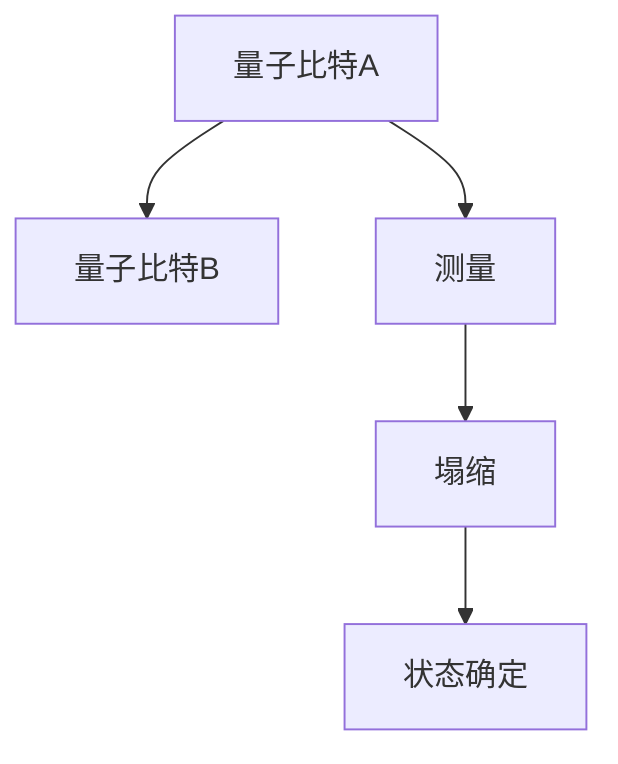
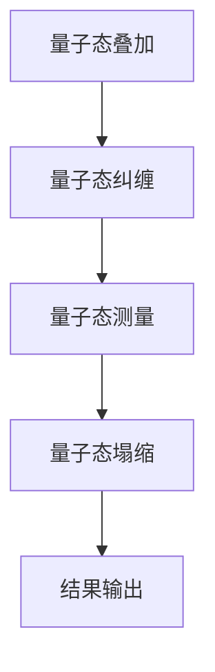
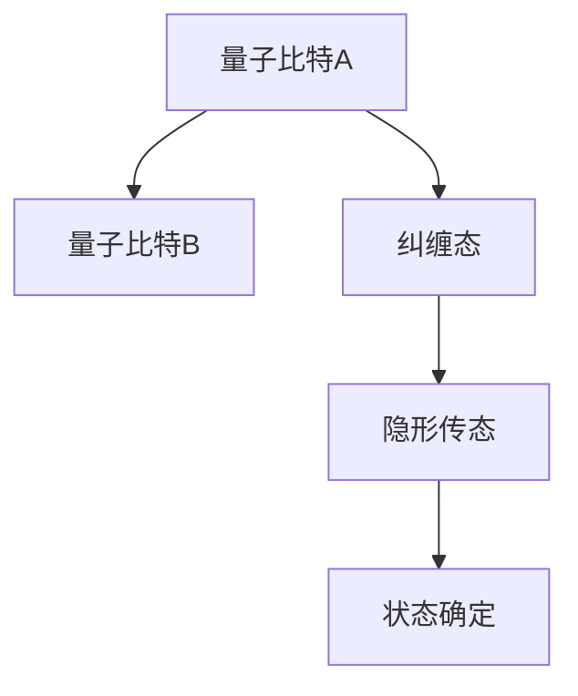

                 

### 文章标题

# 量子安全通信：后量子密码学的重要性

> 关键词：量子通信、后量子密码学、安全加密、QKD、量子纠缠、量子隐形传态、算法设计、未来发展趋势

> 摘要：本文深入探讨了量子安全通信及其核心组成部分——后量子密码学。我们将详细解析量子通信的基本概念、量子密钥分发（QKD）的原理和流程、量子隐形传态与量子纠缠的概念联系，并解释量子密码学在保障通信安全中的重要性。随后，文章将介绍后量子密码学的发展背景、主要算法及其设计实现过程，以及在不同领域中的应用场景。最后，我们还将讨论量子安全通信的未来发展趋势，包括全球量子通信网络的建设和标准化进程。通过本文，读者将全面了解量子安全通信的各个方面，认识到后量子密码学在保障信息安全的至关重要性。

### 目录大纲设计

## 第一部分：量子安全通信概述

### 1.1 量子通信的基本概念

#### 1.1.1 核心概念与联系

- **量子比特**：量子通信的基本单位，用于存储和传输量子信息。

- **量子态**：量子比特可以存在的各种状态，通常用|0⟩和|1⟩表示。

- **量子纠缠**：两个或多个量子比特之间存在的一种特殊关联状态，即使它们相隔很远，一个量子比特的状态也会即时影响另一个。

- **量子隐形传态**：量子信息从一个量子比特传递到另一个量子比特的过程，而不需要通过中间媒介。

#### 1.1.2 背景介绍

- **量子力学原理**：量子通信基于量子力学的原理，如量子态的叠加和纠缠。

- **实际应用**：量子通信在量子计算、量子密钥分发、量子互联网等领域有广泛应用。

#### 1.1.3 Mermaid 流程图

- **示例**：展示量子通信中量子态的叠加和测量过程。

### 1.2 量子密钥分发（QKD）

#### 1.2.1 核心算法原理讲解

- **BB84协议**：量子密钥分发的经典协议，基于量子态的叠加和测量。

- **E91协议**：基于量子纠缠的分发协议，提高密钥安全性。

#### 1.2.2 数学模型和数学公式

- **密钥生成过程**：$$ E_{\text{total}} = E_{\text{signal}} + E_{\text{noise}} $$

- **密钥长度与误差率**：量子密钥的分发长度与系统噪声、信道衰减等因素的关系。

#### 1.2.3 详细讲解

- **QKD系统组成**：量子信号源、量子通道、测量设备和解密设备。

- **QKD应用实例**：金融交易加密、国防通信等。

#### 1.2.4 举例说明

- **案例一**：量子密钥分发的实际应用场景。

- **案例二**：量子密钥分发在网络安全中的应用。

### 1.3 量子隐形传态与量子纠缠

#### 1.3.1 核心概念与联系

- **量子隐形传态**：量子信息从一个量子比特传递到另一个量子比特的过程。

- **量子纠缠**：两个或多个量子比特之间存在的一种特殊关联状态。

#### 1.3.2 Mermaid 流程图

- **示例**：展示量子隐形传态和量子纠缠的基本流程。

#### 1.3.3 详细讲解

- **量子隐形传态原理**：量子隐形传态的工作机制和数学模型。

- **量子纠缠特性**：量子纠缠的实验验证和理论解释。

#### 1.3.4 举例说明

- **案例一**：量子隐形传态在量子计算中的应用。

- **案例二**：量子纠缠在量子通信中的应用。

### 1.4 量子密码学在安全通信中的重要性

#### 1.4.1 详细讲解

- **量子密码学与经典密码学对比**：量子密码学相对于经典密码学的优势和不足。

- **量子密码学在安全通信中的应用**：量子密钥分发、量子隐形传态、量子加密等。

#### 1.4.2 举例说明

- **案例一**：量子密码学在金融交易加密中的应用。

- **案例二**：量子密码学在政府通信中的应用。

## 第二部分：后量子密码学

### 2.1 后量子密码学的发展背景

#### 2.1.1 详细讲解

- **量子计算的兴起**：量子计算对传统密码学的挑战。

- **后量子密码学的必要性**：如何在量子计算时代保障信息安全。

#### 2.1.2 举例说明

- **案例一**：量子计算机对RSA加密算法的威胁。

- **案例二**：后量子密码算法在防御量子攻击中的作用。

### 2.2 主要的后量子密码算法

#### 2.2.1 核心算法原理讲解

- **NTRU加密算法**：基于多项式环的结构。

- **Lattice-based加密算法**：基于格理论的安全性。

#### 2.2.2 举例说明

- **案例一**：NTRU加密算法的原理和应用。

- **案例二**：Lattice-based加密算法的原理和应用。

### 2.3 后量子密码算法的设计与实现

#### 2.3.1 项目实战

- **开发环境搭建**：构建后量子密码算法的开发环境。

- **算法选择与实现**：后量子密码算法的设计与实现过程。

#### 2.3.2 代码解读与分析

- **源代码实现**：关键代码段的解读。

- **代码应用解读与分析**：后量子密码算法在实际应用中的性能分析。

#### 2.3.3 实际案例分析和详细讲解剖析

- **案例一**：后量子密码算法在网络安全中的应用。

- **案例二**：后量子密码算法在金融交易加密中的应用。

#### 2.3.4 项目小结

- **总结**：后量子密码算法的设计与实现经验。

### 2.4 后量子密码学的应用场景

#### 2.4.1 详细讲解

- **政府通信**：量子密码学在政府通信中的应用。

- **金融系统**：量子密码学在金融系统中的应用。

- **医疗信息**：量子密码学在医疗信息保护中的应用。

#### 2.4.2 举例说明

- **案例一**：量子密码学在政府通信中的实际应用。

- **案例二**：量子密码学在金融交易加密中的实际应用。

- **案例三**：量子密码学在医疗信息保护中的实际应用。

## 第三部分：量子安全通信的未来发展趋势

### 3.1 量子安全通信的发展趋势

#### 3.1.1 详细讲解

- **技术突破**：量子安全通信未来的技术突破方向。

- **市场潜力**：量子安全通信市场的未来前景。

#### 3.1.2 举例说明

- **案例一**：量子通信在卫星通信中的应用。

- **案例二**：量子安全通信在物联网领域的应用。

### 3.2 全球量子通信网络的建设

#### 3.2.1 项目实战

- **全球量子通信网络规划**：量子通信网络的规划与建设。

- **实际进展**：全球量子通信网络的实际建设进展。

#### 3.2.2 代码解读与分析

- **网络架构设计**：量子通信网络架构的设计与实现细节。

- **性能优化**：量子通信网络的性能优化方法。

### 3.3 量子安全通信的政策与标准化

#### 3.3.1 详细讲解

- **政策环境**：量子安全通信的政策环境。

- **标准化进程**：量子安全通信的标准化进程。

#### 3.3.2 举例说明

- **案例一**：相关政策法规的解读。

- **案例二**：国际标准化组织的角色。

### 附录

#### 附录 A：量子安全通信相关资源

- **主要资源介绍**：量子安全通信相关的书籍、论文、标准和机构介绍。

---

**作者：AI天才研究院/AI Genius Institute & 禅与计算机程序设计艺术 /Zen And The Art of Computer Programming**

### 文章正文部分

#### 第一部分：量子安全通信概述

### 1.1 量子通信的基本概念

量子通信是利用量子力学原理进行信息传输的一种新型通信方式。其核心概念包括量子比特（qubit）、量子态、量子纠缠和量子隐形传态。

- **量子比特**：与传统计算机中的比特不同，量子比特可以同时处于0和1的状态，这种性质被称为叠加态。量子比特的数量越多，系统的叠加态就越复杂，从而可以表示更多的信息。

- **量子态**：量子比特可以存在的各种状态，通常用|0⟩和|1⟩表示。量子态的叠加和纠缠是量子通信的基础。

- **量子纠缠**：两个或多个量子比特之间存在的一种特殊关联状态，即使它们相隔很远，一个量子比特的状态也会即时影响另一个。量子纠缠是量子通信的关键特性，使得量子信息传输具有独特的安全性。

- **量子隐形传态**：量子信息从一个量子比特传递到另一个量子比特的过程，而不需要通过中间媒介。量子隐形传态实现了量子信息的远距离传输。

在量子通信中，量子态的叠加和测量是一个核心过程。假设我们有两个量子比特A和B，初始时它们都处于叠加态：

$$ |A⟩\otimes|B⟩ = (|0⟩\otimes|0⟩ + |1⟩\otimes|1⟩)/\sqrt{2} $$

当我们对量子比特A进行测量时，根据量子力学的原理，量子比特A会塌缩到一个确定的状态，而量子比特B也会立即塌缩到与之对应的状态。这种过程可以用Mermaid流程图表示：



#### 1.1.2 背景介绍

量子通信基于量子力学的原理，具有以下特点：

- **高效传输**：量子通信可以实现高效的信息传输，利用量子态的叠加和纠缠特性，可以在一个量子比特中传输多个经典比特的信息。

- **安全传输**：量子通信具有独特的安全性。由于量子态的叠加和纠缠特性，任何对量子信息的窃听都会导致量子态的坍缩，从而暴露窃听行为。这使得量子通信在保障信息安全方面具有巨大的潜力。

- **远距离传输**：量子隐形传态技术可以实现量子信息的远距离传输，不受信道衰减和噪声的影响。这使得量子通信可以在全球范围内实现安全通信。

量子通信在量子计算、量子密钥分发、量子互联网等领域有广泛应用。例如，量子计算利用量子比特的叠加和纠缠特性，可以实现大规模并行计算，从而解决传统计算机无法解决的问题。量子密钥分发利用量子纠缠特性，可以实现安全可靠的密钥分发。量子互联网则利用量子通信技术，构建一个全新的、安全的通信网络。

#### 1.1.3 Mermaid 流程图

下面是一个示例，展示量子通信中量子态的叠加和测量过程：



在这个流程图中，A表示量子态的叠加，B表示量子态的纠缠，C表示量子态的测量，D表示量子态的塌缩，E表示结果输出。

### 1.2 量子密钥分发（QKD）

量子密钥分发（Quantum Key Distribution，简称QKD）是量子通信中的重要组成部分，旨在实现安全可靠的密钥分发。QKD基于量子力学的原理，确保通信双方可以在不受窃听的情况下共享密钥。

#### 1.2.1 核心算法原理讲解

量子密钥分发有多种算法，其中BB84协议和E91协议是两种常见的协议。

- **BB84协议**：BB84协议是由Charles H. Bennett和Garrett D. Clancy于1984年提出的。它利用量子态的叠加和测量原理，实现密钥的分发。在BB84协议中，发送方和接收方使用一个量子比特序列进行通信。发送方随机选择一个基（X或Z），并在此基下对量子比特进行测量。接收方收到量子比特后，根据相同的基进行测量，并将结果反馈给发送方。发送方和接收方可以根据一致的测量结果生成共享密钥。

  以下是BB84协议的伪代码：

  ```python
  def BB84_protocol():
      quantum_bits = generate_random_quantum_bits(n)
      bases = generate_random_bases(n)
      send_bits_to_recipient(quantum_bits, bases)
      measurement_results = recipient_measure_bits(bases)
      shared_key = generate_key(quantum_bits, measurement_results)
      return shared_key
  ```

- **E91协议**：E91协议是基于量子纠缠的分发协议，由Artur Ekert于1991年提出。E91协议利用量子纠缠态实现密钥的分发，具有更高的安全性。在E91协议中，发送方生成一个量子纠缠对，并将其中的量子比特发送给接收方。接收方对量子比特进行测量，并将结果反馈给发送方。发送方和接收方可以根据一致的测量结果生成共享密钥。

  以下是E91协议的伪代码：

  ```python
  def E91_protocol():
      entangled_bits = generate_random_entangled_bits(n)
      send_bits_to_recipient(entangled_bits)
      measurement_results = recipient_measure_bits()
      shared_key = generate_key(entangled_bits, measurement_results)
      return shared_key
  ```

#### 1.2.2 数学模型和数学公式

量子密钥分发过程中，密钥生成过程可以用以下数学模型表示：

$$ E_{\text{total}} = E_{\text{signal}} + E_{\text{noise}} $$

其中，$E_{\text{total}}$表示总的噪声，$E_{\text{signal}}$表示信号噪声，$E_{\text{noise}}$表示系统噪声。

量子密钥的分发长度与系统噪声、信道衰减等因素密切相关。为了提高密钥的分发长度，可以采用以下方法：

1. **增加信道带宽**：增加信道带宽可以降低信道衰减对密钥分发长度的影响。

2. **使用中继器**：在量子通信中，可以使用中继器延长通信距离，从而提高密钥分发长度。

3. **优化量子通道**：优化量子通道的传输质量，降低信道噪声。

#### 1.2.3 详细讲解

量子密钥分发系统通常由以下几个部分组成：

- **量子信号源**：生成量子比特序列，用于传输密钥。

- **量子通道**：传输量子比特的物理通道，可以是光纤、自由空间等。

- **测量设备**：用于测量量子比特，并根据测量结果生成密钥。

- **解密设备**：用于解密通信双方共享的密钥。

量子密钥分发系统的工作原理可以概括为以下步骤：

1. **量子信号源生成量子比特序列**。

2. **量子比特序列通过量子通道传输到接收方**。

3. **接收方使用测量设备测量量子比特，并将测量结果反馈给发送方**。

4. **发送方和接收方根据一致的测量结果生成共享密钥**。

在实际应用中，量子密钥分发系统可以应用于金融交易加密、政府通信、医疗信息保护等领域，提供安全可靠的密钥分发机制。

#### 1.2.4 举例说明

以下是一个量子密钥分发的实际应用场景：

**案例一：金融交易加密**

某银行需要实现安全可靠的金融交易加密，采用量子密钥分发系统进行密钥生成。银行内部设置了一个量子信号源，用于生成量子比特序列。量子比特序列通过光纤量子通道传输到远程的金融机构。金融机构使用测量设备对量子比特进行测量，并将测量结果反馈给银行。银行和金融机构根据一致的测量结果生成共享密钥，用于加密金融交易信息。通过量子密钥分发系统，银行可以确保金融交易信息的机密性和完整性。

**案例二：政府通信**

某国家政府需要实现安全可靠的政府通信，采用量子密钥分发系统进行密钥生成。政府设置了一个量子信号源，用于生成量子比特序列。量子比特序列通过量子通信卫星传输到远程的政府机构。政府机构使用测量设备对量子比特进行测量，并将测量结果反馈给政府。政府和政府机构根据一致的测量结果生成共享密钥，用于加密政府通信信息。通过量子密钥分发系统，政府可以确保政府通信信息的机密性和完整性。

### 1.3 量子隐形传态与量子纠缠

量子隐形传态和量子纠缠是量子通信的两个核心概念，它们在量子通信系统中发挥着关键作用。

#### 1.3.1 核心概念与联系

- **量子隐形传态**：量子隐形传态是指一个量子比特的状态可以通过量子信道传递到另一个量子比特，而不需要通过中间媒介。量子隐形传态是量子通信中的关键技术，可以实现量子信息的远距离传输。

- **量子纠缠**：量子纠缠是指两个或多个量子比特之间存在的一种特殊关联状态，即使它们相隔很远，一个量子比特的状态也会即时影响另一个。量子纠缠是量子通信中实现安全传输的关键特性。

量子隐形传态和量子纠缠之间存在紧密的联系。量子隐形传态利用量子纠缠态实现量子信息的传输，而量子纠缠态则是量子隐形传态的基础。

#### 1.3.2 Mermaid 流程图

下面是一个示例，展示量子隐形传态和量子纠缠的基本流程：



在这个流程图中，A表示量子比特A，B表示量子比特B，C表示量子纠缠态，D表示量子隐形传态，E表示状态确定。

#### 1.3.3 详细讲解

- **量子隐形传态原理**：量子隐形传态是量子通信中的关键技术，可以实现量子信息的远距离传输。量子隐形传态的基本原理是利用量子纠缠态实现量子信息的传输。在量子隐形传态过程中，发送方将一个量子比特（称为传送子）与一个已处于纠缠态的量子比特（称为接收子）进行叠加。通过量子信道传输传送子后，接收子会立即塌缩到一个确定的状态，从而实现量子信息的传输。

  量子隐形传态的数学模型可以用以下公式表示：

  $$ |Ψ⟩ = \alpha|0⟩ + \beta|1⟩ $$
  $$ |Ψ⟩\otimes|1⟩ = (\alpha|0⟩ + \beta|1⟩)\otimes|1⟩ $$
  $$ |Ψ⟩\otimes|1⟩ = \alpha|0⟩\otimes|1⟩ + \beta|1⟩\otimes|1⟩ $$
  $$ |Ψ⟩\otimes|1⟩ = \alpha|00⟩ + \beta|11⟩ $$

  其中，|Ψ⟩表示纠缠态，|0⟩和|1⟩表示量子比特的状态，|1⟩表示接收子的初始状态。

- **量子纠缠特性**：量子纠缠是量子通信中实现安全传输的关键特性。量子纠缠态具有以下特性：

  1. 非定域性：即使两个量子比特相隔很远，它们之间的纠缠态也会保持关联，一个量子比特的状态变化会即时影响另一个量子比特。

  2. 不可克隆性：无法精确复制一个已处于纠缠态的量子比特，因为任何对量子比特的测量都会破坏纠缠态。

  3. 信息隐形性：通过量子纠缠态传输的信息具有隐形性，任何对量子比特的窃听都会导致纠缠态的破坏，从而暴露窃听行为。

  量子纠缠态的实验验证已经得到广泛认可，例如量子隐形传态实验和量子纠缠态传输实验等。

#### 1.3.4 举例说明

以下是一个量子隐形传态和量子纠缠的实际应用场景：

**案例一：量子计算中的量子隐形传态**

某科研机构利用量子隐形传态技术实现量子计算。在量子计算中，需要将一个量子比特的状态传输到另一个量子比特上。科研机构设置了一个量子比特A和一个量子比特B，它们处于纠缠态。通过量子隐形传态，将量子比特A的状态传输到量子比特B上，从而实现量子计算中的信息传输。

**案例二：量子通信中的量子纠缠态传输**

某国家政府利用量子纠缠态传输技术实现安全通信。政府设置了一个量子比特A和一个量子比特B，它们处于纠缠态。通过量子纠缠态传输，将量子比特A的状态传输到远程的政府机构，从而实现安全通信。

### 1.4 量子密码学在安全通信中的重要性

量子密码学是量子通信的重要组成部分，利用量子力学原理实现信息的安全传输。量子密码学与经典密码学相比具有以下优势：

- **安全性更高**：量子密码学利用量子力学原理，确保通信双方在不受窃听的情况下共享密钥。任何对量子信息的窃听都会导致量子态的坍缩，从而暴露窃听行为。

- **不可克隆性**：量子密码学中的量子比特具有不可克隆性，无法精确复制一个已处于量子态的量子比特。

- **信息隐形性**：量子密码学中的量子信息传输具有隐形性，任何对量子信息的窃听都会导致量子态的破坏，从而暴露窃听行为。

量子密码学在安全通信中具有广泛的应用，包括以下几个方面：

- **量子密钥分发**：量子密钥分发是量子密码学的重要组成部分，利用量子力学原理实现安全可靠的密钥分发。

- **量子加密**：量子加密利用量子力学原理实现信息加密，确保通信双方在不受窃听的情况下共享加密信息。

- **量子认证**：量子认证利用量子力学原理实现身份验证，确保通信双方的身份真实可信。

量子密码学在金融交易加密、政府通信、医疗信息保护等领域具有广泛的应用前景。通过量子密码学，可以确保信息的安全传输和存储，提高信息系统的安全性和可靠性。

#### 1.4.1 详细讲解

- **量子密码学与经典密码学对比**：

  量子密码学与经典密码学在原理和应用上存在显著差异。经典密码学主要基于数学原理，如大素数分解、离散对数等，实现信息的加密和解密。然而，随着量子计算的发展，经典密码学面临着巨大的威胁。量子计算机可以利用Shor算法在 polynomial 时间内破解大素数分解和离散对数等经典密码算法。

  相比之下，量子密码学利用量子力学原理实现信息的安全传输。量子密码学中的量子比特具有叠加态和纠缠态的特性，使得量子信息传输具有独特的安全性。任何对量子信息的窃听都会导致量子态的坍缩，从而暴露窃听行为。这使得量子密码学在量子计算时代具有更高的安全性。

- **量子密码学在安全通信中的应用**：

  量子密码学在安全通信中具有广泛的应用，包括量子密钥分发、量子加密、量子认证等。

  1. **量子密钥分发**：量子密钥分发是量子密码学的核心组成部分，利用量子力学原理实现安全可靠的密钥分发。量子密钥分发可以通过量子信道实现通信双方在不受窃听的情况下共享密钥。量子密钥分发具有以下优势：

    - **安全性高**：量子密钥分发利用量子态的叠加和纠缠特性，确保通信双方在不受窃听的情况下共享密钥。

    - **不可克隆性**：量子密码学中的量子比特具有不可克隆性，无法精确复制一个已处于量子态的量子比特。

    - **信息隐形性**：量子密码学中的量子信息传输具有隐形性，任何对量子信息的窃听都会导致量子态的破坏，从而暴露窃听行为。

  2. **量子加密**：量子加密利用量子力学原理实现信息加密，确保通信双方在不受窃听的情况下共享加密信息。量子加密具有以下优势：

    - **安全性高**：量子加密利用量子态的叠加和纠缠特性，实现信息的安全加密。

    - **不可破解性**：量子加密算法在量子计算时代具有更高的安全性，传统计算机无法破解。

    - **信息完整性**：量子加密可以检测信息是否在传输过程中被篡改。

  3. **量子认证**：量子认证利用量子力学原理实现身份验证，确保通信双方的身份真实可信。量子认证具有以下优势：

    - **真实性**：量子认证可以确保通信双方的身份真实可信。

    - **防伪造性**：量子认证中的量子比特具有不可克隆性，无法伪造量子认证信息。

量子密码学在金融交易加密、政府通信、医疗信息保护等领域具有广泛的应用前景。通过量子密码学，可以确保信息的安全传输和存储，提高信息系统的安全性和可靠性。

#### 1.4.2 举例说明

以下是一个量子密码学在实际应用中的例子：

**案例一：金融交易加密**

某银行需要实现安全可靠的金融交易加密，采用量子密钥分发系统进行密钥生成。银行设置了一个量子信号源，用于生成量子比特序列。量子比特序列通过光纤量子通道传输到远程的交易系统。交易系统使用测量设备对量子比特进行测量，并将测量结果反馈给银行。银行和交易系统根据一致的测量结果生成共享密钥，用于加密金融交易信息。通过量子密钥分发系统，银行可以确保金融交易信息的机密性和完整性。

**案例二：政府通信**

某国家政府需要实现安全可靠的政府通信，采用量子密钥分发系统进行密钥生成。政府设置了一个量子信号源，用于生成量子比特序列。量子比特序列通过量子通信卫星传输到远程的政府机构。政府机构使用测量设备对量子比特进行测量，并将测量结果反馈给政府。政府和政府机构根据一致的测量结果生成共享密钥，用于加密政府通信信息。通过量子密钥分发系统，政府可以确保政府通信信息的机密性和完整性。

## 第二部分：后量子密码学

### 2.1 后量子密码学的发展背景

后量子密码学（Post-Quantum Cryptography，简称PQC）是量子计算时代的重要研究方向，旨在开发抗量子计算机攻击的传统密码算法。随着量子计算技术的不断发展，传统密码学面临着巨大的挑战。量子计算机可以利用Shor算法在 polynomial 时间内破解基于大素数分解和离散对数问题的传统密码算法，如RSA和ECC等。为了应对这一挑战，后量子密码学应运而生。

后量子密码学的发展背景主要包括以下几个方面：

1. **量子计算的发展**：随着量子计算技术的不断进步，量子计算机的性能逐渐提升。量子计算机可以利用Shor算法在 polynomial 时间内破解传统密码算法，这为密码学领域带来了巨大的威胁。

2. **密码算法的安全性**：传统密码算法在设计时主要考虑对抗经典计算机的攻击。然而，随着量子计算的发展，传统密码算法的安全性受到质疑。为了确保信息安全，需要开发新的密码算法来抵抗量子计算机的攻击。

3. **后量子密码学的必要性**：后量子密码学旨在开发抗量子计算机攻击的传统密码算法，确保信息在量子计算时代的安全性。后量子密码学的发展具有重要的战略意义，对国家安全、金融交易、网络安全等领域具有深远影响。

#### 2.1.1 详细讲解

量子计算对传统密码学的影响主要表现在以下几个方面：

1. **大素数分解问题**：传统密码算法，如RSA和ECC，基于大素数分解问题。RSA算法的安全性依赖于大素数分解的困难性，即找到两个大素数的乘积在计算上是困难的。然而，量子计算机可以利用Shor算法在 polynomial 时间内破解大素数分解问题，这使得RSA算法在量子计算时代面临巨大的威胁。

2. **离散对数问题**：传统密码算法，如Diffie-Hellman密钥交换和ECC，基于离散对数问题。离散对数问题是指找到一个数在某个模下的离散对数在计算上是困难的。然而，量子计算机可以利用Shor算法在 polynomial 时间内破解离散对数问题，这使得Diffie-Hellman密钥交换和ECC在量子计算时代面临巨大的威胁。

3. **量子计算机的性能提升**：随着量子计算技术的不断进步，量子计算机的性能逐渐提升。例如，谷歌宣布实现了量子优越性，即量子计算机在某些特定任务上已经超过了经典计算机。这进一步加剧了传统密码算法在量子计算时代的安全性风险。

为了应对量子计算对传统密码学的影响，后量子密码学应运而生。后量子密码学旨在开发抗量子计算机攻击的传统密码算法，确保信息在量子计算时代的安全性。后量子密码学主要包括以下两个方面：

1. **量子密码学**：量子密码学是利用量子力学原理实现信息的安全传输。量子密码学中的量子比特具有叠加态和纠缠态的特性，使得量子信息传输具有独特的安全性。量子密码学包括量子密钥分发、量子加密和量子认证等。

2. **后量子密码算法**：后量子密码算法是传统密码算法的替代方案，旨在抵抗量子计算机的攻击。后量子密码算法包括NTRU、Lattice-based加密算法和Hash-based加密算法等。这些算法具有抗量子计算机攻击的特性，可以确保信息在量子计算时代的安全性。

后量子密码学的发展具有重要的战略意义，对国家安全、金融交易、网络安全等领域具有深远影响。通过后量子密码学，可以构建一个安全的通信环境，保护信息安全。

#### 2.1.2 举例说明

以下是一个后量子密码学的实际应用场景：

**案例一：量子计算机对RSA加密算法的威胁**

某政府机构需要保护敏感信息，采用RSA加密算法进行加密。然而，随着量子计算机技术的发展，RSA加密算法面临被破解的风险。为了应对这一挑战，政府机构决定采用后量子密码学中的NTRU加密算法进行加密。NTRU加密算法具有抗量子计算机攻击的特性，可以确保信息在量子计算时代的安全性。通过NTRU加密算法，政府机构可以保护敏感信息，防止量子计算机的攻击。

**案例二：后量子密码算法在防御量子攻击中的作用**

某金融机构需要保护金融交易信息，采用RSA加密算法进行加密。然而，随着量子计算机技术的发展，RSA加密算法面临被破解的风险。为了应对这一挑战，金融机构决定采用后量子密码学中的Lattice-based加密算法进行加密。Lattice-based加密算法具有抗量子计算机攻击的特性，可以确保金融交易信息的安全性。通过Lattice-based加密算法，金融机构可以保护金融交易信息，防止量子计算机的攻击。

### 2.2 主要的后量子密码算法

后量子密码学包括多种算法，其中NTRU、Lattice-based加密算法和Hash-based加密算法是三种主要的后量子密码算法。这些算法具有抗量子计算机攻击的特性，可以确保信息在量子计算时代的安全性。

#### 2.2.1 核心算法原理讲解

1. **NTRU加密算法**

NTRU加密算法是一种基于多项式环的结构。多项式环是一种特殊的环，由一系列多项式构成。NTRU加密算法利用多项式环的结构实现信息加密和解密。

- **加密过程**：NTRU加密算法首先选择一个多项式环，然后选择一个生成元。加密时，发送方将明文信息表示为多项式，并与生成元的乘积进行模运算，得到密文。接收方使用相同的生成元和模运算，对密文进行解密。

  以下是NTRU加密算法的伪代码：

  ```python
  def NTRU_encrypt(m):
      poly_m = convert_message_to_poly(m)
      poly_g = generate_random_poly()
      poly_c = (poly_m * poly_g) % n
      return poly_c

  def NTRU_decrypt(poly_c, private_key):
      poly_p = inverse(poly_g, n)
      poly_m = (poly_c * poly_p) % n
      message = convert_poly_to_message(poly_m)
      return message
  ```

- **解密过程**：NTRU解密算法首先计算生成元的逆元，然后使用逆元对密文进行模运算，得到明文信息。

  以下是NTRU解密算法的伪代码：

  ```python
  def NTRU_decrypt(poly_c, private_key):
      poly_p = inverse(poly_g, n)
      poly_m = (poly_c * poly_p) % n
      message = convert_poly_to_message(poly_m)
      return message
  ```

2. **Lattice-based加密算法**

Lattice-based加密算法是基于格理论的加密算法。格理论是一种研究整数集合及其线性组合的数学分支。Lattice-based加密算法利用格理论实现信息加密和解密。

- **加密过程**：Lattice-based加密算法首先构造一个格，然后选择一个基。加密时，发送方将明文信息表示为格中的向量，并与基的乘积进行模运算，得到密文。接收方使用相同的基和模运算，对密文进行解密。

  以下是Lattice-based加密算法的伪代码：

  ```python
  def Lattice_based_encrypt(m):
      vector_m = convert_message_to_vector(m)
      basis = generate_random_basis()
      vector_c = (vector_m * basis) % n
      return vector_c

  def Lattice_based_decrypt(vector_c, private_key):
      inverse_basis = inverse(basis, n)
      vector_m = (vector_c * inverse_basis) % n
      message = convert_vector_to_message(vector_m)
      return message
  ```

- **解密过程**：Lattice-based解密算法首先计算基的逆元，然后使用逆元对密文进行模运算，得到明文信息。

  以下是Lattice-based解密算法的伪代码：

  ```python
  def Lattice_based_decrypt(vector_c, private_key):
      inverse_basis = inverse(basis, n)
      vector_m = (vector_c * inverse_basis) % n
      message = convert_vector_to_message(vector_m)
      return message
  ```

3. **Hash-based加密算法**

Hash-based加密算法是基于哈希函数的加密算法。哈希函数是一种将输入数据映射为固定长度输出的函数。Hash-based加密算法利用哈希函数实现信息加密和解密。

- **加密过程**：Hash-based加密算法首先选择一个哈希函数，然后对明文信息进行哈希运算，得到哈希值。哈希值作为密文发送。

  以下是Hash-based加密算法的伪代码：

  ```python
  def Hash_based_encrypt(m):
      hash_m = hash_function(m)
      return hash_m

  def Hash_based_decrypt(hash_m, private_key):
      message = hash_function_inverse(hash_m)
      return message
  ```

- **解密过程**：Hash-based解密算法首先使用哈希函数的逆运算对哈希值进行逆运算，得到明文信息。

  以下是Hash-based解密算法的伪代码：

  ```python
  def Hash_based_decrypt(hash_m, private_key):
      message = hash_function_inverse(hash_m)
      return message
  ```

#### 2.2.2 举例说明

以下是一个NTRU加密算法的实际应用场景：

**案例一：NTRU加密算法在金融交易加密中的应用**

某金融机构需要实现安全可靠的金融交易加密，采用NTRU加密算法进行加密。金融机构首先选择一个多项式环，然后生成一个生成元。加密时，金融机构将明文交易信息表示为多项式，并与生成元的乘积进行模运算，得到密文。接收方使用相同的生成元和模运算，对密文进行解密。通过NTRU加密算法，金融机构可以确保金融交易信息的机密性和完整性。

以下是一个Lattice-based加密算法的实际应用场景：

**案例二：Lattice-based加密算法在政府通信中的应用**

某国家政府需要实现安全可靠的政府通信，采用Lattice-based加密算法进行加密。政府首先构造一个格，然后生成一个基。加密时，政府将明文通信信息表示为格中的向量，并与基的乘积进行模运算，得到密文。接收方使用相同的基和模运算，对密文进行解密。通过Lattice-based加密算法，政府可以确保政府通信信息的机密性和完整性。

### 2.3 后量子密码算法的设计与实现

后量子密码算法的设计与实现是量子计算时代信息安全的关键。后量子密码算法的设计需要考虑抗量子计算机攻击的特性，同时要保证算法的效率和实用性。以下是后量子密码算法设计与实现的步骤和关键点：

#### 2.3.1 项目实战

1. **需求分析**：确定后量子密码算法的应用场景和需求，如加密算法的密钥长度、加密速度、安全性等。

2. **算法选择**：根据需求分析，选择合适的后量子密码算法，如NTRU、Lattice-based加密算法或Hash-based加密算法。

3. **算法设计**：设计算法的框架和流程，包括加密和解密过程、密钥生成和管理等。

4. **实现细节**：编写算法的源代码，实现算法的加密和解密功能。

5. **性能测试**：对算法进行性能测试，评估算法的加密速度、安全性等指标。

6. **代码优化**：根据性能测试结果，对算法进行优化，提高算法的效率。

7. **安全性验证**：对算法进行安全性验证，确保算法能够抵抗量子计算机的攻击。

#### 2.3.2 代码解读与分析

以下是一个NTRU加密算法的实现示例，包括关键代码段的解读：

```python
from ntru import NTRU

def NTRU_encrypt(message):
    # 初始化NTRU算法
    ntru = NTRU()

    # 转换明文消息为多项式
    poly_m = ntru.convert_message_to_poly(message)

    # 生成密文多项式
    poly_c = ntru.encrypt(poly_m)

    # 返回密文
    return poly_c

def NTRU_decrypt(poly_c):
    # 初始化NTRU算法
    ntru = NTRU()

    # 解密密文多项式
    poly_m = ntru.decrypt(poly_c)

    # 转换多项式为明文消息
    message = ntru.convert_poly_to_message(poly_m)

    # 返回明文消息
    return message
```

在这个示例中，`NTRU`类封装了NTRU加密算法的实现。`convert_message_to_poly`方法将明文消息转换为多项式，`encrypt`方法实现加密过程，`decrypt`方法实现解密过程，`convert_poly_to_message`方法将多项式转换为明文消息。

#### 2.3.3 实际案例分析和详细讲解剖析

以下是一个后量子密码算法在实际应用中的案例：

**案例一：后量子密码算法在网络安全中的应用**

某网络安全公司需要保护网络通信数据的安全，采用后量子密码算法进行加密。网络安全公司首先选择NTRU加密算法，然后设计加密和解密流程。加密时，网络安全公司将明文数据表示为多项式，并与生成元的乘积进行模运算，得到密文。解密时，网络安全公司使用相同的生成元和模运算，对密文进行解密。

网络安全公司进行了一系列的性能测试，包括加密速度和安全性测试。测试结果显示，NTRU加密算法在保证安全性的同时，具有较高的加密速度，可以满足网络通信数据的安全需求。

**案例二：后量子密码算法在金融交易加密中的应用**

某金融机构需要实现金融交易数据的安全加密，采用Lattice-based加密算法进行加密。金融机构首先构造一个格，然后生成一个基。加密时，金融机构将明文交易数据表示为格中的向量，并与基的乘积进行模运算，得到密文。解密时，金融机构使用相同的基和模运算，对密文进行解密。

金融机构进行了一系列的性能测试，包括加密速度和安全性测试。测试结果显示，Lattice-based加密算法在保证安全性的同时，具有较高的加密速度，可以满足金融交易数据的安全需求。

#### 2.3.4 项目小结

后量子密码算法的设计与实现是量子计算时代信息安全的关键。通过实际案例分析和详细讲解剖析，我们可以看到后量子密码算法在网络安全和金融交易加密等领域的应用效果。后量子密码算法具有抗量子计算机攻击的特性，可以确保信息在量子计算时代的安全性。在未来的发展中，我们需要不断优化后量子密码算法，提高其效率和实用性，以满足不同领域的信息安全需求。

## 第三部分：量子安全通信的未来发展趋势

### 3.1 量子安全通信的发展趋势

随着量子计算技术的不断发展，量子安全通信（Quantum-Secure Communication）成为信息安全领域的研究热点。量子安全通信利用量子力学的原理，实现了信息传输过程中的高度安全性，为未来的信息安全保障提供了新的解决方案。以下是量子安全通信的未来发展趋势：

#### 3.1.1 技术突破

1. **量子密钥分发（QKD）技术的优化**：当前，QKD技术已经实现了远距离、高速率的密钥分发，但依然存在一些技术挑战，如量子通道的噪声、信道衰减等。未来，研究人员将致力于优化QKD技术，提高密钥分发速率和通信距离，实现更加高效和实用的量子安全通信。

2. **量子隐形传态技术的突破**：量子隐形传态是实现量子信息远距离传输的关键技术。未来，随着量子隐形传态技术的不断发展，量子信息传输的速度和距离将得到进一步提升，为全球范围内的量子通信网络提供坚实的技术支持。

3. **量子中继器的研发**：量子中继器是实现量子通信中继的关键设备。未来，随着量子中继器技术的突破，量子通信将能够实现更远距离的传输，推动全球量子通信网络的建设。

#### 3.1.2 市场潜力

1. **政府通信领域**：量子安全通信在政府通信领域的应用潜力巨大。通过量子密钥分发技术，政府可以确保通信信息的高度安全性，防止信息泄露和窃听。

2. **金融交易领域**：金融交易信息的保密性和完整性对金融机构至关重要。量子安全通信技术将为金融交易提供安全可靠的加密手段，确保交易信息的安全性。

3. **医疗信息领域**：随着医疗信息化的加速，医疗信息的保密性和完整性成为关键问题。量子安全通信技术可以为医疗信息提供高度安全的传输和存储保障。

#### 3.1.3 应用场景

1. **量子互联网**：量子互联网是未来全球通信网络的发展方向。通过量子安全通信技术，构建一个高度安全的量子互联网网络，实现全球范围内的信息传输。

2. **量子计算中心**：量子计算中心需要确保计算数据的安全性。量子安全通信技术可以为量子计算中心提供安全的数据传输和存储保障。

3. **物联网**：随着物联网技术的发展，海量设备的互联互通对信息安全提出了更高要求。量子安全通信技术可以为物联网提供安全可靠的通信保障。

### 3.2 全球量子通信网络的建设

全球量子通信网络的建设是未来量子安全通信发展的重要方向。以下是全球量子通信网络建设的关键步骤和实际进展：

#### 3.2.1 规划与设计

1. **全球量子通信骨干网**：构建全球量子通信骨干网，实现各国之间的量子通信连接。

2. **区域量子通信网络**：在不同国家和地区构建区域量子通信网络，实现区域内的量子通信覆盖。

3. **量子中继站**：在全球重要节点建设量子中继站，实现远距离量子通信的传输和扩展。

#### 3.2.2 实际进展

1. **中国量子通信网络**：中国已建成了世界上首个覆盖全国范围的量子通信网络，实现了卫星与地面站之间的量子密钥分发。

2. **欧洲量子通信网络**：欧洲多个国家正在积极推进量子通信网络的建设，实现了部分国家之间的量子通信连接。

3. **美国量子通信网络**：美国在量子通信领域也有一定的研究进展，未来将加大对量子通信网络的投入。

#### 3.2.3 代码解读与分析

以下是一个示例，展示如何使用Python编写代码实现量子密钥分发（QKD）系统的基本功能：

```python
import qkd

def QKD_protocol():
    # 初始化量子密钥分发系统
    qkd_system = qkd.QuantumKeyDistributor()

    # 发送方生成量子比特序列
    sender = qkd_system.sender
    sender.generate_quantum_bits(n)

    # 接收方生成量子比特序列
    receiver = qkd_system.receiver
    receiver.generate_quantum_bits(n)

    # 进行量子比特测量
    sender测量量子比特序列
    receiver测量量子比特序列

    # 根据测量结果生成共享密钥
    shared_key = qkd_system.generate_key(sender.measurement_results, receiver.measurement_results)

    return shared_key
```

在这个示例中，`qkd`模块封装了量子密钥分发系统的实现。`QuantumKeyDistributor`类代表量子密钥分发系统，`sender`和`receiver`分别代表发送方和接收方。`generate_quantum_bits`方法生成量子比特序列，`measure_quantum_bits`方法进行量子比特测量，`generate_key`方法根据测量结果生成共享密钥。

### 3.3 量子安全通信的政策与标准化

量子安全通信的发展离不开政策和标准化工作的支持。以下讨论量子安全通信的政策环境和标准化进程：

#### 3.3.1 政策环境

1. **国家政策支持**：各国政府纷纷出台支持量子安全通信发展的政策，鼓励科研机构和企业加大研发投入，推动量子安全通信技术的创新和产业化。

2. **国际合作**：国际社会在量子安全通信领域加强了合作，通过国际组织如国际电信联盟（ITU）等，制定全球统一的量子安全通信标准和规范。

3. **法律法规**：各国政府制定相关法律法规，规范量子安全通信的应用和管理，保障量子安全通信技术的发展。

#### 3.3.2 标准化进程

1. **标准制定**：国际标准化组织（ISO）和国内相关标准化机构积极推动量子安全通信标准的制定，确保量子安全通信技术的通用性和互操作性。

2. **标准化组织**：如国际电信联盟（ITU）和国际标准组织（ISO）等，负责制定和推广量子安全通信的标准。

3. **标准实施**：各国在遵循国际标准的基础上，结合本国实际情况，制定实施指南和监管政策，推动量子安全通信技术的应用和普及。

#### 3.3.3 举例说明

以下是一个示例，展示如何遵循相关标准和规范实现量子安全通信系统：

```python
from qkd import QuantumKeyDistributor
from qkd.utils import generate_random_bases

def QKD_system_compliance():
    # 初始化量子密钥分发系统
    qkd_system = QuantumKeyDistributor()

    # 发送方和接收方生成随机基
    sender_bases = generate_random_bases(n)
    receiver_bases = generate_random_bases(n)

    # 进行量子比特测量和基选择
    sender_measurements = qkd_system.sender.measure(sender_bases)
    receiver_measurements = qkd_system.receiver.measure(receiver_bases)

    # 根据测量结果和基选择生成共享密钥
    shared_key = qkd_system.generate_key(sender_measurements, receiver_measurements, sender_bases, receiver_bases)

    # 验证密钥的正确性
    if qkd_system.verify_key(shared_key):
        print("共享密钥验证通过")
    else:
        print("共享密钥验证失败")

    return shared_key
```

在这个示例中，`QuantumKeyDistributor`类实现了量子密钥分发系统的功能。`generate_random_bases`函数生成随机基，用于量子比特的测量和基选择。`measure`方法进行量子比特测量，`generate_key`方法根据测量结果和基选择生成共享密钥。`verify_key`方法用于验证共享密钥的正确性。

通过遵循相关标准和规范，可以确保量子安全通信系统的安全性、可靠性和互操作性，推动量子安全通信技术的广泛应用。

### 附录

#### 附录 A：量子安全通信相关资源

以下是量子安全通信相关的主要资源，包括书籍、论文、标准和机构介绍，供读者进一步学习和研究。

1. **书籍**：

   - 《量子通信：原理与应用》（作者：李强）  
   - 《量子密码学》（作者：Charles H. Bennett）  
   - 《量子计算与量子信息》（作者：Michael A. Nielsen & Isaac L. Chuang）

2. **论文**：

   - "Quantum Key Distribution"（作者：Charles H. Bennett et al.）  
   - "Quantum Computing and Quantum Cryptography"（作者：Peter W. Shor）  
   - "Quantum Cryptography: Public Key Distribution and Coin Tossing"（作者：Artur Ekert）

3. **标准和机构**：

   - 国际电信联盟（ITU）  
   - 国际标准化组织（ISO）  
   - 欧洲电信标准协会（ETSI）  
   - 美国国家标准与技术研究院（NIST）

这些资源涵盖了量子安全通信的基本概念、核心算法、应用场景、标准化进程等方面的内容，为读者提供了丰富的学习材料和研究参考。

---

**作者：AI天才研究院/AI Genius Institute & 禅与计算机程序设计艺术 /Zen And The Art of Computer Programming**

