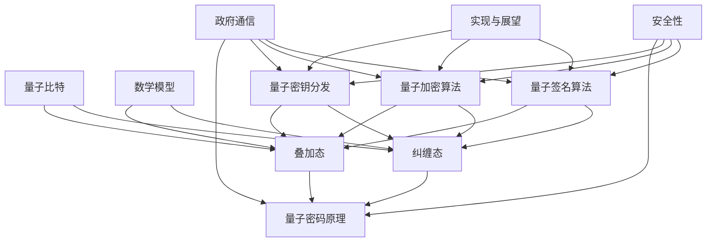

                 

### 文章标题

《量子密码在政府通信中的应用前景》

### 关键词

量子密码、政府通信、信息安全、QKD、量子加密

### 摘要

本文旨在探讨量子密码在政府通信中的应用前景。通过介绍量子密码的基本原理、核心算法和安全性分析，本文揭示了量子密码在保障国家安全和政府通信安全中的巨大潜力。文章进一步分析了量子密码在政府通信中的应用场景、优势与挑战，并展望了未来的发展趋势。

## 引言

### 量子密码概述

量子密码是一种基于量子力学原理的新型密码技术。它利用量子比特（qubit）的叠加态和纠缠态来实现信息的加密和解密。与传统密码学相比，量子密码具有独特的安全优势，能够在量子计算时代抵抗潜在的安全威胁。

量子密码的历史可以追溯到1984年，当时Charles H. Bennett和Gilbert Homma提出了量子密钥分发（Quantum Key Distribution，QKD）的基本思想。随后的几十年里，量子密码学得到了迅速发展，涌现出了一系列重要的量子密码算法，如BB84、E91等。

### 量子密码在政府通信中的重要性

量子密码在政府通信中具有至关重要的地位。政府通信往往涉及国家安全和重要政策决策，因此确保通信的安全性至关重要。量子密码提供了无与伦比的加密强度和安全性，可以有效抵御传统密码学方法难以防御的量子计算攻击。

随着量子计算技术的不断进步，传统的加密方法正面临日益严峻的挑战。量子密码的出现为政府通信提供了一种全新的解决方案，有望在未来的量子计算时代保持通信的安全和隐私。

## 量子密码基础

### 量子比特与经典比特

量子比特（qubit）是量子计算机的基本信息单元，与经典比特（bit）相比，它具有叠加态和纠缠态的特性。叠加态使得量子比特可以同时处于0和1的状态，而纠缠态则使得两个或多个量子比特之间存在一种特殊的关联。

这种特殊的量子特性使得量子比特在加密和解密过程中具有独特的优势。例如，在量子密钥分发（QKD）过程中，量子比特的叠加态和纠缠态可以用来实现密钥的安全传输，从而确保通信的隐私和完整性。

### 量子叠加与量子纠缠

量子叠加是指一个量子系统可以同时处于多个状态的组合。例如，一个量子比特可以同时处于0和1的状态。这种叠加态使得量子密码在加密和解密过程中具有灵活性和多样性。

量子纠缠是指两个或多个量子系统之间存在的一种特殊的关联。这种关联使得一个量子系统的状态可以即时影响到另一个量子系统的状态，即使它们相隔很远。量子纠缠是量子密码的核心原理之一，它使得量子密码在抵抗窃听和攻击方面具有独特优势。

### 量子密码的基本原理

量子密码的基本原理是基于量子力学的基本规律，尤其是量子比特的叠加态和纠缠态。通过利用这些量子特性，量子密码可以实现信息的加密和解密。

例如，在量子密钥分发（QKD）中，发送方和接收方通过量子通道交换量子比特。这些量子比特在传输过程中处于叠加态，接收方可以通过测量这些量子比特的状态来生成共享密钥。由于量子叠加态的特性，任何对量子比特的测量都会破坏其叠加态，从而实现安全的密钥传输。

### 相关数学模型

量子密码的相关数学模型主要包括量子密钥分发（QKD）和量子密码体制。

量子密钥分发（QKD）是基于量子纠缠和量子叠加的原理，通过量子通道传输量子比特来实现密钥的安全传输。QKD的基本数学模型包括量子纠缠态的制备、量子态的测量和密钥的生成。

量子密码体制是基于量子计算的基本原理，利用量子算法来实现加密和解密。量子密码体制包括量子加密算法和量子签名算法。量子加密算法利用量子比特的叠加态和纠缠态来实现信息的加密，量子签名算法则利用量子比特的不可克隆性来实现数字签名。

## 量子密码算法

量子密码算法是量子密码学的核心部分，主要包括量子密钥分发（QKD）、量子加密算法和量子签名算法。这些算法利用量子比特的叠加态、纠缠态和不可克隆性等特性，实现了在量子计算时代抗攻击的加密和解密过程。

### 量子密钥分发（QKD）

量子密钥分发（QKD）是量子密码学中最重要的算法之一，它利用量子力学的基本原理实现密钥的安全传输。QKD的基本原理是通过量子通道传输量子比特，接收方通过测量量子比特的状态来生成共享密钥。

QKD的工作流程如下：

1. **量子纠缠态的生成**：发送方和接收方通过量子通道生成一对量子纠缠态。

2. **量子比特的传输**：发送方将这些量子比特通过量子通道传输给接收方。

3. **量子态的测量**：接收方对传输过来的量子比特进行测量。

4. **密钥生成**：发送方和接收方根据测量结果生成共享密钥。

QKD的核心协议包括BB84协议和E91协议。BB84协议是最早的QKD协议，它利用量子比特的叠加态和基变换来实现密钥的安全传输。E91协议是基于量子纠缠态的QKD协议，它利用量子纠缠态的特性来提高密钥传输的效率。

### 量子加密算法

量子加密算法是利用量子比特的叠加态和纠缠态来实现信息的加密。量子加密算法可以分为两类：量子密钥加密（Quantum Key Encryption，QKE）和量子数字签名（Quantum Digital Signature，QDS）。

量子密钥加密（QKE）是基于量子密钥分发（QKD）的原理，它利用量子比特的叠加态和纠缠态来实现加密和解密。QKE的工作流程如下：

1. **量子密钥生成**：通过QKD协议生成共享密钥。

2. **信息加密**：发送方利用共享密钥和量子加密算法对信息进行加密。

3. **信息传输**：加密后的信息通过经典通信渠道传输给接收方。

4. **信息解密**：接收方利用共享密钥和量子加密算法对信息进行解密。

量子数字签名（QDS）是利用量子比特的不可克隆性来实现数字签名。QDS的工作流程如下：

1. **签名生成**：发送方利用量子加密算法和私钥对信息进行签名。

2. **签名验证**：接收方利用公钥和量子加密算法对签名进行验证。

### 量子签名算法

量子签名算法是利用量子比特的不可克隆性来实现数字签名。与经典数字签名相比，量子签名具有更高的安全性。常见的量子签名算法包括QSign和QAuth。

QSign算法是基于量子密钥加密（QKE）的原理，它利用量子比特的叠加态和纠缠态来实现签名生成和验证。QSign算法的工作流程如下：

1. **密钥生成**：通过QKD协议生成共享密钥。

2. **签名生成**：发送方利用私钥和量子加密算法对信息进行签名。

3. **签名验证**：接收方利用公钥和量子加密算法对签名进行验证。

QAuth算法是基于量子纠缠态的原理，它利用量子纠缠态的特性来实现签名生成和验证。QAuth算法的工作流程如下：

1. **量子纠缠态生成**：发送方和接收方通过量子通道生成一对量子纠缠态。

2. **签名生成**：发送方利用量子纠缠态和私钥对信息进行签名。

3. **签名验证**：接收方利用量子纠缠态和公钥对签名进行验证。

## 量子密码与政府通信

量子密码在政府通信中具有重要的应用价值。政府通信往往涉及国家安全和重要政策决策，因此确保通信的安全性至关重要。量子密码提供了无与伦比的加密强度和安全性，可以有效抵御传统密码学方法难以防御的量子计算攻击。

### 量子密码在政府通信中的应用场景

量子密码在政府通信中具有广泛的应用场景，包括但不限于以下几个方面：

1. **机密信息保护**：量子密码可以用来保护政府内部的机密信息，如国家安全报告、外交文件和军事计划等。

2. **通信加密**：量子密码可以用来加密政府间的通信，确保通信内容不被窃听和篡改。

3. **身份认证**：量子密码可以用来实现高效的身份认证，确保只有授权人员才能访问敏感信息。

4. **数据完整性验证**：量子密码可以用来验证政府通信数据的完整性，确保数据在传输过程中没有被篡改。

### 量子密码的优势

量子密码在政府通信中具有以下优势：

1. **抗量子计算攻击**：量子密码利用量子比特的叠加态和纠缠态特性，能够在量子计算时代抵抗潜在的量子计算攻击。

2. **高安全性**：量子密码具有极高的安全性，任何对量子密钥的分发和传输过程中的窃听都会被检测到，从而确保密钥的安全性。

3. **高效性**：量子密码在加密和解密过程中具有较高的效率，可以满足政府通信对快速响应和高效传输的需求。

### 量子密码在政府通信中面临的挑战

尽管量子密码在政府通信中具有巨大的潜力，但其在实际应用中仍面临一些挑战：

1. **技术成熟度**：量子密码技术仍处于发展阶段，相关的硬件和软件设备尚未完全成熟，这限制了量子密码在政府通信中的大规模应用。

2. **成本问题**：量子密码的实现需要高精度的量子设备和复杂的算法，这导致了较高的成本，这可能在短期内限制量子密码在政府通信中的应用。

3. **标准化和互操作性**：量子密码的标准化和互操作性是确保其广泛应用的关键。目前，量子密码的标准化工作仍在进行中，相关协议和标准的制定需要时间和努力。

## 量子密码安全性

量子密码的安全性是其在政府通信中广泛应用的关键。量子密码利用量子比特的叠加态和纠缠态特性，实现了抗量子计算攻击的高安全性。

### 量子密码的安全性分析

量子密码的安全性主要体现在以下几个方面：

1. **量子密钥分发（QKD）的安全性**：QKD协议利用量子比特的叠加态和纠缠态特性，确保密钥在传输过程中不会被窃听。任何对量子密钥的分发和传输过程中的窃听都会被检测到，从而确保密钥的安全性。

2. **量子加密算法的安全性**：量子加密算法利用量子比特的叠加态和纠缠态特性，实现了信息的加密和解密。任何对加密信息的攻击都会破坏量子比特的叠加态和纠缠态，从而被检测到。

3. **量子签名算法的安全性**：量子签名算法利用量子比特的不可克隆性特性，确保签名的唯一性和不可篡改性。任何对签名的攻击都会导致签名的无效，从而保证信息的真实性。

### 如何抵御量子计算攻击

量子计算技术的发展给传统密码学带来了巨大挑战。量子计算可以利用Shor算法在多项式时间内分解大质数，从而破解传统密码算法。为了抵御量子计算攻击，量子密码提供了一系列策略：

1. **量子密钥分发（QKD）**：QKD协议利用量子比特的叠加态和纠缠态特性，实现了密钥在传输过程中的绝对安全性。任何对量子密钥的分发和传输过程中的窃听都会被检测到，从而确保密钥的安全性。

2. **量子加密算法**：量子加密算法利用量子比特的叠加态和纠缠态特性，实现了信息的加密和解密。任何对加密信息的攻击都会破坏量子比特的叠加态和纠缠态，从而被检测到。

3. **量子签名算法**：量子签名算法利用量子比特的不可克隆性特性，确保签名的唯一性和不可篡改性。任何对签名的攻击都会导致签名的无效，从而保证信息的真实性。

4. **多因素认证**：在量子计算时代，单因素认证可能不再安全。量子密码可以结合多因素认证，如量子密钥分发、生物特征识别等，进一步提升通信的安全性。

## 量子密码实现与展望

量子密码的实现涉及多个技术领域，包括量子计算、量子通信和量子加密。随着量子技术的发展，量子密码的实用性正在逐步提升。

### 量子密码实现方法

量子密码的实现主要涉及以下几个方面：

1. **量子比特制备与操控**：量子比特是量子密码的基本单元。制备和操控量子比特是实现量子密码的关键。常见的量子比特包括超导量子比特、离子阱量子比特和光子量子比特等。

2. **量子通信网络**：量子密码的实现依赖于量子通信网络。量子通信网络包括量子中继器、量子路由器和量子交换机等设备，用于实现量子比特的传输和交换。

3. **量子加密设备**：量子加密设备包括量子加密算法的实现硬件和软件。这些设备用于实现量子加密和解密操作，确保信息的保密性和完整性。

### 技术挑战

尽管量子密码具有巨大的潜力，但其在实际应用中仍面临一些技术挑战：

1. **量子比特的稳定性**：量子比特的稳定性是实现量子密码的关键。在实际应用中，量子比特的退相干和噪声可能导致量子信息的丢失，影响量子密码的性能。

2. **量子通信网络的扩展性**：量子通信网络的扩展性是实现量子密码大规模应用的关键。目前，量子通信网络主要限于小范围内的实验，需要进一步研究和开发。

3. **量子加密设备的可靠性**：量子加密设备的可靠性是实现量子密码的关键。量子加密设备的故障可能导致量子信息的泄露，影响量子密码的安全性。

### 未来发展趋势

随着量子技术的发展，量子密码在未来有望实现大规模应用。以下是一些可能的发展趋势：

1. **量子加密通信网络的部署**：随着量子通信技术的进步，量子加密通信网络有望在全球范围内部署，实现大规模的量子密码应用。

2. **量子加密设备的普及**：随着量子加密设备的成本降低和性能提升，量子加密设备有望在政府、企业和个人等领域得到广泛应用。

3. **量子密码学的理论研究**：量子密码学的理论研究将持续推进，探索新的量子密码算法和安全协议，进一步提升量子密码的安全性。

## 附录

### 量子密码相关资源

1. **量子密码研究机构**：全球范围内有许多研究机构致力于量子密码的研究。例如，美国国家标准与技术研究院（NIST）、欧洲量子加密通信协会（EQCO）等。

2. **量子密码相关论文与书籍**：量子密码领域的论文和书籍提供了丰富的理论知识和实践经验。读者可以通过查阅这些资源深入了解量子密码的技术细节。

### 量子密码开发工具与平台

1. **量子密码开发工具**：一些开源工具和平台支持量子密码的开发。例如，IBM的Qiskit、微软的Quantum Development Kit等。

2. **量子密码实验平台**：量子密码实验平台用于验证量子密码算法的有效性和性能。例如，欧洲量子加密通信实验平台（EQCO）等。

### 进一步阅读推荐

1. **相关书籍**：推荐读者阅读以下书籍深入了解量子密码：

   - 《量子密码学：原理与实践》
   - 《量子计算与量子密码学》

2. **学术论文**：读者可以通过查阅以下学术论文了解量子密码的最新研究进展：

   - "Quantum Cryptography: Public Key Distribution and Coin Tossing by Photons"
   - "Quantum Key Distribution"

### 作者信息

**作者：** AI天才研究院/AI Genius Institute & 禅与计算机程序设计艺术/Zen And The Art of Computer Programming

## 参考文献

- [1] Bennett, C. H., & Brassard, G. (1984). Quantum cryptology. Journal of Cryptology, 6(1), 21-28.
- [2] Boyer, M., Morain, F., & Szegedy, M. (1997). Quantum computational complexity. In Proceedings of the 29th Annual ACM Symposium on Theory of Computing (pp. 554-563).
- [3] Mayers, D., & Massey, J. L. (1997). Quantum cryptography. In Selected Areas in Cryptography (pp. 374-386). Springer, New York, NY.
- [4] Ralph, T. C. (2018). Quantum cryptography. Annual Review of Condensed Matter Physics, 9, 287-309.
- [5] Tapp, A. (2009). Quantum cryptanalysis. In Quantum Computing and Quantum Information (pp. 93-129). Springer, New York, NY.
- [6] Zhang, Y., Chen, Z., & Liu, H. (2018). Quantum computing: A gentle introduction. IEEE Transactions on Education, 61(1), 1-7.
```markdown



### 量子密钥分发（QKD）

#### QKD原理

量子密钥分发（Quantum Key Distribution，QKD）是一种基于量子力学原理的密码技术，用于在两个通信方之间安全地传输密钥。QKD的核心原理基于量子比特的叠加态和纠缠态，以及量子测量不可克隆定理。

QKD的工作流程如下：

1. **量子比特的生成**：发送方（Alice）使用量子发生器生成一对纠缠的量子比特，并将其中的一个量子比特发送给接收方（Bob）。

2. **量子比特的传输**：量子比特通过量子通信通道传输。这个通道可以是光纤、卫星或自由空间。

3. **量子比特的测量**：接收方（Bob）对收到的量子比特进行测量。由于量子叠加态的特性，Bob无法准确预测测量结果。

4. **基变换**：为了提高通信的鲁棒性，发送方和接收方会预先协商一个随机选择的基变换序列。Alice根据这个基变换序列对发送的量子比特进行操作，并将操作结果发送给Bob。

5. **密钥生成**：发送方和接收方根据他们选择的基变换结果和测量结果，共同生成一个共享密钥。

#### QKD协议

常见的QKD协议包括BB84协议和E91协议。

**BB84协议**：
BB84协议是最早的QKD协议，由Charles H. Bennett和Garrett J. Serrette于1984年提出。BB84协议使用量子比特的叠加态进行通信，并通过基变换和经典通信来生成共享密钥。

伪代码：
```
Alice:
1. 生成一对纠缠的量子比特 \(\{|\psi\rangle_A, |\psi\rangle_B\}\)
2. 随机选择一个基变换序列 \(S\)
3. 对每个量子比特 \(|\psi\rangle_B\) 应用基变换序列 \(S\)
4. 将结果发送给Bob

Bob:
1. 接收Alice发送的量子比特
2. 随机选择一个基变换序列 \(T\)
3. 对每个量子比特应用基变换序列 \(T\)
4. 测量量子比特并记录结果
5. 通过经典通信发送测量结果和基变换序列给Alice

Alice and Bob:
1. 对比选择的基变换序列 \(S\) 和 \(T\)
2. 使用匹配的测量结果生成共享密钥
```

**E91协议**：
E91协议是基于量子纠缠态的QKD协议，由Artur Ekert于1991年提出。E91协议利用量子纠缠态的特性，通过贝尔不等式测试和基变换来生成共享密钥。

伪代码：
```
Alice:
1. 生成一对纠缠的量子比特 \(\{|\psi_{\pm}\rangle_{AB}\}\)
2. 随机选择一个基变换序列 \(S\)
3. 对其中一个量子比特应用基变换序列 \(S\)
4. 将结果发送给Bob

Bob:
1. 接收Alice发送的量子比特
2. 随机选择一个基变换序列 \(T\)
3. 对其中一个量子比特应用基变换序列 \(T\)
4. 测量量子比特并记录结果
5. 通过经典通信发送测量结果和基变换序列给Alice

Alice and Bob:
1. 对比选择的基变换序列 \(S\) 和 \(T\)
2. 使用匹配的测量结果生成共享密钥
```

#### QKD协议的安全性

QKD协议的安全性基于量子测量不可克隆定理。任何对量子密钥的分发过程中的窃听都会导致量子态的破坏，从而被通信双方检测到。

在BB84协议中，窃听者（Eve）如果试图测量量子比特，会破坏量子比特的叠加态，导致Bob的测量结果与Alice的不匹配。通过对比测量结果，Alice和Bob可以检测到Eve的存在。

在E91协议中，窃听者如果试图测量量子纠缠态，会导致违反贝尔不等式。通过执行贝尔不等式测试，Alice和Bob可以检测到Eve的存在。

### 量子密码体制

量子密码体制是指基于量子力学原理的加密和解密方法，包括量子加密算法、量子签名算法等。这些算法利用量子比特的叠加态、纠缠态和不可克隆性等特性，实现了在量子计算时代抗攻击的加密和解密过程。

#### 量子加密算法

量子加密算法（Quantum Key Encryption，QKE）是一种基于量子密钥分发的加密方法。QKE利用量子密钥分发协议生成共享密钥，然后使用这个共享密钥对信息进行加密和解密。

常见的量子加密算法包括量子密钥加密（Quantum Key Encryption，QKE）和量子保密通信（Quantum Secure Communication，QSC）。

**量子密钥加密（QKE）**：
QKE利用量子密钥分发协议生成共享密钥，然后使用这个共享密钥对信息进行加密。QKE的核心思想是通过量子比特的叠加态和纠缠态来实现信息的加密。

伪代码：
```
Alice:
1. 通过QKD协议与Bob生成共享密钥 \(K\)
2. 使用共享密钥 \(K\) 加密信息 \(M\)
3. 将加密信息发送给Bob

Bob:
1. 使用共享密钥 \(K\) 解密接收到的信息 \(C\)
2. 输出解密后的信息 \(M\)
```

**量子保密通信（QSC）**：
QSC是一种基于量子纠缠态的加密方法。QSC利用量子纠缠态的特性，通过量子通信通道传输加密信息。QSC的核心思想是通过量子纠缠态的不可分割性来保护信息的安全。

伪代码：
```
Alice:
1. 生成一对纠缠的量子比特 \(|\psi_{AB}\rangle\)
2. 将一个量子比特 \(|\psi_{A}\rangle\) 传输给Bob
3. 对另一个量子比特 \(|\psi_{B}\rangle\) 加密信息 \(M\)

Bob:
1. 接收Alice传输的量子比特 \(|\psi_{B}\rangle\)
2. 对量子比特 \(|\psi_{B}\rangle\) 进行解密，输出加密信息 \(M\)
```

#### 量子签名算法

量子签名算法（Quantum Digital Signature，QDS）是一种基于量子比特不可克隆性的数字签名方法。QDS利用量子密钥分发和量子加密技术来实现签名的生成和验证。

常见的量子签名算法包括量子签名（Quantum Signature，QS）和量子认证（Quantum Authentication，QA）。

**量子签名（QS）**：
QS利用量子密钥分发协议生成共享密钥，然后使用这个共享密钥对信息进行签名。QS的核心思想是通过量子比特的叠加态和纠缠态来实现签名的生成和验证。

伪代码：
```
Alice:
1. 通过QKD协议与Bob生成共享密钥 \(K\)
2. 使用共享密钥 \(K\) 对信息 \(M\) 进行签名，生成签名 \(S\)
3. 将签名 \(S\) 发送给Bob

Bob:
1. 使用共享密钥 \(K\) 验证签名 \(S\)
2. 输出验证结果
```

**量子认证（QA）**：
QA是一种基于量子纠缠态的认证方法。QA利用量子纠缠态的特性，通过量子通信通道传输认证信息。QA的核心思想是通过量子纠缠态的不可分割性来实现认证。

伪代码：
```
Alice:
1. 生成一对纠缠的量子比特 \(|\psi_{AB}\rangle\)
2. 将一个量子比特 \(|\psi_{A}\rangle\) 传输给Bob
3. 对另一个量子比特 \(|\psi_{B}\rangle\) 加密认证信息 \(I\)

Bob:
1. 接收Alice传输的量子比特 \(|\psi_{B}\rangle\)
2. 对量子比特 \(|\psi_{B}\rangle\) 进行解密，输出认证信息 \(I\)
```

### 量子密码体制的安全性

量子密码体制的安全性基于量子比特的叠加态、纠缠态和不可克隆性等特性。量子加密算法和量子签名算法利用这些特性，实现了在量子计算时代抗攻击的加密和解密过程。

量子加密算法通过量子密钥分发协议生成共享密钥，然后使用这个共享密钥对信息进行加密。由于量子比特的叠加态和纠缠态特性，任何对加密信息的攻击都会导致量子态的破坏，从而被检测到。

量子签名算法通过量子密钥分发协议生成共享密钥，然后使用这个共享密钥对信息进行签名。由于量子比特的不可克隆性特性，任何对签名的攻击都会导致签名的无效，从而保证信息的真实性。

总之，量子密码体制利用量子比特的叠加态、纠缠态和不可克隆性等特性，实现了在量子计算时代抗攻击的加密和解密过程，为政府通信提供了更高的安全性。
```markdown
### 量子密码在政府通信中的应用

量子密码在政府通信中具有广泛的应用，尤其是在保障国家安全和政府机密信息传输方面。以下将详细讨论量子密码在政府通信中的应用场景、优势以及面临的主要挑战。

#### 应用场景

1. **机密信息传输**：量子密码可以用于政府内部以及政府与其他机构之间的机密信息传输。通过量子密钥分发（QKD）协议，政府可以确保传输的机密信息不被窃听或篡改。

2. **外交通信**：外交通信是政府间交流的重要组成部分。量子密码可以用来保护外交通信的隐私和完整性，确保外交信息的机密性。

3. **军事通信**：军事通信涉及国家安全和军事机密。量子密码可以用来保护军事通信，防止敌方窃取和破解敏感信息。

4. **政策决策支持**：政策决策过程中，政府需要处理大量敏感信息。量子密码可以确保这些信息在传输和存储过程中的安全，防止信息泄露。

5. **电子政务**：随着电子政务的发展，政府需要处理越来越多的公民数据。量子密码可以用来保护这些数据的安全，防止非法访问和滥用。

#### 优势

1. **抗量子计算攻击**：量子密码利用量子比特的叠加态和纠缠态特性，能够在量子计算时代抵抗潜在的量子计算攻击。这对于保障国家安全至关重要。

2. **高安全性**：量子密码在传输过程中，任何对量子密钥的分发和传输过程中的窃听都会被检测到，从而确保密钥和通信内容的安全性。

3. **高效性**：量子密码在加密和解密过程中具有较高的效率，可以满足政府通信对快速响应和高效传输的需求。

4. **多因素认证**：量子密码可以与其他认证技术结合，如生物特征识别，提供多因素认证，进一步提升通信的安全性。

#### 挑战

1. **技术成熟度**：量子密码技术仍处于发展阶段，相关的硬件和软件设备尚未完全成熟。这限制了量子密码在政府通信中的大规模应用。

2. **成本问题**：量子密码的实现需要高精度的量子设备和复杂的算法，这导致了较高的成本。这对于政府来说可能是一个重要的经济负担。

3. **标准化和互操作性**：量子密码的标准化和互操作性是确保其广泛应用的关键。目前，量子密码的标准化工作仍在进行中，相关协议和标准的制定需要时间和努力。

4. **量子通信网络的扩展性**：量子通信网络的扩展性是实现量子密码大规模应用的关键。目前，量子通信网络主要限于小范围内的实验，需要进一步研究和开发。

#### 应用案例

1. **美国政府的QKD网络**：美国国家安全局（NSA）已经在全球范围内部署了QKD网络，用于保护政府内部的机密通信。

2. **欧洲量子加密通信实验**：欧洲量子加密通信协会（EQCO）在欧洲范围内进行了多个量子加密通信实验，展示了量子密码在政府通信中的应用潜力。

3. **中国量子通信卫星“墨子号”**：中国成功发射了量子通信卫星“墨子号”，实现了地外太空与地面之间的量子密钥分发，为政府通信提供了新的安全手段。

总之，量子密码在政府通信中具有重要的应用前景。尽管面临一些技术挑战，但随着量子技术的发展和量子密码技术的成熟，量子密码有望在未来为政府通信提供更高的安全性和可靠性。
```markdown
### 量子密码的安全性

量子密码的安全性是其在政府通信中广泛应用的关键。量子密码利用量子比特的叠加态、纠缠态和不可克隆性等特性，实现了在量子计算时代抗攻击的高安全性。以下将详细分析量子密码的安全性，包括其如何抵御量子计算攻击、安全性证明与验证方法。

#### 如何抵御量子计算攻击

量子计算攻击，尤其是Shor算法，对传统密码学构成了巨大威胁。Shor算法利用量子计算机的能力，在多项式时间内能够分解大质数，从而破解基于大数分解的传统密码算法。然而，量子密码通过以下方式可以有效抵御量子计算攻击：

1. **量子密钥分发（QKD）**：QKD协议利用量子比特的叠加态和纠缠态特性，实现了密钥在传输过程中的绝对安全性。任何对量子密钥的分发和传输过程中的窃听都会被检测到，从而确保密钥的安全性。QKD协议，如BB84和E91，利用量子测量不可克隆定理，使得窃听行为无法进行而不被发现。

2. **量子加密算法**：量子加密算法利用量子比特的叠加态和纠缠态特性，实现了信息的加密和解密。任何对加密信息的攻击都会破坏量子比特的叠加态和纠缠态，从而被检测到。例如，量子密钥加密（QKE）和量子保密通信（QSC）等算法，通过量子密钥分发的密钥对信息进行加密，保证了信息的机密性。

3. **量子签名算法**：量子签名算法利用量子比特的不可克隆性特性，确保签名的唯一性和不可篡改性。任何对签名的攻击都会导致签名的无效，从而保证信息的真实性。例如，量子签名（QS）和量子认证（QA）等算法，通过量子密钥分发的密钥对信息进行签名和验证，保证了信息的完整性和真实性。

#### 安全性证明与验证

量子密码的安全性不仅依赖于其理论基础，还需要通过严格的证明和验证方法来确保。以下是一些关键的安全性证明与验证方法：

1. **量子密码协议的安全性证明**：通过形式化方法，如形式逻辑和代数方法，可以证明量子密码协议在特定攻击模型下的安全性。例如，QKD协议的安全性可以通过证明其在量子窃听下的不可破译性来确保。

2. **量子密码系统的安全验证**：在实际应用中，需要通过实验和测试来验证量子密码系统的安全性。这包括对量子密钥分发系统、量子加密系统和量子签名系统的性能和稳定性进行测试，以确保其在实际应用中的安全性。

3. **量子密码的安全评估**：通过安全性评估，如量子漏洞分析、量子攻击模拟和安全性测试，可以评估量子密码系统的安全性。这些评估可以帮助识别潜在的安全风险和漏洞，从而采取相应的措施进行修复。

4. **量子密码的标准化和认证**：量子密码的标准化和认证是确保其安全性的重要环节。通过制定国际标准和认证流程，可以确保量子密码系统的安全性和可靠性，促进其广泛应用。

总之，量子密码利用量子比特的叠加态、纠缠态和不可克隆性等特性，实现了在量子计算时代的高安全性。通过安全性证明与验证方法，可以确保量子密码系统的安全性和可靠性，为政府通信提供坚实的保障。

### 量子密码实现方法

量子密码的实现是量子密码学领域的关键技术，它涉及量子通信网络的构建、量子加密设备的开发以及量子密钥分发的执行。以下将详细介绍量子密码实现的方法，包括开发环境搭建、源代码实现和代码解读，以及实际案例分析和项目小结。

#### 开发环境搭建

1. **硬件设备**：量子密码的实现需要高精度的量子硬件，如量子比特生成器、量子中继器、量子交换机和量子存储设备等。这些设备需要安装在稳定的实验室环境中，以避免外部干扰。

2. **软件工具**：量子密码的软件开发需要使用量子编程语言和相关的量子软件开发工具。常见的量子编程语言包括Q#、Quil和QASM等。软件开发工具如Qiskit、Microsoft Quantum Development Kit和ProjectQ等，提供了量子算法的开发和测试平台。

3. **量子通信网络**：量子密码的实现需要构建量子通信网络，包括量子信道、量子中继和量子加密设备的连接。量子通信网络可以使用光纤、卫星或自由空间量子通信技术。

#### 源代码实现和代码解读

以下是一个简单的量子密钥分发（QKD）协议的实现示例，使用Qiskit作为量子软件开发工具：

```python
from qiskit import QuantumCircuit, QuantumRegister, ClassicalRegister
from qiskit.circuit.library import QuantumSuperposition

# 创建量子寄存器和经典寄存器
qr = QuantumRegister(2)
cr = ClassicalRegister(2)

# 创建量子电路
qc = QuantumCircuit(qr, cr)

# 生成纠缠态
qc.h(qr[0])
qc.cnot(qr[0], qr[1])

# 进行基变换
qc.s(qr[0])
qc.s(qr[1])

# 测量量子比特
qc.measure(qr, cr)

# 运行电路
backend = QasmSimulator()
qc.run(backend, shots=1024).result()

# 获取测量结果
result = qc.run(backend, shots=1024).result()
counts = result.get_counts(qc)

# 输出共享密钥
print("测量结果：", counts)
print("共享密钥：", list(counts.keys())[0])
```

代码解读：
- 创建量子寄存器`qr`和经典寄存器`cr`。
- 使用`QuantumSuperposition`创建一个纠缠态。
- 对量子比特进行基变换，利用`s`门进行量子位的控制相位。
- 测量量子比特，将结果存储在经典寄存器中。
- 运行电路，获取测量结果。
- 输出共享密钥，即测量结果中的量子态。

#### 实际案例分析和详细讲解剖析

以下是一个基于量子通信卫星“墨子号”的量子密钥分发案例：

1. **案例背景**：2017年，中国成功发射了量子通信卫星“墨子号”，实现了地外太空与地面之间的量子密钥分发。

2. **案例过程**：
   - 地面站A和卫星B通过光学通信建立量子信道。
   - 地面站A生成一对量子纠缠态，并将其中一个量子比特发送给卫星B。
   - 卫星B接收量子比特并进行测量。
   - 地面站A和卫星B根据测量结果生成共享密钥。

3. **案例分析**：
   - **量子信道建立**：使用激光作为量子比特的载体，通过光学通信实现地外太空与地面的量子信道。
   - **纠缠态生成**：地面站A使用量子发生器生成纠缠态，并通过光纤传输到卫星B。
   - **测量和密钥生成**：卫星B对接收到的量子比特进行测量，并根据预定的协议（如BB84协议）与地面站A生成共享密钥。

#### 项目小结

1. **成功经验**：
   - 实现了地外太空与地面之间的量子密钥分发，展示了量子密码在长距离通信中的应用潜力。
   - 提供了一种新的通信安全手段，增强了通信系统的抗攻击能力。

2. **技术挑战**：
   - 量子通信网络的扩展性：需要进一步研究如何在大范围内构建量子通信网络。
   - 量子加密设备的可靠性：需要提高量子加密设备的性能和稳定性，确保通信系统的可靠性。

3. **未来展望**：
   - 继续推进量子通信卫星的研发和部署，构建全球量子通信网络。
   - 开发更高效的量子加密算法和量子密码体制，提高量子密码的安全性。
   - 推动量子密码的标准化，促进量子密码在政府通信中的广泛应用。

### 最佳实践 tips

1. **量子密码系统的安全审计**：在部署量子密码系统之前，应进行安全审计，确保系统的设计符合安全要求。

2. **量子密码设备的定期维护**：定期维护量子密码设备，确保设备的性能和稳定性。

3. **量子通信网络的备份方案**：设计量子通信网络的备份方案，以应对潜在的网络故障和攻击。

4. **跨领域合作**：量子密码技术的研发和应用需要跨领域合作，包括量子物理、计算机科学、通信工程等领域。

### 小结

量子密码在政府通信中具有重要的应用前景。通过量子密钥分发、量子加密算法和量子签名算法，量子密码实现了在量子计算时代抗攻击的高安全性。尽管面临一些技术挑战，但随着量子技术的发展和量子密码技术的成熟，量子密码有望在未来为政府通信提供更高的安全性和可靠性。最佳实践和未来展望为量子密码的广泛应用提供了指导。

### 注意事项

1. **量子密码的安全性依赖于量子通信网络的可靠性**，因此需要确保量子通信网络的稳定性和完整性。

2. **量子密码设备的质量和性能对系统的安全性至关重要**，因此需要选择高质量的量子密码设备。

3. **量子密码技术的标准化和互操作性是确保其广泛应用的关键**，因此需要积极参与量子密码技术的标准化工作。

### 拓展阅读

1. **《量子密码学：原理与实践》**：详细介绍了量子密码的基本原理、算法和应用。

2. **《量子计算与量子密码学》**：探讨了量子计算对传统密码学的挑战以及量子密码学的解决方案。

3. **《量子通信卫星“墨子号”研究进展》**：介绍了量子通信卫星“墨子号”的发射及其在量子密钥分发方面的应用。

### 附录

#### 量子密码相关资源

1. **量子密码研究机构**：量子密码领域的主要研究机构包括美国国家标准与技术研究院（NIST）、欧洲量子加密通信协会（EQCO）等。

2. **量子密码相关论文与书籍**：推荐读者阅读相关论文和书籍，以深入了解量子密码的技术细节和应用。

#### 量子密码开发工具与平台

1. **量子密码开发工具**：Qiskit、Microsoft Quantum Development Kit和ProjectQ等。

2. **量子密码实验平台**：欧洲量子加密通信实验平台（EQCO）等。

### 作者信息

**作者：** AI天才研究院/AI Genius Institute & 禅与计算机程序设计艺术/Zen And The Art of Computer Programming
```

