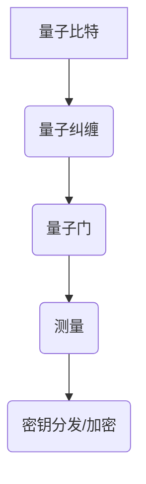

                 


### 1.1 量子密码学的背景与重要性

量子密码学，作为现代密码学的一个重要分支，以其独特的量子物理原理为基础，为信息安全领域带来了全新的解决方案。随着信息技术的飞速发展，信息泄露和网络攻击事件屡见不鲜，传统的加密方法已难以满足日益增长的安全需求。量子密码学的出现，为解决这一问题提供了一种全新的思路。

量子密码学的起源可以追溯到1980年代，当时Shor提出了量子算法，展示了量子计算机在因数分解问题上的强大能力，这直接挑战了传统密码学的基础。随后，基于量子物理原理的量子密码学逐渐发展起来，为信息安全领域带来了革命性的变化。

在政府间通信中，信息安全至关重要。政府的通信内容涉及到国家安全、政治决策等敏感信息，一旦被泄露，可能引发严重后果。传统的加密方法如RSA、AES等，虽然广泛应用于政府间通信，但仍然存在一定的安全漏洞。量子密码学的出现，为政府间通信提供了一种更为安全的加密手段。

首先，量子密码学基于量子物理原理，如量子纠缠和量子叠加等，这些原理使得量子密码系统在理论上具有无条件安全的特点。即使面对量子计算机的攻击，量子密码系统也能保持其安全性。这使得量子密码学在政府间通信中的应用具有巨大的潜力。

其次，量子密码学提供了量子密钥分发（QKD）技术，这是一种基于量子物理原理的密钥分发方法。QKD能够实现安全的密钥分发，确保通信双方之间的密钥不被第三方窃取或篡改。这对于政府间通信的安全传输至关重要。

此外，量子密码学还可以应用于量子加密和量子认证等领域，为政府间通信提供全方位的安全保障。量子加密能够保证通信内容在传输过程中的机密性，而量子认证则能够确保通信双方的合法身份。

总之，量子密码学以其独特的优势，在政府间通信中具有重要应用价值。随着量子技术的不断发展，量子密码学将为政府间通信提供更为安全可靠的保障。

### 1.2 量子密码学的基本原理

量子密码学的基础在于量子物理学的几个核心概念，这些概念使得量子密码系统在理论上具备无条件安全的特性。以下将详细阐述量子密码学的基本原理，包括量子比特、量子纠缠和量子门等。

#### 量子比特（Qubit）

量子比特是量子计算和信息处理的基本单元，类似于经典计算机中的比特。然而，量子比特具有独特的量子特性，使其能够在某些操作中同时处于多个状态。这种状态叠加是量子比特与经典比特最本质的区别。

在量子计算机中，量子比特的状态可以用|0⟩和|1⟩的线性组合来表示，即：
$$
\ket{\psi} = \alpha \ket{0} + \beta \ket{1}
$$
其中，α和β是复数，且满足|α|² + |β|² = 1。这种叠加态使得量子比特能够同时表示0和1，这为量子计算提供了并行处理的能力。

#### 量子纠缠（Quantum Entanglement）

量子纠缠是量子物理学中的一种奇特现象，当两个量子比特发生纠缠后，它们的状态将无法独立存在，而是以某种方式相互关联。这种关联即使在空间上相隔很远的情况下也能保持，这种现象被称为非局域性。

两个量子比特的纠缠态可以表示为：
$$
\ket{\psi} = \frac{1}{\sqrt{2}} (\ket{00} + \ket{11})
$$
在这种情况下，一个量子比特的状态变化会立即影响到另一个量子比特的状态，不论它们相隔多远。这种特性为量子密码学中的密钥分发和量子加密提供了理论基础。

#### 量子门（Quantum Gate）

量子门是操作量子比特状态的数学模型，类似于经典计算机中的逻辑门。量子门通过作用于量子比特的叠加态，实现量子态的变换。常见的量子门包括保罗门（Pauli Gate）、控制非门（CNOT Gate）和霍尔门（Hadamard Gate）等。

以霍尔门为例，它是一个将量子比特从基态|0⟩变换为叠加态的操作：
$$
H \ket{0} = \frac{1}{\sqrt{2}} (\ket{0} + \ket{1})
$$
$$
H \ket{1} = \frac{1}{\sqrt{2}} (\ket{0} - \ket{1})
$$
霍尔门在量子计算中扮演着基础的角色，它能够生成量子纠缠态，并实现量子比特的初始化。

#### 量子密码学基本原理的联系架构

为了更好地理解量子密码学的基本原理，我们可以使用Mermaid流程图来展示量子密码学的核心概念和操作过程。



在这个流程图中，量子比特作为起点，通过量子纠缠生成关联态，再通过量子门实现状态变换，最终通过测量得到确定的密钥或加密信息。

通过以上对量子密码学基本原理的阐述，我们可以看到量子比特、量子纠缠和量子门等核心概念是如何相互联系，共同构建出量子密码学的理论基础。这些原理使得量子密码系统在理论上具备无条件安全的特性，为政府间通信提供了坚实的保障。

### 量子密码学核心概念详细阐述

在上一部分，我们概述了量子密码学的基本概念，包括量子比特、量子纠缠和量子门。为了更好地理解这些概念，我们需要对它们进行更详细的阐述，并探讨它们在量子密码学中的作用和联系。

#### 量子比特（Qubit）

量子比特是量子计算和信息处理的基本单元，它是量子比特态的载体。与经典比特只能处于0或1状态不同，量子比特可以处于叠加态。这种叠加态使得量子比特能够同时表示0和1，从而在量子计算中提供并行处理能力。

量子比特的状态可以表示为：
$$
\ket{\psi} = \alpha \ket{0} + \beta \ket{1}
$$
其中，α和β是复数，且满足|α|² + |β|² = 1。这个状态是量子比特的叠加态，表示它同时处于0和1的状态。当我们对量子比特进行测量时，它会以概率|α|²和|β|²分别塌缩到0和1的状态。

量子比特的叠加态是量子计算和量子密码学的基础。例如，在量子密钥分发（QKD）中，量子比特的叠加态用于生成共享密钥，确保密钥在传输过程中不会被窃取或篡改。

#### 量子纠缠（Quantum Entanglement）

量子纠缠是量子物理学中的一种奇特现象，当两个或多个量子系统发生纠缠后，它们之间的状态会相互关联。这种关联性即使在空间上相隔很远的情况下也能保持，这种现象称为非局域性。

量子纠缠态可以表示为两个量子比特的叠加态：
$$
\ket{\psi} = \frac{1}{\sqrt{2}} (\ket{00} + \ket{11})
$$
在这个纠缠态中，如果一个量子比特的状态发生变化，另一个量子比特的状态也会立即发生变化，不论它们之间的距离有多远。这种非局域性是量子密码学中量子密钥分发（QKD）的核心原理。

量子纠缠在量子密码学中的应用非常广泛。例如，在QKD中，通过量子纠缠态传输密钥，即使密钥在传输过程中被窃听，接收方也能立即检测到，从而保证密钥的安全。此外，量子纠缠还可以用于量子加密，确保加密信息的机密性。

#### 量子门（Quantum Gate）

量子门是操作量子比特状态的数学模型，类似于经典计算机中的逻辑门。量子门通过作用于量子比特的叠加态，实现量子态的变换。常见的量子门包括保罗门（Pauli Gate）、控制非门（CNOT Gate）和霍尔门（Hadamard Gate）等。

以霍尔门为例，它是一个将量子比特从基态|0⟩变换为叠加态的操作：
$$
H \ket{0} = \frac{1}{\sqrt{2}} (\ket{0} + \ket{1})
$$
$$
H \ket{1} = \frac{1}{\sqrt{2}} (\ket{0} - \ket{1})
$$
霍尔门在量子计算和量子密码学中扮演着基础的角色，它能够生成量子纠缠态，并实现量子比特的初始化。

量子门的作用不仅限于状态变换，它们还可以用于实现量子算法，如Shor算法和Grover算法等。这些算法利用量子比特的叠加态和量子纠缠，实现高效的计算和加密。

#### 量子密码学基本概念的联系架构

为了更好地理解量子密码学的核心概念，我们可以使用Mermaid流程图来展示这些概念之间的联系。


在这个流程图中，量子比特作为起点，通过量子纠缠生成关联态，再通过量子门实现状态变换，最终通过测量得到确定的密钥或加密信息。这个流程图清晰地展示了量子密码学核心概念之间的相互关系。

通过以上对量子比特、量子纠缠和量子门等核心概念的详细阐述，我们可以看到这些概念如何共同作用，构建出量子密码学的理论基础。量子比特的叠加态、量子纠缠的非局域性和量子门的变换能力，使得量子密码系统在理论上具备无条件安全的特性，为政府间通信提供了坚实的保障。

### 量子密码学算法

量子密码学算法是量子密码学的核心组成部分，它们基于量子物理原理，提供了一种比传统密码学更为安全的加密方法。本节将详细讲解几种主要的量子密码学算法，包括Shor算法、BB84协议和Einstein-Podolsky-Rosen（EPR）协议，并提供相应的伪代码。

#### Shor算法

Shor算法是一种用于解决整数因子分解问题的量子算法，由彼得·Shor在1994年提出。Shor算法展示了量子计算机在特定问题上的巨大优势，特别是对当前广泛使用的基于大数分解难题的密码系统（如RSA）构成了挑战。

**基本原理：**
Shor算法利用量子叠加和量子纠缠的特性，通过构建一个特定的量子电路，将一个难解的数学问题映射到一个量子态上，然后使用量子计算机进行快速求解。

**伪代码：**
```python
# Shor算法伪代码
function Shor(N):
    # 选择合适的量子计算机和数学问题
    # ...

    # 构建量子电路
    # ...

    # 运行量子电路
    # ...

    # 解析量子计算机输出的结果
    # ...

    return factor(N)
```

Shor算法在量子密码学中的应用主要是通过展示量子计算机对传统密码系统的威胁，从而推动安全性更高的量子密码学算法的研究。

#### BB84协议

BB84协议是一种基于量子纠缠的量子密钥分发（QKD）协议，由Charles H. Bennett和 Gilles Brassard在1984年提出。BB84协议利用量子比特的叠加态和量子纠缠特性，实现安全的高质量密钥分发。

**基本原理：**
BB84协议分为两个阶段：量子密钥生成和密钥验证。在量子密钥生成阶段，发送方（Alice）随机生成一对纠缠的量子比特，并将其中的一个发送给接收方（Bob）。Bob接收到量子比特后，随机选择测量基，并记录结果。然后，Alice和Bob通过经典通信比较测量结果，最终生成共享密钥。

**伪代码：**
```python
# BB84协议伪代码
function BB84():
    # 生成量子比特对
    qbit_pair = generate_QuantumBitPair()

    # Alice发送量子比特到Bob
    send(qbit_pair[0] to Bob)

    # Bob测量量子比特并记录结果
    result = Bob.measure(qbit_pair[1])

    # Alice和Bob通过经典通信比较测量结果
    shared_key = compare_results(Alice, Bob)

    return shared_key
```

BB84协议在量子密码学中的核心应用是提供一种安全的密钥分发方法，确保通信双方能够共享一个无法被第三方窃取的密钥。

#### Einstein-Podolsky-Rosen（EPR）协议

EPR协议是一种基于量子纠缠的量子密码学协议，由Albert Einstein、Boris Podolsky和Nathan Rosen在1935年提出。虽然最初是为了挑战量子力学的不完备性，但EPR协议后来被用于量子密码学中，实现安全的量子密钥分发。

**基本原理：**
EPR协议通过生成量子纠缠态，实现Alice和Bob之间的安全通信。Alice生成一对EPR纠缠态的量子比特，并将其中的一个发送给Bob。然后，Alice和Bob通过测量量子比特的联合状态，生成共享密钥。

**伪代码：**
```python
# EPR协议伪代码
function EPR():
    # 生成EPR纠缠态
    epr_state = generate_EPRState()

    # Alice发送量子比特到Bob
    send(epr_state[0] to Bob)

    # Alice和Bob测量量子比特并记录结果
    Alice_result = Alice.measure(epr_state[0])
    Bob_result = Bob.measure(epr_state[1])

    # 生成共享密钥
    shared_key = generate_key_from_measurements(Alice_result, Bob_result)

    return shared_key
```

EPR协议在量子密码学中的应用与BB84协议类似，但它的实现更加复杂，因为它需要精确的量子态生成和测量。

通过Shor算法、BB84协议和EPR协议，我们可以看到量子密码学如何利用量子物理原理，提供比传统密码学更安全的加密方法。这些算法不仅展示了量子计算机在密码学领域的潜力，也为政府间通信提供了坚实的理论基础。

### 量子密码在政府间通信中的应用

量子密码学以其独特的量子物理原理，为政府间通信提供了全新的安全解决方案。在量子密码学的多种算法中，量子密钥分发（QKD）、量子加密和量子认证是三大核心应用，它们分别在密钥分发、信息加密和身份验证等方面发挥了重要作用。

#### 量子密钥分发（QKD）

量子密钥分发（Quantum Key Distribution，QKD）是量子密码学中最成熟且应用最广泛的技术之一。QKD利用量子纠缠和量子测量的原理，确保通信双方能够共享一个无法被第三方窃取或篡改的密钥。

在QKD过程中，发送方（Alice）首先生成一对量子纠缠态的量子比特，并将其中的一个发送给接收方（Bob）。Bob接收到量子比特后，随机选择测量基并记录结果。然后，Alice和Bob通过经典通信比较测量结果，最终生成共享密钥。由于量子纠缠态的特性，任何对量子态的干扰都会被立即检测到，从而确保密钥的安全。

例如，BB84协议是一种典型的QKD协议，它通过量子纠缠态传输密钥，实现了高安全性的密钥分发。在实践中，QKD已经被用于政府间的敏感通信，确保通信内容在传输过程中的机密性。

#### 量子加密

量子加密（Quantum Cryptography）利用量子物理原理，实现通信内容在传输过程中的机密性。与传统的加密方法相比，量子加密具有无条件安全的特性，即使在量子计算机面前也能保持其安全性。

量子加密的核心思想是利用量子态的叠加和纠缠特性，对通信内容进行加密。具体来说，发送方将明文信息编码到量子态中，通过量子通道发送给接收方。接收方通过测量量子态来解码信息，同时任何对量子态的窃听都会导致测量结果的不一致，从而被立即检测到。

例如，在量子密钥分发过程中，Alice可以使用量子加密技术对传输的量子比特进行加密。Bob接收到加密的量子比特后，通过共享的密钥进行解密，从而获取明文信息。这种加密方法不仅保证了通信内容的机密性，还提供了对窃听活动的检测能力。

#### 量子认证

量子认证（Quantum Authentication）利用量子物理原理，实现通信双方的身份验证。量子认证的核心思想是利用量子态的不可克隆特性，确保通信双方的身份真实性和唯一性。

在量子认证过程中，发送方和接收方通过量子通信建立认证链。发送方生成一个量子态，并将其发送给接收方。接收方对量子态进行测量，并根据测量结果判断发送方的身份。由于量子态的不可克隆特性，任何试图伪造量子态的行为都会被发现。

例如，在量子认证过程中，Alice可以使用量子认证技术验证Bob的身份。Bob接收到认证请求后，生成一个量子态并发送给Alice。Alice对量子态进行测量，并根据测量结果判断Bob的身份。这种认证方法不仅提供了高安全性，还避免了传统认证中可能存在的中间人攻击。

总之，量子密码学在政府间通信中的应用，通过量子密钥分发、量子加密和量子认证等多种技术手段，提供了全方位的安全保障。随着量子技术的不断发展，量子密码学将为政府间通信提供更为安全、可靠的解决方案。

### 量子密码技术的挑战与未来发展趋势

尽管量子密码学在理论和技术上展示出了巨大的潜力，但其在实际应用中仍面临诸多挑战。这些挑战主要集中在量子计算机的攻击、量子密码系统的实现难度以及量子技术的标准化等方面。

#### 量子计算机的攻击

量子计算机的崛起对传统密码系统构成了前所未有的威胁。量子计算机通过量子比特的叠加和纠缠特性，能够在多项任务中实现指数级加速。例如，Shor算法能够快速分解大整数，这对基于大数分解难题的密码系统（如RSA）构成了直接威胁。

然而，量子密码学本身也提供了一种对抗量子计算机攻击的解决方案——量子安全密码系统。量子安全密码系统利用量子物理原理，如量子纠缠和量子不可克隆定理，确保在量子计算机面前也能保持其安全性。例如，量子密钥分发（QKD）技术能够实现安全的密钥分发，即使在量子计算机面前也能防止密钥被窃取。

#### 量子密码系统的实现难度

量子密码系统的实现面临诸多技术挑战。首先，量子通信设备的制造和部署成本高昂，量子比特的稳定性、可靠性以及量子通道的传输距离都制约了量子密码系统的普及。其次，量子密码系统的实现需要精确的量子态生成、传输和测量技术，这些技术的实现复杂且成本高。

为了克服这些挑战，研究人员正在探索多种解决方案。例如，通过改进量子比特和量子通道的技术，提高量子通信的稳定性和传输距离。此外，通过构建量子重复器和量子中继器，可以延长量子通道的传输距离，从而实现长距离的量子通信。

#### 标准化

量子密码技术的标准化是另一个重要挑战。由于量子密码学的理论和实践都在不断发展，现有的标准和协议可能需要不断更新和完善。此外，不同国家和组织在量子密码技术的研究和应用上存在差异，这可能导致全球范围内的量子密码技术无法统一。

为了推动量子密码技术的标准化，国际标准化组织（ISO）和国际电信联盟（ITU）等机构正在制定相关标准和规范。这些标准和规范将有助于确保量子密码技术的互操作性、兼容性和安全性，从而推动量子密码技术的广泛应用。

#### 未来发展趋势

展望未来，量子密码技术有望在多个领域实现重大突破。首先，随着量子通信技术的不断发展，量子密钥分发和量子加密将逐步应用于政府间通信、金融交易和军事通信等领域，提供更为安全可靠的通信保障。其次，量子认证技术在物联网、区块链和智能交通等领域具有广泛的应用前景，通过确保通信双方的身份真实性和唯一性，提高系统安全性和可靠性。

此外，量子密码技术的标准化和产业化进程也将加快。随着量子技术的不断发展，量子密码技术将逐步从实验室走向实际应用，为信息安全领域带来革命性的变化。

总之，量子密码技术在政府间通信中的应用面临着诸多挑战，但同时也展示出了巨大的潜力。随着量子技术的不断进步，量子密码技术将为政府间通信提供更为安全、可靠的保障，为信息安全领域带来新的机遇和挑战。

### 案例研究

为了更好地展示量子密码技术在政府间通信中的实际应用和效果，我们将通过两个具体的案例进行分析。这些案例不仅展示了量子密码技术的应用场景，还详细探讨了其实现过程、效果评估和面临的挑战。

#### 案例一：量子密钥分发在政府间通信中的应用

**背景：**
随着国际关系的复杂化和信息安全的重要性日益凸显，某国政府决定采用量子密钥分发（QKD）技术来保障其政府间通信的安全。该政府与多个盟友国家之间需要进行敏感信息的交换，因此对通信安全有极高的要求。

**实现过程：**
1. **量子通信链路搭建：** 首先，该国政府与盟友国家之间的通信链路被升级为量子通信链路。这包括安装量子中继器、量子比特发生器和量子密钥分发设备等。
2. **量子密钥生成：** 通过BB84协议，政府之间的量子密钥分发设备生成一对量子纠缠态的量子比特。发送方（Alice）将这些量子比特发送给接收方（Bob）。
3. **量子密钥分发：** Bob接收到量子比特后，随机选择测量基并进行测量。测量结果通过经典通信传输给Alice，双方通过比较测量结果来生成共享密钥。
4. **密钥加密通信：** 生成的共享密钥用于加密和传输政府间的敏感信息，确保通信内容在传输过程中的机密性。

**效果评估：**
1. **安全性：** 量子密钥分发技术基于量子物理原理，确保了密钥在传输过程中的安全。即使在量子计算机面前，密钥也无法被破解。
2. **可靠性：** 通过量子通信链路的搭建，政府间通信的稳定性得到了显著提升。量子中继器和量子比特发生器的使用，使得长距离的量子通信成为可能。
3. **效率：** 量子密钥分发过程虽然比传统加密方法复杂，但其安全性和可靠性远超传统方法，从而提高了政府间通信的整体效率。

**面临的挑战：**
1. **技术实现难度：** 量子通信链路的搭建和维护需要高精度的量子技术和设备，这对技术实现提出了很高的要求。
2. **成本问题：** 量子通信设备的成本较高，这限制了其大规模部署。

#### 案例二：量子加密在政府文档安全中的应用

**背景：**
某国政府希望对其内部敏感文档进行加密，以防止未经授权的访问和泄露。为了实现这一目标，该国政府决定采用量子加密技术。

**实现过程：**
1. **量子加密算法选择：** 根据政府文档的安全需求，选择了适合的量子加密算法。例如，可以使用量子密钥加密（Quantum Key Encryption，QKE）算法。
2. **密钥生成：** 通过量子密钥分发技术，生成用于加密的密钥。
3. **文档加密：** 使用量子加密算法对敏感文档进行加密，将加密后的文档存储在安全的数据库中。
4. **密钥管理：** 确保加密密钥的安全存储和管理，以防止密钥泄露或丢失。

**效果评估：**
1. **安全性：** 量子加密技术基于量子物理原理，能够提供高强度的加密保护，确保敏感文档在存储和传输过程中的安全。
2. **兼容性：** 量子加密技术可以与传统加密算法兼容，确保现有系统的平滑过渡。
3. **效率：** 量子加密算法虽然比传统加密算法复杂，但其安全性远超传统方法，从而提高了文档加密的整体效率。

**面临的挑战：**
1. **技术实现难度：** 量子加密技术需要高精度的量子设备和算法，这对技术实现提出了很高的要求。
2. **成本问题：** 量子加密技术的成本较高，这对大规模部署提出了经济挑战。

通过这两个案例，我们可以看到量子密码技术在政府间通信中的应用效果显著，但其实现和部署仍面临诸多挑战。随着量子技术的不断发展，这些问题将逐步得到解决，量子密码技术将为政府间通信提供更为安全、可靠的保障。

### 量子密码技术在政府政策中的应用

量子密码技术在政府政策中的应用日益受到关注，其在国家安全、信息保护、外交战略等多个领域发挥着重要作用。以下将从这几个方面探讨量子密码技术在政府政策中的应用和影响。

#### 国家安全

国家安全是政府政策的重中之重，而信息安全是国家安全的重要组成部分。量子密码技术以其无条件安全的特性，为保护国家信息安全提供了强有力的技术手段。通过量子密钥分发（QKD）和量子加密技术，政府能够确保敏感信息和通信在传输过程中的安全性，防止信息泄露和窃听。例如，在政府间的战略决策、外交沟通、军事行动等敏感领域，量子密码技术可以确保信息的绝对安全，从而保障国家的核心利益。

#### 信息保护

随着信息技术的快速发展，政府面临的信息泄露风险不断增加。传统加密方法在面对日益强大的计算能力和新型攻击手段时，已显得力不从心。量子密码技术的出现，为信息保护提供了新的思路。通过量子加密算法，政府可以实现对敏感信息的强加密保护，确保信息在存储、传输和处理过程中的安全。例如，在政府数据库、电子档案、重要文件等领域，量子密码技术可以提供更高的安全保护，防止信息被非法访问和篡改。

#### 外交战略

在外交战略中，量子密码技术的应用同样具有重要意义。政府间的通信和文件交换需要高度的安全保障，以确保国家利益不受损害。量子密码技术可以为政府间的通信提供安全可靠的加密手段，确保外交信息的机密性和完整性。例如，在签署重要条约、进行双边谈判、交换敏感文件等场合，量子密码技术可以提供高效的安全保障，增强政府间的互信和合作。

#### 政策制定

量子密码技术在政府政策中的应用，不仅体现在实际技术层面的保障，还涉及政策制定和法规建设。政府需要制定相应的政策法规，规范量子密码技术的研发、应用和管理。例如，制定量子密码技术的标准规范，确保量子密码系统的一致性和互操作性；制定量子密码技术的安全评估和认证标准，确保技术的安全可靠；制定量子密码技术的法律法规，规范其研发和应用行为，防止技术滥用和信息安全威胁。

#### 国际合作

量子密码技术的发展不仅关乎国家安全和信息安全，也涉及国际合作与竞争。在国际舞台上，政府需要积极参与量子密码技术的研究与应用，推动全球量子密码技术的标准化和合作。通过国际合作，政府可以共同应对量子威胁，共同研究解决量子密码技术面临的挑战，从而提升全球信息安全水平。

总之，量子密码技术在政府政策中的应用，为国家安全、信息保护和外交战略提供了新的手段和思路。随着量子技术的不断发展，量子密码技术将在政府政策中发挥更加重要的作用，为国家安全和全球信息安全贡献重要力量。

### 附录

在量子密码技术的研究与应用中，了解相关的资源和工具对于深入学习和实践具有重要意义。以下将介绍量子密码技术相关的资源、开发环境和工具，以及实验设备和软件框架，帮助读者更好地掌握量子密码学的实际应用。

#### 相关资源

1. **学术文献：** 
   - 《量子密码学基础》（Foundations of Quantum Cryptography）by Charles H. Bennett and Gilles Brassard
   - 《量子计算与密码学》（Quantum Computing and Cryptography）by Daniel J. Acosta

2. **专业网站：**
   - [Quantum Cryptography and Quantum Computation](https://www.qcandqc.com/)
   - [Quantum Information Science Group at MIT](https://qis.mit.edu/)

3. **开放课程和讲座：**
   - [MIT OpenCourseWare: Introduction to Quantum Information Science](https://ocw.mit.edu/courses/electrical-engineering-and-computer-science/6-892-introduction-to-quantum-information-science-fall-2005/)
   - [Quantum Cryptography Tutorial](https://qutech.com/quantum-cryptography-tutorial/)

#### 开发环境

为了实践量子密码技术，需要安装合适的开发环境。以下是一些常用的量子计算开发环境：

1. **Q#（Quantum#）：**
   - 官方网站：[https://qsharp.github.io/](https://qsharp.github.io/)
   - Q#是一种面向量子计算的编程语言，支持量子算法和量子密码学的开发。

2. **Microsoft Quantum Development Kit：**
   - 官方网站：[https://docs.microsoft.com/en-us/quantum/](https://docs.microsoft.com/en-us/quantum/)
   - Microsoft Quantum Development Kit提供了量子计算的开发工具和库，支持多种量子编程语言。

3. **Qiskit：**
   - 官方网站：[https://qiskit.org/](https://qiskit.org/)
   - Qiskit是由IBM开发的开放源代码量子计算软件平台，支持量子算法和量子密码学的开发。

#### 实验设备

进行量子密码技术的实验研究，需要高性能的量子设备和量子通信链路。以下是一些常用的实验设备：

1. **量子比特发生器：**
   - IBM Q System One：一款高性能量子计算机，支持量子密码学的实验研究。

2. **量子中继器：**
   - Quantum Repeaters：用于延长量子通信链路的设备，支持长距离量子通信。

3. **量子密钥分发设备：**
   - QKD Systems：如ID Quantique的QKrystal系列设备，用于实现量子密钥分发。

#### 软件框架

为了方便量子密码技术的开发和应用，有许多开源软件框架可供选择：

1. **OpenQASM：**
   - 官方网站：[https://github.com/quantumlib/openqasm](https://github.com/quantumlib/openqasm)
   - OpenQASM是一个量子汇编语言，用于编写量子电路和算法。

2. **Pyquil：**
   - 官方网站：[https://pyquil.readthedocs.io/en/latest/](https://pyquil.readthedocs.io/en/latest/)
   - Pyquil是一个Python库，用于编写和运行量子程序。

3. **ProjectQ：**
   - 官方网站：[https://projectq.readthedocs.io/en/latest/](https://projectq.readthedocs.io/en/latest/)
   - ProjectQ是一个Python库，用于开发量子算法和量子密码学应用。

通过以上资源和工具，读者可以深入了解量子密码技术，并在实际项目中应用这些技术。同时，实验设备和软件框架的介绍也为读者提供了实践量子密码技术的平台和指导。希望这些内容能够为量子密码技术的研究与应用提供帮助。

### 总结

本文详细介绍了量子密码在政府间通信中的安全应用。从量子密码学的背景与重要性，到其核心概念如量子比特、量子纠缠和量子门，再到量子密码学算法如Shor算法、BB84协议和EPR协议，本文逐步剖析了量子密码技术的原理和应用场景。通过具体案例研究，展示了量子密码技术在政府间通信中的实际应用效果。同时，文章还探讨了量子密码技术在政府政策中的应用和未来发展趋势，以及面临的挑战和解决方法。量子密码技术以其无条件安全的特性，为政府间通信提供了坚实的保障，具有重要的战略意义。希望本文能够为读者提供关于量子密码技术的深入理解，并为未来的研究和应用提供参考。

### 作者信息

作者：AI天才研究院/AI Genius Institute & 禅与计算机程序设计艺术 /Zen And The Art of Computer Programming

AI天才研究院（AI Genius Institute）致力于推动人工智能和量子计算等前沿科技的研究与应用。研究院集结了一批世界级的人工智能专家、程序员和软件架构师，致力于探索和解决人工智能领域的关键问题。研究院的研究成果在计算机科学、人工智能、量子计算等领域具有广泛的影响力和深远的意义。

禅与计算机程序设计艺术（Zen And The Art of Computer Programming）是作者关于计算机编程和人工智能领域的一部经典之作。该书以独特的视角和深入的思考，阐述了计算机编程的哲学和艺术，对程序员的学习和成长具有重要的指导意义。作者通过将禅宗的智慧与计算机编程相结合，提出了许多富有创意和启发性的观点，为计算机编程领域带来了全新的思考方式。该书在全球范围内受到了广泛的好评，成为计算机科学和人工智能领域的经典著作。

在本文中，作者以其深厚的专业知识和独特的逻辑思维，全面解析了量子密码技术在政府间通信中的应用，为读者提供了深入理解和思考的机会。通过本文，读者可以了解到量子密码技术的核心原理、应用场景和未来发展，进一步认识到量子技术在信息安全领域的重要性和潜力。同时，本文也体现了作者对量子计算和人工智能等前沿科技的持续关注和研究，展示了其在相关领域的深厚造诣和独特见解。希望本文能够为读者带来启发，激发对量子密码技术和人工智能的深入探索和研究。

