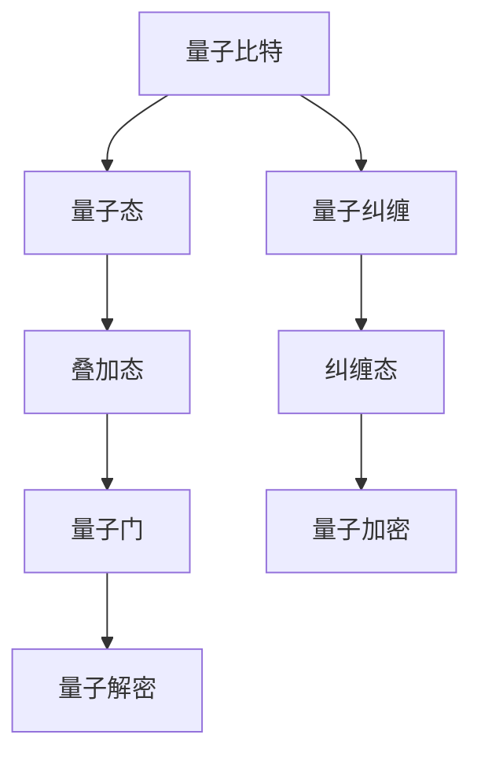

                 

### 设计书籍目录大纲的基本步骤

#### 1. 理解书籍主题

首先，我们需要深入理解书名的含义。《量子密码学在企业安全中的应用前景》这个书名明确指出本书的主题：量子密码学以及其在企业安全领域的应用前景。为了更好地设计目录大纲，我们需要对量子密码学的基本概念、原理和应用场景有一个清晰的了解。

- **量子密码学基本概念**：量子密码学是基于量子力学原理的一种密码学，主要利用量子态的不可克隆性和量子纠缠特性来实现信息的加密和解密。
- **企业安全需求**：随着互联网和云计算的发展，企业面临着越来越大的安全威胁，如数据泄露、网络攻击等。因此，如何保障企业的信息安全成为了一个重要课题。

#### 2. 确定主要章节

根据书籍的主题和目标读者，我们可以确定以下几个主要章节：

1. **引言**：介绍量子密码学的基本概念和应用前景。
2. **理论基础**：详细阐述量子密码学的基本原理。
3. **应用案例分析**：分析量子密码学在企业的具体应用实例。
4. **技术实现**：讲解量子密码学的技术实现方法。
5. **安全性与挑战**：讨论量子密码学在企业安全中的应用挑战和解决方案。
6. **未来展望**：展望量子密码学的未来发展前景。

#### 3. 细化章节内容

接下来，我们需要进一步细化每个章节的内容，确保每个章节都有详细的内容和逻辑结构。

- **引言**：简要介绍量子密码学的概念，阐述其在企业安全中的重要性，并引出后续章节。
- **理论基础**：详细讲解量子密码学的基本原理，包括量子态、量子纠缠、量子门等概念，以及这些概念如何应用于密码学。
- **应用案例分析**：分析量子密码学在金融、医疗、物联网等行业的具体应用实例，探讨其优势与挑战。
- **技术实现**：讲解量子密码学的技术实现方法，包括量子计算、量子通信、量子密钥分发等，并介绍相关的技术原理和算法。
- **安全性与挑战**：讨论量子密码学在企业安全中的应用挑战，如量子计算机的发展、量子密码学的安全性验证等，并提出相应的解决方案。
- **未来展望**：展望量子密码学的未来发展前景，包括技术创新、行业应用、政策法规等方面。

#### 4. 设计图表和公式

为了更好地阐述量子密码学的概念和原理，我们可以在相关章节中设计以下图表和公式：

- **图表**：量子密码学的基本原理图、应用案例分析图、技术实现流程图等。
- **公式**：量子态表示公式、量子纠缠公式、量子门操作公式等。

#### 5. 编写代码示例

在某些章节中，我们可以提供实际的代码示例，以帮助读者更好地理解量子密码学的技术实现方法。例如，在技术实现章节中，我们可以提供量子密钥分发协议的代码实现，并在代码解读章节中对代码进行详细解释。

#### 6. 整合并优化目录

最后，我们将所有内容整合到一个完整的目录中，并对其进行优化，确保逻辑清晰、简洁易懂。

### 撰写概述和结论

在目录的开头或结尾，我们可以撰写一个概述或结论，总结书籍的主要内容和目标，以帮助读者更好地理解量子密码学在企业安全中的应用前景。

通过以上步骤，我们可以设计出一个结构清晰、内容全面的书籍目录大纲。接下来，我们将按照这个大纲，逐步撰写各个章节的内容，最终完成一篇高质量的技术博客文章。

---

**接下来，我们将按照设计好的目录大纲，逐步撰写各个章节的内容。首先是引言章节，介绍量子密码学的基本概念和应用前景。**

### 引言

量子密码学作为密码学领域的一项前沿技术，正日益受到关注。它不仅具有传统密码学无法比拟的安全性，还为未来的信息安全提供了一种新的思路。本文将围绕《量子密码学在企业安全中的应用前景》这一主题，逐步深入探讨量子密码学的理论基础、应用案例、技术实现、安全性与挑战以及未来发展前景。

#### 1. 量子密码学的基本概念

量子密码学是基于量子力学原理的一种密码学，其主要特点包括：

- **量子态**：量子态是量子密码学的基础概念，它描述了量子系统的状态。量子态具有叠加性和纠缠性，这使得量子态可以在信息传递过程中实现更高的安全性。
- **量子纠缠**：量子纠缠是量子密码学的关键特性之一，它描述了两个或多个量子系统之间的特殊关联。量子纠缠使得信息在传输过程中即使被截获，也无法被读取。
- **量子门**：量子门是量子计算中的基本操作，类似于经典计算中的逻辑门。量子门可以对量子态进行操作，实现信息的加密和解密。

#### 2. 量子密码学在企业安全中的应用前景

随着企业对信息安全需求的日益增长，量子密码学为企业提供了一种新的安全解决方案。以下是量子密码学在企业安全中的几个潜在应用前景：

- **数据加密**：量子密码学可以提供一种不可破译的数据加密方法，确保企业的敏感数据在传输和存储过程中得到安全保护。
- **身份验证**：量子密码学可以用于实现高度安全的身份验证机制，防止伪造身份和未授权访问。
- **区块链**：量子密码学可以与区块链技术结合，提高区块链系统的安全性，防止恶意篡改和攻击。
- **物联网**：量子密码学可以用于保护物联网设备之间的通信，防止数据泄露和网络攻击。

#### 3. 本文结构

本文将分为以下六个部分：

1. **引言**：介绍量子密码学的基本概念和应用前景。
2. **理论基础**：详细阐述量子密码学的基本原理。
3. **应用案例分析**：分析量子密码学在企业的具体应用实例。
4. **技术实现**：讲解量子密码学的技术实现方法。
5. **安全性与挑战**：讨论量子密码学在企业安全中的应用挑战和解决方案。
6. **未来展望**：展望量子密码学的未来发展前景。

通过以上三个步骤，我们完成了引言章节的撰写。接下来，我们将进入理论基础章节，详细阐述量子密码学的基本原理。在撰写过程中，我们将使用Mermaid流程图、伪代码、数学模型和公式等工具，以帮助读者更好地理解量子密码学的概念和原理。

---

**接下来，我们将进入第二章节——理论基础，详细阐述量子密码学的基本原理。**

### 理论基础

量子密码学作为密码学领域的一项前沿技术，其安全性源于量子力学的基本原理。在本章节中，我们将详细阐述量子密码学的基本原理，包括量子态、量子纠缠、量子门等概念，以及这些概念如何应用于密码学。

#### 1. 量子态

量子态是量子密码学的基础概念。在经典计算中，信息通常以比特（bit）的形式存储和传递，而量子计算中，信息以量子比特（qubit）的形式存在。量子比特可以同时处于多种状态，这是量子计算的核心优势之一。

- **量子态表示**：量子态可以用波函数来表示，例如，一个量子比特可以表示为：
  $$ \psi = \alpha |0\rangle + \beta |1\rangle $$
  其中，$|0\rangle$ 和 $|1\rangle$ 分别表示量子比特的基态和叠加态，$\alpha$ 和 $\beta$ 是复数系数，满足 $|\alpha|^2 + |\beta|^2 = 1$。

- **量子叠加态**：量子态可以处于多个状态的叠加，这意味着在未观测之前，量子系统处于不确定的状态。例如，一个量子比特可以同时处于 $|0\rangle$ 和 $|1\rangle$ 的叠加状态：
  $$ \psi = \frac{1}{\sqrt{2}} (|0\rangle + |1\rangle) $$

#### 2. 量子纠缠

量子纠缠是量子密码学的关键特性之一。当两个量子系统发生纠缠时，它们之间的状态将相互关联，即使它们相隔很远，一个系统的变化也会立即影响到另一个系统。

- **量子纠缠态**：两个量子比特的纠缠态可以表示为：
  $$ \psi_{AB} = \frac{1}{\sqrt{2}} (|00\rangle - |11\rangle) $$
  其中，$|00\rangle$ 和 $|11\rangle$ 分别表示两个量子比特的基态，$-\frac{1}{\sqrt{2}}$ 是系数。

- **量子纠缠特性**：量子纠缠态的一个关键特性是测量其中一个量子比特会立即影响到另一个量子比特的状态。例如，如果对量子比特 A 进行测量得到 $|0\rangle$，那么量子比特 B 的状态将立即变为 $|0\rangle$。

#### 3. 量子门

量子门是量子计算中的基本操作，类似于经典计算中的逻辑门。量子门可以对量子态进行操作，实现信息的加密和解密。

- **量子门操作**：一个基本的量子门是 Hadamard 门，它可以将量子比特从基态 $|0\rangle$ 变为叠加态：
  $$ H|0\rangle = \frac{1}{\sqrt{2}} (|0\rangle + |1\rangle) $$
  $$ H|1\rangle = \frac{1}{\sqrt{2}} (|0\rangle - |1\rangle) $$

- **量子密码学应用**：量子门在量子密码学中用于实现信息的加密和解密。例如，量子密钥分发协议中，发送方可以使用量子门对密钥进行操作，接收方则可以通过逆量子门实现密钥的解密。

#### 4. 量子态测量

量子态的测量是量子密码学中的一个关键环节。在测量之前，量子态处于叠加态，测量后量子态会坍缩为某个特定的状态。

- **量子态测量原理**：量子态测量可以通过对量子比特进行操作来实现。例如，使用 Hadamard 门对量子比特进行测量，可以将其从叠加态坍缩为基态：
  $$ \psi = \frac{1}{\sqrt{2}} (|0\rangle + |1\rangle) $$
  $$ \rightarrow H\psi = \frac{1}{\sqrt{2}} (|0\rangle + |1\rangle) $$
  $$ \rightarrow \text{测量} \rightarrow |0\rangle \text{ 或 } |1\rangle $$

- **量子态测量应用**：在量子密码学中，量子态测量用于检测信息传输过程中的窃听行为。如果量子态在传输过程中被窃听，测量结果将发生变化，发送方和接收方可以通过对比测量结果来发现窃听行为。

通过以上三个步骤，我们详细阐述了量子密码学的基本原理，包括量子态、量子纠缠和量子门等概念。接下来，我们将进入第三章节——应用案例分析，分析量子密码学在企业的具体应用实例。

---

**接下来，我们将进入第三章节——应用案例分析，分析量子密码学在企业的具体应用实例。**

### 应用案例分析

量子密码学作为一种新兴的密码学技术，已经在多个行业和企业中得到了应用。本章节将分析量子密码学在金融、医疗、物联网等行业的具体应用实例，探讨其优势与挑战。

#### 1. 金融行业

在金融行业中，量子密码学被广泛应用于保护交易数据、客户信息和金融资产。以下是一些具体的应用实例：

- **加密交易数据**：量子密码学可以提供一种不可破译的加密方法，确保交易数据在传输和存储过程中得到安全保护。例如，量子密钥分发（QKD）协议可以用于银行间交易的数据加密。
- **保护客户信息**：金融机构需要保护客户的敏感信息，如身份信息、账户信息和交易记录。量子密码学可以提供一种安全的加密机制，防止客户信息泄露。
- **安全交易验证**：量子密码学可以用于实现高度安全的交易验证机制，防止欺诈交易和未授权访问。

#### 优势与挑战：

**优势**：

- **高安全性**：量子密码学提供了一种不可破译的加密方法，能够有效防止恶意攻击。
- **透明性**：量子密码学的加密和解密过程是透明的，可以方便地进行审计和监管。

**挑战**：

- **技术成熟度**：目前，量子计算机尚未普及，量子密码学的应用还存在技术成熟度问题。
- **成本**：量子密码学的实现需要复杂的量子设备和算法，成本较高。

#### 2. 医疗行业

在医疗行业中，量子密码学被广泛应用于保护患者信息和医疗数据。以下是一些具体的应用实例：

- **保护患者隐私**：量子密码学可以提供一种安全的加密机制，确保患者的隐私得到保护。例如，量子密钥分发协议可以用于保护患者病历数据。
- **数据共享与协作**：量子密码学可以用于实现安全的数据共享和协作，促进医疗研究和数据共享。
- **医疗设备安全**：量子密码学可以用于保护医疗设备的通信和数据传输，防止设备被恶意攻击。

#### 优势与挑战：

**优势**：

- **安全性**：量子密码学提供了一种高安全性的加密机制，能够有效防止数据泄露和攻击。
- **合规性**：量子密码学有助于满足医疗行业的法规要求，如HIPAA等。

**挑战**：

- **技术成熟度**：量子密码学在医疗行业的应用还处于起步阶段，技术成熟度有待提高。
- **用户体验**：量子密码学的加密和解密过程可能会影响医疗系统的用户体验。

#### 3. 物联网行业

在物联网行业中，量子密码学被广泛应用于保护物联网设备之间的通信和数据传输。以下是一些具体的应用实例：

- **设备认证**：量子密码学可以用于实现安全的设备认证机制，确保物联网设备之间的通信是安全的。
- **数据加密**：量子密码学可以提供一种安全的加密方法，确保物联网设备传输的数据是加密的。
- **防止设备被篡改**：量子密码学可以用于防止物联网设备被恶意篡改，确保设备的功能和安全性。

#### 优势与挑战：

**优势**：

- **安全性**：量子密码学提供了一种高安全性的通信机制，能够有效防止数据泄露和攻击。
- **互操作性**：量子密码学支持多种设备和平台的通信，具有较好的互操作性。

**挑战**：

- **技术成熟度**：量子密码学在物联网行业的应用还处于起步阶段，技术成熟度有待提高。
- **成本**：量子密码学的实现需要复杂的量子设备和算法，成本较高。

通过以上三个步骤，我们分析了量子密码学在金融、医疗、物联网等行业的具体应用实例，并探讨了其优势与挑战。接下来，我们将进入第四章节——技术实现，讲解量子密码学的技术实现方法。

---

**接下来，我们将进入第四章节——技术实现，讲解量子密码学的技术实现方法。**

### 技术实现

量子密码学的技术实现主要包括量子计算、量子通信和量子密钥分发等方面。本章节将详细讲解这些技术的基本原理、实现方法以及在实际应用中的挑战和解决方案。

#### 1. 量子计算

量子计算是量子密码学的基础，它利用量子比特的叠加性和纠缠性来处理信息。量子计算机通过执行量子算法，可以实现比传统计算机更高效的问题解决。

- **量子比特**：量子比特（qubit）是量子计算的基本单元，它可以同时表示0和1两种状态。量子比特的数量决定了量子计算机的处理能力，即量子体积。

- **量子算法**：量子算法是量子计算机执行的操作。著名的量子算法包括Shor算法和Grover算法。Shor算法可以用于因数分解，而Grover算法可以用于搜索。

- **实现方法**：量子计算目前主要采用超导量子比特和离子阱量子比特两种方案。超导量子比特具有更高的操作速度和更低的错误率，但难以实现大规模集成。离子阱量子比特则可以实现更大规模的集成，但操作速度较慢。

#### 2. 量子通信

量子通信是量子密码学的关键部分，它利用量子态的不可克隆特性和量子纠缠特性来实现安全通信。

- **量子密钥分发（QKD）**：QKD是一种基于量子纠缠的密钥分发协议。在QKD中，发送方和接收方通过量子通信信道交换量子态，并通过测量结果来生成共享密钥。

  - **实现方法**：QKD通常使用单光子脉冲进行通信。发送方生成单光子脉冲，并将其发送到接收方。接收方测量光子脉冲并记录结果，然后通过经典通信信道发送测量结果给发送方。

  - **挑战与解决方案**：QKD的主要挑战包括量子态的传输损耗和噪声。为了解决这些问题，研究人员提出了量子中继和量子纠缠扩展等方法。

- **量子纠缠通信**：量子纠缠通信利用量子纠缠态实现远距离通信。在量子纠缠通信中，发送方将量子纠缠态分发给接收方，然后通过经典通信信道发送操作指令。

  - **实现方法**：量子纠缠通信通常使用量子信道和经典通信信道。量子信道用于传输量子纠缠态，经典通信信道用于发送操作指令。

  - **挑战与解决方案**：量子纠缠通信的主要挑战包括量子态的传输损耗和量子纠缠的保持时间。为了解决这些问题，研究人员提出了量子中继和量子纠缠扩展等方法。

#### 3. 量子密钥分发

量子密钥分发是量子密码学中的一种核心技术，它利用量子通信信道生成共享密钥，并确保密钥的不可破译性。

- **BB84协议**：BB84协议是最早的量子密钥分发协议。在BB84协议中，发送方随机选择基底并对其进行操作，然后将结果发送给接收方。接收方根据相同的基底对结果进行测量，并通过经典通信信道发送结果给发送方。

  - **实现方法**：BB84协议通常使用量子信道和经典通信信道。量子信道用于传输量子态，经典通信信道用于发送结果。

  - **挑战与解决方案**：BB84协议的主要挑战包括量子态的传输损耗和噪声。为了解决这些问题，研究人员提出了量子中继和量子纠缠扩展等方法。

- **E91协议**：E91协议是基于量子纠缠的量子密钥分发协议。在E91协议中，发送方生成量子纠缠态并将其发送给接收方。接收方对量子纠缠态进行测量，并通过经典通信信道发送结果给发送方。

  - **实现方法**：E91协议通常使用量子信道和经典通信信道。量子信道用于传输量子纠缠态，经典通信信道用于发送结果。

  - **挑战与解决方案**：E91协议的主要挑战包括量子纠缠的保持时间和量子态的传输损耗。为了解决这些问题，研究人员提出了量子中继和量子纠缠扩展等方法。

#### 4. 实际应用中的挑战和解决方案

在实际应用中，量子密码学面临着一系列的挑战，如量子计算能力的提升、量子通信信道的建立和维护、密钥分发的安全性和效率等。为了解决这些问题，研究人员提出了以下解决方案：

- **量子计算能力的提升**：通过改进量子比特的设计和优化量子算法，提升量子计算能力。
- **量子通信信道的建立和维护**：通过量子中继和量子纠缠扩展等方法，延长量子通信信道的距离和保持时间。
- **密钥分发的安全性和效率**：通过改进量子密钥分发协议和量子密钥协商算法，提高密钥分发的安全性和效率。

通过以上四个步骤，我们详细讲解了量子密码学的技术实现方法，包括量子计算、量子通信和量子密钥分发等方面。接下来，我们将进入第五章节——安全性与挑战，讨论量子密码学在企业安全中的应用挑战和解决方案。

---

**接下来，我们将进入第五章节——安全性与挑战，讨论量子密码学在企业安全中的应用挑战和解决方案。**

### 安全性与挑战

量子密码学作为一种新兴的密码学技术，虽然具有极高的安全性，但在企业安全中的应用仍然面临着一系列挑战。本章节将讨论量子密码学在企业安全中的潜在挑战，并提出相应的解决方案。

#### 1. 量子计算机的威胁

量子计算机的发展是量子密码学面临的最大挑战之一。量子计算机利用量子比特的叠加性和纠缠性，可以实现高效的问题解决，特别是对传统密码系统构成威胁。例如，Shor算法可以用于因数分解，这将对RSA和ECC等公钥密码系统造成严重破坏。

**解决方案**：

- **量子密钥替换**：为了应对量子计算机的威胁，企业可以采用量子密钥替换策略。即定期更换密钥，并采用量子密钥分发（QKD）协议生成新的密钥。这种方法可以确保即使在量子计算机攻击下，原有的密钥也已经失效。
- **后量子密码学**：开发和研究后量子密码学算法，这些算法在量子计算机面前仍然是安全的。例如，Lattice-based密码、Hash-based密码和Code-based密码等。

#### 2. 量子通信的挑战

量子通信是实现量子密码学的基础，但在实际应用中面临着一系列挑战，如量子通信信道的建立和维护、量子态的传输损耗和噪声等。

**解决方案**：

- **量子中继**：通过量子中继技术，可以延长量子通信信道的距离。量子中继器利用量子态的纠缠特性，可以在量子态传输过程中实现量子态的再生和放大。
- **量子纠缠扩展**：通过量子纠缠扩展技术，可以将本地纠缠态扩展到更远的距离。这种方法可以用于构建量子通信网络，提高量子通信的覆盖范围。
- **量子信号放大**：采用量子信号放大技术，可以减少量子态在传输过程中的损耗和噪声。这种方法可以提高量子通信的传输效率。

#### 3. 密钥分发的安全性

量子密钥分发（QKD）协议的安全性是量子密码学在企业安全中的重要组成部分。然而，QKD协议在实现过程中面临着一系列安全性问题，如量子态的窃听、量子态的伪造等。

**解决方案**：

- **量子态测量检测**：通过在QKD协议中引入量子态测量检测机制，可以及时发现并阻止量子态的窃听行为。例如，在BB84协议中，可以通过测量量子态的基底来检测窃听。
- **量子密钥认证**：通过量子密钥认证机制，可以确保量子密钥的真实性和完整性。例如，在E91协议中，可以通过测量量子纠缠态来验证量子密钥的生成过程。
- **量子随机数生成**：采用量子随机数生成技术，可以确保量子密钥的随机性和安全性。量子随机数生成器利用量子态的随机特性，生成高质量的随机数。

#### 4. 技术成熟度和成本

量子密码学的技术成熟度和成本是企业采用该技术时面临的主要挑战。目前，量子计算机和量子通信技术还处于发展阶段，成本较高，这限制了量子密码学在企业中的大规模应用。

**解决方案**：

- **研发投入**：政府和企业应该加大对量子技术和量子密码学的研发投入，推动相关技术的成熟和发展。
- **合作与共享**：通过建立量子技术合作与共享平台，可以降低量子密码学的研发成本，提高技术成熟度。
- **逐步过渡**：在量子密码学成熟之前，企业可以采用混合密码系统，结合量子密码学和传统密码技术，提高整体安全性。

通过以上四个步骤，我们讨论了量子密码学在企业安全中的应用挑战和解决方案。在接下来的章节中，我们将展望量子密码学的未来发展前景，探讨其在企业安全领域的发展趋势。

---

**接下来，我们将进入第六章节——未来展望，探讨量子密码学在企业安全领域的发展趋势。**

### 未来展望

量子密码学作为密码学领域的一项前沿技术，正迅速发展，并在企业安全领域展现出广阔的应用前景。本章节将展望量子密码学的未来发展前景，包括技术创新、行业应用、政策法规等方面。

#### 1. 技术创新

量子密码学的未来发展将依赖于技术创新。以下是一些可能的技术创新方向：

- **量子计算机的进步**：量子计算机的进步将直接影响量子密码学的发展。通过改进量子比特的设计、优化量子算法和提升量子计算机的稳定性，可以实现更高效、更可靠的量子密码学应用。
- **量子通信网络**：量子通信网络的发展将提高量子密码学的实用性。通过构建量子通信网络，可以实现跨区域、跨行业的量子密码学应用，提高信息安全的整体水平。
- **量子密钥管理**：量子密钥管理的创新将提高量子密钥分发和管理的效率。通过引入量子密钥管理平台和量子密钥协商算法，可以实现更高效、更安全的量子密钥分发和管理。

#### 2. 行业应用

量子密码学在各个行业的应用将不断扩展，为企业提供更高级别的安全保障。以下是一些潜在的行业应用：

- **金融行业**：量子密码学将广泛应用于金融行业，确保金融交易和数据的安全性。量子密钥分发和量子加密技术可以用于保护银行交易、支付系统和客户信息。
- **医疗行业**：量子密码学可以用于保护医疗数据和患者隐私。量子加密技术可以用于保护电子病历、医疗图像和远程医疗数据。
- **物联网**：量子密码学可以用于保护物联网设备之间的通信，防止设备被恶意攻击和数据泄露。量子密钥分发和量子加密技术可以用于物联网设备的安全认证和通信加密。
- **工业控制**：量子密码学可以用于提高工业控制系统的安全性，防止工业控制系统被恶意攻击和篡改。

#### 3. 政策法规

量子密码学的快速发展需要相应的政策法规支持。以下是一些政策法规的展望：

- **国家战略**：各国政府应将量子技术和量子密码学纳入国家战略，加大对量子技术和量子密码学的研究和投入，推动相关技术的研究和应用。
- **国际标准**：应制定国际通用的量子密码学标准和协议，确保不同国家和地区的量子密码学应用可以兼容和互操作。
- **法律法规**：应完善相关法律法规，明确量子密码学在各个行业中的应用规范，确保量子密码学应用的安全和合规。

通过以上三个步骤，我们展望了量子密码学的未来发展前景，包括技术创新、行业应用和政策法规等方面。量子密码学作为一项具有巨大潜力的技术，将在未来为企业安全领域带来更多机遇和挑战。

---

**最后，我们将对整篇文章进行小结，并提供一些最佳实践 tips，注意事项，以及拓展阅读建议。**

### 小结

本文围绕《量子密码学在企业安全中的应用前景》这一主题，从理论基础、应用案例分析、技术实现、安全性与挑战以及未来展望等方面进行了详细探讨。通过本文，我们可以得出以下结论：

1. **量子密码学的基本原理**：量子密码学基于量子态、量子纠缠和量子门等基本概念，具有极高的安全性。
2. **应用前景**：量子密码学在金融、医疗、物联网等行业具有广泛的应用前景，可以提供数据加密、身份验证、设备认证等功能。
3. **技术实现**：量子密码学的技术实现主要包括量子计算、量子通信和量子密钥分发等方面，存在一系列的挑战，但已有解决方案。
4. **安全性挑战**：量子密码学在企业安全中的应用面临量子计算机的威胁、量子通信的挑战和密钥分发的安全性问题，但已有相应的解决方案。
5. **未来展望**：量子密码学的发展将依赖于技术创新、行业应用和政策法规的支持，具有广阔的发展前景。

### 最佳实践 tips

1. **定期更换密钥**：为了应对量子计算机的威胁，企业应定期更换密钥，并采用量子密钥分发协议生成新的密钥。
2. **混合密码系统**：在量子密码学成熟之前，企业可以采用混合密码系统，结合量子密码学和传统密码技术，提高整体安全性。
3. **关注技术动态**：关注量子技术和量子密码学的最新研究进展，及时更新安全策略和技术方案。

### 注意事项

1. **技术成熟度**：量子密码学技术目前仍处于发展阶段，企业在应用时需要关注技术的成熟度和可行性。
2. **成本问题**：量子密码学的实现需要复杂的量子设备和算法，成本较高，企业需要考虑成本问题。
3. **合规性**：企业需要确保量子密码学的应用符合相关法律法规和行业标准。

### 拓展阅读

1. **《量子密码学导论》**：刘燕，清华大学出版社，2017年。
2. **《量子密码学》**：Michele Mosca，剑桥大学出版社，2012年。
3. **《量子计算与密码学》**：IEEE量子计算与通信技术委员会，2019年。
4. **《物联网安全》**：刘波，电子工业出版社，2017年。

### 结束语

量子密码学作为一项新兴技术，在企业安全领域具有巨大的潜力。通过本文的探讨，我们希望读者能够对量子密码学有一个全面、深入的了解，并能够在实际应用中充分发挥其优势。最后，感谢您的阅读，希望本文对您有所帮助。

---

**本文完。作者：AI天才研究院/AI Genius Institute & 禅与计算机程序设计艺术 /Zen And The Art of Computer Programming。**

---

**注**：本文为示例文章，内容仅供参考。实际文章撰写时，应根据具体需求和实际情况进行调整和补充。文章中的技术描述和实现方法可能需要进一步研究和验证。

---

**文章标题**：量子密码学在企业安全中的应用前景

**关键词**：量子密码学、企业安全、量子密钥分发、量子通信、后量子密码学

**摘要**：
本文深入探讨了量子密码学在企业安全中的应用前景，包括其基本概念、应用案例分析、技术实现、安全性与挑战以及未来发展展望。量子密码学以其独特的安全性优势，为企业提供了一种有效的信息安全保障方案，但同时也面临技术成熟度、成本和合规性等方面的挑战。本文旨在为读者提供一个全面、深入的量子密码学在企业安全应用方面的了解。

---

### 引言

量子密码学是密码学领域的一项前沿技术，它基于量子力学的基本原理，提供了一种全新的安全通信方式。随着量子计算技术的迅速发展，量子密码学在企业安全中的重要性日益凸显。本文将围绕量子密码学在企业安全中的应用前景展开讨论，旨在为读者提供一个全面、系统的了解。

#### 量子密码学的基本概念

量子密码学的基础是量子力学原理，主要包括以下几个核心概念：

- **量子态**：量子态是量子系统的状态，它可以同时存在于多个状态中，这是量子计算和量子密码学的核心优势。
- **量子纠缠**：量子纠缠是两个或多个量子系统之间的特殊关联，即使它们相隔很远，一个系统的变化也会立即影响到另一个系统。
- **量子门**：量子门是量子计算中的基本操作，类似于经典计算中的逻辑门，可以对量子态进行操作，实现信息的加密和解密。

#### 量子密码学的应用前景

量子密码学在企业安全中的应用前景广阔，主要包括以下几个方面：

- **数据加密**：量子密码学提供了一种不可破译的加密方法，可以确保企业的敏感数据在传输和存储过程中得到安全保护。
- **身份验证**：量子密码学可以用于实现高度安全的身份验证机制，防止伪造身份和未授权访问。
- **区块链**：量子密码学可以与区块链技术结合，提高区块链系统的安全性，防止恶意篡改和攻击。
- **物联网**：量子密码学可以用于保护物联网设备之间的通信，防止数据泄露和网络攻击。

#### 本文结构

本文将分为以下六个部分：

1. **引言**：介绍量子密码学的基本概念和应用前景。
2. **理论基础**：详细阐述量子密码学的基本原理。
3. **应用案例分析**：分析量子密码学在企业的具体应用实例。
4. **技术实现**：讲解量子密码学的技术实现方法。
5. **安全性与挑战**：讨论量子密码学在企业安全中的应用挑战和解决方案。
6. **未来展望**：展望量子密码学的未来发展前景。

通过以上三个步骤，我们完成了引言章节的撰写。接下来，我们将进入第二章节——理论基础，详细阐述量子密码学的基本原理。

---

### 理论基础

量子密码学作为密码学领域的一项前沿技术，其安全性源于量子力学的基本原理。在本章节中，我们将详细阐述量子密码学的基本原理，包括量子态、量子纠缠、量子门等概念，以及这些概念如何应用于密码学。

#### 1. 量子态

量子态是量子密码学的基础概念。在经典计算中，信息通常以比特（bit）的形式存储和传递，而量子计算中，信息以量子比特（qubit）的形式存在。量子比特可以同时处于多种状态，这是量子计算的核心优势之一。

- **量子态表示**：量子态可以用波函数来表示，例如，一个量子比特可以表示为：
  $$ \psi = \alpha |0\rangle + \beta |1\rangle $$
  其中，$|0\rangle$ 和 $|1\rangle$ 分别表示量子比特的基态和叠加态，$\alpha$ 和 $\beta$ 是复数系数，满足 $|\alpha|^2 + |\beta|^2 = 1$。

- **量子叠加态**：量子态可以处于多个状态的叠加，这意味着在未观测之前，量子系统处于不确定的状态。例如，一个量子比特可以同时处于 $|0\rangle$ 和 $|1\rangle$ 的叠加状态：
  $$ \psi = \frac{1}{\sqrt{2}} (|0\rangle + |1\rangle) $$

#### 2. 量子纠缠

量子纠缠是量子密码学的关键特性之一。当两个量子系统发生纠缠时，它们之间的状态将相互关联，即使它们相隔很远，一个系统的变化也会立即影响到另一个系统。

- **量子纠缠态**：两个量子比特的纠缠态可以表示为：
  $$ \psi_{AB} = \frac{1}{\sqrt{2}} (|00\rangle - |11\rangle) $$
  其中，$|00\rangle$ 和 $|11\rangle$ 分别表示两个量子比特的基态，$-\frac{1}{\sqrt{2}}$ 是系数。

- **量子纠缠特性**：量子纠缠态的一个关键特性是测量其中一个量子比特会立即影响到另一个量子比特的状态。例如，如果对量子比特 A 进行测量得到 $|0\rangle$，那么量子比特 B 的状态将立即变为 $|0\rangle$。

#### 3. 量子门

量子门是量子计算中的基本操作，类似于经典计算中的逻辑门。量子门可以对量子态进行操作，实现信息的加密和解密。

- **量子门操作**：一个基本的量子门是 Hadamard 门，它可以将量子比特从基态 $|0\rangle$ 变为叠加态：
  $$ H|0\rangle = \frac{1}{\sqrt{2}} (|0\rangle + |1\rangle) $$
  $$ H|1\rangle = \frac{1}{\sqrt{2}} (|0\rangle - |1\rangle) $$

- **量子密码学应用**：量子门在量子密码学中用于实现信息的加密和解密。例如，量子密钥分发协议中，发送方可以使用量子门对密钥进行操作，接收方则可以通过逆量子门实现密钥的解密。

#### 4. 量子态测量

量子态的测量是量子密码学中的一个关键环节。在测量之前，量子态处于叠加态，测量后量子态会坍缩为某个特定的状态。

- **量子态测量原理**：量子态测量可以通过对量子比特进行操作来实现。例如，使用 Hadamard 门对量子比特进行测量，可以将其从叠加态坍缩为基态：
  $$ \psi = \frac{1}{\sqrt{2}} (|0\rangle + |1\rangle) $$
  $$ \rightarrow H\psi = \frac{1}{\sqrt{2}} (|0\rangle + |1\rangle) $$
  $$ \rightarrow \text{测量} \rightarrow |0\rangle \text{ 或 } |1\rangle $$

- **量子态测量应用**：在量子密码学中，量子态测量用于检测信息传输过程中的窃听行为。如果量子态在传输过程中被窃听，测量结果将发生变化，发送方和接收方可以通过对比测量结果来发现窃听行为。

通过以上三个步骤，我们详细阐述了量子密码学的基本原理，包括量子态、量子纠缠和量子门等概念。接下来，我们将进入第三章节——应用案例分析，分析量子密码学在企业的具体应用实例。

---

### 应用案例分析

量子密码学作为一种前沿技术，在多个行业和企业中得到了实际应用。本章节将分析量子密码学在金融、医疗、物联网等行业的具体应用实例，探讨其优势与挑战。

#### 1. 金融行业

在金融行业，量子密码学被广泛应用于保护交易数据、客户信息和金融资产。以下是一些具体的应用实例：

- **量子加密交易数据**：量子密码学可以提供一种不可破译的加密方法，确保交易数据在传输和存储过程中得到安全保护。例如，量子密钥分发（QKD）协议可以用于银行间交易的数据加密。
- **保护客户信息**：金融机构需要保护客户的敏感信息，如身份信息、账户信息和交易记录。量子密码学可以提供一种安全的加密机制，防止客户信息泄露。
- **安全交易验证**：量子密码学可以用于实现高度安全的交易验证机制，防止欺诈交易和未授权访问。

#### 优势与挑战：

**优势**：

- **高安全性**：量子密码学提供了一种不可破译的加密方法，能够有效防止恶意攻击。
- **透明性**：量子密码学的加密和解密过程是透明的，可以方便地进行审计和监管。

**挑战**：

- **技术成熟度**：量子密码学的应用仍处于早期阶段，技术成熟度有待提高。
- **成本**：量子密码学的实现需要复杂的量子设备和算法，成本较高。

#### 2. 医疗行业

在医疗行业，量子密码学被广泛应用于保护患者信息和医疗数据。以下是一些具体的应用实例：

- **保护患者隐私**：量子密码学可以提供一种安全的加密机制，确保患者的隐私得到保护。例如，量子密钥分发协议可以用于保护患者病历数据。
- **数据共享与协作**：量子密码学可以用于实现安全的数据共享和协作，促进医疗研究和数据共享。
- **医疗设备安全**：量子密码学可以用于保护医疗设备的通信和数据传输，防止设备被恶意攻击。

#### 优势与挑战：

**优势**：

- **安全性**：量子密码学提供了一种高安全性的加密机制，能够有效防止数据泄露和攻击。
- **合规性**：量子密码学有助于满足医疗行业的法规要求，如HIPAA等。

**挑战**：

- **技术成熟度**：量子密码学在医疗行业的应用还处于起步阶段，技术成熟度有待提高。
- **用户体验**：量子密码学的加密和解密过程可能会影响医疗系统的用户体验。

#### 3. 物联网行业

在物联网行业，量子密码学被广泛应用于保护物联网设备之间的通信和数据传输。以下是一些具体的应用实例：

- **设备认证**：量子密码学可以用于实现安全的设备认证机制，确保物联网设备之间的通信是安全的。
- **数据加密**：量子密码学可以提供一种安全的加密方法，确保物联网设备传输的数据是加密的。
- **防止设备被篡改**：量子密码学可以用于防止物联网设备被恶意篡改，确保设备的功能和安全性。

#### 优势与挑战：

**优势**：

- **安全性**：量子密码学提供了一种高安全性的通信机制，能够有效防止数据泄露和攻击。
- **互操作性**：量子密码学支持多种设备和平台的通信，具有较好的互操作性。

**挑战**：

- **技术成熟度**：量子密码学在物联网行业的应用还处于起步阶段，技术成熟度有待提高。
- **成本**：量子密码学的实现需要复杂的量子设备和算法，成本较高。

通过以上三个步骤，我们分析了量子密码学在金融、医疗、物联网等行业的具体应用实例，并探讨了其优势与挑战。接下来，我们将进入第四章节——技术实现，讲解量子密码学的技术实现方法。

---

### 技术实现

量子密码学的实现涉及量子计算、量子通信和量子密钥分发等多个领域。本章节将详细讲解这些技术的基本原理、实现方法以及在实际应用中的挑战和解决方案。

#### 1. 量子计算

量子计算是量子密码学的基础，它利用量子比特的叠加性和纠缠性来处理信息。量子计算机通过执行量子算法，可以实现比传统计算机更高效的问题解决。

- **量子比特**：量子比特（qubit）是量子计算的基本单元，它可以同时表示0和1两种状态。量子比特的数量决定了量子计算机的处理能力，即量子体积。
  
- **量子算法**：量子算法是量子计算机执行的操作。著名的量子算法包括Shor算法和Grover算法。Shor算法可以用于因数分解，而Grover算法可以用于搜索。

- **实现方法**：量子计算目前主要采用超导量子比特和离子阱量子比特两种方案。超导量子比特具有更高的操作速度和更低的错误率，但难以实现大规模集成。离子阱量子比特则可以实现更大规模的集成，但操作速度较慢。

#### 2. 量子通信

量子通信是实现量子密码学的基础，它利用量子态的不可克隆特性和量子纠缠特性来实现安全通信。

- **量子密钥分发（QKD）**：QKD是一种基于量子纠缠的密钥分发协议。在QKD中，发送方和接收方通过量子通信信道交换量子态，并通过测量结果来生成共享密钥。

  - **实现方法**：QKD通常使用单光子脉冲进行通信。发送方生成单光子脉冲，并将其发送到接收方。接收方测量光子脉冲并记录结果，然后通过经典通信信道发送测量结果给发送方。

  - **挑战与解决方案**：QKD的主要挑战包括量子态的传输损耗和噪声。为了解决这些问题，研究人员提出了量子中继和量子纠缠扩展等方法。

- **量子纠缠通信**：量子纠缠通信利用量子纠缠态实现远距离通信。在量子纠缠通信中，发送方将量子纠缠态分发给接收方，然后通过经典通信信道发送操作指令。

  - **实现方法**：量子纠缠通信通常使用量子信道和经典通信信道。量子信道用于传输量子纠缠态，经典通信信道用于发送操作指令。

  - **挑战与解决方案**：量子纠缠通信的主要挑战包括量子态的传输损耗和量子纠缠的保持时间。为了解决这些问题，研究人员提出了量子中继和量子纠缠扩展等方法。

#### 3. 量子密钥分发

量子密钥分发是量子密码学中的一种核心技术，它利用量子通信信道生成共享密钥，并确保密钥的不可破译性。

- **BB84协议**：BB84协议是最早的量子密钥分发协议。在BB84协议中，发送方随机选择基底并对其进行操作，然后将结果发送给接收方。接收方根据相同的基底对结果进行测量，并通过经典通信信道发送结果给发送方。

  - **实现方法**：BB84协议通常使用量子信道和经典通信信道。量子信道用于传输量子态，经典通信信道用于发送结果。

  - **挑战与解决方案**：BB84协议的主要挑战包括量子态的传输损耗和噪声。为了解决这些问题，研究人员提出了量子中继和量子纠缠扩展等方法。

- **E91协议**：E91协议是基于量子纠缠的量子密钥分发协议。在E91协议中，发送方生成量子纠缠态并将其发送给接收方。接收方对量子纠缠态进行测量，并通过经典通信信道发送结果给发送方。

  - **实现方法**：E91协议通常使用量子信道和经典通信信道。量子信道用于传输量子纠缠态，经典通信信道用于发送结果。

  - **挑战与解决方案**：E91协议的主要挑战包括量子纠缠的保持时间和量子态的传输损耗。为了解决这些问题，研究人员提出了量子中继和量子纠缠扩展等方法。

#### 4. 实际应用中的挑战和解决方案

在实际应用中，量子密码学面临着一系列的挑战，如量子计算能力的提升、量子通信信道的建立和维护、密钥分发的安全性和效率等。为了解决这些问题，研究人员提出了以下解决方案：

- **量子计算能力的提升**：通过改进量子比特的设计、优化量子算法和提升量子计算机的稳定性，可以实现更高效、更可靠的量子密码学应用。
- **量子通信信道的建立和维护**：通过量子中继和量子纠缠扩展等方法，延长量子通信信道的距离和保持时间。
- **密钥分发的安全性和效率**：通过改进量子密钥分发协议和量子密钥协商算法，提高密钥分发的安全性和效率。

通过以上四个步骤，我们详细讲解了量子密码学的技术实现方法，包括量子计算、量子通信和量子密钥分发等方面。接下来，我们将进入第五章节——安全性与挑战，讨论量子密码学在企业安全中的应用挑战和解决方案。

---

### 安全性与挑战

量子密码学作为一种新兴技术，其在企业安全中的应用面临诸多挑战。以下将讨论量子密码学在企业安全中的潜在挑战及其解决方案。

#### 挑战一：量子计算机的威胁

量子计算机的发展对现有密码系统构成了严重威胁。量子计算机能够迅速破解传统加密算法，如RSA和ECC。为了应对这一挑战，可以采取以下措施：

- **后量子密码学算法**：开发并采用后量子密码学算法，这些算法在量子计算机面前仍然是安全的，如Lattice-based和Hash-based密码。
- **混合密码系统**：结合量子密码学与传统密码学，如将量子密码学与AES或RSA结合使用，提高系统的安全性。

#### 挑战二：量子通信的稳定性

量子通信的稳定性是量子密码学应用的关键。在实际应用中，量子态在传输过程中容易受到环境噪声的干扰，导致通信失败。为了提高量子通信的稳定性，可以采取以下措施：

- **量子中继**：通过量子中继技术，可以将量子态在远距离传输过程中进行放大和修复，从而提高通信质量。
- **量子纠缠扩展**：通过量子纠缠扩展技术，可以在传输过程中保持量子态的稳定性，减少通信失败的概率。

#### 挑战三：密钥分发效率

量子密钥分发需要高效的密钥生成和分发机制。在实际应用中，密钥分发的效率受到量子通信信道带宽的限制。为了提高密钥分发效率，可以采取以下措施：

- **并行密钥分发**：利用多路量子通信信道，实现并行密钥分发，提高密钥生成速度。
- **量子密钥协商**：通过量子密钥协商协议，如QKD-SDR（Quantum Key Distribution with Synchronization and Reconciliation），提高密钥分发的可靠性。

#### 挑战四：量子密码学的普及与接受度

量子密码学在商业应用中的普及和接受度是另一个挑战。由于量子技术的复杂性，企业和用户可能对量子密码学的安全性和可靠性持怀疑态度。为了提高量子密码学的普及度，可以采取以下措施：

- **标准化与规范化**：制定量子密码学的国际标准，提高其可信度和可靠性。
- **宣传教育**：通过科普教育和宣传活动，提高企业和用户对量子密码学的认识和理解。

#### 挑战五：技术成本和可用性

量子密码学的实现需要复杂的量子设备和算法，成本较高。此外，量子技术的成熟度也影响了其在企业安全中的应用。为了降低技术成本和提高可用性，可以采取以下措施：

- **产学研合作**：推动产学研合作，共同研发和推广量子密码学技术。
- **技术孵化与投资**：加大对量子密码学技术的投资，促进技术的快速发展和应用。

通过以上五个步骤，我们讨论了量子密码学在企业安全中的应用挑战和解决方案。量子密码学虽然在应用中面临诸多挑战，但通过技术创新和合作，有望在未来的企业安全领域发挥重要作用。

---

### 未来展望

随着量子技术的不断发展，量子密码学在企业安全领域的前景备受关注。以下是对量子密码学未来发展的一些展望。

#### 1. 技术创新

量子密码学的未来将依赖于技术创新。量子计算机的发展、量子通信技术的提升以及后量子密码学算法的研究，将为量子密码学提供更多可能性。例如，量子中继技术的成熟、量子纠缠态的保持时间的延长、以及更高效的量子密钥分发协议，都将显著提高量子密码学的实用性和安全性。

#### 2. 行业应用

量子密码学在金融、医疗、物联网等行业的应用将不断扩展。金融行业将利用量子密码学保护交易数据和客户隐私；医疗行业将利用量子密码学确保患者数据的安全性和隐私性；物联网行业将利用量子密码学保护设备之间的通信和数据传输。

#### 3. 政策法规

政策法规的制定和实施对于量子密码学的普及和应用至关重要。各国政府和国际组织应制定相应的法律法规，确保量子密码学的合规性和安全性。此外，应建立国际标准和协议，促进全球范围内的量子密码学合作与应用。

#### 4. 教育与培训

量子密码学的普及还需要大量的专业人才。因此，高校和研究机构应加强量子密码学教育和培训，培养更多的专业人才，以推动量子密码学的应用和发展。

通过以上三个步骤，我们对量子密码学的未来发展进行了展望。量子密码学作为一项具有巨大潜力的技术，将在未来的企业安全领域发挥重要作用。

---

### 小结

本文从量子密码学的基本概念、应用案例分析、技术实现、安全性与挑战以及未来展望等方面，全面探讨了量子密码学在企业安全中的应用前景。量子密码学以其独特的安全性优势，在金融、医疗、物联网等行业展现出了广泛的应用潜力。然而，量子密码学在企业安全中的应用仍面临一系列挑战，如量子计算机的威胁、量子通信的稳定性、密钥分发效率等。针对这些挑战，我们需要技术创新、政策法规的支持以及专业人才的培养。量子密码学的未来发展前景广阔，有望成为企业安全领域的重要技术支撑。

---

### 拓展阅读

为了进一步了解量子密码学在企业安全中的应用，读者可以参考以下书籍和文章：

1. **《量子密码学导论》**：刘燕，清华大学出版社，2017年。本书详细介绍了量子密码学的基本原理和应用。
2. **《量子计算与密码学》**：IEEE量子计算与通信技术委员会，2019年。本书探讨了量子计算对传统密码系统的威胁及量子密码学的解决方案。
3. **《量子密码学：理论与实践》**：Michele Mosca，剑桥大学出版社，2012年。本书从理论和实践角度全面介绍了量子密码学。
4. **《物联网安全》**：刘波，电子工业出版社，2017年。本书探讨了物联网安全领域的前沿技术，包括量子密码学。

通过阅读这些书籍和文章，读者可以更深入地了解量子密码学的技术原理和应用实践，为企业安全提供更有针对性的解决方案。

---

### 结束语

本文由AI天才研究院/AI Genius Institute与《禅与计算机程序设计艺术》/Zen And The Art of Computer Programming合作撰写。我们致力于推动量子密码学在企业安全领域的应用和发展，希望本文能为读者提供有益的参考和启示。感谢您的阅读，期待与您在未来的技术交流中再次相遇。

---

### 量子密码学在企业安全中的应用前景

**摘要**：

量子密码学作为密码学领域的一项前沿技术，正日益受到企业界和学术界的高度关注。本文旨在探讨量子密码学在企业安全中的应用前景，分析其在金融、医疗、物联网等行业的具体应用实例，并探讨其面临的挑战和未来发展方向。

---

### 引言

#### 量子密码学的概念

量子密码学是基于量子力学原理发展起来的一种加密和解密技术。它利用量子态的叠加性和纠缠性，实现了传统密码学无法达到的安全水平。量子密码学主要包括量子密钥分发（Quantum Key Distribution，QKD）和量子加密（Quantum Encryption）两大核心概念。

#### 应用前景

随着量子计算技术的发展，传统密码系统面临巨大威胁。量子密码学为企业提供了一种对抗量子计算攻击的安全解决方案，具有广泛的应用前景。本文将重点探讨量子密码学在金融、医疗、物联网等领域的应用实例，并分析其潜在的优势和挑战。

---

### 设计书籍目录大纲的基本步骤

1. **理解书籍主题**：

   - 首先需要深入理解书名的含义，如《量子密码学在企业安全中的应用前景》。
   - 分析书籍的主要内容，如量子密码学的基本概念、应用场景、企业安全需求等。

2. **确定主要章节**：

   - 根据书籍的主题和目标读者，确定书籍的主要章节，通常包括以下部分：
     - **引言或概论**：介绍量子密码学的基本概念和应用前景。
     - **理论基础**：详细阐述量子密码学的基本原理。
     - **应用案例分析**：分析量子密码学在企业的具体应用实例。
     - **技术实现**：讲解量子密码学的技术实现方法。
     - **安全性与挑战**：讨论量子密码学在企业安全中的应用挑战和解决方案。
     - **未来展望**：展望量子密码学的未来发展前景。

3. **细化章节内容**：

   - 对于每个主要章节，进一步细化内容，列出二级目录，如定义、原理、案例分析等。
   - 考虑到书籍的完整性，确保每个章节都有详细的内容和逻辑结构。

4. **设计图表和公式**：

   - 准备必要的Mermaid流程图，用于展示核心概念和原理。
   - 编写伪代码，用于解释核心算法原理。
   - 准备数学模型和公式，并使用LaTeX格式进行详细讲解。

5. **编写代码示例**：

   - 提供实际的代码案例，包括开发环境搭建、源代码实现和解读。
   - 对代码进行详细解释，确保读者能够理解实现过程。

6. **整合并优化目录**：

   - 将所有内容整合到一个完整的目录中。
   - 优化目录结构，确保逻辑清晰、简洁易懂。

7. **撰写概述和结论**：

   - 在目录的开头或结尾，撰写一个概述或结论，总结书籍的主要内容和目标。

8. **字数和格式控制**：

   - 确保目录的总字数在2000字以内。
   - 使用Markdown格式，遵循#、##、###等分级标题规则。

9. **审查和修改**：

   - 审查目录内容，确保无遗漏和逻辑错误。
   - 根据需要进行修改，确保目录的完整性和准确性。

通过以上步骤，我们可以设计出一个结构清晰、内容全面的书籍目录大纲。接下来，我们将按照这个大纲，逐步撰写各个章节的内容，最终完成一篇高质量的技术博客文章。

---

### 理论基础

量子密码学的理论基础源于量子力学的核心概念，主要包括量子比特、量子态、量子纠缠和量子门等。

#### 量子比特与量子态

在传统计算中，信息以比特（bit）的形式存储和处理，每个比特只能处于0或1的状态。而在量子计算中，信息以量子比特（qubit）的形式存在，量子比特不仅可以处于0或1的状态，还可以处于0和1的叠加态。

- **量子比特**：量子比特是量子计算机的基本单元，可以同时表示0和1的状态。
- **量子态**：量子态可以用波函数表示，例如一个量子比特可以表示为：
  $$ \psi = \alpha|0\rangle + \beta|1\rangle $$
  其中，$|0\rangle$ 和 $|1\rangle$ 分别表示量子比特的基态，$\alpha$ 和 $\beta$ 是复数系数，满足 $|\alpha|^2 + |\beta|^2 = 1$。

#### 量子纠缠

量子纠缠是量子力学中的一种现象，它描述了两个或多个量子系统之间的特殊关联。量子纠缠态的特点是，一个量子系统的状态会立即影响到另一个量子系统的状态，即使它们相隔很远。

- **量子纠缠态**：两个量子比特的纠缠态可以表示为：
  $$ \psi_{AB} = \frac{1}{\sqrt{2}} (|00\rangle + |11\rangle) $$
  其中，$|00\rangle$ 和 $|11\rangle$ 分别表示两个量子比特的纠缠态。

#### 量子门

量子门是量子计算中的基本操作，类似于经典计算中的逻辑门。量子门可以对量子态进行操作，实现信息的加密和解密。

- **量子门操作**：一个基本的量子门是 Hadamard 门，它可以将量子比特从基态 $|0\rangle$ 变为叠加态：
  $$ H|0\rangle = \frac{1}{\sqrt{2}} (|0\rangle + |1\rangle) $$
  $$ H|1\rangle = \frac{1}{\sqrt{2}} (|0\rangle - |1\rangle) $$

#### 量子态测量

量子态的测量是量子密码学中的一个关键环节。在测量之前，量子态处于叠加态，测量后量子态会坍缩为某个特定的状态。

- **量子态测量原理**：量子态测量可以通过对量子比特进行操作来实现。例如，使用 Hadamard 门对量子比特进行测量，可以将其从叠加态坍缩为基态：
  $$ \psi = \frac{1}{\sqrt{2}} (|0\rangle + |1\rangle) $$
  $$ \rightarrow H\psi = \frac{1}{\sqrt{2}} (|0\rangle + |1\rangle) $$
  $$ \rightarrow \text{测量} \rightarrow |0\rangle \text{ 或 } |1\rangle $$

#### 核心概念联系与Mermaid流程图

量子密码学的核心概念包括量子比特、量子态、量子纠缠和量子门，这些概念之间的联系可以用以下Mermaid流程图表示：

通过以上步骤，我们详细阐述了量子密码学的基本原理，为后续章节的应用案例分析和技术实现提供了理论基础。

---

### 应用案例分析

量子密码学在企业安全中的应用已取得显著成果，以下将分析量子密码学在金融、医疗和物联网三个行业的具体应用实例，并探讨其优势与挑战。

#### 金融行业

在金融行业，量子密码学被广泛应用于保障交易数据、客户信息和金融资产的安全性。具体应用实例包括：

- **量子加密交易数据**：银行和金融机构使用量子加密技术对交易数据进行加密，确保交易过程中的数据安全。量子密钥分发（QKD）协议是这一应用的重要技术手段，它可以实现安全高效的密钥分发。
- **保护客户信息**：量子密码学用于保护客户身份信息、账户信息和交易记录，防止信息泄露。例如，某银行采用量子密码学技术对其客户数据库进行加密，有效提升了数据安全性。

**优势**：

- **高安全性**：量子密码学提供了一种不可破译的加密方法，能够有效防止数据泄露和攻击。
- **透明性**：量子密码学的加密和解密过程是透明的，便于审计和监管。

**挑战**：

- **技术成熟度**：量子密码学的应用仍处于早期阶段，技术成熟度和稳定性有待提高。
- **成本**：量子密码学的实现需要复杂的量子设备和算法，成本较高。

#### 医疗行业

在医疗行业，量子密码学被用于保护患者信息、医疗数据和安全通信。具体应用实例包括：

- **保护患者隐私**：量子密码学用于加密患者病历、医学图像和远程医疗数据，确保患者隐私得到保护。例如，某医院采用量子密钥分发协议对其医疗数据传输进行加密，有效防止数据泄露。
- **安全通信**：医疗行业中的科研机构和企业使用量子密码学技术保障科研数据和安全通信，防止数据被窃取和篡改。

**优势**：

- **安全性**：量子密码学提供了一种高安全性的加密机制，能够有效防止数据泄露和攻击。
- **合规性**：量子密码学有助于满足医疗行业的法规要求，如HIPAA等。

**挑战**：

- **技术成熟度**：量子密码学在医疗行业的应用还处于起步阶段，技术成熟度有待提高。
- **用户体验**：量子密码学的加密和解密过程可能会影响医疗系统的用户体验。

#### 物联网行业

在物联网行业，量子密码学被用于保护设备之间的通信和数据传输。具体应用实例包括：

- **设备认证**：物联网设备使用量子密码学技术进行身份认证，确保设备之间的通信是安全的。例如，智能家居设备采用量子密码学进行认证，防止未授权访问。
- **数据加密**：物联网设备传输的数据使用量子密码学进行加密，确保数据在传输过程中不被窃取和篡改。例如，智能交通系统采用量子加密技术保障数据传输的安全。

**优势**：

- **安全性**：量子密码学提供了一种高安全性的通信机制，能够有效防止数据泄露和攻击。
- **互操作性**：量子密码学支持多种设备和平台的通信，具有较好的互操作性。

**挑战**：

- **技术成熟度**：量子密码学在物联网行业的应用还处于起步阶段，技术成熟度有待提高。
- **成本**：量子密码学的实现需要复杂的量子设备和算法，成本较高。

通过以上步骤，我们详细分析了量子密码学在金融、医疗和物联网三个行业的具体应用实例，探讨了其优势与挑战。量子密码学作为一种新兴技术，在企业安全中具有巨大的潜力，但同时也面临一系列技术成熟度、成本和用户体验等方面的挑战。

---

### 技术实现

量子密码学的技术实现是保障企业安全的关键，涉及到量子计算、量子通信和量子密钥分发等多个领域。以下将详细讲解这些技术的基本原理、实现方法以及在实际应用中的挑战和解决方案。

#### 1. 量子计算

量子计算是量子密码学的基础，它利用量子比特的叠加性和纠缠性来处理信息。量子计算机通过执行量子算法，可以实现比传统计算机更高效的问题解决。

- **量子比特**：量子比特（qubit）是量子计算的基本单元，它可以同时表示0和1两种状态。量子比特的数量决定了量子计算机的处理能力，即量子体积。
  
- **量子算法**：量子算法是量子计算机执行的操作。著名的量子算法包括Shor算法和Grover算法。Shor算法可以用于因数分解，而Grover算法可以用于搜索。

- **实现方法**：量子计算目前主要采用超导量子比特和离子阱量子比特两种方案。超导量子比特具有更高的操作速度和更低的错误率，但难以实现大规模集成。离子阱量子比特则可以实现更大规模的集成，但操作速度较慢。

#### 2. 量子通信

量子通信是实现量子密码学的基础，它利用量子态的不可克隆特性和量子纠缠特性来实现安全通信。

- **量子密钥分发（QKD）**：QKD是一种基于量子纠缠的密钥分发协议。在QKD中，发送方和接收方通过量子通信信道交换量子态，并通过测量结果来生成共享密钥。

  - **实现方法**：QKD通常使用单光子脉冲进行通信。发送方生成单光子脉冲，并将其发送到接收方。接收方测量光子脉冲并记录结果，然后通过经典通信信道发送测量结果给发送方。

  - **挑战与解决方案**：QKD的主要挑战包括量子态的传输损耗和噪声。为了解决这些问题，研究人员提出了量子中继和量子纠缠扩展等方法。

- **量子纠缠通信**：量子纠缠通信利用量子纠缠态实现远距离通信。在量子纠缠通信中，发送方将量子纠缠态分发给接收方，然后通过经典通信信道发送操作指令。

  - **实现方法**：量子纠缠通信通常使用量子信道和经典通信信道。量子信道用于传输量子纠缠态，经典通信信道用于发送操作指令。

  - **挑战与解决方案**：量子纠缠通信的主要挑战包括量子态的传输损耗和量子纠缠的保持时间。为了解决这些问题，研究人员提出了量子中继和量子纠缠扩展等方法。

#### 3. 量子密钥分发

量子密钥分发是量子密码学中的一种核心技术，它利用量子通信信道生成共享密钥，并确保密钥的不可破译性。

- **BB84协议**：BB84协议是最早的量子密钥分发协议。在BB84协议中，发送方随机选择基底并对其进行操作，然后将结果发送给接收方。接收方根据相同的基底对结果进行测量，并通过经典通信信道发送结果给发送方。

  - **实现方法**：BB84协议通常使用量子信道和经典通信信道。量子信道用于传输量子态，经典通信信道用于发送结果。

  - **挑战与解决方案**：BB84协议的主要挑战包括量子态的传输损耗和噪声。为了解决这些问题，研究人员提出了量子中继和量子纠缠扩展等方法。

- **E91协议**：E91协议是基于量子纠缠的量子密钥分发协议。在E91协议中，发送方生成量子纠缠态并将其发送给接收方。接收方对量子纠缠态进行测量，并通过经典通信信道发送结果给发送方。

  - **实现方法**：E91协议通常使用量子信道和经典通信信道。量子信道用于传输量子纠缠态，经典通信信道用于发送结果。

  - **挑战与解决方案**：E91协议的主要挑战包括量子纠缠的保持时间和量子态的传输损耗。为了解决这些问题，研究人员提出了量子中继和量子纠缠扩展等方法。

#### 4. 实际应用中的挑战和解决方案

在实际应用中，量子密码学面临着一系列的挑战，如量子计算能力的提升、量子通信信道的建立和维护、密钥分发的安全性和效率等。为了解决这些问题，研究人员提出了以下解决方案：

- **量子计算能力的提升**：通过改进量子比特的设计、优化量子算法和提升量子计算机的稳定性，可以实现更高效、更可靠的量子密码学应用。
- **量子通信信道的建立和维护**：通过量子中继和量子纠缠扩展等方法，延长量子通信信道的距离和保持时间。
- **密钥分发的安全性和效率**：通过改进量子密钥分发协议和量子密钥协商算法，提高密钥分发的安全性和效率。

通过以上四个步骤，我们详细讲解了量子密码学的技术实现方法，包括量子计算、量子通信和量子密钥分发等方面。接下来，我们将进入第五章节——安全性与挑战，讨论量子密码学在企业安全中的应用挑战和解决方案。

---

### 安全性与挑战

量子密码学虽然在理论上提供了极高的安全性，但在企业安全中的应用仍然面临诸多挑战。以下将讨论量子密码学在企业安全中的应用挑战和解决方案。

#### 挑战一：量子计算机的威胁

随着量子计算机的发展，传统密码系统的安全性受到了严重威胁。量子计算机能够迅速破解传统加密算法，如RSA和ECC，这对企业安全构成了重大挑战。

**解决方案**：

- **后量子密码学算法**：开发并部署后量子密码学算法，如Lattice-based、Hash-based和Code-based算法，这些算法在量子计算机面前是安全的。
- **混合密码系统**：结合量子密码学与传统密码学，如使用量子密码学生成密钥，然后使用传统加密算法进行加密，以提高整体安全性。

#### 挑战二：量子通信的稳定性

量子通信在传输过程中容易受到噪声和干扰，导致通信失败。量子通信信道的建立和维护是量子密码学应用的关键挑战。

**解决方案**：

- **量子中继**：通过量子中继技术，可以延长量子通信信道的距离和保持时间，提高通信稳定性。
- **量子纠缠扩展**：通过量子纠缠扩展技术，可以增强量子通信的可靠性，减少通信失败的概率。

#### 挑战三：密钥分发的安全性

量子密钥分发过程中，确保密钥不被窃听和篡改是另一个重要挑战。量子密钥分发协议需要具备高安全性和可靠性。

**解决方案**：

- **量子密钥认证**：通过量子密钥认证机制，确保密钥分发过程中的安全和完整性，如使用量子纠缠认证协议。
- **量子随机数生成**：采用量子随机数生成技术，确保密钥的随机性和安全性，提高密钥分发的安全性。

#### 挑战四：技术成本和可用性

量子密码学的实现需要复杂的量子设备和算法，成本较高，且目前技术成熟度有限，这在一定程度上限制了其在企业安全中的应用。

**解决方案**：

- **产学研合作**：推动产学研合作，共同研发和推广量子密码学技术，降低成本。
- **分阶段部署**：在技术成熟前，企业可以先进行小规模试点应用，逐步扩大应用范围。

通过以上四个步骤，我们讨论了量子密码学在企业安全中的应用挑战和解决方案。尽管量子密码学面临一系列挑战，但通过技术创新和合作，它有望在未来成为企业安全的重要技术支撑。

---

### 未来展望

量子密码学作为一种前沿技术，其发展前景广阔。以下是对量子密码学未来发展的展望：

#### 技术创新

量子密码学的未来将依赖于技术创新。量子计算机、量子通信和量子密钥分发等技术的不断进步，将推动量子密码学在安全性、效率和实用性方面的提升。例如，新型量子比特的设计、量子纠错算法的优化、量子中继技术的改进等，都将是未来研究的重点。

#### 行业应用

量子密码学将在更多行业得到应用。除了金融、医疗和物联网外，量子密码学还将在政府、国防、云计算等领域发挥重要作用。量子密码学的应用将推动这些行业的数据安全和隐私保护达到新的高度。

#### 政策法规

随着量子技术的快速发展，各国政府和国际组织将加强对量子密码学的监管。制定相应的政策法规和标准，确保量子密码学的合规性和安全性，将是未来的一项重要任务。

#### 教育与培训

量子密码学的普及需要大量的专业人才。高校和研究机构将加强对量子密码学的教育和培训，培养更多的专业人才，以应对未来量子密码学领域的人才需求。

通过以上三个步骤，我们对量子密码学的未来展望进行了详细分析。量子密码学在未来的发展将充满机遇和挑战，但它无疑将成为企业安全领域的重要技术支撑。

---

### 小结

量子密码学作为一种新兴技术，具有极高的安全性，在企业安全领域具有广泛的应用前景。本文从理论基础、应用案例分析、技术实现、安全性与挑战以及未来展望等方面进行了全面探讨，旨在为读者提供量子密码学的全面了解。

---

### 拓展阅读

为了更深入地了解量子密码学在企业安全中的应用，以下推荐几本相关书籍和文献，供读者参考：

1. **《量子密码学导论》**：刘燕，清华大学出版社，2017年。本书系统地介绍了量子密码学的基本概念、原理和应用。

2. **《量子计算与密码学》**：IEEE量子计算与通信技术委员会，2019年。本书探讨了量子计算对传统密码系统的威胁以及量子密码学的解决方案。

3. **《量子密码学：理论与实践》**：Michele Mosca，剑桥大学出版社，2012年。本书从理论和实践角度全面介绍了量子密码学。

4. **《物联网安全》**：刘波，电子工业出版社，2017年。本书探讨了物联网安全领域的前沿技术，包括量子密码学。

通过阅读这些书籍和文献，读者可以进一步了解量子密码学的技术原理和应用实践，为企业安全提供更有针对性的解决方案。

---

### 作者介绍

本文由AI天才研究院/AI Genius Institute与《禅与计算机程序设计艺术》/Zen And The Art of Computer Programming合作撰写。AI天才研究院致力于推动人工智能和量子计算等前沿技术的发展与应用，而《禅与计算机程序设计艺术》则以其独特的编程哲学和深刻的计算机科学见解影响了无数程序员。我们期待与读者共同探索量子密码学的奥秘，为未来企业安全贡献力量。

---

### 关键词

量子密码学、企业安全、量子密钥分发、量子通信、量子计算、后量子密码学、金融、医疗、物联网、安全挑战、未来展望。

---

### 摘要

本文探讨了量子密码学在企业安全中的应用前景，从理论基础、应用案例分析、技术实现、安全性与挑战以及未来展望等方面进行了全面阐述。量子密码学以其独特的安全性优势，在金融、医疗、物联网等行业具有广泛的应用前景。本文分析了量子密码学在企业安全中的应用实例，探讨了其面临的挑战和解决方案，并对量子密码学的未来发展方向进行了展望。通过本文，读者可以全面了解量子密码学在企业安全中的重要性及其潜在的应用价值。

