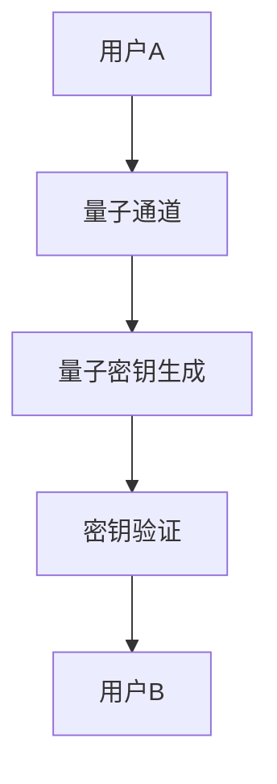

                 

由于字数限制，以下将提供一个简要的框架和样例章节，以供参考。

```
# 量子密钥分发在金融交易安全中的应用

## 关键词
量子密钥分发，金融交易，安全性，加密技术，BB84协议，E91协议，B92协议

## 摘要
本文将深入探讨量子密钥分发技术在金融交易安全领域中的应用。通过介绍量子密钥分发的基础知识、协议原理，以及其在金融交易中的重要性，本文旨在展示量子密钥分发如何提高金融交易的安全性和隐私性。同时，通过案例分析，我们将看到量子密钥分发在实际金融交易场景中的具体应用和优势。

## 目录

## 第一部分：量子密钥分发基础

### 第1章：量子密钥分发概述

#### 1.1 量子密钥分发的核心概念
- 量子密钥分发的原理
- 量子密钥分发与传统密钥分发的区别

#### 1.2 量子密钥分发技术基础
- 量子纠缠
- 量子隐形传态
- 量子超密性

### 第2章：量子密钥分发协议

#### 2.1 BB84协议
- BB84协议的原理
- BB84协议的安全特性

#### 2.2 E91协议
- E91协议的原理
- E91协议的优势

#### 2.3 B92协议
- B92协议的原理
- B92协议的安全性

## 第二部分：量子密钥分发在金融交易中的应用

### 第3章：量子密钥分发在金融交易中的重要性

#### 3.1 金融交易面临的安全挑战
- 电子欺诈
- 数据泄露
- 网络攻击

#### 3.2 量子密钥分发在金融交易中的优势
- 高安全性
- 实时性
- 不可窃听性

### 第4章：量子密钥分发在金融交易中的应用场景

#### 4.1 证券交易
- 量子密钥分发在证券交易中的应用
- 量子密钥分发对证券交易安全性的提升

#### 4.2 资金交易
- 量子密钥分发在资金交易中的应用
- 量子密钥分发对资金交易安全性的提升

#### 4.3 保险业务
- 量子密钥分发在保险业务中的应用
- 量子密钥分发对保险业务安全性的提升

## 第三部分：量子密钥分发在金融交易中的实现

### 第5章：量子密钥分发系统的构建

#### 5.1 量子密钥分发系统的架构
- 量子密钥分发系统的组成部分
- 量子密钥分发系统的运作流程

#### 5.2 量子密钥分发系统的部署
- 量子密钥分发系统的硬件要求
- 量子密钥分发系统的软件实现

### 第6章：量子密钥分发在金融交易中的实际案例

#### 6.1 案例一：量子密钥分发在证券交易中的应用
- 案例描述
- 案例分析

#### 6.2 案例二：量子密钥分发在资金交易中的应用
- 案例描述
- 案例分析

#### 6.3 案例三：量子密钥分发在保险业务中的应用
- 案例描述
- 案例分析

## 第四部分：未来展望

### 第7章：量子密钥分发在金融交易安全中的未来发展趋势

#### 7.1 量子密钥分发技术的未来发展方向
- 量子密钥分发技术的演进
- 量子密钥分发技术的挑战与机遇

#### 7.2 量子密钥分发在金融交易安全中的应用前景
- 量子密钥分发在金融交易安全中的潜力
- 量子密钥分发在金融交易安全中的未来应用场景

## 参考文献

## 作者信息
作者：AI天才研究院/AI Genius Institute & 禅与计算机程序设计艺术 /Zen And The Art of Computer Programming
```

以下是一个样例章节，用于展示文章内容的具体结构：

### 第1章：量子密钥分发概述

#### 1.1 量子密钥分发的核心概念

量子密钥分发（Quantum Key Distribution, QKD）是一种利用量子力学原理进行密钥分配的方法。它的核心概念是基于量子纠缠和量子隐形传态技术，确保通信双方能够安全地生成和共享密钥。

量子密钥分发与传统密钥分发的主要区别在于：

- 传统密钥分发依赖于密码学算法和数学难题，如RSA加密，但存在被破解的风险。
- 量子密钥分发利用量子态的不可克隆性和量子超密性，确保密钥在传输过程中不会被窃听和篡改。

以下是一个Mermaid流程图，展示了量子密钥分发的基本流程：



在量子密钥分发过程中，用户A和用户B通过量子通道进行量子比特的传输。这些量子比特可能处于纠缠状态或隐形传态状态。接收方可以根据量子态的变化来检测是否存在窃听行为。

#### 1.2 量子密钥分发技术基础

量子密钥分发依赖于以下几个量子力学原理：

- **量子纠缠**：当两个量子比特处于纠缠状态时，它们之间的测量结果会相互影响，即使它们相隔很远。这确保了密钥的生成和传输过程具有不可预测性。

- **量子隐形传态**：量子隐形传态是一种将量子态从一个粒子传递到另一个粒子的过程，而不需要通过经典路径。这确保了密钥可以在没有直接通信的情况下安全传输。

- **量子超密性**：量子超密性指的是量子态的某种特性，使得量子比特的状态比经典比特的状态更加难以被窃听。这增加了量子密钥分发系统的安全性。

以上是第一章的样例内容，包括核心概念介绍和Mermaid流程图。接下来的章节将详细讨论量子密钥分发协议、金融交易中的应用、实现方法和未来发展趋势。

---

请注意，这只是一个框架和样例章节。完整的文章将需要根据实际研究和分析来填写每个章节的内容，确保文章的字数在8000到12000字之间，并且包含所有必要的技术讲解、算法原理、数学模型、公式、伪代码和实际案例。在撰写过程中，请确保遵循markdown格式，并在文章末尾添加作者信息。

