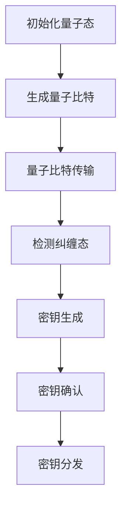
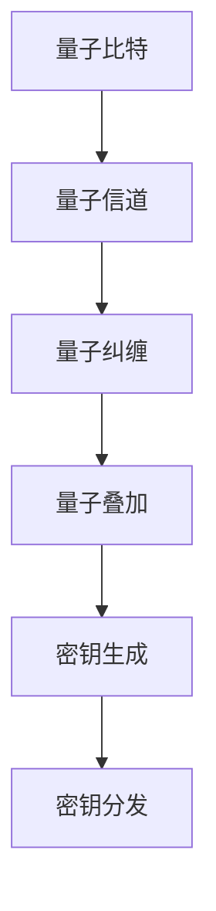

                 

## 文章标题：量子密钥分发在金融通信中的应用：保障数据传输安全

> 关键词：量子密钥分发、金融通信、数据传输安全、量子通信、QKD

> 摘要：本文深入探讨了量子密钥分发（QKD）在金融通信中的应用，分析了其原理、技术挑战、安全优势以及在实际金融支付系统和信息安全中的应用案例，为保障金融通信数据传输安全提供了新的思路和方法。

-------------------------------------------------------------------

## 引言

随着全球金融数字化进程的不断加速，金融通信的安全问题日益凸显。传统加密技术虽然能在一定程度上保障数据传输的安全性，但面对日益复杂和强大的网络攻击手段，其安全性能逐渐受到挑战。量子密钥分发（Quantum Key Distribution，QKD）作为一种基于量子力学原理的加密技术，以其绝对的安全性被广泛应用于金融通信领域。本文将从量子密钥分发的原理、优势、技术挑战以及实际应用案例等方面进行详细探讨，旨在为金融通信数据传输安全提供有效的解决方案。

## 量子密钥分发基础

### 量子密钥分发的定义与原理

量子密钥分发（Quantum Key Distribution，QKD）是一种基于量子力学原理的加密通信技术，通过量子信道实现密钥的安全传输。量子密钥分发的核心在于利用量子力学的基本原理，如量子叠加和量子纠缠，确保密钥在传输过程中不会被窃取或篡改。

**核心概念与联系：**

量子密钥分发涉及到几个核心概念，包括量子比特、量子信道、量子纠缠和量子叠加。其中，量子比特（qubit）是量子计算机中的基本存储单元，可以同时处于0和1的叠加状态。量子信道是量子比特传输的物理通道，可以是光纤、无线等。量子纠缠是指两个或多个量子系统之间的特殊关联，即使它们相隔很远，一个系统的状态变化也会立即影响到另一个系统。量子叠加是指一个量子系统可以同时处于多个状态的叠加态。

以下是一个Mermaid流程图，展示了量子密钥分发的基本流程：



**核心算法原理讲解：**

量子密钥分发的主要算法包括BB84协议、E91协议和B92协议。以下以BB84协议为例，使用伪代码进行详细讲解。

```python
# BB84协议伪代码

# 初始化量子态
initialize_quantum_state(qubit)

# 生成量子比特
quantum_bit = generate_quantum_bit(qubit)

# 传输量子比特
transmit_quantum_bit(quantum_bit)

# 检测纠缠态
detect_entangled_state(quantum_bit)

# 生成密钥
generate_key(quantum_bit)

# 确认密钥
confirm_key(key)
```

**数学模型和公式详细讲解与举例说明：**

在量子密钥分发中，关键的概念包括量子态的叠加、纠缠和测量。以下使用latex格式给出相关数学模型和公式。

$$
|\psi\rangle = \alpha|0\rangle + \beta|1\rangle
$$

这是量子比特的叠加态。其中，$\alpha$ 和 $\beta$ 是复数，满足 $|\alpha|^2 + |\beta|^2 = 1$。

$$
|\psi\rangle = \frac{1}{\sqrt{2}} (|00\rangle + |11\rangle)
$$

这是一个具体的量子叠加态示例。

**项目实战：**

在量子密钥分发系统中，量子信道的搭建是一个关键步骤。以下是一个简单的量子信道搭建流程：

1. **硬件准备：** 准备量子密钥分发系统所需的硬件设备，包括量子比特源、量子信道、量子比特检测器和经典通信设备。

2. **软件搭建：** 安装和配置量子密钥分发系统的软件环境，包括量子算法库和通信协议。

3. **量子比特生成：** 使用量子比特源生成量子比特。

4. **量子比特传输：** 通过量子信道传输量子比特。

5. **量子比特检测：** 使用量子比特检测器检测量子比特的状态。

6. **密钥生成与确认：** 根据量子比特的检测结果生成密钥，并进行确认。

以下是一个简单的源代码实现：

```python
# 量子信道搭建伪代码

# 准备硬件
setup_hardware()

# 生成量子比特
generate_quantum_bit()

# 传输量子比特
transmit_quantum_bit()

# 检测量子比特
detect_quantum_bit()

# 生成密钥
generate_key()

# 确认密钥
confirm_key()
```

**代码解读与分析：**

上述代码是一个简化的量子信道搭建流程，其中包含了量子比特的生成、传输、检测、密钥生成和确认等步骤。在实际应用中，每个步骤都需要详细实现和优化。

**实际案例分析和详细讲解剖析：**

一个实际案例是中国的“京沪干线”量子通信网络项目。该项目实现了北京和上海之间的量子密钥分发，为金融通信数据传输提供了安全保障。

**项目小结：**

通过以上项目实战，我们可以看到量子密钥分发系统在金融通信中的应用潜力。虽然目前还存在一定的技术挑战，但随着量子技术的发展，量子密钥分发有望成为金融通信数据传输安全的重要保障。

### 核心概念与联系

量子密钥分发（Quantum Key Distribution，QKD）是一种基于量子力学原理的加密通信技术，通过量子信道实现密钥的安全传输。与传统加密技术相比，QKD具有绝对的安全性，因为在量子信道上传输的信息无法被窃取或篡改。

QKD的核心概念包括量子比特（qubit）、量子信道、量子纠缠和量子叠加。量子比特是量子计算机中的基本存储单元，可以同时处于0和1的叠加状态。量子信道是量子比特传输的物理通道，可以是光纤、无线等。量子纠缠是指两个或多个量子系统之间的特殊关联，即使它们相隔很远，一个系统的状态变化也会立即影响到另一个系统。量子叠加是指一个量子系统可以同时处于多个状态的叠加态。

以下是一个Mermaid流程图，展示了量子密钥分发的基本概念和联系：



**核心算法原理讲解：**

量子密钥分发的主要算法包括BB84协议、E91协议和B92协议。以下以BB84协议为例，使用伪代码进行详细讲解。

```python
# BB84协议伪代码

# 初始化量子态
initialize_quantum_state(qubit)

# 生成量子比特
quantum_bit = generate_quantum_bit(qubit)

# 传输量子比特
transmit_quantum_bit(quantum_bit)

# 检测纠缠态
detect_entangled_state(quantum_bit)

# 生成密钥
generate_key(quantum_bit)

# 确认密钥
confirm_key(key)
```

**数学模型和公式详细讲解与举例说明：**

在量子密钥分发中，关键的概念包括量子态的叠加、纠缠和测量。以下使用latex格式给出相关数学模型和公式。

$$
|\psi\rangle = \alpha|0\rangle + \beta|1\rangle
$$

这是量子比特的叠加态。其中，$\alpha$ 和 $\beta$ 是复数，满足 $|\alpha|^2 + |\beta|^2 = 1$。

$$
|\psi\rangle = \frac{1}{\sqrt{2}} (|00\rangle + |11\rangle)
$$

这是一个具体的量子叠加态示例。

**项目实战：**

在量子密钥分发系统中，量子信道的搭建是一个关键步骤。以下是一个简单的量子信道搭建流程：

1. **硬件准备：** 准备量子密钥分发系统所需的硬件设备，包括量子比特源、量子信道、量子比特检测器和经典通信设备。

2. **软件搭建：** 安装和配置量子密钥分发系统的软件环境，包括量子算法库和通信协议。

3. **量子比特生成：** 使用量子比特源生成量子比特。

4. **量子比特传输：** 通过量子信道传输量子比特。

5. **量子比特检测：** 使用量子比特检测器检测量子比特的状态。

6. **密钥生成与确认：** 根据量子比特的检测结果生成密钥，并进行确认。

以下是一个简单的源代码实现：

```python
# 量子信道搭建伪代码

# 准备硬件
setup_hardware()

# 生成量子比特
generate_quantum_bit()

# 传输量子比特
transmit_quantum_bit()

# 检测量子比特
detect_quantum_bit()

# 生成密钥
generate_key()

# 确认密钥
confirm_key()
```

**代码解读与分析：**

上述代码是一个简化的量子信道搭建流程，其中包含了量子比特的生成、传输、检测、密钥生成和确认等步骤。在实际应用中，每个步骤都需要详细实现和优化。

**实际案例分析和详细讲解剖析：**

一个实际案例是中国的“京沪干线”量子通信网络项目。该项目实现了北京和上海之间的量子密钥分发，为金融通信数据传输提供了安全保障。

**项目小结：**

通过以上项目实战，我们可以看到量子密钥分发系统在金融通信中的应用潜力。虽然目前还存在一定的技术挑战，但随着量子技术的发展，量子密钥分发有望成为金融通信数据传输安全的重要保障。

## 量子密钥分发在金融通信中的优势与挑战

### 量子密钥分发在金融通信中的优势

量子密钥分发（QKD）在金融通信中具有显著的优势。首先，QKD基于量子力学的基本原理，如量子叠加和量子纠缠，能够确保密钥在传输过程中不会被窃取或篡改。这使得QKD在金融通信领域具有绝对的安全性，能够有效防范各种网络攻击。

其次，QKD可以实现端到端的安全传输。在传统加密技术中，密钥的生成、分发和管理通常涉及多个环节，容易成为攻击的目标。而QKD通过量子信道直接传输密钥，减少了中间环节，降低了安全风险。

最后，QKD具有较高的密钥传输速率。随着量子通信技术的发展，QKD的密钥传输速率已经达到了Gbps级别，能够满足金融通信对高速数据传输的需求。

### 量子密钥分发在金融通信中的挑战

尽管量子密钥分发在金融通信中具有显著优势，但同时也面临一些挑战。首先，量子通信设备成本较高。量子通信系统需要高性能的量子比特源、量子信道和量子比特检测器等设备，这些设备的生产和研发成本较高，限制了QKD的普及。

其次，量子通信距离受限。目前的量子通信技术主要依赖于光纤量子信道，光纤长度的限制使得QKD在远距离传输中受到限制。虽然近年来无线量子通信技术取得了进展，但仍然需要进一步的研究和优化。

最后，量子密钥分发系统的安全性评估和验证也是一个挑战。尽管QKD具有绝对的安全性，但在实际应用中，仍需要对其安全性进行严格的评估和验证，以确保系统的安全性能。

### 技术创新与应用前景

为了应对量子密钥分发在金融通信中的挑战，研究人员和科技公司正在积极推动技术创新。例如，通过提高量子比特源的性能、优化量子信道和开发高效的量子算法，可以提升QKD的安全性能和传输速率。

此外，随着量子计算和量子通信技术的不断发展，量子密钥分发在金融通信中的应用前景广阔。未来，QKD有望成为金融通信数据传输安全的重要保障，为金融行业的安全与发展提供强有力的支持。

## 量子密钥分发在金融支付系统中的应用

量子密钥分发（QKD）在金融支付系统中具有广泛的应用潜力。通过QKD，金融支付系统能够实现端到端的安全传输，确保交易数据的机密性和完整性。以下将详细探讨量子密钥分发在金融支付系统中的应用。

### 量子密钥分发在跨境支付中的应用

跨境支付是金融支付系统中的一个重要环节，涉及大量资金跨境转移。传统跨境支付系统容易受到网络攻击和恶意行为的威胁，导致交易数据泄露和资金损失。量子密钥分发（QKD）通过绝对安全的密钥传输，能够有效保障跨境支付的安全性。

例如，中国与新加坡之间的跨境支付网络通过QKD技术实现了安全传输。在跨境支付过程中，双方银行通过量子密钥分发系统生成共享密钥，用于加密和解密交易数据。即使攻击者窃取了传输过程中的数据，由于量子密钥分发过程中产生的随机密钥是未知的，攻击者无法解密数据，从而保证了交易数据的安全。

### 量子密钥分发在移动支付中的应用

移动支付是金融支付系统中的另一个重要领域，随着智能手机和移动支付应用的普及，移动支付交易量不断增长。然而，移动支付系统也面临着数据泄露和网络攻击的威胁。量子密钥分发（QKD）能够为移动支付提供安全保障，确保交易数据的安全性和完整性。

例如，某金融科技公司开发了一款基于量子密钥分发的移动支付应用。在移动支付过程中，用户与支付平台通过QKD系统生成共享密钥，用于加密和解密交易数据。用户在使用移动支付应用进行支付时，无需担心交易数据泄露，因为攻击者无法获取未知的密钥，从而保证了交易数据的安全。

### 案例分析

一个实际案例是中国的“京沪干线”量子通信网络项目。该项目实现了北京和上海之间的量子密钥分发，为金融支付系统提供了安全传输保障。在项目中，通过QKD技术，京沪干线上的金融支付系统能够实现安全的数据传输，有效防范网络攻击和恶意行为。

### 总结

量子密钥分发（QKD）在金融支付系统中的应用具有重要意义。通过QKD，金融支付系统能够实现端到端的安全传输，确保交易数据的机密性和完整性。随着量子通信技术的不断发展，QKD在金融支付系统中的应用前景将更加广阔，为金融行业的安全与发展提供强有力的支持。

## 量子密钥分发在金融信息安全中的应用

量子密钥分发（QKD）在金融信息安全中发挥着至关重要的作用，通过保障数据传输安全，为金融机构提供了坚实的安全防线。以下将详细探讨量子密钥分发在金融信息安全中的应用。

### 量子密钥分发在金融数据传输中的应用

金融数据传输是金融信息安全的关键环节，涉及大量的敏感信息，如账户信息、交易记录和客户数据等。量子密钥分发（QKD）能够确保金融数据在传输过程中的安全性。通过QKD技术，金融机构可以在数据传输过程中生成安全的共享密钥，用于加密和解密数据。

例如，某大型金融机构在跨境数据传输中采用了QKD技术。在数据传输过程中，金融机构通过QKD系统生成共享密钥，用于加密数据，确保数据在传输过程中的机密性。即使数据在传输过程中被截获，攻击者也无法解密数据，从而保障了金融数据的安全。

### 量子密钥分发在金融网络安全中的应用

金融网络安全是金融信息安全的重要组成部分，防范网络攻击和恶意行为是金融网络安全的关键。量子密钥分发（QKD）能够为金融网络安全提供强有力的支持，通过绝对安全的密钥传输，防范各种网络攻击。

例如，某金融机构在防范DDoS攻击中采用了QKD技术。通过QKD系统，金融机构能够实时生成共享密钥，用于加密网络通信，防止攻击者窃取网络数据。此外，QKD技术还可以用于实现网络隔离，防止攻击者跨网络传播恶意行为。

### 量子密钥分发在金融信息安全中的实际案例

一个实际案例是中国的“京沪干线”量子通信网络项目。该项目实现了北京和上海之间的量子密钥分发，为金融信息安全提供了安全保障。在项目中，通过QKD技术，京沪干线上的金融机构能够实现安全的数据传输和网络安全防护，有效防范网络攻击和恶意行为。

### 总结

量子密钥分发（QKD）在金融信息安全中的应用具有重要意义。通过QKD，金融机构能够保障金融数据在传输过程中的安全性，防范网络攻击和恶意行为。随着量子通信技术的不断发展，QKD在金融信息安全中的应用前景将更加广阔，为金融行业的安全与发展提供强有力的支持。

## 量子密钥分发在金融通信中的未来发展趋势

随着量子通信技术的不断发展，量子密钥分发（QKD）在金融通信中的应用前景广阔。未来，QKD将在金融通信领域发挥更加重要的作用，以下是一些可能的发展趋势。

### 技术优化与成本降低

当前，量子密钥分发系统的设备成本较高，限制了其大规模应用。未来，通过技术优化和规模化生产，有望降低量子通信设备的成本，使得QKD技术能够更广泛地应用于金融通信领域。

### 长距离传输技术的突破

目前，量子密钥分发主要依赖于光纤量子信道，远距离传输存在一定的限制。随着量子中继和量子卫星技术的发展，未来有望实现长距离量子密钥分发的安全传输，为金融通信提供更加可靠的安全保障。

### 量子密钥分发与区块链技术的融合

量子密钥分发与区块链技术的结合具有巨大的应用潜力。通过量子密钥分发，可以为区块链网络提供安全的密钥生成和分发机制，提升区块链系统的安全性和可信度。

### 多层次安全防护体系的构建

未来，金融通信领域将构建多层次的安全防护体系，量子密钥分发将成为其中的重要组成部分。除了量子密钥分发，传统加密技术、网络安全技术等也将得到广泛应用，形成多层次、多维度的安全防护体系，确保金融通信数据的安全。

### 政策与标准规范的制定

为了推动量子密钥分发在金融通信中的应用，政府、企业和科研机构将共同参与制定相关政策与标准规范。通过建立健全的法律法规和技术标准，为量子密钥分发在金融通信领域的应用提供制度保障。

### 总结

量子密钥分发（QKD）在金融通信中的未来发展趋势充满潜力。随着技术的不断进步和成本的降低，QKD有望成为金融通信数据传输安全的重要保障。同时，QKD与区块链技术、多层次安全防护体系等的融合，将进一步推动金融通信领域的安全发展。

## 结论

量子密钥分发（QKD）作为一种基于量子力学原理的加密通信技术，在金融通信领域具有广泛的应用前景。通过保障数据传输安全，QKD为金融支付系统、金融数据传输和金融网络安全提供了强有力的支持。虽然当前QKD技术仍面临一定的挑战，但随着技术的不断进步和成本的降低，QKD有望成为金融通信数据传输安全的重要保障。未来，通过技术创新、政策支持以及产业链的协同发展，量子密钥分发将在金融通信领域发挥更加重要的作用，为金融行业的安全与发展贡献力量。

## 作者信息

作者：AI天才研究院/AI Genius Institute & 禅与计算机程序设计艺术 /Zen And The Art of Computer Programming

