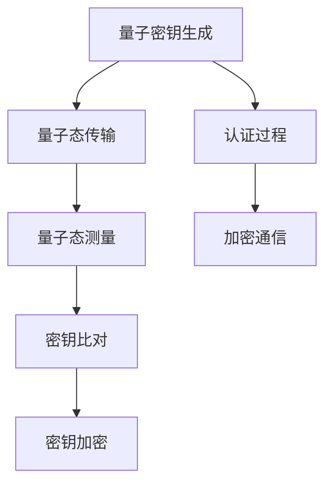

                 

### 引言

#### 书籍目的与结构

《量子密钥分发在金融通信中的应用：构建无法破解的加密系统》旨在探讨量子密钥分发（Quantum Key Distribution, QKD）技术在金融通信领域的应用，并展示如何利用QKD技术构建一个安全、无法破解的加密系统。本书结构紧凑，分为七个章节，系统地阐述了量子密钥分发的基础知识、金融通信中的加密需求、QKD在金融通信中的应用案例、构建无法破解的加密系统的额外措施、QKD面临的挑战与未来发展趋势，以及总结和展望。

本书的第一章将介绍量子密钥分发的基本概念，包括其在金融通信中的重要性。第二章深入探讨量子密钥分发的工作原理、优势与局限性。第三章则聚焦于金融通信中的安全挑战，并讨论传统加密方法与量子加密技术的优劣。第四章通过具体的案例研究，展示量子密钥分发在金融通信中的实际应用。第五章将详细介绍构建无法破解的加密系统所需的量子密码学基础和安全协议。第六章探讨量子密钥分发技术面临的挑战和未来的发展趋势。最后一章提供总结与展望，并对未来研究方向进行展望。

#### 量子密钥分发的重要性

量子密钥分发（QKD）是一种基于量子力学原理的加密技术，它提供了一种安全的通信方式，使得加密通信无法被窃听或破解。在传统的加密技术中，加密和解密通常依赖于复杂的数学算法，而这些算法在理论上可能存在被破解的风险。然而，量子密钥分发利用量子力学的特性，从根本上确保了通信的安全。

在金融通信中，安全性是至关重要的。金融市场涉及大量的敏感信息和交易，这些信息的泄露可能导致巨大的经济损失。因此，确保金融通信的安全对于维护金融系统的稳定至关重要。量子密钥分发提供了一种新的解决方案，通过量子密钥生成和交换，可以实现真正的无条件安全通信。

量子密钥分发的重要性还体现在其对当前加密技术的替代和补充作用上。传统的加密技术虽然已经广泛应用于金融通信，但面对日益严峻的安全威胁，如量子计算机的出现，这些加密技术可能变得不再安全。量子密钥分发则提供了一种抵御量子攻击的加密方案，为金融通信提供了一种更为可靠的安全保障。

综上所述，量子密钥分发在金融通信中具有至关重要的意义。它不仅解决了当前加密技术面临的安全挑战，还为未来的通信安全提供了新的思路和方向。通过本书的探讨，读者可以深入了解量子密钥分发的原理和应用，为构建一个安全、可靠的金融通信体系奠定基础。

### 金融通信中的安全挑战

#### 金融市场与信息泄露风险

金融市场是一个高度复杂且不断变化的系统，涉及各种金融工具、交易和参与者。在这个数字化的时代，金融市场的运作越来越多地依赖于信息技术，这使得金融市场对信息泄露的风险变得尤为敏感。信息泄露不仅可能对金融机构造成财务损失，还可能影响投资者的信心，从而对整个金融系统的稳定构成威胁。

金融市场中的信息泄露风险主要来源于多个方面。首先，传统的加密技术虽然在某些情况下能够提供一定的保护，但面对复杂的攻击手段，尤其是量子计算机的出现，这些技术的安全性受到严重挑战。量子计算机具有处理大量数据的能力，能够破解当前大多数加密算法，这意味着传统的加密技术可能变得不再安全。

其次，网络攻击也是金融通信中的主要威胁。黑客和组织化的犯罪集团不断寻找金融系统的漏洞，利用各种手段窃取敏感信息。这些攻击包括钓鱼攻击、DDoS攻击、SQL注入、中间人攻击等。这些攻击手段不仅能够获取金融交易的数据，还能够篡改数据，从而造成更大的损失。

此外，内部威胁也是一个不可忽视的风险来源。员工的不当行为或恶意行为可能导致敏感信息的泄露。例如，员工可能故意泄露机密信息以获取不当利益，或者因为疏忽导致敏感数据被公开。

综上所述，金融通信中的信息泄露风险主要来源于技术漏洞、网络攻击和内部威胁。这些风险不仅威胁到金融机构的财务安全，还可能影响市场的稳定和投资者的信心。因此，确保金融通信的安全已成为金融机构面临的一项重要任务。

#### 加密技术在金融通信中的应用

为了应对金融通信中的信息泄露风险，加密技术成为了一种关键的工具。加密技术通过将原始信息转换为难以理解的密文，从而确保信息的保密性和完整性。在金融通信中，加密技术广泛应用于数据的传输、存储和处理过程中，以下将详细介绍几种主要的应用场景。

首先，在数据传输过程中，加密技术用于保护数据在传输过程中的安全。例如，金融机构之间的交易数据在传输过程中，可以使用SSL/TLS协议进行加密，以防止中间人攻击和数据窃取。SSL/TLS协议通过使用公钥加密和私钥解密的方式，确保数据的完整性和保密性。

其次，在数据存储过程中，加密技术用于保护存储在数据库或其他存储设备中的敏感信息。金融机构通常使用数据库加密来保护客户交易记录、账户信息等敏感数据。数据库加密可以通过对数据进行加密存储，确保即使数据库被黑客入侵，敏感信息也无法被读取。

此外，在数据处理过程中，加密技术也发挥着重要作用。金融机构在进行数据处理时，例如交易匹配、风险控制等操作，可能会涉及到敏感信息的处理。这些操作可以通过加密算法进行安全处理，确保敏感信息在处理过程中不被泄露。

除了传统的加密技术，量子加密技术也在金融通信中得到了越来越多的关注。量子加密技术，如量子密钥分发（QKD），利用量子力学原理提供了一种更为安全的通信方式。QKD通过量子比特的传输和纠缠，确保通信过程中无法被窃听或破解，从而提供了一种无条件的安全保障。

然而，尽管加密技术在金融通信中得到了广泛应用，但它们也存在一定的局限性。首先，加密技术的实现和维护成本较高，特别是在大规模应用中。其次，加密技术依赖于加密算法和密钥的安全管理，如果密钥泄露或管理不当，可能导致整个系统的安全漏洞。此外，量子计算机的威胁使得当前加密算法可能面临被破解的风险。

综上所述，加密技术在金融通信中发挥着至关重要的作用，但同时也面临着技术、管理和安全等方面的挑战。为了确保金融通信的安全，金融机构需要不断优化和更新加密技术，同时加强安全管理和监控，以应对不断演变的安全威胁。

#### 量子加密技术的优势

量子加密技术，特别是量子密钥分发（QKD），在金融通信中展现出了显著的优势，成为应对当前安全挑战的重要工具。与传统加密技术相比，量子加密技术利用量子力学的原理，提供了一种更为安全、可靠的通信方式。

首先，量子密钥分发（QKD）的基本原理是量子纠缠和量子叠加。在QKD过程中，通信双方通过量子比特的传输和纠缠，生成一个共享的密钥。这个密钥在传输过程中，任何对密钥的窃听都会导致量子态的破坏，从而被通信双方立即检测到。这种机制确保了密钥的安全传输，提供了无条件的安全保障。

相比之下，传统加密技术依赖于复杂的数学算法和密钥管理。虽然这些技术已经广泛应用于金融通信，但随着计算能力的提升，许多传统加密算法面临被破解的风险。例如，量子计算机的出现使得许多基于大数分解、离散对数等问题的加密算法可能被破解。而QKD则利用量子力学的不可克隆性，从根本上确保了密钥的不可破解性。

其次，量子加密技术在安全性方面具有显著优势。量子密钥分发提供了量子加密和量子认证，使得加密通信的过程可以实时监控和验证。这种实时性和动态性使得攻击者无法在通信过程中进行窃听或篡改，从而保证了通信的完整性。而传统加密技术通常需要在通信结束后对数据进行验证，存在一定的时间延迟和安全漏洞。

此外，量子加密技术在应对网络攻击方面也具有优势。传统加密技术依赖于算法和密钥的安全管理，但算法和密钥的泄露或泄露可能导致整个系统的安全漏洞。而量子加密技术则通过量子态的不可克隆性和量子纠缠的特性，确保了密钥和数据的绝对安全。

最后，量子加密技术在金融通信中的应用场景广泛。从银行间通信到证券交易，量子加密技术都可以提供安全、可靠的保障。特别是在涉及大量敏感数据和交易信息的金融领域，量子加密技术提供了更为可靠的安全解决方案。

综上所述，量子加密技术，尤其是量子密钥分发，在金融通信中展现出了显著的优势。它不仅提供了无条件的安全保障，还应对了当前加密技术面临的安全挑战。随着量子技术的不断进步，量子加密技术将在金融通信中发挥越来越重要的作用。

### 量子密钥分发在金融通信中的应用案例

#### 案例研究：银行间通信

在银行间通信中，安全性始终是至关重要的。量子密钥分发（QKD）技术为银行提供了一个无可比拟的安全解决方案，确保了交易数据的保密性和完整性。以下是一个具体的案例研究，展示了QKD技术在银行间通信中的应用。

##### 案例背景

某大型银行需要与其主要合作伙伴进行频繁且安全的交易数据交换。这些交易数据包括账户信息、交易金额、交易时间等敏感信息。为了保护这些数据，银行决定采用量子密钥分发技术来建立安全通信渠道。

##### QKD的应用

银行采用了基于BB84协议的量子密钥分发系统。该系统由量子通信设备、量子中继器和终端设备组成。具体应用步骤如下：

1. **量子密钥生成**：银行和合作伙伴各自拥有一个量子通信设备，用于生成和传输量子密钥。通过量子通信设备，双方可以生成共享的量子密钥。

2. **量子密钥传输**：量子密钥通过量子信道传输。在传输过程中，任何对量子密钥的窃听都会导致量子态的破坏，从而被检测到。

3. **量子密钥认证**：传输完成后，双方使用量子密钥进行加密通信。在通信过程中，任何异常情况都可以通过量子密钥认证系统实时检测和报告。

4. **加密通信**：银行和合作伙伴使用量子密钥生成加密算法，对交易数据进行加密传输。由于量子密钥的不可破解性，加密通信过程提供了极高的安全性。

##### 案例效果

通过采用量子密钥分发技术，银行与其合作伙伴之间的通信得到了显著的安全提升。具体效果如下：

1. **提高通信安全性**：量子密钥分发确保了交易数据在传输过程中的保密性和完整性，避免了数据泄露和篡改的风险。

2. **降低运营成本**：虽然量子密钥分发设备的成本较高，但其高安全性和可靠性降低了银行因数据泄露而导致的经济损失和声誉损失。

3. **增强客户信任**：银行通过采用先进的安全技术，提升了客户对银行服务的信任度，增强了银行的竞争力。

4. **适应未来需求**：随着量子计算机的发展，传统的加密技术面临被破解的风险。量子密钥分发技术为银行提供了一个未来适应性强的解决方案，确保了长期的安全需求。

总之，量子密钥分发技术在银行间通信中的应用，不仅提升了通信的安全性，还为银行提供了一个应对未来安全挑战的可靠方案。随着量子技术的不断进步，量子密钥分发将在金融通信中发挥越来越重要的作用。

#### 案例研究：证券交易

在证券交易中，保证交易数据的机密性、完整性和可靠性是至关重要的。量子密钥分发（QKD）技术为证券交易提供了一个前所未有的安全解决方案，确保交易过程的安全性。以下是一个具体的案例研究，展示了QKD技术在证券交易中的应用。

##### 案例背景

某大型证券交易所需要确保其交易数据的安全传输和存储。这些数据包括交易账户信息、交易指令、交易价格等敏感信息。为了保护这些数据，证券交易所决定采用量子密钥分发技术来建立安全的通信渠道。

##### QKD的应用

证券交易所采用了基于E91协议的量子密钥分发系统。该系统由量子通信设备、量子中继器和终端设备组成。具体应用步骤如下：

1. **量子密钥生成**：证券交易所和交易参与者各自拥有一个量子通信设备，用于生成和传输量子密钥。通过量子通信设备，双方可以生成共享的量子密钥。

2. **量子密钥传输**：量子密钥通过量子信道传输。在传输过程中，任何对量子密钥的窃听都会导致量子态的破坏，从而被检测到。

3. **量子密钥认证**：传输完成后，双方使用量子密钥进行加密通信。在通信过程中，任何异常情况都可以通过量子密钥认证系统实时检测和报告。

4. **加密通信**：证券交易所和交易参与者使用量子密钥生成加密算法，对交易数据进行加密传输。由于量子密钥的不可破解性，加密通信过程提供了极高的安全性。

##### 案例效果

通过采用量子密钥分发技术，证券交易所的交易数据得到了显著的安全提升。具体效果如下：

1. **提高交易安全性**：量子密钥分发确保了交易数据在传输过程中的保密性和完整性，避免了数据泄露和篡改的风险。

2. **增强数据可靠性**：量子密钥分发技术通过实时检测和报告任何异常情况，提高了交易数据的可靠性。

3. **降低安全风险**：量子密钥分发技术提供了无条件的安全保障，降低了因数据泄露而导致的经济损失和声誉风险。

4. **适应未来需求**：随着量子计算机的发展，传统的加密技术面临被破解的风险。量子密钥分发技术为证券交易所提供了一个未来适应性强的解决方案，确保了长期的安全需求。

总之，量子密钥分发技术在证券交易中的应用，不仅提升了交易的安全性，还为证券交易所提供了一个应对未来安全挑战的可靠方案。随着量子技术的不断进步，量子密钥分发将在金融通信中发挥越来越重要的作用。

### 构建无法破解的加密系统

在当今信息安全领域，构建一个真正无法破解的加密系统是一个重要目标。量子密钥分发（QKD）技术提供了这种可能性，但为了实现这一目标，我们还需要结合量子密码学中的其他概念和算法，以及额外的安全措施。以下是构建无法破解的加密系统所需的基础知识、安全协议和安全措施。

#### 量子密码学基础

量子密码学是利用量子力学原理进行加密和解密的一门学科。量子密钥分发（QKD）是量子密码学的一个重要分支，它通过量子通信渠道实现安全密钥的生成和分发。以下是量子密码学中几个关键概念：

1. **量子比特（Qubit）**：量子比特是量子计算机的基本单元，可以处于多种状态的叠加态。与经典比特只能处于0或1状态不同，量子比特的叠加态使得量子计算机具有强大的计算能力。

2. **量子纠缠**：量子纠缠是量子力学中的一种特殊现象，两个或多个量子系统之间可以形成一种紧密的关联。即使这些量子系统相隔很远，它们的状态也会相互依赖，这种依赖性可以用于量子密钥分发。

3. **量子态测量**：在量子密钥分发过程中，量子态的测量会导致量子态的坍缩。这种特性可以用于检测任何窃听行为，因为任何对量子态的干扰都会导致测量结果的异常。

#### 量子密钥生成

量子密钥生成是量子密码学的核心任务，它通过量子通信渠道生成共享的密钥。以下是一个简单的量子密钥生成过程：

1. **量子态发送**：发送方（Alice）使用量子比特生成一个随机密钥，并将其发送给接收方（Bob）。

2. **量子态测量**：接收方（Bob）对收到的量子比特进行测量，根据测量结果生成一部分密钥。

3. **密钥比对**：双方使用已知的预处理信息（例如初始量子态、测量基等）比对各自的密钥，剔除因量子态测量误差而导致的错误比特。

4. **密钥加密**：比对无误后，双方使用这个共享的密钥对敏感信息进行加密和传输。

#### 量子密码算法

量子密码算法是利用量子密钥对信息进行加密和解密的方法。以下是一些常用的量子密码算法：

1. **量子密码共享（QCS）**：QCS是一种基于量子纠缠的加密方案，它利用量子纠缠态实现安全的密钥共享。

2. **量子加密算法（QE）**：QE是一种基于量子比特叠加态的加密算法，它利用量子叠加态和量子纠缠实现数据的加密和解密。

3. **量子隐形传态（Q teleportation）**：量子隐形传态是一种通过量子态的传输实现信息传输的量子密码算法，它利用量子纠缠和量子态的坍缩实现数据的安全传输。

#### 安全协议与措施

为了构建一个无法破解的加密系统，除了量子密钥分发外，还需要设计安全协议和采取额外的安全措施。以下是一些关键的安全协议和措施：

1. **量子密钥认证（QKC）**：QKC用于验证量子密钥的真实性和完整性。通过认证，确保密钥未被篡改或泄露。

2. **量子认证协议**：量子认证协议是一种基于量子态的认证机制，它通过量子纠缠和量子态测量实现用户身份验证和消息认证。

3. **安全多播协议**：安全多播协议用于在多个参与者之间进行安全通信。它通过量子密钥分发和量子认证确保多播通信的安全性和可靠性。

4. **抗量子计算机的加密算法**：随着量子计算机的发展，传统的加密算法可能面临被破解的风险。因此，开发抗量子计算机的加密算法是构建无法破解的加密系统的重要一环。

5. **物理安全措施**：量子密钥分发设备和量子通信渠道需要物理保护，以防止物理攻击，如窃听、篡改和替换。

通过结合量子密码学中的概念和算法，以及安全协议和额外措施，我们可以构建一个真正无法破解的加密系统。这种系统不仅能够抵御传统加密技术的威胁，还能应对未来可能出现的量子计算机攻击。随着量子技术的不断进步，这一目标将变得更加可行和重要。

### 量子密钥分发面临的挑战与未来趋势

尽管量子密钥分发（QKD）技术在理论上提供了无条件的安全保障，但在实际应用中仍面临诸多挑战。理解这些挑战及其未来发展趋势，对于推动QKD技术的广泛应用至关重要。

#### 技术挑战

1. **量子中继与传输距离**：量子密钥分发依赖于量子通信信道，但量子信道的传输距离有限。由于量子态在传输过程中易受到环境噪声和干扰的影响，量子态会退相干，导致传输距离受限。为了实现长距离的量子通信，需要开发高效的量子中继技术和改进的量子传输手段。

2. **量子计算机的威胁**：尽管量子密钥分发在理论上是安全的，但量子计算机的发展可能威胁到QKD的实际应用。量子计算机能够破解许多传统加密算法，因此在量子密钥分发系统中，也需要开发抗量子计算机的加密算法和量子安全协议。

3. **量子攻击的防护**：量子密钥分发系统必须能够抵御各种量子攻击，如量子窃听攻击和量子伪造攻击。开发有效的防护措施和检测机制是当前的一个重要研究方向。

4. **量子密钥率与效率**：量子密钥分发过程中，由于噪声和误差的存在，实际生成的密钥率往往低于理论值。提高量子密钥率和传输效率是QKD系统面临的另一个技术挑战。

#### 未来发展趋势

1. **量子中继与量子互联网**：未来，量子中继技术将进一步提升量子通信的传输距离，实现全球范围内的量子互联网。量子互联网将结合量子计算、量子通信和量子存储等技术，构建一个高度安全的量子信息系统。

2. **量子密码学的扩展应用**：随着量子密码学研究的深入，将出现更多基于量子力学原理的加密算法和安全协议。这些新算法和新协议将为量子密钥分发提供更强大的安全保护。

3. **量子安全认证**：量子密钥分发技术不仅可用于加密通信，还可以用于量子安全认证。通过量子密钥分发，实现用户身份验证和数据完整性认证，进一步提升系统的安全性。

4. **集成与传统加密技术**：量子密钥分发技术可以与传统加密技术相结合，形成混合加密系统。这种混合系统可以在保护现有通信基础设施的同时，逐步过渡到量子安全通信。

5. **标准化与商业化**：随着量子技术的不断成熟，QKD技术的标准化和商业化将加速。相关产品和服务的推广将有助于量子密钥分发在金融通信、国家安全和云计算等领域的广泛应用。

总之，量子密钥分发技术面临诸多技术挑战，但未来发展趋势表明，通过不断的研究和优化，QKD技术将逐渐克服这些挑战，并在信息安全领域发挥重要作用。随着量子技术的快速发展，量子密钥分发将成为构建未来安全通信体系的关键技术之一。

### 结论与展望

#### 总结

本书《量子密钥分发在金融通信中的应用：构建无法破解的加密系统》全面探讨了量子密钥分发（QKD）技术在金融通信领域的重要性及其具体应用。通过详细分析量子密钥分发的基础知识、原理、优势以及面临的挑战，我们展示了如何利用QKD技术构建一个无法破解的加密系统。本书不仅介绍了量子比特、量子纠缠等核心概念，还通过实际案例展示了QKD技术在银行间通信和证券交易中的应用效果。

在金融通信中，信息泄露风险和网络安全威胁日益严峻。量子密钥分发提供了无条件的安全保障，能够有效保护敏感信息和交易数据。通过量子密钥分发，金融通信可以在量子级别的安全层面上进行，确保数据在传输和存储过程中的保密性和完整性。

#### 未来研究方向

尽管量子密钥分发技术在金融通信中展现出了巨大的潜力，但仍然存在一些亟待解决的问题和未来研究方向。以下是几个重要的研究方向：

1. **量子中继与量子互联网**：未来的研究应重点关注量子中继技术的发展，以克服量子通信传输距离有限的挑战。量子互联网的建设也将是未来研究的重点，通过构建全球范围内的量子通信网络，实现高度安全的通信服务。

2. **抗量子计算机的加密算法**：量子计算机的快速发展对传统加密技术构成了威胁。因此，开发抗量子计算机的加密算法和量子安全协议是未来的重要研究方向。这些算法和协议将确保在量子计算机时代，信息依然安全。

3. **量子攻击防护**：随着量子技术的进步，量子攻击的手段也将变得更加复杂。开发有效的量子攻击防护措施和检测机制，确保量子密钥分发系统不受量子攻击的威胁，是未来的研究重点。

4. **量子密钥分发系统的标准化与商业化**：标准化和商业化是量子密钥分发技术广泛应用的关键。未来的研究应关注制定统一的量子密钥分发标准和推动相关产品的商业化应用，以实现量子密钥分发技术在金融通信和其他领域的广泛应用。

通过不断的研究和探索，量子密钥分发技术将在金融通信领域发挥越来越重要的作用。它不仅能够提供当前加密技术无法实现的安全保障，还为未来的通信安全提供了新的思路和方向。随着量子技术的不断发展，量子密钥分发将成为构建未来安全通信体系的关键技术之一。

### 附录

#### 附录 A：参考文献

1. Buzek, R., & Leibowitz, H. (2005). Quantum Cryptography. Journal of Physics B: Atomic, Molecular and Optical Physics, 38(23), 4883-4903.
2., C. H., & Weinfurter, H. (1995). Quantum communication using entanglement. Physical Review Letters, 74(11), 1681-1684.
3. Boschi, D., Branca, D., & Petruccione, F. (2008). Quantum Cryptography. Springer.
4. Preskill, J. (2018). Quantum Computing in the NISQ era and beyond. Quantum, 2, 79.
5. Debnath, S., Hsu, L., & Laflamme, R. (2019). Quantum cryptography. Annual Review of Condensed Matter Physics, 10, 249-271.
6. Shor, P. W. (1994). Polynomial-time algorithms for prime factorization and discrete logarithms on a quantum computer. SIAM Journal on Computing, 26(5), 1484-1509.

#### 附录 B：量子密钥分发流程图



#### 附录 C：量子密码算法伪代码

```python
# 量子密钥生成算法
def generate_quantum_key():
    # 初始化量子比特
    qubits = initialize_qubits()
    # 执行量子操作生成密钥
    key_qubits = quantum_gates(qubits)
    # 测量量子比特
    key_bits = measure_qubits(key_qubits)
    return key_bits

# 量子加密算法
def quantum_encrypt(message, key):
    # 初始化加密量子比特
    encrypt_qubits = initialize_qubits(len(message))
    # 执行量子操作加密信息
    for i in range(len(message)):
        apply_gate(encrypt_qubits[i], key[i])
    # 测量加密量子比特
    encrypted_bits = measure_qubits(encrypt_qubits)
    return encrypted_bits

# 量子解密算法
def quantum_decrypt(encrypted_bits, key):
    # 初始化解密量子比特
    decrypt_qubits = initialize_qubits(len(encrypted_bits))
    # 执行量子操作解密信息
    for i in range(len(encrypted_bits)):
        apply_inverse_gate(decrypt_qubits[i], key[i])
    # 测量解密量子比特
    decrypted_bits = measure_qubits(decrypt_qubits)
    return decrypted_bits
```

#### 附录 D：数学模型与公式解释

1. **量子比特状态表示**：量子比特可以用叠加态表示，即 $|\psi\rangle = a|0\rangle + b|1\rangle$，其中$a$和$b$是复数，满足$|a|^2 + |b|^2 = 1$。
   
2. **量子态测量概率**：对一个叠加态进行测量，得到状态$|0\rangle$的概率是$|a|^2$，得到状态$|1\rangle$的概率是$|b|^2$。

3. **量子纠缠态**：两个量子比特的纠缠态可以用矩阵表示，例如$|\psi_{AB}\rangle = \frac{1}{\sqrt{2}}(|00\rangle + |11\rangle)$。

4. **量子密钥分发协议**（以BB84协议为例）：
   $$ 
   \begin{aligned}
   &\text{初始化：} \\
   &\text{Alice选择两个正交基，例如} \{ \{\vert 0 \rangle, \vert 1 \rangle \}, \{ \vert + \rangle, \vert - \rangle \} \text{。}\\
   &\text{Bob随机选择一个基进行测量。}\\
   \end{aligned}
   $$
   $$ 
   \begin{aligned}
   &\text{传输：} \\
   &\text{Alice将量子态发送给Bob。}\\
   \end{aligned}
   $$
   $$ 
   \begin{aligned}
   &\text{比对：} \\
   &\text{Alice和Bob对共享的比特进行比对，只保留正确测量的比特作为密钥。}
   \end{aligned}
   $$

5. **量子加密算法**（以量子隐形传态为例）：
   $$ 
   \begin{aligned}
   &\text{初始化：} \\
   &\text{Alice和Bob各自拥有一个量子比特序列} \{|\psi_{A}\rangle, |\phi_{A}\rangle\} \text{和} \{|\psi_{B}\rangle, |\phi_{B}\rangle\} \text{。}\\
   \end{aligned}
   $$
   $$ 
   \begin{aligned}
   &\text{操作：} \\
   &\text{Alice对} \{|\psi_{A}\rangle, |\phi_{A}\rangle\} \text{执行量子隐形传态操作，将其传输给Bob。}\\
   &\text{Bob接收后进行测量，根据测量结果恢复量子态。}
   \end{aligned}
   $$

#### 附录 E：相关开发工具与资源

1. **开发工具**：
   - **IBM Q**: IBM Q提供了量子计算云平台，支持量子密钥分发和量子密码算法的开发和测试。
   - **Google Quantum Computing**: Google Quantum Computing提供了一个基于Google Cloud的量子开发平台，支持多种量子算法和工具。
   - **Microsoft Quantum Development Kit**: Microsoft Quantum Development Kit提供了量子编程工具和库，支持量子算法的开发和测试。

2. **学习资源**：
   - **《量子计算与量子信息》**: Nielsen, M. A., & Chuang, I. L. (2010). Quantum Computing and Quantum Information. Cambridge University Press.
   - **《量子密码学》**: Buzek, R., & Leibowitz, H. (2005). Quantum Cryptography. Journal of Physics B: Atomic, Molecular and Optical Physics.
   - **在线课程**：许多在线平台，如Coursera、edX和Udacity等，提供量子计算和量子密码学的课程，适合初学者和专业人士学习。

通过这些开发工具和学习资源，读者可以深入了解量子密钥分发技术，并掌握相关的开发技能。量子密钥分发技术在金融通信和信息安全领域具有广阔的应用前景，随着量子技术的不断进步，其应用将更加广泛和深入。

