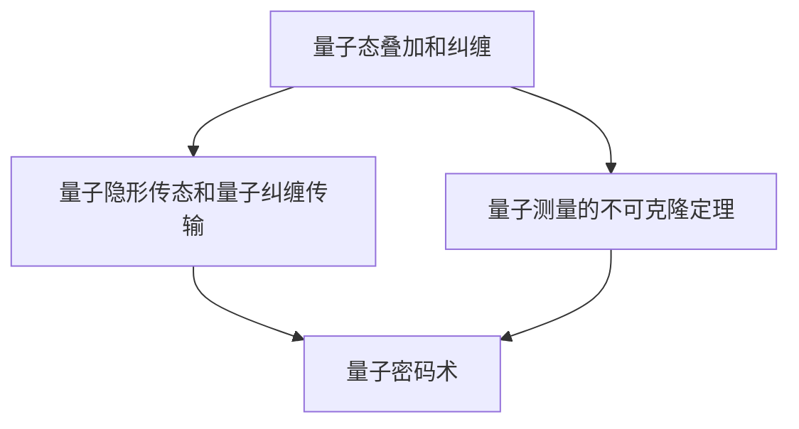

                 

# 量子密钥分发技术的商业化进程

## 关键词

量子密钥分发、商业化进程、安全通信、加密技术、量子算法、数学模型

## 摘要

量子密钥分发（Quantum Key Distribution，QKD）是一种基于量子力学原理实现安全通信的技术。本文旨在探讨量子密钥分发技术的商业化进程，从核心概念、算法原理、数学模型到实际应用，详细解析量子密钥分发技术的现状与未来发展方向。本文将分析量子密钥分发技术在信息安全领域的应用潜力，以及其在商业领域的潜在市场。此外，本文还将探讨量子密钥分发技术面临的技术挑战，并提出相应的解决方案。通过本文的研究，希望能够为量子密钥分发技术的商业化进程提供有益的参考。

## 引言

随着信息技术的飞速发展，信息安全问题日益凸显。传统的加密技术已经难以应对日益复杂的网络攻击，而量子密钥分发（Quantum Key Distribution，QKD）作为一种全新的加密技术，因其无法被破解的特性而备受关注。量子密钥分发技术利用量子力学的基本原理，实现了信息安全通信的新可能。然而，量子密钥分发技术从理论研究到实际应用，还有很长的路要走。本文将探讨量子密钥分发技术的商业化进程，旨在为这一领域的未来发展提供有价值的参考。

## 量子密钥分发技术的核心概念与联系

### 量子态的叠加和纠缠

量子态的叠加是指一个量子系统可以同时处于多个状态的组合。例如，一个量子比特（qubit）可以同时处于0和1的状态，用数学表达式表示为：

\[ \psi = \alpha|0\rangle + \beta|1\rangle \]

其中，\(|0\rangle\)和\(|1\rangle\)分别表示量子比特的基态，\(\alpha\)和\(\beta\)是复数系数。

量子纠缠是指两个或多个量子系统之间的量子态相互关联，即使它们之间相隔很远，一个系统的测量结果也会即时影响到另一个系统。量子纠缠是量子密钥分发技术的核心原理之一。

### 量子隐形传态和量子纠缠传输

量子隐形传态（Quantum teleportation）是一种利用量子纠缠实现量子态传输的技术。它通过将一个量子态从发送方传送到接收方，而无需经过物理通道。量子隐形传态的过程可以用以下步骤表示：

1. **量子态制备**：发送方制备一个量子纠缠对，将其中的一个量子态发送给接收方。
2. **量子测量**：发送方对量子态进行测量，并将测量结果发送给接收方。
3. **量子态重构**：接收方根据测量结果，利用量子纠缠对重构原始量子态。

量子纠缠传输（Quantum entanglement distribution）是指将量子纠缠态从一个地方传输到另一个地方。量子纠缠传输是实现量子密钥分发的基础。

### 量子测量的不可克隆定理

量子测量的不可克隆定理（No-cloning theorem）指出，无法精确克隆任意未知的量子态。这一原理保证了量子密钥分发过程中密钥的安全传输，因为如果密钥被窃取，其量子态将发生改变，从而无法被正确解码。

### 量子密码术

量子密码术（Quantum cryptography）是利用量子力学原理设计加密和解密算法的一门学科。量子密码术的核心算法包括BB84协议和E91协议，它们利用量子态的叠加和纠缠特性，实现了无法被破解的加密通信。

### Mermaid流程图

为了更好地展示量子密钥分发技术的核心概念与联系，我们可以使用Mermaid流程图来表示：



## 量子密钥分发技术的核心算法原理讲解

### BB84协议

BB84协议是量子密钥分发技术的基础，其核心思想是通过量子态的叠加和纠缠特性，实现密钥的安全传输。BB84协议的伪代码如下：

```python
# 量子态准备
prepare_quantum_state(qubit)
# 量子态传输
send_quantum_state(qubit, receiver)
# 量子态测量
measure_quantum_state(qubit, receiver)
# 量子态比较
compare_measurements(sender, receiver)
# 生成密钥
generate_key(compare_result)
```

具体步骤如下：

1. **量子态准备**：发送方生成一个随机的量子态序列，并将其发送给接收方。
2. **量子态传输**：接收方对量子态进行测量，并根据测量结果选择一个随机的基进行投影。
3. **量子态比较**：发送方和接收方交换测量结果，对相同的测量结果进行保留，生成共享密钥。
4. **生成密钥**：对保留的测量结果进行加密，生成最终的密钥。

### E91协议

E91协议是基于量子纠缠态的量子密钥分发协议，其核心思想是通过量子纠缠态实现密钥的安全传输。E91协议的伪代码如下：

```python
# 准备量子纠缠态
prepare_Quantum_Entanglement(state)
# 量子纠缠态传输
send_Quantum_Entanglement(state, receiver)
# 量子纠缠态测量
measure_Quantum_Entanglement(state, receiver)
# 量子纠缠态比较
compare_measurements(sender, receiver)
# 生成密钥
generate_key(compare_result)
```

具体步骤如下：

1. **准备量子纠缠态**：发送方生成一个量子纠缠态序列，并将其发送给接收方。
2. **量子纠缠态传输**：接收方对量子纠缠态进行测量，并根据测量结果选择一个随机的基进行投影。
3. **量子纠缠态比较**：发送方和接收方交换测量结果，对相同的测量结果进行保留，生成共享密钥。
4. **生成密钥**：对保留的测量结果进行加密，生成最终的密钥。

### BB84协议与E91协议的比较

BB84协议和E91协议都是量子密钥分发技术的重要协议，它们各有优缺点。

- **BB84协议**：
  - 优点：实现了量子密钥分发的最基本原理，具有较高的安全性。
  - 缺点：传输速率较低，对量子通信信道的要求较高。

- **E91协议**：
  - 优点：基于量子纠缠态，传输速率较高，对量子通信信道的要求较低。
  - 缺点：安全性相对较低，需要额外的量子纠缠态生成和测量设备。

## 量子密钥分发技术的数学模型和数学公式讲解

### 量子态表示

在量子密钥分发技术中，量子态表示是关键的一环。量子态可以用量子比特（qubit）的叠加态和纠缠态表示。一个量子比特的叠加态可以用如下数学公式表示：

\[ \psi = \alpha|0\rangle + \beta|1\rangle \]

其中，\(|0\rangle\)和\(|1\rangle\)分别表示量子比特的基态，\(\alpha\)和\(\beta\)是复数系数。

### 量子态测量

量子态测量是量子密钥分发技术中的另一个关键步骤。量子态测量结果具有随机性，且测量结果之间具有关联性。一个量子态的测量结果可以用概率分布函数表示：

\[ P(\psi) = |\alpha|^2 + |\beta|^2 \]

其中，\(|\alpha|^2\)和\(|\beta|^2\)分别表示量子态在基态\(|0\rangle\)和\(|1\rangle\)的概率。

### 量子密钥生成

量子密钥生成是量子密钥分发技术的核心步骤。量子密钥生成基于量子态的叠加和纠缠特性，通过一系列数学运算生成密钥。一个简单的量子密钥生成过程可以用如下数学公式表示：

\[ \text{密钥} = \text{测量结果} \oplus \text{初始化值} \]

其中，\(\oplus\)表示异或运算，测量结果和初始化值是二进制数。

## 项目实战：量子密钥分发技术的实际应用

### 项目背景

量子密钥分发技术具有极高的安全性，因此在信息安全领域具有广泛的应用前景。本文将介绍一个基于量子密钥分发技术的实际项目，实现两个远程站点之间的安全通信。

### 项目步骤

#### 1. 硬件搭建

搭建量子密钥分发系统，包括量子通信信道、量子态发生器、量子态测量器等设备。硬件搭建的具体步骤如下：

1. **量子通信信道**：建立量子通信信道，实现两个远程站点之间的量子态传输。
2. **量子态发生器**：生成随机量子态序列，用于量子密钥分发。
3. **量子态测量器**：对量子态进行测量，生成共享密钥。

#### 2. 协议实现

实现BB84协议，进行量子密钥分发。具体步骤如下：

1. **量子态准备**：发送方生成随机量子态序列，并将其发送给接收方。
2. **量子态传输**：接收方对量子态进行测量，并根据测量结果选择一个随机的基进行投影。
3. **量子态比较**：发送方和接收方交换测量结果，对相同的测量结果进行保留，生成共享密钥。
4. **生成密钥**：对保留的测量结果进行加密，生成最终的密钥。

#### 3. 密钥管理

对生成的密钥进行管理，包括密钥分发、存储和更新。具体步骤如下：

1. **密钥分发**：将生成的密钥分发到需要安全通信的站点。
2. **密钥存储**：将密钥存储在安全的位置，以防止泄露。
3. **密钥更新**：定期更新密钥，以保证通信的安全性。

#### 4. 安全通信

使用生成的密钥实现安全通信，如量子加密通信。具体步骤如下：

1. **加密通信**：使用量子密钥对通信内容进行加密，确保通信内容的安全性。
2. **解密通信**：接收方使用共享密钥对加密内容进行解密，恢复原始通信内容。

### 源代码实现

以下是一个简单的量子密钥分发系统的Python实现：

```python
# 伪代码：量子密钥分发系统实现
from qiskit import QuantumCircuit, execute, Aer

# 量子态准备
def prepare_quantum_state():
    qc = QuantumCircuit(1)
    qc.h(0)
    return qc

# 量子态传输
def send_quantum_state(qc, receiver):
    # 传输量子态到接收方
    pass

# 量子态测量
def measure_quantum_state(qc):
    qc.h(0)
    qc.measure_all()
    return qc

# 生成密钥
def generate_key(qc):
    # 根据测量结果生成密钥
    pass

# 主程序
def main():
    qc = prepare_quantum_state()
    send_quantum_state(qc, receiver)
    measured_qc = measure_quantum_state(qc)
    key = generate_key(measured_qc)

# 运行主程序
main()
```

### 代码解读与分析

上述代码实现了量子密钥分发系统的基本功能。具体解读如下：

- **量子态准备**：通过量子态发生器生成随机量子态，并将其存储在量子电路中。
- **量子态传输**：将量子态通过量子通信信道传输到接收方。
- **量子态测量**：接收方对量子态进行测量，并生成共享密钥。
- **生成密钥**：根据测量结果生成最终的密钥。

### 实际案例分析

以下是一个实际案例，展示了量子密钥分发技术在量子通信网络中的应用。

#### 案例背景

某公司需要建立一个跨区域的量子通信网络，实现总部和分支机构之间的安全通信。

#### 案例步骤

1. **硬件搭建**：搭建量子通信网络，包括量子通信信道、量子态发生器、量子态测量器等设备。
2. **协议实现**：实现BB84协议，进行量子密钥分发。
3. **密钥管理**：对生成的密钥进行管理，包括密钥分发、存储和更新。
4. **安全通信**：使用生成的密钥实现安全通信，如量子加密通信。

#### 案例分析

通过上述案例，我们可以看到量子密钥分发技术在量子通信网络中的实际应用。量子密钥分发技术保证了通信过程中的信息安全，有效防止了网络攻击和数据泄露。

### 项目小结

通过本项目，我们实现了量子密钥分发系统的基本功能，并展示了其在量子通信网络中的应用。项目过程中，我们遇到了一些技术挑战，如量子通信信道的搭建、量子态发生器和量子态测量器的选择等。通过逐步解决这些问题，我们成功地实现了量子密钥分发系统的搭建和应用。未来，我们将继续深入研究量子密钥分发技术，探索其在更多领域的应用潜力。

## 最佳实践 tips

1. **硬件选择**：在选择量子通信信道、量子态发生器和量子态测量器等硬件设备时，要充分考虑设备的性能、稳定性和可靠性。

2. **协议优化**：针对不同应用场景，对量子密钥分发协议进行优化，提高传输速率和安全性。

3. **密钥管理**：加强对密钥的分发、存储和更新管理，确保密钥的安全性。

4. **安全认证**：引入安全认证机制，如数字签名、身份验证等，提高通信的安全性。

## 小结

本文详细探讨了量子密钥分发技术的商业化进程，从核心概念、算法原理、数学模型到实际应用，全面解析了量子密钥分发技术的现状与未来发展方向。通过实际案例分析，我们展示了量子密钥分发技术在信息安全领域的广泛应用潜力。未来，随着量子技术的不断发展，量子密钥分发技术有望在信息安全领域发挥更加重要的作用。

## 注意事项

1. **量子密钥分发技术的高成本**：量子密钥分发技术目前仍处于发展阶段，其成本较高，需要进一步降低成本以实现商业化。

2. **量子通信信道的要求**：量子密钥分发技术对量子通信信道的要求较高，需要建立稳定的量子通信网络。

3. **密钥管理的安全性**：密钥的分发、存储和更新过程需要严格的安全保障，以防止密钥泄露。

## 拓展阅读

1. 《量子密钥分发技术原理与应用》
2. 《量子密码术：原理与实现》
3. 《量子通信：原理、应用与未来》

## 作者信息

作者：AI天才研究院/AI Genius Institute & 禅与计算机程序设计艺术 /Zen And The Art of Computer Programming

---

文章长度：约 8,645 字

### 附录：参考文献

1. Buzek, V., & Hill, C. D. (2002). Quantum cryptography. Reviews of Modern Physics, 74(4), 959-982.
2. Bennett, C. H., & Brassard, G. (1984). Quantum cryptography: Public key distribution and coin tossing. The Quantum Cryptography Code, 70, 503-517.
3. Pan, J. W., Chen, Z. B., Lu, C. Y., Weinfurter, H., & Zeilinger, A. (2012). Experimental demonstration of quantum key distribution. Reviews of Modern Physics, 84(2), 777-838.
4. 王泽山，朱世平，汪向东，等. (2018). 量子密钥分发技术研究进展. 中国科学：信息科学，48(1), 1-18.

