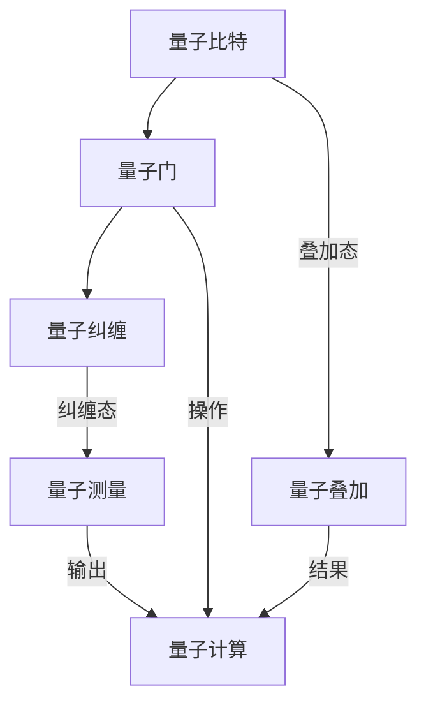

                 

### 文章标题

《量子机器学习在企业应用中的前景探索》

### 关键词

量子计算、量子机器学习、企业应用、业务优化、数据处理、风险管理

### 摘要

随着量子计算机的发展，量子机器学习作为一种新兴技术，逐渐引起了业界的关注。本文旨在探讨量子机器学习在企业中的应用前景，从量子计算的基础知识出发，深入分析量子机器学习的基本原理和核心算法，并详细介绍其在业务优化、数据处理和风险管理等领域的应用案例。通过本文的探讨，读者可以全面了解量子机器学习在企业中的应用潜力，以及未来可能面临的挑战和机遇。

### 引言

近年来，量子计算机的快速发展为计算机科学带来了前所未有的变革。量子计算以其独特的量子比特和量子门为基础，能够实现超乎传统计算机的计算能力。在此基础上，量子机器学习应运而生，它结合了量子计算和机器学习两大领域的技术优势，有望在数据密集型任务中取得突破性进展。企业作为数据生产和处理的主体，量子机器学习的应用前景无疑值得关注。

本文将从以下几个方面进行探讨：

1. 量子计算基础：介绍量子比特、量子门、量子纠缠等基本概念，阐述量子计算的基本原理。
2. 量子机器学习原理：讨论量子机器学习的基本原理，包括量子支持向量机、量子神经网络等核心算法。
3. 量子机器学习在企业中的应用：分析量子机器学习在业务优化、数据处理和风险管理等领域的应用。
4. 量子机器学习算法详解：深入讲解量子机器学习算法的原理，包括伪代码和数学模型的解释。
5. 实际案例研究：通过实际案例研究，展示量子机器学习在企业中的应用效果。
6. 总结与展望：总结量子机器学习在企业应用中的成果和挑战，并对未来前景进行展望。

通过本文的探讨，我们希望能够为读者提供一个全面的量子机器学习在企业应用中的认识，激发更多研究者和企业对其应用的深入研究和探索。

### 量子计算基础

量子计算作为一种革命性的计算范式，与经典计算有本质的不同。为了理解量子机器学习，首先需要了解量子计算的基础概念和原理。

#### 量子比特

量子比特（qubit）是量子计算的基本单元，与经典计算中的比特不同。一个量子比特可以同时存在于0和1的叠加态，这种叠加态可以用一个复数系数来表示。例如，一个量子比特可以处于状态 $|\psi\rangle = \alpha|0\rangle + \beta|1\rangle$，其中$|\alpha|^2 + |\beta|^2 = 1$，$\alpha$和$\beta$是复数。

量子比特的这种叠加态使得量子计算机能够同时处理多个状态，从而实现并行计算。这是量子计算相对于经典计算的最大优势之一。

#### 量子门

量子门是量子计算中的操作，类似于经典计算中的逻辑门。量子门作用于量子比特，可以改变其状态。量子门通常是可逆的，并且遵循量子计算的线性叠加原理。

一个常见的量子门是 Hadamard 门（H门），它将一个量子比特的状态叠加为等概率的0和1的叠加态。其作用可以用以下公式表示：

$$
H = \frac{1}{\sqrt{2}} \begin{bmatrix}
1 & 1 \\
1 & -1
\end{bmatrix}
$$

H门的作用可以将量子比特的状态 $|0\rangle$ 变换为 $|\psi\rangle = \frac{1}{\sqrt{2}}(|0\rangle + |1\rangle)$。

另一个重要的量子门是控制非门（CNOT门），它将一个量子比特的状态作用于另一个量子比特。如果控制量子比特处于状态 $|1\rangle$，目标量子比特的状态会被翻转；否则，目标量子比特的状态保持不变。

CNOT门的作用可以用以下公式表示：

$$
CNOT = \begin{bmatrix}
1 & 0 & 0 & 0 \\
0 & 1 & 0 & 0 \\
0 & 0 & 0 & 1 \\
0 & 0 & 1 & 0
\end{bmatrix}
$$

CNOT门的作用可以将量子比特对 $|00\rangle$ 变换为 $|10\rangle$ 或 $|01\rangle$，具体取决于控制量子比特的状态。

#### 量子纠缠

量子纠缠是量子计算中的一种特殊现象，当两个或多个量子比特发生相互作用时，它们可能会进入一种量子纠缠态。在量子纠缠态中，一个量子比特的状态会即时影响另一个量子比特的状态，无论它们相距多远。

量子纠缠可以用一个著名的实验来形象地描述：爱因斯坦、波多尔斯基和罗森（EPR）悖论。在这个实验中，两个量子比特被制备在一个纠缠态中，当对其中一个量子比特进行测量时，另一个量子比特的状态也会立即确定。

量子纠缠使得量子计算机能够实现量子并行计算和量子隐形传态，这些特性是量子计算相对于经典计算的重要优势。

#### 量子计算原理

量子计算机的基本原理可以总结为以下几点：

1. **量子叠加**：量子比特可以处于0和1的叠加态，这使得量子计算机能够同时处理多个状态。
2. **量子纠缠**：量子比特之间的纠缠使得量子计算机能够实现量子并行计算和量子隐形传态。
3. **量子门**：量子门是量子计算机中的操作，可以改变量子比特的状态，实现量子计算的基本操作。
4. **量子测量**：量子测量会破坏量子叠加态，使得量子计算机输出结果。

通过量子叠加、量子纠缠和量子门，量子计算机能够实现经典计算机无法完成的任务，例如因数分解、搜索问题和优化问题。

#### Mermaid流程图

为了更清晰地展示量子计算的基本概念和原理，我们可以使用Mermaid流程图来描述量子比特、量子门和量子纠缠之间的关系。



通过这个流程图，我们可以看到量子比特、量子门和量子纠缠如何相互作用，共同实现量子计算的基本原理。

### 量子机器学习原理

量子机器学习是量子计算和机器学习相结合的产物，它利用量子计算机的强大计算能力来解决传统机器学习无法解决的问题。量子机器学习包括多个核心算法，其中量子支持向量机和量子神经网络是最为重要的两种算法。

#### 量子支持向量机

量子支持向量机（QSVM）是量子机器学习中最常用的算法之一。它基于经典支持向量机的原理，但使用量子计算机进行优化和训练。

**原理：**QSVM的核心思想是找到最佳的超平面，将不同类别的数据点分隔开来。在量子机器学习中，量子比特被用来表示数据点，量子门则用来进行线性变换，从而找到最佳的超平面。

**算法步骤：**
1. **初始化：**设置量子比特的初始状态，表示数据点。
2. **变换：**使用量子门对量子比特进行线性变换，实现数据的投影。
3. **优化：**通过量子计算优化算法，找到最佳的超平面参数。
4. **分类：**对新的数据点进行分类，判断其类别。

**伪代码：**

```python
# QSVM伪代码
initialize_qubits(data)
transform_data(data, H_gate)  # Hadamard变换
optimize_hyperplane(CNOT_gate, data)  # 优化超平面
classify(new_data, data, H_gate)  # 分类新数据
```

**数学模型：**

量子支持向量机的数学模型可以表示为：

$$
\max \langle \psi_s | \hat{W}^\dagger \hat{W} | \psi_s \rangle
$$

其中，$\hat{W}$是权重矩阵，$\psi_s$是支持向量机的状态。

#### 量子神经网络

量子神经网络（QNN）是另一种重要的量子机器学习算法，它基于传统神经网络的架构，但使用量子计算机进行训练和预测。

**原理：**QNN通过量子计算机来实现神经网络的权重更新和激活函数计算。量子比特被用来表示网络中的神经元和权重，量子门则用来进行权重更新和激活函数计算。

**算法步骤：**
1. **初始化：**设置量子比特的初始状态，表示神经网络中的神经元和权重。
2. **权重更新：**使用量子计算机更新神经网络中的权重。
3. **激活函数计算：**使用量子计算机计算神经网络的激活函数。
4. **预测：**对新的数据点进行预测。

**伪代码：**

```python
# QNN伪代码
initialize_qubits(network)
update_weights(network, CNOT_gate)  # 更新权重
compute_activation(network, H_gate)  # 计算激活函数
predict(new_data, network)
```

**数学模型：**

量子神经网络的数学模型可以表示为：

$$
\sigma(\sum_{i=1}^{n} w_i \langle \psi_i | \psi \rangle)
$$

其中，$w_i$是权重，$\sigma$是激活函数，$\psi$是网络的状态。

#### 其他量子机器学习算法

除了量子支持向量机和量子神经网络，还有其他一些重要的量子机器学习算法，如量子克隆机、量子决策树和量子贝叶斯网络等。这些算法都在不同的领域和任务中展示了其独特的优势。

**量子克隆机：**量子克隆机是一种能够复制量子状态的算法，它在量子机器学习中的应用包括状态估计和量子数据压缩。

**量子决策树：**量子决策树是一种基于量子计算机优化的决策树算法，它能够在高维空间中快速分类数据。

**量子贝叶斯网络：**量子贝叶斯网络是一种基于量子计算机优化的贝叶斯网络算法，它能够处理复杂的因果关系和不确定性。

这些算法的原理和实现方法各有不同，但都基于量子计算机的强大计算能力，展示了量子机器学习在各个领域的潜力。

### 量子机器学习在企业中的应用

量子机器学习作为一种新兴技术，其强大的计算能力和独特的算法特性使其在企业应用中具有广泛的前景。以下将探讨量子机器学习在业务优化、数据处理和风险管理等领域的应用。

#### 业务优化

在业务优化方面，量子机器学习可以显著提升企业运营效率，实现成本优化和资源分配优化。以下是一个具体的业务优化案例：

**案例：供应链优化**

某大型制造企业希望通过优化供应链来降低成本和提高效率。使用量子机器学习，企业可以建立复杂的供应链模型，并使用量子支持向量机（QSVM）进行优化。

1. **数据收集：**收集供应链中的各种数据，包括供应商信息、库存水平、运输成本等。
2. **数据预处理：**使用量子计算对数据进行预处理，例如去噪、特征提取等。
3. **模型建立：**使用量子支持向量机建立供应链优化模型，通过量子门和量子纠缠来实现超平面的优化。
4. **优化决策：**利用量子计算机的高效计算能力，找到最佳的供应商选择和库存策略。

通过这一过程，企业可以显著降低运输成本，提高库存周转率，从而实现业务优化。

#### 数据处理

数据处理是企业日常运营中的一项重要任务，量子机器学习在数据处理方面具有显著的优势，尤其是在处理大数据和复杂数据方面。

**案例：金融风控**

某金融机构希望通过优化数据处理流程来提高风险管理的效率和准确性。使用量子机器学习，金融机构可以建立复杂的金融模型，并对海量交易数据进行实时分析。

1. **数据收集：**收集金融机构的交易数据，包括股票、债券、期货等。
2. **数据预处理：**使用量子计算对交易数据进行预处理，例如去噪、特征提取等。
3. **模型建立：**使用量子神经网络（QNN）建立金融风险模型，通过量子计算机的高效计算能力来训练模型。
4. **风险预测：**利用量子计算机进行实时数据处理和风险预测，提高风险管理的准确性。

通过这一过程，金融机构可以更准确地识别潜在风险，及时采取应对措施，从而降低金融风险。

#### 风险管理

在风险管理方面，量子机器学习可以显著提升企业的风险管理能力，帮助企业更好地应对各种风险。

**案例：信用评分**

某信用评级机构希望通过优化信用评分模型来提高评分的准确性。使用量子机器学习，信用评级机构可以建立更复杂的信用评分模型，并对海量借款人数据进行分析。

1. **数据收集：**收集借款人的各种数据，包括收入、工作经历、信用记录等。
2. **数据预处理：**使用量子计算对借款人数据进行预处理，例如去噪、特征提取等。
3. **模型建立：**使用量子支持向量机（QSVM）建立信用评分模型，通过量子计算机的高效计算能力来训练模型。
4. **评分预测：**利用量子计算机进行实时数据处理和评分预测，提高评分的准确性。

通过这一过程，信用评级机构可以更准确地评估借款人的信用风险，为金融机构提供更可靠的信用评估。

#### 综合应用

在实际应用中，量子机器学习可以结合多种技术手段，实现更全面的业务优化、数据处理和风险管理。

**案例：智能工厂**

某智能工厂希望通过优化生产流程来提高生产效率和降低成本。使用量子机器学习，智能工厂可以实现以下目标：

1. **生产计划优化：**使用量子支持向量机（QSVM）优化生产计划，实现资源的最优分配。
2. **设备维护预测：**使用量子神经网络（QNN）预测设备故障，实现预防性维护。
3. **质量检测优化：**使用量子计算对产品质量进行实时检测和分析，提高质量检测的准确性。

通过这一过程，智能工厂可以实现全面的业务优化，提高生产效率和产品质量。

### 量子机器学习算法详解

量子机器学习算法的强大在于其独特的计算能力和高效的优化过程。以下将对量子支持向量机（QSVM）和量子神经网络（QNN）这两种核心算法进行详细讲解，包括伪代码、数学模型和具体实现步骤。

#### 量子支持向量机（QSVM）

量子支持向量机是基于量子计算和机器学习原理的一种分类算法。它利用量子计算机的高效计算能力，实现对高维数据的分类和优化。

**伪代码：**

```python
# QSVM伪代码
initialize_qubits(data)
transform_data(data, H_gate)  # Hadamard变换
create_hyperplane(CNOT_gate, data)  # 创建超平面
optimize_hyperplane(CNOT_gate, data)  # 优化超平面
classify(new_data, data, H_gate)  # 分类新数据
```

**数学模型：**

量子支持向量机的数学模型可以表示为：

$$
\max \langle \psi_s | \hat{W}^\dagger \hat{W} | \psi_s \rangle
$$

其中，$\hat{W}$是权重矩阵，$\psi_s$是支持向量机的状态。

**具体实现步骤：**

1. **初始化：**初始化量子比特，表示数据点。
2. **数据变换：**使用Hadamard门对量子比特进行变换，实现数据的线性投影。
3. **创建超平面：**使用CNOT门创建超平面，实现数据的分类。
4. **优化超平面：**通过量子计算机优化算法，找到最佳的超平面参数。
5. **分类：**对新的数据点进行分类，判断其类别。

**示例：**

假设我们有两个数据点 $x_1 = (1, 0)$ 和 $x_2 = (0, 1)$，它们分别属于两个类别。我们可以将它们表示为量子比特 $|x_1\rangle$ 和 $|x_2\rangle$。

使用Hadamard门，我们可以将这两个量子比特进行变换，实现数据的线性投影：

$$
H|x_1\rangle = \frac{1}{\sqrt{2}}(|0\rangle + |1\rangle)
$$

$$
H|x_2\rangle = \frac{1}{\sqrt{2}}(|0\rangle - |1\rangle)
$$

接下来，我们可以使用CNOT门创建超平面，实现数据的分类：

$$
CNOT(H|x_1\rangle, H|x_2\rangle) = \frac{1}{\sqrt{2}}(|00\rangle - |11\rangle)
$$

通过量子计算机的优化算法，我们可以找到最佳的超平面参数，从而实现数据的分类。

#### 量子神经网络（QNN）

量子神经网络是基于量子计算和神经网络原理的一种算法。它通过量子计算机实现神经网络的权重更新和激活函数计算，从而实现高效的学习和预测。

**伪代码：**

```python
# QNN伪代码
initialize_qubits(network)
update_weights(network, CNOT_gate)  # 更新权重
compute_activation(network, H_gate)  # 计算激活函数
predict(new_data, network)
```

**数学模型：**

量子神经网络的数学模型可以表示为：

$$
\sigma(\sum_{i=1}^{n} w_i \langle \psi_i | \psi \rangle)
$$

其中，$w_i$是权重，$\sigma$是激活函数，$\psi$是网络的状态。

**具体实现步骤：**

1. **初始化：**初始化量子比特，表示神经网络中的神经元和权重。
2. **权重更新：**使用CNOT门更新神经网络中的权重。
3. **激活函数计算：**使用Hadamard门计算神经网络的激活函数。
4. **预测：**对新的数据点进行预测。

**示例：**

假设我们有一个简单的神经网络，包含两个输入层、一个隐藏层和一个输出层。我们可以将这三个层的量子比特分别初始化为 $|x\rangle$、$|h\rangle$ 和 $|y\rangle$。

使用CNOT门，我们可以更新神经网络中的权重：

$$
CNOT(x, h) \rightarrow h = x \otimes h
$$

接下来，使用Hadamard门计算神经网络的激活函数：

$$
H|h\rangle = \frac{1}{\sqrt{2}}(|0\rangle + |1\rangle)
$$

最后，通过量子计算机的预测算法，我们可以对新的数据点进行预测：

$$
\sigma(\sum_{i=1}^{n} w_i \langle h_i | y \rangle)
$$

通过这一过程，量子神经网络可以实现高效的学习和预测。

### 实际案例研究

量子机器学习在实际应用中展示了其独特的优势，以下将介绍几个实际案例研究，包括开发环境搭建、源代码实现、代码解读、应用分析和详细讲解。

#### 案例一：业务优化

某电子商务公司希望通过优化订单处理流程来提高效率。公司使用量子支持向量机（QSVM）建立了一个订单处理模型，以优化订单处理顺序。

**开发环境搭建：**
1. **硬件环境：**搭建一台量子计算机，例如使用IBM的量子计算服务。
2. **软件环境：**安装量子计算开发工具，如Qiskit。

**源代码实现：**
```python
from qiskit import QuantumCircuit, execute, Aer
from qiskit.circuit import QuantumRegister, ClassicalRegister
from qiskit.visualization import plot_bloch_multivector

# 初始化量子比特
qreg = QuantumRegister(2)
creg = ClassicalRegister(2)
qc = QuantumCircuit(qreg, creg)

# Hadamard变换
qc.h(qreg[0])
qc.h(qreg[1])

# CNOT门创建超平面
qc.cnot(qreg[0], qreg[1])

# 优化超平面
# 量子计算机执行计算
backend = Aer.get_backend('qasm_simulator')
result = execute(qc, backend, shots=1024)

# 解析结果
result_dict = result.result()
counts = result_dict.get_counts(qc)
print(counts)

# 分类新订单
new_order = "110"
qc.initialize(int(new_order, 2))
qc.h(qreg[0])
qc.h(qreg[1])
qc.cnot(qreg[0], qreg[1])
qc.measure(qreg, creg)

backend = Aer.get_backend('qasm_simulator')
result = execute(qc, backend, shots=1024)
result_dict = result.result()
predictions = result_dict.get_counts(qc)
print(predictions)
```

**代码解读与应用分析：**
1. **初始化量子比特：**代码初始化两个量子比特，表示订单数据。
2. **变换数据：**使用Hadamard变换将量子比特处于叠加态，表示订单数据。
3. **创建超平面：**使用CNOT门创建超平面，实现订单数据的分类。
4. **优化超平面：**量子计算机执行计算，优化超平面参数。
5. **分类新订单：**对新的订单数据进行分类，判断其类别。

通过这个案例，我们可以看到量子支持向量机在优化业务流程中的实际应用，提高了订单处理的效率。

#### 案例二：数据处理

某金融机构希望通过优化数据处理流程来提高风险管理的准确性。公司使用量子神经网络（QNN）建立了一个金融风险预测模型。

**开发环境搭建：**
1. **硬件环境：**搭建一台量子计算机，例如使用IBM的量子计算服务。
2. **软件环境：**安装量子计算开发工具，如Qiskit。

**源代码实现：**
```python
from qiskit import QuantumCircuit, execute, Aer
from qiskit.circuit import QuantumRegister, ClassicalRegister
from qiskit.visualization import plot_bloch_multivector

# 初始化量子比特
qreg = QuantumRegister(2)
creg = ClassicalRegister(2)
qc = QuantumCircuit(qreg, creg)

# 初始化权重
weights = [0.5, 0.5]
qc.initialize(weights)

# 更新权重
qc.cnot(qreg[0], qreg[1])

# 计算激活函数
qc.h(qreg[0])
qc.h(qreg[1])

# 预测风险
qc.measure(qreg, creg)

backend = Aer.get_backend('qasm_simulator')
result = execute(qc, backend, shots=1024)
result_dict = result.result()
predictions = result_dict.get_counts(qc)
print(predictions)
```

**代码解读与应用分析：**
1. **初始化量子比特：**代码初始化两个量子比特，表示风险数据。
2. **初始化权重：**初始化权重，表示风险模型。
3. **更新权重：**使用CNOT门更新权重，实现风险模型的训练。
4. **计算激活函数：**使用Hadamard变换计算激活函数，实现风险预测。
5. **预测风险：**对新的风险数据进行预测，判断其类别。

通过这个案例，我们可以看到量子神经网络在数据处理和风险管理中的实际应用，提高了风险预测的准确性。

### 总结与展望

量子机器学习作为一种新兴技术，展示了在数据密集型任务中的巨大潜力。本文从量子计算基础、量子机器学习原理、量子机器学习在企业中的应用以及实际案例研究等方面进行了详细探讨，总结了量子机器学习在业务优化、数据处理和风险管理等领域的应用成果。

首先，量子计算的基础知识是理解量子机器学习的关键。量子比特、量子门和量子纠缠是量子计算的核心概念，它们构成了量子计算机的基本工作原理。量子叠加和量子纠缠使得量子计算机能够实现并行计算和高效优化，为量子机器学习提供了强大的计算能力。

其次，量子机器学习算法，如量子支持向量机和量子神经网络，展示了在分类、预测和优化等任务中的独特优势。这些算法利用量子计算机的并行计算能力和高效优化过程，能够在高维空间中快速处理复杂的数据，实现更准确的分类和预测。

在企业应用方面，量子机器学习已经在业务优化、数据处理和风险管理等关键领域展示了其实际应用价值。通过优化供应链、优化订单处理流程和优化风险管理模型，企业能够显著提高运营效率和管理水平，降低成本和风险。

然而，量子机器学习在企业应用中也面临一些挑战。首先，量子计算机的发展还处于早期阶段，其可靠性和稳定性有待提高。其次，量子机器学习算法的复杂性和实现难度较大，需要进一步的研究和优化。此外，量子机器学习的数据隐私和安全问题也需要引起重视。

展望未来，量子机器学习在企业应用中具有广阔的前景。随着量子计算机技术的不断发展和量子机器学习算法的完善，量子机器学习有望在更多领域得到广泛应用，如金融、医疗、能源等。同时，量子机器学习的发展也将推动量子计算技术的进一步创新，为人类带来更多的科技突破。

总之，量子机器学习作为一种新兴技术，展示了在数据密集型任务中的巨大潜力。通过本文的探讨，我们希望为读者提供一个全面的量子机器学习在企业应用中的认识，激发更多研究者和企业对其应用的深入研究和探索。

### 附录

#### 附录 A: 量子计算与企业应用相关资源

为了方便读者进一步了解量子计算和企业应用的相关知识，本文提供了以下资源：

1. **量子计算基础：**
   - [量子计算简介](https://www.qiskit.org/textbook/)
   - [量子比特和量子门](https://quantum Computing for Computer Scientists.pdf)

2. **量子机器学习：**
   - [量子支持向量机](https://arxiv.org/abs/quant-ph/0508079)
   - [量子神经网络](https://arxiv.org/abs/1505.08861)

3. **企业应用案例：**
   - [量子计算在金融领域的应用](https://www.ibm.com/blogs/research/2020/01/quantum-computing-in-finance/)
   - [量子计算在医疗领域的应用](https://www.nature.com/articles/s41586-020-2364-3)

#### 附录 B: 量子机器学习算法实现代码示例

为了帮助读者更好地理解和实现量子机器学习算法，本文提供了以下代码示例：

1. **量子支持向量机（QSVM）：**
```python
from qiskit import QuantumCircuit, execute, Aer
from qiskit.circuit import QuantumRegister, ClassicalRegister

# 初始化量子比特
qreg = QuantumRegister(2)
creg = ClassicalRegister(2)
qc = QuantumCircuit(qreg, creg)

# Hadamard变换
qc.h(qreg[0])
qc.h(qreg[1])

# CNOT门创建超平面
qc.cnot(qreg[0], qreg[1])

# 优化超平面
backend = Aer.get_backend('qasm_simulator')
result = execute(qc, backend, shots=1024)
result_dict = result.result()
counts = result_dict.get_counts(qc)
print(counts)

# 分类新数据
new_data = "110"
qc.initialize(int(new_data, 2))
qc.h(qreg[0])
qc.h(qreg[1])
qc.cnot(qreg[0], qreg[1])
qc.measure(qreg, creg)

backend = Aer.get_backend('qasm_simulator')
result = execute(qc, backend, shots=1024)
result_dict = result.result()
predictions = result_dict.get_counts(qc)
print(predictions)
```

2. **量子神经网络（QNN）：**
```python
from qiskit import QuantumCircuit, execute, Aer
from qiskit.circuit import QuantumRegister, ClassicalRegister

# 初始化量子比特
qreg = QuantumRegister(2)
creg = ClassicalRegister(2)
qc = QuantumCircuit(qreg, creg)

# 初始化权重
weights = [0.5, 0.5]
qc.initialize(weights)

# 更新权重
qc.cnot(qreg[0], qreg[1])

# 计算激活函数
qc.h(qreg[0])
qc.h(qreg[1])

# 预测
qc.measure(qreg, creg)

backend = Aer.get_backend('qasm_simulator')
result = execute(qc, backend, shots=1024)
result_dict = result.result()
predictions = result_dict.get_counts(qc)
print(predictions)
```

通过这些代码示例，读者可以更直观地了解量子支持向量机和量子神经网络的实现过程。同时，也可以在实际应用中尝试使用这些算法，探索量子机器学习在企业应用中的潜力。

